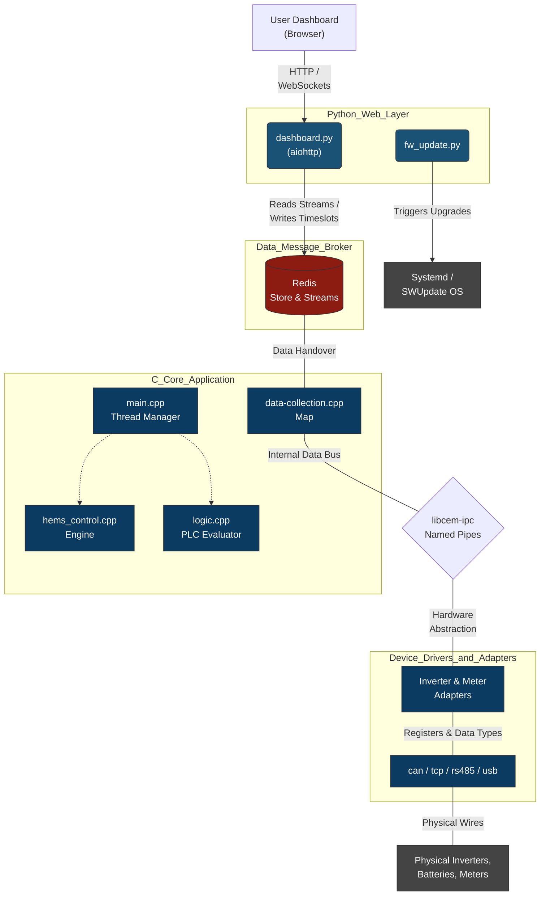
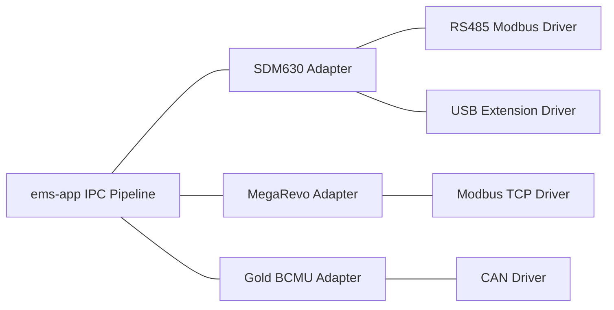

# Detailed System Design Document: Customer Energy Management System (CEMS)

## 1. Executive Summary
The Customer Energy Management System (CEMS) is a specialized robust industrial firmware stack designed to operate on i.MX93 embedded Linux platforms. Engineered to orchestrate power grids, commercial inverters, distributed battery banks, and multi-phase metering equipment, the platform relies natively on high-performance C++ (`ems-app`) combined with a Python asynchronous web server (`ems-monitor`) for telemetry representation.

This document serves as an exhaustive blueprint detailing architectural composition, IPC methodologies, data resolution loops, memory structures, and protocol abstractions implemented throughout the application.

---

## 2. High-Level Architecture

The software is structured in a microservice-like abstraction bound together by `libcem-ipc` named pipes internally and a standard Redis broker externally to isolate data pipelines, protocol handovers, and user interfaces.

---

## 3. Core Subsystem: `ems-app`
The `ems-app` is written natively in C++ utilizing POSIX threading and mutexes to ensure highly concurrent parallel operations across multiple phases without halting the main CPU. 

### 3.1 Startup and Threading Model (`main.cpp`)
On boot, `ems-app.service` launches the binary which initiates multiple specialized pthreads via `main.cpp`:
1. **`systime_update_task`**: Synchronizes local device Real-Time Clocks.
2. **`gpio_task`**: Monitors expansion board I/Os and visual device states (LEDs).
3. **`redis_manager_task`**: Handles connections to localhost Redis, flushing data to memory mappings across Streams.
4. **`pl_task`**: The Programmable Logic task evaluating boolean/math equations dynamically.
5. **`hems_control_task`**: The heavy-lifting energy load balancing loop running evaluation sweeps indefinitely.

### 3.2 IPC Mechanism (`libcem-ipc.so`)
To make the codebase fully agnostic of specific equipment crashes or hung protocols, devices speak to the core via **Named Pipes (FIFOs)** managed by the `CEMIpc` class (`cem-ipc.cpp`).
- `ipc_create` initializes explicit OS-level buffers (`/tmp/ipc/...`) designated as `CLIENT` or `SERVER`.
- Data flows as packed serialized telemetry strings. The design strictly decouples hardware connectivity execution from state execution. A hung Modbus-TCP slave cannot crash the primary `ems-app` evaluation loop.

### 3.3 Programmable Logic Controller Engine (`logic.cpp`)
To support evolving edge conditions, the project features an ST (Structured Text) evaluator acting effectively as an embedded PLC. 
Administrators compile equations mapping internal components (e.g., limits, current draws). The logic loop continuously parses:
- **Gates:** `AND`, `OR`, `NAND`, `NOR`, `XOR`, `XNOR`
- **Math/Comparators:** `GT` (Greater Than), `LT`, `MIN`, `MAX`, `ADD`, `DIV`, `MUL`
- **Castings:** `USINT_TO_BOOL`, `UDINT_TO_DINT`

Using `logic_data` multi-phase mutexed memory blocks (`MAX_PHASES = 3`), gates flip internal memory pointers that map implicitly to `hems_control` pointers.

---

## 4. Energy Load Balancing Engine (`hems_control.cpp`)

The system balances dynamic power limits, external constraints, and internal grid goals concurrently, utilizing specific control strategies evaluated in a 2-second loop.

### 4.1 Redis Timeslot Evaluation and Precedence
A fundamental mechanism of the system is evaluating schedules set by the user (`hems_timeslot_t`) through Redis. A timeslot has specific constraints for Import, Export, and targeted Power Goals. Constraints execute inside an order-of-operations clamp to protect hardware (`clamp_desired_goals_to_bounds`):
1. **Limits override Constraints.** Hardware `minPowerLimit` & `maxPowerLimit` guarantee minimum baselines that cannot be bypassed.
2. **Constraints override Goals.** Operational ranges clamp user/cloud directed performance Goals.
3. *Final Guarantees Ensure* `minGoal <= maxGoal`.

### 4.2 Algorithm: Mode Decision Engine (`compute_mode_and_power`)
Once the target boundary goals are established, the system distributes the strategy across the three physical phases globally. The system explicitly relies on 4 primary Operation Modes (`OpMode`):

*   **IDLE (OpMode 0x00):** 
    The default fallback state. If no active timeslots dictate boundaries, the system defaults to Idle, effectively bypassing power overrides and defaulting all goals to zero.
*   **ECO_BALANCING (OpMode 0x03):** 
    Triggered explicitly when `minPowerGoal == 0` & `maxPowerGoal == 0`. Outputs exactly zero watts to all phases, designed to hold the grid connection steady without import/export.
*   **CHARGING (OpMode 0x01):** 
    Triggered when boundaries strictly demand import. Specifically, if `(maxPowerGoal > 0) && (minPowerGoal == maxPowerGoal)`. The request is proportionally divided across generated phases: `maxPowerGoal / num_phases`.
*   **DISCHARGING (OpMode 0x02):** 
    Triggered when boundaries strictly demand export. Specifically, if `(minPowerGoal < 0) && (maxPowerGoal == minPowerGoal)`. The request is equally sliced: `minPowerGoal / num_phases`.

**Ranged Power Control (Variable Modes):**
When the `minPowerGoal` and `maxPowerGoal` differ (forming an acceptable window), the mode fluidly alternates between Charging and Discharging based on instantaneous real-word grid conditions (`total_grid_active_power`):
*   **Peak Shaving (Excess Grid Load):**
    If the absolute summation of real grid meter active power > `maxPowerGoal`, the algorithm switches to `DISCHARGING`. Crucially, it traverses Phases A, B, and C. Only phases where the specific phase load explicitly exceeds the average threshold trigger discharging offsets.
*   **Valley Filling (Missing Grid Load):**
    If `total_grid_active_power` < `minPowerGoal`, the algorithm switches to `CHARGING` to siphon power strictly from low-load phases.

### 4.3 Hardware Protection Strategies (Smart Power Controls)
Built into the algorithm are safety fallbacks polled continuously:
- `BAT_RampingSOC` overrides logic to enforce trickle limits.
- Minimum and Maximum Battery Voltage / Temperature differentials override generation limits, overriding `power_factor_control`.

---

## 5. Device Driver and Adapter Layer

The project employs an Adapter/Driver pattern to sanitize telemetry from disparate equipment vendors into a standardized dictionary recognized by the IPC pipeline. 

### 5.1 Protocol Specifics
The system abstracts physical interfaces using four primary drivers:
- **Modbus TCP**: Uses standard async sockets to poll IP-connected commercial inverters.
- **RS-485 Modbus**: Direct physical serial line interactions via `uart-driver` (e.g., `/dev/ttyS*`). Polling cycles manipulate endianness and parse Float32/UInt16 formats directly inside specific target adapters.
- **USB (Extension Board)**: External USB strings bridging to serial operate via `extension-board-driver`. The i.MX93 interacts with an STM32 coprocessor via SPI, handling UART-to-USB handshakes natively to offload physical polling wait times from the main CPU.
- **CAN**: Deployed largely for Battery Controller Units (BCMU). Captures asynchronous streaming parameters (Cell Voltages, System SoC) rather than utilizing request/response loops.

### 5.2 Dynamic Memory Linking (`data-collection.cpp` and `topology_builder.cpp`)
User configurations originate from `/etc/ems-app-support/EMS.json`. 
`collect_device_data()` recursively discovers linked parameters (such as `link-inverter-id`) mapping physical IDs to virtual memory arrays. 

**Topology Extraction (`topology_builder.cpp`):**
A unique feature of the firmware is generating ecosystem relationships natively from C++ returning raw JSON node mappings (Nodes matching instances, Edges depicting hardware linking) stored efficiently to represent the digital twin in the user space.

---

## 6. Dashboard Middleware (`ems-monitor`)

To abstract UI complexity from C++, a localized Python runtime (`aiohttp`) serves as the dashboard rendering engine mapping real-time streams to client browsers.

### 6.1 Real-time Redis Telemetry Encoding
The C++ core pumps real-time observations into distinct Redis Streams (`meters_stream`, `inverters_stream`, `battery_stream`, `mppts_stream`). 
To heavily conserve memory, C++ generates a raw encoding format parsing back out in `dashboard.py`:

*   **`device_trait_id` Bitmasking**: `(device_id << 32) | trait_id`
*   **`trait_id` Data Encodings**: `(data_type << 24) | (phase << 16) | offset`
    *   **Data Types:** `0x01` Meter/Measurements, `0x02` Inverter Status, `0x05` Battery Vectors.
    *   **Phases:** `0x00` Phase A, `0x01` Phase B, `0x02` Phase C
    *   **Offsets:** Represents standard index mapping (0=Voltage, 1=Current, 2=Power, 3=Reactive, etc.)

`dashboard.py` parses these offset metrics, multiplies appropriate fractional values (milli-measurements / 1000.0) and emits WebSocket JSON `inverter_data` packets handling decayed fields via timestamp mappings so offline devices fall gracefully back to default `null` thresholds.

### 6.2 Frontend Architecture
The Web Dashboard serves responsive HTML pages (`templates/*.html`), augmented by custom Vanilla JS and Vanilla CSS. Key panels include:
- Multi-Device Flow overview (Live PV, Battery, Grid graphics).
- Three Phase Power Comparisons (Phase A vs Phase B vs Phase C split).
- Programmable Time Slot inputs seamlessly translated into `hems_timeslot_t` JSONs sent back to Redis limits.

### 6.3 Secure Firmware Upgrades (`fw_update.py`)
Provides isolated API endpoints bypassing standard UI for OS manipulation. It locks operations atomically using an `O_CREAT | O_EXCL` UNIX file lock at `/tmp/update_lock.lock` removing race conditions. It handles downloading SWUpdate root filesystem `.swu` elements directly and triggering `systemctl restart ems-app.service` post binary execution.

---

## 7. Security and Hardware Validation

### 7.1 Hardware Signature Matching
The firmware uses OTP (One-Time Programmable) fuses inside the i.MX93 chipset. The Python core specifically surveys `/sys/bus/nvmem/devices/fsb_s400_fuse0/nvmem` at offset `1504` to validate and extract the immutable silicon hardware string (e.g. `CEMS123456`) enforcing it on `EMS.json` ensuring configurations cannot be cloned arbitrarily to secondary non-authorized boards.

### 7.2 API Authorization
A hardened session middleware (`auth_middleware`) tracks active cookies tied mathematically back to SHA-256 hashed credentials situated in `auth.json`. This negates unauthorized extraction of live Modbus parameters bridging out to local LAN.
