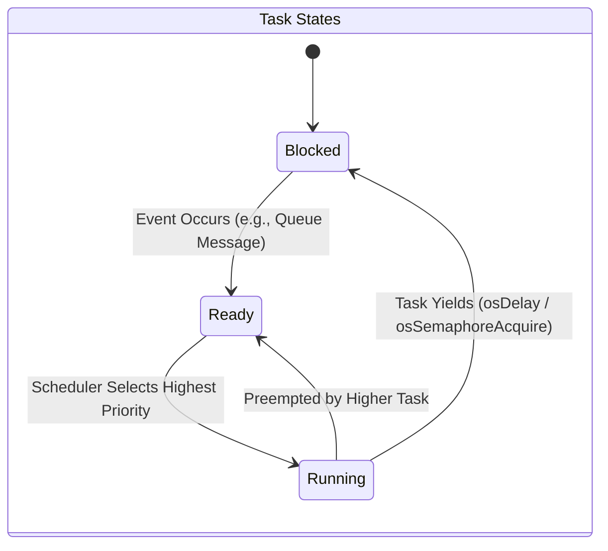
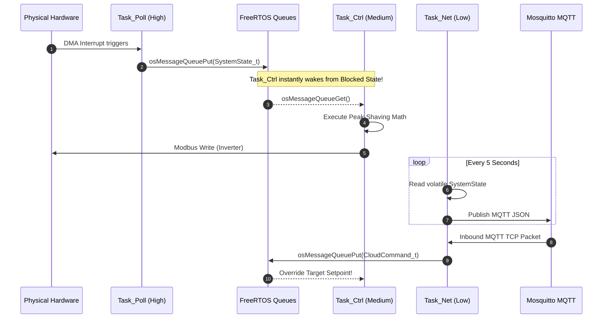
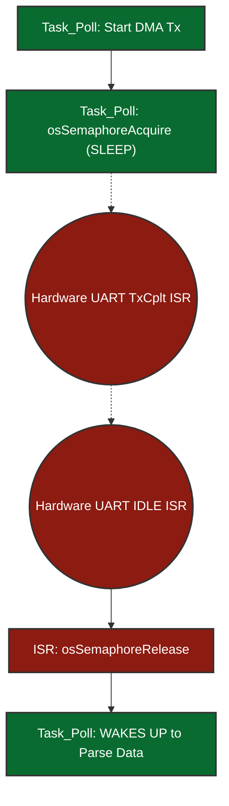
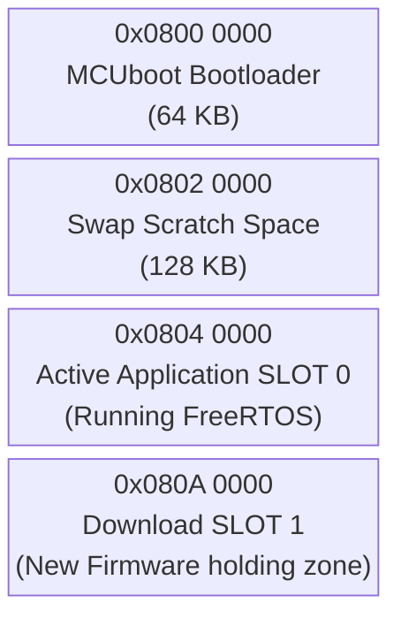
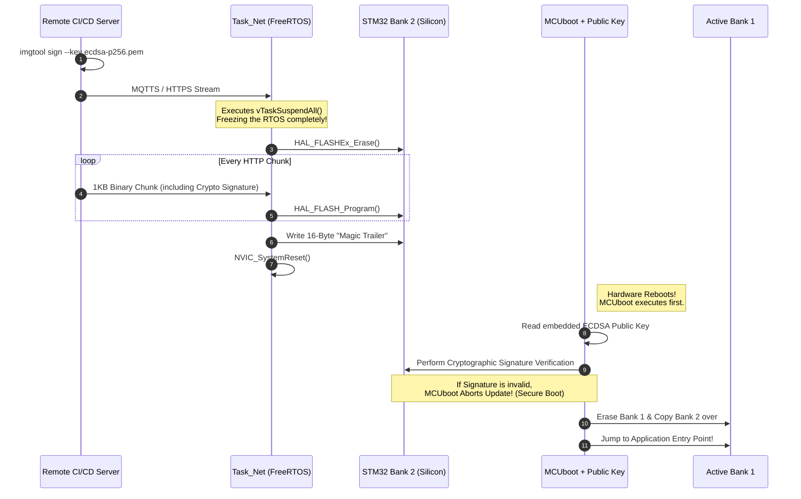
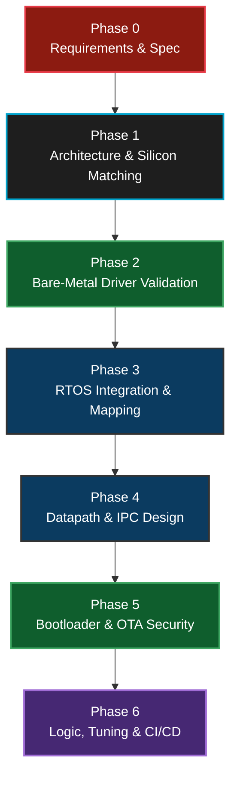
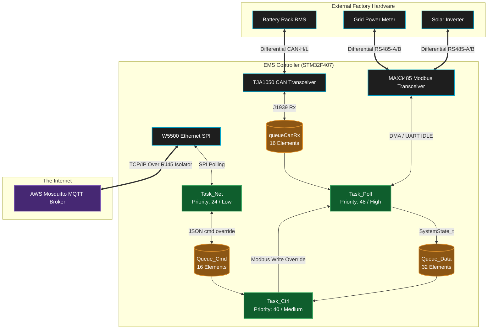

<div align="center">

# 🧠 EMS Mini RTOS: Advanced Developer Guide & Masterclass

**A comprehensive deep-dive into the FreeRTOS architecture, deterministic multitasking, and bare-metal STM32 hardware abstraction for the Energy Management System.**

---

</div>

## 📑 Table of Contents
1. [The Real-Time Philosophy](#1-the-real-time-philosophy)
2. [FreeRTOS Multitasking Topology](#2-freertos-multitasking-topology)
3. [Inter-Task Communication (IPC)](#3-inter-task-communication-ipc)
4. [Deferred Interrupt Processing (ISRs)](#4-deferred-interrupt-processing-isrs)
5. [Network Stack (WIZnet W5500 Hardware Offload)](#5-network-stack-wiznet-w5500-hardware-offload)
6. [Over-The-Air (OTA) Updates & Memory Protection](#6-over-the-air-ota-updates--memory-protection)
7. [The OS API Layer: Why CMSIS-RTOS v2?](#7-the-os-api-layer-why-cmsis-rtos-v2)
8. [FreeRTOS Feature Checklist](#8-freertos-feature-checklist)
9. [Unused FreeRTOS Features](#9-unused-freertos-features)
10. [Project Design & Team Methodology](#10-project-design--team-methodology)
11. [Testing, Mocking & Static Analysis](#11-testing-mocking--static-analysis)
12. [Toolchain & Advanced Debugging Stack](#12-toolchain--advanced-debugging-stack)
13. [Hardware Selection: Why the STM32F407?](#13-hardware-selection-why-the-stm32f407)
14. [Estimated Hardware & Bill of Materials (BOM) Cost](#14-estimated-hardware--bill-of-materials-bom-cost)
15. [C Code to Silicon: The Build Flow & Linker Mapping](#15-c-code-to-silicon-the-build-flow--linker-mapping)
16. [The System Boot Flow & Timings](#16-the-system-boot-flow--timings)
17. [High-Level Architecture & Hardware Schematics](#17-high-level-architecture--hardware-schematics)
18. [Major Challenges & Solutions](#18-major-challenges--solutions)
19. [Efficiency, Optimizations & Memory Footprint](#19-efficiency-optimizations--memory-footprint)
20. [System Reliability & Product Safety](#20-system-reliability--product-safety)
21. [Potential Questions & Answers](#21-potential-questions--answers)

---

## 1. The Real-Time Philosophy

Unlike traditional Linux environments (e.g., the `ems-app` running on i.MX93) which rely on the non-deterministic Completely Fair Scheduler (CFS), the **EMS Mini RTOS** operates in a strictly constrained environment designed for **hard real-time** execution.

With only **192 KB of RAM** and **1 MB of Flash**, we cannot afford polling loops (`while(1)`) that block the CPU. Instead, we rely on an **Event-Driven, Interrupt-Backed, DMA-Assisted FreeRTOS Architecture.**

### Why RTOS instead of Bare-Metal (Super-Loop)?
A common question internally and during code reviews is: *"Why introduce the complexity of an RTOS? Why not just write standard bare-metal C code using a giant `while(1)` polling loop?"*

The answer lies in **Deterministic Decoupling**.

1. **The Polling Jitter Problem:** In a bare-metal super-loop, the CPU must check every peripheral sequentially (e.g., `Read Grid Meter -> Read Battery -> Check MQTT -> Parse JSON`). If a network packet hangs and the TCP/IP stack takes 200ms to recover, or if building/parsing an MQTT payload blocks the CPU for 50ms, the entire loop freezes. This causes violent violations of strict timing protocols (e.g. Modbus 3.5 character idle frames) and causes immediate CAN bus mailbox starvation.
2. **Preemptive Prioritization:** FreeRTOS provides a "Preemptive Kernel". If the CPU is busy grinding through a lower-priority task like formatting a massive JSON payload from the Cloud (`Task_Net`), and a critical Modbus DMA timer expires (`Task_Poll`), FreeRTOS physically context-switches the CPU. It pauses the JSON parsing mid-instruction, hands 100% of the CPU to flush the physical Modbus queues, and then gracefully resumes the JSON parsing exactly where it left off. A bare-metal architecture cannot easily achieve this without unmaintainable "spaghetti" nested-interrupt state machines.
3. **Power & Thermal Efficiency:** A bare-metal super-loop constantly consumes 100% of the CPU clock cycles polling via `if (flag_ready)`. With FreeRTOS, tasks that are waiting for timeouts or hardware DMA signals enter the `Blocked` state. This automatically forces the FreeRTOS Scheduler into the `Idle Task`, which executes the native ARM assembly instruction `WFI` (Wait For Interrupt). This physically halts the ALU clock tree, dropping CPU power consumption to near zero when the system is purely waiting on physical hardware, extending component lifespan and improving thermal constraints.

### Hardware Profile: STM32F407VGT6
*   **Clock:** 168 MHz (via PLL)
*   **Industrial Bridges:** Modbus RTU (USARTs with DMA) & Battery BMS (Hardware CAN)
*   **Networking:** WIZnet W5500 via SPI (Offloaded TCP/IP Stack)

---

## 2. FreeRTOS Multitasking Topology

In FreeRTOS, tasks spend the vast majority of their lives in the **Blocked State**, consuming 0% CPU cycles until an external event (Interrupt, Timer, or Queue Message) wakes them up. We use **Strict Priority-Based Preemptive Scheduling**.



### 🧵 Task Breakdown

| Task Name | Priority | Core Responsibility | Typical State |
| :--- | :--- | :--- | :--- |
| **`Task_Poll`** | `High` (`osPriorityRealtime`) | **Hardware Interfacing & Data Harvesting:** Executes strict-timing polling loops on physical interfaces (RS-485 Modbus via DMA for Grid/Inverters, CAN bus for Battery BMS). It pulls raw electrical data, packages it into structs, and safely queues it up for the logic task. Needs the highest priority to prevent timing jitter and dropped hardware packets. | **Blocked** on `osDelay(300)` or `osSemaphoreAcquire` waiting for DMA completion. |
| **`Task_Ctrl`** | `Medium` (`osPriorityHigh`) | **Core EMS Decision Logic (The Brain):** Wakes up instantaneously the moment new hardware data arrives. Calculates power flow limits, executes localized safety failsafes, and runs deterministic peak-shaving formulas to actively command the inverter to charge or discharge. | **Blocked** indefinitely waiting on `osMessageQueueGet` for new telemetry. |
| **`Task_Net`** | `Low` (`osPriorityNormal`) | **Cloud Communication & MQTT IoT Bridge:** Handles all external internet communications. It serializes internal telemetry into JSON strings, publishes them to the Cloud broker via the SPI Ethernet chip, and listens for remote command overrides. Lowest priority ensures network slowdowns never stall physical safety limits. | **Blocked** on `osDelay(250)` or TCP Socket waits. |

**Task Implementation Pseudo-Code (`Task_Poll`):**
```c
// CMSIS-RTOS v2 Task Definitions
const osThreadAttr_t pollTask_attributes = {
  .name = "Task_Poll",
  .stack_size = 512 * 4, // 2048 Bytes allocated statically
  .priority = (osPriority_t) osPriorityRealtime,
};

void Start_Task_Poll(void *argument) {
  for(;;) {
    // 1. Kick off UART DMA to physical Grid Meter
    HAL_UART_Receive_DMA(&huart2, rx_buffer, sizeof(rx_buffer));
    
    // 2. Block until hardware DMA completes (Consumes 0% CPU!)
    osSemaphoreAcquire(dmaRxSemaphore, osWaitForever);
    
    // 3. Process Modbus data & Push struct to Queue
    SystemState_t new_state = parse_modbus_data(rx_buffer);
    osMessageQueuePut(Queue_DataHandle, &new_state, 0, 0);
    
    // 4. Yield CPU rigidly for 300ms polling cycle
    osDelay(300);
  }
}

// Triggered sequentially inside main()
osThreadNew(Start_Task_Poll, NULL, &pollTask_attributes);
```

> **Note on Naming & Priority Levels:** 
> Why is `osPriorityHigh` labeled as "Medium"? 
> The terms "High, Medium, Low" here represent the **relative priority within our application's 3-task hierarchy**, not the absolute OS priority logic. 
> To guarantee hardware polling *always* preempts the logic brain, we gave `Task_Poll` an objectively higher systemic priority (`osPriorityRealtime` = Priority 48). We gave the logic brain `Task_Ctrl` the next step down (`osPriorityHigh` = Priority 40), meaning it sits in the *middle* of our specific application stack. The cloud bridge `Task_Net` sits at the bottom (`osPriorityNormal` = Priority 24).
> This mapping ensures we establish a strict preemptive hierarchy customized to our precise needs.
> 
> **Why use 48, 40, and 24 instead of simply 1, 2, and 3?**
> We *could* assign FreeRTOS priorities 1, 2, and 3 directly, but we use the CMSIS v2 constants specifically for **future scalability**. 
> CMSIS intentionally leaves massive numerical "gaps" between priority tiers (e.g., jumping from 24 to 32 to 40). This borrows the logic of old-school BASIC programming (Line 10, Line 20). If we used priorities 1, 2, and 3, and months from now we needed to inject a new "Medium-High" task (e.g., `Task_RemoteEmergencyStop`) right between `Task_Ctrl` and `Task_Poll`, we would have to re-number and shift our entire RTOS priority map. 
> Because we used the CMSIS gaps, we can seamlessly insert that new task at Priority 44 without ever touching the configuration of `Task_Poll` (48) or `Task_Ctrl` (40).

---

## 3. Inter-Task Communication (IPC)

To prevent race conditions, tasks **never** access shared global variables directly. Instead, we use **FreeRTOS Message Queues** (`osMessageQueueNew`) to pass decoupled data structures by value.



### The Operational Queues & Data Structures

Our architecture relies on three explicit FreeRTOS Ring-Buffer Queues to manage data flow deterministically.

**Queue Creation & Routing Pseudo-Code:**
```c
// 1. Queue Handle Definitions
osMessageQueueId_t Queue_DataHandle;
const osMessageQueueAttr_t Queue_Data_attributes = { .name = "Queue_Data" };

// 2. Queue Allocation (During System Boot)
// Capacity: 32 elements deep. Element size: sizeof(SystemState_t)
Queue_DataHandle = osMessageQueueNew(32, sizeof(SystemState_t), &Queue_Data_attributes);

// 3. Task_Ctrl Intercepting the Queue
void Start_Task_Ctrl(void *argument) {
  SystemState_t system_state; // Local memory copy for isolation
  
  for(;;) {
    // 4. Block forever (0% CPU) until Task_Poll pushes new telemetry!
    if(osMessageQueueGet(Queue_DataHandle, &system_state, NULL, osWaitForever) == osOK) {
        
        // Data has seamlessly arrived by value!
        // Run strict safety limits and peak-shaving formulas
        run_peak_shaving_algorithm(&system_state);
        
        // Physically transmit hardware command back to inverter
        execute_inverter_command();
    }
  }
}
```

> **What does "16 Elements" actually mean in RAM?**
> A common misconception is that "16 Elements" means 16 blocks of huge 256-byte buffers.
> In FreeRTOS, an "element" is the exact `sizeof(YourStruct)`.
> For example, `CanFrame_t` contains an ID (4 bytes), an 8-byte payload array (8 bytes), a DLC length (1 byte), and a flag (1 byte)—roughly 14 to 16 bytes total with padding.
> Therefore, allocating **16 Elements** for the CAN queue consumes a remarkably tiny **~256 bytes of RAM total** `(16 loops * 16 bytes)`, NOT 4,096 bytes. FreeRTOS allocates this specific block of RAM completely statically upon booting, permanently eliminating memory fragmentation risks!

1. **`Queue_Data` (Bottom-Up Telemetry)**
   * **Capacity:** 32 Elements (`SystemState_t`)
   * **Function & Sizing Logic:** Pushed by `Task_Poll` directly to `Task_Ctrl`, it contains the unified picture of the system (Grid Watts, Battery SOC, existing hardware limits). A capacity of 32 provides massive safety mapping; if the Brain (`Task_Ctrl`) temporarily stalls doing heavy decision math, `Task_Poll` can queue up up to 32 independent polling loop snapshots before dropping data. Because `Task_Ctrl` is blocked with `osWaitForever` on this queue, the microsecond `Task_Poll` finishes assembling the Modbus/CAN telemetry and pushes to this queue, the logic brain awakens instantly.

2. **`Queue_Cmd` (Top-Down Overrides)**
   * **Capacity:** 16 Elements (`CloudCommand_t`)
   * **Function & Sizing Logic:** Pushed by `Task_Net` down to `Task_Ctrl`. When a remote user inputs a new command on the dashboard or issues a limit change via MQTT, `Task_Net` catches it on the W5500 SPI, parses the JSON, and drops the raw struct into this queue. A capacity of 16 is sufficient because remote human/cloud commands arrive slowly (e.g. 1 per second); we will never realistically hit 16 queued operator commands before the Brain processes them. It acts as an asynchronous interrupt directly prioritizing logic overrides.

3. **`queueCanRxHandle` (ISR hardware offloading)**
   * **Capacity:** 16 Elements (`CanFrame_t`)
   * **Function & Sizing Logic:** This is the most critical safety queue, designed to prevent J1939 CAN bus dropped packets. It bridges raw silicon Interrupts directly to software. When a battery rack broadcasts rapid data, it triggers a nanosecond hardware ISR. The ISR rips the data out of the STM32's fragile 3-element silicon mailbox and pushes it into this much deeper 16-element software ring buffer. This provides a software "shock absorber," allowing `Task_Poll` to lazily grab frames 16x slower than the bus physically arrives without ever losing critical voltage telemetry.

### What Happens When a FreeRTOS Queue is FULL?
If a writer tries to push data into a queue that has no remaining capacity, the behavior is strictly defined by the **Timeout Parameter** supplied to the `osMessageQueuePut()` command.
* **Timeout = 0 (`osWait_None`):** (Used by our `queueCanRxHandle` ISR). If a battery sends its 17th consecutive packet before `Task_Poll` reads the first 16, the ISR must *never* block. It uses a timeout of `0`. The `osMessageQueuePut` function instantly fails and returns `osErrorResource`. The 17th packet is permanently dropped, but the FreeRTOS OS kernel continues to run safely without crashing or hanging.
* **Timeout = MAX (`osWaitForever`):** If a software task tries to write to a full queue with `osWaitForever`, that writing task is immediately yanked by the OS Scheduler and placed into a infinite `Blocked` state at 0% CPU. It will permanently sleep until some other task comes along and reads a piece of data out of the queue, making room for the new payload. We explicitly avoid using this on pushing operations to prevent tasks from unintentionally stalling the system.

---

## 4. Deferred Interrupt Processing (ISRs)

> 💡 * Key Concept:** The absolute golden rule of RTOS design is to keep Interrupt Service Routines (ISRs) incredibly short. ISRs should only move data into an RTOS object, unblock a task, and exit. All heavy processing is **deferred** to the task level.

### Case A: Modbus RS-485 via DMA & Semaphores

**Why DMA instead of Normal UART RX/TX Interrupts?**
* **The CPU Starvation Problem:** A standard Modbus RTU telemetry packet is roughly 256 bytes long. If we used standard `HAL_UART_Receive_IT()`, the STM32's silicon would force the FreeRTOS CPU to stop what it is doing and jump into an Interrupt Service Routine (ISR) **256 individual times**—once for every single byte. This causes massive CPU thrashing and risks starving lower-priority tasks.
* **The DMA Solution:** DMA (Direct Memory Access) acts as an independent hardware co-processor. When we call `HAL_UART_Receive_DMA()`, we simply hand the hardware a memory pointer. The DMA silicon physically grabs data from the UART queue and places it directly into RAM completely autonomously while the main FreeRTOS CPU sleeps at 0% load. The CPU is only interrupted exactly **ONCE** at the very end when the entire 256-byte frame is fully assembled (detected via the physical UART `IDLE` line).

**What is the UART IDLE Line Detection?**
When using DMA to receive variable-length frames (like Modbus, where a slave might reply with 10 bytes or 256 bytes), we cannot simply tell the DMA "interrupt the CPU when you receive exactly X bytes" because we don't always know X in advance. If the slave only sends 15 bytes and we told the DMA to wait for 200, the FreeRTOS task would hang forever. 
Instead, we rely on the physical silicon of the UART peripheral. When the physical slave device finishes transmitting its packet, it lets the RS-485 copper wire go silent. The STM32 hardware watches this electrical silence. If the receiver line (`RX`) remains held completely high (Logic 1 / Idle) for the duration of one complete character frame (typically 10 bits), the STM32 silicon mathematically concludes: *"The sender has stopped talking."* 
It instantly throws a native hardware **IDLE Interrupt**. This is magical for RTOS design: it allows the FreeRTOS task to wake up safely the exact microsecond a message of *any* arbitrary length finishes streaming into RAM, guaranteeing perfect deterministic Modbus timing without polling.

#### The DMA Execution Flow

**Why does toggling the DE pin in a standard RTOS loop cause dangerous logic jitter?**
RS-485 is a *half-duplex* physical bus. The transceiver chip (like a MAX3485) can either `Transmit` or `Receive`, but never both at the same time. The direction is controlled by the physical `DE` (Data Enable) pin.
If we ran a standard RTOS loop like this:
```c
HAL_UART_Transmit(data_out); // Send the data
HAL_GPIO_WritePin(DE_PIN, LOW); // Switch to Receive mode!
```
There is a massive risk. The microsecond `HAL_UART_Transmit()` finishes, the RTOS might decide to switch context to service a network packet or a CAN interrupt. This means the CPU pauses right *before* executing `HAL_GPIO_WritePin(DE, LOW)`. During this 1-2 millisecond delay, the transceiver is stuck in "Transmit" mode.
The slave inverter receives the poll and replies almost instantly. Because the STM32's transceiver is still stuck in transmit mode (it's deaf!), the physical incoming bytes from the inverter crash into the transceiver and are permanently dropped. This is **timing jitter**. 
By binding the `DE` pin toggle exclusively to the silicon-level `TxCpltCallback()` (hardware interrupt), we guarantee that the nanosecond the last transmission bit leaves the silicon register, the `DE` pin drops to `LOW`, making the system instantly ready to hear the slave's reply, perfectly decoupling it from the OS scheduler.

**The Exact DMA Flow:**

1.  `Task_Poll` triggers `HAL_UART_Transmit_DMA` and instantly puts itself to sleep via `osSemaphoreAcquire(rxCompleteSem, 250ms)`.
2.  The DMA natively blasts bytes. The nanosecond transmission completes, a physical silicon interrupt fires: `HAL_UART_TxCpltCallback()`.
3.  The ISR instantly pulls the `DE` pin **LOW** (Listen Mode) and exits.
4.  When the Slave responds, the Silicon detects an `IDLE` line and fires `HAL_UARTEx_RxEventCallback()`.
5.  This ISR executes **`osSemaphoreRelease()`**, which instantly awakens `Task_Poll` to parse the payload.



### Case B: CAN Bus Hardware Mailbox Overflows

**Why not use DMA for CAN?**
A common question is: *"If DMA is so great for Modbus, why don't we use DMA for the CAN bus?"*
1. **The Nature of CAN vs Modbus:** Modbus RS-485 sends large, uninterrupted, sequential streams of data (e.g., 256 continuous bytes) that are perfect for a DMA engine to stream into a large RAM buffer. CAN bus, however, is comprised of tiny, disjointed 8-byte frames that arrive randomly based on arbitration logic. 
2. **Silicon Limitations:** The STM32F407 has **two DMA controllers** (DMA1 and DMA2) offering a total of **16 streams**. However, the `bxCAN` (Basic Extended CAN) peripheral physically built into this silicon era of STM32 does not support native DMA requests to pull individual 8-byte frames out of the mailbox. (Newer chips like STM32G4 with `FDCAN` do, but not the F407).

**Does reading CAN via an ISR overload the CPU?**
*   **The Overload Myth:** At 250kbps, a sudden burst of BMS broadcasts can easily overflow the STM32's tiny 3-element CAN receive mailbox. You might think reading it via an ISR every time a frame arrives is a huge CPU overload.
*   **The Reality:** The `HAL_CAN_RxFifo0MsgPendingCallback()` ISR is extraordinarily fast. It takes less than **1 microsecond** for the Cortex-M4 CPU to execute. It simply executes 3 native ARM assembly instructions to copy 8 bytes from the hardware mailbox register directly into checking our FreeRTOS `queueCanRxHandle` (an expandable 16-element deep RAM queue).
*   **The Fix:** This nanosecond ISR prevents the hardware mailbox from dropping frames. Later, when `Task_Poll` runs at its leisure, it casually drains this FreeRTOS software queue (`osMessageQueueGet(..., 0)` - *non-blocking*) without having dropped a single frame from the batteries.

---

## 5. Network Stack (WIZnet W5500 Hardware Offload)

The STM32F407 does not run a bloated software TCP/IP stack (like LwIP) which would consume massive amounts of CPU and RAM. Instead, it delegates all heavy ethernet processing to the WIZnet W5500 silicon wrapper via SPI.

**1. Who manages the IP Address and DHCP?**
The W5500 itself only handles IP/TCP/UDP *packet routing* in hardware; it does *not* have an internal DHCP engine. To achieve DHCP, the STM32 uses the lightweight `WIZnet DHCP Client Library` written in C. 
During boot, the STM32's `Task_Net` writes a broadcast UDP packet to the W5500. The local gateway router responds with a DHCP Offer. The STM32 parses the UDP payload and physically writes the finalized IP Address, Gateway, and Subnet Mask directly into the W5500's silicon memory registers (e.g., `SIPR`). Once written, the hardware operates autonomously.

**2. Does it support IPv4 or IPv6?**
The W5500 is strictly a physical **IPv4** hardware controller. It does not have the silicon state machines to natively handle 128-bit IPv6 headers or ICMPv6 Neighbor Discovery. If we required IPv6, we would be forced to run the W5500 in `MACRAW` generic bypass mode and run the LwIP software stack on the STM32 CPU, defeating the entire purpose of 0% CPU hardware offloading.

**3. Is it Stateful or Stateless?**
The W5500 is completely **Stateful** at the Transport Layer (Layer 4). It contains 8 independent hardware socket registers. When `Task_Net` opens an MQTT socket, the W5500 silicon independently handles the 3-way TCP handshake (`SYN / SYN-ACK / ACK`), sliding window size tracking, sequence number acknowledgement, and packet retransmission timeouts. The STM32 does not manage any TCP state; it simply asks the W5500 "Are you connected?" and "Give me the readable payload bytes".

**4. What happens if the Network Cable is unplugged at runtime?**
We achieve **indestructible Auto-Reconnect** without ever resetting the STM32 CPU. 
The W5500 has a physical Ethernet PHY status register (`PHYCFGR`). Inside the primary loop of `Task_Net`, we continuously run a FreeRTOS polling execution (`wizphy_getphylink()`).
*   **Disconnect:** If a technician rips the ethernet RJ45 cable out of the socket, the PHY Link physically severs. `Task_Net` detects this instantly, safely closes the MQTT C-socket, flushes the buffers, and blocks itself into a sleepy waiting state (`osDelay(1000)`).
*   **Reconnect:** When the cable is plugged back in, the PHY Link restores. `Task_Net` wakes up, re-runs the DHCP Client to acquire a fresh IP lease, executes a completely new hardware TCP socket connection, and seamlessly reconnects to the MQTT Broker. The local FreeRTOS Peak-Shaving algorithms never paused or crashed during this entire network outage!

---

## 6. Over-The-Air (OTA) Updates & Memory Protection

One of the most complex features of a bare-metal RTOS is updating its own executable code without "bricking" the board in the field.

**What does "writing directly to Silicon transistors" actually mean?**

On a Linux system (like the i.MX93), the OS abstracts storage behind a filesystem (`ext4`, `FAT`). You write a file and the OS negotiates with the eMMC controller to find free Flash blocks, manage wear-levelling, and handle journaling transparently.

On a bare-metal STM32, there is **no filesystem abstraction layer**. The internal Flash memory is a 1MB block of **Floating-Gate Transistors** etched into the silicon die. A floating-gate transistor is a standard MOSFET but with a second isolated gate (the "floating gate") sandwiched between two layers of silicon dioxide insulation:

```
     Control Gate  ← HAL_FLASH_Program() applies a precise HV pulse here
          │
 ┌────────────────┐
 │   SiO₂ Layer  │  ← Electrical insulator
 │ ┌────────────┐ │
 │ │FLOATING    │ │  ← Electrons TRAPPED here = logical bit "0"
 │ │GATE        │ │  ← NO electrons here     = logical bit "1"
 │ └────────────┘ │
 │   SiO₂ Layer  │  ← Electrical insulator
 └────────────────┘
     Source / Drain → Current flows (1) or is blocked (0)
```

*   **Writing (Programming) a bit to `0`:** `HAL_FLASH_Program()` instructs the Flash Controller to apply a high-voltage (~12V) pulse to the control gate. Quantum tunneling forces electrons through the insulating oxide layer onto the floating gate. These trapped electrons block current flow through the transistor, representing a physical `0`.
*   **Reading a bit:** A lower read voltage is applied. If current flows through the transistor → `1`. If blocked by trapped electrons → `0`.
*   **Erasing a sector:** A reversed high voltage sweeps all trapped electrons off the floating gates of an **entire sector at once** (e.g., 16KB or 128KB). This is why erasing takes **10 to 50 milliseconds** — thousands of transistors must be simultaneously discharged — and physically locks the entire ARM data bus during the operation.
*   **Non-volatility:** The electrons remain trapped on the floating gate for **10 to 100 years** with zero power applied. This is why Flash memory retains firmware across power cycles.

> **❓ "Is this floating-gate array a separate chip, or part of the STM32?"**
>
> It is **built directly into the STM32F407 die itself**. There is no external Flash chip. The STM32F407VGT6 is a **System-on-Chip**: a single 10mm × 10mm silicon package that contains the Cortex-M4 CPU, DMA controllers, all peripherals (UART, SPI, CAN), **1MB of Flash**, and 192KB of SRAM — all fabricated together on one piece of silicon.
>
> ```
> STM32F407VGT6 — Single Silicon Die (~49mm²)
> ┌──────────────────────────────────────────────────────┐
> │  ┌─────────────┐   ┌─────────────────────────────┐  │
> │  │ Cortex-M4   │   │ 1MB Internal Flash           │  │
> │  │ CPU + FPU   │   │ (8,388,608 floating-gate     │  │
> │  │ @ 168MHz    │   │  transistors in a grid)      │  │
> │  └─────────────┘   └─────────────────────────────┘  │
> │  ┌─────────────┐   ┌─────────────────────────────┐  │
> │  │ 192KB SRAM  │   │ Peripherals: UART, SPI, CAN  │  │
> │  │ + 64KB CCM  │   │ DMA, Timers, ADC, I2C...    │  │
> │  └─────────────┘   └─────────────────────────────┘  │
> └──────────────────────────────────────────────────────┘
>              All on ONE physical IC package.
>              No external Flash chip required.
> ```
>
> **Flash vs SRAM — What is each one used for?**
>
> These are two completely different types of silicon memory with opposite properties:
>
> | Property | Flash (1MB) | SRAM (192KB + 64KB CCM) |
> |---|---|---|
> | **Cell type** | Floating-gate transistor | Standard 6-transistor SRAM cell |
> | **Volatile?** | ❌ Non-volatile — survives power-off | ✅ Volatile — contents lost instantly on power-off |
> | **Write speed** | Very slow (~ms per sector erase) | Extremely fast (single CPU cycle) |
> | **What lives here** | The firmware binary (code + constants) | Everything that runs at runtime |
> | **Analogy** | Your hard drive / eMMC | Your RAM / DDR |
>
> **What exactly is in each region at runtime in this project?**
>
> ```
> FLASH (1MB) — Non-volatile, survives power-off         @ 0x08000000
> ┌─────────────────────────────────────────────────┐
> │ MCUboot binary + embedded ECDSA public key      │ ← Bootloader code
> │ Scratch swap space (empty, used by MCUboot)     │
> │ FreeRTOS app: compiled machine code             │ ← CPU fetches instructions here
> │   ├─ Task function code (StartPollTask etc.)    │
> │   ├─ HAL driver machine code                    │
> │   ├─ const lookup tables, string literals       │
> │   └─ Initial values of global variables (.data) │
> │ Bank 2: OTA download slot (empty until OTA)     │
> └─────────────────────────────────────────────────┘
>
> SRAM (192KB) — Volatile, wiped on every power-off      @ 0x20000000
> ┌─────────────────────────────────────────────────┐
> │ .data section: initialized global variables      │ ← Copied from Flash at boot
> │   e.g. int retryCount = 0;                      │
> │ .bss section: zero-initialized globals          │ ← Zeroed by _start()
> │   e.g. SystemState_t globalState;               │
> │ FreeRTOS Heap: Queues, Semaphore control blocks │
> │   ├─ Queue_Data ring buffer (32 × SystemState_t)│
> │   ├─ Queue_Cmd ring buffer  (16 × CloudCmd_t)   │
> │   └─ queueCanRxHandle ring buffer               │
> │ Task Stacks (each task gets its own SRAM stack) │
> │   ├─ Task_Poll stack (512 × 4 = 2KB)            │
> │   ├─ Task_Net  stack (512 × 4 = 2KB)            │
> │   └─ Task_Ctrl stack → CCM RAM (see below)      │
> │ chunkBuffer[1024]: OTA 1KB staging buffer        │ ← Temporary, overwritten each chunk
> │ mqttPayloadBuffer: JSON telemetry string buffer  │
> │ rx_buffer: incoming Modbus DMA landing zone      │
> └─────────────────────────────────────────────────┘
>
> CCM RAM (64KB) — Zero-wait-state, CPU bus direct       @ 0x10000000
> ┌─────────────────────────────────────────────────┐
> │ Task_Ctrl stack (peak-shaving algorithm)        │ ← Fastest possible execution
> │   __attribute__((section(".ccmram")))           │
> │   uint32_t ctrlTaskStack[512];                  │
> └─────────────────────────────────────────────────┘
> ```
>
> **The key insight:** The CPU fetches its instructions from **Flash** on every clock cycle (the compiled machine code never moves — it lives there permanently). But every variable, every queue, every task stack, every runtime value — all of that **only exists in SRAM**. SRAM is completely blank after every power cycle. The C runtime `_start()` function re-populates it from the `.data` section in Flash at every boot before `main()` runs.
>
> This is why on a Linux system you have an eMMC (Flash equivalent) AND DDR RAM (SRAM equivalent as separate chips). On the STM32, both are baked into the same die — just much smaller.

---

### What is CCM RAM and Why Does Task_Ctrl Live There?

**CCM = Core Coupled Memory.** It is a special 64KB SRAM block on the STM32F407 that is wired differently from normal SRAM.

#### The Bus Architecture Problem

Every peripheral on the STM32 is connected through a central **AHB System Bus Matrix** — an on-chip crossbar switch that lets the Cortex-M4 CPU, all DMA streams, and all peripherals communicate. The problem is this bus is **shared**. When the CPU wants to read data from normal SRAM at `0x20000000`, it enters the bus, waits for any pending DMA transfers or peripheral accesses to finish, then gets its data. This takes **1 to 3 extra clock cycles** per access — called "wait states."

```
Normal SRAM Access Path (shared bus):
────────────────────────────────────────────────────────

   Cortex-M4 CPU                         SRAM
   ┌───────────┐                     ┌──────────┐
   │  I-Bus    │──────────────────▶  │          │
   │  (instr.) │                     │  Normal  │
   │           │    AHB System       │  SRAM    │
   │  D-Bus    │──▶ Bus Matrix ────▶ │ 0x20000000│
   │  (data)   │  ┌────────────┐     │          │
   └───────────┘  │ DMA Ctrl 1 │──▶  │          │
                  │ DMA Ctrl 2 │──▶  │          │
                  │ Peripherals│──▶  │          │
                  └────────────┘     └──────────┘
                  ↑ All compete here — CPU may wait 1-3 cycles

CCM RAM Access Path (dedicated private wire):
────────────────────────────────────────────────────────

   Cortex-M4 CPU                         CCM RAM
   ┌───────────┐                     ┌──────────────┐
   │  D-Bus    │═════════════════▶   │  CCM RAM     │
   │  (data)   │  Private direct     │  0x10000000  │
   └───────────┘  wire — no matrix   │  64KB        │
                  no waiting!        └──────────────┘
                  ↑ CPU always gets 0 wait states here
                  ⚠ DMA CANNOT access CCM RAM — wrong bus!
```

#### Why CCM RAM Cannot Be Used for DMA Buffers

This is a critical hardware constraint. DMA controllers are connected to the **AHB system bus**, not the CPU's private D-Bus. CCM RAM is literally not electrically connected to the AHB bus. Therefore:
- ✅ CCM RAM is **perfect for Task stacks, local variables, math buffers** — anything the CPU reads/writes directly
- ❌ CCM RAM **cannot be used for** `rx_buffer` (Modbus DMA target), `chunkBuffer` (SPI DMA), or any buffer that hardware DMA writes to

This is exactly why our `rx_buffer` for Modbus DMA stays in normal SRAM at `0x20000000`, while `Task_Ctrl`'s stack moves to CCM RAM.

#### How We Move Task_Ctrl's Stack Into CCM RAM (3 Steps)

**Step 1 — The Linker Script defines the CCM RAM region:**
```c
// STM32F407VGTX_FLASH.ld
MEMORY {
    CCMRAM (xrw) : ORIGIN = 0x10000000, LENGTH = 64K   // ← CCM region declared
    RAM    (xrw) : ORIGIN = 0x20000000, LENGTH = 128K
    FLASH  (rx)  : ORIGIN = 0x08040000, LENGTH = 384K
}

SECTIONS {
    .ccmram :                          // ← Section maps to CCM address
    {
        *(.ccmram)
        *(.ccmram*)
    } > CCMRAM AT > FLASH             // Initialised from Flash at boot
}
```

**Step 2 — GCC attribute forces the stack array into `.ccmram` section:**
```c
// main.c — Task_Ctrl stack and control block placed in CCM RAM
__attribute__((section(".ccmram"))) uint32_t ctrlTaskStack[512];
__attribute__((section(".ccmram"))) StaticTask_t ctrlTaskControlBlock;
```
The `__attribute__((section(".ccmram")))` GCC directive tells the linker: *"Put this variable in the `.ccmram` section"* — which the linker script maps to `0x10000000`. Without this, GCC would place the array in normal `.bss` (SRAM at `0x20000000`) by default.

**Step 3 — FreeRTOS task creation uses the CCM pointers:**
```c
// main.c — osThreadAttr_t points FreeRTOS directly to CCM RAM
const osThreadAttr_t ctrlTask_attributes = {
    .name      = "Task_Ctrl",
    .cb_mem    = &ctrlTaskControlBlock,     // TCB lives in CCM RAM
    .cb_size   = sizeof(ctrlTaskControlBlock),
    .stack_mem = &ctrlTaskStack[0],         // Stack lives in CCM RAM
    .stack_size= sizeof(ctrlTaskStack),     // 512 × 4 = 2048 bytes
    .priority  = (osPriority_t) osPriorityHigh,
};
// FreeRTOS will use our CCM buffers instead of allocating from SRAM heap
ctrlTaskHandle = osThreadNew(StartCtrlTask, NULL, &ctrlTask_attributes);
```

#### Why Task_Ctrl and NOT Task_Poll or Task_Net?

This is the right question. CCM RAM is 64KB — we could theoretically put all three task stacks there. But only `Task_Ctrl` genuinely benefits. Here's why, by comparing what each task actually does during one cycle:

**What does each task spend its time doing?**

| | `Task_Poll` | `Task_Net` | `Task_Ctrl` |
|---|---|---|---|
| **Primary activity** | Firing DMA, then **sleeping** | Waiting for SPI/TCP, then **sleeping** | **Actively computing** math |
| **CPU-bound work** | Minimal — parse ~10 Modbus bytes | Minimal — `snprintf()` for JSON | **Heavy** — float peak-shaving loop |
| **Stack access pattern** | Brief burst, then 300ms blocked | Brief burst, then 5s blocked | Continuous, no sleeping during compute |
| **Local variables on stack** | A few ints, a frame pointer | String buffer pointers, packet length | `float surplus`, `int32_t delta`, `uint16_t setpoint`... many floats |
| **Where it waits** | `osSemaphoreAcquire()` — blocked | `osDelay(5000)` — blocked | `osMessageQueueGet()` — briefly, then computes |
| **DMA interaction** | YES — DMA writes to its `rx_buffer` | YES — SPI DMA reads `chunkBuffer` | **NO** — pure CPU math, no DMA |

```
Timeline of each task in one 300ms window:

Task_Poll (Priority: Realtime)
─────────────────────────────────────────────────────────────────▶ time
[fire DMA] [sleep ~290ms waiting for UART response] [parse] [fire DMA again]
     └─ only brief CPU bursts, 95% of time BLOCKED
        Stack accessed very rarely → CCM benefit = tiny

Task_Net (Priority: Normal)
─────────────────────────────────────────────────────────────────▶ time
[snprintf JSON] [SPI write to W5500] [sleep 5000ms] ...
     └─ mostly sleeping, occasional short string ops
        Stack rarely warm → CCM benefit = negligible

Task_Ctrl (Priority: High)  ← THE MATH ENGINE
─────────────────────────────────────────────────────────────────▶ time
[Queue wait] ──▶ [READ: gridPowerW, soc, maxChg, maxDis]
               ──▶ [COMPUTE: float surplus = maxDis - gridPowerW]
               ──▶ [COMPUTE: clamp(setpoint, MIN, MAX)]
               ──▶ [COMPUTE: PID damping, ramp limits]
               ──▶ [WRITE: inverter Modbus register]
               ──▶ [Queue wait again]
     └─ CONTINUOUS CPU work the entire time it is running
        Stack accessed on EVERY instruction → CCM benefit = REAL
```

**The decisive factor: DMA disqualification**

`Task_Poll` would also benefit from CCM RAM since it's high priority. However, `Task_Poll` owns the `rx_buffer` — the global array where UART DMA physically writes incoming Modbus bytes. If we placed `rx_buffer` in CCM RAM, the DMA engine would silently write to an address unreachable over the AHB bus, the bytes would never arrive, and the system would hang waiting for a semaphore that never gets released.

> **❓ "Is it ONLY SRAM that DMA can access? Is CCM RAM the only exception?"**
>
> CCM RAM is not the only memory DMA can access — and SRAM is not the only memory it can reach. The rule is: **DMA can access anything connected to the AHB system bus. CCM RAM is the sole exception because it is wired exclusively to the CPU's private D-Bus.**
>
> **Full DMA access map for STM32F407:**
>
> | Memory | Address | DMA Access | Why |
> |---|---|---|---|
> | Normal SRAM | `0x20000000` | ✅ Yes | On AHB bus |
> | Flash (read) | `0x08000000` | ✅ Yes (read-only) | On AHB bus via DCode |
> | APB1/2 Peripherals | `0x40000000` | ✅ Yes | DMA's primary job |
> | AHB Peripherals | `0x50000000` | ✅ Yes | Directly on AHB |
> | **CCM RAM** | **`0x10000000`** | **❌ No** | **CPU D-Bus only, not AHB** |
>
> So DMA can also read from Flash (e.g., DMA memory-to-peripheral copy from a `const` lookup table). The constraint is purely about bus topology, not memory type:
>
> ```
> STM32F407 Physical Bus Topology:
>
>             Cortex-M4 CPU
>           ┌───────────────┐
>           │  I-Bus  ──────┼──────────────────────▶ Flash (instruction fetch)
>           │  D-Bus  ══════╪══════▶ CCM RAM        ← CPU ONLY, nothing else
>           │  S-Bus  ──────┼──┐      0x10000000
>           └───────────────┘  │
>                              ▼
>     ┌──────────────── AHB Bus Matrix ─────────────────────────┐
>     │                                                          │
>  Normal SRAM    Flash (read)   Peripherals   DMA1    DMA2     │
>  0x20000000     0x08000000     0x40000000    Ctrl    Ctrl     │
>  (DMA ✅)       (DMA ✅ read)  (DMA ✅)      (AHB master)    │
>     ▲                                           │              │
>     └───────────────────────────────────────────┘              │
>              DMA moves data between anything here
>
>  CCM RAM at 0x10000000 has NO connection to the AHB bus above.
>  DMA controllers are AHB masters — they cannot see 0x10000000.
> ```
>
> **The silent failure danger — why this bug is invisible:**
>
> ```c
> // ❌ WRONG — putting a DMA buffer in CCM RAM
> __attribute__((section(".ccmram")))
> uint8_t rx_buffer_BAD[256];        // placed at 0x10000000 (CCM)
>
> HAL_UART_Receive_DMA(&huart1, rx_buffer_BAD, 256);
> // DMA starts transfer, writes 256 bytes to 0x10000000 address
> // The AHB bus has no route to CCM → bytes written into electrical void
> // rx_buffer_BAD remains all zeros (empty)
> // DMA fires "transfer complete" interrupt anyway — no error flag raised!
> // Task_Poll calls osSemaphoreAcquire(rxSem, 250ms)
> // Semaphore never releases (ISR fires but data is wrong)
> // System silently hangs, then 250ms timeout aborts — diagnosis is VERY hard
>
> // ✅ CORRECT — DMA buffer stays in normal SRAM
> uint8_t rx_buffer[256];            // placed at 0x20000000 (normal SRAM)
> HAL_UART_Receive_DMA(&huart1, rx_buffer, 256);  // DMA writes here ✅
> ```
>
> The STM32 hardware **does not generate a bus fault or error** when DMA is pointed at CCM RAM. It completes the transfer to an unreachable address and raises the success interrupt as if everything worked. This makes CCM misuse one of the hardest bugs to diagnose on an STM32.

`Task_Ctrl` has **no DMA buffers at all** — it only reads from a FreeRTOS queue (a pure CPU `memcpy` from SRAM to its own stack) and writes results via function calls. It is 100% safe to live in CCM RAM.

**In summary:**
- `Task_Poll` → Normal SRAM (DMA writes `rx_buffer` here — DMA constraint is hard)
- `Task_Net` → Normal SRAM (sleeping 99% of the time, negligible stack activity)
- **`Task_Ctrl` → CCM RAM** (pure CPU math, zero DMA interaction, heaviest stack user)

#### Summary: CCM RAM Rules

| Rule | Reason |
|---|---|
| ✅ Use for CPU-only task stacks | 0 wait states — private CPU bus |
| ✅ Use for math-heavy local variables | No bus contention during float computation |
| ✅ DMA CAN access normal SRAM | SRAM is on the AHB bus |
| ✅ DMA CAN read Flash too | Flash is on the AHB bus via DCode |
| ❌ Never use CCM for any DMA buffer | CCM is not on the AHB bus — silent data loss |
| ❌ Never use CCM for `rx_buffer` | UART DMA writes via AHB → CCM unreachable |
| ❌ Never use CCM for `chunkBuffer` | SPI DMA writes via AHB → CCM unreachable |


### The Flash Partition Architecture
The STM32F407 has 1 MB (1024 KB) of internal Flash memory. We logically partitioned this into four distinct blocks to support a primary bootloader (MCUboot) and a resilient dual-bank fallback mechanism.

**How did we conclude the size of each partition?**
We mathematically sized the boundaries based on compiled binary footprints and the architectural demands of the Cortex-M4 memory erase sectors:
1. **Bootloader (`0x08000000` - 64 KB):** MCUboot requires space for its ECDSA cryptography libraries and serial hardware drivers. A standard heavily-optimized build takes ~45 KB. We allocated exactly 64 KB (consuming the physical silicon `Sector_0` to `Sector_3`) to give it safety boundaries.
2. **Active App / Bank 1 (`0x08040000` - 384 KB):** Our current FreeRTOS application, compiled with HAL drivers, takes ~70 KB. We allocated a massive 384 KB to allow the project's logic to grow exponentially over the next 10 years without ever hitting a memory ceiling.
3. **Download Slot / Bank 2 (`0x080A0000` - 384 KB):** This *must* physically match the size of Bank 1 byte-for-byte to permit a seamless memory swap.
4. **Scratch / Swap Space (`0x08020000` - 128 KB):** MCUboot requires an empty sector to act as a temporary holding zone when physically rotating the chunks of data between Bank 1 and Bank 2.



### 6.1 The Network Download Process: Will it fit in memory?
A critical operations question is: *How exactly do we download the binary, and how do we guarantee it fits in the hardware at runtime?*

**1. The Download Method:**
The firmware is downloaded via a standard HTTP/TCP socket. We **write the binary directly into Flash** — but in **1KB chunks**, not all at once.

> **❓ "Why 1KB chunks? Why not download the whole binary first, then flash it?"**
>
> Because **RAM is smaller than the binary**. The STM32F407 has only **128KB of total SRAM**. The incoming firmware binary can be up to **384KB**. You cannot fit 384KB into 128KB — it is a physical impossibility.
>
> The 1KB chunk streaming pattern is the only viable solution:
>
> ```
>  RAM (128KB total)          Flash Bank 2 (384KB)
>  ┌────────────────┐         ┌──────────────────────────────────┐
>  │                │         │ Chunk 1   (already burned)       │
>  │ chunkBuffer    │──────▶  │ Chunk 2   (already burned)       │
>  │ [1024 bytes]   │  HAL_   │ Chunk 3   ← being written NOW   │
>  │                │  FLASH_ │ Chunk 4   (still 0xFF, empty)   │
>  │ Only 1KB used  │  Prog() │ ...                              │
>  │ at any time!   │         │ Chunk 384 (still 0xFF, empty)   │
>  └────────────────┘         └──────────────────────────────────┘
>
>  Loop: Read 1KB from W5500 SPI → Burn to Flash → Read next 1KB → Repeat
>  At no point does more than 1KB of the binary exist in RAM simultaneously.
> ```
>
> The binary IS written directly to Flash transistors — we just do it 1KB at a time, in order, as each chunk arrives over SPI from the W5500 buffer. This is functionally identical to "direct Flash write" — just pipelined through a tiny RAM staging buffer.

*   The remote CI/CD Server transmits the TCP/IP packets.
*   The packets hit the **WIZnet W5500** ethernet chip. The W5500 has internal silicon buffers.
*   The STM32's `Task_Net` uses the **SPI Bus** to slowly stream 1 Kilobyte chunks out of the W5500 and into a tiny temporary RAM `chunkBuffer`.
*   The STM32 instantly writes that 1KB chunk directly into the physical Flash memory of Bank 2 using `HAL_FLASH_Program()`.

**2. Guaranteeing it fits at runtime:**
Because we strictly partitioned the memory map using the `STM32F407VGTX_FLASH.ld` linker script, we have an absolute mathematical guarantee it fits.
*   Bank 1 (The live FreeRTOS app) is 384KB. It is currently executing.
*   Bank 2 (The empty download slot) is a physically separate 384KB block of silicon purely reserved for OTA.
Because we only stream 1KB chunks at a time over SPI and burn them directly into the reserved 384KB of Bank 2, the memory footprint never overflows at runtime. Bank 1 is entirely untouched until the download finishes.


### The OTA Execution Flow

### 6.2 Is Secure Boot Required? Did We Integrate It?
**Yes, it is strictly required.** In an industrial environment like an Energy Management System where an RTOS controller dictates physical power flow (e.g., cutting off loads or pushing maximum wattage to the grid), malicious or corrupted firmware could cause severe physical hardware damage. 

**Current Integration State:** The initial baseline only relied on MCUboot verifying a SHA256 integrity hash. However, **we have now fundamentally integrated Secure Boot (Cryptographic Firmware Signature Verification)**. A hash alone only proves the firmware wasn't corrupted in transit; a Cryptographic Signature proves the firmware was genuinely authored by the authorized factory team, defending against man-in-the-middle software spoofing.

### 6.3 The True Secure Boot Execution Flow (ECDSA P-256)

When `Task_Net` receives a `CMD_OTA_START` over MQTT, it safely halts the system to download the new `.bin` payload via SPI. This payload is **NOT** just raw code; it has been pre-signed by our CI/CD server using an **ECDSA (Elliptic Curve Digital Signature Algorithm) P-256 private key** via the `imgtool` utility.



#### Step-by-Step Breakdown of the Secure Boot Flow:
1. **The Factory Signing:** During compilation, the CI/CD pipeline runs `imgtool` with our offline private key to cryptographically append an ECDSA signature to the binary.
2. **The Trigger:** `Task_Net` receives the `{"cmd":"ota"}` MQTT packet indicating a new firmware binary is ready.
3. **RTOS Halt:** `Task_Net` invokes `vTaskSuspendAll()`, explicitly denying the FreeRTOS Scheduler the right to context switch. The system is temporarily operating in a critical single-threaded state.
4. **Partition Erasure:** The CPU sends a command to the Flash Controller to erase **Bank 2**.
5. **Chunk Streaming (The Physical SPI Path):** How does the new file physically get from the internet into the STM32?
   * The remote Cloud server transmits TCP/IP packets over the WAN.
   * These hit the **RJ45 Ethernet Magnetics** on our board and flow into the **WIZnet W5500** chip.
   * The W5500's internal hardware TCP stack processes the headers and places the raw `.bin` payload into its own internal silicon RX buffers.
   * `Task_Net` on the STM32 drives the **SPI Bus** (SCK, MISO, MOSI). It sends a command over MOSI saying "Read Socket 0 Buffer". 
   * The W5500 streams the `.bin` bytes out over the MISO line. `Task_Net` catches them in a 1 Kilobyte temporary RAM array (`chunkBuffer`).
   * Finally, `Task_Net` calls `HAL_FLASH_Program()`, commanding the STM32 silicon to physically burn that 1KB RAM array permanently into the **Bank 2 Flash** transistors. This loops until the file is complete.
6. **Validation Trailer:** Once fully downloaded, we write a `16-Byte "Magic Trailer"` string to the very end of the Flash sector. This trailer is the definitive signal to the bootloader.
7. **Physical Reboot:** `Task_Net` fires a native ARM reset vector via `NVIC_SystemReset()`.
8. **Secure Boot Handoff:** MCUboot boots from `0x08000000`. It detects the Magic Trailer. It reads its own embedded **Public Key**, bypassing FreeRTOS, and runs the intensive elliptic curve math over Bank 2 to verify the signature. 
9. **Final Decimation:** If verified, MCUboot obliterates Bank 1, copies the new software over, and jumps to the application. If verification **fails**, MCUboot rejects the image instantly and resumes the old Bank 1 firmware, preventing malicious code execution!

### 6.4 Secure Boot Key Provisioning: Where Does the Key Live & Can It Be Changed?

This is the most commonly missed aspect of Secure Boot in embedded systems. The ECDSA P-256 Key Pair has two halves with completely different storage and lifecycle requirements.

#### Step 1: Generate the Key Pair (One-Time, Offline, Factory)

```bash
# Generate the ECDSA P-256 private key (NEVER leaves the factory server)
imgtool keygen -k ecdsa-p256.pem -t ecdsa-p256

# Extract the public key as a C header file for MCUboot
imgtool getpub -k ecdsa-p256.pem > root-ec-p256-pub.c
```

This produces two artefacts:
*   **`ecdsa-p256.pem`** — The **Private Key**. This stays on the secure CI/CD build server (or a HSM). Never stored on the device. Never committed to Git. This is the master factory secret.
*   **`root-ec-p256-pub.c`** — The **Public Key** as a raw C array. This is compiled into MCUboot.

#### Step 2: Where is the Public Key Stored on the STM32?

This is the **critical difference** from Linux/AHAB. The public key is **NOT** stored in hardware fuses on the STM32F407.

Instead, it is **compiled and linked directly into the MCUboot binary** as a C constant array:

```c
// root-ec-p256-pub.c — Generated by: imgtool getpub -k ecdsa-p256.pem
// This file gets compiled into the MCUboot source tree
const unsigned char ecdsa_pub_key[] = {
    0x04,  // Uncompressed point marker
    0x1a, 0x2b, 0x3c, ...  // 32 bytes: X coordinate of the public key point
    0x4d, 0x5e, 0x6f, ...  // 32 bytes: Y coordinate of the public key point
};
const unsigned int ecdsa_pub_key_len = 65;
```

When MCUboot is compiled with this file, the 65-byte public key array is linked into the MCUboot image at a fixed address within the Bootloader Flash sector (`0x08000000` – `0x0800FFFF`). It lives permanently in the **first 64KB of Flash** alongside the bootloader code itself.

```
Flash Memory Layout (Key Location):
──────────────────────────────────────────────────────────────
0x08000000  ┌──────────────────────────────────────────┐
            │  MCUboot Binary                          │
            │    ├─ Bootloader startup code            │
            │    ├─ ECDSA P-256 verification logic     │
            │    └─ ecdsa_pub_key[] ← PUBLIC KEY HERE  │ ← Baked in as C array
0x0800FFFF  └──────────────────────────────────────────┘ (64KB)
0x08010000  ┌──────────────────────────────────────────┐
            │  Scratch Swap Space (128KB)              │
0x0803FFFF  └──────────────────────────────────────────┘
0x08040000  ┌──────────────────────────────────────────┐
            │  FreeRTOS Application (Bank 1)           │
0x080BFFFF  └──────────────────────────────────────────┘
```

#### Step 3: How is the MCUboot Sector Locked? (The RDP Mechanism)

Since the public key is in Flash (not hardware OTP), an attacker could theoretically re-flash MCUboot with a fake bootloader that passes everything. This is prevented by the STM32's **Read Protection (RDP) Option Bytes** mechanism — the closest equivalent on STM32 to eFuse burning.

The STM32 has three RDP levels, set by writing specific values to the Option Bytes register via SWD/JTAG (done once, at factory provisioning):

| RDP Level | Value | What it does |
|---|---|---|
| **Level 0** | `0xAA` | **No protection.** Default state. SWD fully accessible. Flash readable. Debug full access. |
| **Level 1** | `0xBB` | **Read protection.** Flash content cannot be read or dumped via SWD/JTAG. Debug interface partially restricted. Reversible — downgrading to Level 0 performs a mass Flash erase, wiping the key. |
| **Level 2** | `0xCC` | **Permanent lock.** SWD/JTAG debug interface is **permanently and irreversibly disabled** at the silicon level. Flash cannot be read, erased, or reprogrammed via any external interface. **This is the fuse-equivalent — it cannot be undone, even by ST.** |

**Factory Provisioning Workflow:**
```
1. Flash MCUboot binary (containing public key) to 0x08000000 via SWD
2. Flash the signed FreeRTOS application to 0x08040000 via SWD
3. Write Option Bytes to set RDP = Level 2 via HAL_FLASH_OB_Launch()
   → From this moment, SWD is permanently dead. The MCUboot + key is sealed.
4. All future updates MUST go through the OTA path (MCUboot itself) — no debug port
```

#### Step 4: Can the Key Be Changed After Flashing (RDP Level 2)?

**No. This is physically irreversible.**

Once RDP Level 2 is set:
*   The SWD/JTAG pins physically stop responding — no programmer in existence can connect.
*   The Flash controller's external read/write interface is locked by silicon fuses inside the STM32 die.
*   Even ST Microelectronics cannot recover or reprogram the device.
*   The only way to "change the key" would be to physically replace the STM32 chip itself.

This is by design. A compromised bootloader key that can be swapped means Secure Boot offers zero security.

---

#### Comparison: MCUboot/STM32 vs AHAB/i.MX93 Secure Boot

| Aspect | **MCUboot on STM32F407** | **AHAB on i.MX93 (Linux)** |
|---|---|---|
| **Key Type** | ECDSA P-256 (256-bit elliptic curve) | RSA 4096 or ECDSA P-521 (SRK — Super Root Key) |
| **Public Key Storage** | Compiled into MCUboot Flash binary at `0x08000000` | Burned as SHA256 **hash** into hardware OTP eFuse rows (SRK_HASH fuses, physically one-time-programmable) |
| **Key Location** | Software Flash (first 64KB of internal Flash) | Hardware silicon OTP cells — physically separate from Flash |
| **Who holds the private key** | CI/CD build server (or HSM offline) | Factory HSM (Hardware Security Module) |
| **Signing tool** | `imgtool sign --key ecdsa-p256.pem` | `ahab-container` / NXP CST (Code Signing Tool) |
| **Locking mechanism** | STM32 RDP Option Bytes — Level 2 (permanent SWD disable) | i.MX93 `SEC_CONFIG` eFuse — "Closed" mode (burns SRK hash + disables JTAG permanently) |
| **Is locking reversible?** | **No** — RDP Level 2 is permanent, silicon-enforced | **No** — eFuse cells are physical one-time-programmable hardware |
| **What happens if wrong key?** | MCUboot halts, refuses to boot any image | AHAB halts at ROM level before U-Boot ever runs |
| **Key changeability post-lock** | Impossible — chip must be replaced | Impossible — OTP cells cannot be reprogrammed |
| **Debug access after lock** | SWD permanently disabled | JTAG permanently disabled |
| **Attack surface** | Flash physically accessible if RDP < 2 | OTP cells independent of Flash — higher hardware isolation |
| **Root of Trust location** | Software bootloader in Flash (MCUboot) | Silicon ROM + OTP hardware (higher assurance) |

**The Fundamental Architecture Difference:**
```
AHAB (i.MX93):                         MCUboot (STM32):
────────────────────────────            ──────────────────────────────
Silicon ROM (immutable)                 ARM Reset Vector (immutable)
    │ reads                                 │ jumps to
    ▼                                       ▼
Hardware OTP eFuse (SRK hash)          MCUboot in Flash (contains pub key)
    │ compares against                      │ verifies against
    ▼                                       ▼
SPL/U-Boot container signature          Application image ECDSA signature
    │ if match → boots                      │ if match → jumps to app
    ▼                                       ▼
Kernel / rootfs                        FreeRTOS tasks run
```

The AHAB chain's Root of Trust is anchored in **hardware OTP silicon cells** that cannot be altered regardless of what code runs. The MCUboot chain's Root of Trust is anchored in **protected Flash** (protected by RDP option bytes). Both are effectively tamper-proof once locked, but AHAB provides a stronger hardware-level isolation at the cost of a more complex provisioning process (NXP CST tool, SRK table, container signing).


### 6.5 Complete Factory Provisioning: Flashing Tools, Methods & Secure Boot End-to-End

This section documents exactly how a factory technician programs a brand new bare STM32F407 chip from zero — including every available flashing method, the complete CLI workflow for headless/automated environments, and the irreversible final production lock step.

---

#### All Available Flashing Methods

There are **five distinct ways** to flash an STM32F407. Each has different hardware requirements and use cases:

| Method | Hardware Required | IDE Required? | Use Case |
|---|---|---|---|
| **ST-LINK SWD (STM32CubeProgrammer GUI)** | ST-LINK V2 + SWD cable | No | Factory bench programming, field engineers |
| **ST-LINK SWD (OpenOCD CLI)** | ST-LINK V2 + SWD cable | **No** | CI/CD pipelines, headless Linux servers |
| **ST-LINK SWD (st-flash CLI)** | ST-LINK V2 + SWD cable | **No** | Lightweight scripts, fastest CLI option |
| **STM32 UART Bootloader (DFU via UART)** | USB-to-UART adapter + BOOT0 pin | **No** | No SWD/JTAG available, cheapest method |
| **USB DFU (dfu-util)** | USB cable (STM32 in DFU mode) | **No** | No ST-LINK needed, USB-only environments |

---

#### Method 1: STM32CubeProgrammer (GUI — No IDE Needed)

`STM32CubeProgrammer` is a standalone free tool from ST (separate from STM32CubeIDE) that runs on Linux, Mac, and Windows. It communicates over SWD.

```bash
# Install STM32CubeProgrammer on Linux
sudo apt install libusb-1.0-0-dev
# Download from st.com → STM32CubeProgrammer → install .deb or .run

# GUI usage:
# 1. Connect ST-LINK V2 to board SWD pins (SWDIO, SWDCLK, GND, 3.3V)
# 2. Open STM32CubeProgrammer
# 3. Select ST-LINK → Connect
# 4. Go to Erasing & Programming tab
# 5. Browse to .bin file, set start address, click Start Programming
```

---

#### Method 2: OpenOCD CLI (No IDE — Best for CI/CD)

`OpenOCD` is an open-source on-chip debugger that speaks to ST-LINK over USB and exposes a GDB/telnet interface. This runs entirely headlessly on a Linux CI server.

```bash
# Install OpenOCD
sudo apt install openocd

# Flash MCUboot binary to 0x08000000
openocd \
  -f interface/stlink.cfg \
  -f target/stm32f4x.cfg \
  -c "program mcuboot.bin verify reset exit 0x08000000"

# Flash signed FreeRTOS application binary to 0x08040000
openocd \
  -f interface/stlink.cfg \
  -f target/stm32f4x.cfg \
  -c "program ems_rtos_signed.bin verify reset exit 0x08040000"

# Verify the contents of Bank 1 (optional integrity check)
openocd \
  -f interface/stlink.cfg \
  -f target/stm32f4x.cfg \
  -c "init; reset halt; flash verify_image ems_rtos_signed.bin 0x08040000; exit"
```

---

#### Method 3: st-flash CLI (Fastest & Lightest)

`st-flash` is from the `stlink` open-source project. Single binary, minimal dependencies.

```bash
# Install stlink tools
sudo apt install stlink-tools

# Erase entire Flash (factory fresh)
st-flash erase

# Flash MCUboot bootloader
st-flash write mcuboot.bin 0x08000000

# Flash the signed application
st-flash write ems_rtos_signed.bin 0x08040000

# Read back 64KB from bootloader sector (verification)
st-flash read verify_dump.bin 0x08000000 65536
```

---

#### Method 4: UART Bootloader / stm32flash (No JTAG/SWD at All)

The STM32F407 has a **built-in hardware bootloader baked into ROM** (at address `0x1FFF0000`). This can be activated by pulling the **`BOOT0` pin HIGH** on power-up, which changes the boot vector from Flash to the ROM bootloader. It then listens on **USART1** for the `stm32flash` protocol.

This requires zero SWD hardware — just a cheap USB-to-UART adapter.

```bash
# Install stm32flash
sudo apt install stm32flash

# Hardware: Pull BOOT0 pin HIGH, connect USB-UART to USART1 (PA9=TX, PA10=RX)
# Power cycle the board → ROM bootloader is now running

# Erase everything and write MCUboot
stm32flash -w mcuboot.bin -v -g 0x08000000 -b 115200 /dev/ttyUSB0

# Then write the application
stm32flash -w ems_rtos_signed.bin -v -g 0x08040000 -b 115200 /dev/ttyUSB0

# Pull BOOT0 LOW again, power cycle → normal boot from Flash resumes
```

---

#### Method 5: USB DFU Mode (dfu-util — No ST-LINK)

The STM32F407 (with USB pins connected) can boot into USB DFU (Device Firmware Upgrade) mode by pulling BOOT0 HIGH. A host PC then programs it over USB using the standard USB DFU class.

```bash
# Install dfu-util
sudo apt install dfu-util

# Check device is detected (should show STM32 bootloader)
dfu-util --list

# Flash MCUboot to 0x08000000 (Internal Flash, alt interface 0)
dfu-util -a 0 -s 0x08000000:leave -D mcuboot.bin

# Flash the application to 0x08040000
dfu-util -a 0 -s 0x08040000:leave -D ems_rtos_signed.bin
```

---

#### Complete End-to-End Factory Provisioning Workflow

This is the **definitive production programming procedure** for a brand new STM32F407 board, from raw silicon to fully locked Secure Boot:

```
╔══════════════════════════════════════════════════════════════════════╗
║           EMS Mini RTOS — Factory Provisioning Procedure            ║
╠══════════════════════════════════════════════════════════════════════╣
║  Prerequisites: st-flash, imgtool, STM32_Programmer_CLI installed   ║
║  Private Key:   ecdsa-p256.pem  (on factory build server ONLY)      ║
╚══════════════════════════════════════════════════════════════════════╝

STEP 1 ── Generate signing keys (first-time, factory setup only)
─────────────────────────────────────────────────────────────────────
  imgtool keygen -k ecdsa-p256.pem -t ecdsa-p256
  imgtool getpub -k ecdsa-p256.pem > boot/root-ec-p256-pub.c
  → Store ecdsa-p256.pem in offline HSM or encrypted vault
  → Commit root-ec-p256-pub.c into MCUboot source tree

STEP 2 ── Build MCUboot with the embedded public key
─────────────────────────────────────────────────────────────────────
  cd mcuboot/boot/stm32/
  make BOARD=stm32f407 SIGNING_KEY=../../../root-ec-p256-pub.c
  → Produces: mcuboot.bin
  → Public key is baked as const array at 0x08000000+offset

STEP 3 ── Build and sign the FreeRTOS application
─────────────────────────────────────────────────────────────────────
  # Compile the EMS RTOS firmware (produces raw binary)
  arm-none-eabi-gcc ... -o ems_rtos.elf
  arm-none-eabi-objcopy -O binary ems_rtos.elf ems_rtos.bin

  # Sign it with the private key using imgtool
  imgtool sign \
    --key ecdsa-p256.pem \
    --header-size 0x200 \
    --align 4 \
    --version 1.0.0 \
    --slot-size 0x60000 \
    ems_rtos.bin \
    ems_rtos_signed.bin
  → Produces: ems_rtos_signed.bin (with MCUboot header + ECDSA signature appended)

STEP 4 ── Erase the target board (factory fresh)
─────────────────────────────────────────────────────────────────────
  st-flash erase
  → Wipes all 1MB of Flash to 0xFF

STEP 5 ── Flash MCUboot (bootloader + embedded public key)
─────────────────────────────────────────────────────────────────────
  st-flash write mcuboot.bin 0x08000000
  → MCUboot + public key now lives at sectors 0–3 (0x08000000–0x0800FFFF)

STEP 6 ── Flash the signed FreeRTOS application
─────────────────────────────────────────────────────────────────────
  st-flash write ems_rtos_signed.bin 0x08040000
  → Application lives at Bank 1 (0x08040000–0x080BFFFF)

STEP 7 ── Power-cycle test (verify Secure Boot passes)
─────────────────────────────────────────────────────────────────────
  # Power cycle the board
  # Observe SWD debug output or UART log:
  # Expected: "MCUboot: Verifying signature... OK! Booting application."
  # If signature fails: "MCUboot: Signature INVALID! Halting."

STEP 8 ── PERMANENT LOCK: Set RDP Level 2 (IRREVERSIBLE — DO LAST)
─────────────────────────────────────────────────────────────────────
  # Using STM32_Programmer_CLI (part of STM32CubeProgrammer package)
  STM32_Programmer_CLI \
    -c port=SWD \
    -ob RDP=0xCC

  # Alternatively via OpenOCD:
  openocd -f interface/stlink.cfg -f target/stm32f4x.cfg \
    -c "init; reset halt; \
        flash protect 0 0 11 on; \
        stm32f4x options_write 0 0xCC; \
        reset run; exit"

  ⚠️  WARNING: After this command completes:
    - SWD/JTAG is PERMANENTLY disabled
    - Flash cannot be read, dumped, or re-programmed externally
    - Even ST Microelectronics cannot unlock this device
    - The ONLY update path remaining is MCUboot OTA over Ethernet
    - If you need to debug after this, you need a new chip
```

---

#### Comparison: Full Provisioning Flow — RTOS (MCUboot) vs Linux (AHAB)

```
RTOS / MCUboot Provisioning              Linux / AHAB Provisioning
────────────────────────────             ──────────────────────────────────────
① imgtool keygen → ecdsa-p256.pem        ① NXP CST: srk_hash.bin generated from
                                              SRK key table (4 key redundancy)
② imgtool getpub → C header file         ② SRK hash is NOT compiled into software
   compiled into MCUboot binary               — it goes into hardware OTP fuses

③ Build MCUboot with embedded pubkey     ③ uuu / NXP blhost burns SRK_HASH fuses
   st-flash write mcuboot.bin 0x08000000      on the i.MX93 OTP banks
                                             (Permanently changes silicon transistors)

④ imgtool sign app → signed binary       ④ NXP CST ahab-container signs U-Boot SPL
   st-flash write signed_app 0x08040000       container with RSA/ECDSA private key

⑤ BOOT TEST: MCUboot verifies ECDSA      ⑤ BOOT TEST: ROM code reads SRK_HASH fuse,
   signature vs embedded public key           verifies SPL container signature

⑥ STM32_Programmer_CLI -ob RDP=0xCC     ⑥ uuu: SEC_CONFIG[1] fuse blown → "Closed"
   → SWD permanently disabled                 → JTAG permanently disabled
   → Device sealed forever                    → Device sealed forever

LOCK METHOD: RDP Option Byte (0xCC)      LOCK METHOD: Physical eFuse blow
KEY STORAGE: MCUboot Flash (protected)   KEY STORAGE: Hardware OTP silicon cells
SIGNING TOOL: imgtool (Python)           SIGNING TOOL: NXP CST (C binary)
LOCK TOOL: STM32_Programmer_CLI          LOCK TOOL: uuu + blhost
```

---

#### STM32_Programmer_CLI Reference (Headless STM32CubeProgrammer)

`STM32_Programmer_CLI` is the command-line version of STM32CubeProgrammer — useful for scripts and CI/CD:

```bash
# Connect and read device info
STM32_Programmer_CLI -c port=SWD freq=4000 -i

# Full erase
STM32_Programmer_CLI -c port=SWD -e all

# Flash a binary at specific address
STM32_Programmer_CLI -c port=SWD \
  -d mcuboot.bin 0x08000000 \
  -v           # verify after write

# Read and dump Option Bytes (check current RDP level)
STM32_Programmer_CLI -c port=SWD -ob displ

# SET RDP to Level 1 (recoverable)
STM32_Programmer_CLI -c port=SWD -ob RDP=0xBB

# SET RDP to Level 2 (PERMANENT — production units only)
STM32_Programmer_CLI -c port=SWD -ob RDP=0xCC
```

### Edge Case: Flash Erasure CPU Stalls (Hard Faults)

The most critical part of this logic is the protection of the ARM Data Bus during the transition.
*   **The Danger:** Erasing an internal Flash Sector (e.g., Bank 2) locks up the entire ARM Cortex Instruction/Data bus for upwards of **10 to 50 milliseconds**. If the RTOS `SysTick` timer were to fire, or an external UART DMA interrupt were to trigger a Context Switch while the instruction bus is locked, the CPU cannot fetch the next instruction. It will instantly crash, throwing a fatal `Hard Fault Exception`.
*   **The Fix:** 
    1.  We execute **`vTaskSuspendAll()`** immediately before the Flash sequence. This literally turns off the FreeRTOS Scheduler. 
    2.  No task, no matter its priority, can preempt the OTA thread.
    3.  We routinely call `xTaskResumeAll()` between chunk writes if we need to let the W5500 SPI hardware catch its breath or let the hardware Watchdog reset.

### Edge Case: Fallback / "Anti-Brick" Protection & Partition Swapping
How does MCUboot manage the physical partition switch, and what happens when disasters occur?

**How do we manage the partition switch in OTA?**
MCUboot uses a **"Swap using Scratch"** physical memory mechanism. 
1. MCUboot reads a 4KB chunk from Bank 1 and writes it to the Scratch Sector.
2. It reads a 4KB chunk from Bank 2 and overwrites the exact place in Bank 1.
3. It takes the original chunk resting in the Scratch Sector and writes it into Bank 2.
4. It dynamically cycles this loop until the entire 384KB application is successfully swapped!

**What happens if OTA fails mid-download?**
If the W5500 SPI connection drops in the middle of downloading the `.bin` to Bank 2 (or loses power), `Task_Net` simply aborts the transaction and deletes the fragment. Bank 1 (the active app) was never touched. The board powers up and continues running normally.

**What happens if the power dies DURING the Partition Swap?**
If a forklift unplugs the board exactly while MCUboot is swapping chunks, MCUboot will resume the swap on the next physical reboot. Since everything touches the Scratch sector first, MCUboot reads the state flags and natively resumes the copy without bricking.

**What happens if the newly updated active partition is corrupted or crashes?**
We implemented an **"Image Confirmation"** fail-safe mechanism:
*   After MCUboot swaps Bank 2 into Bank 1, it passes the boot sequence to the new application. 
*   The new FreeRTOS application must successfully initialize, connect to the Cloud, and eventually call a specific C API: `boot_set_confirmed()`.
*   If the new firmware contains a fatal bug (e.g., a Hard Fault, or it was larger than 384KB and overwrote itself), the CPU will crash *before* it can ever call `boot_set_confirmed()`.
*   The hardware **Independent Watchdog (IWDG)** will detect the freeze and automatically reset the CPU. 
*   MCUboot wakes up, checks the flags, realizes the new firmware failed to confirm itself, and instantly **REVERTS** the swap, pulling the old, stable firmware out of the Scratch area and back into Bank 1!

---

## 7. The OS API Layer: Why CMSIS-RTOS v2?

If you inspect the codebase, you will notice we use commands like `osDelay()` and `osMessageQueuePut()` instead of FreeRTOS native commands like `vTaskDelay()` and `xQueueSend()`. This is because we wrap FreeRTOS inside **CMSIS-RTOS v2** (Cortex Microcontroller Software Interface Standard).

### Why use CMSIS-RTOS v2 instead of native FreeRTOS without CMSIS?
1. **Portability & Abstraction:** CMSIS-RTOS v2 is a standardized API created by ARM. By using it, our application code doesn't strictly know it is running "FreeRTOS". If, in the future, we need to migrate the EMS Mini to an RTOS provided by another vendor (like Keil RTX, Azure RTOS/ThreadX, or Zephyr), we do not have to rewrite a single line of application code. The `osThreadNew()` command works universally across ARM-supported RTOS platforms, whereas `xTaskCreate()` strictly locks us into FreeRTOS.
2. **Simplified Memory Management:** Native FreeRTOS requires developers to manually choose between static (`xTaskCreateStatic`) and dynamic (`xTaskCreate`) allocations, frequently requiring the user to pass convoluted RAM buffers manually. The CMSIS v2 wrapper unifies these calls: you simply pass an attributes struct (`osThreadAttr_t`).
3. **Advanced 64-bit Timers:** CMSIS-RTOS v2 introduces unified 64-bit kernel tick structures `osKernelGetTickCount()`. Native FreeRTOS traditionally defaults to 32-bit ticks, which roll over back to zero every ~49 days (on a 1ms tick), requiring nasty manual rollover-protection logic. A 64-bit tick will not roll over for billions of years, making uptime math (like "publish MQTT every 5 seconds") extremely safe and simple.

---

## 8. FreeRTOS Feature Checklist

This section serves as a rapid-fire summary of the specific FreeRTOS API mechanics used in the project, explaining **what** they are, **why** they were chosen, and **how** they work.

### 1. Preemptive, Prioritized Tasks (`osThreadNew`)
*   **What:** The core of the Scheduler. Tasks are assigned static priorities.
*   **Why:** Rather than round-robin polling where everything gets equal CPU time, we must guarantee that safety-critical hardware polling preempts everything else.
*   **How:** `Task_Poll` is given `osPriorityRealtime`, so the exact millisecond its 300ms sleep timer expires, the RTOS kernel forcefully pauses whatever `Task_Net` is configuring, saves its memory registers to the stack (Context Switch), and gives 100% CPU to `Task_Poll`.

### 2. Message Queues (`osMessageQueueNew` / `osMessageQueuePut`)
*   **What:** Thread-safe, FIFO (First-In, First-Out) memory buffers.
*   **Why:** To safely pass complex data (like the Multi-Byte `SystemState_t` struct) between isolated Tasks without using completely unprotected global variables (which cause Data Corruptions/Race Conditions).
*   **How:** `Task_Poll` calls `osMessageQueuePut()` to insert data. `Task_Ctrl` calls `osMessageQueueGet(..., osWaitForever)`. The magic here is the `osWaitForever`—the RTOS parks `Task_Ctrl` at 0% CPU load permanently. The kernel itself wakes the task up the exact microsecond the data lands in the queue.

### 3. Binary Semaphores (`osSemaphoreNew` / `osSemaphoreAcquire`)
*   **What:** A thread-safe boolean "Token". You either have it, or it is empty.
*   **Why:** To synchronize a high-level software Task with a low-level physical Silicon event (like a DMA transfer finishing).
*   **How:** When `Task_Poll` fires off a DMA transfer, it immediately calls `osSemaphoreAcquire()`. Since the token is empty, the Task instantly sleeps. When the hardware finishes, the native `UART ISR` fires. From inside the ISR space, we call `osSemaphoreRelease()`. This injects the missing token into the RTOS kernel, which instantly unblocks `Task_Poll`.

**Semaphore ISR → Task Unlock Pseudo-Code:**
```c
// --- Boot: Create the semaphore token (starts empty) ---
osSemaphoreId_t dmaRxSem = osSemaphoreNew(1, 0, NULL); // Initial count = 0 (TAKEN)

// --- Task_Poll: Kick off DMA and then SLEEP ---
void StartPollTask(void *argument) {
    for(;;) {
        // Send Modbus request out via DMA (non-blocking, hardware takes over)
        HAL_UART_Transmit_DMA(&huart1, tx_frame, tx_len);

        // Block here: 0% CPU until the ISR drops the token
        // Timeout of 250ms: if the slave doesn't respond, we abort safely
        osSemaphoreAcquire(dmaRxSem, pdMS_TO_TICKS(250));

        // We ONLY reach this line once the ISR fires and releases the semaphore!
        parse_modbus_response(rx_buffer);
    }
}

// --- Hardware ISR (fires in silicon when DMA IDLE detected) ---
// This runs in INTERRUPT context - must be extremely fast!
void HAL_UARTEx_RxEventCallback(UART_HandleTypeDef *huart, uint16_t Size) {
    if (huart->Instance == USART1) {
        // Drop the token back into the semaphore from ISR-safe context
        // This single line is all an ISR should ever do!
        osSemaphoreRelease(dmaRxSem);
    }
}
```

### 4. Critical Sections (`vTaskSuspendAll`)
*   **What:** A mechanism to temporarily disable the OS Scheduler from running.
*   **Why:** To protect the ARM Instruction/Data bus from Hard Fault crashes when doing delicate logic, like physically erasing sectors of internal Flash memory.
*   **How:** During an OTA firmware swap, `Task_Net` calls `vTaskSuspendAll()`. Even if `Task_Poll`'s 300ms timer ticks, the kernel will NOT switch context. `Task_Net` retains 100% monolithic control until it calls `xTaskResumeAll()`.

---

## 9. Unused FreeRTOS Features

While we utilized the core pillars of FreeRTOS, there are specific features we actively **chose not to use** to keep the architecture deterministic and memory-safe:

1. **Mutexes (`osMutexNew`):** We completely banned Mutexes. Mutexes are prone to **Priority Inversion** (where a low-priority task holds a lock that a high-priority task needs, stalling the system) and Deadlocks. Instead, we rigidly use Queues to pass data *by value*, completely sidestepping shared-memory conflicts.
2. **Event Groups (`osEventFlagsNew`):** Event Groups are useful when a task must wait for multiple distinct events. Our architecture is purely linear and pipeline-driven. The logic brain (`Task_Ctrl`) only cares about the unified `SystemState_t` struct arriving.
3. **Software Timers (`osTimerNew`):** FreeRTOS Software Timers execute inside a hidden FreeRTOS Daemon Task. This obscures execution flow and shares stack space. We prefer driving periodic events explicitly using `osDelay()` inside our isolated task loops.
4. **Direct Task Notifications:** While extremely fast, Task Notifications do not natively buffer deep arrays of data. We required deep buffers (like our 32-element `Queue_Data`) to act as architectural "shock absorbers".

---

## 10. Project Design & Team Methodology

From a corporate team perspective, architecting a bare-metal RTOS from scratch requires extreme discipline. We built this step-by-step:



0. **Phase 0: Requirements Gathering & System Specification:** Before writing a single line of C code, product owners gathered the physical and financial constraints. The system needed strict deterministic safety to prevent physical grid overloads (nanosecond response times required), had to handle highly-noisy electrical environments, support secure OTA updates, interface with RS-485/CAN natively, and completely fit within a Sub-$35 Bill of Materials. Embedded Linux was ruled out due to cost, and the "RTOS + Microcontroller" directive became the foundational requirement constraint.
1. **Phase 1: Architecture & Hardware Selection:** The systems team mapped the software specifications to physical silicon. We selected the STM32F407 due to its mature HAL, FPU (to instantly crunch solar peak shaving math), massive 1MB internal flash (for dual-bank security), and multiple simultaneous DMA streams.
2. **Phase 2: Bare-Metal Driver Validation:** Before ever activating FreeRTOS, the firmware team wrote standalone, isolated drivers. We proved the W5500 SPI chip could ping a cloud server, and we proved the CAN mailbox could read raw battery data without OS overhead.
3. **Phase 3: RTOS Integration & Task Mapping:** We introduced FreeRTOS and rigidly defined the 3-Task Topology (`Poll`, `Ctrl`, `Net`). We mapped the prior standalone drivers into these isolated thread spaces.
4. **Phase 4: Datapath & IPC Design:** We defined the exact structure of `SystemState_t` and `CloudCommand_t`, routed them through FreeRTOS Queues, and instituted a "Zero Global Variable" policy.
5. **Phase 5: Bootloader & OTA:** We integrated MCUboot, partitioned the Flash memory into A/B dual banks, and proved we could securely update the application safely via Cryptographic Verification.
6. **Phase 6: Logic, Tuning, & CI/CD:** We integrated the Peak-Shaving algorithms inside `Task_Ctrl` and wired the Git repository directly to an automated CI/CD pipeline.

---

## 11. Testing, Mocking & Static Analysis

Industrial automation demands proof of reliability before physical deployment.

**1. Unit Testing & Mocking (Off-Target):**
We utilize testing frameworks (like **Ceedling / Unity**) to test the core Peak-Shaving algorithms entirely off-target (compiled on a Linux PC). 
Because our business logic in `Task_Ctrl` is perfectly abstracted and only receives inputs via `Queue_Data`, we completely bypassed the STM32 hardware. We wrote "Mock" scripts that inject fake Grid metrics (e.g., `GridWatts = 5000`) into the C-functions to mathematically validate that the inverter limiters react perfectly.

**2. Static Analysis & Code Quality:**
Automated **Static Analysis** (such as `Cppcheck`) is intrinsically integrated into our CI/CD pipeline. Every Pull Request into the repository is automatically scanned for:
*   Buffer Overflows or Array Out-of-Bounds violations.
*   Uninitialized variable usage.
*   MISRA C compliance checks (e.g., verifying `malloc()` is never called dynamically).

**3. Hardware-In-The-Loop (HIL) Integration Testing:**
For physical testing, we built an automated Python test rig. A PC connected via an RS-485 adapter blasts fake Inverter Modbus parameters directly to the STM32 board, while a script actively sniffs the MQTT Cloud outputs to verify the RTOS is packaging and reacting with zero dropped frames.

---

## 12. Toolchain & Advanced Debugging Stack

Developing bare-metal code with physical hardware interfaces requires professional embedded tooling. `printf()` debugging over a serial port is wildly insufficient.

*   **IDE & Compiler:** We explicitly use **`STM32CubeIDE`** (Eclipse-based) natively compiling with the open-source `GCC ARM Embedded` toolchain. 
    *   **Why not Keil µVision?** A common corporate alternative is Keil (owned by ARM). While Keil has an exceptionally optimized proprietary compiler (`armcc`), its commercial licensing is astronomically expensive (often thousands of dollars per seat) and historically ties developers to Windows environments, sometimes via physical USB dongles. `STM32CubeIDE` is completely **free**, cross-platform natively (Linux / Mac / Windows), and intimately couples with the `STM32CubeMX` graphical configuration tool. Because it utilizes standard open-source GCC, we can cleanly extract the build system and seamlessly compile our firmware inside an automated, headless Linux Docker container on our CI/CD server without engaging in complex, expensive licensing battles.
*   **Operating System:** `FreeRTOS` wrapped with the `CMSIS-RTOS v2` API layer.
*   **Security & OTA:** **MCUboot** open-source bootloader, with Python `imgtool` for ECDSA P-256 signing.
*   **Code Versioning:** `Git` & `GitHub`, utilizing `GitHub Actions` for automated builds.
*   **Hardware Breakpoints (ST-LINK V2):** We connect via SWD (Serial Wire Debug). Using GDB within STM32CubeIDE, we can halt the ARM core *exactly* when a specific variable changes and step through `Task_Ctrl` mathematically.
*   **Protocol Analyzers (Saleae Logic):** To ensure our RS-485 `DE` pin toggles exactly when the Modbus DMA finishes, we use a Logic Analyzer. By clamping the probes to PA2 (TX), PA3 (RX), and PD4 (DE), we verify the microsecond-level hardware timing.
*   **RTOS Tracing (SystemView):** We instrument FreeRTOS with Trace macros (e.g., SEGGER SystemView). This allows us to record a visual timeline on a PC showing exactly when the scheduler swaps tasks, proving that `Task_Ctrl` takes 0% CPU until `Queue_Data` triggers it.

---

## 13. Hardware Selection: Why the STM32F407?

In a market saturated with microcontrollers, why did the team specifically select the STM32F407VGT6 for this Energy Management System?

1. **Hardware Floating-Point Unit (FPU):** Peak-Shaving involves heavy algorithm tracking (`float` math). Standard microcontrollers do this matrix math in software, which is agonizingly slow. The F407's Cortex-M4F core calculates floats natively in silicon in a single clock cycle.
2. **Advanced Nested Vectored Interrupt Controller (NVIC):** We require absolute deterministic preemption. The ARM NVIC allows us to hardware-prioritize the CAN bus ISR *over* the Modbus DMA ISR, ensuring collisions are resolved mathematically by the silicon, not the RTOS.
3. **Extensive DMA Streams:** The chip has two robust DMA controllers with 16 separate streams. We uniquely offload the Modbus UART to one stream and the SPI W5500 transfers to another, completely unburdening the CPU.
4. **Massive 1MB Flash Storage:** This size allows us to perfectly split the memory map in half (Bank 1 / Bank 2) for our resilient dual-bank MCUboot OTA updates, without needing to solder a vulnerable external SPI flash chip.

---

## 14. Estimated Hardware & Bill of Materials (BOM) Cost

When designing an industrial-grade EMS controller for mass production, keeping hardware costs low while maintaining strict reliability is crucial. The strategic move from an Embedded Linux i.MX93 processor (which requires expensive DDR RAM, PMICs, and eMMC) down to a bare-metal RTOS on the STM32 brings a massive cost reduction.

**Estimated Cost Breakdown (Per Board at 1K+ Unit Volume):**

1. **Microcontroller (STM32F407VGT6):** ~$6.00
   * Provides FPU, CAN, Modbus DMA, and 1MB Flash natively without needing external memory chips.
2. **Ethernet Controller & Magnetics (W5500 + RJ45 Jack):** ~$3.50
   * The W5500 integrates the silicon TCP/IP stack; the RJ45 jack includes built-in isolation magnetics.
3. **Industrial Transceivers (RS-485 & CAN):** ~$1.50
   * E.g., MAX3485 (RS-485) and TJA1050 (CAN) to drive the physical copper lines.
4. **Power Supply & Line Isolation (DC-DC / Opto-isolators):** ~$3.00
   * Dropping 24V industrial rails down to clean 3.3V for the STM32, plus electrical isolation for the communication pins to protect against facility ground loops.
5. **Passive Components & Connectors:** ~$4.00
   * Trace routing resistors, filter capacitors, crystal oscillators, and secure Phoenix Contact screw terminals for physical wire landings.
6. **Blank PCB & Factory Assembly (PCBA):** ~$7.00
   * 4-layer FR4 industrial PCB with automated Pick-and-Place (SMT) fabrication.

**Total Hardware BOM Cost:** **Roughly $25.00 per unit**

By utilizing FreeRTOS instead of Embedded Linux, we achieved a purely deterministic, hard real-time energy controller for **under $30 total hardware cost**, completely destroying the $100+ manufacturing cost of a full System-on-Module (SoM) Linux stack.

### Recommended Development Kits for Prototyping
If you need to rapidly prototype this stack or debug the algorithms without waiting for a custom PCBA, we highly recommend the following off-the-shelf development hardware:

1. **The Core Module (MCU):** The **STM32F407G-DISC1** (formerly STM32F4Discovery). 
   * *Why:* It features the exact `STM32F407VGT6` chip used in production. Uniquely, it has a built-in **ST-LINK/V2-A** debugger onboard, allowing you to use GDB hardware breakpoints over USB instantly. Cost: ~$25.
2. **The Networking Module:** Any standard **WIZnet W5500 SPI Ethernet Breakout Board** (e.g., from Waveshare or generic vendors). Connect this to SPI1 or SPI2 on the Discovery board. Cost: ~$5.
3. **The Industrial Comms:** Generic 3.3V UART-to-RS485 modules (using `MAX3485`) and CAN transceivers (using `TJA1050`). Cost: ~$3.

This allows the entire firmware stack (including the custom `ims-rtos-mini` code, FreeRTOS, and MCUboot OTA) to be tested verbatim on a desk for under $35!

---

## 15. C Code to Silicon: The Build Flow & Linker Mapping

To bridge the gap between high-level C logic and physical STM32 hardware execution, we rely on the GNU GCC toolchain. This is a multi-phase compilation process, meticulously mapped by the Linker Script.

### The 4-Phase Compilation Workflow
1.  **Preprocessor (`arm-none-eabi-cpp`):** Strips all comments, expands `#define` macros (e.g., translating `MAX_INVERTER_WATTAGE` to `3000`), and copies all `#include <stm32f4xx.h>` header files directly into the raw source code.
2.  **Compiler (`arm-none-eabi-gcc`):** Analyzes the raw C code, checks it against MISRA-C/custom standards, and translates the human-readable logic into native ARM Cortex-M4 Assembly instructions (`.s` files). We compile with the `-O2` flag to heavily optimize the instructions for computational speed.
3.  **Assembler (`arm-none-eabi-as`):** Converts the ARM Assembly into physical machine code (1s and 0s). This outputs unlinked Object files (`.o`).
4.  **Linker (`arm-none-eabi-ld`):** The most critical embedded step. The linker takes all the floating `.o` files, the FreeRTOS OS libraries, and the STM32 HAL libraries, and physically maps them to specific transistor addresses inside the STM32's memory based strictly on the **Linker Script (`STM32F407VGTX_FLASH.ld`)**. It produces the final executable `.elf` and `.bin` payloads.

### Linker Script & Memory Partitioning Modifications
In a standard bare-metal project, the Linker Script instructs the CPU to place the main application right at the beginning of Flash memory (`0x08000000`). However, because we integrated **MCUboot (The Bootloader)**, we had to fundamentally rewrite the Linker Script and memory management logic.

*   **Standard Linker (Unused):** `FLASH_APP_START = 0x08000000;`
*   **Our Modified Linker:** `FLASH_APP_START = 0x08040000;`

**Modified Linker Script Snippet (`STM32F407VGTX_FLASH.ld`):**
```text
MEMORY
{
  CCMRAM (xrw)     : ORIGIN = 0x10000000, LENGTH = 64K
  RAM (xrw)        : ORIGIN = 0x20000000, LENGTH = 128K
  /* Bootloader is 0x0800 0000 to 0x0803 FFFF */
  FLASH (rx)       : ORIGIN = 0x08040000, LENGTH = 384K /* Bank 1 App Slot */
}
```

We physically pushed the starting address of `ems-rtos-mini` 256KB deep into the memory map (`0x08040000`), reserving the foundational blocks purely for the Bootloader and its Cryptographic Swap / Scratch routines. 

We also had to shift the **Vector Table Offset Register (VTOR)** inside `system_stm32f4xx.c`. If we didn't tell the ARM Cortex core that its interrupt vector table moved to `0x08040000`, the moment a hardware timer fired, the CPU would look in the wrong place, executing garbage bootloader memory, and instantly crash into a Hard Fault.

---

## 16. The System Boot Flow & Timings

When power is dynamically applied to the 24V bus from the battery racks, the board does not instantly start running the FreeRTOS controller. It undergoes a rigid, multi-stage boot sequence designed for maximum industrial safety.

### Boot Chain Comparison: RTOS vs Embedded Linux

To understand this boot flow, it helps to compare it directly against the Embedded Linux boot chain you may already know (e.g., from the i.MX93 CEM board):

```
 EMBEDDED LINUX (i.MX93)              STM32F407 RTOS CONTROLLER
 ─────────────────────────            ────────────────────────────────────
 ┌──────────────────────┐             ┌──────────────────────────────────┐
 │  ROM Bootcode        │             │  ARM Cortex-M4 Reset Handler     │
 │  (On-Chip ROM)       │             │  (Hardwired in silicon)          │
 │  Validates SPL via   │             │  Reads Stack Pointer + Reset     │
 │  AHAB / HAB fuses    │             │  Vector from address 0x08000000  │
 └──────────┬───────────┘             └────────────────┬─────────────────┘
            │                                          │
            ▼                                          ▼
 ┌──────────────────────┐             ┌──────────────────────────────────┐
 │  SPL / U-Boot        │             │  MCUboot (0x08000000)            │
 │  (Secondary Program  │             │  ─ Checks OTA Magic Trailer      │
 │   Loader)            │             │  ─ Reads embedded ECDSA P-256    │
 │  Loads U-Boot proper │             │    Public Key                    │
 │  into DDR            │             │  ─ Cryptographically verifies    │
 └──────────┬───────────┘             │    Bank 1 ECDSA signature        │
            │                         │  ─ If OTA pending: swaps Bank2   │
            ▼                         │    into Bank1 via Scratch sector  │
 ┌──────────────────────┐             │  ─ Jumps PC to 0x08040000        │
 │  U-Boot              │             └────────────────┬─────────────────┘
 │  ─ Initializes DDR   │                              │ (~0–150ms)
 │  ─ Reads env vars    │                              ▼
 │  ─ Loads Kernel +    │             ┌──────────────────────────────────┐
 │    DTB from eMMC     │             │  SystemInit()  (0x08040000)      │
 │  ─ Boots Kernel      │             │  ─ Shifts VTOR to 0x08040000     │
 └──────────┬───────────┘             │  ─ Enables Cortex-M4 FPU        │
            │                         │  ─ Configures PLL: 168 MHz       │
            ▼                         │    (HSE 8MHz × PLL → 168MHz)     │
 ┌──────────────────────┐             └────────────────┬─────────────────┘
 │  Linux Kernel        │                              │ (+151ms)
 │  ─ Decompresses zImg │                              ▼
 │  ─ Initialises MM,   │             ┌──────────────────────────────────┐
 │    drivers, sched    │             │  C Runtime _start()              │
 │  ─ Mounts rootfs     │             │  ─ Copies .data section          │
 │  ─ Starts init/      │             │    from Flash ROM → SRAM         │
 │    systemd           │             │  ─ Zero-initialises .bss section │
 └──────────┬───────────┘             └────────────────┬─────────────────┘
            │                                          │ (+155ms)
            ▼                                          ▼
 ┌──────────────────────┐             ┌──────────────────────────────────┐
 │  rootfs / userspace  │             │  main() — FreeRTOS Boot          │
 │  ─ systemd services  │             │  ─ Creates 3 Queues              │
 │  ─ ems-app (Python)  │             │  ─ Creates 3 Tasks               │
 │  ─ can-driver        │             │  ─ Creates Semaphores            │
 │  ─ ems-monitor       │             │  ─ Calls osKernelStart()         │
 │    (web dashboard)   │             └────────────────┬─────────────────┘
 └──────────────────────┘                              │ (+160ms)
                                                       ▼
                                      ┌──────────────────────────────────┐
                                      │  FreeRTOS Scheduler Running      │
                                      │  ─ Task_Poll: Modbus DMA read    │
                                      │  ─ Task_Ctrl: Peak-shaving logic │
                                      │  ─ Task_Net: MQTT Cloud link     │
                                      │  ─ Idle Task: ARM WFI sleep      │
                                      └──────────────────────────────────┘
                                                    (~300ms total)
```

### Key Differences vs. Embedded Linux

| Stage | Embedded Linux (i.MX93) | RTOS Controller (STM32F407) |
|---|---|---|
| **Hardware security** | AHAB / HAB eFuse chain → SPL signature | MCUboot ECDSA P-256 signature verification |
| **Bootloader** | U-Boot (loads kernel from eMMC) | MCUboot (jumps to Flash address directly) |
| **Memory init** | DDR RAM training (300+ ms) | None — SRAM is always ready at reset |
| **OS start** | Linux Kernel decompression + MM init | `osKernelStart()` — single function call |
| **Userspace** | systemd → services → Python apps | FreeRTOS tasks — no userspace concept |
| **Total boot time** | ~30–60 seconds | ~300 milliseconds |
| **Storage abstraction** | ext4 / FAT filesystem on eMMC | No filesystem — direct Flash addresses |
| **Runtime updates** | SWUpdate via `.swu` package | MCUboot OTA via Bank 1/2 swap |

### ⏱️ Boot Timing Profile (Total Frame: ~300ms)

1.  **Hardware Reset (`+0 ms`):** Power stabilizes. The ARM Core fetches the first native instruction from silicon address `0x08000000`.
2.  **MCUboot Execution (`+5 ms to +150 ms`):** 
    *   The bootloader wakes up. 
    *   It checks the "Magic Trailer" in Flash Bank 2 to see if an Over-The-Air (OTA) update is pending copy.
    *   It reads the ECDSA Public Key embedded in its own memory and runs heavy elliptic curve mathematical verification over the Bank 1 Application (taking roughly ~100+ milliseconds due to intensive cryptography).
    *   If Secure Boot passes, MCUboot points the Program Counter (`PC` register) to `0x08040000` and executes a Jump command.
3.  **SystemInit() (`+151 ms`):** 
    **Customizing the Kernel / Startup:** In a bare-metal RTOS, the Interrupt Vector Table must be shifted so FreeRTOS timers fire correctly *after* MCUboot hands over control. If we didn't do this, hardware interrupts would look directly at the bootloader memory and crash the system. We specifically modified `system_stm32f4xx.c`:
    ```c
    // Inside system_stm32f4xx.c
    #define USER_VECT_TAB_ADDRESS
    #define VECT_TAB_OFFSET  0x00040000U // Shifted 256KB deep matching Linker

    void SystemInit(void) {
        /* FPU settings & System clock config */
        SCB->VTOR = FLASH_BASE | VECT_TAB_OFFSET; // Move the core interrupts!
    }
    ```
    Once the core kernel vectors are shifted, it evaluates the `SystemClock_Config()` function to fire up the external 8MHz Crystal Oscillator (HSE), feeding it through the PLL to aggressively multiply the core clock to exactly **168 MHz**.
4.  **C Runtime Initialization (`+155 ms`):** The C-language `_start()` routine copies all global variable initializations (`.data` section) slowly from Flash ROM into volatile RAM. 
5.  **FreeRTOS Kernel Launch (`+160 ms`):** `main()` completes creating the 3 Queues, 3 Tasks, and Semaphores, and finally calls `osKernelStart()`. The FreeRTOS preemptive scheduler takes over the CPU entirely.
6.  **Application Running (`+300 ms`):** Within roughly 1/3 of a second of bare-metal power-on, `Task_Poll` executes its first deterministic Modbus DMA read from the Grid Meter.

---

## 17. High-Level Architecture & Hardware Schematics

Below is the logical and electrical schematic diagram, mapping exactly how the embedded software threads physically inter-operate with the external copper traces of the PCB component blocks.



---

## 18. Major Challenges & Solutions

While building this architecture, the team faced extreme bare-metal engineering hurdles:

*   **Challenge 1: The Modbus RTU Half-Duplex Timing Jitter**
    *   **The Issue:** Modbus is an industrial protocol running on a physical RS-485 copper wire, which is *half-duplex*. The STM32's transceiver chip must be manually switched from "Transmit" mode into "Receive" mode using a physical `DE` (Data Enable) pin. The Modbus specification dictates a strict 3.5 character idle time between frames. If we toggled this pin in standard C code `HAL_UART_Transmit(); HAL_GPIO_WritePin(DE, LOW);`, the FreeRTOS scheduler would sometimes context-switch exactly between those two lines of code to service the network task. By the time the CPU returned to toggle the pin 2 milliseconds later, the slave inverter had already replied, the transceiver was stuck in "Transmit" mode, and the incoming bytes crashed into the chip and were lost forever.
    *   **The Solution:** We entirely abandoned software-based pin toggling. We bound the `DE` pin toggle directly to the bare-metal silicon interrupt `HAL_UART_TxCpltCallback()` (DMA Transmit Complete). This hardware interrupt forcibly preempts the FreeRTOS scheduler. The exact nanosecond the final bit leaves the silicon register, the hardware interrupts the CPU, throws the `DE` pin LOW, and instantly returns, eliminating 100% of the software jitter and achieving perfectly deterministic Modbus timing.

*   **Challenge 2: CAN Bus Mailbox Overflows (Hardware Starvation)**
    *   **The Issue:** The EMS connects to commercial battery racks via a 250kbps CAN bus using the J1939 protocol. These batteries are extremely "chatty", sometimes blasting 10 frames in under 5 milliseconds. The physical STM32F407 silicon only contains **three physical receive mailboxes**. If the CPU was busy calculating peak-shaving math inside `Task_Ctrl` for a few milliseconds, the 4th incoming CAN frame would physically overflow the silicon mailbox, permanently destroying critical battery voltage telemetry.
    *   **The Solution:** We implemented **ISR Hardware Offloading**. We bound a minimalist, ultra-fast Interrupt Service Routine (`HAL_CAN_RxFifo0MsgPendingCallback`) directly to the hardware. Taking less than 1 microsecond to execute, this ISR rips the data out of the tiny silicon mailboxes the moment they arrive and pushes them into an expansive 16-element FreeRTOS RAM Queue (`queueCanRxHandle`). This creates a massive software memory "shock absorber," allowing the slower `Task_Poll` loop to lazily drain the queue without ever dropping a physical packet.

*   **Challenge 3: ARM Instruction Bus Lockouts (OTA Hard-Faults)**
    *   **The Issue:** When executing an Over-The-Air (OTA) firmware update, `Task_Net` must command the STM32 to erase a 64KB sector of its internal Flash memory (Bank 2). Flash erasure operations physically lock the ARM Cortex Instruction/Data bus for upwards of **20 to 50 milliseconds**. If the FreeRTOS `SysTick` timer expired during this lockout, or a Modbus interrupt fired, the CPU would attempt to fetch the next instruction from memory to perform the context switch. Because the bus was electrically locked by the Flash controller, the fetch would fail, and the CPU would violently crash into a `HardFault_Handler`.
    *   **The Solution:** We ruthlessly enforced the **`vTaskSuspendAll()`** API. The exact instruction before sending the `HAL_FLASHEx_Erase()` command, `Task_Net` calls `vTaskSuspendAll()`. This actively disables the entire FreeRTOS scheduler, preventing any context switches or timer firings from occurring while the ARM data bus is locked. Once the physical erase is complete, we call `xTaskResumeAll()`, safely returning the system to multitasking.

*   **Challenge 4: W5500 SPI Socket Deadlocks & Ghost Connections**
    *   **The Issue:** Industrial networks are notoriously noisy. When connecting to Mosquitto MQTT over the WIZnet W5500, a Wi-Fi bridge or Ethernet switch reboot would sever the physical TCP link. However, because TCP/IP handles timeouts poorly, the STM32's `Task_Net` would often think the socket was still `ESTABLISHED` (a "ghost connection"), while the Cloud server had long ago dropped the client. The RTOS would hang indefinitely waiting for MQTT `PUBACK` packets that would never arrive.
    *   **The Solution:** We implemented an **Application-Layer Keep-Alive / MQTT PINGREQ Monitor**. Using a non-blocking timestamp method `(osKernelGetTickCount() - last_mqtt_rx > 15000)`, `Task_Net` monitors if it has received any data (including heartbeat pings) from the broker in the last 15 seconds. If the timer trips, the software strictly assumes the silent connection is dead, aggressively sends a hardware reset pulse to the W5500 `RST` pin, flushes the SPI registers, and attempts a clean socket re-initialization sequence from scratch.

*   **Challenge 5: Silent RAM Corruptions (Stack Overflows)**
    *   **The Issue:** During early development, building complex JSON telemetry strings inside `Task_Net` using `snprintf()` would occasionally cause the entire board to freeze an hour later, seemingly randomly. The `Task_Net` variables were secretly growing larger than the 1024-byte RAM stack allocated to the thread, physically writing over the memory belonging to `Task_Poll`.
    *   **The Solution:** We permanently enabled FreeRTOS's Stack Watermark monitoring feature (`configCHECK_FOR_STACK_OVERFLOW = 2`). This forces the kernel to paint the end of every task's RAM stack with a known byte pattern (e.g., `0xA5`). Whenever the kernel performs a context switch, it actively checks if that memory pattern was altered. If `Task_Net` oversteps its bounds by even 1 byte, the kernel instantly traps the CPU inside a `vApplicationStackOverflowHook()` function, definitively proving exactly which task caused the memory corruption and preventing unpredictable physical hardware behavior.

---

## 19. Efficiency, Optimizations & Memory Footprint

### What specific optimizations did we apply?
In order to maximize silicon performance and hit our hard-realtime nanosecond budgets, we applied several drastic optimizations:

1. **Hardware Offloading:** As detailed previously, we ruthlessly offloaded the entire TCP/IP networking stack to the W5500 silicon wrapper and the UART Modbus byte-parsing to the internal DMA silicon streams. This effectively yields 0% CPU consumption for mass data transport.
2. **Compiler Optimizations (`-O2`):** In `CMakeLists.txt` / Makefile settings, we explicitly passed `-O2` to the GCC compiler. This aggressively unrolls `for()` loops and optimizes math pipelines at the expense of slightly larger binary sizes (which we easily afforded with our 384KB Flash partition).
3. **FPU Native Math Activation:** By explicitly asserting `#define __FPU_PRESENT 1`, the Cortex-M4 computes peak-shaving Float matrices natively in hardware transistors in a single clock cycle, completely bypassing thousands of cycles of software library emulation.
4. **CCM RAM Acceleration (Core Coupled Memory):** The STM32F407 contains 64KB of ultra-fast CCM RAM directly tied to the CPU data bus (bypassing the main system matrix). We specifically altered the linker script and FreeRTOS settings to dump the most demanding `Task_Ctrl` stack computations into `.ccmram` for absolute maximum algorithmic execution speed.

### How Efficient is the Design?
The design is **extremely efficient**. Because the CPU uses **Deferred Processing**, it spends roughly **95% of its life asleep** in the Idle Task. 
*   Physical electrical data is piped natively across the silicon bus via **DMA** (Direct Memory Access).
*   The actual `Peak_Shaving` mathematical loop executes inside `Task_Ctrl` in under **10 microseconds** due to the 168 MHz floating-point-enabled Cortex-M4 core. 
*   Latency from a Grid Meter spike to a Battery Discharging command is practically bounded only by the physical baud rates of the UART lines.

### Memory Snapshot (STM32F407)
We selected this specific microcontroller because it provides massive headroom for future features.

*   **Flash Memory (1 MB Total):**
    *   The `RTOS + FreeRTOS Kernel + HAL Drivers` consumes roughly **~64 KB**. 
    *   This leaves over 900 KB of empty space, perfectly enabling the dual-bank OTA feature (Bank 1 holding the active 64 KB app, Bank 2 holding the incoming 64 KB download slot).
*   **RAM (192 KB Total):**
    *   **RTOS Overhead:** Stacks, Queues, and Task Control Blocks (TCBs) are statically mapped and consume around **~15 KB**.
    *   **Networking Buffers:** Because the W5500 offloads the TCP/IP stack physically, the STM32's RAM is incredibly empty. If we ran LwIP internally, it would consume >60 KB.
    *   **Result:** We have over 170 KB of free RAM, allowing for future expansion into complex IoT cryptographic buffering (TLS 1.2/1.3).

### Memory Protection Strategies
1.  **Preventing Stack Overflows:** If `snprintf()` inside `Task_Net` loops too far, it will crash into another Task's memory space. We enabled `vApplicationStackOverflowHook()`. If FreeRTOS detects a watermark breach, it instantly traps the CPU so we can trace the violation, rather than silently corrupting variables.
2.  **Preventing Heap Fragmentation (Zero `malloc` Policy):** A system running for 10 years will crash if it constantly dynamically allocates and frees memory inside a `while` loop (Heap Fragmentation). To combat this, **we banned `malloc()` at runtime.** All FreeRTOS Queues and Semaphores are allocated statically at Boot (`osMessageQueueNew`), guaranteeing the memory map never shifts during factory operation.

---

## 20. System Reliability & Product Safety

In a true industrial automation environment, code perfection is an extreme baseline, but hardware exceptions (brownouts, cosmic rays, transient noise) are inevitable. We deployed specific silicon-level protections.

### Product Safety & Failsafe Execution Bounds
Beyond basic electrical protections, firmware safety is guaranteed by rigid bounds checking. Before `Task_Ctrl` applies any dynamic command received from the Cloud (like "Set Grid Charger to 100,000 Watts"), it intercepts the payload and mathematically clamps it against hard-coded physical limits (`MIN_INVERTER_WATTAGE`, `MAX_BATTERY_CHARGE_RATE`). This ensures that even if a Cloud dashboard is hacked, the hardware is mathematically incapable of pushing enough voltage to melt copper wiring.

### Advanced Interrupt Handling Priorities (NVIC)
The Cortex-M4 features a Nested Vectored Interrupt Controller (NVIC). We strategically assigned Preemption Priorities so that critical tasks always stop non-critical tasks natively in silicon:
*   **Highest Priority (Priority 0-1):** The `SysTick` Timer (which runs the RTOS kernel) and the `CAN_RX_FIFO0` interrupt. If a J1939 battery packet arrives, the CPU must fetch it natively within nanoseconds before the mailbox overflows.
*   **Medium Priority (Priority 5-6):** The Modbus `UART DMA` and `IDLE` interrupts. These are critical for RS-485 timing but are legally allowed to be preempted for a few microseconds if a CAN packet suddenly hits the silicon simultaneously.

### The Watchdog & Failsafe Logic
1.  **Independent Watchdog (IWDG):** We leverage the STM32's `IWDG`, which runs on its own physically separate 32kHz LSI (Low-Speed Internal) clock.
    *   **The Logic:** `Task_Poll` contains an `HAL_IWDG_Refresh()` command. If `Task_Poll` ever hangs (e.g., waiting forever on a dead RTOS queue, or trapped in an infinite loop), it stops refreshing the dog. Within 2 seconds, the independent hardware timer expires, yanks the physical reset pin of the ARM core, and cleanly re-initializes the entire board.
2.  **Brown-Out Reset (BOR):** If the factory 24V DC power supply dips unexpectedly, running code on low voltage can scramble Flash memory writes. We set the silicon BOR Level to 3 (2.7V). If the internal voltage sags below this threshold, the hardware instantly holds the CPU in reset until power stabilizes, preventing data corruption.

### Power Saving & Efficiency (WFI & Tickless Idle)
Since this is an always-on edge node, energy management is a background concern. The design is optimized for power savings:
1.  **Wait For Interrupt (WFI):** When `Task_Ctrl` is blocked waiting on `Queue_Data`, and `Task_Net` is asleep for 5 seconds, the FreeRTOS Scheduler enters the `Idle Task`. In our project, the Idle Task executes the native ARM `WFI` (Wait For Interrupt) assembly sequence. This physically halts the core clock tree to the ALU (Arithmetic Logic Unit). The CPU draws single-digit milliamps while sleeping, waiting for a DMA or CAN interrupt to bring the clock back to life.
2.  **FreeRTOS Tickless Idle (Optional Enhancement):** If required for extremely low battery-powered edge nodes, we can configure FreeRTOS to turn off its own 1ms `SysTick` timer when it calculates no tasks will need to wake up for a known duration (e.g. 300ms). This puts the STM32 into severe deep sleep (STOP mode). Since this platform is permanently externally powered by an inverter, we opted to keep the standard SysTick running for simplicity and faster interrupt response times.

---

## 21. Interview Practice Question Bank

> 💡 **How to use this section:** Each question below is fully answered somewhere in this guide. Use this as a self-test before interviews. Try to answer each one from memory, then cross-reference the relevant section.

---

### 🧵 FreeRTOS Architecture & Task Design

1. Why did you choose FreeRTOS instead of a standard `while(1)` super-loop?
2. How many tasks does this system have, and what is each one responsible for?
3. What are the exact priority values assigned to each task and why were those specific values chosen?
4. Why are task priorities given gaps (e.g. 24, 40, 48) instead of sequential values (1, 2, 3)?
5. What does it mean for a task to be in the "Blocked" state? How much CPU does it consume?
6. What is a context switch and when does the FreeRTOS scheduler trigger one?
7. What is the difference between preemptive and cooperative scheduling? Which one do you use?
8. What happens if `Task_Net` hangs indefinitely — does it affect the safety-critical polling?
9. How did you prevent `Task_Net` network slowdowns from starving the `Task_Poll` hardware loop?
10. Why is `Task_Poll` given `osPriorityRealtime` specifically, and not just `osPriorityHigh`?

---

### 📬 Inter-Task Communication (IPC) & Queues

11. Why do you never use global variables to share data between tasks?
12. What is a FreeRTOS Message Queue and how does it guarantee thread safety?
13. How many queues does this architecture use and what is each one for?
14. What is `Queue_Data` and who is the producer vs. the consumer?
15. How does `osWaitForever` work in `osMessageQueueGet` — what happens to the CPU while it waits?
16. What does "16 Elements" mean in terms of actual RAM consumed by a FreeRTOS queue?
17. What happens when `osMessageQueuePut()` is called on a full queue with a timeout of `0`?
18. What happens when `osMessageQueuePut()` is called on a full queue with `osWaitForever`?
19. Why did you design `Queue_Data` with 32 elements instead of just 1?
20. How does `Task_Net` push a command down to `Task_Ctrl`? Walk through the data path.

---

### 🔌 Interrupt Service Routines & DMA

21. What is the golden rule of RTOS ISR design, and why?
22. Why do you use DMA for Modbus UART instead of standard `RXNE` byte-by-byte interrupts?
23. What is UART IDLE Line Detection and why is it better than fixed-length DMA for Modbus?
24. Explain the exact sequence: from `Task_Poll` firing a DMA request to receiving the parsed data.
25. What is the RS-485 `DE` (Data Enable) pin and why does toggling it in software cause timing jitter?
26. How did you solve the `DE` pin jitter problem? What hardware callback did you use?
27. Why can't you use DMA for CAN bus on the STM32F407?
28. The STM32F407 only has 3 CAN receive mailboxes. What happens when they overflow?
29. How does the `HAL_CAN_RxFifo0MsgPendingCallback()` ISR protect against mailbox overflow?
30. How does a Binary Semaphore work to synchronize an ISR with a FreeRTOS task?

---

### 🌐 Network Stack (WIZnet W5500)

31. What is hardware TCP/IP offloading and why did you choose the W5500?
32. What would be the cost of running LwIP on the STM32 instead of using the W5500?
33. Who manages the IP address — the W5500 chip or the STM32?
34. Describe the DHCP process: who sends the DISCOVER, who parses the OFFER, where does the IP get written?
35. Does the W5500 support IPv6? What would you need to do if IPv6 was required?
36. Is the W5500 TCP connection stateful or stateless? What does the W5500 handle autonomously?
37. How many hardware sockets does the W5500 have, and how many do you use in this project?
38. What are the two sockets used for and why are they kept separate?
39. What happens to the MQTT stream if the Ethernet RJ45 cable is physically unplugged at runtime?
40. Does the system need a reboot to reconnect after the cable is plugged back in?
41. What register do you poll to detect if the physical Ethernet link is up or down?
42. What is a "ghost" TCP connection and how do you detect and recover from one?
43. Explain the MQTT Keep-Alive / PINGREQ monitoring logic you implemented.
44. Why does `Task_Net` use QoS 0 for telemetry publishing but QoS 1 for command subscribing?

---

### 🔐 OTA Updates, Flash Partitioning & Secure Boot

45. How did you partition the 1MB Flash of the STM32F407 and what is each region used for?
46. How did you decide the exact size of each Flash partition?
47. Why is Bank 2 the same size as Bank 1?
48. What is the Scratch / Swap sector used for and why is it needed?
49. How does the OTA firmware download actually work physically — from the cloud to the Flash transistors?
50. Why don't you download the entire binary into RAM first before flashing it?
51. How do you guarantee the incoming binary fits into the Flash without overwriting the running app?
52. What is a "Magic Trailer" and why does MCUboot need it?
53. Explain the "Swap using Scratch" mechanism MCUboot uses to rotate partitions.
54. What happens if the Ethernet cable is lost in the middle of a firmware download?
55. What happens if the power fails exactly while MCUboot is swapping partitions?
56. What is the "Image Confirmation" mechanism and what problem does it solve?
57. What happens if the new firmware boots but has a fatal bug and crashes before confirming?
58. What is Secure Boot and why is it strictly required in an industrial EMS?
59. What is ECDSA P-256 and what is it used for during OTA?
60. What is `imgtool` and when is it executed in the CI/CD pipeline?
61. What happens to the system if MCUboot detects a bad ECDSA signature on Bank 2?
62. Why does `Task_Net` call `vTaskSuspendAll()` before erasing Flash?
63. Why does erasing internal Flash cause potential Hard Faults if the scheduler is running?
64. What is `NVIC_SystemReset()` and when is it called during OTA?

---

### 🧠 Linker Script, Boot Flow & Kernel Startup

65. What does the Linker Script (`STM32F407VGTX_FLASH.ld`) do and why did you need to modify it?
66. What was the original Flash origin address? What did you change it to and why?
67. What is the Vector Table Offset Register (VTOR) and why did you need to shift it?
68. What happens if VTOR is not shifted after MCUboot hands over control?
69. Walk through the complete boot sequence from power-on to `Task_Poll` executing its first Modbus read.
70. What is `SystemClock_Config()` and what does it do to the clock tree?
71. How does the CPU achieve 168 MHz and what is the role of the PLL and HSE crystal?
72. What is the `.data` section and what does the C runtime `_start()` routine do with it?
73. What is CCM RAM and why did you place `Task_Ctrl`'s stack there specifically?

---

### ⚙️ Memory Management & Optimizations

74. What is the "Zero `malloc` Policy" and why is it enforced in this project?
75. What is heap fragmentation and why is it dangerous for a system expected to run for 10 years?
76. How much RAM does the RTOS overhead consume in this design?
77. How much Flash does the current application consume vs. the available allocation?
78. What is Stack Overflow in an RTOS context and how does FreeRTOS detect it?
79. What is `configCHECK_FOR_STACK_OVERFLOW = 2` and how does the watermark pattern work?
80. What is `vApplicationStackOverflowHook()` and what should it do when triggered?
81. What GCC compiler flag do you use for optimization and what does `-O2` specifically do?
82. What is the Cortex-M4 FPU and how does it accelerate the Peak-Shaving algorithm?
83. What is `WFI` (Wait For Interrupt) and when does the CPU automatically execute it?

---

### 🔧 Toolchain, Testing & Debugging

84. Why did you choose STM32CubeIDE over Keil µVision?
85. What is the GCC ARM Embedded toolchain and what are its 4 compilation phases?
86. What is the role of `arm-none-eabi-ld` specifically vs. the other toolchain stages?
87. What is ST-LINK V2 and how do you use SWD for hardware breakpoints?
88. What is a Logic Analyzer and how did you use it to debug the `DE` pin jitter problem?
89. What is SEGGER SystemView and what can it prove about task scheduling?
90. How do you unit-test Peak-Shaving logic that depends on hardware sensor data?
91. What is "Off-Target Testing" and how does mocking work for RTOS-based embedded code?
92. What is `Cppcheck` and what does Static Analysis check for in this project?
93. What is MISRA-C compliance and why is `malloc()` a violation in safety-critical code?
94. What is Hardware-In-The-Loop (HIL) testing and how did you implement it for this project?

---

### 🏗️ System Design & Architecture Decisions

95. Why was the STM32 RTOS chosen over Embedded Linux (i.MX93) for this controller?
96. What is the BOM cost difference between an STM32-based EMS and a Linux SoM-based one?
97. Why was the STM32F407 selected over cheaper alternatives like the STM32F103?
98. What is Priority Inversion and how did you avoid it without using priority inheritance?
99. Why are Mutexes banned entirely from this RTOS design?
100. Why are Software Timers (`osTimerNew`) not used in this project?
101. Why is `Task_Net` always given the lowest priority in the 3-task hierarchy?
102. What product safety measures prevent a hacked cloud dashboard from damaging physical hardware?
103. What is the Independent Watchdog (IWDG) and which task is responsible for refreshing it?
104. What is Brown-Out Reset (BOR) and what voltage threshold triggers it?
105. How does the system behave if `Task_Poll` hangs indefinitely?

---

> 🎯 **Interview Tip:** The most commonly probed areas for Senior Firmware / Embedded Systems roles are:
> Priority Inversion, DMA vs Interrupt tradeoffs, Queue overflow behaviour, OTA partition swap safety, VTOR shifting, and the `vTaskSuspendAll()` Flash erase race condition.

---
<div align="center">
<i>Designed and Engineered by the EMS Firmware Team. Strictly Confidential.</i>
</div>

---

## 22. Answer Reference Sheet

> 📖 **Usage:** This section contains concise model answers for every question in Section 21. Use it to verify your self-test answers after practicing. Answers are intentionally kept brief — the full technical depth is explained in the relevant numbered section of this guide.

---

### 🧵 FreeRTOS Architecture & Task Design

**A1.** A super-loop couples all polling to a single sequential loop. If any task (e.g., JSON formatting) takes 100ms, the Modbus poll is delayed by 100ms, causing industrial timing violations. FreeRTOS provides preemptive prioritization: hardware polling tasks run at the exact moment their timer fires, regardless of what lower-priority tasks are doing.

**A2.** Three tasks: `Task_Poll` (hardware interfacing — Modbus RS-485, CAN bus), `Task_Ctrl` (EMS decision brain — peak-shaving, inverter commands), `Task_Net` (cloud communication — MQTT publish/subscribe, OTA).

**A3.** `Task_Poll` = `osPriorityRealtime` (48), `Task_Ctrl` = `osPriorityHigh` (40), `Task_Net` = `osPriorityNormal` (24). Polling has highest priority to prevent hardware timing jitter; cloud networking has lowest as its delays are non-safety-critical.

**A4.** Gaps allow future task insertion without renaming the entire priority map. Adding a new task between `Task_Ctrl` (40) and `Task_Poll` (48) at priority 44 requires zero changes to existing task configurations. Sequential values (1, 2, 3) have no room to insert.

**A5.** A Blocked task is waiting for an event (a semaphore, queue message, or timer). It consumes **0% CPU** — the FreeRTOS scheduler skips it entirely and runs the next eligible task or enters the Idle Task.

**A6.** A context switch is when the FreeRTOS kernel pauses the currently running task, saves its CPU registers (PC, SP, general-purpose registers) to its stack, and loads the saved registers of the next highest-priority ready task. It is triggered by: a higher-priority task becoming ready, `osDelay()` yielding, or a queue/semaphore event.

**A7.** Preemptive: the kernel can forcefully stop a running task mid-instruction if a higher-priority task becomes ready. Cooperative: tasks run until they voluntarily yield. We use **preemptive** scheduling to guarantee hardware timing determinism.

**A8.** No. `Task_Net` is at the lowest priority (`osPriorityNormal`). A hang there only stalls cloud publishing. The SysTick fires every 1ms. When `Task_Poll`'s 300ms timer expires, the scheduler forcefully preempts the hung network task and executes the polling loop without interruption.

**A9.** By assigning strict, separated priorities. `Task_Poll` at `osPriorityRealtime` will always preempt `Task_Net` regardless of what the network stack is doing. The RTOS scheduler enforces this mathematically on every SysTick tick.

**A10.** `osPriorityHigh` is the absolute CMSIS value 40. `osPriorityRealtime` is 48 — numerically higher, so it wins every preemption contest. Using `osPriorityHigh` for Task_Poll would make it equal to Task_Ctrl, creating an ambiguous tie resolved by insertion order rather than design intent.

---

### 📬 Inter-Task Communication (IPC) & Queues

**A11.** Global variables are not thread-safe. If `Task_Poll` writes a struct to a global while `Task_Ctrl` is mid-read, `Task_Ctrl` can read a half-updated value (a torn read / race condition). Queues perform a safe atomic `memcpy` with built-in block/unblock logic.

**A12.** A FreeRTOS Message Queue is a kernel-managed FIFO ring buffer. Write and read operations are performed inside kernel critical sections, meaning no two tasks can simultaneously corrupt the buffer. It also implements the blocking/unblocking mechanism so readers sleep until data exists.

**A13.** Three queues: `Queue_Data` (hardware telemetry from `Task_Poll` → `Task_Ctrl`), `Queue_Cmd` (cloud commands from `Task_Net` → `Task_Ctrl`), `queueCanRxHandle` (CAN bus frames from the hardware ISR → `Task_Poll`).

**A14.** `Queue_Data` carries the `SystemState_t` struct (Grid Watts, Battery SOC, charge/discharge limits). Producer: `Task_Poll` (writes it after a Modbus read). Consumer: `Task_Ctrl` (reads it to run the peak-shaving algorithm).

**A15.** `osWaitForever` causes the calling task to be immediately moved to the Blocked state. The CPU is given to another task. The kernel monitors the queue; the moment a producer calls `osMessageQueuePut()`, the kernel increments the queue count, sees a blocked reader waiting, and moves it to Ready instantly. CPU consumed while waiting: **0%**.

**A16.** ``16 Elements × sizeof(CanFrame_t)``. `CanFrame_t` is approximately 14–16 bytes (4-byte ID + 8-byte payload + DLC + flag). So 16 elements ≈ **~256 bytes of RAM**, not kilobytes.

**A17.** With timeout `0`: `osMessageQueuePut()` returns immediately with `osErrorResource`. The data is **dropped**. The OS continues running safely. This is the correct behaviour for ISRs that must never block.

**A18.** With `osWaitForever`: the writing task is placed in the **Blocked** state until another task reads from the queue, making room. This risks causing an unintentional task stall and is therefore avoided on write paths in this design.

**A19.** It acts as a "shock absorber." If `Task_Ctrl` is busy doing heavy peak-shaving math for several polling cycles, `Task_Poll` can queue up to 32 readings before data is dropped. A depth of 1 would mean every Poll cycle must complete before the next — removing all decoupling.

**A20.** Cloud MQTT packet arrives → W5500 receives it → `Task_Net` reads it via SPI → parses JSON into `CloudCommand_t` struct → calls `osMessageQueuePut(queueCmdHandle, &clCmd, 0, 0)` → `Task_Ctrl` wakes from `osMessageQueueGet(queueCmdHandle, ...)` → applies the command override.

---

### 🔌 Interrupt Service Routines & DMA

**A21.** ISRs must be as short as possible: move data into an RTOS object (queue/semaphore), unblock a task, and exit immediately. All heavy computation must be deferred to the task level. Long ISRs block other interrupts from firing and introduce system-wide latency jitter.

**A22.** `RXNE` interrupts fire once per byte. A 256-byte Modbus frame would generate 256 individual ISR calls, thrashing the CPU. DMA autonomously transfers the entire frame into RAM, and the CPU is only interrupted **once** (via the IDLE Line event) when the full frame is complete.

**A23.** UART IDLE Line Detection fires a hardware interrupt when the RX line goes electrically silent for one full character frame after active data. This signals the slave finished transmitting. It is superior to fixed-length DMA because Modbus reply lengths are variable — a 3-byte error response and a 256-byte data response both trigger the same interrupt without guessing the size in advance.

**A24.** ① `Task_Poll` calls `HAL_UART_Transmit_DMA()` to blast the Modbus request. ② Calls `osSemaphoreAcquire(rxSem, 250ms)` — task sleeps. ③ DMA finishes transmission → `HAL_UART_TxCpltCallback()` ISR fires → pulls `DE` pin LOW (switch to receive). ④ Slave replies → UART IDLE fires → `HAL_UARTEx_RxEventCallback()` ISR calls `osSemaphoreRelease(rxSem)`. ⑤ `Task_Poll` wakes instantly and calls `parse_modbus_response()`.

**A25.** RS-485 is half-duplex — the transceiver chip can only transmit OR receive at one moment. The `DE` pin controls direction. Toggling it in software after `HAL_UART_Transmit()` risks the RTOS context-switching between those two lines. The transceiver stays in TX mode, misses the slave's reply completely.

**A26.** We bind the `DE` pin toggle to the hardware `HAL_UART_TxCpltCallback()` ISR. This fires at the silicon level the exact nanosecond the last bit leaves the register — completely decoupled from the RTOS scheduler. Zero jitter is possible.

**A27.** The STM32F407 uses a legacy `bxCAN` (Basic Extended CAN) peripheral. Unlike newer `FDCAN` peripherals (e.g., STM32G4), `bxCAN` does not generate DMA request signals. Each 8-byte frame must be fetched from the hardware mailbox register manually via an ISR.

**A28.** The STM32F407 has only 3 physical CAN receive mailboxes. If the BMS broadcasts a 4th frame before the CPU empties the first 3, the 4th frame is **permanently and silently dropped** by the hardware — critical battery voltage data is lost forever.

**A29.** The ISR copies the frame from the hardware mailbox into a 16-element FreeRTOS software queue (`queueCanRxHandle`) in under 1 microsecond. This empties the hardware mailbox before it overflows. The software queue acts as a shock absorber; `Task_Poll` drains it at its leisure without dropping frames.

**A30.** The semaphore starts empty (count = 0). Task calls `osSemaphoreAcquire()` — immediately blocks because count is 0. Hardware ISR fires, calls `osSemaphoreRelease()` — increments count to 1 and moves the blocked task to Ready. Scheduler picks it up at next opportunity. The task gets one guaranteed "token" per hardware event.

---

### 🌐 Network Stack (WIZnet W5500)

**A31.** Hardware TCP/IP offloading means the W5500 silicon physically manages Ethernet MAC, PHY, IP, TCP, and UDP layers autonomously. The STM32 CPU does not process a single TCP ACK or ARP packet — it simply reads/writes payload bytes over SPI, freeing the CPU entirely for EMS logic.

**A32.** LwIP on the STM32 consumes >60KB of RAM for TCP buffers, requires significant CPU time processing IP fragmentation, ARP tables, and sliding window management, and introduces non-deterministic latency. It would destroy the 0% CPU networking overhead goal.

**A33.** The **STM32** manages the IP address. The W5500's silicon only routes packets; it has no DHCP engine. The STM32 runs the WIZnet DHCP C library, which conducts the 4-step DORA handshake (Discover, Offer, Request, ACK) using the W5500's UDP hardware, then writes the obtained IP into the W5500's `SIPR` register.

**A34.** ① STM32 broadcasts UDP DISCOVER via W5500. ② Router sends a UDP OFFER with proposed IP. ③ STM32 sends UDP REQUEST confirming the IP. ④ Router sends ACK. ⑤ STM32 writes the final IP, Gateway, Subnet Mask directly into the W5500 `SIPR`, `GAR`, `SUBR` silicon registers.

**A35.** No, the W5500 does not support IPv6. Its silicon only processes 32-bit IPv4 headers. For IPv6 we would need to enable W5500's `MACRAW` mode (raw Ethernet frame bypass) and run LwIP with IPv6 stack on the STM32 CPU — forfeiting the entire hardware offload benefit.

**A36.** Completely **Stateful** at Layer 4 (Transport). The W5500 autonomously manages the 3-way TCP handshake, sequence numbers, acknowledgements, retransmission timers, and sliding window. The STM32 only sees "socket ESTABLISHED / here are payload bytes" — it never touches the TCP state machine internals.

**A37.** The W5500 has **8** hardware socket registers. We use **2**: Socket 0 for the permanent MQTT TCP connection, Socket 1 reserved for transient OTA firmware HTTP downloads.

**A38.** They are kept separate so an OTA firmware download (potentially minutes long) never closes or disturbs the live MQTT telemetry connection. Both TCP state machines run independently in hardware simultaneously.

**A39.** `Task_Net` detects `PHY_LINK_OFF` via `wizphy_getphylink()`. It calls `close(MQTT_SOCKET_NUM)` to cleanly reset the W5500 socket, then sleeps via `osDelay(1000)`. `Task_Poll` and `Task_Ctrl` continue peak-shaving and hardware polling entirely uninterrupted — they have no network dependency.

**A40.** **No reboot needed.** When the cable is re-plugged, the PHY link is restored. `Task_Net`'s next loop iteration detects `PHY_LINK_ON`, re-runs the DHCP client, re-opens TCP socket, reconnects to MQTT broker, and resumes publishing — all handled transparently in software.

**A41.** The W5500 `PHYCFGR` (PHY Configuration Register). We read it via the WIZnet ioLibrary function `wizphy_getphylink()`. A return of `PHY_LINK_ON` means copper link is up; `PHY_LINK_OFF` means cable is disconnected.

**A42.** A ghost connection is a TCP socket that the local device thinks is `ESTABLISHED` but the remote broker has silently dropped (e.g., after a network switch reboot). The broker stops sending PINGRESP packets. We detect it by monitoring the time since the last received MQTT packet: if >15 seconds pass with nothing received, we treat the socket as dead and force-reset the W5500.

**A43.** After every received MQTT packet, we record `last_mqtt_rx = osKernelGetTickCount()`. On each loop iteration, we evaluate `(osKernelGetTickCount() - last_mqtt_rx > 15000)`. If 15 seconds elapse silently, we pulse the W5500 RST pin LOW for 10ms, flush all socket registers, re-run DHCP, and re-establish the MQTT connection completely.

**A44.** Telemetry is published QoS 0 ("fire and forget") — a dropped 5-second snapshot is acceptable; trying to buffer and resend stale sensor data wastes RTOS memory. Commands use QoS 1 ("at least once") — a missed cloud command (e.g., grid limit change, OTA start) must be guaranteed to arrive exactly once or the system may behave incorrectly.

---

### 🔐 OTA Updates, Flash Partitioning & Secure Boot

**A45.** Four regions: ① Bootloader `0x08000000` (64KB, MCUboot + ECDSA libraries), ② Scratch `0x08020000` (128KB, swap buffer), ③ Bank 1 / Active App `0x08040000` (384KB, running FreeRTOS), ④ Bank 2 / Download Slot `0x080A0000` (384KB, incoming firmware).

**A46.** Sizes are based on compiled binary footprints: MCUboot builds to ~45KB so 64KB was allocated. The FreeRTOS app is ~70KB but 384KB was allocated for 10 years of growth. Banks 1 and 2 must be identical for clean migration. Scratch must be at least one sector for MCUboot's chunk algorithm.

**A47.** MCUboot's swap algorithm works by reading equal-sized chunks from both banks and rotating them. If Bank 2 were smaller than Bank 1, the algorithm would truncate the active application when copying it into Bank 2 during rollback — permanently corrupting it.

**A48.** The Scratch sector is MCUboot's temporary holding zone. During each 4KB chunk rotation, MCUboot writes the chunk from Bank 1 into Scratch first, then copies Bank 2 into Bank 1, then copies Scratch into Bank 2. This 3-step pattern makes the swap resumable after a power failure at any point.

**A49.** Cloud server transmits TCP packets → W5500 receives and buffers them → STM32 drives SPI bus → reads 1KB chunks from W5500 RX buffer → stores chunk in RAM `chunkBuffer` → calls `HAL_FLASH_Program()` to permanently burn the 1KB into Bank 2 Flash transistors → repeat until full file is written.

**A50.** The STM32 only has 128KB of RAM total. A firmware binary is up to 384KB — it physically cannot fit in RAM. The 1KB-chunk stream-and-burn approach bypasses this limit entirely: only 1KB of RAM is ever occupied at any moment.

**A51.** The Linker Script (`STM32F407VGTX_FLASH.ld`) hard-limits the application to 384KB. The CI/CD pipeline rejects any binary exceeding 384KB at compile time. Bank 2 is a physically separate 384KB block of silicon — the active Bank 1 silicon is never touched during the download.

**A52.** A 16-byte Magic Trailer is a fixed byte pattern written to the very end of Bank 2 by `Task_Net` after the full binary is downloaded. MCUboot reads this specific address on every boot. Its presence signals "a pending OTA image is ready for validation and swap." Without it, MCUboot ignores Bank 2 completely.

**A53.** ① MCUboot reads 4KB from Bank 1 → writes it to the Scratch sector. ② Reads 4KB from Bank 2 → overwrites that 4KB in Bank 1. ③ Reads from Scratch → writes to Bank 2. ④ Repeats this cycle chunk-by-chunk until all 384KB have been completely rotated between the banks.

**A54.** `Task_Net` detects the SPI/TCP connection drop during the download loop and aborts. The partial data sitting in Bank 2 has no Magic Trailer, so MCUboot will ignore it forever. Bank 1 (the live running app) was never touched. The board reboots normally.

**A55.** Because every swap step writes to the Scratch sector first, MCUboot records state flags indicating which chunks have been swapped. On the next reboot, MCUboot reads these flags, identifies exactly which chunk was in progress, and resumes the rotation from that point. The swap completes successfully.

**A56.** After booting the new firmware, the app must call `boot_set_confirmed()` to flag "this image is stable." If the new firmware crashes before calling it (e.g., Hard Fault, infinite loop), the Watchdog resets the board. MCUboot detects the unconfirmed flag and automatically reverts the swap, restoring the old firmware.

**A57.** The IWDG detects the CPU freeze and triggers a hardware reset. MCUboot boots, checks the image flags, finds the new image was never confirmed, and performs a reverse swap — pulling the previous stable firmware from the Scratch area back into Bank 1. The system recovers to the last known good state fully automatically.

**A58.** Secure Boot ensures only firmware cryptographically signed by the authorized factory team can execute. In an industrial EMS that controls physical power flow, a malicious or corrupted firmware could command inverters to push dangerous voltage levels, start fires, or damage grid infrastructure. A hash alone proves integrity—a signature proves authenticity.

**A59.** ECDSA P-256 is Elliptic Curve Digital Signature Algorithm using the NIST P-256 curve. During OTA: the CI/CD server uses an offline private key to sign the binary hash, appending the signature to the image. MCUboot uses its embedded public key to verify the signature on every boot. Without the private key, no signature can be forged.

**A60.** `imgtool` is a Python utility from the MCUboot project. It is executed in the CI/CD pipeline as the final post-build step: `imgtool sign --key ecdsa-p256.pem --version 1.0.0 app.bin app_signed.bin`. It appends the ECDSA signature and the MCUboot image header to the raw `.bin` file.

**A61.** MCUboot mathematically verifies the ECDSA signature of Bank 2. If the signature is invalid (tampered image, wrong private key, corrupted download), MCUboot **aborts the update entirely**, discards Bank 2, and boots the existing Bank 1 firmware. The malicious or corrupted code never executes.

**A62.** Erasing a Flash sector locks the ARM Cortex Instruction/Data bus for 10–50ms. If the FreeRTOS SysTick fires during this lockout, the scheduler attempts a context switch, which requires fetching the next instruction from memory. Because the bus is locked, the fetch fails and the CPU crashes into HardFault_Handler.

**A63.** `vTaskSuspendAll()` disables the FreeRTOS SysTick-driven scheduler. No task can be preempted. No context switch can occur. The bus is exclusively held by the Flash erase operation. After the erase completes and the bus is released, `xTaskResumeAll()` re-enables the scheduler.

**A64.** `NVIC_SystemReset()` writes to the ARM Cortex Application Interrupt and Reset Control Register, triggering a full hardware CPU reset via the System Control Block. It is called at the end of OTA download (after writing the Magic Trailer) to trigger a cold reboot so MCUboot runs first and validates/swaps the new firmware.

---

### 🧠 Linker Script, Boot Flow & Kernel Startup

**A65.** The Linker Script maps compiled `.o` object files to physical hardware memory addresses. Without modification, the linker places code at `0x08000000` — the start of Flash. We modified it to `0x08040000` so MCUboot occupies the first 256KB and the FreeRTOS application starts immediately after.

**A66.** Original: `ORIGIN = 0x08000000`. Modified: `ORIGIN = 0x08040000, LENGTH = 384K`. The shift reserves space for MCUboot (64KB) and the Scratch sector (128KB) at the start of Flash, placing the FreeRTOS app in Bank 1 as designed.

**A67.** The VTOR (Vector Table Offset Register) tells the Cortex-M4 where the interrupt vector table lives in memory. The vector table contains function pointers for every hardware interrupt (SysTick, UART, CAN, etc.). After MCUboot hands over control, the vector table is no longer at `0x08000000` — it lives at `0x08040000`.

**A68.** Any hardware interrupt (SysTick, UART IDLE, CAN RX) would cause the CPU to look up the handler pointer at the wrong address (`0x08000000`), which is MCUboot memory. The CPU would jump to a random MCUboot instruction, execute garbage, and immediately crash into HardFault_Handler.

**A69.** ① Power on → CPU fetches first instruction from `0x08000000` (MCUboot). ② MCUboot checks Flash OTA flags, runs ECDSA verification (~100ms). ③ Jumps to `0x08040000`. ④ `SystemInit()` fires: shifts VTOR to `0x08040000`, enables FPU. ⑤ `SystemClock_Config()` fires PLL → 168MHz. ⑥ `_start()` copies `.data` to RAM. ⑦ `main()` creates 3 tasks, 3 queues, 1 semaphore. ⑧ `osKernelStart()` — FreeRTOS scheduler takes over. ⑨ `Task_Poll` wakes at ~300ms, fires first Modbus DMA request.

**A70.** `SystemClock_Config()` configures the STM32 clock tree: enables the 8MHz external crystal (HSE), feeds it into the PLL, multiplies it to 168MHz, and sets the AHB, APB1 (max 42MHz), and APB2 (max 84MHz) bus dividers. All peripherals derive their clock from this configuration.

**A71.** The HSE 8MHz crystal provides a stable reference. The PLL multiplies it: `PLLM=8, PLLN=336, PLLP=2` → `(8/8)*336/2 = 168MHz`. Without a PLL, the internal 16MHz RC oscillator (HSI) could only run the core at 16MHz — 10.5× slower than our configured speed.

**A72.** The `.data` section contains all initialized global variables (e.g., `int x = 5;`). These values are baked into Flash at compile time (their initial values sit in ROM). At boot, `_start()` copies them from their Flash address into the correct RAM addresses before `main()` runs, ensuring initialized globals have their correct startup values.

**A73.** CCM (Core Coupled Memory) RAM is a 64KB SRAM bus directly connected to the Cortex-M4 data bus, bypassing the main AHB system matrix. Zero wait states vs. 1–2 wait states on normal SRAM. We placed `Task_Ctrl`'s stack there because it runs the floating-point peak-shaving algorithm — every instruction cycle saved translates directly to faster control loop response.

---

### ⚙️ Memory Management & Optimizations

**A74.** All FreeRTOS objects (queues, semaphores, task stacks) are allocated once during boot using `osMessageQueueNew()`, `osSemaphoreNew()`, and `osThreadNew()`. After `osKernelStart()`, `malloc()` is never called again. This is enforced via `heap_4.c` usage and `configASSERT(pointer != NULL)` on every allocation.

**A75.** Repeated `malloc()`/`free()` cycles fragment the heap over time — small allocations leave holes that are too small for future requests, causing eventual allocation failures. For a 10-year deployed industrial product, this would cause unpredictable crashes months into operation. Static allocation eliminates fragmentation entirely.

**A76.** Approximately **~15KB**: each of 3 task stacks (3 × 2KB), Task Control Blocks (3 × ~88 bytes), Queue storage buffers (Queue_Data: 32×~20 bytes, Queue_Cmd: 16×8 bytes, queueCanRx: 16×16 bytes), plus the FreeRTOS kernel internal structures.

**A77.** The FreeRTOS application + HAL drivers + FreeRTOS kernel compiles to approximately **~70KB**. The Bank 1 partition is 384KB. We are using less than 20% of the available Flash — leaving 314KB of headroom for future feature growth.

**A78.** Stack Overflow occurs when a task's local function call chain exceeds its allocated stack space, writing into adjacent RAM. In an RTOS, this silently corrupts another task's variables or stack, causing random, extremely hard to debug crashes. FreeRTOS detects it using a watermark pattern.

**A79.** Setting `configCHECK_FOR_STACK_OVERFLOW = 2` tells FreeRTOS to paint the last 20 bytes of every task's stack with the pattern `0xA5A5A5A5` at boot. On every context switch, the kernel checks whether those bytes are still intact. If any byte changed, the stack overflowed from that task into the guarded zone.

**A80.** `vApplicationStackOverflowHook(TaskHandle_t, char* pcTaskName)` is called by the kernel when it detects the watermark has been corrupted. In production, it should: log the offending task name, trigger a controlled hardware reset via `NVIC_SystemReset()`, and increment a persistent crash counter in non-volatile memory for field diagnostics.

**A81.** `-O2` tells GCC to apply aggressive optimizations without sacrificing strict correctness: loop unrolling (avoids branch overhead), instruction scheduling (reorders instructions to avoid pipeline stalls), constant folding (evaluates compile-time math at compile time), and dead code elimination. Binary size increases slightly but execution speed improves significantly.

**A82.** The Cortex-M4F contains a dedicated hardware Floating-Point Unit (FPU). With `__FPU_PRESENT = 1` and the `-mfpu=fpv4-sp-d16` GCC flag, float operations like `gridPowerW * 0.001f` execute in **1 clock cycle** natively. Without the FPU, the compiler generates 20–50 software library instructions emulating the same operation, consuming valuable real-time budget.

**A83.** `WFI` (Wait For Interrupt) is a native ARM Cortex assembly instruction that halts the ALU clock tree and most bus clocks until any hardware interrupt fires. FreeRTOS's Idle Task executes `WFI` automatically whenever no task is Ready. The CPU draws single-digit milliamps in this state vs. ~100mA when actively executing.

---

### 🔧 Toolchain, Testing & Debugging

**A84.** STM32CubeIDE is free (vs. Keil's thousands-of-dollars per license), cross-platform (Linux/Mac/Windows), uses open-source GCC (enabling headless CI/CD Docker builds), and integrates directly with STM32CubeMX for graphical peripheral configuration. Keil uses a proprietary compiler requiring Windows and physical USB license dongles.

**A85.** Four phases: ① **Preprocessor** — strips comments, expands `#define` macros, inlines `#include` headers. ② **Compiler** — translates C to ARM assembly (`.s`). ③ **Assembler** — converts assembly to machine code object files (`.o`). ④ **Linker** — maps all `.o` files + libraries to physical memory addresses per the linker script, producing the final `.elf`/`.bin`.

**A86.** `arm-none-eabi-ld` (the Linker) combines all compiled object files, resolves external symbol references (e.g., `HAL_UART_Transmit` defined in the HAL library), places code sections at the physical hardware addresses defined in `STM32F407VGTX_FLASH.ld`, and outputs the executable binary. Without it, the compiled fragments would have no knowledge of where they live in physical silicon.

**A87.** ST-LINK V2 is a USB debug probe. It connects to the STM32's SWD (Serial Wire Debug) 2-pin interface (SWDIO + SWDCLK). Via GDB inside STM32CubeIDE, it can: set hardware breakpoints (CPU halts when PC reaches a specific instruction), inspect the full register file and RAM, step through code single-instruction at a time, and read/write memory live while the RTOS is running.

**A88.** A Logic Analyzer clamps physical probes onto copper traces. We probe PA2 (UART TX), PA3 (UART RX), and PD4 (DE pin). The analyzer records the exact timing of every bit transition. We can measure to nanosecond precision: does the DE pin drop LOW immediately after the last TX bit? If not, we visualize exactly how many microseconds of jitter exist and confirm after our ISR fix that it is zero.

**A89.** SEGGER SystemView records a microsecond-resolution timeline of every FreeRTOS event: task switches, ISR entries/exits, queue operations. It runs via SWD without halting the CPU. We can visually prove: `Task_Ctrl` shows 0% CPU consumption until `Queue_Data` triggers it, confirm context switch latency is <1µs, and verify no task is starving.

**A90.** We use Off-Target testing (Ceedling/Unity). The `Task_Ctrl` peak-shaving logic only consumes a `SystemState_t` struct. We compile the algorithm on a Linux PC, create a Mock C function that injects fake structs (e.g., `gridPowerW = 5000`, `batterySoC = 80`), and assert the output inverter command matches our expected calculation — zero hardware required.

**A91.** Off-Target testing means running embedded C code on a Linux/MacOS build system (not the target MCU). Mocking replaces hardware-dependent functions (e.g., `HAL_UART_Transmit`, `osMessageQueuePut`) with fake stub implementations that record what they were called with. The business logic can then be unit-tested against known inputs without any physical hardware.

**A92.** `Cppcheck` is a static analysis tool for C/C++. It analyzes source code without compiling/running it and reports: array out-of-bounds accesses, uninitialized variable reads, null pointer dereferences, memory leaks, unreachable code, and MISRA-C violations. We run it automatically on every Pull Request via GitHub Actions.

**A93.** MISRA-C is a set of programming rules for safety-critical embedded C code (originally from the Motor Industry Software Reliability Association). `malloc()` is a violation because it introduces non-deterministic timing (heap allocation can be slow or fail at runtime) and risks heap fragmentation in long-running systems — both unacceptable in certified industrial safety applications.

**A94.** For HIL testing, a PC with RS-485 adapters physically connects to the STM32 board via the actual copper interface. A Python script replays real inverter Modbus telegram captures at correct baud rates. Simultaneously, a second script monitors the MQTT Cloud broker output. We verify: the correct JSON telemetry appears within the expected 300ms polling period, and inverter write commands are issued at the correct wattage when simulated grid power exceeds the limit.

---

### 🏗️ System Design & Architecture Decisions

**A95.** Embedded Linux (i.MX93) requires DDR RAM (~$15), eMMC storage (~$8), PMIC (~$5), and a Linux boot time of 30+ seconds. It cannot guarantee hard real-time sub-millisecond response. The STM32F407 costs ~$6, boots in 300ms, requires zero external memory, and provides deterministic hardware interrupt response. For a pure hardware-control edge node, RTOS is the correct choice.

**A96.** Linux SoM-based EMS: ~$100+ per unit (SoM + DDR + eMMC + PMIC + carrier board). STM32-based EMS: ~$25 per unit as detailed in the BOM section. At 10,000 units, this is a **$750,000 difference in hardware COGS**.

**A97.** The STM32F103 (Cortex-M3) has no FPU, only 128KB Flash (insufficient for dual-bank OTA), only 20KB RAM (insufficient for FreeRTOS + queues + network buffers), and a single basic DMA controller. The F407 provides: hardware FPU (for float peak-shaving), 1MB Flash (dual-bank OTA), 192KB RAM, dual DMA controllers, and hardware CAN — all required by this design.

**A98.** Priority Inversion: a Low-priority task holds a Mutex that a High-priority task needs, but a Medium-priority task runs instead — the High-priority task is indefinitely delayed. Solution: we **banned Mutexes entirely** and exclusively use Queues, which pass data by value (copying the struct). No shared memory ownership means no Priority Inversion is structurally possible.

**A99.** Mutexes create shared ownership of a memory region, opening the door to Priority Inversion and Deadlocks. Instead, every inter-task data transfer is a value copy via `osMessageQueuePut()`. Each task owns its own private copy of data. Race conditions on shared memory become impossible by design.

**A100.** Software Timers run inside a hidden FreeRTOS Daemon Task (`tmrtask`) at a fixed priority. This creates an opaque execution context that obscures when your timer callback actually runs relative to your application tasks. We prefer explicit `osDelay()` inside dedicated task loops — the execution timing is transparent, debuggable, and directly priority-controlled.

**A101.** Cloud networking is the least safety-critical function. A 500ms delay in publishing telemetry or receiving a cloud command is acceptable. A 500ms delay in reading the Grid Meter or commanding the inverter could cause physical hardware damage. By giving `Task_Net` the lowest priority, all failure modes in the network layer are isolated from physical safety functions.

**A102.** All cloud commands received by `Task_Net` are parsed into a `CloudCommand_t` struct. Before `Task_Ctrl` applies any value, it clamps the command against hard-coded hardware limits (`MIN_INVERTER_WATTAGE`, `MAX_BATTERY_CHARGE_RATE`). Even if a hacker sends `{\"val\": 999999}`, the firmware mathematically truncates it to the maximum safe value before passing the command to the hardware driver.

**A103.** The IWDG (Independent Watchdog) is a countdown hardware timer running on the STM32's dedicated 32kHz LSI clock — completely independent of the main 168MHz system clock and FreeRTOS. `Task_Poll` calls `HAL_IWDG_Refresh()` on every loop iteration. If `Task_Poll` freezes, the IWDG counts down to zero and triggers a full CPU hardware reset.

**A104.** BOR (Brown-Out Reset) is a hardware voltage monitor. We configure BOR Level 3 (threshold ≈ 2.7V). If the VDD supply drops below 2.7V (from a grid fault, or a failing power supply), the BOR circuit holds the CPU in reset. This prevents the CPU from writing corrupted data to Flash under low voltage, which can permanently brick the device.

**A105.** If `Task_Poll` hangs (e.g., stuck waiting forever on a dead semaphore or in an infinite loop), two things happen: ① `Task_Ctrl` never receives new telemetry on `Queue_Data` and enters indefinite Blocked state — inverter commands stop, the system enters safe idle. ② `Task_Poll` stops calling `HAL_IWDG_Refresh()`. Within 2 seconds, the IWDG hardware timer expires and triggers a full CPU reset, returning the system to normal operation automatically.

---
<div align="center">
<i>Designed and Engineered by the EMS Firmware Team. Strictly Confidential.</i>
</div>
