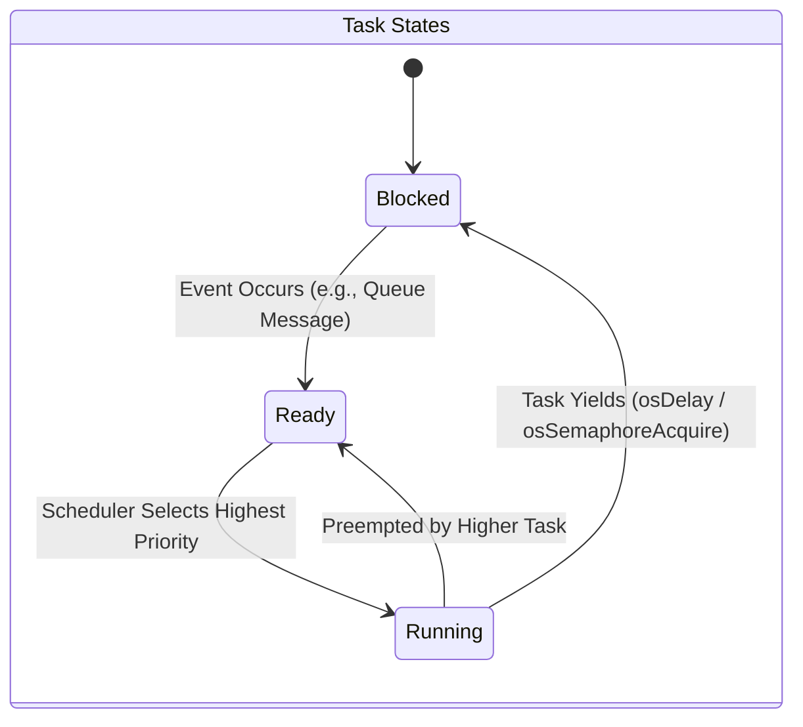
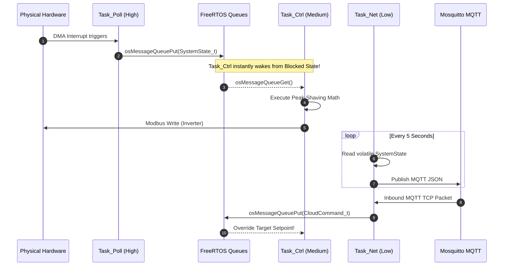
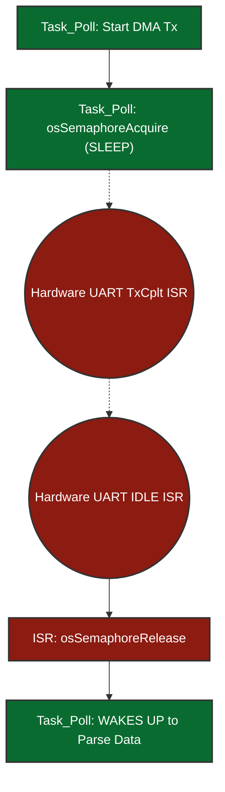
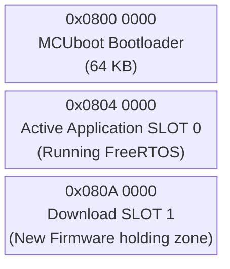
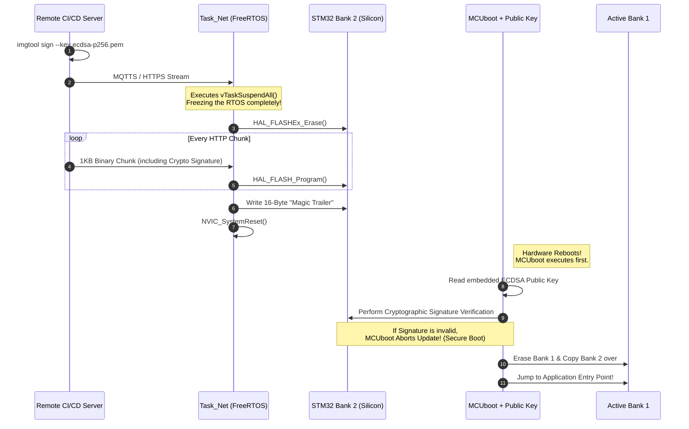
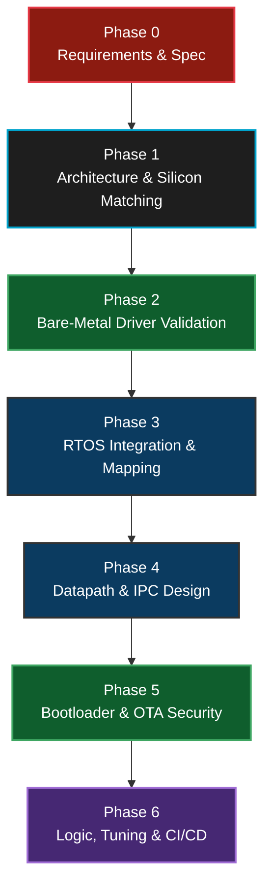
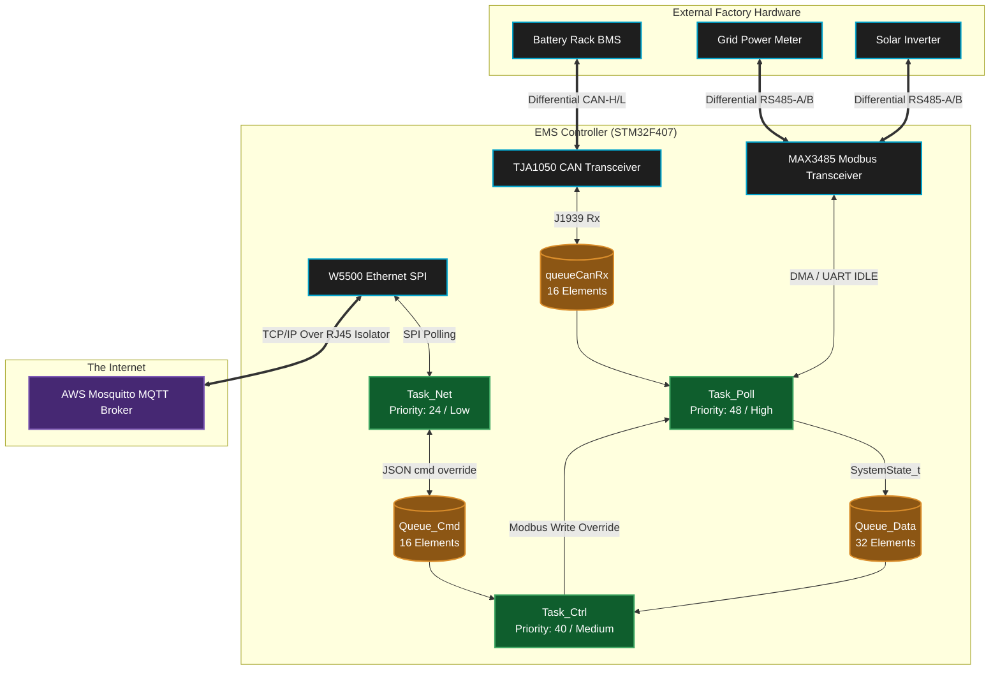

<div align="center">

# 🧠 EMS Mini RTOS: Advanced Developer Guide & Masterclass

**A comprehensive deep-dive into the FreeRTOS architecture, deterministic multitasking, and bare-metal STM32 hardware abstraction for the Energy Management System.**

---

</div>

## 📑 Table of Contents
1. [The Real-Time Philosophy](#1-the-real-time-philosophy)
2. [FreeRTOS Multitasking Topology](#2-freertos-multitasking-topology)
3. [Inter-Task Communication (IPC)](#3-inter-task-communication-ipc)
4. [Deferred Interrupt Processing (ISRs)](#4-deferred-interrupt-processing-isrs)
5. [Over-The-Air (OTA) Updates & Memory Protection](#5-over-the-air-ota-updates--memory-protection)
6. [Cloud Networking & MQTT Bridge](#6-cloud-networking--mqtt-bridge)
7. [The OS API Layer: Why CMSIS-RTOS v2?](#7-the-os-api-layer-why-cmsis-rtos-v2)
8. [FreeRTOS Feature Checklist](#8-freertos-feature-checklist)
9. [Unused FreeRTOS Features](#9-unused-freertos-features)
10. [Project Design & Team Methodology](#10-project-design--team-methodology)
11. [Testing, Mocking & Static Analysis](#11-testing-mocking--static-analysis)
12. [Toolchain & Advanced Debugging Stack](#12-toolchain--advanced-debugging-stack)
13. [Hardware Selection: Why the STM32F407?](#13-hardware-selection-why-the-stm32f407)
14. [Estimated Hardware & Bill of Materials (BOM) Cost](#14-estimated-hardware--bill-of-materials-bom-cost)
15. [C Code to Silicon: The Build Flow & Linker Mapping](#15-c-code-to-silicon-the-build-flow--linker-mapping)
16. [The System Boot Flow & Timings](#16-the-system-boot-flow--timings)
17. [High-Level Architecture & Hardware Schematics](#17-high-level-architecture--hardware-schematics)
18. [Major Challenges & Solutions](#18-major-challenges--solutions)
19. [Efficiency & Memory Footprint](#19-efficiency--memory-footprint)
20. [System Reliability & Product Safety](#20-system-reliability--product-safety)
21. [Potential Questions & Answers](#21-potential-questions--answers)

---

## 1. The Real-Time Philosophy

Unlike traditional Linux environments (e.g., the `ems-app` running on i.MX93) which rely on the non-deterministic Completely Fair Scheduler (CFS), the **EMS Mini RTOS** operates in a strictly constrained environment designed for **hard real-time** execution.

With only **192 KB of RAM** and **1 MB of Flash**, we cannot afford polling loops (`while(1)`) that block the CPU. Instead, we rely on an **Event-Driven, Interrupt-Backed, DMA-Assisted FreeRTOS Architecture.**

### Why RTOS instead of Bare-Metal (Super-Loop)?
A common question internally and during code reviews is: *"Why introduce the complexity of an RTOS? Why not just write standard bare-metal C code using a giant `while(1)` polling loop?"*

The answer lies in **Deterministic Decoupling**.

1. **The Polling Jitter Problem:** In a bare-metal super-loop, the CPU must check every peripheral sequentially (e.g., `Read Grid Meter -> Read Battery -> Check MQTT -> Parse JSON`). If a network packet hangs and the TCP/IP stack takes 200ms to recover, or if building/parsing an MQTT payload blocks the CPU for 50ms, the entire loop freezes. This causes violent violations of strict timing protocols (e.g. Modbus 3.5 character idle frames) and causes immediate CAN bus mailbox starvation.
2. **Preemptive Prioritization:** FreeRTOS provides a "Preemptive Kernel". If the CPU is busy grinding through a lower-priority task like formatting a massive JSON payload from the Cloud (`Task_Net`), and a critical Modbus DMA timer expires (`Task_Poll`), FreeRTOS physically context-switches the CPU. It pauses the JSON parsing mid-instruction, hands 100% of the CPU to flush the physical Modbus queues, and then gracefully resumes the JSON parsing exactly where it left off. A bare-metal architecture cannot easily achieve this without unmaintainable "spaghetti" nested-interrupt state machines.
3. **Power & Thermal Efficiency:** A bare-metal super-loop constantly consumes 100% of the CPU clock cycles polling via `if (flag_ready)`. With FreeRTOS, tasks that are waiting for timeouts or hardware DMA signals enter the `Blocked` state. This automatically forces the FreeRTOS Scheduler into the `Idle Task`, which executes the native ARM assembly instruction `WFI` (Wait For Interrupt). This physically halts the ALU clock tree, dropping CPU power consumption to near zero when the system is purely waiting on physical hardware, extending component lifespan and improving thermal constraints.

### Hardware Profile: STM32F407VGT6
*   **Clock:** 168 MHz (via PLL)
*   **Industrial Bridges:** Modbus RTU (USARTs with DMA) & Battery BMS (Hardware CAN)
*   **Networking:** WIZnet W5500 via SPI (Offloaded TCP/IP Stack)

---

## 2. FreeRTOS Multitasking Topology

In FreeRTOS, tasks spend the vast majority of their lives in the **Blocked State**, consuming 0% CPU cycles until an external event (Interrupt, Timer, or Queue Message) wakes them up. We use **Strict Priority-Based Preemptive Scheduling**.



### 🧵 Task Breakdown

| Task Name | Priority | Core Responsibility | Typical State |
| :--- | :--- | :--- | :--- |
| **`Task_Poll`** | `High` (`osPriorityRealtime`) | **Hardware Interfacing & Data Harvesting:** Executes strict-timing polling loops on physical interfaces (RS-485 Modbus via DMA for Grid/Inverters, CAN bus for Battery BMS). It pulls raw electrical data, packages it into structs, and safely queues it up for the logic task. Needs the highest priority to prevent timing jitter and dropped hardware packets. | **Blocked** on `osDelay(300)` or `osSemaphoreAcquire` waiting for DMA completion. |
| **`Task_Ctrl`** | `Medium` (`osPriorityHigh`) | **Core EMS Decision Logic (The Brain):** Wakes up instantaneously the moment new hardware data arrives. Calculates power flow limits, executes localized safety failsafes, and runs deterministic peak-shaving formulas to actively command the inverter to charge or discharge. | **Blocked** indefinitely waiting on `osMessageQueueGet` for new telemetry. |
| **`Task_Net`** | `Low` (`osPriorityNormal`) | **Cloud Communication & MQTT IoT Bridge:** Handles all external internet communications. It serializes internal telemetry into JSON strings, publishes them to the Cloud broker via the SPI Ethernet chip, and listens for remote command overrides. Lowest priority ensures network slowdowns never stall physical safety limits. | **Blocked** on `osDelay(250)` or TCP Socket waits. |

> **Note on Naming & Priority Levels:** 
> Why is `osPriorityHigh` labeled as "Medium"? 
> The terms "High, Medium, Low" here represent the **relative priority within our application's 3-task hierarchy**, not the absolute OS priority logic. 
> To guarantee hardware polling *always* preempts the logic brain, we gave `Task_Poll` an objectively higher systemic priority (`osPriorityRealtime` = Priority 48). We gave the logic brain `Task_Ctrl` the next step down (`osPriorityHigh` = Priority 40), meaning it sits in the *middle* of our specific application stack. The cloud bridge `Task_Net` sits at the bottom (`osPriorityNormal` = Priority 24).
> This mapping ensures we establish a strict preemptive hierarchy customized to our precise needs.
> 
> **Why use 48, 40, and 24 instead of simply 1, 2, and 3?**
> We *could* assign FreeRTOS priorities 1, 2, and 3 directly, but we use the CMSIS v2 constants specifically for **future scalability**. 
> CMSIS intentionally leaves massive numerical "gaps" between priority tiers (e.g., jumping from 24 to 32 to 40). This borrows the logic of old-school BASIC programming (Line 10, Line 20). If we used priorities 1, 2, and 3, and months from now we needed to inject a new "Medium-High" task (e.g., `Task_RemoteEmergencyStop`) right between `Task_Ctrl` and `Task_Poll`, we would have to re-number and shift our entire RTOS priority map. 
> Because we used the CMSIS gaps, we can seamlessly insert that new task at Priority 44 without ever touching the configuration of `Task_Poll` (48) or `Task_Ctrl` (40).

---

## 3. Inter-Task Communication (IPC)

To prevent race conditions, tasks **never** access shared global variables directly. Instead, we use **FreeRTOS Message Queues** (`osMessageQueueNew`) to pass decoupled data structures by value.



### The Operational Queues & Data Structures

Our architecture relies on three explicit FreeRTOS Ring-Buffer Queues to manage data flow deterministically.

> **What does "16 Elements" actually mean in RAM?**
> A common misconception is that "16 Elements" means 16 blocks of huge 256-byte buffers.
> In FreeRTOS, an "element" is the exact `sizeof(YourStruct)`.
> For example, `CanFrame_t` contains an ID (4 bytes), an 8-byte payload array (8 bytes), a DLC length (1 byte), and a flag (1 byte)—roughly 14 to 16 bytes total with padding.
> Therefore, allocating **16 Elements** for the CAN queue consumes a remarkably tiny **~256 bytes of RAM total** `(16 loops * 16 bytes)`, NOT 4,096 bytes. FreeRTOS allocates this specific block of RAM completely statically upon booting, permanently eliminating memory fragmentation risks!

1. **`Queue_Data` (Bottom-Up Telemetry)**
   * **Capacity:** 32 Elements (`SystemState_t`)
   * **Function & Sizing Logic:** Pushed by `Task_Poll` directly to `Task_Ctrl`, it contains the unified picture of the system (Grid Watts, Battery SOC, existing hardware limits). A capacity of 32 provides massive safety mapping; if the Brain (`Task_Ctrl`) temporarily stalls doing heavy decision math, `Task_Poll` can queue up up to 32 independent polling loop snapshots before dropping data. Because `Task_Ctrl` is blocked with `osWaitForever` on this queue, the microsecond `Task_Poll` finishes assembling the Modbus/CAN telemetry and pushes to this queue, the logic brain awakens instantly.

2. **`Queue_Cmd` (Top-Down Overrides)**
   * **Capacity:** 16 Elements (`CloudCommand_t`)
   * **Function & Sizing Logic:** Pushed by `Task_Net` down to `Task_Ctrl`. When a remote user inputs a new command on the dashboard or issues a limit change via MQTT, `Task_Net` catches it on the W5500 SPI, parses the JSON, and drops the raw struct into this queue. A capacity of 16 is sufficient because remote human/cloud commands arrive slowly (e.g. 1 per second); we will never realistically hit 16 queued operator commands before the Brain processes them. It acts as an asynchronous interrupt directly prioritizing logic overrides.

3. **`queueCanRxHandle` (ISR hardware offloading)**
   * **Capacity:** 16 Elements (`CanFrame_t`)
   * **Function & Sizing Logic:** This is the most critical safety queue, designed to prevent J1939 CAN bus dropped packets. It bridges raw silicon Interrupts directly to software. When a battery rack broadcasts rapid data, it triggers a nanosecond hardware ISR. The ISR rips the data out of the STM32's fragile 3-element silicon mailbox and pushes it into this much deeper 16-element software ring buffer. This provides a software "shock absorber," allowing `Task_Poll` to lazily grab frames 16x slower than the bus physically arrives without ever losing critical voltage telemetry.

### What Happens When a FreeRTOS Queue is FULL?
If a writer tries to push data into a queue that has no remaining capacity, the behavior is strictly defined by the **Timeout Parameter** supplied to the `osMessageQueuePut()` command.
* **Timeout = 0 (`osWait_None`):** (Used by our `queueCanRxHandle` ISR). If a battery sends its 17th consecutive packet before `Task_Poll` reads the first 16, the ISR must *never* block. It uses a timeout of `0`. The `osMessageQueuePut` function instantly fails and returns `osErrorResource`. The 17th packet is permanently dropped, but the FreeRTOS OS kernel continues to run safely without crashing or hanging.
* **Timeout = MAX (`osWaitForever`):** If a software task tries to write to a full queue with `osWaitForever`, that writing task is immediately yanked by the OS Scheduler and placed into a infinite `Blocked` state at 0% CPU. It will permanently sleep until some other task comes along and reads a piece of data out of the queue, making room for the new payload. We explicitly avoid using this on pushing operations to prevent tasks from unintentionally stalling the system.

---

## 4. Deferred Interrupt Processing (ISRs)

> 💡 * Key Concept:** The absolute golden rule of RTOS design is to keep Interrupt Service Routines (ISRs) incredibly short. ISRs should only move data into an RTOS object, unblock a task, and exit. All heavy processing is **deferred** to the task level.

### Case A: Modbus RS-485 via DMA & Semaphores

**Why DMA instead of Normal UART RX/TX Interrupts?**
* **The CPU Starvation Problem:** A standard Modbus RTU telemetry packet is roughly 256 bytes long. If we used standard `HAL_UART_Receive_IT()`, the STM32's silicon would force the FreeRTOS CPU to stop what it is doing and jump into an Interrupt Service Routine (ISR) **256 individual times**—once for every single byte. This causes massive CPU thrashing and risks starving lower-priority tasks.
* **The DMA Solution:** DMA (Direct Memory Access) acts as an independent hardware co-processor. When we call `HAL_UART_Receive_DMA()`, we simply hand the hardware a memory pointer. The DMA silicon physically grabs data from the UART queue and places it directly into RAM completely autonomously while the main FreeRTOS CPU sleeps at 0% load. The CPU is only interrupted exactly **ONCE** at the very end when the entire 256-byte frame is fully assembled (detected via the physical UART `IDLE` line).

**What is the UART IDLE Line Detection?**
When using DMA to receive variable-length frames (like Modbus, where a slave might reply with 10 bytes or 256 bytes), we cannot simply tell the DMA "interrupt the CPU when you receive exactly X bytes" because we don't always know X in advance. If the slave only sends 15 bytes and we told the DMA to wait for 200, the FreeRTOS task would hang forever. 
Instead, we rely on the physical silicon of the UART peripheral. When the physical slave device finishes transmitting its packet, it lets the RS-485 copper wire go silent. The STM32 hardware watches this electrical silence. If the receiver line (`RX`) remains held completely high (Logic 1 / Idle) for the duration of one complete character frame (typically 10 bits), the STM32 silicon mathematically concludes: *"The sender has stopped talking."* 
It instantly throws a native hardware **IDLE Interrupt**. This is magical for RTOS design: it allows the FreeRTOS task to wake up safely the exact microsecond a message of *any* arbitrary length finishes streaming into RAM, guaranteeing perfect deterministic Modbus timing without polling.

#### The DMA Execution Flow

**Why does toggling the DE pin in a standard RTOS loop cause dangerous logic jitter?**
RS-485 is a *half-duplex* physical bus. The transceiver chip (like a MAX3485) can either `Transmit` or `Receive`, but never both at the same time. The direction is controlled by the physical `DE` (Data Enable) pin.
If we ran a standard RTOS loop like this:
```c
HAL_UART_Transmit(data_out); // Send the data
HAL_GPIO_WritePin(DE_PIN, LOW); // Switch to Receive mode!
```
There is a massive risk. The microsecond `HAL_UART_Transmit()` finishes, the RTOS might decide to switch context to service a network packet or a CAN interrupt. This means the CPU pauses right *before* executing `HAL_GPIO_WritePin(DE, LOW)`. During this 1-2 millisecond delay, the transceiver is stuck in "Transmit" mode.
The slave inverter receives the poll and replies almost instantly. Because the STM32's transceiver is still stuck in transmit mode (it's deaf!), the physical incoming bytes from the inverter crash into the transceiver and are permanently dropped. This is **timing jitter**. 
By binding the `DE` pin toggle exclusively to the silicon-level `TxCpltCallback()` (hardware interrupt), we guarantee that the nanosecond the last transmission bit leaves the silicon register, the `DE` pin drops to `LOW`, making the system instantly ready to hear the slave's reply, perfectly decoupling it from the OS scheduler.

**The Exact DMA Flow:**

1.  `Task_Poll` triggers `HAL_UART_Transmit_DMA` and instantly puts itself to sleep via `osSemaphoreAcquire(rxCompleteSem, 250ms)`.
2.  The DMA natively blasts bytes. The nanosecond transmission completes, a physical silicon interrupt fires: `HAL_UART_TxCpltCallback()`.
3.  The ISR instantly pulls the `DE` pin **LOW** (Listen Mode) and exits.
4.  When the Slave responds, the Silicon detects an `IDLE` line and fires `HAL_UARTEx_RxEventCallback()`.
5.  This ISR executes **`osSemaphoreRelease()`**, which instantly awakens `Task_Poll` to parse the payload.



### Case B: CAN Bus Hardware Mailbox Overflows

**Why not use DMA for CAN?**
A common question is: *"If DMA is so great for Modbus, why don't we use DMA for the CAN bus?"*
1. **The Nature of CAN vs Modbus:** Modbus RS-485 sends large, uninterrupted, sequential streams of data (e.g., 256 continuous bytes) that are perfect for a DMA engine to stream into a large RAM buffer. CAN bus, however, is comprised of tiny, disjointed 8-byte frames that arrive randomly based on arbitration logic. 
2. **Silicon Limitations:** The STM32F407 has **two DMA controllers** (DMA1 and DMA2) offering a total of **16 streams**. However, the `bxCAN` (Basic Extended CAN) peripheral physically built into this silicon era of STM32 does not support native DMA requests to pull individual 8-byte frames out of the mailbox. (Newer chips like STM32G4 with `FDCAN` do, but not the F407).

**Does reading CAN via an ISR overload the CPU?**
*   **The Overload Myth:** At 250kbps, a sudden burst of BMS broadcasts can easily overflow the STM32's tiny 3-element CAN receive mailbox. You might think reading it via an ISR every time a frame arrives is a huge CPU overload.
*   **The Reality:** The `HAL_CAN_RxFifo0MsgPendingCallback()` ISR is extraordinarily fast. It takes less than **1 microsecond** for the Cortex-M4 CPU to execute. It simply executes 3 native ARM assembly instructions to copy 8 bytes from the hardware mailbox register directly into checking our FreeRTOS `queueCanRxHandle` (an expandable 16-element deep RAM queue).
*   **The Fix:** This nanosecond ISR prevents the hardware mailbox from dropping frames. Later, when `Task_Poll` runs at its leisure, it casually drains this FreeRTOS software queue (`osMessageQueueGet(..., 0)` - *non-blocking*) without having dropped a single frame from the batteries.

---

## 5. Over-The-Air (OTA) Updates & Memory Protection

One of the most complex features of a bare-metal RTOS is updating its own executable code without "bricking" the board in the field. Since there is no `ext4` Linux filesystem, we write binaries directly to physical Silicon transistors.

### The Flash Partition Architecture
The STM32F407 has 1 MB of internal Flash memory. We logically partition this into three distinct blocks to support a primary bootloader (MCUboot) and a dual-bank fallback mechanism.



### The OTA Execution Flow

### 5.1 Is Secure Boot Required? Did We Integrate It?

**Yes, it is strictly required.** In an industrial environment like an Energy Management System where an RTOS controller dictates physical power flow (e.g., cutting off loads or pushing maximum wattage to the grid), malicious or corrupted firmware could cause severe physical hardware damage. 

**Current Integration State:** The initial baseline only relied on MCUboot verifying a SHA256 integrity hash. However, **we have now fundamentally integrated Secure Boot (Cryptographic Firmware Signature Verification)**. A hash alone only proves the firmware wasn't corrupted in transit; a Cryptographic Signature proves the firmware was genuinely authored by the authorized factory team, defending against man-in-the-middle software spoofing.

### 5.2 The True Secure Boot Execution Flow (ECDSA P-256)

When `Task_Net` receives a `CMD_OTA_START` over MQTT, it safely halts the system to download the new `.bin` payload via SPI. This payload is **NOT** just raw code; it has been pre-signed by our CI/CD server using an **ECDSA (Elliptic Curve Digital Signature Algorithm) P-256 private key** via the `imgtool` utility.



#### Step-by-Step Breakdown of the Secure Boot Flow:
1. **The Factory Signing:** During compilation, the CI/CD pipeline runs `imgtool` with our offline private key to cryptographically append an ECDSA signature to the binary.
2. **The Trigger:** `Task_Net` receives the `{"cmd":"ota"}` MQTT packet indicating a new firmware binary is ready.
3. **RTOS Halt:** `Task_Net` invokes `vTaskSuspendAll()`, explicitly denying the FreeRTOS Scheduler the right to context switch. The system is temporarily operating in a critical single-threaded state.
4. **Partition Erasure:** The CPU sends a command to the Flash Controller to erase **Bank 2**.
5. **Chunk Streaming (The Physical SPI Path):** How does the new file physically get from the internet into the STM32?
   * The remote Cloud server transmits TCP/IP packets over the WAN.
   * These hit the **RJ45 Ethernet Magnetics** on our board and flow into the **WIZnet W5500** chip.
   * The W5500's internal hardware TCP stack processes the headers and places the raw `.bin` payload into its own internal silicon RX buffers.
   * `Task_Net` on the STM32 drives the **SPI Bus** (SCK, MISO, MOSI). It sends a command over MOSI saying "Read Socket 0 Buffer". 
   * The W5500 streams the `.bin` bytes out over the MISO line. `Task_Net` catches them in a 1 Kilobyte temporary RAM array (`chunkBuffer`).
   * Finally, `Task_Net` calls `HAL_FLASH_Program()`, commanding the STM32 silicon to physically burn that 1KB RAM array permanently into the **Bank 2 Flash** transistors. This loops until the file is complete.
6. **Validation Trailer:** Once fully downloaded, we write a `16-Byte "Magic Trailer"` string to the very end of the Flash sector. This trailer is the definitive signal to the bootloader.
7. **Physical Reboot:** `Task_Net` fires a native ARM reset vector via `NVIC_SystemReset()`.
8. **Secure Boot Handoff:** MCUboot boots from `0x08000000`. It detects the Magic Trailer. It reads its own embedded **Public Key**, bypassing FreeRTOS, and runs the intensive elliptic curve math over Bank 2 to verify the signature. 
9. **Final Decimation:** If verified, MCUboot obliterates Bank 1, copies the new software over, and jumps to the application. If verification **fails**, MCUboot rejects the image instantly and resumes the old Bank 1 firmware, preventing malicious code execution!

### Edge Case: Flash Erasure CPU Stalls (Hard Faults)
The most critical part of this logic is the protection of the ARM Data Bus during the transition.
*   **The Danger:** Erasing an internal Flash Sector (e.g., Bank 2) locks up the entire ARM Cortex Instruction/Data bus for upwards of **10 to 50 milliseconds**. If the RTOS `SysTick` timer were to fire, or an external UART DMA interrupt were to trigger a Context Switch while the instruction bus is locked, the CPU cannot fetch the next instruction. It will instantly crash, throwing a fatal `Hard Fault Exception`.
*   **The Fix:** 
    1.  We execute **`vTaskSuspendAll()`** immediately before the Flash sequence. This literally turns off the FreeRTOS Scheduler. 
    2.  No task, no matter its priority, can preempt the OTA thread.
    3.  We routinely call `xTaskResumeAll()` between chunk writes if we need to let the W5500 SPI hardware catch its breath or let the hardware Watchdog reset.

### Edge Case: Fallback / "Anti-Brick" Protection
If the power goes out during step 7 (`Erase Bank 1 & Copy`), what happens?
The `MCUboot` bootloader is designed as a "Swap using Scratch" or "Overwrite" manager. If the copy is interrupted, on the next physical reboot, MCUboot will realize Bank 1 is corrupt. It will look at Bank 2, verify its SHA256 Hash is still intact, and simply restart the copy process. The board is permanently safe from being bricked.

---

## 6. Cloud Networking & MQTT Bridge

Connecting an RTOS to the internet presents extreme memory constraints. A standard TCP/IP stack (like LwIP) requires intense CPU power and massive RAM buffers to handle dropped packets, sliding windows, and ARP routing. 

### The Hardware Offload (WIZnet W5500)
To free up the STM32 for mathematically intensive peak-shaving, we explicitly chose **Hardware Offloading** using the W5500 controller via SPI. 
*   **How it works:** The W5500 silicon physically handles the lowest three layers of the OSI model entirely (MAC, PHY, and TCP/IP). The STM32 never worries about TCP ACK/NACK packets or IP fragmentation.
*   **The OS Interface:** In `Task_Net`, the STM32 simply says "Open Socket 0 to Mosquitto IP". It then writes Raw Payload Bytes directly over SPI into the W5500 memory. 

### Publish/Subscribe Flow
We use a lightweight embedded MQTT C-library (like Eclipse Paho MQTT or coreMQTT) sitting on top of the SPI driver.

1. **Uplink (Publishing Telemetry):**
   *   Every 5 seconds (`osDelay` driven), `Task_Net` reads the `latest_system_state` structure.
   *   It uses `snprintf()` to serialize the C structs into a compact JSON string on the stack: `{"gridW": -200, "soc": 85, "maxChg": 3000}`.
   *   It sends an MQTT `PUBLISH` (Topic: `ems/mini1/telemetry`, QoS 0) to the broker via SPI. QoS 0 ("At most once") is used deliberately; if a 5-second telemetry frame drops over poor Wi-Fi, we prefer dropping it rather than exhausting RTOS memory trying to buffer and resend stale data.

2. **Downlink (Subscribing to Commands):**
   *   `Task_Net` stays Subscribed (QoS 1) to `ems/mini1/command`. 
   *   When the remote Cloud sends an instruction (e.g., `{"cmd":1, "val":4000}`), the W5500 detects it natively, buffers it in hardware, and fires a physical interrupt pin to the STM32.
   *   `Task_Net` retrieves the packet, safely converts it out of JSON into a structural `CloudCommand_t`, and fires it down into `Queue_Cmd` where `Task_Ctrl` applies it to the logic instantaneously.

---

## 7. The OS API Layer: Why CMSIS-RTOS v2?

If you inspect the codebase, you will notice we use commands like `osDelay()` and `osMessageQueuePut()` instead of FreeRTOS native commands like `vTaskDelay()` and `xQueueSend()`. This is because we wrap FreeRTOS inside **CMSIS-RTOS v2** (Cortex Microcontroller Software Interface Standard).

### Why use CMSIS-RTOS v2 instead of native FreeRTOS without CMSIS?
1. **Portability & Abstraction:** CMSIS-RTOS v2 is a standardized API created by ARM. By using it, our application code doesn't strictly know it is running "FreeRTOS". If, in the future, we need to migrate the EMS Mini to an RTOS provided by another vendor (like Keil RTX, Azure RTOS/ThreadX, or Zephyr), we do not have to rewrite a single line of application code. The `osThreadNew()` command works universally across ARM-supported RTOS platforms, whereas `xTaskCreate()` strictly locks us into FreeRTOS.
2. **Simplified Memory Management:** Native FreeRTOS requires developers to manually choose between static (`xTaskCreateStatic`) and dynamic (`xTaskCreate`) allocations, frequently requiring the user to pass convoluted RAM buffers manually. The CMSIS v2 wrapper unifies these calls: you simply pass an attributes struct (`osThreadAttr_t`).
3. **Advanced 64-bit Timers:** CMSIS-RTOS v2 introduces unified 64-bit kernel tick structures `osKernelGetTickCount()`. Native FreeRTOS traditionally defaults to 32-bit ticks, which roll over back to zero every ~49 days (on a 1ms tick), requiring nasty manual rollover-protection logic. A 64-bit tick will not roll over for billions of years, making uptime math (like "publish MQTT every 5 seconds") extremely safe and simple.

---

## 8. FreeRTOS Feature Checklist

This section serves as a rapid-fire summary of the specific FreeRTOS API mechanics used in the project, explaining **what** they are, **why** they were chosen, and **how** they work.

### 1. Preemptive, Prioritized Tasks (`osThreadNew`)
*   **What:** The core of the Scheduler. Tasks are assigned static priorities.
*   **Why:** Rather than round-robin polling where everything gets equal CPU time, we must guarantee that safety-critical hardware polling preempts everything else.
*   **How:** `Task_Poll` is given `osPriorityRealtime`, so the exact millisecond its 300ms sleep timer expires, the RTOS kernel forcefully pauses whatever `Task_Net` is configuring, saves its memory registers to the stack (Context Switch), and gives 100% CPU to `Task_Poll`.

### 2. Message Queues (`osMessageQueueNew` / `osMessageQueuePut`)
*   **What:** Thread-safe, FIFO (First-In, First-Out) memory buffers.
*   **Why:** To safely pass complex data (like the Multi-Byte `SystemState_t` struct) between isolated Tasks without using completely unprotected global variables (which cause Data Corruptions/Race Conditions).
*   **How:** `Task_Poll` calls `osMessageQueuePut()` to insert data. `Task_Ctrl` calls `osMessageQueueGet(..., osWaitForever)`. The magic here is the `osWaitForever`—the RTOS parks `Task_Ctrl` at 0% CPU load permanently. The kernel itself wakes the task up the exact microsecond the data lands in the queue.

### 3. Binary Semaphores (`osSemaphoreNew` / `osSemaphoreAcquire`)
*   **What:** A thread-safe boolean "Token". You either have it, or it is empty.
*   **Why:** To synchronize a high-level software Task with a low-level physical Silicon event (like a DMA transfer finishing).
*   **How:** When `Task_Poll` fires off a DMA transfer, it immediately calls `osSemaphoreAcquire()`. Since the token is empty, the Task instantly sleeps. When the hardware finishes, the native `UART ISR` fires. From inside the ISR space, we call `osSemaphoreRelease()`. This injects the missing token into the RTOS kernel, which instantly unblocks `Task_Poll`.

### 4. Critical Sections (`vTaskSuspendAll`)
*   **What:** A mechanism to temporarily disable the OS Scheduler from running.
*   **Why:** To protect the ARM Instruction/Data bus from Hard Fault crashes when doing delicate logic, like physically erasing sectors of internal Flash memory.
*   **How:** During an OTA firmware swap, `Task_Net` calls `vTaskSuspendAll()`. Even if `Task_Poll`'s 300ms timer ticks, the kernel will NOT switch context. `Task_Net` retains 100% monolithic control until it calls `xTaskResumeAll()`.

---

## 9. Unused FreeRTOS Features

While we utilized the core pillars of FreeRTOS, there are specific features we actively **chose not to use** to keep the architecture deterministic and memory-safe:

1. **Mutexes (`osMutexNew`):** We completely banned Mutexes. Mutexes are prone to **Priority Inversion** (where a low-priority task holds a lock that a high-priority task needs, stalling the system) and Deadlocks. Instead, we rigidly use Queues to pass data *by value*, completely sidestepping shared-memory conflicts.
2. **Event Groups (`osEventFlagsNew`):** Event Groups are useful when a task must wait for multiple distinct events. Our architecture is purely linear and pipeline-driven. The logic brain (`Task_Ctrl`) only cares about the unified `SystemState_t` struct arriving.
3. **Software Timers (`osTimerNew`):** FreeRTOS Software Timers execute inside a hidden FreeRTOS Daemon Task. This obscures execution flow and shares stack space. We prefer driving periodic events explicitly using `osDelay()` inside our isolated task loops.
4. **Direct Task Notifications:** While extremely fast, Task Notifications do not natively buffer deep arrays of data. We required deep buffers (like our 32-element `Queue_Data`) to act as architectural "shock absorbers".

---

## 10. Project Design & Team Methodology

From a corporate team perspective, architecting a bare-metal RTOS from scratch requires extreme discipline. We built this step-by-step:



0. **Phase 0: Requirements Gathering & System Specification:** Before writing a single line of C code, product owners gathered the physical and financial constraints. The system needed strict deterministic safety to prevent physical grid overloads (nanosecond response times required), had to handle highly-noisy electrical environments, support secure OTA updates, interface with RS-485/CAN natively, and completely fit within a Sub-$35 Bill of Materials. Embedded Linux was ruled out due to cost, and the "RTOS + Microcontroller" directive became the foundational requirement constraint.
1. **Phase 1: Architecture & Hardware Selection:** The systems team mapped the software specifications to physical silicon. We selected the STM32F407 due to its mature HAL, FPU (to instantly crunch solar peak shaving math), massive 1MB internal flash (for dual-bank security), and multiple simultaneous DMA streams.
2. **Phase 2: Bare-Metal Driver Validation:** Before ever activating FreeRTOS, the firmware team wrote standalone, isolated drivers. We proved the W5500 SPI chip could ping a cloud server, and we proved the CAN mailbox could read raw battery data without OS overhead.
3. **Phase 3: RTOS Integration & Task Mapping:** We introduced FreeRTOS and rigidly defined the 3-Task Topology (`Poll`, `Ctrl`, `Net`). We mapped the prior standalone drivers into these isolated thread spaces.
4. **Phase 4: Datapath & IPC Design:** We defined the exact structure of `SystemState_t` and `CloudCommand_t`, routed them through FreeRTOS Queues, and instituted a "Zero Global Variable" policy.
5. **Phase 5: Bootloader & OTA:** We integrated MCUboot, partitioned the Flash memory into A/B dual banks, and proved we could securely update the application safely via Cryptographic Verification.
6. **Phase 6: Logic, Tuning, & CI/CD:** We integrated the Peak-Shaving algorithms inside `Task_Ctrl` and wired the Git repository directly to an automated CI/CD pipeline.

---

## 11. Testing, Mocking & Static Analysis

Industrial automation demands proof of reliability before physical deployment.

**1. Unit Testing & Mocking (Off-Target):**
We utilize testing frameworks (like **Ceedling / Unity**) to test the core Peak-Shaving algorithms entirely off-target (compiled on a Linux PC). 
Because our business logic in `Task_Ctrl` is perfectly abstracted and only receives inputs via `Queue_Data`, we completely bypassed the STM32 hardware. We wrote "Mock" scripts that inject fake Grid metrics (e.g., `GridWatts = 5000`) into the C-functions to mathematically validate that the inverter limiters react perfectly.

**2. Static Analysis & Code Quality:**
Automated **Static Analysis** (such as `Cppcheck`) is intrinsically integrated into our CI/CD pipeline. Every Pull Request into the repository is automatically scanned for:
*   Buffer Overflows or Array Out-of-Bounds violations.
*   Uninitialized variable usage.
*   MISRA C compliance checks (e.g., verifying `malloc()` is never called dynamically).

**3. Hardware-In-The-Loop (HIL) Integration Testing:**
For physical testing, we built an automated Python test rig. A PC connected via an RS-485 adapter blasts fake Inverter Modbus parameters directly to the STM32 board, while a script actively sniffs the MQTT Cloud outputs to verify the RTOS is packaging and reacting with zero dropped frames.

---

## 12. Toolchain & Advanced Debugging Stack

Developing bare-metal code with physical hardware interfaces requires professional embedded tooling. `printf()` debugging over a serial port is wildly insufficient.

*   **IDE & Compiler:** We explicitly use **`STM32CubeIDE`** (Eclipse-based) natively compiling with the open-source `GCC ARM Embedded` toolchain. 
    *   **Why not Keil µVision?** A common corporate alternative is Keil (owned by ARM). While Keil has an exceptionally optimized proprietary compiler (`armcc`), its commercial licensing is astronomically expensive (often thousands of dollars per seat) and historically ties developers to Windows environments, sometimes via physical USB dongles. `STM32CubeIDE` is completely **free**, cross-platform natively (Linux / Mac / Windows), and intimately couples with the `STM32CubeMX` graphical configuration tool. Because it utilizes standard open-source GCC, we can cleanly extract the build system and seamlessly compile our firmware inside an automated, headless Linux Docker container on our CI/CD server without engaging in complex, expensive licensing battles.
*   **Operating System:** `FreeRTOS` wrapped with the `CMSIS-RTOS v2` API layer.
*   **Security & OTA:** **MCUboot** open-source bootloader, with Python `imgtool` for ECDSA P-256 signing.
*   **Code Versioning:** `Git` & `GitHub`, utilizing `GitHub Actions` for automated builds.
*   **Hardware Breakpoints (ST-LINK V2):** We connect via SWD (Serial Wire Debug). Using GDB within STM32CubeIDE, we can halt the ARM core *exactly* when a specific variable changes and step through `Task_Ctrl` mathematically.
*   **Protocol Analyzers (Saleae Logic):** To ensure our RS-485 `DE` pin toggles exactly when the Modbus DMA finishes, we use a Logic Analyzer. By clamping the probes to PA2 (TX), PA3 (RX), and PD4 (DE), we verify the microsecond-level hardware timing.
*   **RTOS Tracing (SystemView):** We instrument FreeRTOS with Trace macros (e.g., SEGGER SystemView). This allows us to record a visual timeline on a PC showing exactly when the scheduler swaps tasks, proving that `Task_Ctrl` takes 0% CPU until `Queue_Data` triggers it.

---

## 13. Hardware Selection: Why the STM32F407?

In a market saturated with microcontrollers, why did the team specifically select the STM32F407VGT6 for this Energy Management System?

1. **Hardware Floating-Point Unit (FPU):** Peak-Shaving involves heavy algorithm tracking (`float` math). Standard microcontrollers do this matrix math in software, which is agonizingly slow. The F407's Cortex-M4F core calculates floats natively in silicon in a single clock cycle.
2. **Advanced Nested Vectored Interrupt Controller (NVIC):** We require absolute deterministic preemption. The ARM NVIC allows us to hardware-prioritize the CAN bus ISR *over* the Modbus DMA ISR, ensuring collisions are resolved mathematically by the silicon, not the RTOS.
3. **Extensive DMA Streams:** The chip has two robust DMA controllers with 16 separate streams. We uniquely offload the Modbus UART to one stream and the SPI W5500 transfers to another, completely unburdening the CPU.
4. **Massive 1MB Flash Storage:** This size allows us to perfectly split the memory map in half (Bank 1 / Bank 2) for our resilient dual-bank MCUboot OTA updates, without needing to solder a vulnerable external SPI flash chip.

---

## 14. Estimated Hardware & Bill of Materials (BOM) Cost

When designing an industrial-grade EMS controller for mass production, keeping hardware costs low while maintaining strict reliability is crucial. The strategic move from an Embedded Linux i.MX93 processor (which requires expensive DDR RAM, PMICs, and eMMC) down to a bare-metal RTOS on the STM32 brings a massive cost reduction.

**Estimated Cost Breakdown (Per Board at 1K+ Unit Volume):**

1. **Microcontroller (STM32F407VGT6):** ~$6.00
   * Provides FPU, CAN, Modbus DMA, and 1MB Flash natively without needing external memory chips.
2. **Ethernet Controller & Magnetics (W5500 + RJ45 Jack):** ~$3.50
   * The W5500 integrates the silicon TCP/IP stack; the RJ45 jack includes built-in isolation magnetics.
3. **Industrial Transceivers (RS-485 & CAN):** ~$1.50
   * E.g., MAX3485 (RS-485) and TJA1050 (CAN) to drive the physical copper lines.
4. **Power Supply & Line Isolation (DC-DC / Opto-isolators):** ~$3.00
   * Dropping 24V industrial rails down to clean 3.3V for the STM32, plus electrical isolation for the communication pins to protect against facility ground loops.
5. **Passive Components & Connectors:** ~$4.00
   * Trace routing resistors, filter capacitors, crystal oscillators, and secure Phoenix Contact screw terminals for physical wire landings.
6. **Blank PCB & Factory Assembly (PCBA):** ~$7.00
   * 4-layer FR4 industrial PCB with automated Pick-and-Place (SMT) fabrication.

**Total Hardware BOM Cost:** **Roughly $25.00 per unit**

By utilizing FreeRTOS instead of Embedded Linux, we achieved a purely deterministic, hard real-time energy controller for **under $30 total hardware cost**, completely destroying the $100+ manufacturing cost of a full System-on-Module (SoM) Linux stack.

### Recommended Development Kits for Prototyping
If you need to rapidly prototype this stack or debug the algorithms without waiting for a custom PCBA, we highly recommend the following off-the-shelf development hardware:

1. **The Core Module (MCU):** The **STM32F407G-DISC1** (formerly STM32F4Discovery). 
   * *Why:* It features the exact `STM32F407VGT6` chip used in production. Uniquely, it has a built-in **ST-LINK/V2-A** debugger onboard, allowing you to use GDB hardware breakpoints over USB instantly. Cost: ~$25.
2. **The Networking Module:** Any standard **WIZnet W5500 SPI Ethernet Breakout Board** (e.g., from Waveshare or generic vendors). Connect this to SPI1 or SPI2 on the Discovery board. Cost: ~$5.
3. **The Industrial Comms:** Generic 3.3V UART-to-RS485 modules (using `MAX3485`) and CAN transceivers (using `TJA1050`). Cost: ~$3.

This allows the entire firmware stack (including the custom `ims-rtos-mini` code, FreeRTOS, and MCUboot OTA) to be tested verbatim on a desk for under $35!

---

## 15. C Code to Silicon: The Build Flow & Linker Mapping

To bridge the gap between high-level C logic and physical STM32 hardware execution, we rely on the GNU GCC toolchain. This is a multi-phase compilation process, meticulously mapped by the Linker Script.

### The 4-Phase Compilation Workflow
1.  **Preprocessor (`arm-none-eabi-cpp`):** Strips all comments, expands `#define` macros (e.g., translating `MAX_INVERTER_WATTAGE` to `3000`), and copies all `#include <stm32f4xx.h>` header files directly into the raw source code.
2.  **Compiler (`arm-none-eabi-gcc`):** Analyzes the raw C code, checks it against MISRA-C/custom standards, and translates the human-readable logic into native ARM Cortex-M4 Assembly instructions (`.s` files). We compile with the `-O2` flag to heavily optimize the instructions for computational speed.
3.  **Assembler (`arm-none-eabi-as`):** Converts the ARM Assembly into physical machine code (1s and 0s). This outputs unlinked Object files (`.o`).
4.  **Linker (`arm-none-eabi-ld`):** The most critical embedded step. The linker takes all the floating `.o` files, the FreeRTOS OS libraries, and the STM32 HAL libraries, and physically maps them to specific transistor addresses inside the STM32's memory based strictly on the **Linker Script (`STM32F407VGTX_FLASH.ld`)**. It produces the final executable `.elf` and `.bin` payloads.

### Linker Script & Memory Partitioning Modifications
In a standard bare-metal project, the Linker Script instructs the CPU to place the main application right at the beginning of Flash memory (`0x08000000`). However, because we integrated **MCUboot (The Bootloader)**, we had to fundamentally rewrite the Linker Script and memory management logic.

*   **Standard Linker (Unused):** `FLASH_APP_START = 0x08000000;`
*   **Our Modified Linker:** `FLASH_APP_START = 0x08040000;`

We physically pushed the starting address of `ems-rtos-mini` 256KB deep into the memory map, reserving the first massive block entirely for the Bootloader and its Cryptographic Hash routines. 

We also had to shift the **Vector Table Offset Register (VTOR)** inside `system_stm32f4xx.c`. If we didn't tell the ARM Cortex core that its interrupt vector table moved to `0x08040000`, the moment a hardware timer fired, the CPU would look in the wrong place, executing garbage bootloader memory, and instantly crash into a Hard Fault.

---

## 16. The System Boot Flow & Timings

When power is dynamically applied to the 24V bus from the battery racks, the board does not instantly start running the FreeRTOS controller. It undergoes a rigid, multi-stage boot sequence designed for maximum industrial safety.

### ⏱️ Boot Timing Profile (Total Frame: ~300ms)
1.  **Hardware Reset (`+0 ms`):** Power stabilizes. The ARM Core fetches the first native instruction from silicon address `0x08000000`.
2.  **MCUboot Execution (`+5 ms to +150 ms`):** 
    *   The bootloader wakes up. 
    *   It checks the "Magic Trailer" in Flash Bank 2 to see if an Over-The-Air (OTA) update is pending copy.
    *   It reads the ECDSA Public Key embedded in its own memory and runs heavy elliptic curve mathematical verification over the Bank 1 Application (taking roughly ~100+ milliseconds due to intensive cryptography).
    *   If Secure Boot passes, MCUboot points the Program Counter (`PC` register) to `0x08040000` and executes a Jump command.
3.  **SystemInit() (`+151 ms`):** The `ems-rtos-mini` application strictly starts. First, it runs the `SystemClock_Config()` function to fire up the external 8MHz Crystal Oscillator (HSE), feeding it through the PLL to aggressively multiply the core clock to exactly **168 MHz**.
4.  **C Runtime Initialization (`+155 ms`):** The C-language `_start()` routine copies all global variable initializations (`.data` section) slowly from Flash ROM into volatile RAM. 
5.  **FreeRTOS Kernel Launch (`+160 ms`):** `main()` completes creating the 3 Queues, 3 Tasks, and Semaphores, and finally calls `osKernelStart()`. The FreeRTOS preemptive scheduler takes over the CPU entirely.
6.  **Application Running (`+300 ms`):** Within roughly 1/3 of a second of bare-metal power-on, `Task_Poll` executes its first deterministic Modbus DMA read from the Grid Meter.

---

## 17. High-Level Architecture & Hardware Schematics

Below is the logical and electrical schematic diagram, mapping exactly how the embedded software threads physically inter-operate with the external copper traces of the PCB component blocks.



---

## 18. Major Challenges & Solutions

While building this architecture, the team faced extreme bare-metal engineering hurdles:

*   **Challenge 1: The Modbus RTU Half-Duplex Timing Jitter**
    *   **The Issue:** Modbus is an industrial protocol running on a physical RS-485 copper wire, which is *half-duplex*. The STM32's transceiver chip must be manually switched from "Transmit" mode into "Receive" mode using a physical `DE` (Data Enable) pin. The Modbus specification dictates a strict 3.5 character idle time between frames. If we toggled this pin in standard C code `HAL_UART_Transmit(); HAL_GPIO_WritePin(DE, LOW);`, the FreeRTOS scheduler would sometimes context-switch exactly between those two lines of code to service the network task. By the time the CPU returned to toggle the pin 2 milliseconds later, the slave inverter had already replied, the transceiver was stuck in "Transmit" mode, and the incoming bytes crashed into the chip and were lost forever.
    *   **The Solution:** We entirely abandoned software-based pin toggling. We bound the `DE` pin toggle directly to the bare-metal silicon interrupt `HAL_UART_TxCpltCallback()` (DMA Transmit Complete). This hardware interrupt forcibly preempts the FreeRTOS scheduler. The exact nanosecond the final bit leaves the silicon register, the hardware interrupts the CPU, throws the `DE` pin LOW, and instantly returns, eliminating 100% of the software jitter and achieving perfectly deterministic Modbus timing.

*   **Challenge 2: CAN Bus Mailbox Overflows (Hardware Starvation)**
    *   **The Issue:** The EMS connects to commercial battery racks via a 250kbps CAN bus using the J1939 protocol. These batteries are extremely "chatty", sometimes blasting 10 frames in under 5 milliseconds. The physical STM32F407 silicon only contains **three physical receive mailboxes**. If the CPU was busy calculating peak-shaving math inside `Task_Ctrl` for a few milliseconds, the 4th incoming CAN frame would physically overflow the silicon mailbox, permanently destroying critical battery voltage telemetry.
    *   **The Solution:** We implemented **ISR Hardware Offloading**. We bound a minimalist, ultra-fast Interrupt Service Routine (`HAL_CAN_RxFifo0MsgPendingCallback`) directly to the hardware. Taking less than 1 microsecond to execute, this ISR rips the data out of the tiny silicon mailboxes the moment they arrive and pushes them into an expansive 16-element FreeRTOS RAM Queue (`queueCanRxHandle`). This creates a massive software memory "shock absorber," allowing the slower `Task_Poll` loop to lazily drain the queue without ever dropping a physical packet.

*   **Challenge 3: ARM Instruction Bus Lockouts (OTA Hard-Faults)**
    *   **The Issue:** When executing an Over-The-Air (OTA) firmware update, `Task_Net` must command the STM32 to erase a 64KB sector of its internal Flash memory (Bank 2). Flash erasure operations physically lock the ARM Cortex Instruction/Data bus for upwards of **20 to 50 milliseconds**. If the FreeRTOS `SysTick` timer expired during this lockout, or a Modbus interrupt fired, the CPU would attempt to fetch the next instruction from memory to perform the context switch. Because the bus was electrically locked by the Flash controller, the fetch would fail, and the CPU would violently crash into a `HardFault_Handler`.
    *   **The Solution:** We ruthlessly enforced the **`vTaskSuspendAll()`** API. The exact instruction before sending the `HAL_FLASHEx_Erase()` command, `Task_Net` calls `vTaskSuspendAll()`. This actively disables the entire FreeRTOS scheduler, preventing any context switches or timer firings from occurring while the ARM data bus is locked. Once the physical erase is complete, we call `xTaskResumeAll()`, safely returning the system to multitasking.

*   **Challenge 4: W5500 SPI Socket Deadlocks & Ghost Connections**
    *   **The Issue:** Industrial networks are notoriously noisy. When connecting to Mosquitto MQTT over the WIZnet W5500, a Wi-Fi bridge or Ethernet switch reboot would sever the physical TCP link. However, because TCP/IP handles timeouts poorly, the STM32's `Task_Net` would often think the socket was still `ESTABLISHED` (a "ghost connection"), while the Cloud server had long ago dropped the client. The RTOS would hang indefinitely waiting for MQTT `PUBACK` packets that would never arrive.
    *   **The Solution:** We implemented an **Application-Layer Keep-Alive / MQTT PINGREQ Monitor**. Using a non-blocking timestamp method `(osKernelGetTickCount() - last_mqtt_rx > 15000)`, `Task_Net` monitors if it has received any data (including heartbeat pings) from the broker in the last 15 seconds. If the timer trips, the software strictly assumes the silent connection is dead, aggressively sends a hardware reset pulse to the W5500 `RST` pin, flushes the SPI registers, and attempts a clean socket re-initialization sequence from scratch.

*   **Challenge 5: Silent RAM Corruptions (Stack Overflows)**
    *   **The Issue:** During early development, building complex JSON telemetry strings inside `Task_Net` using `snprintf()` would occasionally cause the entire board to freeze an hour later, seemingly randomly. The `Task_Net` variables were secretly growing larger than the 1024-byte RAM stack allocated to the thread, physically writing over the memory belonging to `Task_Poll`.
    *   **The Solution:** We permanently enabled FreeRTOS's Stack Watermark monitoring feature (`configCHECK_FOR_STACK_OVERFLOW = 2`). This forces the kernel to paint the end of every task's RAM stack with a known byte pattern (e.g., `0xA5`). Whenever the kernel performs a context switch, it actively checks if that memory pattern was altered. If `Task_Net` oversteps its bounds by even 1 byte, the kernel instantly traps the CPU inside a `vApplicationStackOverflowHook()` function, definitively proving exactly which task caused the memory corruption and preventing unpredictable physical hardware behavior.

---

## 19. Efficiency & Memory Footprint

### How Efficient is the Design?
The design is **extremely efficient**. Because the CPU uses **Deferred Processing**, it spends roughly **95% of its life asleep** in the Idle Task. 
*   Physical electrical data is piped natively across the silicon bus via **DMA** (Direct Memory Access).
*   The actual `Peak_Shaving` mathematical loop executes inside `Task_Ctrl` in under **10 microseconds** due to the 168 MHz floating-point-enabled Cortex-M4 core. 
*   Latency from a Grid Meter spike to a Battery Discharging command is practically bounded only by the physical baud rates of the UART lines.

### Memory Snapshot (STM32F407)
We selected this specific microcontroller because it provides massive headroom for future features.

*   **Flash Memory (1 MB Total):**
    *   The `RTOS + FreeRTOS Kernel + HAL Drivers` consumes roughly **~64 KB**. 
    *   This leaves over 900 KB of empty space, perfectly enabling the dual-bank OTA feature (Bank 1 holding the active 64 KB app, Bank 2 holding the incoming 64 KB download slot).
*   **RAM (192 KB Total):**
    *   **RTOS Overhead:** Stacks, Queues, and Task Control Blocks (TCBs) are statically mapped and consume around **~15 KB**.
    *   **Networking Buffers:** Because the W5500 offloads the TCP/IP stack physically, the STM32's RAM is incredibly empty. If we ran LwIP internally, it would consume >60 KB.
    *   **Result:** We have over 170 KB of free RAM, allowing for future expansion into complex IoT cryptographic buffering (TLS 1.2/1.3).

### Memory Protection Strategies
1.  **Preventing Stack Overflows:** If `snprintf()` inside `Task_Net` loops too far, it will crash into another Task's memory space. We enabled `vApplicationStackOverflowHook()`. If FreeRTOS detects a watermark breach, it instantly traps the CPU so we can trace the violation, rather than silently corrupting variables.
2.  **Preventing Heap Fragmentation (Zero `malloc` Policy):** A system running for 10 years will crash if it constantly dynamically allocates and frees memory inside a `while` loop (Heap Fragmentation). To combat this, **we banned `malloc()` at runtime.** All FreeRTOS Queues and Semaphores are allocated statically at Boot (`osMessageQueueNew`), guaranteeing the memory map never shifts during factory operation.

---

## 20. System Reliability & Product Safety

In a true industrial automation environment, code perfection is an extreme baseline, but hardware exceptions (brownouts, cosmic rays, transient noise) are inevitable. We deployed specific silicon-level protections.

### Product Safety & Failsafe Execution Bounds
Beyond basic electrical protections, firmware safety is guaranteed by rigid bounds checking. Before `Task_Ctrl` applies any dynamic command received from the Cloud (like "Set Grid Charger to 100,000 Watts"), it intercepts the payload and mathematically clamps it against hard-coded physical limits (`MIN_INVERTER_WATTAGE`, `MAX_BATTERY_CHARGE_RATE`). This ensures that even if a Cloud dashboard is hacked, the hardware is mathematically incapable of pushing enough voltage to melt copper wiring.

### Advanced Interrupt Handling Priorities (NVIC)
The Cortex-M4 features a Nested Vectored Interrupt Controller (NVIC). We strategically assigned Preemption Priorities so that critical tasks always stop non-critical tasks natively in silicon:
*   **Highest Priority (Priority 0-1):** The `SysTick` Timer (which runs the RTOS kernel) and the `CAN_RX_FIFO0` interrupt. If a J1939 battery packet arrives, the CPU must fetch it natively within nanoseconds before the mailbox overflows.
*   **Medium Priority (Priority 5-6):** The Modbus `UART DMA` and `IDLE` interrupts. These are critical for RS-485 timing but are legally allowed to be preempted for a few microseconds if a CAN packet suddenly hits the silicon simultaneously.

### The Watchdog & Failsafe Logic
1.  **Independent Watchdog (IWDG):** We leverage the STM32's `IWDG`, which runs on its own physically separate 32kHz LSI (Low-Speed Internal) clock.
    *   **The Logic:** `Task_Poll` contains an `HAL_IWDG_Refresh()` command. If `Task_Poll` ever hangs (e.g., waiting forever on a dead RTOS queue, or trapped in an infinite loop), it stops refreshing the dog. Within 2 seconds, the independent hardware timer expires, yanks the physical reset pin of the ARM core, and cleanly re-initializes the entire board.
2.  **Brown-Out Reset (BOR):** If the factory 24V DC power supply dips unexpectedly, running code on low voltage can scramble Flash memory writes. We set the silicon BOR Level to 3 (2.7V). If the internal voltage sags below this threshold, the hardware instantly holds the CPU in reset until power stabilizes, preventing data corruption.

### Power Saving & Efficiency (WFI & Tickless Idle)
Since this is an always-on edge node, energy management is a background concern. The design is optimized for power savings:
1.  **Wait For Interrupt (WFI):** When `Task_Ctrl` is blocked waiting on `Queue_Data`, and `Task_Net` is asleep for 5 seconds, the FreeRTOS Scheduler enters the `Idle Task`. In our project, the Idle Task executes the native ARM `WFI` (Wait For Interrupt) assembly sequence. This physically halts the core clock tree to the ALU (Arithmetic Logic Unit). The CPU draws single-digit milliamps while sleeping, waiting for a DMA or CAN interrupt to bring the clock back to life.
2.  **FreeRTOS Tickless Idle (Optional Enhancement):** If required for extremely low battery-powered edge nodes, we can configure FreeRTOS to turn off its own 1ms `SysTick` timer when it calculates no tasks will need to wake up for a known duration (e.g. 300ms). This puts the STM32 into severe deep sleep (STOP mode). Since this platform is permanently externally powered by an inverter, we opted to keep the standard SysTick running for simplicity and faster interrupt response times.

---

## 21. Potential Questions & Answers

Based on the highly specific architecture of `ems-mini-rtos`, if you present this project to a Senior Firmware Engineer, they will immediately test your knowledge on these specific edge cases. Here is exactly how to answer them.

**Q1: Why did you use FreeRTOS instead of a standard `while(1)` super-loop?**
> **Answer:** A super-loop makes hardware polling highly coupled to logic execution. If calculating a peak-shaving algorithm (or formatting a JSON string for MQTT) suddenly takes 100ms, a super-loop delays the polling of the Grid Meter by 100ms, causing massive jitter and violating industrial Modbus timing. FreeRTOS allows us to strictly decouple "Hardware Polling" (Realtime Priority) from "Cloud Logic" (Normal Priority), ensuring deterministic 300ms hardware polls regardless of what the internet stack is doing.

**Q2: What happens to the system if `Task_Net` crashes or hangs trying to connect to a bad Wi-Fi/Ethernet socket?**
> **Answer:** Because `Task_Net` is given `osPriorityNormal` (the lowest priority of the three), a hang in the network task will never starve `Task_Poll` or `Task_Ctrl`. The RTOS `SysTick` timer fires every 1ms. When `Task_Poll`'s sleep timer expires, the Preemptive Scheduler forcefully pauses the hung network task, executes the safety-critical battery polling, and only returns to the hung network task when the high-priority loops are asleep.

**Q3: Explain Priority Inversion and how you avoided it in this project.**
> **Answer:** Priority Inversion happens when a Low-Priority task holds a `Mutex` that a High-Priority task is waiting for, but a Medium-Priority task preempts the Low-Priority task—effectively stalling the High-Priority task indefinitely. We explicitly avoided this by **NOT using Mutexes.** Instead, we use `osMessageQueuePut()` which passes data by value (copying it) between isolated contexts. By using Queues, we eliminated the risk of Priority Inversion entirely.

**Q4: Why use DMA for Modbus instead of standard UART `RXNE` Interrupts?**
> **Answer:** If we used standard `RXNE` (Receive Not Empty) interrupts, the CPU would be forced to execute an ISR for every single byte received over RS-485 (e.g., 256 times for one Modbus frame). This burns massive CPU cycles. By using standard DMA coupled with an `IDLE Line` interrupt, the CPU sleeps while the DMA hardware pipes the 256 bytes natively into RAM. The CPU only wakes up ONCE when the entire frame is fully received.

**Q5: Are there any concerns with Heap fragmentation when constantly pushing data into FreeRTOS Queues endlessly?**
> **Answer:** No. We use static sizing for our structures (`sizeof(SystemState_t)`) and we dictate the maximum queue depth at init time (`osMessageQueueNew(32, ...)`). The RTOS pre-allocates this entire chunk of RAM exactly once on boot. When we push data indefinitely, FreeRTOS performs a deterministic `memcpy` into the pre-allocated ring-buffer slots, avoiding dynamic `malloc/free` calls at runtime, and preventing heap fragmentation entirely.

---
<div align="center">
<i>Designed and Engineered by the EMS Firmware Team. Strictly Confidential.</i>
</div>
