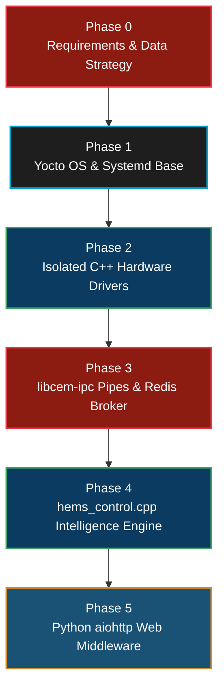
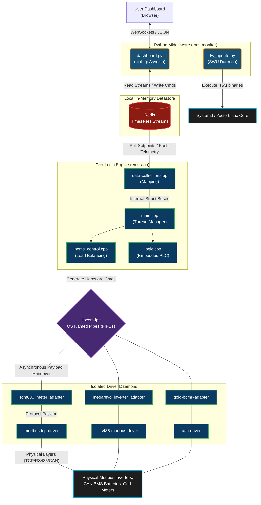
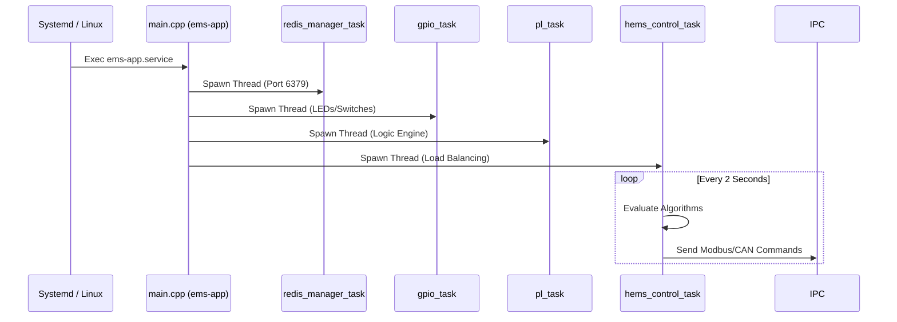
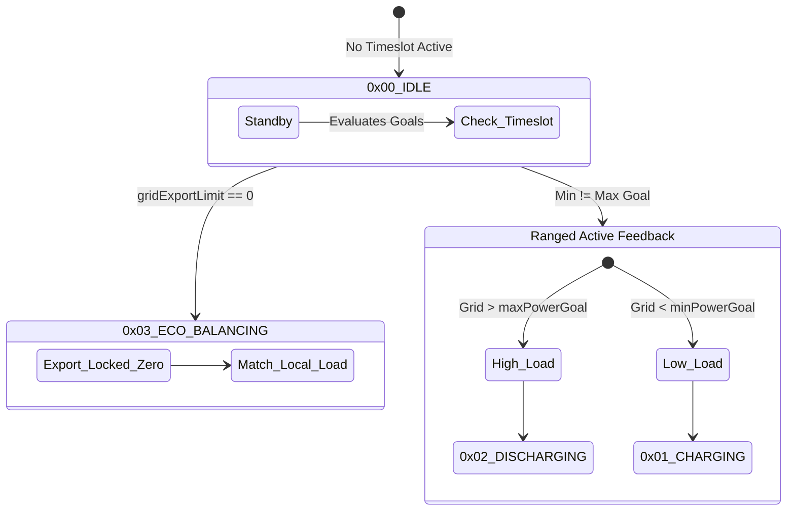
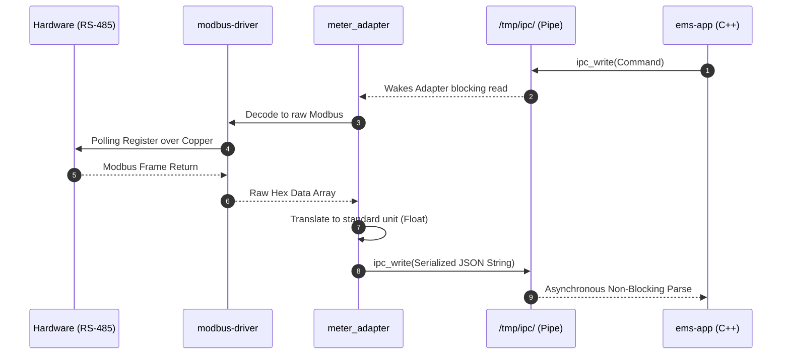
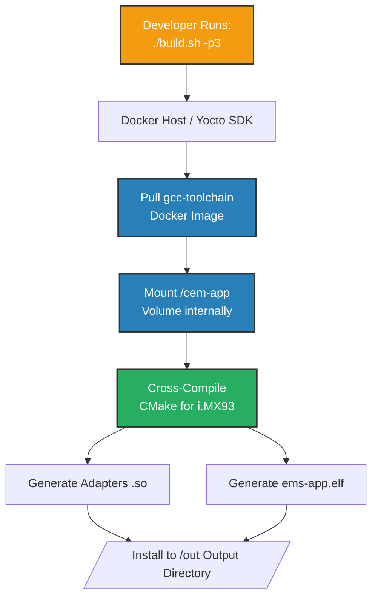
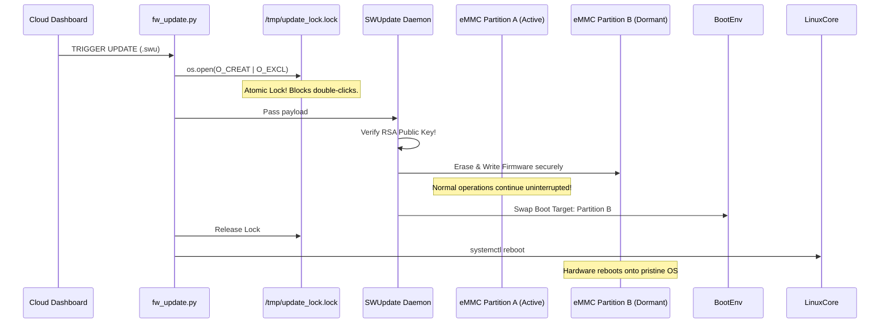

# 🧠 Customer Energy Management System (CEMS): Advanced Developer Guide & Masterclass

**A comprehensive deep-dive into the C++ / Python Microservice Architecture, IPC Pipelines, and the Energy Load-Balancing algorithms running on our Embedded Linux i.MX93 Gateway.**

---

## 📑 Table of Contents
1. [The Architectural Philosophy: Microservices on the Edge](#1-the-architectural-philosophy-microservices-on-the-edge)
2. [High-Level Application Topology](#2-high-level-application-topology)
3. [The Core Brain: `ems-app` (C++)](#3-the-core-brain-ems-app-c)
4. [Peak Shaving & Energy Load Balancing Engine](#4-peak-shaving--energy-load-balancing-engine)
5. [Inter-Process Communication (IPC) & Hardware Abstraction](#5-inter-process-communication-ipc--hardware-abstraction)
6. [Telemetry Broker: Redis Memory Streams](#6-telemetry-broker-redis-memory-streams)
7. [The Python Middleware & Web Dashboard (`ems-monitor`)](#7-the-python-middleware--web-dashboard-ems-monitor)
8. [Embedded Build System & Yocto Integration](#8-embedded-build-system--yocto-integration)
9. [Over-The-Air (OTA) SWUpdate & Security Architecture](#9-over-the-air-ota-swupdate--security-architecture)
10. [Testing, Mocking, and CI/CD](#10-testing-mocking-and-cicd)
11. [Hardware Profile: The i.MX93 Application Processor](#11-hardware-profile-the-imx93-application-processor)
12. [Major Challenges & Software Solutions](#12-major-challenges--software-solutions)
13. [Potential Questions & Answers](#13-potential-questions--answers)

---

## 1. The Architectural Philosophy: Microservices on the Edge

### 1.1 Requirements Gathering & Product Definition
Before a single line of C++ or Python was written, the product owners outlined explicit constraints:
*   **Scale:** The platform had to juggle hundreds of distinct telemetry variables across heterogeneous industrial hardware (Solar Inverters, Battery Managers, Multi-Phase Meters).
*   **Reliability:** A hung TCP socket from a lagging inverter could not crash the critical peak-shaving algorithm. 
*   **UI & Networking:** The product required a rich Web Dashboard for local field engineers, over-the-air encrypted firmware updates, and massive local database caching for offline operation.
*   Given these deep requirements, a bare-metal RTOS on a standard STM32 microcontroller was physically incapable of holding the necessary memory tables and asynchronous networking stacks. An Application-class System-On-Module (SoM) running Embedded Linux (the i.MX93) became the baseline hardware requirement.

### 1.2 System Design Steps & Step-by-Step Execution
To realize these requirements securely, the team broke the architecture down into distinct design phases:

1.  **Phase 1 - The OS Base:** We configured Yocto Embedded Linux, utilizing `systemd` to orchestrate isolated service daemons.
2.  **Phase 2 - The Driver Layer:** We coded isolated C++ binaries (e.g., `rs485-modbus-driver`). These binaries do nothing except manage physical protocol handshakes on the copper lines.
3.  **Phase 3 - IPC and The Broker:** We designed `libcem-ipc` using UNIX Named Pipes to act as firewalls, moving data safely from the hardware drivers up to the algorithmic core. We simultaneously deployed local Redis Streams to cache that telemetry.
4.  **Phase 4 - The Intelligence Engine:** We developed `hems_control.cpp`, which strictly monitors the IPC data and Redis limits to safely execute algorithms (Peak Shaving / Valley Filling) without worrying about physical networking drops.
5.  **Phase 5 - The Web Middleware:** Finally, we wrote `ems-monitor` (Python `aiohttp` with WebSockets). This simply reads the Redis pipeline and pushes visualizations to the user's browser, completely decoupling user interaction from the deterministic C++ core.

### 1.3 The Microservice Rationale
Unlike a bare-metal RTOS which runs a single monolithic binary, the `cem-app` leverages the massive virtual memory space of Linux. Rather than building one giant C++ executable that manages Modbus, Web UIs, databases, and algorithms simultaneously (a monolithic approach), we designed the `cem-app` using an **Edge Microservice Architecture**. 

*   **Why Microservices?** If an industrial solar inverter physically hangs and the Modbus-TCP TCP socket refuses to close, a monolithic application would block on that socket, completely freezing the Peak-Shaving algorithm and potentially blowing a facility's main grid fuse. By separating the Modbus driver into its own isolated background process—speaking to the main algorithm exclusively over asynchronous Named Pipes—we guarantee that **hardware failures isolate perfectly**, never crashing the core logic engine!

---

## 2. High-Level Application Topology

The software stack seamlessly bridges bare-metal hardware interactions built in C++ with cloud-facing WebSockets built in Python asynchronous code, all glued together via explicit OS-level Inter-Process Communication (IPC).

---

## 3. The Core Brain: `ems-app` (C++)

The `ems-app` core binary is natively written in modern **C++17**, utilizing POSIX pthreads and mutexes to aggressively compute multi-phase grid limits concurrently.

### The Threading Model (`main.cpp`)

When Linux initiates `ems-app.service`, the `main.cpp` routine spawns independent, parallel execution threads:
1.  **`redis_manager_task`:** Subscribes to the local Redis server on `localhost:6379`. It pulls down cloud-set configurations (Time Slots) and maps them into safe internal C++ variables.
2.  **`gpio_task`:** Monitors the state of the expansion board I/Os, mapping limit switches and front-panel diagnostic LEDs.
3.  **`pl_task` (The PLC Evaluator):** An extraordinary feature of this firmware is its Embedded Programmable Logic Controller engine (`logic.cpp`). Administrators can dynamically inject logic gates (`AND`, `OR`, `NAND`) and equations (`GT`, `LT`, `Math`) via the config file without recompiling the C++ code! The `pl_task` parses these dynamic logic trees and evaluates them continuously, allowing field engineers to create dynamic alarms and failsafes on the fly.
4.  **`hems_control_task`:** The hyper-critical load-balancing loop. It executes deterministically every 2 seconds to make split-second decisions on whether to Charge or Discharge the battery strings.

---

## 4. Peak Shaving & Energy Load Balancing Engine

The primary mathematical objective of the CEMS gateway is found inside `hems_control.cpp`. It balances dynamic system limits and evaluates strict **Timeslot Schedules** driven by the user.

### 4.1 Boundary Evaluation (Order of Operations)
Before making an energy routing decision, the engine clamps mathematical goals into safe physical boundaries:
1.  **Limits Override Constraints:** Even if the algorithm wants to dump 100kW, if the hardware structure limits state `maxPowerLimit = 50kW`, the math is clamped natively.
2.  **Ensure `minGoal <= maxGoal`:** Pre-flight math to prevent logic inversion faults.

### 4.2 Algorithm: The Decision Mode Engine
The system analyzes the real-time `total_grid_active_power` reading against the computed boundaries and actively shifts physical hardware into one of four `OpMode` states:

*   **`0x00` IDLE:** No active timeslot boundaries command the system. The inverters are placed in standby.
*   **`0x03` ECO_BALANCING:** The grid export limit is rigidly set to `0 Watts` (`minPowerGoal == 0` & `maxPowerGoal == 0`). The system perfectly reacts to internal site loads by ramping inverters to precisely match internal power draw, ensuring absolutely zero wattage spills backwards onto the utility grid!
*   **Ranged Active Feedback (Peak Shaving / Valley Filling):** 
    *   If Grid active power violently exceeds the `maxPowerGoal` (a heavy facility load like a Chiller kicks on), the engine switches to `0x02 DISCHARGING`, splitting the requested offset across the 3 physical electrical phases to knock the peak load down.
    *   If Grid active power drops entirely below `minPowerGoal` (facility load drops), the engine switches to `0x01 CHARGING`, siphoning excess cheap grid capacity quietly back into the batteries.

---

## 5. Inter-Process Communication (IPC) & Hardware Abstraction

To physically command an inverter via Modbus or read BMS data via CAN, `ems-app` utilizes our custom **`libcem-ipc.so`** Shared Library.

### Named Pipes (FIFOs) over File Descriptors

We purposely rejected complex networking IPC (like gRPC or ZeroMQ) in favor of UNIX **Named Pipes**. 
1.  An isolated driver (e.g., `rs485-modbus-driver`) boots as its own isolated Linux process. 
2.  It uses `ipc_create` to mount a physical file handler at `/tmp/ipc/...`.
3.  The main C++ `ems-app` writes a packed, serialized hardware command struct into that file wrapper asynchronously.
4.  The driver daemon wakes up, reads the pipe, executes the blocking protocol-level Modbus handshake over the copper RS-485 line, and pushes the resultant telemetry back up the pipe.

### The Adapter Ecosystem
Because every equipment manufacturer uses completely different memory registers, we build "Adapters" (e.g., `gem120-meter-adapter`, `yunt_pcs_inverter_adapter`). These are localized microservices that listen to the hardware driver and translate raw hexadecimal registers into a standardized unified JSON structure before piping it upwards back to the core. This allows us to hot-swap inverter brands seamlessly without touching the core `hems_control` mathematics.

---

## 6. Telemetry Broker: Redis Memory Streams

Instead of building a rigid SQL database which burns out flash memory sectors with infinite writes, the system pushes data through a local **Redis Datastore**.

*   We use **Redis Streams** (`meters_stream`, `inverters_stream`, `battery_stream`).
*   **Extreme Bitmask Compression:** To ensure the system can run for years without consuming all physical RAM, C++ aggressively bit-compresses the telemetry dictionary. 

| Bit Range | Length (Bits) | Description | Example Values |
| :--- | :--- | :--- | :--- |
| `[63:32]` | 32 Bits | **Device ID** | `0x0001` (Inverter 1), `0xA002` (Meter 2) |
| `[31:24]` | 8 Bits | **Data Type** | `0x01` (Measurements), `0x02` (Status), `0x05` (Battery) |
| `[23:16]` | 8 Bits | **Phase Map** | `0x00` (Phase A), `0x01` (Phase B), `0x02` (Phase C) |
| `[15:0]` | 16 Bits | **Offset Array Index**| `0` (Voltage), `1` (Current), `2` (Active Power) |

    `device_trait_id = (device_id << 32) | trait_id`
    The data encoding itself packs phase maps, data types (Voltage vs Current), and offsets deep into boolean chunks. The Python Web Dashboard decodes it dynamically on the fly. 

---

## 7. The Python Middleware & Web Dashboard (`ems-monitor`)

To drastically remove UI-blocking elements from the C++ process, the dashboard is served locally by an asynchronous Python service (`aiohttp`) known as `ems-monitor`.

*   **`dashboard.py`**: Executes an infinite `asyncio` loop. It connects to the Redis backend, decodes the C++ bitmasks, multiplies fractional metric arrays (e.g., pulling a `uint16` 3450 down to `34.5 Hz`), and emits the full structure as JSON packets over active **WebSockets** to connected browsers.
*   **Graceful Aging (Decayed Fields):** If an inverter adapter daemon crashes, its stream data stops updating. The Python module automatically detects the staling timestamp and gracefully transitions the UI gauges to a "Failed/Offline" state after 5 seconds of silence, without halting the application.

---

## 8. Embedded Build System & Yocto Integration

The project is governed natively by a highly-structured **CMake build orchestration**.

1.  **Modular Componentry:** `CMakeLists.txt` is sliced into individual `add_subdirectory` calls, allowing us to independently compile specific hardware adapters (`gen3-inverter-adapter`) only if the application target requires them.
2.  **`build.sh` Magic:** Developers rarely invoke CMake manually. We provide a massive `build.sh` script that automates compilation across architectures. `build.sh -p1` compiles explicitly for i.MX6, `-p3` for i.MX93, and `-t` compiles the ecosystem completely natively for a generic Linux VM to test logic logic off-board.
3.  **Headless Docker Compilations:** Under the hood, `build.sh` maps the source code volumetrically into an internal `gcc-toolchain` Docker container. This ensures that every developer on the team—and our GitHub Actions CI/CD server—produces an identically checksummed binary free of OS environment variations!

---

## 9. Over-The-Air (OTA) SWUpdate & Security Architecture

Firmware updates on an Embedded Linux Gateway are significantly more complex than an RTOS. 

### Atomic Update Locking (`fw_update.py`)
To prevent the user from clicking the `Update Firmware` button twice simultaneously (which could violently fracture the OS installation), the Python `fw_update.py` script implements atomic UNIX locking. It uses `os.open` with `O_CREAT | O_EXCL` at `/tmp/update_lock.lock`. The physical Linux kernel mathematically guarantees that two threads cannot simultaneously hold this lock.

### The `SWUpdate` A/B Mechanism
1.  The Python layer downloads the `.swu` firmware payload using non-blocking native `aiohttp` streams.
2.  It utilizes the embedded `SWUpdate` framework. This tool verifies the payload's RSA public-key signatures ensuring malicious firmware cannot be flashed.
3.  `SWUpdate` seamlessly flashes the incoming firmware image into the dormant **Fallback B-Partition** of the Flash storage in the background. Note: The application never stops running during the burn cycle!
4.  Once verified, `SWUpdate` swaps the boot variables. When `fw_update.py` fires a Linux `reboot` command, the system boots into the new, pristine B-Partition OS image. If the kernel panics on boot, U-Boot natively detects the failure and automatically rolls back to the A-Partition, making the gateway essentially unbrickable!

### Silicon Hardware OTP Identification
To prevent theft of our IP, the Python stack reaches explicitly into `/sys/bus/nvmem/devices/...` to query the physical offset `1504` of the i.MX93's internal One-Time Programmable (OTP) eFuses. If the hardware string encoded directly into the silicon of the CPU does not explicitly match the configuration file constraints, the software halts. 

---

## 10. Testing, Mocking, and CI/CD

Enterprise stability demands CI/CD validation. 
*   We use the **CUnit** testing framework heavily.
*   By executing `./build.sh -t`, the entire core C++ logic engine is cross-compiled back onto a standard x86 generic Linux VM. It mocks Modbus TCP adapters to inject fake arrays of solar generation profiles. It proves dynamically that `hems_control.cpp` reacts precisely to the fake peaks via automated math checks, ensuring edge case limiters don't fail in production.

---

## 11. Hardware Profile: The i.MX93 Application Processor

Why use an application-class System-On-Module (SoM) Linux stack rather than a bare-metal STM32?

| Feature Matrix | Embedded Linux (i.MX93 Cortex-A55) | Bare-Metal RTOS (STM32 Cortex-M4) |
| :--- | :--- | :--- |
| **Clock Speed** | 1.7 GHz Dual-Core | 168 MHz Single-Core |
| **Volatile Memory (RAM)** | 2 Gigabytes (DDR4) | 192 Kilobytes (SRAM) |
| **Storage (Flash)** | 8 Gigabytes (eMMC) | 1 Megabyte (Silicon Array) |
| **IPC Mechanics** | Named Pipes, Sockets, Shared Mem | RTOS Queues, Mailboxes, Semaphores |
| **Updating Scope** | Full TCP/IP stack UI, Kernel, RootFS | Single Binary block swap |
| **Primary Use-Case** | Data Aggregation, Web UIs, Complex Algorithms | Hard-realtime safety clamping (nanoseconds) |

*   **Raw Compute & Memory:** The `i.MX93` (ARM Cortex-A55) runs in the gigahertz realm and holds gigabytes of DDR4 RAM. We need this space specifically to run full `aiohttp` web servers and maintain deep Redis databases capable of caching multi-phase energy algorithms gracefully across hundreds of concurrent data streams. 
*   **Networking Flexibility:** Connecting multiple distinct gigabit Ethernet interfaces, handling internal OpenVPN tunnels to remote broker infrastructures natively, and supporting USB mass-storage firmware updates requires the massive flexibility of a true Linux kernel.

---

## 12. Major Challenges & Software Solutions

*   **Challenge 1: The Monolithic Blocking Bug:** Early in development, the team attempted to integrate `libmodbus` natively inside the `ems-app` C++ core loop. If a remote inverter lost Wi-Fi, the internal thread would hang for 5 seconds waiting for a TCP timeout. This froze the entire Grid Peak Shaving calculation, risking blown facility fuses! **The Solution:** We utterly divorced hardware from logic. We wrapped every hardware protocol into independent Linux processes (`modbus-tcp-driver`), piping only the successful JSON extractions into the core via non-blocking asynchronous UNIX Named Pipes using `libcem-ipc`.
*   **Challenge 2: Multi-Process Race Conditions during OTA Update:** We encountered unpredictable corruptions when an automated cron-job and a user clicked the update dashboard button simultaneously. **The Solution:** The team engineered an atomic locking abstraction (the python `O_CREAT | O_EXCL` flags on `update_lock.lock`), forcing all competing processes to instantly reject simultaneous update commands at the deepest OS level.
*   **Challenge 3: Disparate Vendor Data Formats:** An SDM630 Meter formats its active power as an inverted `Float32`, while a MegaRevo Inverter uses a two's-complement `UInt16` offset. **The Solution:** We introduced localized "Adapters". The driver blindly grabs the raw hexadecimal array. The Adapter (a mini-microservice) applies the specific mathematical translations configured in `/etc/ems-app-support/EMS.json` and hands `ems-app` a universally clean integer.

---

## 13. Potential Questions & Answers

If you discuss this project during a technical architecture review, expect the following:

**Q1: Why did you use Redis instead of a traditional SQL Database (e.g. SQLite) for local telemetry?**
> **Answer:** Embedded databases stored on eMMC or SD Cards have limited physical rewrite cycles. Constantly writing telemetry streams (multi-phase voltage polling at 1Hz) to SQLite would burn out the physical Flash Storage transistors in months. We used Redis precisely because it operates entirely **In-Memory** space! It acts as an ultra-fast data broker without physically degrading the industrial gateway.

**Q2: What happens to `ems-app` if an adapter process (like `gold-bcmu-adapter`) crashes?**
> **Answer:** Thanks to our aggressive microservice architecture and Named Pipes (`libcem-ipc`), a crashed adapter acts merely as a severed pipe. `ems-app` simply registers that the pipe is silent. It natively marks the variables as non-updated via timestamp verification. The main `hems_control` logic engine evaluates this and drops gracefully to a safe state without ever actually crashing or interrupting other active adapters. Systemd will theoretically detect the exited adapter and automatically respawn it in the background!

**Q3: Explain how the Embedded PLC `logic.cpp` achieves real-time logic modification without C++ recompilation.**
> **Answer:** It parses the JSON configuration payload containing symbolic equation trees (like `"AND": ["InverterFault", "GridLoss"]`). It recurses these symbolic configurations deeply into C++ function pointers maps that execute dynamically. The user simply alters the JSON, `ems-app` reloads the tree configuration at runtime, and perfectly modifies boolean actions in memory.

---

<i>Designed and Engineered by the EMS Firmware Team. Strictly Confidential.</i>

