<div align="center">

# 🧠 EMS Mini RTOS: Advanced Developer Guide & Masterclass

**A comprehensive deep-dive into the FreeRTOS architecture, deterministic multitasking, and bare-metal STM32 hardware abstraction for the Energy Management System.**

---

</div>

## 📑 Table of Contents
1. [The Real-Time Philosophy](#1-the-real-time-philosophy)
2. [FreeRTOS Multitasking Topology](#2-freertos-multitasking-topology)
3. [Inter-Task Communication (IPC)](#3-inter-task-communication-ipc)
4. [Deferred Interrupt Processing (ISRs)](#4-deferred-interrupt-processing-isrs)
5. [Network Stack (WIZnet W5500 Hardware Offload)](#5-network-stack-wiznet-w5500-hardware-offload)
6. [Over-The-Air (OTA) Updates & Memory Protection](#6-over-the-air-ota-updates--memory-protection)
7. [The OS API Layer: Why CMSIS-RTOS v2?](#7-the-os-api-layer-why-cmsis-rtos-v2)
8. [FreeRTOS Feature Checklist](#8-freertos-feature-checklist)
9. [Unused FreeRTOS Features](#9-unused-freertos-features)
10. [Project Design & Team Methodology](#10-project-design--team-methodology)
11. [Testing, Mocking & Static Analysis](#11-testing-mocking--static-analysis)
12. [Toolchain & Advanced Debugging Stack](#12-toolchain--advanced-debugging-stack)
13. [Hardware Selection: Why the STM32F407?](#13-hardware-selection-why-the-stm32f407)
14. [Estimated Hardware & Bill of Materials (BOM) Cost](#14-estimated-hardware--bill-of-materials-bom-cost)
15. [C Code to Silicon: The Build Flow & Linker Mapping](#15-c-code-to-silicon-the-build-flow--linker-mapping)
16. [The System Boot Flow & Timings](#16-the-system-boot-flow--timings)
17. [High-Level Architecture & Hardware Schematics](#17-high-level-architecture--hardware-schematics)
18. [Major Challenges & Solutions](#18-major-challenges--solutions)
19. [Efficiency, Optimizations & Memory Footprint](#19-efficiency-optimizations--memory-footprint)
20. [System Reliability & Product Safety](#20-system-reliability--product-safety)
21. [Potential Questions & Answers](#21-potential-questions--answers)
22. [Load Balancing & Time-Based Control](#22-load-balancing--time-based-control)

---

## 1. The Real-Time Philosophy

Unlike traditional Linux environments (e.g., the `ems-app` running on i.MX93) which rely on the non-deterministic Completely Fair Scheduler (CFS), the **EMS Mini RTOS** operates in a strictly constrained environment designed for **hard real-time** execution.

With only **192 KB of RAM** and **1 MB of Flash**, we cannot afford polling loops (`while(1)`) that block the CPU. Instead, we rely on an **Event-Driven, Interrupt-Backed, DMA-Assisted FreeRTOS Architecture.**

### Why RTOS instead of Bare-Metal (Super-Loop)?
A common question internally and during code reviews is: *"Why introduce the complexity of an RTOS? Why not just write standard bare-metal C code using a giant `while(1)` polling loop?"*

The answer lies in **Deterministic Decoupling**.

1. **The Polling Jitter Problem:** In a bare-metal super-loop, the CPU must check every peripheral sequentially (e.g., `Read Grid Meter -> Read Battery -> Check MQTT -> Parse JSON`). If a network packet hangs and the TCP/IP stack takes 200ms to recover, or if building/parsing an MQTT payload blocks the CPU for 50ms, the entire loop freezes. This causes violent violations of strict timing protocols (e.g. Modbus 3.5 character idle frames) and causes immediate CAN bus mailbox starvation.
2. **Preemptive Prioritization:** FreeRTOS provides a "Preemptive Kernel". If the CPU is busy grinding through a lower-priority task like formatting a massive JSON payload from the Cloud (`Task_Net`), and a critical Modbus DMA timer expires (`Task_Poll`), FreeRTOS physically context-switches the CPU. It pauses the JSON parsing mid-instruction, hands 100% of the CPU to flush the physical Modbus queues, and then gracefully resumes the JSON parsing exactly where it left off. A bare-metal architecture cannot easily achieve this without unmaintainable "spaghetti" nested-interrupt state machines.
3. **Power & Thermal Efficiency:** A bare-metal super-loop constantly consumes 100% of the CPU clock cycles polling via `if (flag_ready)`. With FreeRTOS, tasks that are waiting for timeouts or hardware DMA signals enter the `Blocked` state. This automatically forces the FreeRTOS Scheduler into the `Idle Task`, which executes the native ARM assembly instruction `WFI` (Wait For Interrupt). This physically halts the ALU clock tree, dropping CPU power consumption to near zero when the system is purely waiting on physical hardware, extending component lifespan and improving thermal constraints.

### Hardware Profile: STM32F407VGT6
*   **Clock:** 168 MHz (via PLL)
*   **Industrial Bridges:** Modbus RTU (USARTs with DMA) & Battery BMS (Hardware CAN)
*   **Networking:** WIZnet W5500 via SPI (Offloaded TCP/IP Stack)

---

## 2. FreeRTOS Multitasking Topology

In FreeRTOS, tasks spend the vast majority of their lives in the **Blocked State**, consuming 0% CPU cycles until an external event (Interrupt, Timer, or Queue Message) wakes them up. We use **Strict Priority-Based Preemptive Scheduling**.

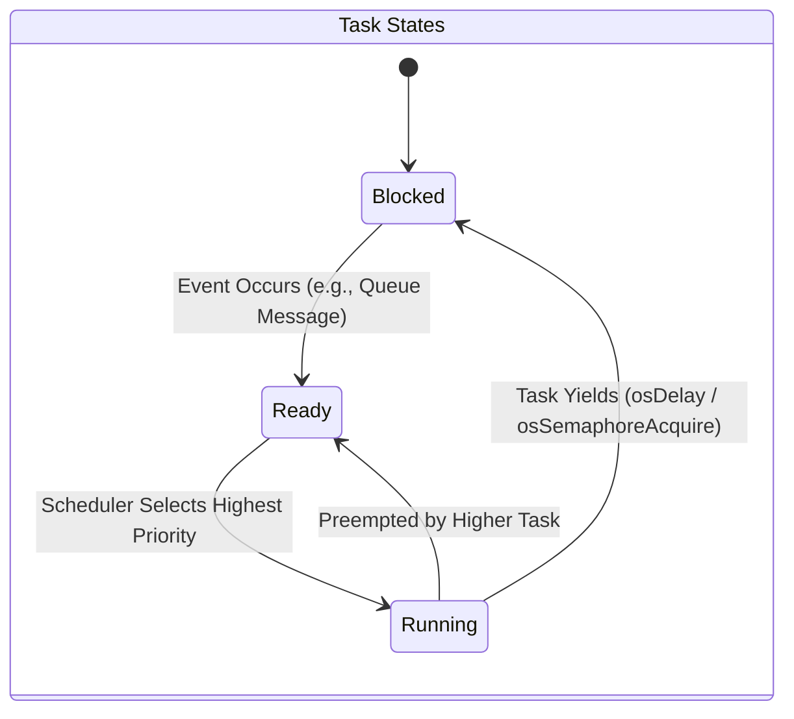

### 🧵 Task Breakdown

| Task Name | Priority | Core Responsibility | Typical State |
| :--- | :--- | :--- | :--- |
| **`Task_Poll`** | `High` (`osPriorityRealtime`) | **Hardware Interfacing & Data Harvesting:** Executes strict-timing polling loops on physical interfaces (RS-485 Modbus via DMA for Grid/Inverters, CAN bus for Battery BMS). It pulls raw electrical data, packages it into structs, and safely queues it up for the logic task. Needs the highest priority to prevent timing jitter and dropped hardware packets. | **Blocked** on `osDelay(300)` or `osSemaphoreAcquire` waiting for DMA completion. |
| **`Task_Ctrl`** | `Medium` (`osPriorityHigh`) | **Core EMS Decision Logic (The Brain):** Wakes up instantaneously the moment new hardware data arrives. Calculates power flow limits, executes localized safety failsafes, and runs deterministic peak-shaving formulas to actively command the inverter to charge or discharge. | **Blocked** indefinitely waiting on `osMessageQueueGet` for new telemetry. |
| **`Task_Net`** | `Low` (`osPriorityNormal`) | **Cloud Communication & MQTT IoT Bridge:** Handles all external internet communications. It serializes internal telemetry into JSON strings, publishes them to the Cloud broker via the SPI Ethernet chip, and listens for remote command overrides. Lowest priority ensures network slowdowns never stall physical safety limits. | **Blocked** on `osDelay(250)` or TCP Socket waits. |

**Task Implementation Pseudo-Code (`Task_Poll`):**
```c
// CMSIS-RTOS v2 Task Definitions
const osThreadAttr_t pollTask_attributes = {
  .name = "Task_Poll",
  .stack_size = 512 * 4, // 2048 Bytes allocated statically
  .priority = (osPriority_t) osPriorityRealtime,
};

void Start_Task_Poll(void *argument) {
  for(;;) {
    // 1. Kick off UART DMA to physical Grid Meter
    HAL_UART_Receive_DMA(&huart2, rx_buffer, sizeof(rx_buffer));
    
    // 2. Block until hardware DMA completes (Consumes 0% CPU!)
    osSemaphoreAcquire(dmaRxSemaphore, osWaitForever);
    
    // 3. Process Modbus data & Push struct to Queue
    SystemState_t new_state = parse_modbus_data(rx_buffer);
    osMessageQueuePut(Queue_DataHandle, &new_state, 0, 0);
    
    // 4. Yield CPU rigidly for 300ms polling cycle
    osDelay(300);
  }
}

// Triggered sequentially inside main()
osThreadNew(Start_Task_Poll, NULL, &pollTask_attributes);
```

> **Note on Naming & Priority Levels:** 
> Why is `osPriorityHigh` labeled as "Medium"? 
> The terms "High, Medium, Low" here represent the **relative priority within our application's 3-task hierarchy**, not the absolute OS priority logic. 
> To guarantee hardware polling *always* preempts the logic brain, we gave `Task_Poll` an objectively higher systemic priority (`osPriorityRealtime` = Priority 48). We gave the logic brain `Task_Ctrl` the next step down (`osPriorityHigh` = Priority 40), meaning it sits in the *middle* of our specific application stack. The cloud bridge `Task_Net` sits at the bottom (`osPriorityNormal` = Priority 24).
> This mapping ensures we establish a strict preemptive hierarchy customized to our precise needs.
> 
> **Why use 48, 40, and 24 instead of simply 1, 2, and 3?**
> We *could* assign FreeRTOS priorities 1, 2, and 3 directly, but we use the CMSIS v2 constants specifically for **future scalability**. 
> CMSIS intentionally leaves massive numerical "gaps" between priority tiers (e.g., jumping from 24 to 32 to 40). This borrows the logic of old-school BASIC programming (Line 10, Line 20). If we used priorities 1, 2, and 3, and months from now we needed to inject a new "Medium-High" task (e.g., `Task_RemoteEmergencyStop`) right between `Task_Ctrl` and `Task_Poll`, we would have to re-number and shift our entire RTOS priority map. 
> Because we used the CMSIS gaps, we can seamlessly insert that new task at Priority 44 without ever touching the configuration of `Task_Poll` (48) or `Task_Ctrl` (40).

---

## 3. Inter-Task Communication (IPC)

To prevent race conditions, tasks **never** access shared global variables directly. Instead, we use **FreeRTOS Message Queues** (`osMessageQueueNew`) to pass decoupled data structures by value.

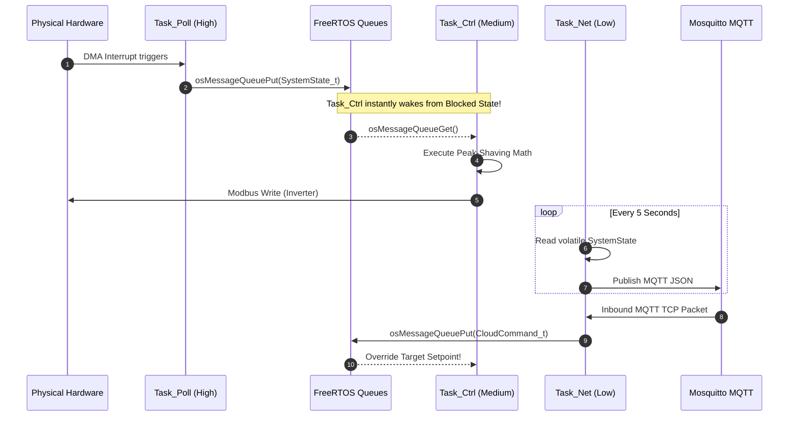

### The Operational Queues & Data Structures

Our architecture relies on three explicit FreeRTOS Ring-Buffer Queues to manage data flow deterministically.

**Queue Creation & Routing Pseudo-Code:**
```c
// 1. Queue Handle Definitions
osMessageQueueId_t Queue_DataHandle;
const osMessageQueueAttr_t Queue_Data_attributes = { .name = "Queue_Data" };

// 2. Queue Allocation (During System Boot)
// Capacity: 32 elements deep. Element size: sizeof(SystemState_t)
Queue_DataHandle = osMessageQueueNew(32, sizeof(SystemState_t), &Queue_Data_attributes);

// 3. Task_Ctrl Intercepting the Queue
void Start_Task_Ctrl(void *argument) {
  SystemState_t system_state; // Local memory copy for isolation
  
  for(;;) {
    // 4. Block forever (0% CPU) until Task_Poll pushes new telemetry!
    if(osMessageQueueGet(Queue_DataHandle, &system_state, NULL, osWaitForever) == osOK) {
        
        // Data has seamlessly arrived by value!
        // Run strict safety limits and peak-shaving formulas
        run_peak_shaving_algorithm(&system_state);
        
        // Physically transmit hardware command back to inverter
        execute_inverter_command();
    }
  }
}
```

> **What does "16 Elements" actually mean in RAM?**
> A common misconception is that "16 Elements" means 16 blocks of huge 256-byte buffers.
> In FreeRTOS, an "element" is the exact `sizeof(YourStruct)`.
> For example, `CanFrame_t` contains an ID (4 bytes), an 8-byte payload array (8 bytes), a DLC length (1 byte), and a flag (1 byte)—roughly 14 to 16 bytes total with padding.
> Therefore, allocating **16 Elements** for the CAN queue consumes a remarkably tiny **~256 bytes of RAM total** `(16 loops * 16 bytes)`, NOT 4,096 bytes. FreeRTOS allocates this specific block of RAM completely statically upon booting, permanently eliminating memory fragmentation risks!

1. **`Queue_Data` (Bottom-Up Telemetry)**
   * **Capacity:** 32 Elements (`SystemState_t`)
   * **Function & Sizing Logic:** Pushed by `Task_Poll` directly to `Task_Ctrl`, it contains the unified picture of the system (Grid Watts, Battery SOC, existing hardware limits). A capacity of 32 provides massive safety mapping; if the Brain (`Task_Ctrl`) temporarily stalls doing heavy decision math, `Task_Poll` can queue up up to 32 independent polling loop snapshots before dropping data. Because `Task_Ctrl` is blocked with `osWaitForever` on this queue, the microsecond `Task_Poll` finishes assembling the Modbus/CAN telemetry and pushes to this queue, the logic brain awakens instantly.

2. **`Queue_Cmd` (Top-Down Overrides)**
   * **Capacity:** 16 Elements (`CloudCommand_t`)
   * **Function & Sizing Logic:** Pushed by `Task_Net` down to `Task_Ctrl`. When a remote user inputs a new command on the dashboard or issues a limit change via MQTT, `Task_Net` catches it on the W5500 SPI, parses the JSON, and drops the raw struct into this queue. A capacity of 16 is sufficient because remote human/cloud commands arrive slowly (e.g. 1 per second); we will never realistically hit 16 queued operator commands before the Brain processes them. It acts as an asynchronous interrupt directly prioritizing logic overrides.

3. **`queueCanRxHandle` (ISR hardware offloading)**
   * **Capacity:** 16 Elements (`CanFrame_t`)
   * **Function & Sizing Logic:** This is the most critical safety queue, designed to prevent J1939 CAN bus dropped packets. It bridges raw silicon Interrupts directly to software. When a battery rack broadcasts rapid data, it triggers a nanosecond hardware ISR. The ISR rips the data out of the STM32's fragile 3-element silicon mailbox and pushes it into this much deeper 16-element software ring buffer. This provides a software "shock absorber," allowing `Task_Poll` to lazily grab frames 16x slower than the bus physically arrives without ever losing critical voltage telemetry.

### What Happens When a FreeRTOS Queue is FULL?
If a writer tries to push data into a queue that has no remaining capacity, the behavior is strictly defined by the **Timeout Parameter** supplied to the `osMessageQueuePut()` command.
* **Timeout = 0 (`osWait_None`):** (Used by our `queueCanRxHandle` ISR). If a battery sends its 17th consecutive packet before `Task_Poll` reads the first 16, the ISR must *never* block. It uses a timeout of `0`. The `osMessageQueuePut` function instantly fails and returns `osErrorResource`. The 17th packet is permanently dropped, but the FreeRTOS OS kernel continues to run safely without crashing or hanging.
* **Timeout = MAX (`osWaitForever`):** If a software task tries to write to a full queue with `osWaitForever`, that writing task is immediately yanked by the OS Scheduler and placed into a infinite `Blocked` state at 0% CPU. It will permanently sleep until some other task comes along and reads a piece of data out of the queue, making room for the new payload. We explicitly avoid using this on pushing operations to prevent tasks from unintentionally stalling the system.

---

## 4. Deferred Interrupt Processing (ISRs)

> 💡 * Key Concept:** The absolute golden rule of RTOS design is to keep Interrupt Service Routines (ISRs) incredibly short. ISRs should only move data into an RTOS object, unblock a task, and exit. All heavy processing is **deferred** to the task level.

### Case A: Modbus RS-485 via DMA & Semaphores

**Why DMA instead of Normal UART RX/TX Interrupts?**
* **The CPU Starvation Problem:** A standard Modbus RTU telemetry packet is roughly 256 bytes long. If we used standard `HAL_UART_Receive_IT()`, the STM32's silicon would force the FreeRTOS CPU to stop what it is doing and jump into an Interrupt Service Routine (ISR) **256 individual times**—once for every single byte. This causes massive CPU thrashing and risks starving lower-priority tasks.
* **The DMA Solution:** DMA (Direct Memory Access) acts as an independent hardware co-processor. When we call `HAL_UART_Receive_DMA()`, we simply hand the hardware a memory pointer. The DMA silicon physically grabs data from the UART queue and places it directly into RAM completely autonomously while the main FreeRTOS CPU sleeps at 0% load. The CPU is only interrupted exactly **ONCE** at the very end when the entire 256-byte frame is fully assembled (detected via the physical UART `IDLE` line).

**What is the UART IDLE Line Detection?**
When using DMA to receive variable-length frames (like Modbus, where a slave might reply with 10 bytes or 256 bytes), we cannot simply tell the DMA "interrupt the CPU when you receive exactly X bytes" because we don't always know X in advance. If the slave only sends 15 bytes and we told the DMA to wait for 200, the FreeRTOS task would hang forever. 
Instead, we rely on the physical silicon of the UART peripheral. When the physical slave device finishes transmitting its packet, it lets the RS-485 copper wire go silent. The STM32 hardware watches this electrical silence. If the receiver line (`RX`) remains held completely high (Logic 1 / Idle) for the duration of one complete character frame (typically 10 bits), the STM32 silicon mathematically concludes: *"The sender has stopped talking."* 
It instantly throws a native hardware **IDLE Interrupt**. This is magical for RTOS design: it allows the FreeRTOS task to wake up safely the exact microsecond a message of *any* arbitrary length finishes streaming into RAM, guaranteeing perfect deterministic Modbus timing without polling.

#### The DMA Execution Flow

**Why does toggling the DE pin in a standard RTOS loop cause dangerous logic jitter?**
RS-485 is a *half-duplex* physical bus. The transceiver chip (like a MAX3485) can either `Transmit` or `Receive`, but never both at the same time. The direction is controlled by the physical `DE` (Data Enable) pin.
If we ran a standard RTOS loop like this:
```c
HAL_UART_Transmit(data_out); // Send the data
HAL_GPIO_WritePin(DE_PIN, LOW); // Switch to Receive mode!
```
There is a massive risk. The microsecond `HAL_UART_Transmit()` finishes, the RTOS might decide to switch context to service a network packet or a CAN interrupt. This means the CPU pauses right *before* executing `HAL_GPIO_WritePin(DE, LOW)`. During this 1-2 millisecond delay, the transceiver is stuck in "Transmit" mode.
The slave inverter receives the poll and replies almost instantly. Because the STM32's transceiver is still stuck in transmit mode (it's deaf!), the physical incoming bytes from the inverter crash into the transceiver and are permanently dropped. This is **timing jitter**. 
By binding the `DE` pin toggle exclusively to the silicon-level `TxCpltCallback()` (hardware interrupt), we guarantee that the nanosecond the last transmission bit leaves the silicon register, the `DE` pin drops to `LOW`, making the system instantly ready to hear the slave's reply, perfectly decoupling it from the OS scheduler.

**The Exact DMA Flow:**

1.  `Task_Poll` triggers `HAL_UART_Transmit_DMA` and instantly puts itself to sleep via `osSemaphoreAcquire(rxCompleteSem, 250ms)`.
2.  The DMA natively blasts bytes. The nanosecond transmission completes, a physical silicon interrupt fires: `HAL_UART_TxCpltCallback()`.
3.  The ISR instantly pulls the `DE` pin **LOW** (Listen Mode) and exits.
4.  When the Slave responds, the Silicon detects an `IDLE` line and fires `HAL_UARTEx_RxEventCallback()`.
5.  This ISR executes **`osSemaphoreRelease()`**, which instantly awakens `Task_Poll` to parse the payload.

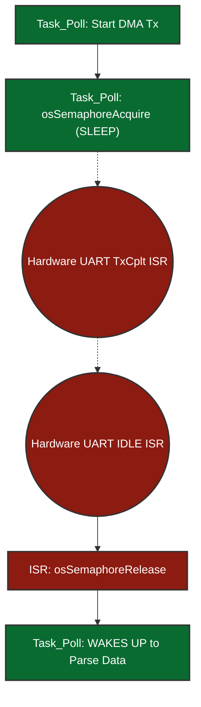

### Case B: CAN Bus Hardware Mailbox Overflows

**Why not use DMA for CAN?**
A common question is: *"If DMA is so great for Modbus, why don't we use DMA for the CAN bus?"*
1. **The Nature of CAN vs Modbus:** Modbus RS-485 sends large, uninterrupted, sequential streams of data (e.g., 256 continuous bytes) that are perfect for a DMA engine to stream into a large RAM buffer. CAN bus, however, is comprised of tiny, disjointed 8-byte frames that arrive randomly based on arbitration logic. 
2. **Silicon Limitations:** The STM32F407 has **two DMA controllers** (DMA1 and DMA2) offering a total of **16 streams**. However, the `bxCAN` (Basic Extended CAN) peripheral physically built into this silicon era of STM32 does not support native DMA requests to pull individual 8-byte frames out of the mailbox. (Newer chips like STM32G4 with `FDCAN` do, but not the F407).

**Does reading CAN via an ISR overload the CPU?**
*   **The Overload Myth:** At 250kbps, a sudden burst of BMS broadcasts can easily overflow the STM32's tiny 3-element CAN receive mailbox. You might think reading it via an ISR every time a frame arrives is a huge CPU overload.
*   **The Reality:** The `HAL_CAN_RxFifo0MsgPendingCallback()` ISR is extraordinarily fast. It takes less than **1 microsecond** for the Cortex-M4 CPU to execute. It simply executes 3 native ARM assembly instructions to copy 8 bytes from the hardware mailbox register directly into checking our FreeRTOS `queueCanRxHandle` (an expandable 16-element deep RAM queue).
*   **The Fix:** This nanosecond ISR prevents the hardware mailbox from dropping frames. Later, when `Task_Poll` runs at its leisure, it casually drains this FreeRTOS software queue (`osMessageQueueGet(..., 0)` - *non-blocking*) without having dropped a single frame from the batteries.

---

## 5. Network Stack (WIZnet W5500 Hardware Offload)

The STM32F407 does not run a bloated software TCP/IP stack (like LwIP) which would consume massive amounts of CPU and RAM. Instead, it delegates all heavy ethernet processing to the WIZnet W5500 silicon wrapper via SPI.

**1. Who manages the IP Address and DHCP?**
The W5500 itself only handles IP/TCP/UDP *packet routing* in hardware; it does *not* have an internal DHCP engine. To achieve DHCP, the STM32 uses the lightweight `WIZnet DHCP Client Library` written in C. 
During boot, the STM32's `Task_Net` writes a broadcast UDP packet to the W5500. The local gateway router responds with a DHCP Offer. The STM32 parses the UDP payload and physically writes the finalized IP Address, Gateway, and Subnet Mask directly into the W5500's silicon memory registers (e.g., `SIPR`). Once written, the hardware operates autonomously.

**2. Does it support IPv4 or IPv6?**
The W5500 is strictly a physical **IPv4** hardware controller. It does not have the silicon state machines to natively handle 128-bit IPv6 headers or ICMPv6 Neighbor Discovery. If we required IPv6, we would be forced to run the W5500 in `MACRAW` generic bypass mode and run the LwIP software stack on the STM32 CPU, defeating the entire purpose of 0% CPU hardware offloading.

**3. Is it Stateful or Stateless?**
The W5500 is completely **Stateful** at the Transport Layer (Layer 4). It contains 8 independent hardware socket registers. When `Task_Net` opens an MQTT socket, the W5500 silicon independently handles the 3-way TCP handshake (`SYN / SYN-ACK / ACK`), sliding window size tracking, sequence number acknowledgement, and packet retransmission timeouts. The STM32 does not manage any TCP state; it simply asks the W5500 "Are you connected?" and "Give me the readable payload bytes".

**4. What happens if the Network Cable is unplugged at runtime?**
We achieve **indestructible Auto-Reconnect** without ever resetting the STM32 CPU. 
The W5500 has a physical Ethernet PHY status register (`PHYCFGR`). Inside the primary loop of `Task_Net`, we continuously run a FreeRTOS polling execution (`wizphy_getphylink()`).
*   **Disconnect:** If a technician rips the ethernet RJ45 cable out of the socket, the PHY Link physically severs. `Task_Net` detects this instantly, safely closes the MQTT C-socket, flushes the buffers, and blocks itself into a sleepy waiting state (`osDelay(1000)`).
*   **Reconnect:** When the cable is plugged back in, the PHY Link restores. `Task_Net` wakes up, re-runs the DHCP Client to acquire a fresh IP lease, executes a completely new hardware TCP socket connection, and seamlessly reconnects to the MQTT Broker. The local FreeRTOS Peak-Shaving algorithms never paused or crashed during this entire network outage!

---

## 6. Over-The-Air (OTA) Updates & Memory Protection

One of the most complex features of a bare-metal RTOS is updating its own executable code without "bricking" the board in the field.

**What does "writing directly to Silicon transistors" actually mean?**

On a Linux system (like the i.MX93), the OS abstracts storage behind a filesystem (`ext4`, `FAT`). You write a file and the OS negotiates with the eMMC controller to find free Flash blocks, manage wear-levelling, and handle journaling transparently.

On a bare-metal STM32, there is **no filesystem abstraction layer**. The internal Flash memory is a 1MB block of **Floating-Gate Transistors** etched into the silicon die. A floating-gate transistor is a standard MOSFET but with a second isolated gate (the "floating gate") sandwiched between two layers of silicon dioxide insulation:

```
     Control Gate  ← HAL_FLASH_Program() applies a precise HV pulse here
          │
 ┌────────────────┐
 │   SiO₂ Layer  │  ← Electrical insulator
 │ ┌────────────┐ │
 │ │FLOATING    │ │  ← Electrons TRAPPED here = logical bit "0"
 │ │GATE        │ │  ← NO electrons here     = logical bit "1"
 │ └────────────┘ │
 │   SiO₂ Layer  │  ← Electrical insulator
 └────────────────┘
     Source / Drain → Current flows (1) or is blocked (0)
```

*   **Writing (Programming) a bit to `0`:** `HAL_FLASH_Program()` instructs the Flash Controller to apply a high-voltage (~12V) pulse to the control gate. Quantum tunneling forces electrons through the insulating oxide layer onto the floating gate. These trapped electrons block current flow through the transistor, representing a physical `0`.
*   **Reading a bit:** A lower read voltage is applied. If current flows through the transistor → `1`. If blocked by trapped electrons → `0`.
*   **Erasing a sector:** A reversed high voltage sweeps all trapped electrons off the floating gates of an **entire sector at once** (e.g., 16KB or 128KB). This is why erasing takes **10 to 50 milliseconds** — thousands of transistors must be simultaneously discharged — and physically locks the entire ARM data bus during the operation.
*   **Non-volatility:** The electrons remain trapped on the floating gate for **10 to 100 years** with zero power applied. This is why Flash memory retains firmware across power cycles.

> **❓ "Is this floating-gate array a separate chip, or part of the STM32?"**
>
> It is **built directly into the STM32F407 die itself**. There is no external Flash chip. The STM32F407VGT6 is a **System-on-Chip**: a single 10mm × 10mm silicon package that contains the Cortex-M4 CPU, DMA controllers, all peripherals (UART, SPI, CAN), **1MB of Flash**, and 192KB of SRAM — all fabricated together on one piece of silicon.
>
> ```
> STM32F407VGT6 — Single Silicon Die (~49mm²)
> ┌──────────────────────────────────────────────────────┐
> │  ┌─────────────┐   ┌─────────────────────────────┐  │
> │  │ Cortex-M4   │   │ 1MB Internal Flash           │  │
> │  │ CPU + FPU   │   │ (8,388,608 floating-gate     │  │
> │  │ @ 168MHz    │   │  transistors in a grid)      │  │
> │  └─────────────┘   └─────────────────────────────┘  │
> │  ┌─────────────┐   ┌─────────────────────────────┐  │
> │  │ 192KB SRAM  │   │ Peripherals: UART, SPI, CAN  │  │
> │  │ + 64KB CCM  │   │ DMA, Timers, ADC, I2C...    │  │
> │  └─────────────┘   └─────────────────────────────┘  │
> └──────────────────────────────────────────────────────┘
>              All on ONE physical IC package.
>              No external Flash chip required.
> ```
>
> **Flash vs SRAM — What is each one used for?**
>
> These are two completely different types of silicon memory with opposite properties:
>
> | Property | Flash (1MB) | SRAM (192KB + 64KB CCM) |
> |---|---|---|
> | **Cell type** | Floating-gate transistor | Standard 6-transistor SRAM cell |
> | **Volatile?** | ❌ Non-volatile — survives power-off | ✅ Volatile — contents lost instantly on power-off |
> | **Write speed** | Very slow (~ms per sector erase) | Extremely fast (single CPU cycle) |
> | **What lives here** | The firmware binary (code + constants) | Everything that runs at runtime |
> | **Analogy** | Your hard drive / eMMC | Your RAM / DDR |
>
> **What exactly is in each region at runtime in this project?**
>
> ```
> FLASH (1MB) — Non-volatile, survives power-off         @ 0x08000000
> ┌─────────────────────────────────────────────────┐
> │ MCUboot binary + embedded ECDSA public key      │ ← Bootloader code
> │ Scratch swap space (empty, used by MCUboot)     │
> │ FreeRTOS app: compiled machine code             │ ← CPU fetches instructions here
> │   ├─ Task function code (StartPollTask etc.)    │
> │   ├─ HAL driver machine code                    │
> │   ├─ const lookup tables, string literals       │
> │   └─ Initial values of global variables (.data) │
> │ Bank 2: OTA download slot (empty until OTA)     │
> └─────────────────────────────────────────────────┘
>
> SRAM (192KB) — Volatile, wiped on every power-off      @ 0x20000000
> ┌─────────────────────────────────────────────────┐
> │ .data section: initialized global variables      │ ← Copied from Flash at boot
> │   e.g. int retryCount = 0;                      │
> │ .bss section: zero-initialized globals          │ ← Zeroed by _start()
> │   e.g. SystemState_t globalState;               │
> │ FreeRTOS Heap: Queues, Semaphore control blocks │
> │   ├─ Queue_Data ring buffer (32 × SystemState_t)│
> │   ├─ Queue_Cmd ring buffer  (16 × CloudCmd_t)   │
> │   └─ queueCanRxHandle ring buffer               │
> │ Task Stacks (each task gets its own SRAM stack) │
> │   ├─ Task_Poll stack (512 × 4 = 2KB)            │
> │   ├─ Task_Net  stack (512 × 4 = 2KB)            │
> │   └─ Task_Ctrl stack → CCM RAM (see below)      │
> │ chunkBuffer[1024]: OTA 1KB staging buffer        │ ← Temporary, overwritten each chunk
> │ mqttPayloadBuffer: JSON telemetry string buffer  │
> │ rx_buffer: incoming Modbus DMA landing zone      │
> └─────────────────────────────────────────────────┘
>
> CCM RAM (64KB) — Zero-wait-state, CPU bus direct       @ 0x10000000
> ┌─────────────────────────────────────────────────┐
> │ Task_Ctrl stack (peak-shaving algorithm)        │ ← Fastest possible execution
> │   __attribute__((section(".ccmram")))           │
> │   uint32_t ctrlTaskStack[512];                  │
> └─────────────────────────────────────────────────┘
> ```
>
> **The key insight:** The CPU fetches its instructions from **Flash** on every clock cycle (the compiled machine code never moves — it lives there permanently). But every variable, every queue, every task stack, every runtime value — all of that **only exists in SRAM**. SRAM is completely blank after every power cycle. The C runtime `_start()` function re-populates it from the `.data` section in Flash at every boot before `main()` runs.
>
> This is why on a Linux system you have an eMMC (Flash equivalent) AND DDR RAM (SRAM equivalent as separate chips). On the STM32, both are baked into the same die — just much smaller.

---

### What is CCM RAM and Why Does Task_Ctrl Live There?

**CCM = Core Coupled Memory.** It is a special 64KB SRAM block on the STM32F407 that is wired differently from normal SRAM.

#### The Bus Architecture Problem

Every peripheral on the STM32 is connected through a central **AHB System Bus Matrix** — an on-chip crossbar switch that lets the Cortex-M4 CPU, all DMA streams, and all peripherals communicate. The problem is this bus is **shared**. When the CPU wants to read data from normal SRAM at `0x20000000`, it enters the bus, waits for any pending DMA transfers or peripheral accesses to finish, then gets its data. This takes **1 to 3 extra clock cycles** per access — called "wait states."

```
Normal SRAM Access Path (shared bus):
────────────────────────────────────────────────────────

   Cortex-M4 CPU                         SRAM
   ┌───────────┐                     ┌──────────┐
   │  I-Bus    │──────────────────▶  │          │
   │  (instr.) │                     │  Normal  │
   │           │    AHB System       │  SRAM    │
   │  D-Bus    │──▶ Bus Matrix ────▶ │ 0x20000000│
   │  (data)   │  ┌────────────┐     │          │
   └───────────┘  │ DMA Ctrl 1 │──▶  │          │
                  │ DMA Ctrl 2 │──▶  │          │
                  │ Peripherals│──▶  │          │
                  └────────────┘     └──────────┘
                  ↑ All compete here — CPU may wait 1-3 cycles

CCM RAM Access Path (dedicated private wire):
────────────────────────────────────────────────────────

   Cortex-M4 CPU                         CCM RAM
   ┌───────────┐                     ┌──────────────┐
   │  D-Bus    │═════════════════▶   │  CCM RAM     │
   │  (data)   │  Private direct     │  0x10000000  │
   └───────────┘  wire — no matrix   │  64KB        │
                  no waiting!        └──────────────┘
                  ↑ CPU always gets 0 wait states here
                  ⚠ DMA CANNOT access CCM RAM — wrong bus!
```

#### Why CCM RAM Cannot Be Used for DMA Buffers

This is a critical hardware constraint. DMA controllers are connected to the **AHB system bus**, not the CPU's private D-Bus. CCM RAM is literally not electrically connected to the AHB bus. Therefore:
- ✅ CCM RAM is **perfect for Task stacks, local variables, math buffers** — anything the CPU reads/writes directly
- ❌ CCM RAM **cannot be used for** `rx_buffer` (Modbus DMA target), `chunkBuffer` (SPI DMA), or any buffer that hardware DMA writes to

This is exactly why our `rx_buffer` for Modbus DMA stays in normal SRAM at `0x20000000`, while `Task_Ctrl`'s stack moves to CCM RAM.

#### How We Move Task_Ctrl's Stack Into CCM RAM (3 Steps)

**Step 1 — The Linker Script defines the CCM RAM region:**
```c
// STM32F407VGTX_FLASH.ld
MEMORY {
    CCMRAM (xrw) : ORIGIN = 0x10000000, LENGTH = 64K   // ← CCM region declared
    RAM    (xrw) : ORIGIN = 0x20000000, LENGTH = 128K
    FLASH  (rx)  : ORIGIN = 0x08040000, LENGTH = 384K
}

SECTIONS {
    .ccmram :                          // ← Section maps to CCM address
    {
        *(.ccmram)
        *(.ccmram*)
    } > CCMRAM AT > FLASH             // Initialised from Flash at boot
}
```

> **❓ "How do we decide 64K, 128K, 384K? Can we change these sizes?"**
>
> **You do not decide them. They are fixed, immutable physical properties of the STM32F407VGT6 silicon die**, documented in ST's Reference Manual (RM0090). The `MEMORY {}` block is not a configuration — it is a *description of what physically exists on the chip*. Writing wrong values does not reconfigure the hardware; it causes HardFaults when your code tries to access addresses with no transistors behind them.
>
> **Origins and sizes come directly from the STM32F407 datasheet:**
>
> | Region | `ORIGIN` | `LENGTH` | Fixed by silicon? |
> |---|---|---|---|
> | CCM RAM | `0x10000000` | **64KB** — exactly 65,536 CCM transistor cells | ✅ Yes — cannot change |
> | SRAM1   | `0x20000000` | 112KB on-die (part of the 128K total) | ✅ Yes |
> | SRAM2   | `0x2001C000` | 16KB on-die (linker merges with SRAM1 as 128K) | ✅ Yes |
> | Flash   | `0x08000000` | **1024KB** physical total | ✅ Yes |
>
> **What we changed vs left alone:**
> ```
> DEFAULT (from STM32CubeMX):          OUR VERSION (MCUboot offset added):
> FLASH  : ORIGIN = 0x08000000,        FLASH  : ORIGIN = 0x08040000,  ← CHANGED
>           LENGTH = 1024K                       LENGTH = 384K         ← CHANGED
> RAM    : ORIGIN = 0x20000000,        RAM    : ORIGIN = 0x20000000,  ← UNCHANGED
>           LENGTH = 128K                        LENGTH = 128K         ← UNCHANGED
> CCMRAM : ORIGIN = 0x10000000,        CCMRAM : ORIGIN = 0x10000000,  ← UNCHANGED
>           LENGTH = 64K                         LENGTH = 64K          ← UNCHANGED
> ```
> Only the Flash window was shifted to reserve the first 256KB for MCUboot. The RAM and CCM values are copied verbatim from the datasheet and must never be changed.
>
> **What happens if you lie to the linker:**
> ```c
> // ❌ WRONG — CCM RAM on this chip is only 64KB
> CCMRAM (xrw) : ORIGIN = 0x10000000, LENGTH = 128K
> // Linker places data at 0x10010000 (beyond real CCM end: 0x1000FFFF)
> // CPU reads from 0x10010000 at runtime → no transistors there → BusFault → HardFault
> ```
>
> **CCM size differs across STM32 variants:**
> ```
> STM32F407VGT6 (this project) → CCM = 64KB  @ 0x10000000
> STM32F103C8   (Blue Pill)    → CCM = NONE  (this chip has no CCM at all!)
> STM32F767ZI                  → CCM = NONE  (replaced by DTCM 128KB @ 0x20000000)
> STM32H743ZI                  → ITCM = 64KB + DTCM = 128KB (different architecture)
> ```
> This is one of the reasons the STM32F407 was chosen over cheaper alternatives like the STM32F103 — the dedicated 64KB CCM RAM is a free hardware performance bonus unavailable on smaller variants.

---

### When Do You Actually Need to Edit the Linker Script?

In a **basic bare-metal project** (no bootloader, no special memory placement), the STM32CubeMX-generated linker script works perfectly and you should never touch it. However, there are well-defined real-world situations that require edits. Here are all of them:

#### Situations in a General STM32 Project

| Situation | What You Change | Why |
|---|---|---|
| **Adding a bootloader (MCUboot, custom)** | `FLASH ORIGIN` + `LENGTH` | Shift app start address to leave room for bootloader at front of Flash |
| **Placing code in CCM / fast RAM** | Add `.ccmram` section in `SECTIONS {}` | CCM is not mapped by default — you must define the section manually |
| **Adding external SPI Flash (QSPI/XIP)** | Add `QSPI_FLASH` region to `MEMORY {}` | External Flash at a different base address (e.g., `0x90000000` for QSPI) |
| **Adding external SRAM via FMC bus** | Add `EXT_RAM` region to `MEMORY {}` | External SDRAM/SRAM chip connected via FMC at `0x60000000+` |
| **Reserving persistent config / NVS area** | Add `NVDATA` region at last Flash sector | Store device settings at a fixed Flash address that OTA never erases |
| **Shared memory between bootloader & app** | Add `SHARED_RAM` at a specific SRAM address with `NOLOAD` | Pass boot reason flags or crash logs between boot stages without zero-init |
| **Placing ISR handlers in CCM for speed** | Add custom section + GCC attribute | Critical ISRs execute from 0-wait-state CCM instead of Flash (avoids Flash wait states during execution) |
| **Stack / heap size enforcement** | Modify `_Min_Stack_Size` and `_Min_Heap_Size` symbols | Ensure the linker errors at build time if your code would overflow |
| **Firmware metadata / version struct** | Reserve fixed address for a `FW_INFO` struct | Allows a programmer tool to read firmware version without parsing full ELF |
| **Backup SRAM (survives reset / low power)** | Add `BKPSRAM` region at `0x40024000` | 4KB battery-backed SRAM on STM32F4 that survives system reset and standby |

#### The Two Modifications We Made in This Project

**Modification 1 — Flash window shift for MCUboot:**
```
Before:  FLASH : ORIGIN = 0x08000000, LENGTH = 1024K  ← full 1MB, app owns everything
After:   FLASH : ORIGIN = 0x08040000, LENGTH = 384K   ← app starts 256KB in, MCUboot owns front
```
Required because MCUboot must live at `0x08000000` (the ARM reset vector address). Without this, both MCUboot and the app would try to link to the same addresses and corrupt each other.

**Modification 2 — Adding the `.ccmram` section for Task_Ctrl:**
```c
// Added to SECTIONS {} in STM32F407VGTX_FLASH.ld:
.ccmram :
{
    . = ALIGN(4);
    _sccmram = .;
    *(.ccmram)
    *(.ccmram*)
    . = ALIGN(4);
    _eccmram = .;
} >CCMRAM AT> FLASH
```
Required because the CCM RAM region exists in hardware but has no default section in the linker script. Without this addition, `__attribute__((section(".ccmram")))` in C code would produce a linker error: `"no memory region specified for section '.ccmram'"`.

#### Things You Should NEVER Change

| Field | Why Not |
|---|---|
| `ORIGIN` of `RAM` / `CCMRAM` | Fixed silicon addresses from datasheet |
| `LENGTH` of `RAM` / `CCMRAM` | Fixed silicon sizes — lying causes runtime HardFaults |
| The `.isr_vector` section placement | Must be at the start of the Flash region (VTOR base) |
| The `.data` and `.bss` section structure | C runtime `_start()` depends on the `_sdata`, `_edata` symbols these generate |

**Step 2 — GCC attribute forces the stack array into `.ccmram` section:**

```c
// main.c — Task_Ctrl stack and control block placed in CCM RAM
__attribute__((section(".ccmram"))) uint32_t ctrlTaskStack[512];
__attribute__((section(".ccmram"))) StaticTask_t ctrlTaskControlBlock;
```
The `__attribute__((section(".ccmram")))` GCC directive tells the linker: *"Put this variable in the `.ccmram` section"* — which the linker script maps to `0x10000000`. Without this, GCC would place the array in normal `.bss` (SRAM at `0x20000000`) by default.

**Step 3 — FreeRTOS task creation uses the CCM pointers:**
```c
// main.c — osThreadAttr_t points FreeRTOS directly to CCM RAM
const osThreadAttr_t ctrlTask_attributes = {
    .name      = "Task_Ctrl",
    .cb_mem    = &ctrlTaskControlBlock,     // TCB lives in CCM RAM
    .cb_size   = sizeof(ctrlTaskControlBlock),
    .stack_mem = &ctrlTaskStack[0],         // Stack lives in CCM RAM
    .stack_size= sizeof(ctrlTaskStack),     // 512 × 4 = 2048 bytes
    .priority  = (osPriority_t) osPriorityHigh,
};
// FreeRTOS will use our CCM buffers instead of allocating from SRAM heap
ctrlTaskHandle = osThreadNew(StartCtrlTask, NULL, &ctrlTask_attributes);
```

#### Why Task_Ctrl and NOT Task_Poll or Task_Net?

This is the right question. CCM RAM is 64KB — we could theoretically put all three task stacks there. But only `Task_Ctrl` genuinely benefits. Here's why, by comparing what each task actually does during one cycle:

**What does each task spend its time doing?**

| | `Task_Poll` | `Task_Net` | `Task_Ctrl` |
|---|---|---|---|
| **Primary activity** | Firing DMA, then **sleeping** | Waiting for SPI/TCP, then **sleeping** | **Actively computing** math |
| **CPU-bound work** | Minimal — parse ~10 Modbus bytes | Minimal — `snprintf()` for JSON | **Heavy** — float peak-shaving loop |
| **Stack access pattern** | Brief burst, then 300ms blocked | Brief burst, then 5s blocked | Continuous, no sleeping during compute |
| **Local variables on stack** | A few ints, a frame pointer | String buffer pointers, packet length | `float surplus`, `int32_t delta`, `uint16_t setpoint`... many floats |
| **Where it waits** | `osSemaphoreAcquire()` — blocked | `osDelay(5000)` — blocked | `osMessageQueueGet()` — briefly, then computes |
| **DMA interaction** | YES — DMA writes to its `rx_buffer` | YES — SPI DMA reads `chunkBuffer` | **NO** — pure CPU math, no DMA |

```
Timeline of each task in one 300ms window:

Task_Poll (Priority: Realtime)
─────────────────────────────────────────────────────────────────▶ time
[fire DMA] [sleep ~290ms waiting for UART response] [parse] [fire DMA again]
     └─ only brief CPU bursts, 95% of time BLOCKED
        Stack accessed very rarely → CCM benefit = tiny

Task_Net (Priority: Normal)
─────────────────────────────────────────────────────────────────▶ time
[snprintf JSON] [SPI write to W5500] [sleep 5000ms] ...
     └─ mostly sleeping, occasional short string ops
        Stack rarely warm → CCM benefit = negligible

Task_Ctrl (Priority: High)  ← THE MATH ENGINE
─────────────────────────────────────────────────────────────────▶ time
[Queue wait] ──▶ [READ: gridPowerW, soc, maxChg, maxDis]
               ──▶ [COMPUTE: float surplus = maxDis - gridPowerW]
               ──▶ [COMPUTE: clamp(setpoint, MIN, MAX)]
               ──▶ [COMPUTE: PID damping, ramp limits]
               ──▶ [WRITE: inverter Modbus register]
               ──▶ [Queue wait again]
     └─ CONTINUOUS CPU work the entire time it is running
        Stack accessed on EVERY instruction → CCM benefit = REAL
```

**The decisive factor: DMA disqualification**

`Task_Poll` would also benefit from CCM RAM since it's high priority. However, `Task_Poll` owns the `rx_buffer` — the global array where UART DMA physically writes incoming Modbus bytes. If we placed `rx_buffer` in CCM RAM, the DMA engine would silently write to an address unreachable over the AHB bus, the bytes would never arrive, and the system would hang waiting for a semaphore that never gets released.

> **❓ "Is it ONLY SRAM that DMA can access? Is CCM RAM the only exception?"**
>
> CCM RAM is not the only memory DMA can access — and SRAM is not the only memory it can reach. The rule is: **DMA can access anything connected to the AHB system bus. CCM RAM is the sole exception because it is wired exclusively to the CPU's private D-Bus.**
>
> **Full DMA access map for STM32F407:**
>
> | Memory | Address | DMA Access | Why |
> |---|---|---|---|
> | Normal SRAM | `0x20000000` | ✅ Yes | On AHB bus |
> | Flash (read) | `0x08000000` | ✅ Yes (read-only) | On AHB bus via DCode |
> | APB1/2 Peripherals | `0x40000000` | ✅ Yes | DMA's primary job |
> | AHB Peripherals | `0x50000000` | ✅ Yes | Directly on AHB |
> | **CCM RAM** | **`0x10000000`** | **❌ No** | **CPU D-Bus only, not AHB** |
>
> So DMA can also read from Flash (e.g., DMA memory-to-peripheral copy from a `const` lookup table). The constraint is purely about bus topology, not memory type:
>
> ```
> STM32F407 Physical Bus Topology:
>
>             Cortex-M4 CPU
>           ┌───────────────┐
>           │  I-Bus  ──────┼──────────────────────▶ Flash (instruction fetch)
>           │  D-Bus  ══════╪══════▶ CCM RAM        ← CPU ONLY, nothing else
>           │  S-Bus  ──────┼──┐      0x10000000
>           └───────────────┘  │
>                              ▼
>     ┌──────────────── AHB Bus Matrix ─────────────────────────┐
>     │                                                          │
>  Normal SRAM    Flash (read)   Peripherals   DMA1    DMA2     │
>  0x20000000     0x08000000     0x40000000    Ctrl    Ctrl     │
>  (DMA ✅)       (DMA ✅ read)  (DMA ✅)      (AHB master)    │
>     ▲                                           │              │
>     └───────────────────────────────────────────┘              │
>              DMA moves data between anything here
>
>  CCM RAM at 0x10000000 has NO connection to the AHB bus above.
>  DMA controllers are AHB masters — they cannot see 0x10000000.
> ```
>
> **The silent failure danger — why this bug is invisible:**
>
> ```c
> // ❌ WRONG — putting a DMA buffer in CCM RAM
> __attribute__((section(".ccmram")))
> uint8_t rx_buffer_BAD[256];        // placed at 0x10000000 (CCM)
>
> HAL_UART_Receive_DMA(&huart1, rx_buffer_BAD, 256);
> // DMA starts transfer, writes 256 bytes to 0x10000000 address
> // The AHB bus has no route to CCM → bytes written into electrical void
> // rx_buffer_BAD remains all zeros (empty)
> // DMA fires "transfer complete" interrupt anyway — no error flag raised!
> // Task_Poll calls osSemaphoreAcquire(rxSem, 250ms)
> // Semaphore never releases (ISR fires but data is wrong)
> // System silently hangs, then 250ms timeout aborts — diagnosis is VERY hard
>
> // ✅ CORRECT — DMA buffer stays in normal SRAM
> uint8_t rx_buffer[256];            // placed at 0x20000000 (normal SRAM)
> HAL_UART_Receive_DMA(&huart1, rx_buffer, 256);  // DMA writes here ✅
> ```
>
> The STM32 hardware **does not generate a bus fault or error** when DMA is pointed at CCM RAM. It completes the transfer to an unreachable address and raises the success interrupt as if everything worked. This makes CCM misuse one of the hardest bugs to diagnose on an STM32.

`Task_Ctrl` has **no DMA buffers at all** — it only reads from a FreeRTOS queue (a pure CPU `memcpy` from SRAM to its own stack) and writes results via function calls. It is 100% safe to live in CCM RAM.

**In summary:**
- `Task_Poll` → Normal SRAM (DMA writes `rx_buffer` here — DMA constraint is hard)
- `Task_Net` → Normal SRAM (sleeping 99% of the time, negligible stack activity)
- **`Task_Ctrl` → CCM RAM** (pure CPU math, zero DMA interaction, heaviest stack user)

#### Summary: CCM RAM Rules

| Rule | Reason |
|---|---|
| ✅ Use for CPU-only task stacks | 0 wait states — private CPU bus |
| ✅ Use for math-heavy local variables | No bus contention during float computation |
| ✅ DMA CAN access normal SRAM | SRAM is on the AHB bus |
| ✅ DMA CAN read Flash too | Flash is on the AHB bus via DCode |
| ❌ Never use CCM for any DMA buffer | CCM is not on the AHB bus — silent data loss |
| ❌ Never use CCM for `rx_buffer` | UART DMA writes via AHB → CCM unreachable |
| ❌ Never use CCM for `chunkBuffer` | SPI DMA writes via AHB → CCM unreachable |

---

### The Full Memory Hierarchy: Where Does the CPU Actually "Think"?

When we say "CCM RAM is for CPU activities" — the CPU still needs memory to do its work. This reveals a **third level** of memory that sits above SRAM and CCM: **CPU Registers** — the actual working space of the processor.

#### Level 1: CPU Registers — Where Math Actually Happens

The Cortex-M4 has physical registers etched **inside the CPU core silicon itself** — not at any memory address, not in SRAM, not in Flash. They are microscopic flip-flop circuits inside the processor die, accessible in a single clock cycle (~0.006ns at 168MHz):

```
Cortex-M4 Internal Registers (inside CPU core, no RAM address):
┌────────────────────────────────────────────────────────────────┐
│  General Purpose:  R0   R1   R2   R3   R4   R5   R6   R7      │
│                    R8   R9   R10  R11  R12                     │
│                                                                │
│  Special Purpose:  R13 = SP  (Stack Pointer → points to SRAM) │
│                    R14 = LR  (Link Register — return address)  │
│                    R15 = PC  (Program Counter → points to Flash│
│                    xPSR      (Flags: Zero, Carry, Negative...) │
│                                                                │
│  FPU Registers:    S0  S1  S2  ... S31   (32 × float32)       │
│                    D0  D1  D2  ... D15   (16 × float64)        │
│                    FPSCR                 (FPU status/control)  │
└────────────────────────────────────────────────────────────────┘
              These are physical silicon flip-flops.
              They have no address. They are not SRAM.
              There are only ~50 of them total.
```

#### What Actually Happens When Task_Ctrl Runs a Math Line

Take this line from the peak-shaving algorithm:
```c
float surplus = maxDischargePower - gridPowerW;
```

The CPU **never directly subtracts from SRAM**. Every operation flows through registers:

```
Step ①  VLDR  S0, [SP, #8]       ; SP points to Task_Ctrl stack in CCM RAM
                                  ; Load 'maxDischargePower' → FPU register S0

Step ②  VLDR  S1, [SP, #4]       ; Load 'gridPowerW' from CCM stack → S1

Step ③  VSUB.F32  S2, S0, S1     ; FPU subtracts: S2 = S0 - S1
                                  ; THIS happens inside the FPU silicon — no memory touched

Step ④  VSTR  S2, [SP, #0]       ; Store result from S2 → CCM RAM (surplus variable)

         CCM RAM ─load─▶ FPU Reg ─compute─▶ FPU Reg ─store─▶ CCM RAM
                    (Step 1,2)    (Step 3)              (Step 4)
```

**The subtraction (Step 3) is purely inside the FPU — zero memory access.** CCM RAM is only touched in the load and store steps, which is why 0 wait states there directly speeds up the algorithm.

#### The Complete 3-Level Memory Hierarchy in This Project

```
Level    Memory             Size    Addr          Speed       Persistent?   What lives here
───────────────────────────────────────────────────────────────────────────────────────────
  1    CPU Registers         ~50    (no address)  0.006ns    ❌ Volatile   Active computation
       (R0-R15, S0-S31)     values  inside core   1 cycle    (wiped on    Math in-progress
                                                              ctx switch)  Return addresses

  2a   CCM RAM              64KB    0x10000000     ~6ns       ❌ Volatile   Task_Ctrl stack
       (Core Coupled)               CPU D-Bus      0 wait                  Local float vars
                                    only           states

  2b   Normal SRAM         192KB    0x20000000     ~6-24ns    ❌ Volatile   FreeRTOS Queues
                                    AHB bus        1-3 wait                Task stacks (Poll, Net)
                                                   states                  DMA rx/tx buffers

  3    Flash               1MB      0x08000000     ~6ns+      ✅ Permanent  Compiled machine code
       (internal)                   AHB/ICode      erase ms   forever     MCUboot bootloader
                                                                          const lookup tables
```

#### The Context Switch — Why Stack Speed Matters for the Scheduler

One more reason CCM RAM speeds up the system beyond just Task_Ctrl's math: **FreeRTOS context switches.**

Every time a higher-priority task preempts Task_Ctrl, the scheduler must:

```
Context Switch OUT (Task_Ctrl → Task_Poll):
─────────────────────────────────────────────────────────────────
① CPU auto-saves: R0-R3, R12, LR, PC, xPSR → Task_Ctrl stack   ← HARDWARE (automatic)
② FreeRTOS saves: R4-R11, S0-S31, FPSCR → Task_Ctrl stack      ← SOFTWARE (task.c)
   (All 32 FPU registers must be saved because Task_Ctrl uses floats!)
③ Stack Pointer updated to Task_Poll's saved SP (in SRAM)

Context Switch IN (Task_Poll resumes):
─────────────────────────────────────────────────────────────────
① FreeRTOS restores: R4-R11 from Task_Poll's stack (in SRAM)
② CPU auto-restores: R0-R3, LR, PC, xPSR from Task_Poll's stack
③ Task_Poll resumes at exact instruction it was interrupted at
```

When Task_Ctrl's stack is in **CCM RAM**: saving and restoring 32 FPU registers + 13 general registers = 45 × 4 bytes = 180 bytes of stack writes/reads happen at **0 wait states**.

When in **normal SRAM**: those same 180 bytes cost **1–3 wait states each** on the shared AHB bus — directly adding latency to every preemption event in the system.

Since the FreeRTOS scheduler runs up to **1000 times per second** (every 1ms SysTick), this compound saving is measurable in a profiler like SEGGER SystemView.

### The Flash Partition Architecture

The STM32F407 has 1 MB (1024 KB) of internal Flash memory. We logically partitioned this into four distinct blocks to support a primary bootloader (MCUboot) and a resilient dual-bank fallback mechanism.

**How did we conclude the size of each partition?**
We mathematically sized the boundaries based on compiled binary footprints and the architectural demands of the Cortex-M4 memory erase sectors:
1. **Bootloader (`0x08000000` - 64 KB):** MCUboot requires space for its ECDSA cryptography libraries and serial hardware drivers. A standard heavily-optimized build takes ~45 KB. We allocated exactly 64 KB (consuming the physical silicon `Sector_0` to `Sector_3`) to give it safety boundaries.
2. **Active App / Bank 1 (`0x08040000` - 384 KB):** Our current FreeRTOS application, compiled with HAL drivers, takes ~70 KB. We allocated a massive 384 KB to allow the project's logic to grow exponentially over the next 10 years without ever hitting a memory ceiling.
3. **Download Slot / Bank 2 (`0x080A0000` - 384 KB):** This *must* physically match the size of Bank 1 byte-for-byte to permit a seamless memory swap.
4. **Scratch / Swap Space (`0x08020000` - 128 KB):** MCUboot requires an empty sector to act as a temporary holding zone when physically rotating the chunks of data between Bank 1 and Bank 2.

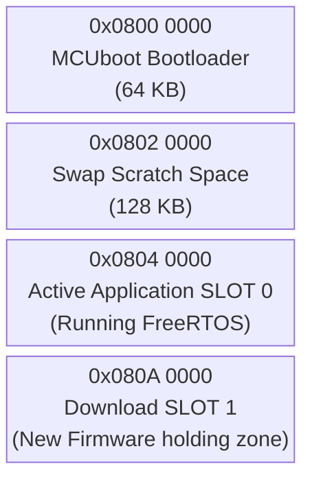

### 6.1 The Network Download Process: Will it fit in memory?
A critical operations question is: *How exactly do we download the binary, and how do we guarantee it fits in the hardware at runtime?*

**1. The Download Method:**
The firmware is downloaded via a standard HTTP/TCP socket. We **write the binary directly into Flash** — but in **1KB chunks**, not all at once.

> **❓ "Why 1KB chunks? Why not download the whole binary first, then flash it?"**
>
> Because **RAM is smaller than the binary**. The STM32F407 has only **128KB of total SRAM**. The incoming firmware binary can be up to **384KB**. You cannot fit 384KB into 128KB — it is a physical impossibility.
>
> The 1KB chunk streaming pattern is the only viable solution:
>
> ```
>  RAM (128KB total)          Flash Bank 2 (384KB)
>  ┌────────────────┐         ┌──────────────────────────────────┐
>  │                │         │ Chunk 1   (already burned)       │
>  │ chunkBuffer    │──────▶  │ Chunk 2   (already burned)       │
>  │ [1024 bytes]   │  HAL_   │ Chunk 3   ← being written NOW   │
>  │                │  FLASH_ │ Chunk 4   (still 0xFF, empty)   │
>  │ Only 1KB used  │  Prog() │ ...                              │
>  │ at any time!   │         │ Chunk 384 (still 0xFF, empty)   │
>  └────────────────┘         └──────────────────────────────────┘
>
>  Loop: Read 1KB from W5500 SPI → Burn to Flash → Read next 1KB → Repeat
>  At no point does more than 1KB of the binary exist in RAM simultaneously.
> ```
>
> The binary IS written directly to Flash transistors — we just do it 1KB at a time, in order, as each chunk arrives over SPI from the W5500 buffer. This is functionally identical to "direct Flash write" — just pipelined through a tiny RAM staging buffer.

*   The remote CI/CD Server transmits the TCP/IP packets.
*   The packets hit the **WIZnet W5500** ethernet chip. The W5500 has internal silicon buffers.
*   The STM32's `Task_Net` uses the **SPI Bus** to slowly stream 1 Kilobyte chunks out of the W5500 and into a tiny temporary RAM `chunkBuffer`.
*   The STM32 instantly writes that 1KB chunk directly into the physical Flash memory of Bank 2 using `HAL_FLASH_Program()`.

> **❓ "What is the W5500's internal buffer capacity? Does it download all 384KB first, then hand it to STM32? Or is it chunk-by-chunk?"**
>
> **Neither — it is a continuously flowing pipeline governed by TCP flow control.** The W5500 cannot store 384KB. It physically only has **32KB of total internal RX+TX buffer** split across all 8 sockets.
>
> **W5500 Internal Buffer Architecture:**
>
> The W5500 has 32KB of RX buffer and 32KB of TX buffer built into its silicon, shared across all 8 hardware sockets. Each socket's allocation is configurable, but the total is fixed at **16KB maximum RX per socket** if you dedicate the full pool to one socket:
>
> ```
> W5500 Internal Memory (fixed silicon — 64KB total):
> ┌─────────────────────────────────────────────────────────┐
> │  RX Buffer Pool: 16KB total (shared across 8 sockets)   │
> │    Socket 0 (MQTT):  2KB RX ← permanent MQTT connection │
> │    Socket 1 (OTA):  14KB RX ← maximised for OTA speed  │
> │    Sockets 2–7:      0KB   ← unused in this project    │
> │                                                         │
> │  TX Buffer Pool: 16KB total (shared across 8 sockets)   │
> │    Socket 0 (MQTT):  2KB TX ← for publishing telemetry  │
> │    Socket 1 (OTA):   2KB TX ← for HTTP GET request     │
> └─────────────────────────────────────────────────────────┘
>              Total = 32KB RX + 32KB TX = 64KB combined
>              The OTA binary is 384KB — far too large to buffer here
> ```
>
> **The actual flow — a 3-stage pipeline:**
>
> ```
> Stage 1: Cloud Server ──────────────────▶ W5500 Silicon RX Buffer (14KB)
>          TCP packets arrive at Ethernet     W5500 TCP hardware fills this buffer.
>          speed (~100Mbps)                   When buffer approaches full, W5500
>                                             shrinks the TCP receive window
>                                             → server throttles automatically
>
> Stage 2: W5500 RX Buffer ──SPI──────────▶ STM32 chunkBuffer[1024] (1KB in SRAM)
>          SPI clock @ ~10-20MHz             Task_Net issues SPI read commands:
>          (slower than Ethernet)            recv(socket, chunkBuffer, 1024)
>                                            1KB transferred per SPI transaction
>                                            → W5500 marks that 1KB as freed
>                                            → TCP window opens again
>                                            → server sends next 1KB of data
>
> Stage 3: chunkBuffer ───HAL_FLASH_Prog──▶ Flash Bank 2 (384KB)
>          Flash write @ ~1ms per KB         HAL_FLASH_Program() burns 1KB
>          (slowest stage — the bottleneck)   → loop repeats 384 times total
>
> Speed profile:
>   Ethernet RX:  ~100 Mbps      ← fastest (rarely the bottleneck)
>   SPI read:     ~20 Mbps       ← medium
>   Flash write:  ~8 Mbps (~1KB/ms) ← SLOWEST — this governs the OTA speed
>   Total OTA time: 384KB × ~1ms = ~400ms minimum (Flash limited)
> ```
>
> **The TCP Sliding Window — why it never overflows:**
>
> TCP has a built-in flow control mechanism called the **Receive Window**. The W5500 hardware automatically advertises to the remote server how many bytes of free space exist in its RX buffer. When the STM32 reads 1KB via SPI and calls `recv()`, the W5500 automatically tells the server "I have 1KB of space again — send more." If the STM32 is busy writing to Flash and hasn't read from the RX buffer yet, the W5500 tells the server "window = 0 — stop sending." The server pauses without dropping data. This self-regulating mechanism makes it impossible for the W5500's RX buffer to overflow during a well-implemented OTA loop.
>
> **Summary of the answer:**
> - ❌ NOT "download all 384KB to W5500 first" — physically impossible, W5500 only has 14KB for OTA socket
> - ❌ NOT "strict 1KB at a time — download 1KB, pause, next 1KB" — the pipeline stages overlap
> - ✅ **Continuous pipelined stream:** Server fills W5500 buffer at Ethernet speed → STM32 drains it via SPI → burns to Flash → TCP window opens → server sends more. At any given moment the W5500 holds up to ~14KB buffered ahead while the STM32 is burning the current 1KB to Flash.

**2. Guaranteeing it fits at runtime:**
Because we strictly partitioned the memory map using the `STM32F407VGTX_FLASH.ld` linker script, we have an absolute mathematical guarantee it fits.
*   Bank 1 (The live FreeRTOS app) is 384KB. It is currently executing.
*   Bank 2 (The empty download slot) is a physically separate 384KB block of silicon purely reserved for OTA.
Because we only stream 1KB chunks at a time over SPI and burn them directly into the reserved 384KB of Bank 2, the memory footprint never overflows at runtime. Bank 1 is entirely untouched until the download finishes.


### The OTA Execution Flow

### 6.2 Is Secure Boot Required? Did We Integrate It?
**Yes, it is strictly required.** In an industrial environment like an Energy Management System where an RTOS controller dictates physical power flow (e.g., cutting off loads or pushing maximum wattage to the grid), malicious or corrupted firmware could cause severe physical hardware damage. 

**Current Integration State:** The initial baseline only relied on MCUboot verifying a SHA256 integrity hash. However, **we have now fundamentally integrated Secure Boot (Cryptographic Firmware Signature Verification)**. A hash alone only proves the firmware wasn't corrupted in transit; a Cryptographic Signature proves the firmware was genuinely authored by the authorized factory team, defending against man-in-the-middle software spoofing.

### 6.3 The True Secure Boot Execution Flow (ECDSA P-256)

When `Task_Net` receives a `CMD_OTA_START` over MQTT, it safely halts the system to download the new `.bin` payload via SPI. This payload is **NOT** just raw code; it has been pre-signed by our CI/CD server using an **ECDSA (Elliptic Curve Digital Signature Algorithm) P-256 private key** via the `imgtool` utility.

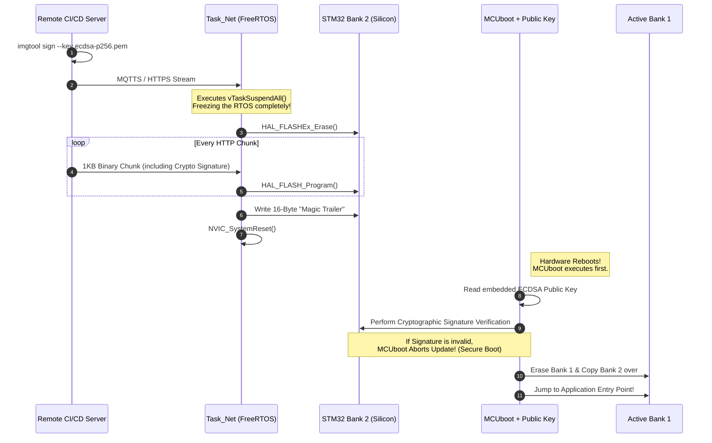

#### Step-by-Step Breakdown of the Secure Boot Flow:
1. **The Factory Signing:** During compilation, the CI/CD pipeline runs `imgtool` with our offline private key to cryptographically append an ECDSA signature to the binary.
2. **The Trigger:** `Task_Net` receives the `{"cmd":"ota"}` MQTT packet indicating a new firmware binary is ready.
3. **RTOS Halt:** `Task_Net` invokes `vTaskSuspendAll()`, explicitly denying the FreeRTOS Scheduler the right to context switch. The system is temporarily operating in a critical single-threaded state.
   ```c
   // Freeze FreeRTOS context switching
   vTaskSuspendAll(); 
   ```
4. **Partition Erasure:** The CPU sends a command to the Flash Controller to erase **Bank 2**.
   ```c
   FLASH_EraseInitTypeDef EraseInitStruct;
   EraseInitStruct.TypeErase = FLASH_TYPEERASE_SECTORS;
   // ... configure sectors for Bank 2 ...
   HAL_FLASHEx_Erase(&EraseInitStruct, &SectorError);
   ```
5. **Chunk Streaming (The Physical SPI Path):** How does the new file physically get from the internet into the STM32?
   * The remote Cloud server transmits TCP/IP packets over the WAN.
   * These hit the **RJ45 Ethernet Magnetics** on our board and flow into the **WIZnet W5500** chip.
   * The W5500's internal hardware TCP stack processes the headers and places the raw `.bin` payload into its own internal silicon RX buffers.
   * `Task_Net` on the STM32 drives the **SPI Bus** (SCK, MISO, MOSI). It sends a command over MOSI saying "Read Socket 0 Buffer". 
   * The W5500 streams the `.bin` bytes out over the MISO line. `Task_Net` catches them in a 1 Kilobyte temporary RAM array (`chunkBuffer`).
   * Finally, `Task_Net` calls `HAL_FLASH_Program()`, commanding the STM32 silicon to physically burn that 1KB RAM array permanently into the **Bank 2 Flash** transistors. This loops until the file is complete.
   ```c
   // Loop until complete file is downloaded
   while(bytes_remaining > 0) {
       // 1. Read 1KB over SPI from W5500 via ioLibrary_Driver
       recv(SOCKET_OTA, chunkBuffer, 1024); 
       
       // 2. Burn precisely to Bank 2 Flash transistors
       for(int i=0; i<1024; i++) {
           HAL_FLASH_Program(FLASH_TYPEPROGRAM_BYTE, currentFlashAddress, chunkBuffer[i]);
           currentFlashAddress++;
       }
   }
   ```
6. **The "Magic Trailer" and Cryptographic TLVs:** Once the final binary chunk is downloaded, the absolute end of the file contains the **MCUboot Trailer**.
   * **What is it?** The trailer is a highly structured data block. It contains **TLVs (Type-Length-Values)** that hold the SHA-256 hash of the application and the actual **ECDSA P-256 signature**. At the very physical end of this structure is a fixed 16-byte "Magic" number (exactly: `0x77 0xc2 0x95 0xf3 0x60 0xd2 0xef 0x7f 0x35 0x52 0x50 0x0f 0x2c 0xb6 0x79 0x80`) and status flags (`image_ok`, `pending_update`).
   * **Who generates it?** The remote CI/CD factory server generates it automatically using the Python `imgtool` utility during the compilation pipeline (`imgtool sign ...`).
   * **How is it made?** `imgtool` calculates the cryptographic signature of the compiled C code, appends the TLV block, and then pads the `.bin` file with empty bytes (`0xFF`) until it reaches the exact mathematically calculated end of the Bank 2 Flash sector, placing the 16-byte Magic string at the absolute final memory address.
   * **When and Where is it written?** Because the trailer is seamlessly appended to the `.bin` file by `imgtool`, the STM32's `Task_Net` blindly writes it into Flash **Bank 2** during the final 1-Kilobyte SPI chunk download. `Task_Net` doesn't need to understand the cryptography; it simply writes the bytes. The presence of the final 16-byte Magic string is the definitive hardware signal telling the bootloader: *"A new update has been fully written to Bank 2 and is ready for review."*
7. **Physical Reboot:** `Task_Net` flushes the SPI buffers and fires a native ARM hardware reset vector via `NVIC_SystemReset()`.
   ```c
   // Tell ARM Cortex-M4 to physically restart
   NVIC_SystemReset();
   ```
8. **Secure Boot Handoff:** The STM32 hardware always boots physically from address `0x08000000`. This is where **MCUboot** lives. 
   * MCUboot wakes up (completely bypassing FreeRTOS) and scans the end of the Bank 2 flash sectors looking for the Magic Trailer.
   * Finding the trailer, it reads the appended Cryptographic Signature.
   * MCUboot then reads its own **embedded ECDSA Public Key** (which was permanently compiled into the bootloader binary at the factory).
   * It executes the intensive elliptic curve mathematics over the entire Bank 2 payload, generating a local SHA-256 hash and mathematically validating it against the appended signature using the Public Key. 
   * **This is the essence of Secure Boot:** If a single bit in Bank 2 was corrupted during download, or if a hacker injected malicious code without possessing our offline Private Key, the mathematical validation instantly fails.
9. **Final Decimation:** If the cryptography succeeds, MCUboot confidently obliterates Bank 1, copies the pristine Bank 2 software over, and jumps the PC (Program Counter) to the new application entry point. If verification **fails**, MCUboot rejects the image instantly, scrubs Bank 2, and blindly boots the old safe Bank 1 firmware, preventing a bricked or compromised gateway!

### 6.4 Secure Boot Key Provisioning: Where Does the Key Live & Can It Be Changed?

This is the most commonly missed aspect of Secure Boot in embedded systems. The ECDSA P-256 Key Pair has two halves with completely different storage and lifecycle requirements.

#### Step 1: Generate the Key Pair (One-Time, Offline, Factory)

```bash
# Generate the ECDSA P-256 private key (NEVER leaves the factory server)
imgtool keygen -k ecdsa-p256.pem -t ecdsa-p256

# Extract the public key as a C header file for MCUboot
imgtool getpub -k ecdsa-p256.pem > root-ec-p256-pub.c
```

This produces two artefacts:
*   **`ecdsa-p256.pem`** — The **Private Key**. This stays on the secure CI/CD build server (or a HSM). Never stored on the device. Never committed to Git. This is the master factory secret.
*   **`root-ec-p256-pub.c`** — The **Public Key** as a raw C array. This is compiled into MCUboot.

#### Step 2: Where is the Public Key Stored on the STM32?

This is the **critical difference** from Linux/AHAB. The public key is **NOT** stored in hardware fuses on the STM32F407.

Instead, it is **compiled and linked directly into the MCUboot binary** as a C constant array:

```c
// root-ec-p256-pub.c — Generated by: imgtool getpub -k ecdsa-p256.pem
// This file gets compiled into the MCUboot source tree
const unsigned char ecdsa_pub_key[] = {
    0x04,  // Uncompressed point marker
    0x1a, 0x2b, 0x3c, ...  // 32 bytes: X coordinate of the public key point
    0x4d, 0x5e, 0x6f, ...  // 32 bytes: Y coordinate of the public key point
};
const unsigned int ecdsa_pub_key_len = 65;
```

When MCUboot is compiled with this file, the 65-byte public key array is linked into the MCUboot image at a fixed address within the Bootloader Flash sector (`0x08000000` – `0x0800FFFF`). It lives permanently in the **first 64KB of Flash** alongside the bootloader code itself.

```
Flash Memory Layout (Key Location):
──────────────────────────────────────────────────────────────
0x08000000  ┌──────────────────────────────────────────┐
            │  MCUboot Binary                          │
            │    ├─ Bootloader startup code            │
            │    ├─ ECDSA P-256 verification logic     │
            │    └─ ecdsa_pub_key[] ← PUBLIC KEY HERE  │ ← Baked in as C array
0x0800FFFF  └──────────────────────────────────────────┘ (64KB)
0x08010000  ┌──────────────────────────────────────────┐
            │  Scratch Swap Space (128KB)              │
0x0803FFFF  └──────────────────────────────────────────┘
0x08040000  ┌──────────────────────────────────────────┐
            │  FreeRTOS Application (Bank 1)           │
0x080BFFFF  └──────────────────────────────────────────┘
```

#### Step 3: How is the MCUboot Sector Locked? (RDP & WRP Mechanisms)

Since the public key is stored in standard Flash memory (not hardware OTP), an attacker or even a buggy pointer in our own C code could theoretically erase the bootloader and overwrite it with a fake one. 

To prevent this, the STM32 utilizes two distinct hardware protection mechanisms: **RDP** (Read Out Protection) and **WRP** (Write Protection).

**1. RDP (Read Out Protection) - External Debug Locking**
RDP protects the *entire* chip from the outside world. It prevents anyone from plugging a ST-LINK debugger into the JTAG/SWD pins to dump or modify the memory. 
The STM32 has three RDP levels:
*   **Level 0:** No protection. SWD fully accessible. Flash readable and writable.
*   **Level 1:** Read protection. Flash cannot be dumped via SWD, but downgrading to Level 0 mass-erases the entire chip (destroying the intellectual property).
*   **Level 2:** Permanent lock. The JTAG/SWD debug pins are **permanently and irreversibly disabled** at the silicon level. The entire Flash memory cannot be read or programmed from the outside world.

**2. WRP (Write Protection) - Selective Internal Locking**
If RDP Level 2 locks the *entire* Flash from the outside, how can `Task_Net` download a new OTA binary and save it to Bank 2? 
Because RDP Level 2 still allows the **internal CPU** (our running application) to erase and write to Flash. 

If the internal CPU can write to Flash, a malfunctioning pointer could accidentally delete the bootloader! To stop this, we use **WRP (Write Protection) Option Bytes**. WRP allows us to lock *specific sectors* of the Flash from being erased or written to, even by the internal CPU.

**The Hybrid Protection Strategy (How we protect only the keys):**
*   We apply **WRP to Sectors 0, 1, 2, and 3** (The first 64KB where MCUboot and the Public Key live). Now, even if the FreeRTOS application goes rogue, the hardware Flash Controller will physically deny any `HAL_FLASHEx_Erase()` commands aimed at the bootloader. The keys are immortal.
*   We leave **Sectors 4 through 11** (Bank 1, Bank 2, and Scratch) **UNPROTECTED** by WRP. This allows `Task_Net` to freely erase Bank 2 and write new OTA payloads, and allows MCUboot to swap the banks.
*   Finally, we apply **RDP Level 2** to sever the JTAG pins permanently.

This achieves the exact goal: The Bootloader and Keys are mathematically and physically invulnerable, but the application space remains fully updatable over-the-air.

#### Factory Provisioning Workflow (The "Locking" Ceremony)

At the factory, the locking procedure is executed via an **ST-LINK hardware programmer** connected to the **SWD (Serial Wire Debug)** port. SWD is an ARM-specific, low-pin-count alternative to JTAG that provides direct memory access to the STM32.

The factory typically runs a Linux bash script utilizing `openocd` or `STM32_Programmer_CLI` to orchestrate this:
1.  **Flash MCUboot:** `STM32_Programmer_CLI -c port=SWD -w mcuboot.bin 0x08000000`
2.  **Flash App:** `STM32_Programmer_CLI -c port=SWD -w app_signed.bin 0x08040000`
3.  **Apply WRP & RDP via Firmware:** We trigger a unique, one-time factory firmware condition that calls the `HAL_FLASHEx_OBProgram()` API.
    *   **Under the hood:** `HAL_FLASH_OB_Launch()` does not write to normal flash; it writes to a dedicated set of configuration transistors called "Option Bytes" residing at `0x1FFFC000`. Writing to this register forces the STM32 to immediately execute a silicon hardware reset to load the new security boundary.
4.  **The Lock Snaps:** From the instant `HAL_FLASH_OB_Launch()` completes, the physical SWD pins `PA13` (SWDIO) and `PA14` (SWCLK) are eternally dead. The ST-LINK programmer loses connection and can never connect again. All future communication MUST go through the OTA network socket.

#### Step 4: Can the Key Be Changed After Flashing (RDP Level 2)?

**No. This is physically irreversible.**

Once RDP Level 2 and WRP are set:
*   The SWD/JTAG pins physically stop responding — no programmer in existence can connect.
*   The WRP sectors holding MCUboot cannot be erased.
*   The only way to "change the key" would be to physically desolder and replace the STM32 chip.

---

#### Comparison: Selective Protection (STM32) vs. Embedded Linux (i.MX93)

| Aspect | **MCUboot on STM32F407** | **AHAB on i.MX93 (Linux)** |
|---|---|---|
| **Bootloader Immortality** | Achieved via **WRP Option Bytes** locking Sectors 0-3. | Achieved via a hardcoded, unchangeable **Silicon BootROM**. |
| **Key Storage** | Compiled as a C-array inside the WRP-locked MCUboot Flash sector. | SHA256 Hash of the key burned into physical **OTP eFuses**. |
| **OTA Writable Area** | Bank 2 Flash is left out of the WRP lock, allowing FreeRTOS to write `.bin` files. | eMMC storage is freely writable by Linux, holding U-Boot and the RootFS. |
| **Debug Port Lockdown** | **RDP Level 2** disables SWD/JTAG routing at the silicon level forever. | **SEC_CONFIG eFuse** "Closed Mode" physically disables JTAG routing forever. |
| **What happens if wrong key?** | MCUboot halts, refuses to jump to Bank 1. | BootROM halts immediately, refusing to load U-Boot. |
| **Attack surface** | Relies on WRP/RDP Option Bytes remaining uncorrupted. | Highest security. eFuses and ROM are physically immutable hardware. |
| **Root of Trust location** | Software bootloader in Flash (MCUboot) | Silicon ROM + OTP hardware (higher assurance) |

**The Fundamental Architecture Difference:**
```
AHAB (i.MX93):                         MCUboot (STM32):
────────────────────────────            ──────────────────────────────
Silicon ROM (immutable)                 ARM Reset Vector (immutable)
    │ reads                                 │ jumps to
    ▼                                       ▼
Hardware OTP eFuse (SRK hash)          MCUboot in Flash (contains pub key)
    │ compares against                      │ verifies against
    ▼                                       ▼
SPL/U-Boot container signature          Application image ECDSA signature
    │ if match → boots                      │ if match → jumps to app
    ▼                                       ▼
Kernel / rootfs                        FreeRTOS tasks run
```

The AHAB chain's Root of Trust is anchored in **hardware OTP silicon cells** that cannot be altered regardless of what code runs. The MCUboot chain's Root of Trust is anchored in **protected Flash** (protected by RDP option bytes). Both are effectively tamper-proof once locked, but AHAB provides a stronger hardware-level isolation at the cost of a more complex provisioning process (NXP CST tool, SRK table, container signing).


### 6.5 Complete Factory Provisioning: Flashing Tools, Methods & Secure Boot End-to-End

This section documents exactly how a factory technician programs a brand new bare STM32F407 chip from zero — including every available flashing method, the complete CLI workflow for headless/automated environments, and the irreversible final production lock step.

---

#### All Available Flashing Methods

There are **five distinct ways** to flash an STM32F407. Each has different hardware requirements and use cases:

| Method | Hardware Required | IDE Required? | Use Case |
|---|---|---|---|
| **ST-LINK SWD (STM32CubeProgrammer GUI)** | ST-LINK V2 + SWD cable | No | Factory bench programming, field engineers |
| **ST-LINK SWD (OpenOCD CLI)** | ST-LINK V2 + SWD cable | **No** | CI/CD pipelines, headless Linux servers |
| **ST-LINK SWD (st-flash CLI)** | ST-LINK V2 + SWD cable | **No** | Lightweight scripts, fastest CLI option |
| **STM32 UART Bootloader (DFU via UART)** | USB-to-UART adapter + BOOT0 pin | **No** | No SWD/JTAG available, cheapest method |
| **USB DFU (dfu-util)** | USB cable (STM32 in DFU mode) | **No** | No ST-LINK needed, USB-only environments |

---

#### Method 1: STM32CubeProgrammer (GUI — No IDE Needed)

`STM32CubeProgrammer` is a standalone free tool from ST (separate from STM32CubeIDE) that runs on Linux, Mac, and Windows. It communicates over SWD.

```bash
# Install STM32CubeProgrammer on Linux
sudo apt install libusb-1.0-0-dev
# Download from st.com → STM32CubeProgrammer → install .deb or .run

# GUI usage:
# 1. Connect ST-LINK V2 to board SWD pins (SWDIO, SWDCLK, GND, 3.3V)
# 2. Open STM32CubeProgrammer
# 3. Select ST-LINK → Connect
# 4. Go to Erasing & Programming tab
# 5. Browse to .bin file, set start address, click Start Programming
```

---

#### Method 2: OpenOCD CLI (No IDE — Best for CI/CD)

`OpenOCD` is an open-source on-chip debugger that speaks to ST-LINK over USB and exposes a GDB/telnet interface. This runs entirely headlessly on a Linux CI server.

```bash
# Install OpenOCD
sudo apt install openocd

# Flash MCUboot binary to 0x08000000
openocd \
  -f interface/stlink.cfg \
  -f target/stm32f4x.cfg \
  -c "program mcuboot.bin verify reset exit 0x08000000"

# Flash signed FreeRTOS application binary to 0x08040000
openocd \
  -f interface/stlink.cfg \
  -f target/stm32f4x.cfg \
  -c "program ems_rtos_signed.bin verify reset exit 0x08040000"

# Verify the contents of Bank 1 (optional integrity check)
openocd \
  -f interface/stlink.cfg \
  -f target/stm32f4x.cfg \
  -c "init; reset halt; flash verify_image ems_rtos_signed.bin 0x08040000; exit"
```

---

#### Method 3: st-flash CLI (Fastest & Lightest)

`st-flash` is from the `stlink` open-source project. Single binary, minimal dependencies.

```bash
# Install stlink tools
sudo apt install stlink-tools

# Erase entire Flash (factory fresh)
st-flash erase

# Flash MCUboot bootloader
st-flash write mcuboot.bin 0x08000000

# Flash the signed application
st-flash write ems_rtos_signed.bin 0x08040000

# Read back 64KB from bootloader sector (verification)
st-flash read verify_dump.bin 0x08000000 65536
```

---

#### Method 4: UART Bootloader / stm32flash (No JTAG/SWD at All)

The STM32F407 has a **built-in hardware bootloader baked into ROM** (at address `0x1FFF0000`). This can be activated by pulling the **`BOOT0` pin HIGH** on power-up, which changes the boot vector from Flash to the ROM bootloader. It then listens on **USART1** for the `stm32flash` protocol.

This requires zero SWD hardware — just a cheap USB-to-UART adapter.

```bash
# Install stm32flash
sudo apt install stm32flash

# Hardware: Pull BOOT0 pin HIGH, connect USB-UART to USART1 (PA9=TX, PA10=RX)
# Power cycle the board → ROM bootloader is now running

# Erase everything and write MCUboot
stm32flash -w mcuboot.bin -v -g 0x08000000 -b 115200 /dev/ttyUSB0

# Then write the application
stm32flash -w ems_rtos_signed.bin -v -g 0x08040000 -b 115200 /dev/ttyUSB0

# Pull BOOT0 LOW again, power cycle → normal boot from Flash resumes
```

---

#### Method 5: USB DFU Mode (dfu-util — No ST-LINK)

The STM32F407 (with USB pins connected) can boot into USB DFU (Device Firmware Upgrade) mode by pulling BOOT0 HIGH. A host PC then programs it over USB using the standard USB DFU class.

```bash
# Install dfu-util
sudo apt install dfu-util

# Check device is detected (should show STM32 bootloader)
dfu-util --list

# Flash MCUboot to 0x08000000 (Internal Flash, alt interface 0)
dfu-util -a 0 -s 0x08000000:leave -D mcuboot.bin

# Flash the application to 0x08040000
dfu-util -a 0 -s 0x08040000:leave -D ems_rtos_signed.bin
```

**Is USB DFU Supported in our specific `ems-mini-rtos` setup?**

*Technically yes, but practically no.*

The STM32F407 silicon features two dedicated hardware USB PHY pins (`PA11` for USB_DM, `PA12` for USB_DP). However, in an industrial Energy Management System:
1.  **Enclosure Accessibility:** The physical hardware is sealed inside a DIN-rail plastic enclosure inside a high-voltage electrical cabinet. A technician cannot easily plug a USB-C cable into the board.
2.  **OTA Primary Route:** The board has a physical RJ45 Ethernet port routed through the W5500 via SPI. All firmware updates are designed to flow through the Cloud via MQTT/MQTTS.
3.  **Boot PIN Contention:** USB DFU requires a technician to physically toggle the `BOOT0` pin HIGH with a jumper while resetting the board. An embedded system cannot do this to itself easily without complex reset circuitry.

Therefore, while the STM32 *supports* DFU natively in its immutable BootROM, we do not utilize it. We flash the device exactly once at the factory using the **SWD (ST-LINK) Method**, lock it, and rely purely on **Method 1 (Ethernet OTA)** thereafter.

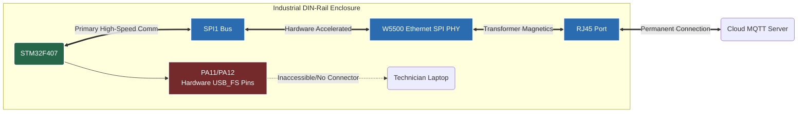

---

#### The Connectivity Architecture: How Does Flashing Actually Work?

Before we look at the complete factory script, it is crucial to understand the physical and software layers involved in programming an STM32 from a Linux PC.

**Do we need to program all images (mcuboot, flash) separately?**
**Yes, absolutely.** At the factory, a blank STM32 chip has nothing but `0xFF` across its entire 1MB of memory. You cannot just flash the FreeRTOS app, because the STM32 hardware always boots from `0x08000000`, and our app is built to run at `0x08040000`. 
1. The **Bootloader (`mcuboot.bin`)** must be flashed to address `0x08000000`.
2. The **Signed Application (`ems_rtos_signed.bin`)** must be flashed to address `0x08040000`.

To achieve this, the developer's PC uses a piece of software (like OpenOCD) acting as a bridge to a hardware dongle (ST-LINK), which translates USB commands into raw electrical logic on the SWD pins.

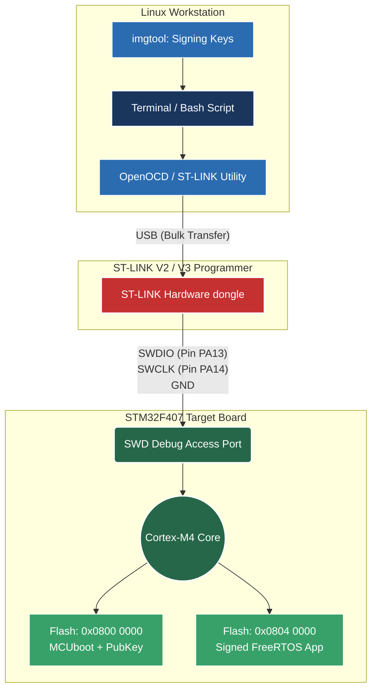

*   **SWD (Serial Wire Debug):** A 2-wire interface (`SWDIO` for data, `SWCLK` for clock) created by ARM. It allows the ST-LINK dongle to halt the Cortex-M4 CPU, read its registers, and command the internal Flash Controller to burn our `.bin` files directly into the silicon.
*   **OpenOCD (Open On-Chip Debugger):** An open-source Linux daemon that knows how to talk "USB" to the ST-LINK dongle, and translates high-level commands (like `flash write_image mcuboot.bin 0x08000000`) into the low-level SWD bit-banging required by the ARM core.

---

#### Complete End-to-End Factory Provisioning Workflow

This is the **definitive production programming procedure** for a brand new STM32F407 board, from raw silicon to fully locked Secure Boot:

```
╔══════════════════════════════════════════════════════════════════════╗
║           EMS Mini RTOS — Factory Provisioning Procedure            ║
╠══════════════════════════════════════════════════════════════════════╣
║  Prerequisites: st-flash, imgtool, STM32_Programmer_CLI installed   ║
║  Private Key:   ecdsa-p256.pem  (on factory build server ONLY)      ║
╚══════════════════════════════════════════════════════════════════════╝

STEP 1 ── Verify ST-LINK and STM32 Target Connection
─────────────────────────────────────────────────────────────────────
  # Before flashing, the factory PC must probe the SWD interface to
  # assert that the ST-LINK dongle sees a valid Cortex-M4 core.
  st-info --probe
  
  # Expected Output:
  # Found 1 stlink programmers
  #  version:  V2J29S7
  #  serial:   ...
  #  flash:    1048576 (pagesize: 16384)
  #  sram:     131072
  #  chipid:   0x0413
  #  descr:    F4 device

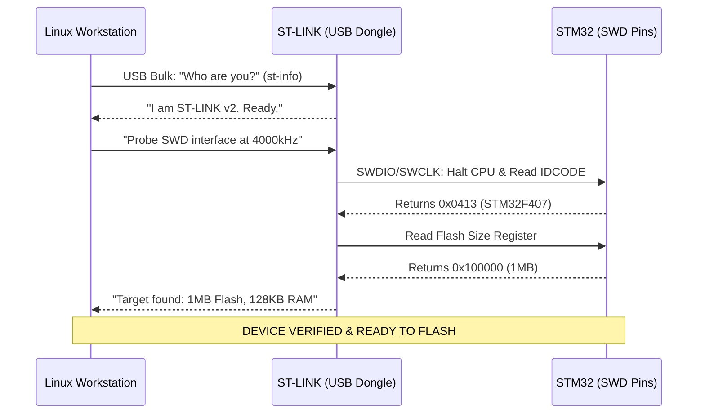

STEP 2 ── Generate signing keys (first-time, factory setup only)
─────────────────────────────────────────────────────────────────────
  imgtool keygen -k ecdsa-p256.pem -t ecdsa-p256
  imgtool getpub -k ecdsa-p256.pem > boot/root-ec-p256-pub.c
  → Store ecdsa-p256.pem in offline HSM or encrypted vault
  → Commit root-ec-p256-pub.c into MCUboot source tree

STEP 3 ── Build MCUboot with the embedded public key
─────────────────────────────────────────────────────────────────────
  cd mcuboot/boot/stm32/
  make BOARD=stm32f407 SIGNING_KEY=../../../root-ec-p256-pub.c
  → Produces: mcuboot.bin
  → Public key is baked as const array at 0x08000000+offset

STEP 4 ── Build and sign the FreeRTOS application
─────────────────────────────────────────────────────────────────────
  # Compile the EMS RTOS firmware (produces raw binary)
  arm-none-eabi-gcc ... -o ems_rtos.elf
  arm-none-eabi-objcopy -O binary ems_rtos.elf ems_rtos.bin

  # Sign it with the private key using imgtool
  imgtool sign \
    --key ecdsa-p256.pem \
    --header-size 0x200 \
    --align 4 \
    --version 1.0.0 \
    --slot-size 0x60000 \
    ems_rtos.bin \
    ems_rtos_signed.bin
  → Produces: ems_rtos_signed.bin (with MCUboot header + ECDSA signature appended)

STEP 5 ── Erase the target board (factory fresh)
─────────────────────────────────────────────────────────────────────
  st-flash erase
  → Wipes all 1MB of Flash to 0xFF

STEP 6 ── Flash MCUboot (bootloader + embedded public key)
─────────────────────────────────────────────────────────────────────
  st-flash write mcuboot.bin 0x08000000
  → MCUboot + public key now lives at sectors 0–3 (0x08000000–0x0800FFFF)

STEP 7 ── Flash the signed FreeRTOS application
─────────────────────────────────────────────────────────────────────
  st-flash write ems_rtos_signed.bin 0x08040000
  → Application lives at Bank 1 (0x08040000–0x080BFFFF)
```

**STEP 8 ── Validation Test (CRUCIAL: Verify keys before locking!)**
Before setting the final hardware locks, it is perfectly safe to reboot the board and verify the signatures.
*   **Action:** Press the physical RESET button or power cycle the board.
*   **Observe:** Watch the UART serial output (or SWD debug viewer).
*   ✅ **Expected SUCCESS:** `"MCUboot: Verifying signature... OK! Booting application."`
*   ❌ **Expected FAILURE:** `"MCUboot: Signature INVALID! Halting."` 
    *   **STOP:** Do not proceed to Step 9 if validation fails. You still have unlimited flash retries to fix the keys since RDP is still Level 0.

```bash
STEP 9 ── Set RDP Level (Locking the Debug Port)
─────────────────────────────────────────────────────────────────────
  # Option A: Set RDP Level 1 (Development / Recoverable via Mass Erase)
  STM32_Programmer_CLI -c port=SWD -ob RDP=0xBB
  
  # Option B: Set RDP Level 2 (Production / IRREVERSIBLE)
  # ⚠️ WARNING: SWD/JTAG debug port will be PERMANENTLY DISABLED. OTA ONLY.
  STM32_Programmer_CLI -c port=SWD -ob RDP=0xCC

  # Option C: OpenOCD approach (Applies WRP and RDP Level 2)
  openocd -f interface/stlink.cfg -f target/stm32f4x.cfg \
    -c "init" \                       # Connects to ST-LINK
    -c "reset halt" \                 # Freezes STM32
    -c "flash protect 0 0 3 on" \     # Engages WRP on Sectors 0-3
    -c "stm32f4x options_write 0 0xCC" \ # Engages RDP Level 2
    -c "reset run" \                  # Reboots, enforcing permanent lock
    -c "exit"
```

---

#### Comparison: Full Provisioning Flow — RTOS (MCUboot) vs Linux (AHAB)

```
RTOS / MCUboot Provisioning              Linux / AHAB Provisioning
────────────────────────────             ──────────────────────────────────────
① imgtool keygen → ecdsa-p256.pem        ① NXP CST: srk_hash.bin generated from
                                              SRK key table (4 key redundancy)
② imgtool getpub → C header file         ② SRK hash is NOT compiled into software
   compiled into MCUboot binary               — it goes into hardware OTP fuses

③ Build MCUboot with embedded pubkey     ③ uuu / NXP blhost burns SRK_HASH fuses
   st-flash write mcuboot.bin 0x08000000      on the i.MX93 OTP banks
                                             (Permanently changes silicon transistors)

④ imgtool sign app → signed binary       ④ NXP CST ahab-container signs U-Boot SPL
   st-flash write signed_app 0x08040000       container with RSA/ECDSA private key

⑤ BOOT TEST: MCUboot verifies ECDSA      ⑤ BOOT TEST: ROM code reads SRK_HASH fuse,
   signature vs embedded public key           verifies SPL container signature

⑥ STM32_Programmer_CLI -ob RDP=0xCC     ⑥ uuu: SEC_CONFIG[1] fuse blown → "Closed"
   → SWD permanently disabled                 → JTAG permanently disabled
   → Device sealed forever                    → Device sealed forever

LOCK METHOD: RDP Option Byte (0xCC)      LOCK METHOD: Physical eFuse blow
KEY STORAGE: MCUboot Flash (protected)   KEY STORAGE: Hardware OTP silicon cells
SIGNING TOOL: imgtool (Python)           SIGNING TOOL: NXP CST (C binary)
LOCK TOOL: STM32_Programmer_CLI          LOCK TOOL: uuu + blhost
```

---

#### STM32CubeProgrammer & STM32_Programmer_CLI Reference

**STM32CubeProgrammer (GUI vs CLI)**
STMicroelectronics provides `STM32CubeProgrammer` as a cross-platform software suite available for **Windows, macOS, and Linux**. 
*   **The GUI Version:** A full graphical application primarily used by developers on Windows/Mac to visually inspect memory, drag-and-drop `.bin` files, edit Option Bytes with checkboxes, and debug STM32 chips.
*   **The CLI Version (`STM32_Programmer_CLI`):** Installed alongside the GUI, this is the headless command-line executable. It allows the exact same operations but is designed strictly for automation, bash scripts, and CI/CD factory pipelines (e.g., locking the chip automatically on a Linux server).

Here are the most common CLI commands used in scripting:

```bash
# Connect and read device info
# Note: `freq=4000` tells the ST-LINK to communicate over the SWD pins at 4000 kHz (4 MHz). 
# This is the highly recommended standard speed that balances stability and flashing speed for STM32F4.
STM32_Programmer_CLI -c port=SWD freq=4000 -i

# Full erase
STM32_Programmer_CLI -c port=SWD -e all

# Flash a binary at specific address
STM32_Programmer_CLI -c port=SWD \
  -d mcuboot.bin 0x08000000 \
  -v           # verify after write

# Read and dump Option Bytes (check current RDP level)
STM32_Programmer_CLI -c port=SWD -ob displ

# SET RDP to Level 1 (recoverable)
STM32_Programmer_CLI -c port=SWD -ob RDP=0xBB

# SET RDP to Level 2 (PERMANENT — production units only)
STM32_Programmer_CLI -c port=SWD -ob RDP=0xCC
```

### Edge Case: Flash Erasure CPU Stalls (Hard Faults)

The most critical part of this logic is the protection of the ARM Data Bus during the transition.
*   **The Danger:** Erasing an internal Flash Sector (e.g., Bank 2) locks up the entire ARM Cortex Instruction/Data bus for upwards of **10 to 50 milliseconds**. If the RTOS `SysTick` timer were to fire, or an external UART DMA interrupt were to trigger a Context Switch while the instruction bus is locked, the CPU cannot fetch the next instruction. It will instantly crash, throwing a fatal `Hard Fault Exception`.
*   **The Fix:** 
    1.  We execute **`vTaskSuspendAll()`** immediately before the Flash sequence. This literally turns off the FreeRTOS Scheduler. 
    2.  No task, no matter its priority, can preempt the OTA thread.
    3.  We routinely call `xTaskResumeAll()` between chunk writes if we need to let the W5500 SPI hardware catch its breath or let the hardware Watchdog reset.

### Edge Case: Fallback / "Anti-Brick" Protection & Partition Swapping
How does MCUboot manage the physical partition switch, and what happens when disasters occur?

**How do we manage the partition switch in OTA?**
MCUboot uses a **"Swap using Scratch"** physical memory mechanism. 
1. MCUboot reads a 4KB chunk from Bank 1 and writes it to the Scratch Sector.
2. It reads a 4KB chunk from Bank 2 and overwrites the exact place in Bank 1.
3. It takes the original chunk resting in the Scratch Sector and writes it into Bank 2.
4. It dynamically cycles this loop until the entire 384KB application is successfully swapped!

**What happens if OTA fails mid-download?**
If the W5500 SPI connection drops in the middle of downloading the `.bin` to Bank 2 (or loses power), `Task_Net` simply aborts the transaction and deletes the fragment. Bank 1 (the active app) was never touched. The board powers up and continues running normally.

**What happens if the power dies DURING the Partition Swap?**
If a forklift unplugs the board exactly while MCUboot is swapping chunks, MCUboot will resume the swap on the next physical reboot. Since everything touches the Scratch sector first, MCUboot reads the state flags and natively resumes the copy without bricking.

**What happens if the newly updated active partition is corrupted or crashes?**
We implemented an **"Image Confirmation"** fail-safe mechanism:
*   After MCUboot swaps Bank 2 into Bank 1, it passes the boot sequence to the new application. 
*   **The Flag:** MCUboot relies on a specific byte called the `image_ok` flag to know if the new firmware is stable. 
*   **Where is it?** This flag is located at the very end of the active Flash partition (Bank 1), locked inside the cryptographic "Magic Trailer" metadata block. Like all erased flash, it defaults to `0xFF` (Unconfirmed).
*   **Who sets it?** The new FreeRTOS application must successfully initialize, connect to the Cloud, and eventually execute a specific C API call: `boot_set_confirmed()`. This function physically writes `0x01` to the `image_ok` memory address in the Magic Trailer.
*   **The Crash Scenario:** If the new firmware contains a fatal bug (e.g., a Hard Fault, or it infinite-loops and drops the network), the CPU will crash *before* it can ever call `boot_set_confirmed()`. 
*   **The Revert:** The hardware **Independent Watchdog (IWDG)** will detect the freeze and automatically reset the CPU. 
*   **Who clears/reads it?** MCUboot wakes up, reads the Magic Trailer in Bank 1, and sees that `image_ok` is still `0xFF` (the app failed to set it to `0x01`). MCUboot realizes the new firmware failed to confirm itself, and it instantly **REVERTS** the swap, pulling the old, stable firmware out of the Scratch area and back into Bank 1!

---

## 7. The OS API Layer: Why CMSIS-RTOS v2?

If you inspect the codebase, you will notice we use commands like `osDelay()` and `osMessageQueuePut()` instead of FreeRTOS native commands like `vTaskDelay()` and `xQueueSend()`. This is because we wrap FreeRTOS inside **CMSIS-RTOS v2** (Cortex Microcontroller Software Interface Standard).

### Why use CMSIS-RTOS v2 instead of native FreeRTOS without CMSIS?
1. **Portability & Abstraction:** CMSIS-RTOS v2 is a standardized API created by ARM. By using it, our application code doesn't strictly know it is running "FreeRTOS". If, in the future, we need to migrate the EMS Mini to an RTOS provided by another vendor (like Keil RTX, Azure RTOS/ThreadX, or Zephyr), we do not have to rewrite a single line of application code. The `osThreadNew()` command works universally across ARM-supported RTOS platforms, whereas `xTaskCreate()` strictly locks us into FreeRTOS.
2. **Simplified Memory Management:** Native FreeRTOS requires developers to manually choose between static (`xTaskCreateStatic`) and dynamic (`xTaskCreate`) allocations, frequently requiring the user to pass convoluted RAM buffers manually. The CMSIS v2 wrapper unifies these calls: you simply pass an attributes struct (`osThreadAttr_t`).
3. **Advanced Timers:** CMSIS-RTOS v2 introduces unified 64-bit kernel tick structures `osKernelGetTickCount()`. Native FreeRTOS traditionally defaults to 32-bit ticks, which roll over back to zero every ~49 days (on a 1ms tick), requiring nasty manual rollover-protection logic. A 64-bit tick will not roll over for billions of years, making uptime math (like "publish MQTT every 5 seconds") extremely safe and simple.

### Why CMSIS-RTOS v2 specifically (vs. CMSIS-RTOS v1)?
If you are upgrading from older STM32Cube firmware that used **v1**, here are the major differences you will notice in this codebase:
*   **No More Macro Definitions:** In v1, creating a thread required clunky multi-step macros like `osThreadDef()` followed by `osThreadCreate()`. In **v2**, this is completely replaced by clean, dynamic C functions like `osThreadNew()` and `osMessageQueueNew()`.
*   **True 64-bit Ticks:** v1 was strictly bound to a 32-bit SysTick (`osWaitForever` was max 0xFFFFFFFF). **v2** officially supports infinite 64-bit ticks out of the box.
*   **Variable Message Sizes:** In v1, Message Queues (`osMessagePut`) were essentially limited to passing 32-bit integer values or raw pointers. **v2** (`osMessageQueuePut`) natively allows you to pass actual `struct` data payload clones of any arbitrary memory size, significantly improving type safety across threads.

---

## 8. FreeRTOS Feature Checklist

This section serves as a rapid-fire summary of the specific FreeRTOS API mechanics used in the project, explaining **what** they are, **why** they were chosen, and **how** they work.

### 1. Preemptive, Prioritized Tasks (`osThreadNew`)
*   **What:** The core of the Scheduler. Tasks are assigned static priorities.
*   **Why:** Rather than round-robin polling where everything gets equal CPU time, we must guarantee that safety-critical hardware polling preempts everything else.
*   **How:** `Task_Poll` is given `osPriorityRealtime`, so the exact millisecond its 300ms sleep timer expires, the RTOS kernel forcefully pauses whatever `Task_Net` is configuring, saves its memory registers to the stack (Context Switch), and gives 100% CPU to `Task_Poll`.

### 2. Message Queues (`osMessageQueueNew` / `osMessageQueuePut`)
*   **What:** Thread-safe, FIFO (First-In, First-Out) memory buffers.
*   **Why:** To safely pass complex data (like the Multi-Byte `SystemState_t` struct) between isolated Tasks without using completely unprotected global variables (which cause Data Corruptions/Race Conditions).
*   **How:** `Task_Poll` generates data and calls `osMessageQueuePut()` to insert it into the buffer. Meanwhile, `Task_Ctrl` is programmed to call `osMessageQueueGet(..., osWaitForever)`. 
    *   **The Magic of `osWaitForever`:** If the queue is empty, `Task_Ctrl` does *not* sit in a `while(1)` loop constantly checking the queue (which would burn 100% CPU purely on waiting). 
    *   Instead, the RTOS kernel explicitly removes `Task_Ctrl` from the active "Ready-to-Run" list and places it in a dormant "Blocked" list. Because it is blocked, it consumes **exactly 0% CPU cycles**.
    *   The microsecond `Task_Poll` executes `osMessageQueuePut()`, a hardware/software interrupt tells the RTOS kernel: *"Data has arrived in Queue X"*. The kernel instantly scans its Blocked list, finds `Task_Ctrl` waiting for that queue, and physically moves `Task_Ctrl` back to the active "Ready" list, immediately waking it up to process the data!

### 3. Binary Semaphores (`osSemaphoreNew` / `osSemaphoreAcquire`)
*   **What:** A thread-safe boolean "Token". You either have it, or it is empty.
*   **Why (The `Task_Poll` Use Case):** In `Task_Poll`, we communicate over a slow RS-485 Modbus network (e.g., 9600 baud). If we busy-looped while waiting for a 100-byte packet to arrive, the CPU would be frozen for over 100 milliseconds! A Binary Semaphore allows `Task_Poll` to kick off the hardware DMA (Direct Memory Access) and then instantly go to sleep (0% CPU), freeing the CPU to run `Task_Net` or `Task_Ctrl` while the hardware physical UART pins do the slow work.
*   **How:** `Task_Poll` fires off a DMA transfer (`HAL_UART_Transmit_DMA`), then immediately calls `osSemaphoreAcquire()`. Since the token starts empty, the Task is instantly Blocked. Milliseconds later, when the remote Modbus slave finishes responding, theSTM32 hardware fires the native `UART Idle ISR`. From inside that Interrupt Service Routine, we call `osSemaphoreRelease()`. This injects the missing token into the RTOS kernel, which instantly unblocks `Task_Poll` so it can parse the newly arrived buffer!

**Semaphore ISR → Task Unlock Pseudo-Code:**
```c
// --- Boot: Create the semaphore token (starts empty) ---
osSemaphoreId_t dmaRxSem = osSemaphoreNew(1, 0, NULL); // Initial count = 0 (TAKEN)

// --- Task_Poll: Kick off DMA and then SLEEP ---
void StartPollTask(void *argument) {
    for(;;) {
        // Send Modbus request out via DMA (non-blocking, hardware takes over)
        HAL_UART_Transmit_DMA(&huart1, tx_frame, tx_len);

        // Block here: 0% CPU until the ISR drops the token
        // Timeout of 250ms: if the slave doesn't respond, we abort safely
        osSemaphoreAcquire(dmaRxSem, pdMS_TO_TICKS(250));

        // We ONLY reach this line once the ISR fires and releases the semaphore!
        parse_modbus_response(rx_buffer);
    }
}

// --- Hardware ISR (fires in silicon when DMA IDLE detected) ---
// This runs in INTERRUPT context - must be extremely fast!
void HAL_UARTEx_RxEventCallback(UART_HandleTypeDef *huart, uint16_t Size) {
    if (huart->Instance == USART1) {
        // Drop the token back into the semaphore from ISR-safe context
        // This single line is all an ISR should ever do!
        osSemaphoreRelease(dmaRxSem);
    }
}
```

### 4. Critical Sections (`vTaskSuspendAll`)
*   **What:** A mechanism to temporarily disable the OS Scheduler from running.
*   **Why:** To protect the ARM Instruction/Data bus from Hard Fault crashes when doing delicate logic, like physically erasing sectors of internal Flash memory.
*   **How:** During an OTA firmware swap, `Task_Net` calls `vTaskSuspendAll()`. Even if `Task_Poll`'s 300ms timer ticks, the kernel will NOT switch context. `Task_Net` retains 100% monolithic control until it calls `xTaskResumeAll()`.

---

---

## 9. System Timing & Frequencies Cheat Sheet

For technical interviews and architectural reviews, it is extremely common to be asked about the exact timing characteristics, hardware bus speeds, and RTOS configurations of your system. 

Here is the master lookup table detailing the exact clock frequencies, speeds, and task durations configured for `ems-mini-rtos`:

### ⏱️ Hardware Clocks & Bus Speeds

| Component / Interface | Configured Speed | Description & Architectural Purpose |
| :--- | :--- | :--- |
| **SYSCLK (Core CPU)** | `168 MHz` | The absolute maximum speed of the STM32F407 ARM Cortex-M4 core. Powers the FPU (Floating Point Unit) for complex peak-shaving math. |
| **APB1 Peripheral Bus** | `42 MHz` | The low-speed peripheral bus. Drives standard Timers, I2C, and secondary UARTs. |
| **APB2 Peripheral Bus** | `84 MHz` | The high-speed peripheral bus. Drives critical components like the ADCs, USART1, and SPI1. |
| **W5500 (SPI1)** | `21.0 MBits/s` | `APB2 divided by 4`. High-speed hardware SPI communication strictly used for pushing massive MQTT payloads to the Cloud via Ethernet. |
| **RS-485 Modbus (USART1)** | `9600 Baud` | Translates to roughly `~1ms per byte`. Industry standard for communicating with third-party Smart Meters over hundreds of meters of noisy wire without signal degradation. |
| **CAN Bus** | `500 kbps` | Translates to roughly `2µs per bit`. High speed, highly reliable differential signaling used to communicate with internal Battery Management Systems (BMS). |
| **SWD Flashing Clock** | `4000 kHz` (`4 MHz`) | Parameter passed via `freq=4000`. Balances write-speed and electrical stability when the factory burns firmware into the silicon. |

### ⏳ RTOS Scheduling & Software Timings

| Software Component | Duration / Interval | Description & Architectural Purpose |
| :--- | :--- | :--- |
| **SysTick (Kernel Heartbeat)** | `1 ms` (`1000 Hz`) | The FreeRTOS baseline. Every single millisecond, the CPU hardware interrupts the current code, runs the OS Scheduler, and decides if a higher priority task needs the CPU. |
| **`Task_Poll` Cycle** | `300 ms` | Uses `osDelay(300)`. The hardware polling task wakes up roughly 3.3 times per second to poll external sensors. |
| **Modbus DMA Timeout** | `250 ms` | Uses `osSemaphoreAcquire(..., 250)`. If a slave device burns out or the wire is cut, we abort the wait after 250ms to prevent the RTOS from freezing forever. |
| **`Task_Ctrl` Wait Time** | `osWaitForever` (`∞`) | The Brain task consumes 0% CPU unless data actively arrives in its Message Queue from `Task_Poll`. It has no fixed interval. |
| **`Task_Net` Cycle (MQTT)** | `5000 ms` | We only publish to the AWS IoT Cloud every 5 seconds. This saves massive cellular/data costs while retaining "real-time" dashboard feels. |
| **IWDG (Watchdog Timer)** | `~2.5 to 3.0 sec` | An independent, analog silicon timer. If the FreeRTOS engine crashes (Hard Fault) and fails to reset this timer within 3 seconds, the hardware forcibly physically reboots the board. |

---

## 10. Unused FreeRTOS Features

While we utilized the core pillars of FreeRTOS, there are specific features we actively **chose not to use** to keep the architecture deterministic and memory-safe:

1. **Mutexes (`osMutexNew`):** We completely banned Mutexes. Mutexes are prone to **Priority Inversion** (where a low-priority task holds a lock that a high-priority task needs, stalling the system) and Deadlocks. Instead, we rigidly use Queues to pass data *by value*, completely sidestepping shared-memory conflicts.
2. **Event Groups (`osEventFlagsNew`):** Event Groups are useful when a task must wait for multiple distinct events. Our architecture is purely linear and pipeline-driven. The logic brain (`Task_Ctrl`) only cares about the unified `SystemState_t` struct arriving.
3. **Software Timers (`osTimerNew`):** FreeRTOS Software Timers execute inside a hidden FreeRTOS Daemon Task. This obscures execution flow and shares stack space. We prefer driving periodic events explicitly using `osDelay()` inside our isolated task loops.
4. **Direct Task Notifications:** While extremely fast, Task Notifications do not natively buffer deep arrays of data. We required deep buffers (like our 32-element `Queue_Data`) to act as architectural "shock absorbers".

---

## 11. Project Design & Team Methodology

From a corporate team perspective, architecting a bare-metal RTOS from scratch requires extreme discipline. We built this step-by-step:

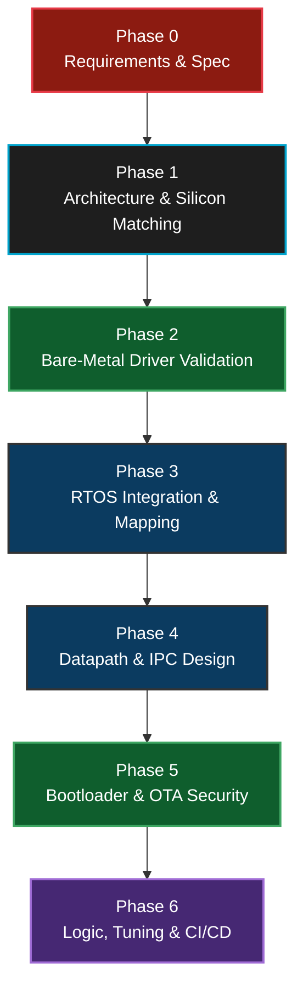

0. **Phase 0: Requirements Gathering & System Specification:** Before writing a single line of C code, product owners gathered the physical and financial constraints. The system needed strict deterministic safety to prevent physical grid overloads (nanosecond response times required), had to handle highly-noisy electrical environments, support secure OTA updates, interface with RS-485/CAN natively, and completely fit within a Sub-$35 Bill of Materials. Embedded Linux was ruled out due to cost, and the "RTOS + Microcontroller" directive became the foundational requirement constraint.
1. **Phase 1: Architecture & Hardware Selection:** The systems team mapped the software specifications to physical silicon. We selected the STM32F407 due to its mature HAL, FPU (to instantly crunch solar peak shaving math), massive 1MB internal flash (for dual-bank security), and multiple simultaneous DMA streams.
2. **Phase 2: Bare-Metal Driver Validation:** Before ever activating FreeRTOS, the firmware team wrote standalone, isolated drivers. We proved the W5500 SPI chip could ping a cloud server, and we proved the CAN mailbox could read raw battery data without OS overhead.
3. **Phase 3: RTOS Integration & Task Mapping:** We introduced FreeRTOS and rigidly defined the 3-Task Topology (`Poll`, `Ctrl`, `Net`). We mapped the prior standalone drivers into these isolated thread spaces.
4. **Phase 4: Datapath & IPC Design:** We defined the exact structure of `SystemState_t` and `CloudCommand_t`, routed them through FreeRTOS Queues, and instituted a "Zero Global Variable" policy.
5. **Phase 5: Bootloader & OTA:** We integrated MCUboot, partitioned the Flash memory into A/B dual banks, and proved we could securely update the application safely via Cryptographic Verification.
6. **Phase 6: Logic, Tuning, & CI/CD:** We integrated the Peak-Shaving algorithms inside `Task_Ctrl` and wired the Git repository directly to an automated CI/CD pipeline.

---

## 11. Testing, Mocking & Static Analysis

Industrial automation demands proof of reliability before physical deployment.

**1. Unit Testing & Mocking (Off-Target):**
We utilize testing frameworks (like **Ceedling / Unity**) to test the core Peak-Shaving algorithms entirely off-target (compiled on a Linux PC). 
Because our business logic in `Task_Ctrl` is perfectly abstracted and only receives inputs via `Queue_Data`, we completely bypassed the STM32 hardware. We wrote "Mock" scripts that inject fake Grid metrics (e.g., `GridWatts = 5000`) into the C-functions to mathematically validate that the inverter limiters react perfectly.

**2. Static Analysis & Code Quality:**
Automated **Static Analysis** (such as `Cppcheck`) is intrinsically integrated into our CI/CD pipeline. Every Pull Request into the repository is automatically scanned for:
*   Buffer Overflows or Array Out-of-Bounds violations.
*   Uninitialized variable usage.
*   MISRA C compliance checks (e.g., verifying `malloc()` is never called dynamically).

**3. Hardware-In-The-Loop (HIL) Integration Testing:**
For physical testing, we built an automated Python test rig that integrates directly into the CI/CD pipeline. The goal is simple: **prove the firmware works on real silicon before any human approves the Pull Request.**

The HIL test cycle works as follows:
1.  **CI/CD Trigger:** A developer pushes a Pull Request on GitHub. GitHub Actions triggers the automated pipeline.
2.  **Build Phase:** The CI server (a Linux Docker container) compiles the firmware using `arm-none-eabi-gcc`, runs `Cppcheck` static analysis, and produces the signed `.bin` artifact via `imgtool`.
3.  **Flash Phase:** The CI server (which has a physical STM32 board connected via USB ST-LINK) flashes the freshly built `.bin` to the Device Under Test (DUT) using `st-flash write`.
4.  **Stimulation Phase:** A Python script (`hil_simulator.py`) injects pre-recorded Modbus RTU telegrams (fake Grid Meter + Inverter data) into the STM32's RS-485 port via a USB-to-RS485 adapter.
5.  **Observation Phase:** A second Python script (`mqtt_sniffer.py`) subscribes to the AWS IoT MQTT broker and captures every JSON telemetry packet the STM32 publishes in response.
6.  **Verdict Phase:** The sniffer compares the received JSON values against a mathematical model (e.g., "If we injected GridWatts=5000 and BatterySOC=80, the inverter command MUST be ≤3000W"). If all assertions pass, the CI pipeline reports ✅ **PASS**. If any value is out of bounds, it reports ❌ **FAIL** and blocks the PR merge.

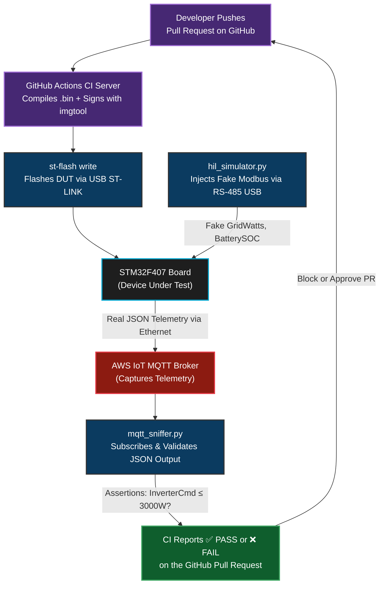

---

## 12. Toolchain & Advanced Debugging Stack

Developing bare-metal code with physical hardware interfaces requires professional embedded tooling. `printf()` debugging over a serial port is wildly insufficient.

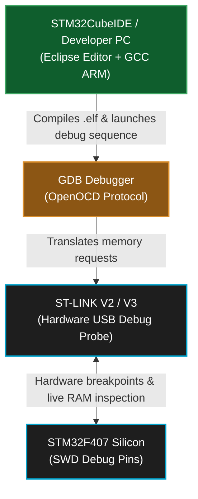

*   **IDE & Compiler:** We explicitly use **`STM32CubeIDE`** (Eclipse-based) natively compiling with the open-source `GCC ARM Embedded` toolchain. 
    *   **Why not Keil µVision?** A common corporate alternative is Keil (owned by ARM). While Keil has an exceptionally optimized proprietary compiler (`armcc`), its commercial licensing is astronomically expensive (often thousands of dollars per seat) and historically ties developers to Windows environments, sometimes via physical USB dongles. `STM32CubeIDE` is completely **free**, cross-platform natively (Linux / Mac / Windows), and intimately couples with the `STM32CubeMX` graphical configuration tool. Because it utilizes standard open-source GCC, we can cleanly extract the build system and seamlessly compile our firmware inside an automated, headless Linux Docker container on our CI/CD server without engaging in complex, expensive licensing battles.
*   **Operating System:** `FreeRTOS` wrapped with the `CMSIS-RTOS v2` API layer.
*   **Security & OTA:** **MCUboot** open-source bootloader, with Python `imgtool` for ECDSA P-256 signing.
*   **Code Versioning:** `Git` & `GitHub`, utilizing `GitHub Actions` for automated builds.
*   **Hardware Breakpoints (ST-LINK V2):** We connect via SWD (Serial Wire Debug). Using GDB within STM32CubeIDE, we can halt the ARM core *exactly* when a specific variable changes and step through `Task_Ctrl` mathematically.
*   **Protocol Analyzers (Saleae Logic):** To ensure our RS-485 `DE` pin toggles exactly when the Modbus DMA finishes, we use a Logic Analyzer. By clamping the probes to PA2 (TX), PA3 (RX), and PD4 (DE), we verify the microsecond-level hardware timing.
*   **RTOS Tracing (SystemView):** We instrument FreeRTOS with Trace macros (e.g., SEGGER SystemView). This allows us to record a visual timeline on a PC showing exactly when the scheduler swaps tasks, proving that `Task_Ctrl` takes 0% CPU until `Queue_Data` triggers it.

### How Debug Printing Works (ITM/SWO Trace)

Standard `printf()` over UART is **dangerous in an RTOS** because:
1. `printf()` is not thread-safe — two tasks calling it simultaneously corrupt the output buffer.
2. UART TX at 115200 baud takes **~870µs per 100 characters** — this blocks the calling task, starving real-time Modbus and CAN processing.
3. It requires a physical UART-to-USB cable, consuming a UART peripheral that we need for Modbus.

Instead, we use the ARM Cortex-M4's built-in **ITM (Instrumentation Trace Macrocell)** hardware, streamed over the **SWO (Serial Wire Output)** pin (`PB3`). This sends debug messages at **full SWD clock speed (4 MHz+)** through the same ST-LINK USB cable already used for programming — zero extra wires, zero CPU blocking.


**Implementation — Custom `_write()` syscall redirect:**

Instead of rewriting every `printf`, we override the low-level C library `_write()` function that `printf` calls internally. This transparently redirects all `printf()` output to the ITM hardware:

```c
// ──── File: Core/Src/syscalls.c ────

#include "stm32f4xx.h"

// Override the C library's _write() to use ITM instead of UART
int _write(int file, char *ptr, int len) {
    for (int i = 0; i < len; i++) {
        ITM_SendChar(*ptr++);
        // ↑ This writes a single byte to ITM Stimulus Port 0.
        // It takes ~1 CPU cycle (just a register write).
        // The ITM hardware has a FIFO — it will NOT block the CPU
        // unless the FIFO overflows (extremely rare at 4 MHz SWO).
    }
    return len;
}
```

**Usage in firmware (identical to standard printf):**
```c
// Inside Task_Poll — completely safe, non-blocking
void Task_Poll(void *argument) {
    for (;;) {
        modbus_read_all_slaves();
        printf("[POLL] GridW=%d, BattSOC=%d%%, InvCmd=%dW\n",
               state.grid_watts, state.battery_soc, state.inverter_cmd);
        // ↑ This does NOT go to UART.
        // It goes to ITM → SWO → ST-LINK → STM32CubeIDE SWV Console.
        // Takes < 5µs for 50 characters. Zero impact on RTOS.

        HAL_IWDG_Refresh(&hiwdg);
        osDelay(300);
    }
}
```

**Viewing the output:**
In STM32CubeIDE: `Window → Show View → SWV → SWV ITM Data Console`. Set the SWO clock to match your core clock (168 MHz) and enable Stimulus Port 0. You'll see live `printf` output streaming at full speed.

> ⚠️ **Production Note:** In production builds, we compile with `-DNDEBUG` which strips all `printf()` calls via a macro: `#ifdef NDEBUG #define printf(...) ((void)0) #endif`. This removes 100% of trace overhead from the release binary.

---

## 13. Hardware Selection: Why the STM32F407?

In a market saturated with microcontrollers, why did the team specifically select the STM32F407VGT6 for this Energy Management System?

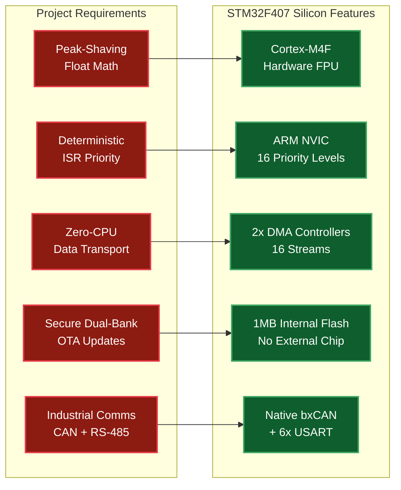

1. **Hardware Floating-Point Unit (FPU):** Peak-Shaving involves heavy algorithm tracking (`float` math). Standard microcontrollers do this matrix math in software, which is agonizingly slow. The F407's Cortex-M4F core calculates floats natively in silicon in a single clock cycle.
2. **Advanced Nested Vectored Interrupt Controller (NVIC):** We require absolute deterministic preemption. The ARM NVIC allows us to hardware-prioritize the CAN bus ISR *over* the Modbus DMA ISR, ensuring collisions are resolved mathematically by the silicon, not the RTOS.
3. **Extensive DMA Streams:** The chip has two robust DMA controllers with 16 separate streams. We uniquely offload the Modbus UART to one stream and the SPI W5500 transfers to another, completely unburdening the CPU.
4. **Massive 1MB Flash Storage:** This size allows us to perfectly split the memory map in half (Bank 1 / Bank 2) for our resilient dual-bank MCUboot OTA updates, without needing to solder a vulnerable external SPI flash chip.
5. **Native Industrial Peripherals:** The chip has a built-in bxCAN controller (for direct J1939 battery communication) and 6 USARTs (for Modbus RS-485). Cheaper chips often lack CAN entirely, forcing an external MCP2515 SPI module that adds cost, PCB space, and failure points.

### Why not a cheaper alternative?

| Feature | **STM32F407** (Selected) | **STM32F103** (Cheaper) | **ESP32** (Popular) |
| :--- | :--- | :--- | :--- |
| **Core** | Cortex-M4F @ 168 MHz | Cortex-M3 @ 72 MHz | Xtensa LX6 @ 240 MHz |
| **Hardware FPU** | ✅ Yes (single-cycle) | ❌ No (software emulation) | ✅ Yes |
| **Flash** | 1 MB (internal) | 64–128 KB (too small for OTA) | 4 MB (external SPI — vulnerable) |
| **CAN Bus** | ✅ Native bxCAN | ✅ Native bxCAN | ❌ None (needs MCP2515) |
| **DMA Streams** | 16 streams | 7 channels (limited) | Limited, Wi-Fi contention |
| **CCM RAM** | ✅ 64 KB (zero wait-state) | ❌ None | ❌ None |
| **Industrial Cert** | ✅ AEC-Q100 qualified | ✅ Available | ❌ Consumer-grade |
| **Price (~1K units)** | ~$6.00 | ~$2.50 | ~$3.00 |
| **Verdict** | ✅ **Selected** | ❌ Flash too small, no FPU | ❌ No CAN, external Flash, not industrial |

### External Transceiver Chips (Why the STM32 can't drive the bus directly)

A very common interview question is: *"Can the STM32 talk directly to a CAN bus or RS-485 wire?"* The answer is **No.**

The STM32F407's internal peripherals (bxCAN, USART, SPI) output standard **3.3V CMOS logic levels** (0V = LOW, 3.3V = HIGH) on their GPIO pins. Industrial buses use completely different electrical signaling:

*   **CAN Bus** uses **differential signaling** (CAN-H and CAN-L wires). A logical `0` ("dominant") is CAN-H=3.5V & CAN-L=1.5V. A logical `1` ("recessive") is both wires at 2.5V. The STM32's GPIO pin physically cannot generate this.
*   **RS-485** also uses **differential signaling** (A and B wires). The voltage can swing from -7V to +12V over hundreds of meters of copper cable. A 3.3V GPIO would be instantly destroyed.
*   **Ethernet** requires a **PHY (Physical Layer)** chip and isolation magnetics to drive the 100BASE-TX twisted-pair signal at ±2.5V with Manchester encoding.

Therefore, we use dedicated **external transceiver ICs** soldered between the STM32 and the physical copper:

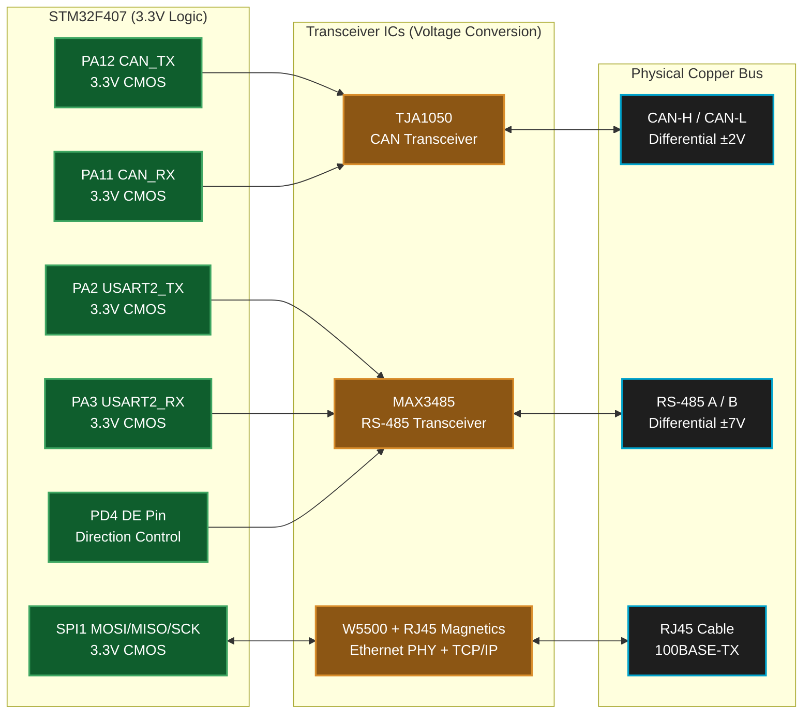

| Interface | STM32 Internal Peripheral | External Transceiver IC | What It Does | Approx. Cost |
| :--- | :--- | :--- | :--- | :--- |
| **CAN Bus** | `bxCAN` (built-in protocol engine) | **TJA1050** (NXP) | Converts 3.3V CAN_TX/RX logic to differential CAN-H/CAN-L voltages. Handles bus arbitration electrically. | ~$0.50 |
| **RS-485 Modbus** | `USART2` (built-in UART) | **MAX3485** (Maxim) | Converts 3.3V UART TX/RX to differential RS-485 A/B. The `DE` pin controls half-duplex direction (transmit vs receive). | ~$0.60 |
| **Ethernet** | `SPI1` (data bus only) | **W5500** (WIZnet) + RJ45 Jack with built-in magnetics | The W5500 is unique — it is not just a PHY. It contains a **full hardware TCP/IP stack** (MAC + PHY + IP + TCP + UDP) in silicon. The RJ45 jack includes galvanic isolation transformers to protect against ground loops. | ~$3.50 |

> 💡 **Interview Key Point:** The STM32's `bxCAN` peripheral handles the **CAN protocol** (arbitration, bit stuffing, CRC, error frames) entirely in hardware. The TJA1050 only handles the **electrical signaling**. Without the TJA1050, the STM32 knows *what* to say but physically cannot *speak* on the bus.

## 14. Estimated Hardware & Bill of Materials (BOM) Cost

When designing an industrial-grade EMS controller for mass production, keeping hardware costs low while maintaining strict reliability is crucial. The strategic move from an Embedded Linux i.MX93 processor (which requires expensive DDR RAM, PMICs, and eMMC) down to a bare-metal RTOS on the STM32 brings a massive cost reduction.

**Estimated Cost Breakdown (Per Board at 1K+ Unit Volume):**

1. **Microcontroller (STM32F407VGT6):** ~$6.00
   * Provides FPU, CAN, Modbus DMA, and 1MB Flash natively without needing external memory chips.
2. **Ethernet Controller & Magnetics (W5500 + RJ45 Jack):** ~$3.50
   * The W5500 integrates the silicon TCP/IP stack; the RJ45 jack includes built-in isolation magnetics.
3. **Industrial Transceivers (RS-485 & CAN):** ~$1.50
   * E.g., MAX3485 (RS-485) and TJA1050 (CAN) to drive the physical copper lines.
4. **Power Supply & Line Isolation (DC-DC / Opto-isolators):** ~$3.00
   * Dropping 24V industrial rails down to clean 3.3V for the STM32, plus electrical isolation for the communication pins to protect against facility ground loops.
5. **Passive Components & Connectors:** ~$4.00
   * Trace routing resistors, filter capacitors, crystal oscillators, and secure Phoenix Contact screw terminals for physical wire landings.
6. **Blank PCB & Factory Assembly (PCBA):** ~$7.00
   * 4-layer FR4 industrial PCB with automated Pick-and-Place (SMT) fabrication.

**Total Hardware BOM Cost:** **Roughly $25.00 per unit**

By utilizing FreeRTOS instead of Embedded Linux, we achieved a purely deterministic, hard real-time energy controller for **under $30 total hardware cost**, completely destroying the $100+ manufacturing cost of a full System-on-Module (SoM) Linux stack.

### Recommended Development Kits for Prototyping
If you need to rapidly prototype this stack or debug the algorithms without waiting for a custom PCBA, we highly recommend the following off-the-shelf development hardware:

1. **The Core Module (MCU):** The **STM32F407G-DISC1** (formerly STM32F4Discovery). 
   * *Why:* It features the exact `STM32F407VGT6` chip used in production. Uniquely, it has a built-in **ST-LINK/V2-A** debugger onboard, allowing you to use GDB hardware breakpoints over USB instantly. Cost: ~$25.
2. **The Networking Module:** Any standard **WIZnet W5500 SPI Ethernet Breakout Board** (e.g., from Waveshare or generic vendors). Connect this to SPI1 or SPI2 on the Discovery board. Cost: ~$5.
3. **The Industrial Comms:** Generic 3.3V UART-to-RS485 modules (using `MAX3485`) and CAN transceivers (using `TJA1050`). Cost: ~$3.

This allows the entire firmware stack (including the custom `ims-rtos-mini` code, FreeRTOS, and MCUboot OTA) to be tested verbatim on a desk for under $35!

---

## 15. C Code to Silicon: The Build Flow & Linker Mapping

To bridge the gap between high-level C logic and physical STM32 hardware execution, we rely on the GNU GCC toolchain. This is a multi-phase compilation process, meticulously mapped by the Linker Script.

### The 4-Phase Compilation Workflow
1.  **Preprocessor (`arm-none-eabi-cpp`):** Strips all comments, expands `#define` macros (e.g., translating `MAX_INVERTER_WATTAGE` to `3000`), and copies all `#include <stm32f4xx.h>` header files directly into the raw source code.
2.  **Compiler (`arm-none-eabi-gcc`):** Analyzes the raw C code, checks it against MISRA-C/custom standards, and translates the human-readable logic into native ARM Cortex-M4 Assembly instructions (`.s` files). We compile with the `-O2` flag to heavily optimize the instructions for computational speed.
3.  **Assembler (`arm-none-eabi-as`):** Converts the ARM Assembly into physical machine code (1s and 0s). This outputs unlinked Object files (`.o`).
4.  **Linker (`arm-none-eabi-ld`):** The most critical embedded step. The linker takes all the floating `.o` files, the FreeRTOS OS libraries, and the STM32 HAL libraries, and physically maps them to specific transistor addresses inside the STM32's memory based strictly on the **Linker Script (`STM32F407VGTX_FLASH.ld`)**. It produces the final executable `.elf` and `.bin` payloads.

### Build Output Artifacts (What the toolchain produces)

After a successful build, the GCC toolchain generates several output files. Each file serves a distinct purpose in the embedded workflow:

| Output File | What It Contains | When You Use It | How To Inspect It |
| :--- | :--- | :--- | :--- |
| **`.elf`** | The complete executable with **all debug symbols**, function names, variable names, source file mappings, and section addresses. This is the "master" build output. | **Debugging only.** You load this into GDB / STM32CubeIDE for hardware breakpoints, step-through debugging, and live variable inspection. It is **never** flashed to production boards (too large, contains secrets). | `arm-none-eabi-readelf -h app.elf` (shows ELF header) | 
| **`.bin`** | A **raw binary image** — pure machine code bytes with zero metadata, headers, or debug symbols. Byte 0 of the file maps directly to the first Flash address. | **Flashing & OTA.** This is the file you flash via `st-flash write app.bin 0x08040000` and the file you sign with `imgtool` for secure OTA. It is the **production deliverable.** | `arm-none-eabi-size app.elf` (shows .text/.data/.bss sizes) or `ls -lh app.bin` (shows raw file size in bytes) |
| **`.hex`** | An Intel HEX formatted text file. Each line is a human-readable ASCII record containing the target address and the data bytes to write there. | **STM32CubeProgrammer GUI.** The GUI tool prefers `.hex` because it contains embedded address info — you don't need to manually type `0x08040000`. Also used by some factory programmers. | `head -5 app.hex` (shows the first 5 address records) |
| **`.map`** | A detailed **linker map report**. Lists every single function, variable, and library — showing its exact memory address, size in bytes, and which `.o` file contributed it. | **Memory debugging & optimization.** If your binary is too large, open the `.map` file to find which function or library consumes the most Flash. Also confirms your linker script placed code at the correct addresses. | `grep -i "Task_Poll" app.map` (finds where Task_Poll lives in memory) |
| **`.list`** | A **disassembly listing** — the final ARM assembly instructions alongside the original C source lines. | **Low-level debugging.** When you suspect the compiler generated incorrect code (e.g., FPU not being used), you check the `.list` to see the actual ARM instructions. | `arm-none-eabi-objdump -d app.elf > app.list` (generates the listing) |

**Quick verification commands after every build:**
```bash
# 1. Check total Flash and RAM usage (most important command!)
arm-none-eabi-size build/ems_rtos.elf
#   text    data     bss     dec     hex filename
#  68432    1204    9856   79492   13684 build/ems_rtos.elf
#   ↑ Flash  ↑ Flash  ↑ RAM

# 2. Verify the .bin file size fits in Bank 1 (must be < 384KB = 393216 bytes)
ls -l build/ems_rtos.bin

# 3. Confirm the Entry Point address matches our linker script (should be 0x08040xxx)
arm-none-eabi-readelf -h build/ems_rtos.elf | grep "Entry point"

# 4. Find the biggest functions consuming Flash (top 10)
arm-none-eabi-nm --size-sort --reverse-sort build/ems_rtos.elf | head -10
```

### Linker Script & Memory Partitioning Modifications
In a standard bare-metal project, the Linker Script instructs the CPU to place the main application right at the beginning of Flash memory (`0x08000000`). However, because we integrated **MCUboot (The Bootloader)**, we had to fundamentally rewrite the Linker Script and memory management logic.

#### Standard Project (No Bootloader) vs. Our Project (With MCUboot)

In a **standard** STM32 project (no bootloader), you compile *one single `.elf` file* which the linker places directly at `0x08000000`. The CPU resets, reads the vector table from `0x08000000`, and directly executes your application. Simple.

In **our project**, we have **two completely separate firmware projects**, each compiled independently into its own `.elf` and `.bin`:

| Binary | Source Project | Linker Origin | Flashed To | Contains |
| :--- | :--- | :--- | :--- | :--- |
| **`mcuboot.bin`** | MCUboot (separate C project) | `0x08000000` | `st-flash write mcuboot.bin 0x08000000` | Bootloader code + embedded ECDSA public key |
| **`ems_rtos_signed.bin`** | ems-mini-rtos (our project) | `0x08040000` | `st-flash write ems_rtos_signed.bin 0x08040000` | FreeRTOS application + signed image header |

They are **never combined into a single `.elf`**. Each has its own linker script pointing to a different Flash origin. At the factory, they are flashed sequentially as two separate `st-flash write` commands.

```
 Flash Memory Map (1MB = 0x08000000 to 0x080FFFFF)
 ═══════════════════════════════════════════════════════════════════
 
 ┌─────────────────────────────────────────┐ 0x08000000
 │  mcuboot.bin (Bootloader)               │  ← Separate project, separate .elf
 │  - Own vector table at 0x08000000       │     Flashed FIRST at the factory
 │  - ECDSA P-256 public key embedded      │     st-flash write mcuboot.bin 0x08000000
 │  - OTA swap engine + scratch logic      │
 │  ~45 KB used out of 64 KB allocated     │
 ├─────────────────────────────────────────┤ 0x08010000
 │  (Unused padding to align sectors)      │
 ├─────────────────────────────────────────┤ 0x08020000
 │  Scratch / Swap Sector                  │  ← MCUboot uses this for partition swaps
 │  128 KB reserved                        │
 ├═════════════════════════════════════════┤ 0x08040000  ← OUR APP STARTS HERE
 │  ems_rtos_signed.bin (FreeRTOS App)     │  ← Separate project, separate .elf
 │  - Own vector table at 0x08040000       │     Flashed SECOND at the factory
 │  - FreeRTOS kernel + all tasks          │     st-flash write ems_rtos_signed.bin 0x08040000
 │  - HAL drivers, W5500, MQTT             │
 │  ~70 KB used out of 384 KB allocated    │
 │  BANK 1 (Active Application Slot)       │
 ├─────────────────────────────────────────┤ 0x080A0000
 │  BANK 2 (OTA Download Slot)             │  ← Incoming firmware lands here via OTA
 │  384 KB (mirror of Bank 1)              │
 └─────────────────────────────────────────┘ 0x080FFFFF
```

**Our Modified Linker Script (`STM32F407VGTX_FLASH.ld`):**
```text
MEMORY
{
  CCMRAM (xrw)     : ORIGIN = 0x10000000, LENGTH = 64K
  RAM (xrw)        : ORIGIN = 0x20000000, LENGTH = 128K
  /* Bootloader is 0x0800 0000 to 0x0803 FFFF (its own binary) */
  FLASH (rx)       : ORIGIN = 0x08040000, LENGTH = 384K /* Bank 1 App Slot */
}
```

We physically pushed the starting address of `ems-rtos-mini` 256KB deep into the memory map (`0x08040000`), reserving the foundational blocks purely for the Bootloader and its Cryptographic Swap / Scratch routines. 

#### The VTOR Shift (Critical: Why and How)

We also had to shift the **Vector Table Offset Register (VTOR)** inside `system_stm32f4xx.c`.

**What is the Vector Table?**
The very first 4 bytes at the beginning of any ARM Cortex-M binary is the Initial Stack Pointer. The next 4 bytes is the Reset Handler address. After that comes a table of function pointers — one for every possible hardware interrupt (SysTick, UART, CAN, DMA, etc.). When the CPU receives any hardware interrupt, it looks up the handler address **from the vector table** and jumps to it.

**The Problem:**
After MCUboot finishes verification and jumps to `0x08040000`, the ARM core's VTOR register still points to `0x08000000` (the bootloader's vector table). So when the FreeRTOS `SysTick` timer fires 1ms later, the CPU looks up the SysTick handler at address `0x08000000 + offset`, which is a **bootloader function** — not our FreeRTOS handler. The CPU jumps to random MCUboot code, and instantly crashes into a **Hard Fault**.

**The Fix — Exact Code Change in `system_stm32f4xx.c`:**
```c
// ──── File: Core/Src/system_stm32f4xx.c ────

// Step 1: Enable the custom VTOR address (uncomment this #define)
#define USER_VECT_TAB_ADDRESS    // ← This was commented out by default!

// Step 2: Set the offset to match our linker script origin
#ifdef USER_VECT_TAB_ADDRESS
  #define VECT_TAB_OFFSET  0x00040000U   // ← Changed from 0x00000000 to 0x00040000
#endif                                   //    This is 256KB = the gap for MCUboot

// Step 3: SystemInit() applies the shift at boot (called before main())
void SystemInit(void)
{
  /* FPU settings ───────────────────────────────────── */
  #if (__FPU_PRESENT == 1) && (__FPU_USED == 1)
    SCB->CPACR |= ((3UL << 20U) | (3UL << 22U)); // Enable FPU
  #endif

  /* Vector Table Relocation ─────────────────────────── */
  #ifdef USER_VECT_TAB_ADDRESS
    SCB->VTOR = FLASH_BASE | VECT_TAB_OFFSET;
    // ↑ This single line is the magic.
    // FLASH_BASE = 0x08000000 (defined by CMSIS)
    // VECT_TAB_OFFSET = 0x00040000 (our #define above)
    // Result: SCB->VTOR = 0x08040000
    // Now when SysTick fires, the CPU looks at 0x08040000 + SysTick_offset
    // which is OUR FreeRTOS handler, not the bootloader's!
  #endif
}
```

**Before vs. After the VTOR shift:**

| Event | VTOR = `0x08000000` (DEFAULT / BROKEN) | VTOR = `0x08040000` (OUR FIX) |
| :--- | :--- | :--- |
| SysTick fires (1ms) | CPU reads handler from MCUboot memory → **Hard Fault** | CPU reads handler from FreeRTOS app → ✅ Scheduler runs |
| UART ISR fires | CPU jumps to bootloader code → **Crash** | CPU jumps to our DMA callback → ✅ Modbus works |
| CAN RX ISR fires | CPU reads garbage → **Crash** | CPU reads `HAL_CAN_RxFifo0MsgPendingCallback` → ✅ Battery data arrives |

#### The Vector Table: What It Looks Like in Memory

The vector table lives at the very beginning of our application binary (`0x08040000`). It is defined in the startup assembly file `startup_stm32f407xx.s` and looks like this in memory:

```
 Vector Table at 0x08040000 (Our Application)
 ═══════════════════════════════════════════════════
 Offset    │ Contents                       │ Purpose
 ──────────┼────────────────────────────────┼──────────────────────
 +0x000    │ 0x20020000                     │ Initial Stack Pointer (top of RAM)
 +0x004    │ Reset_Handler address          │ CPU jumps here on power-on
 +0x008    │ NMI_Handler address            │ Non-Maskable Interrupt
 +0x00C    │ HardFault_Handler address      │ Catches all fatal crashes
 +0x010    │ MemManage_Handler              │ Memory protection fault
 +0x014    │ BusFault_Handler               │ Bus access error
 +0x018    │ UsageFault_Handler             │ Undefined instruction
 ...       │ ...                            │ ...
 +0x03C    │ SysTick_Handler address        │ ← FreeRTOS uses THIS for scheduling!
 ...       │ ...                            │ ...
 +0x0D8    │ USART2_IRQHandler address      │ ← Our Modbus DMA IDLE callback
 +0x100    │ CAN1_RX0_IRQHandler address    │ ← Our CAN mailbox ISR
 ...       │ (up to 82 interrupt entries)   │ ...
```

When the CPU receives interrupt #15 (SysTick), it reads address `SCB->VTOR + 0x03C`, fetches the function pointer stored there, and **jumps to it**. This is why shifting VTOR is critical — it tells the CPU *which copy* of the vector table to use.

#### How Task Switching Actually Works (The Full Flow)

This is one of the most commonly asked interview questions. Here is the **exact sequence** of what happens inside the ARM Cortex-M4 and FreeRTOS kernel when a context switch occurs:

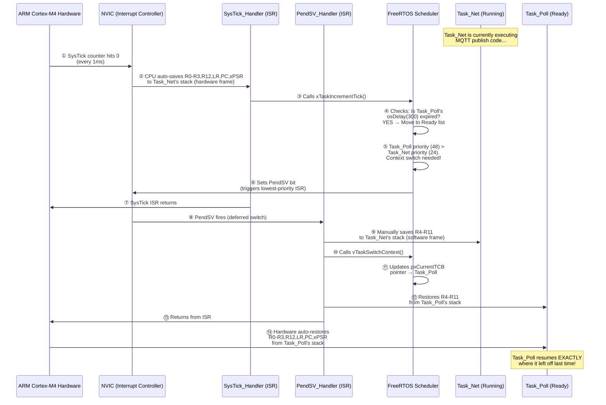

**Step-by-step breakdown:**

| Step | Who Does It | What Happens | CPU Cycles |
| :--- | :--- | :--- | :--- |
| **①** | Hardware (SysTick timer) | The SysTick counter register decrements to 0. It fires every 1ms. | 0 (hardware) |
| **②** | ARM Cortex Hardware (automatic) | The CPU **automatically** pushes 8 registers (`R0, R1, R2, R3, R12, LR, PC, xPSR`) from `Task_Net` onto `Task_Net`'s own stack. This is called the **hardware exception frame**. You do NOT write code for this — the silicon does it. | ~12 cycles |
| **③** | `SysTick_Handler` (FreeRTOS ISR) | FreeRTOS increments its internal tick counter and checks all delayed tasks. | ~20 cycles |
| **④–⑤** | FreeRTOS Scheduler | The scheduler evaluates the Ready list. `Task_Poll` (priority 48) is higher than `Task_Net` (priority 24). A switch is needed. | ~30 cycles |
| **⑥** | FreeRTOS Scheduler | Instead of switching immediately (which is unsafe inside SysTick), it sets the **PendSV** interrupt pending bit. PendSV is configured as the **lowest priority** interrupt, so it fires only after all other ISRs complete. | 1 cycle |
| **⑦** | Hardware | SysTick ISR returns. Hardware restores the basic frame — but PendSV is pending! | ~12 cycles |
| **⑧** | ARM Cortex Hardware | PendSV fires immediately (nothing else is pending). | ~12 cycles |
| **⑨** | `PendSV_Handler` (FreeRTOS, written in assembly) | **Manually** saves the remaining 8 registers (`R4–R11`) that the hardware did NOT save. These are pushed onto `Task_Net`'s stack. Now `Task_Net`'s **complete CPU state** is frozen on its stack. | ~8 cycles |
| **⑩–⑪** | FreeRTOS `vTaskSwitchContext()` | Updates the global `pxCurrentTCB` pointer to point at `Task_Poll`'s Task Control Block. | ~10 cycles |
| **⑫** | `PendSV_Handler` | **Manually** restores `R4–R11` from `Task_Poll`'s stack (where they were saved last time `Task_Poll` was suspended). | ~8 cycles |
| **⑬–⑭** | ARM Cortex Hardware | PendSV returns. Hardware **automatically** pops `R0–R3, R12, LR, PC, xPSR` from `Task_Poll`'s stack. The PC register now points to the exact instruction where `Task_Poll` was paused last time. | ~12 cycles |

**Total context switch time: ~125 CPU cycles ≈ 0.75 microseconds at 168 MHz.**

> 💡 **Key Interview Point:** The context switch uses **two ISRs** — `SysTick` (high priority, just makes the decision) and `PendSV` (lowest priority, does the actual register swap). The reason for this split is that if a CAN or UART ISR fires at the same time as SysTick, the higher-priority hardware ISR runs first. PendSV patiently waits and only performs the switch when the CPU is completely idle from all hardware servicing.

---

## 16. The System Boot Flow & Timings

When power is applied to the industrial **24V DC bus** from the battery racks, an onboard **DC-DC buck converter** steps the voltage down to a clean **3.3V rail** that feeds the STM32 and all 3.3V logic. The STM32 itself never sees 24V — it operates entirely on 3.3V. However, from a system perspective, the "power-on" event is the 24V bus energizing. The board does not instantly start running the FreeRTOS controller. It undergoes a rigid, multi-stage boot sequence designed for maximum industrial safety.

> 💡 **Power chain:** `24V DC (Battery/PSU)` → `DC-DC Buck (e.g., LM2596)` → `3.3V Rail` → `STM32 VDD pins`

### Boot Chain Comparison: RTOS vs Embedded Linux

To understand this boot flow, it helps to compare it directly against the Embedded Linux boot chain you may already know (e.g., from the i.MX93 CEM board):

```
 EMBEDDED LINUX (i.MX93)              STM32F407 RTOS CONTROLLER
 ─────────────────────────            ────────────────────────────────────
 ┌──────────────────────┐             ┌──────────────────────────────────┐
 │  ROM Bootcode        │             │  ARM Cortex-M4 Reset Handler     │
 │  (On-Chip ROM)       │             │  (Hardwired in silicon)          │
 │  Validates SPL via   │             │  Reads Stack Pointer + Reset     │
 │  AHAB / HAB fuses    │             │  Vector from address 0x08000000  │
 └──────────┬───────────┘             └────────────────┬─────────────────┘
            │                                          │
            ▼                                          ▼
 ┌──────────────────────┐             ┌──────────────────────────────────┐
 │  SPL / U-Boot        │             │  MCUboot (0x08000000)            │
 │  (Secondary Program  │             │  ─ Checks OTA Magic Trailer      │
 │   Loader)            │             │  ─ Reads embedded ECDSA P-256    │
 │  Loads U-Boot proper │             │    Public Key                    │
 │  into DDR            │             │  ─ Cryptographically verifies    │
 └──────────┬───────────┘             │    Bank 1 ECDSA signature        │
            │                         │  ─ If OTA pending: swaps Bank2   │
            ▼                         │    into Bank1 via Scratch sector  │
 ┌──────────────────────┐             │  ─ Jumps PC to 0x08040000        │
 │  U-Boot              │             └────────────────┬─────────────────┘
 │  ─ Initializes DDR   │                              │ (~0–150ms)
 │  ─ Reads env vars    │                              ▼
 │  ─ Loads Kernel +    │             ┌──────────────────────────────────┐
 │    DTB from eMMC     │             │  SystemInit()  (0x08040000)      │
 │  ─ Boots Kernel      │             │  ─ Shifts VTOR to 0x08040000     │
 └──────────┬───────────┘             │  ─ Enables Cortex-M4 FPU        │
            │                         │  ─ Configures PLL: 168 MHz       │
            ▼                         │    (HSE 8MHz × PLL → 168MHz)     │
 ┌──────────────────────┐             └────────────────┬─────────────────┘
 │  Linux Kernel        │                              │ (+151ms)
 │  ─ Decompresses zImg │                              ▼
 │  ─ Initialises MM,   │             ┌──────────────────────────────────┐
 │    drivers, sched    │             │  C Runtime _start()              │
 │  ─ Mounts rootfs     │             │  ─ Copies .data section          │
 │  ─ Starts init/      │             │    from Flash ROM → SRAM         │
 │    systemd           │             │  ─ Zero-initialises .bss section │
 └──────────┬───────────┘             └────────────────┬─────────────────┘
            │                                          │ (+155ms)
            ▼                                          ▼
 ┌──────────────────────┐             ┌──────────────────────────────────┐
 │  rootfs / userspace  │             │  main() — FreeRTOS Boot          │
 │  ─ systemd services  │             │  ─ Creates 3 Queues              │
 │  ─ ems-app (Python)  │             │  ─ Creates 3 Tasks               │
 │  ─ can-driver        │             │  ─ Creates Semaphores            │
 │  ─ ems-monitor       │             │  ─ Calls osKernelStart()         │
 │    (web dashboard)   │             └────────────────┬─────────────────┘
 └──────────────────────┘                              │ (+160ms)
                                                       ▼
                                      ┌──────────────────────────────────┐
                                      │  FreeRTOS Scheduler Running      │
                                      │  ─ Task_Poll: Modbus DMA read    │
                                      │  ─ Task_Ctrl: Peak-shaving logic │
                                      │  ─ Task_Net: MQTT Cloud link     │
                                      │  ─ Idle Task: ARM WFI sleep      │
                                      └──────────────────────────────────┘
                                                    (~300ms total)
```

### Key Differences vs. Embedded Linux

| Stage | Embedded Linux (i.MX93) | RTOS Controller (STM32F407) |
|---|---|---|
| **Hardware security** | AHAB / HAB eFuse chain → SPL signature | MCUboot ECDSA P-256 signature verification |
| **Bootloader** | U-Boot (loads kernel from eMMC) | MCUboot (jumps to Flash address directly) |
| **Memory init** | DDR RAM training (300+ ms) | None — SRAM is always ready at reset |
| **OS start** | Linux Kernel decompression + MM init | `osKernelStart()` — single function call |
| **Userspace** | systemd → services → Python apps | FreeRTOS tasks — no userspace concept |
| **Total boot time** | ~30–60 seconds | ~300 milliseconds |
| **Storage abstraction** | ext4 / FAT filesystem on eMMC | No filesystem — direct Flash addresses |
| **Runtime updates** | SWUpdate via `.swu` package | MCUboot OTA via Bank 1/2 swap |

### ⏱️ Boot Timing Profile (Total Frame: ~300ms)

1.  **Hardware Reset (`+0 ms`):** Power stabilizes. The ARM Core fetches the first native instruction from silicon address `0x08000000`.
2.  **MCUboot Execution (`+5 ms to +150 ms`):** 
    *   The bootloader wakes up. 
    *   It checks the "Magic Trailer" in Flash Bank 2 to see if an Over-The-Air (OTA) update is pending copy.
    *   It reads the ECDSA Public Key embedded in its own memory and runs heavy elliptic curve mathematical verification over the Bank 1 Application (taking roughly ~100+ milliseconds due to intensive cryptography).
    *   If Secure Boot passes, MCUboot points the Program Counter (`PC` register) to `0x08040000` and executes a Jump command.
3.  **SystemInit() (`+151 ms`):** 
    **Customizing the Kernel / Startup:** In a bare-metal RTOS, the Interrupt Vector Table must be shifted so FreeRTOS timers fire correctly *after* MCUboot hands over control. If we didn't do this, hardware interrupts would look directly at the bootloader memory and crash the system. We specifically modified `system_stm32f4xx.c`:
    ```c
    // Inside system_stm32f4xx.c
    #define USER_VECT_TAB_ADDRESS
    #define VECT_TAB_OFFSET  0x00040000U // Shifted 256KB deep matching Linker

    void SystemInit(void) {
        /* FPU settings & System clock config */
        SCB->VTOR = FLASH_BASE | VECT_TAB_OFFSET; // Move the core interrupts!
    }
    ```
    Once the core kernel vectors are shifted, it evaluates the `SystemClock_Config()` function to fire up the external 8MHz Crystal Oscillator (HSE), feeding it through the PLL to aggressively multiply the core clock to exactly **168 MHz**.

### ⏰ Clock Tree & PLL Configuration (Deep Dive)

This is a **top-tier interview topic**. Every STM32 project must configure its clock tree, and getting it wrong means all peripherals (UART, SPI, CAN, timers) run at wrong speeds and silently produce garbage data.

#### The Clock Path (How 8 MHz Becomes 168 MHz)

```
 Clock Source Selection & PLL Multiplication
 ══════════════════════════════════════════════════════════════════

 ┌───────────────┐     ┌─────────────┐     ┌──────────────────┐
 │ HSE Crystal   │     │ PLL Engine  │     │ System Clock     │
 │ (External)    │────→│             │────→│ SYSCLK = 168 MHz │
 │ 8 MHz         │  ÷M │  ×N   ÷P   │     │                  │
 └───────────────┘     └─────────────┘     └────────┬─────────┘
                                                    │
                        ┌───────────────────────────┼──────────────────────┐
                        │                           │                      │
                        ▼                           ▼                      ▼
               ┌────────────────┐          ┌────────────────┐     ┌────────────────┐
               │ AHB Bus        │          │ APB1 Bus       │     │ APB2 Bus       │
               │ 168 MHz        │          │ 42 MHz (÷4)   │     │ 84 MHz (÷2)   │
               │ (Core + DMA)   │          │ (UART, I2C,   │     │ (SPI1, ADC,   │
               │                │          │  CAN, Timers)  │     │  USART1)       │
               └────────────────┘          └────────────────┘     └────────────────┘
```

#### The Exact PLL Math

The STM32F407's PLL takes the input clock and applies three dividers:

```
SYSCLK = (HSE / PLL_M) × PLL_N / PLL_P
       = (8 MHz / 8)    × 336   / 2
       = 1 MHz           × 336   / 2
       = 168 MHz  ✅
```

| PLL Parameter | Value | Purpose |
| :--- | :--- | :--- |
| `PLL_M` | 8 | Divides HSE down to exactly 1 MHz (PLL input requirement: 1–2 MHz) |
| `PLL_N` | 336 | Multiplies 1 MHz up to 336 MHz (VCO output) |
| `PLL_P` | 2 | Divides VCO output to get final SYSCLK: 336 / 2 = 168 MHz |
| `PLL_Q` | 7 | Separate divider for USB OTG: 336 / 7 = 48 MHz (USB requires exactly 48 MHz) |

#### SystemClock_Config() Code

```c
// ──── File: Core/Src/main.c ────
void SystemClock_Config(void) {
    RCC_OscInitTypeDef RCC_OscInitStruct = {0};
    RCC_ClkInitTypeDef RCC_ClkInitStruct = {0};

    // Step 1: Enable HSE (External 8 MHz crystal on pins PH0/PH1)
    RCC_OscInitStruct.OscillatorType = RCC_OSCILLATORTYPE_HSE;
    RCC_OscInitStruct.HSEState = RCC_HSE_ON;
    RCC_OscInitStruct.PLL.PLLState = RCC_PLL_ON;
    RCC_OscInitStruct.PLL.PLLSource = RCC_PLLSOURCE_HSE;  // ← Use crystal, not RC
    RCC_OscInitStruct.PLL.PLLM = 8;    // 8 MHz ÷ 8 = 1 MHz
    RCC_OscInitStruct.PLL.PLLN = 336;  // 1 MHz × 336 = 336 MHz (VCO)
    RCC_OscInitStruct.PLL.PLLP = 2;    // 336 MHz ÷ 2 = 168 MHz (SYSCLK!)
    RCC_OscInitStruct.PLL.PLLQ = 7;    // 336 MHz ÷ 7 = 48 MHz (USB)
    HAL_RCC_OscConfig(&RCC_OscInitStruct);

    // Step 2: Set bus dividers (AHB, APB1, APB2)
    RCC_ClkInitStruct.ClockType = RCC_CLOCKTYPE_SYSCLK | RCC_CLOCKTYPE_HCLK
                                | RCC_CLOCKTYPE_PCLK1  | RCC_CLOCKTYPE_PCLK2;
    RCC_ClkInitStruct.SYSCLKSource = RCC_SYSCLKSOURCE_PLLCLK;
    RCC_ClkInitStruct.AHBCLKDivider = RCC_SYSCLK_DIV1;    // 168 MHz
    RCC_ClkInitStruct.APB1CLKDivider = RCC_HCLK_DIV4;     // 168 ÷ 4 = 42 MHz
    RCC_ClkInitStruct.APB2CLKDivider = RCC_HCLK_DIV2;     // 168 ÷ 2 = 84 MHz

    // Step 3: Flash latency MUST match clock speed!
    HAL_RCC_ClockConfig(&RCC_ClkInitStruct, FLASH_LATENCY_5);
    //                                      ↑ 5 wait states for 168 MHz
}
```

#### 🎯 Interview-Level Clock Tree Notes

| Question | Answer |
| :--- | :--- |
| **Why HSE instead of HSI (internal 16 MHz RC)?** | The internal RC oscillator drifts ±1% with temperature. CAN bus at 500 kbps requires ≤0.5% accuracy — HSI would cause random CAN bit errors in hot industrial environments. The external crystal is ±20 ppm (0.002%). |
| **What are Flash wait states?** | The Flash memory chip inside the STM32 is physically slower than the CPU. At 168 MHz, the CPU can request an instruction every ~6ns, but Flash needs ~30ns to respond. Setting `FLASH_LATENCY_5` tells the CPU to insert 5 wait cycles per fetch. If you set this too low, the CPU reads garbage from Flash and Hard Faults. |
| **What happens if the HSE crystal physically breaks?** | The STM32 has a **Clock Security System (CSS)**. If HSE fails, CSS automatically switches SYSCLK to the internal HSI (16 MHz) and fires an NMI interrupt. The system keeps running at reduced speed rather than crashing. We handle this in `NMI_Handler()` to log the fault and set the red LED. |
| **Why is APB1 limited to 42 MHz?** | It's a physical silicon limitation documented in the STM32F407 datasheet. The APB1 bus transistors cannot switch reliably above 42 MHz. The CAN peripheral is on APB1 — its baud rate prescaler is calculated from this 42 MHz base clock. |
| **How does SPI1 get 21 Mbit/s for W5500?** | SPI1 is on APB2 (84 MHz). We set the SPI prescaler to `DIV4`: 84 ÷ 4 = 21 MHz. This is the maximum speed the W5500 chip supports. |

4.  **C Runtime Initialization (`+155 ms`):** The C-language `_start()` routine copies all global variable initializations (`.data` section) slowly from Flash ROM into volatile RAM. 
5.  **FreeRTOS Kernel Launch (`+160 ms`):** `main()` completes creating the 3 Queues, 3 Tasks, and Semaphores, and finally calls `osKernelStart()`. The FreeRTOS preemptive scheduler takes over the CPU entirely.
6.  **Application Running (`+300 ms`):** Within roughly 1/3 of a second of bare-metal power-on, `Task_Poll` executes its first deterministic Modbus DMA read from the Grid Meter.

### 📏 How To Measure Boot Timing Per Phase

To **prove** these boot timing numbers (critical for certification and interviews), we use two methods:

**Method 1: GPIO Toggle + Logic Analyzer (Most Accurate)**
We add a single `HAL_GPIO_TogglePin()` call at the entry point of each boot phase. By probing these pins with a Saleae Logic Analyzer, we get **nanosecond-accurate** timestamps for each phase transition:
```c
// Inside MCUboot's main() — fires at +5ms
HAL_GPIO_WritePin(GPIOD, GPIO_PIN_12, GPIO_PIN_SET);   // Green LED ON

// Inside SystemInit() — fires at +151ms
HAL_GPIO_WritePin(GPIOD, GPIO_PIN_13, GPIO_PIN_SET);   // Orange LED ON

// Inside main() after osKernelStart() — fires at +160ms
HAL_GPIO_WritePin(GPIOD, GPIO_PIN_14, GPIO_PIN_SET);   // Red LED ON

// Inside Task_Poll first loop — fires at +300ms
HAL_GPIO_WritePin(GPIOD, GPIO_PIN_15, GPIO_PIN_SET);   // Blue LED ON
```
The logic analyzer captures exact rising-edge timestamps, proving boot time to auditors.

**Method 2: SEGGER SystemView (Software Trace)**
After `osKernelStart()`, SystemView records all task switches with microsecond resolution. It visually proves the first `Task_Poll` execution time.

### 🔧 How To Debug the Bootloader (MCUboot) at Runtime

Debugging MCUboot is tricky because it is a **separate project** with its own `.elf`. Here are the methods:

**Method 1: SWD Hardware Debugging (Before RDP is set)**
Before the factory locks the board with RDP Level 2, you can connect an ST-LINK and debug MCUboot directly:
```bash
# Load MCUboot's .elf (with debug symbols) into GDB
arm-none-eabi-gdb build/mcuboot.elf
(gdb) target remote :3333
(gdb) monitor reset halt          # Freeze CPU at address 0x08000000
(gdb) break main                  # Set breakpoint at MCUboot's main()
(gdb) continue                    # Run until breakpoint
(gdb) step                        # Step through signature verification
(gdb) print image_ok              # Inspect the OTA flag value
```

**Method 2: UART Serial Console (Always Available)**
MCUboot is compiled with `MCUBOOT_LOG_LEVEL=4` (DEBUG). It prints detailed logs over UART at 115200 baud:
```
[INF] MCUboot v1.9.0 starting
[INF] Primary image: magic=good, swap_type=none, copy_done=0x1, image_ok=0x1
[INF] Verifying signature with ECDSA-P256...
[INF] Signature OK! Booting primary slot (0x08040000)...
```
If signature verification fails, you see:
```
[ERR] Image in primary slot is not valid!
[ERR] Unable to find bootable image
```

**Method 3: Fault Pin Indication**
In production (RDP Level 2, no SWD), we configure MCUboot to toggle a dedicated GPIO if it fails to boot. The factory test rig checks this pin.

### ⚠️ Boot Error Troubleshooting Table

| Symptom | Root Cause | How To Diagnose | How To Fix |
| :--- | :--- | :--- | :--- |
| **Board is completely dead** (no LEDs, no UART) | DC-DC converter failure or BOR reset holding CPU | Check 3.3V rail with a multimeter. If below 2.7V, BOR is active. | Replace DC-DC module. Verify 24V input is stable. |
| **MCUboot prints nothing on UART** | VTOR is correct but MCUboot binary is corrupted or missing | Connect ST-LINK, run `arm-none-eabi-gdb`, check if PC is stuck at `0xFFFFFFFE` (HardFault). | Re-flash `mcuboot.bin` at `0x08000000`. |
| **`Signature INVALID! Halting.`** | Wrong signing key used by CI/CD, or binary was corrupted during transfer | Check `imgtool` command in CI pipeline. Verify the public key embedded in MCUboot matches the private key used to sign. | Re-sign the app binary with the correct `.pem` key. Re-flash. |
| **`Unable to find bootable image`** | Application binary missing from Bank 1, or MCUboot image header is absent | Verify `ems_rtos_signed.bin` was flashed to `0x08040000`. Check with `st-flash read dump.bin 0x08040000 0x100` and inspect the MCUboot header bytes. | Re-flash the signed application binary. |
| **MCUboot boots, app crashes immediately** (Hard Fault within 1ms) | VTOR not shifted — SysTick ISR jumps to bootloader memory | Connect GDB, `monitor reset halt`, check `SCB->VTOR` value. If `0x08000000`, the shift is missing. | Uncomment `#define USER_VECT_TAB_ADDRESS` and set `VECT_TAB_OFFSET = 0x00040000U` in `system_stm32f4xx.c`. |
| **MCUboot boots, app crashes after ~2 seconds** | IWDG watchdog not being refreshed — `Task_Poll` is stuck | Check UART logs. If last message is from `main()` but no task output, a queue or semaphore creation failed (out of RAM). | Increase `configTOTAL_HEAP_SIZE` in `FreeRTOSConfig.h`. Use `arm-none-eabi-size` to check RAM usage. |
| **App runs but FreeRTOS scheduler never starts** | `osKernelStart()` returns an error (not enough heap for Idle Task) | GDB: set breakpoint at `osKernelStart`, step through. Check return value. | Ensure heap is at least 4KB larger than all task stacks combined. |
| **App runs but Modbus never responds** | SysTick works but UART DMA ISR goes to wrong handler (partial VTOR issue — rare) | Use Logic Analyzer to check UART TX/RX pins for any signal. Check `USART2->SR` register in GDB for overrun errors. | Verify the startup assembly file (`startup_stm32f407xx.s`) includes the correct ISR vector names matching the HAL callbacks. |
| **Board randomly resets every 3 seconds** | IWDG is enabled in MCUboot but the application never calls `HAL_IWDG_Refresh()` | Check if MCUboot enables IWDG in its `main.c`. Once enabled in hardware, IWDG **cannot be disabled** — only refreshed. | Ensure `Task_Poll` calls `HAL_IWDG_Refresh()` inside its main loop. The IWDG prescaler must allow enough time for boot. |
| **OTA swap takes forever and board resets mid-swap** | IWDG timeout is shorter than the Flash erase + swap duration | Calculate worst-case swap time: `(384KB / 4KB chunks) × erase_time_per_sector`. If > IWDG timeout, it resets. | Increase IWDG prescaler or call `HAL_IWDG_Refresh()` inside MCUboot's swap loop between each 4KB chunk. |

---

## 17. High-Level Architecture & Hardware Schematics

Below is the logical and electrical schematic diagram, mapping exactly how the embedded software threads physically inter-operate with the external copper traces of the PCB component blocks.

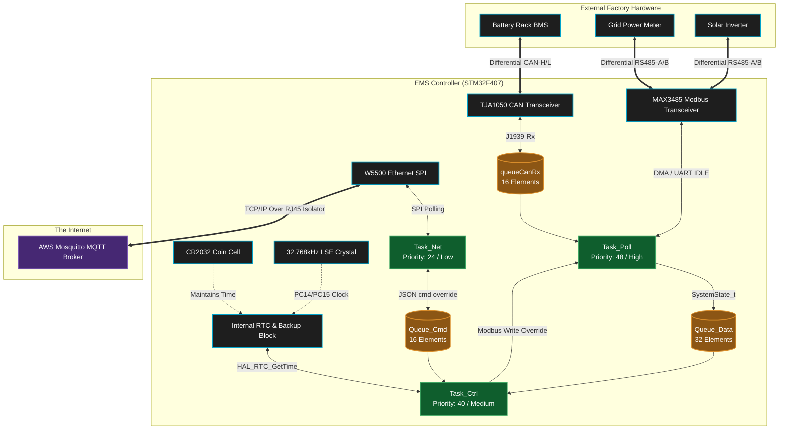

### Physical Wiring: CAN Bus & RS-485 Connections

A common interview question is: *"How many wires does CAN bus actually need? What about RS-485?"* Here is the exact physical wiring used in our project:

#### CAN Bus Wiring (To BMS Battery Rack)

CAN bus uses **2 signal wires + 1 ground** (3 wires total):

```
 STM32 Board                             Battery BMS Module
 ┌────────────────┐       Twisted-Pair    ┌──────────────────┐
 │                │       Cable           │                  │
 │  TJA1050       │                       │  CAN Transceiver │
 │  ┌──────────┐  │                       │  ┌──────────┐    │
 │  │  CAN-H ──┼──┼── Yellow Wire ────────┼──┤  CAN-H   │    │
 │  │  CAN-L ──┼──┼── Green Wire  ────────┼──┤  CAN-L   │    │
 │  │  GND   ──┼──┼── Black Wire  ────────┼──┤  GND     │    │
 │  └──────────┘  │                       │  └──────────┘    │
 │                │                       │                  │
 │  120Ω Resistor │                       │  120Ω Resistor   │
 │  (CAN-H↔CAN-L)│                       │  (CAN-H↔CAN-L)  │
 └────────────────┘                       └──────────────────┘
```

| Wire | Name | Voltage Range | Purpose |
| :--- | :--- | :--- | :--- |
| **Wire 1** | `CAN-H` (CAN High) | 2.5V – 3.5V | Dominant = 3.5V, Recessive = 2.5V |
| **Wire 2** | `CAN-L` (CAN Low) | 1.5V – 2.5V | Dominant = 1.5V, Recessive = 2.5V |
| **Wire 3** | `GND` (Signal Ground) | 0V | Common reference. Required to prevent ground-loop noise between boards |

> 💡 **Termination:** Both ends of the CAN bus **must** have a **120Ω resistor** soldered between CAN-H and CAN-L. Without these, signal reflections on the copper wire corrupt bits at 500 kbps. In our project, the STM32 PCB has one 120Ω, and the battery BMS has the other. You can verify correct termination by measuring resistance between CAN-H and CAN-L with a multimeter — it should read **60Ω** (two 120Ω in parallel).

#### RS-485 Wiring (To Grid Meter & Inverter)

RS-485 Modbus uses **2 signal wires + 1 ground** (3 wires total). It is **half-duplex** — only one device can talk at a time:

```
 STM32 Board                             Grid Meter / Inverter
 ┌────────────────┐       Twisted-Pair    ┌──────────────────┐
 │                │       Cable (up to    │                  │
 │  MAX3485       │       1200 meters!)   │  RS-485 Port     │
 │  ┌──────────┐  │                       │  ┌──────────┐    │
 │  │   A    ──┼──┼── Blue Wire  ─────────┼──┤   A      │    │
 │  │   B    ──┼──┼── White Wire ─────────┼──┤   B      │    │
 │  │  GND   ──┼──┼── Black Wire ─────────┼──┤  GND     │    │
 │  └──────────┘  │                       │  └──────────┘    │
 │   DE Pin ← PD4 │                       │                  │
 │  (Direction     │                       │  120Ω Resistor   │
 │   Control)      │                       │  (A ↔ B)         │
 └────────────────┘                       └──────────────────┘
```

| Wire | Name | Voltage Range | Purpose |
| :--- | :--- | :--- | :--- |
| **Wire 1** | `A` (Non-inverting / D+) | -7V to +12V | Data+ line. Voltage difference (A-B) > +200mV = Logic `1` |
| **Wire 2** | `B` (Inverting / D-) | -7V to +12V | Data- line. Voltage difference (A-B) < -200mV = Logic `0` |
| **Wire 3** | `GND` (Signal Ground) | 0V | Common ground reference between distant devices |

> ⚠️ **Half-Duplex Direction Control:** The MAX3485's `DE` (Driver Enable) pin is wired to STM32 GPIO `PD4`. When `DE=HIGH`, the MAX3485 **transmits** (drives A/B lines). When `DE=LOW`, it **listens** (receives data from A/B). This pin must be toggled precisely between TX and RX — see Challenge 1 in Section 18 for how we solved the timing jitter bug.

#### Ethernet Wiring (To Cloud via RJ45)

Ethernet uses **4 signal wires (2 twisted pairs) + shield** inside a standard Cat5/Cat5e cable with an RJ45 connector:

| Pin | Wire Color (T568B) | Signal | Purpose |
| :--- | :--- | :--- | :--- |
| Pin 1 | Orange/White | `TX+` | Transmit positive |
| Pin 2 | Orange | `TX-` | Transmit negative |
| Pin 3 | Green/White | `RX+` | Receive positive |
| Pin 6 | Green | `RX-` | Receive negative |
| Pins 4,5,7,8 | — | Unused | (Used in Gigabit; unused in 100BASE-TX) |

> 💡 **Galvanic Isolation:** The RJ45 jack on our PCB has built-in **magnetics transformers** that electrically isolate the STM32 board from the Ethernet cable. This prevents ground loops and voltage spikes from traveling through the cable and damaging the MCU — critical in industrial environments where motors and inverters generate massive EMI.

#### Quick Summary

| Bus | Total Wires | Signal Wires | Duplex | Max Distance | Speed |
| :--- | :--- | :--- | :--- | :--- | :--- |
| **CAN** | 3 (CAN-H, CAN-L, GND) | 2 differential | Full (simultaneous TX/RX via arbitration) | 40m @ 1Mbps, 1000m @ 50kbps | 500 kbps |
| **RS-485** | 3 (A, B, GND) | 2 differential | Half (TX or RX, not both) | **1200 meters** | 9600 baud |
| **Ethernet** | 4 signal + shield | 2 twisted pairs | Full | 100 meters | 100 Mbps |

### Board GPIO: LEDs, Reset, Diagnostic & Control Pins

Beyond communication buses, the PCB uses several GPIO pins for visual feedback, hardware resets, and user interaction. On the STM32F407G-DISC1 development board, the four onboard LEDs (PD12–PD15) are used directly. On the production PCB, these are routed to panel-mount LEDs visible through the enclosure.

#### LED Indicators

| GPIO Pin | LED Color | Direction | Firmware Usage |
| :--- | :--- | :--- | :--- |
| `PD12` | 🟢 Green | Output (Push-Pull) | **System Alive** — Toggled every 300ms inside `Task_Poll`'s main loop. If this LED stops blinking, the RTOS has crashed or the IWDG has frozen. |
| `PD13` | 🟠 Orange | Output (Push-Pull) | **Network Activity** — Lit solid when `Task_Net` has an active MQTT connection to AWS. Blinks rapidly during MQTT publish. OFF = no cloud link. |
| `PD14` | 🔴 Red | Output (Push-Pull) | **Fault / Error** — Lit when an unrecoverable error occurs (e.g., CAN bus off, Modbus slave not responding for >10 cycles, Flash signature verification fail). Also lit during OTA update in progress. |
| `PD15` | 🔵 Blue | Output (Push-Pull) | **Boot Phase Indicator** — Briefly lit during `SystemInit()` to confirm MCUboot handoff succeeded. Also used for boot timing measurement with logic analyzer. |

#### Reset & Control Pins

| GPIO Pin | Name | Direction | Purpose |
| :--- | :--- | :--- | :--- |
| `NRST` | **Hardware Reset** (active-LOW) | Input | Physical reset pin on the STM32. Directly connected to a tactile push-button on the PCB and to the ST-LINK debug probe. Pulling this LOW forces an immediate silicon reset — equivalent to a full power cycle. The IWDG watchdog internally triggers this pin when it expires. |
| `PB0` | **W5500 Hardware Reset** | Output (Push-Pull) | Connected to the W5500 Ethernet chip's `RST` pin. `Task_Net` pulses this LOW for 2ms to force a full hardware reset of the Ethernet chip when a ghost TCP connection is detected (see Challenge 4 in Section 18). |
| `PD4` | **RS-485 DE (Direction Enable)** | Output (Push-Pull) | Controls the MAX3485 half-duplex direction. `HIGH` = transmit, `LOW` = receive. Toggled by the hardware `HAL_UART_TxCpltCallback()` ISR to avoid timing jitter (see Challenge 1 in Section 18). |
| `PA0` | **User Button (B1)** | Input (Pull-Down) | On the DISC1 dev board, this is the blue user push-button. In firmware, pressing this during boot forces MCUboot to roll back to the previous firmware bank (recovery mode). In production, this is wired to an external momentary switch accessible through the enclosure. |
| `BOOT0` | **Boot Mode Select** | Input (Pull-Down via 10kΩ) | Normally held LOW (run from Flash). If held HIGH during reset, the STM32 boots from its internal System ROM bootloader (for DFU/USB recovery). In production, this pin is permanently tied to GND via a PCB resistor. |

#### SWD Debug Interface (Programming Header)

| Pin | Name | Direction | Purpose |
| :--- | :--- | :--- | :--- |
| `PA13` | `SWDIO` | Bidirectional | Serial Wire Debug data. Used for GDB hardware breakpoints and live memory inspection via ST-LINK. |
| `PA14` | `SWCLK` | Input (from ST-LINK) | Serial Wire Debug clock @ 4 MHz. |
| `PB3` | `SWO` | Output | Serial Wire Output — used by SEGGER SystemView for non-intrusive RTOS trace. Runs at full SWD clock speed. |
| `NRST` | `NRST` | Bidirectional | ST-LINK can assert this to halt/reset the MCU remotely during debug sessions. |

> ⚠️ **Production Lockdown (RDP Level 2):** After factory programming, the `RDP` option bytes are permanently set to Level 2. This **physically and irreversibly disables** the SWD debug port (PA13/PA14). Once set, no debugger, no programmer, and no attack can ever read the Flash contents. The LEDs and UART become the only diagnostic interfaces.

---

## 18. Major Challenges & Solutions

While building this architecture, the team faced extreme bare-metal engineering hurdles:

*   **Challenge 1: The Modbus RTU Half-Duplex Timing Jitter**
    *   **The Issue:** Modbus is an industrial protocol running on a physical RS-485 copper wire, which is *half-duplex*. The STM32's transceiver chip must be manually switched from "Transmit" mode into "Receive" mode using a physical `DE` (Data Enable) pin. The Modbus specification dictates a strict 3.5 character idle time between frames. If we toggled this pin in standard C code `HAL_UART_Transmit(); HAL_GPIO_WritePin(DE, LOW);`, the FreeRTOS scheduler would sometimes context-switch exactly between those two lines of code to service the network task. By the time the CPU returned to toggle the pin 2 milliseconds later, the slave inverter had already replied, the transceiver was stuck in "Transmit" mode, and the incoming bytes crashed into the chip and were lost forever.
    *   **The Solution:** We entirely abandoned software-based pin toggling. We bound the `DE` pin toggle directly to the bare-metal silicon interrupt `HAL_UART_TxCpltCallback()` (DMA Transmit Complete). This hardware interrupt forcibly preempts the FreeRTOS scheduler. The exact nanosecond the final bit leaves the silicon register, the hardware interrupts the CPU, throws the `DE` pin LOW, and instantly returns, eliminating 100% of the software jitter and achieving perfectly deterministic Modbus timing.

*   **Challenge 2: CAN Bus Mailbox Overflows (Hardware Starvation)**
    *   **The Issue:** The EMS connects to commercial battery racks via a 250kbps CAN bus using the J1939 protocol. These batteries are extremely "chatty", sometimes blasting 10 frames in under 5 milliseconds. The physical STM32F407 silicon only contains **three physical receive mailboxes**. If the CPU was busy calculating peak-shaving math inside `Task_Ctrl` for a few milliseconds, the 4th incoming CAN frame would physically overflow the silicon mailbox, permanently destroying critical battery voltage telemetry.
    *   **The Solution:** We implemented **ISR Hardware Offloading**. We bound a minimalist, ultra-fast Interrupt Service Routine (`HAL_CAN_RxFifo0MsgPendingCallback`) directly to the hardware. Taking less than 1 microsecond to execute, this ISR rips the data out of the tiny silicon mailboxes the moment they arrive and pushes them into an expansive 16-element FreeRTOS RAM Queue (`queueCanRxHandle`). This creates a massive software memory "shock absorber," allowing the slower `Task_Poll` loop to lazily drain the queue without ever dropping a physical packet.

*   **Challenge 3: ARM Instruction Bus Lockouts (OTA Hard-Faults)**
    *   **The Issue:** When executing an Over-The-Air (OTA) firmware update, `Task_Net` must command the STM32 to erase a 64KB sector of its internal Flash memory (Bank 2). Flash erasure operations physically lock the ARM Cortex Instruction/Data bus for upwards of **20 to 50 milliseconds**. If the FreeRTOS `SysTick` timer expired during this lockout, or a Modbus interrupt fired, the CPU would attempt to fetch the next instruction from memory to perform the context switch. Because the bus was electrically locked by the Flash controller, the fetch would fail, and the CPU would violently crash into a `HardFault_Handler`.
    *   **The Solution:** We ruthlessly enforced the **`vTaskSuspendAll()`** API. The exact instruction before sending the `HAL_FLASHEx_Erase()` command, `Task_Net` calls `vTaskSuspendAll()`. This actively disables the entire FreeRTOS scheduler, preventing any context switches or timer firings from occurring while the ARM data bus is locked. Once the physical erase is complete, we call `xTaskResumeAll()`, safely returning the system to multitasking.

*   **Challenge 4: W5500 SPI Socket Deadlocks & Ghost Connections**
    *   **The Issue:** Industrial networks are notoriously noisy. When connecting to Mosquitto MQTT over the WIZnet W5500, a Wi-Fi bridge or Ethernet switch reboot would sever the physical TCP link. However, because TCP/IP handles timeouts poorly, the STM32's `Task_Net` would often think the socket was still `ESTABLISHED` (a "ghost connection"), while the Cloud server had long ago dropped the client. The RTOS would hang indefinitely waiting for MQTT `PUBACK` packets that would never arrive.
    *   **The Solution:** We implemented an **Application-Layer Keep-Alive / MQTT PINGREQ Monitor**. Using a non-blocking timestamp method `(osKernelGetTickCount() - last_mqtt_rx > 15000)`, `Task_Net` monitors if it has received any data (including heartbeat pings) from the broker in the last 15 seconds. If the timer trips, the software strictly assumes the silent connection is dead, aggressively sends a hardware reset pulse to the W5500 `RST` pin, flushes the SPI registers, and attempts a clean socket re-initialization sequence from scratch.

*   **Challenge 5: Silent RAM Corruptions (Stack Overflows)**
    *   **The Issue:** During early development, building complex JSON telemetry strings inside `Task_Net` using `snprintf()` would occasionally cause the entire board to freeze an hour later, seemingly randomly. The `Task_Net` variables were secretly growing larger than the 1024-byte RAM stack allocated to the thread, physically writing over the memory belonging to `Task_Poll`.
    *   **The Solution:** We permanently enabled FreeRTOS's Stack Watermark monitoring feature (`configCHECK_FOR_STACK_OVERFLOW = 2`). This forces the kernel to paint the end of every task's RAM stack with a known byte pattern (e.g., `0xA5`). Whenever the kernel performs a context switch, it actively checks if that memory pattern was altered. If `Task_Net` oversteps its bounds by even 1 byte, the kernel instantly traps the CPU inside a `vApplicationStackOverflowHook()` function, definitively proving exactly which task caused the memory corruption and preventing unpredictable physical hardware behavior.

---

## 19. Efficiency, Optimizations & Memory Footprint

### What specific optimizations did we apply?
In order to maximize silicon performance and hit our hard-realtime nanosecond budgets, we applied several drastic optimizations:

1. **Hardware Offloading:** As detailed previously, we ruthlessly offloaded the entire TCP/IP networking stack to the W5500 silicon wrapper and the UART Modbus byte-parsing to the internal DMA silicon streams. This effectively yields 0% CPU consumption for mass data transport.
2. **Compiler Optimizations (`-O2`):** In `CMakeLists.txt` / Makefile settings, we explicitly passed `-O2` to the GCC compiler. This aggressively unrolls `for()` loops and optimizes math pipelines at the expense of slightly larger binary sizes (which we easily afforded with our 384KB Flash partition).
3. **FPU Native Math Activation:** By explicitly asserting `#define __FPU_PRESENT 1`, the Cortex-M4 computes peak-shaving Float matrices natively in hardware transistors in a single clock cycle, completely bypassing thousands of cycles of software library emulation.
4. **CCM RAM Acceleration (Core Coupled Memory):** The STM32F407 contains 64KB of ultra-fast CCM RAM directly tied to the CPU data bus (bypassing the main system matrix). We specifically altered the linker script and FreeRTOS settings to dump the most demanding `Task_Ctrl` stack computations into `.ccmram` for absolute maximum algorithmic execution speed.

### How Efficient is the Design?
The design is **extremely efficient**. Because the CPU uses **Deferred Processing**, it spends roughly **95% of its life asleep** in the Idle Task. 
*   Physical electrical data is piped natively across the silicon bus via **DMA** (Direct Memory Access).
*   The actual `Peak_Shaving` mathematical loop executes inside `Task_Ctrl` in under **10 microseconds** due to the 168 MHz floating-point-enabled Cortex-M4 core. 
*   Latency from a Grid Meter spike to a Battery Discharging command is practically bounded only by the physical baud rates of the UART lines.

### Memory Snapshot (STM32F407)
We selected this specific microcontroller because it provides massive headroom for future features.

*   **Flash Memory (1 MB Total):**
    *   The `RTOS + FreeRTOS Kernel + HAL Drivers` consumes roughly **~64 KB**. 
    *   This leaves over 900 KB of empty space, perfectly enabling the dual-bank OTA feature (Bank 1 holding the active 64 KB app, Bank 2 holding the incoming 64 KB download slot).
*   **RAM (192 KB Total):**
    *   **RTOS Overhead:** Stacks, Queues, and Task Control Blocks (TCBs) are statically mapped and consume around **~15 KB**.
    *   **Networking Buffers:** Because the W5500 offloads the TCP/IP stack physically, the STM32's RAM is incredibly empty. If we ran LwIP internally, it would consume >60 KB.
    *   **Result:** We have over 170 KB of free RAM, allowing for future expansion into complex IoT cryptographic buffering (TLS 1.2/1.3).

### Memory Protection Strategies
1.  **Preventing Stack Overflows:** If `snprintf()` inside `Task_Net` loops too far, it will crash into another Task's memory space. We enabled `vApplicationStackOverflowHook()`. If FreeRTOS detects a watermark breach, it instantly traps the CPU so we can trace the violation, rather than silently corrupting variables.
2.  **Preventing Heap Fragmentation (Zero `malloc` Policy):** A system running for 10 years will crash if it constantly dynamically allocates and frees memory inside a `while` loop (Heap Fragmentation). To combat this, **we banned `malloc()` at runtime.** All FreeRTOS Queues and Semaphores are allocated statically at Boot (`osMessageQueueNew`), guaranteeing the memory map never shifts during factory operation.

---

## 20. System Reliability & Product Safety

In a true industrial automation environment, code perfection is an extreme baseline, but hardware exceptions (brownouts, cosmic rays, transient noise) are inevitable. We deployed specific silicon-level protections.

### Product Safety & Failsafe Execution Bounds
Beyond basic electrical protections, firmware safety is guaranteed by rigid bounds checking. Before `Task_Ctrl` applies any dynamic command received from the Cloud (like "Set Grid Charger to 100,000 Watts"), it intercepts the payload and mathematically clamps it against hard-coded physical limits (`MIN_INVERTER_WATTAGE`, `MAX_BATTERY_CHARGE_RATE`). This ensures that even if a Cloud dashboard is hacked, the hardware is mathematically incapable of pushing enough voltage to melt copper wiring.

### Advanced Interrupt Handling Priorities (NVIC)
The Cortex-M4 features a Nested Vectored Interrupt Controller (NVIC). We strategically assigned Preemption Priorities so that critical tasks always stop non-critical tasks natively in silicon:
*   **Highest Priority (Priority 0-1):** The `SysTick` Timer (which runs the RTOS kernel) and the `CAN_RX_FIFO0` interrupt. If a J1939 battery packet arrives, the CPU must fetch it natively within nanoseconds before the mailbox overflows.
*   **Medium Priority (Priority 5-6):** The Modbus `UART DMA` and `IDLE` interrupts. These are critical for RS-485 timing but are legally allowed to be preempted for a few microseconds if a CAN packet suddenly hits the silicon simultaneously.

### The Watchdog & Failsafe Logic
1.  **Independent Watchdog (IWDG):** We leverage the STM32's `IWDG`, which runs on its own physically separate 32kHz LSI (Low-Speed Internal) clock.
    *   **The Logic:** `Task_Poll` contains an `HAL_IWDG_Refresh()` command. If `Task_Poll` ever hangs (e.g., waiting forever on a dead RTOS queue, or trapped in an infinite loop), it stops refreshing the dog. Within 2 seconds, the independent hardware timer expires, yanks the physical reset pin of the ARM core, and cleanly re-initializes the entire board.
2.  **Brown-Out Reset (BOR):** If the factory 24V DC power supply dips unexpectedly, running code on low voltage can scramble Flash memory writes. We set the silicon BOR Level to 3 (2.7V). If the internal voltage sags below this threshold, the hardware instantly holds the CPU in reset until power stabilizes, preventing data corruption.

### Power Saving & Efficiency (WFI & Tickless Idle)
Since this is an always-on edge node, energy management is a background concern. The design is optimized for power savings:
1.  **Wait For Interrupt (WFI):** When `Task_Ctrl` is blocked waiting on `Queue_Data`, and `Task_Net` is asleep for 5 seconds, the FreeRTOS Scheduler enters the `Idle Task`. In our project, the Idle Task executes the native ARM `WFI` (Wait For Interrupt) assembly sequence. This physically halts the core clock tree to the ALU (Arithmetic Logic Unit). The CPU draws single-digit milliamps while sleeping, waiting for a DMA or CAN interrupt to bring the clock back to life.
2.  **FreeRTOS Tickless Idle (Optional Enhancement):** If required for extremely low battery-powered edge nodes, we can configure FreeRTOS to turn off its own 1ms `SysTick` timer when it calculates no tasks will need to wake up for a known duration (e.g. 300ms). This puts the STM32 into severe deep sleep (STOP mode). Since this platform is permanently externally powered by an inverter, we opted to keep the standard SysTick running for simplicity and faster interrupt response times.

---

## 21. Interview Practice Question Bank

> 💡 **How to use this section:** Each question below is fully answered somewhere in this guide. Use this as a self-test before interviews. Try to answer each one from memory, then cross-reference the relevant section.

---

### 🧵 FreeRTOS Architecture & Task Design

1. Why did you choose FreeRTOS instead of a standard `while(1)` super-loop?
2. How many tasks does this system have, and what is each one responsible for?
3. What are the exact priority values assigned to each task and why were those specific values chosen?
4. Why are task priorities given gaps (e.g. 24, 40, 48) instead of sequential values (1, 2, 3)?
5. What does it mean for a task to be in the "Blocked" state? How much CPU does it consume?
6. What is a context switch and when does the FreeRTOS scheduler trigger one?
7. What is the difference between preemptive and cooperative scheduling? Which one do you use?
8. What happens if `Task_Net` hangs indefinitely — does it affect the safety-critical polling?
9. How did you prevent `Task_Net` network slowdowns from starving the `Task_Poll` hardware loop?
10. Why is `Task_Poll` given `osPriorityRealtime` specifically, and not just `osPriorityHigh`?

---

### 📬 Inter-Task Communication (IPC) & Queues

11. Why do you never use global variables to share data between tasks?
12. What is a FreeRTOS Message Queue and how does it guarantee thread safety?
13. How many queues does this architecture use and what is each one for?
14. What is `Queue_Data` and who is the producer vs. the consumer?
15. How does `osWaitForever` work in `osMessageQueueGet` — what happens to the CPU while it waits?
16. What does "16 Elements" mean in terms of actual RAM consumed by a FreeRTOS queue?
17. What happens when `osMessageQueuePut()` is called on a full queue with a timeout of `0`?
18. What happens when `osMessageQueuePut()` is called on a full queue with `osWaitForever`?
19. Why did you design `Queue_Data` with 32 elements instead of just 1?
20. How does `Task_Net` push a command down to `Task_Ctrl`? Walk through the data path.

---

### 🔌 Interrupt Service Routines & DMA

21. What is the golden rule of RTOS ISR design, and why?
22. Why do you use DMA for Modbus UART instead of standard `RXNE` byte-by-byte interrupts?
23. What is UART IDLE Line Detection and why is it better than fixed-length DMA for Modbus?
24. Explain the exact sequence: from `Task_Poll` firing a DMA request to receiving the parsed data.
25. What is the RS-485 `DE` (Data Enable) pin and why does toggling it in software cause timing jitter?
26. How did you solve the `DE` pin jitter problem? What hardware callback did you use?
27. Why can't you use DMA for CAN bus on the STM32F407?
28. The STM32F407 only has 3 CAN receive mailboxes. What happens when they overflow?
29. How does the `HAL_CAN_RxFifo0MsgPendingCallback()` ISR protect against mailbox overflow?
30. How does a Binary Semaphore work to synchronize an ISR with a FreeRTOS task?

---

### 🌐 Network Stack (WIZnet W5500)

31. What is hardware TCP/IP offloading and why did you choose the W5500?
32. What would be the cost of running LwIP on the STM32 instead of using the W5500?
33. Who manages the IP address — the W5500 chip or the STM32?
34. Describe the DHCP process: who sends the DISCOVER, who parses the OFFER, where does the IP get written?
35. Does the W5500 support IPv6? What would you need to do if IPv6 was required?
36. Is the W5500 TCP connection stateful or stateless? What does the W5500 handle autonomously?
37. How many hardware sockets does the W5500 have, and how many do you use in this project?
38. What are the two sockets used for and why are they kept separate?
39. What happens to the MQTT stream if the Ethernet RJ45 cable is physically unplugged at runtime?
40. Does the system need a reboot to reconnect after the cable is plugged back in?
41. What register do you poll to detect if the physical Ethernet link is up or down?
42. What is a "ghost" TCP connection and how do you detect and recover from one?
43. Explain the MQTT Keep-Alive / PINGREQ monitoring logic you implemented.
44. Why does `Task_Net` use QoS 0 for telemetry publishing but QoS 1 for command subscribing?

---

### 🔐 OTA Updates, Flash Partitioning & Secure Boot

45. How did you partition the 1MB Flash of the STM32F407 and what is each region used for?
46. How did you decide the exact size of each Flash partition?
47. Why is Bank 2 the same size as Bank 1?
48. What is the Scratch / Swap sector used for and why is it needed?
49. How does the OTA firmware download actually work physically — from the cloud to the Flash transistors?
50. Why don't you download the entire binary into RAM first before flashing it?
51. How do you guarantee the incoming binary fits into the Flash without overwriting the running app?
52. What is a "Magic Trailer" and why does MCUboot need it?
53. Explain the "Swap using Scratch" mechanism MCUboot uses to rotate partitions.
54. What happens if the Ethernet cable is lost in the middle of a firmware download?
55. What happens if the power fails exactly while MCUboot is swapping partitions?
56. What is the "Image Confirmation" mechanism and what problem does it solve?
57. What happens if the new firmware boots but has a fatal bug and crashes before confirming?
58. What is Secure Boot and why is it strictly required in an industrial EMS?
59. What is ECDSA P-256 and what is it used for during OTA?
60. What is `imgtool` and when is it executed in the CI/CD pipeline?
61. What happens to the system if MCUboot detects a bad ECDSA signature on Bank 2?
62. Why does `Task_Net` call `vTaskSuspendAll()` before erasing Flash?
63. Why does erasing internal Flash cause potential Hard Faults if the scheduler is running?
64. What is `NVIC_SystemReset()` and when is it called during OTA?

---

### 🧠 Linker Script, Boot Flow & Kernel Startup

65. What does the Linker Script (`STM32F407VGTX_FLASH.ld`) do and why did you need to modify it?
66. What was the original Flash origin address? What did you change it to and why?
67. What is the Vector Table Offset Register (VTOR) and why did you need to shift it?
68. What happens if VTOR is not shifted after MCUboot hands over control?
69. Walk through the complete boot sequence from power-on to `Task_Poll` executing its first Modbus read.
70. What is `SystemClock_Config()` and what does it do to the clock tree?
71. How does the CPU achieve 168 MHz and what is the role of the PLL and HSE crystal?
72. What is the `.data` section and what does the C runtime `_start()` routine do with it?
73. What is CCM RAM and why did you place `Task_Ctrl`'s stack there specifically?

---

### ⚙️ Memory Management & Optimizations

74. What is the "Zero `malloc` Policy" and why is it enforced in this project?
75. What is heap fragmentation and why is it dangerous for a system expected to run for 10 years?
76. How much RAM does the RTOS overhead consume in this design?
77. How much Flash does the current application consume vs. the available allocation?
78. What is Stack Overflow in an RTOS context and how does FreeRTOS detect it?
79. What is `configCHECK_FOR_STACK_OVERFLOW = 2` and how does the watermark pattern work?
80. What is `vApplicationStackOverflowHook()` and what should it do when triggered?
81. What GCC compiler flag do you use for optimization and what does `-O2` specifically do?
82. What is the Cortex-M4 FPU and how does it accelerate the Peak-Shaving algorithm?
83. What is `WFI` (Wait For Interrupt) and when does the CPU automatically execute it?

---

### 🔧 Toolchain, Testing & Debugging

84. Why did you choose STM32CubeIDE over Keil µVision?
85. What is the GCC ARM Embedded toolchain and what are its 4 compilation phases?
86. What is the role of `arm-none-eabi-ld` specifically vs. the other toolchain stages?
87. What is ST-LINK V2 and how do you use SWD for hardware breakpoints?
88. What is a Logic Analyzer and how did you use it to debug the `DE` pin jitter problem?
89. What is SEGGER SystemView and what can it prove about task scheduling?
90. How do you unit-test Peak-Shaving logic that depends on hardware sensor data?
91. What is "Off-Target Testing" and how does mocking work for RTOS-based embedded code?
92. What is `Cppcheck` and what does Static Analysis check for in this project?
93. What is MISRA-C compliance and why is `malloc()` a violation in safety-critical code?
94. What is Hardware-In-The-Loop (HIL) testing and how did you implement it for this project?

---

### 🏗️ System Design & Architecture Decisions

95. Why was the STM32 RTOS chosen over Embedded Linux (i.MX93) for this controller?
96. What is the BOM cost difference between an STM32-based EMS and a Linux SoM-based one?
97. Why was the STM32F407 selected over cheaper alternatives like the STM32F103?
98. What is Priority Inversion and how did you avoid it without using priority inheritance?
99. Why are Mutexes banned entirely from this RTOS design?
100. Why are Software Timers (`osTimerNew`) not used in this project?
101. Why is `Task_Net` always given the lowest priority in the 3-task hierarchy?
102. What product safety measures prevent a hacked cloud dashboard from damaging physical hardware?
103. What is the Independent Watchdog (IWDG) and which task is responsible for refreshing it?
104. What is Brown-Out Reset (BOR) and what voltage threshold triggers it?
105. How does the system behave if `Task_Poll` hangs indefinitely?

---

> 🎯 **Interview Tip:** The most commonly probed areas for Senior Firmware / Embedded Systems roles are:
> Priority Inversion, DMA vs Interrupt tradeoffs, Queue overflow behaviour, OTA partition swap safety, VTOR shifting, and the `vTaskSuspendAll()` Flash erase race condition.

---
<div align="center">
<i>Designed and Engineered by the EMS Firmware Team. Strictly Confidential.</i>
</div>

---

## 22. Answer Reference Sheet

> 📖 **Usage:** This section contains concise model answers for every question in Section 21. Use it to verify your self-test answers after practicing. Answers are intentionally kept brief — the full technical depth is explained in the relevant numbered section of this guide.

---

### 🧵 FreeRTOS Architecture & Task Design

**A1.** A super-loop couples all polling to a single sequential loop. If any task (e.g., JSON formatting) takes 100ms, the Modbus poll is delayed by 100ms, causing industrial timing violations. FreeRTOS provides preemptive prioritization: hardware polling tasks run at the exact moment their timer fires, regardless of what lower-priority tasks are doing.

**A2.** Three tasks: `Task_Poll` (hardware interfacing — Modbus RS-485, CAN bus), `Task_Ctrl` (EMS decision brain — peak-shaving, inverter commands), `Task_Net` (cloud communication — MQTT publish/subscribe, OTA).

**A3.** `Task_Poll` = `osPriorityRealtime` (48), `Task_Ctrl` = `osPriorityHigh` (40), `Task_Net` = `osPriorityNormal` (24). Polling has highest priority to prevent hardware timing jitter; cloud networking has lowest as its delays are non-safety-critical.

**A4.** Gaps allow future task insertion without renaming the entire priority map. Adding a new task between `Task_Ctrl` (40) and `Task_Poll` (48) at priority 44 requires zero changes to existing task configurations. Sequential values (1, 2, 3) have no room to insert.

**A5.** A Blocked task is waiting for an event (a semaphore, queue message, or timer). It consumes **0% CPU** — the FreeRTOS scheduler skips it entirely and runs the next eligible task or enters the Idle Task.

**A6.** A context switch is when the FreeRTOS kernel pauses the currently running task, saves its CPU registers (PC, SP, general-purpose registers) to its stack, and loads the saved registers of the next highest-priority ready task. It is triggered by: a higher-priority task becoming ready, `osDelay()` yielding, or a queue/semaphore event.

**A7.** Preemptive: the kernel can forcefully stop a running task mid-instruction if a higher-priority task becomes ready. Cooperative: tasks run until they voluntarily yield. We use **preemptive** scheduling to guarantee hardware timing determinism.

**A8.** No. `Task_Net` is at the lowest priority (`osPriorityNormal`). A hang there only stalls cloud publishing. The SysTick fires every 1ms. When `Task_Poll`'s 300ms timer expires, the scheduler forcefully preempts the hung network task and executes the polling loop without interruption.

**A9.** By assigning strict, separated priorities. `Task_Poll` at `osPriorityRealtime` will always preempt `Task_Net` regardless of what the network stack is doing. The RTOS scheduler enforces this mathematically on every SysTick tick.

**A10.** `osPriorityHigh` is the absolute CMSIS value 40. `osPriorityRealtime` is 48 — numerically higher, so it wins every preemption contest. Using `osPriorityHigh` for Task_Poll would make it equal to Task_Ctrl, creating an ambiguous tie resolved by insertion order rather than design intent.

---

### 📬 Inter-Task Communication (IPC) & Queues

**A11.** Global variables are not thread-safe. If `Task_Poll` writes a struct to a global while `Task_Ctrl` is mid-read, `Task_Ctrl` can read a half-updated value (a torn read / race condition). Queues perform a safe atomic `memcpy` with built-in block/unblock logic.

**A12.** A FreeRTOS Message Queue is a kernel-managed FIFO ring buffer. Write and read operations are performed inside kernel critical sections, meaning no two tasks can simultaneously corrupt the buffer. It also implements the blocking/unblocking mechanism so readers sleep until data exists.

**A13.** Three queues: `Queue_Data` (hardware telemetry from `Task_Poll` → `Task_Ctrl`), `Queue_Cmd` (cloud commands from `Task_Net` → `Task_Ctrl`), `queueCanRxHandle` (CAN bus frames from the hardware ISR → `Task_Poll`).

**A14.** `Queue_Data` carries the `SystemState_t` struct (Grid Watts, Battery SOC, charge/discharge limits). Producer: `Task_Poll` (writes it after a Modbus read). Consumer: `Task_Ctrl` (reads it to run the peak-shaving algorithm).

**A15.** `osWaitForever` causes the calling task to be immediately moved to the Blocked state. The CPU is given to another task. The kernel monitors the queue; the moment a producer calls `osMessageQueuePut()`, the kernel increments the queue count, sees a blocked reader waiting, and moves it to Ready instantly. CPU consumed while waiting: **0%**.

**A16.** ``16 Elements × sizeof(CanFrame_t)``. `CanFrame_t` is approximately 14–16 bytes (4-byte ID + 8-byte payload + DLC + flag). So 16 elements ≈ **~256 bytes of RAM**, not kilobytes.

**A17.** With timeout `0`: `osMessageQueuePut()` returns immediately with `osErrorResource`. The data is **dropped**. The OS continues running safely. This is the correct behaviour for ISRs that must never block.

**A18.** With `osWaitForever`: the writing task is placed in the **Blocked** state until another task reads from the queue, making room. This risks causing an unintentional task stall and is therefore avoided on write paths in this design.

**A19.** It acts as a "shock absorber." If `Task_Ctrl` is busy doing heavy peak-shaving math for several polling cycles, `Task_Poll` can queue up to 32 readings before data is dropped. A depth of 1 would mean every Poll cycle must complete before the next — removing all decoupling.

**A20.** Cloud MQTT packet arrives → W5500 receives it → `Task_Net` reads it via SPI → parses JSON into `CloudCommand_t` struct → calls `osMessageQueuePut(queueCmdHandle, &clCmd, 0, 0)` → `Task_Ctrl` wakes from `osMessageQueueGet(queueCmdHandle, ...)` → applies the command override.

---

### 🔌 Interrupt Service Routines & DMA

**A21.** ISRs must be as short as possible: move data into an RTOS object (queue/semaphore), unblock a task, and exit immediately. All heavy computation must be deferred to the task level. Long ISRs block other interrupts from firing and introduce system-wide latency jitter.

**A22.** `RXNE` interrupts fire once per byte. A 256-byte Modbus frame would generate 256 individual ISR calls, thrashing the CPU. DMA autonomously transfers the entire frame into RAM, and the CPU is only interrupted **once** (via the IDLE Line event) when the full frame is complete.

**A23.** UART IDLE Line Detection fires a hardware interrupt when the RX line goes electrically silent for one full character frame after active data. This signals the slave finished transmitting. It is superior to fixed-length DMA because Modbus reply lengths are variable — a 3-byte error response and a 256-byte data response both trigger the same interrupt without guessing the size in advance.

**A24.** ① `Task_Poll` calls `HAL_UART_Transmit_DMA()` to blast the Modbus request. ② Calls `osSemaphoreAcquire(rxSem, 250ms)` — task sleeps. ③ DMA finishes transmission → `HAL_UART_TxCpltCallback()` ISR fires → pulls `DE` pin LOW (switch to receive). ④ Slave replies → UART IDLE fires → `HAL_UARTEx_RxEventCallback()` ISR calls `osSemaphoreRelease(rxSem)`. ⑤ `Task_Poll` wakes instantly and calls `parse_modbus_response()`.

**A25.** RS-485 is half-duplex — the transceiver chip can only transmit OR receive at one moment. The `DE` pin controls direction. Toggling it in software after `HAL_UART_Transmit()` risks the RTOS context-switching between those two lines. The transceiver stays in TX mode, misses the slave's reply completely.

**A26.** We bind the `DE` pin toggle to the hardware `HAL_UART_TxCpltCallback()` ISR. This fires at the silicon level the exact nanosecond the last bit leaves the register — completely decoupled from the RTOS scheduler. Zero jitter is possible.

**A27.** The STM32F407 uses a legacy `bxCAN` (Basic Extended CAN) peripheral. Unlike newer `FDCAN` peripherals (e.g., STM32G4), `bxCAN` does not generate DMA request signals. Each 8-byte frame must be fetched from the hardware mailbox register manually via an ISR.

**A28.** The STM32F407 has only 3 physical CAN receive mailboxes. If the BMS broadcasts a 4th frame before the CPU empties the first 3, the 4th frame is **permanently and silently dropped** by the hardware — critical battery voltage data is lost forever.

**A29.** The ISR copies the frame from the hardware mailbox into a 16-element FreeRTOS software queue (`queueCanRxHandle`) in under 1 microsecond. This empties the hardware mailbox before it overflows. The software queue acts as a shock absorber; `Task_Poll` drains it at its leisure without dropping frames.

**A30.** The semaphore starts empty (count = 0). Task calls `osSemaphoreAcquire()` — immediately blocks because count is 0. Hardware ISR fires, calls `osSemaphoreRelease()` — increments count to 1 and moves the blocked task to Ready. Scheduler picks it up at next opportunity. The task gets one guaranteed "token" per hardware event.

---

### 🌐 Network Stack (WIZnet W5500)

**A31.** Hardware TCP/IP offloading means the W5500 silicon physically manages Ethernet MAC, PHY, IP, TCP, and UDP layers autonomously. The STM32 CPU does not process a single TCP ACK or ARP packet — it simply reads/writes payload bytes over SPI, freeing the CPU entirely for EMS logic.

**A32.** LwIP on the STM32 consumes >60KB of RAM for TCP buffers, requires significant CPU time processing IP fragmentation, ARP tables, and sliding window management, and introduces non-deterministic latency. It would destroy the 0% CPU networking overhead goal.

**A33.** The **STM32** manages the IP address. The W5500's silicon only routes packets; it has no DHCP engine. The STM32 runs the WIZnet DHCP C library, which conducts the 4-step DORA handshake (Discover, Offer, Request, ACK) using the W5500's UDP hardware, then writes the obtained IP into the W5500's `SIPR` register.

**A34.** ① STM32 broadcasts UDP DISCOVER via W5500. ② Router sends a UDP OFFER with proposed IP. ③ STM32 sends UDP REQUEST confirming the IP. ④ Router sends ACK. ⑤ STM32 writes the final IP, Gateway, Subnet Mask directly into the W5500 `SIPR`, `GAR`, `SUBR` silicon registers.

**A35.** No, the W5500 does not support IPv6. Its silicon only processes 32-bit IPv4 headers. For IPv6 we would need to enable W5500's `MACRAW` mode (raw Ethernet frame bypass) and run LwIP with IPv6 stack on the STM32 CPU — forfeiting the entire hardware offload benefit.

**A36.** Completely **Stateful** at Layer 4 (Transport). The W5500 autonomously manages the 3-way TCP handshake, sequence numbers, acknowledgements, retransmission timers, and sliding window. The STM32 only sees "socket ESTABLISHED / here are payload bytes" — it never touches the TCP state machine internals.

**A37.** The W5500 has **8** hardware socket registers. We use **2**: Socket 0 for the permanent MQTT TCP connection, Socket 1 reserved for transient OTA firmware HTTP downloads.

**A38.** They are kept separate so an OTA firmware download (potentially minutes long) never closes or disturbs the live MQTT telemetry connection. Both TCP state machines run independently in hardware simultaneously.

**A39.** `Task_Net` detects `PHY_LINK_OFF` via `wizphy_getphylink()`. It calls `close(MQTT_SOCKET_NUM)` to cleanly reset the W5500 socket, then sleeps via `osDelay(1000)`. `Task_Poll` and `Task_Ctrl` continue peak-shaving and hardware polling entirely uninterrupted — they have no network dependency.

**A40.** **No reboot needed.** When the cable is re-plugged, the PHY link is restored. `Task_Net`'s next loop iteration detects `PHY_LINK_ON`, re-runs the DHCP client, re-opens TCP socket, reconnects to MQTT broker, and resumes publishing — all handled transparently in software.

**A41.** The W5500 `PHYCFGR` (PHY Configuration Register). We read it via the WIZnet ioLibrary function `wizphy_getphylink()`. A return of `PHY_LINK_ON` means copper link is up; `PHY_LINK_OFF` means cable is disconnected.

**A42.** A ghost connection is a TCP socket that the local device thinks is `ESTABLISHED` but the remote broker has silently dropped (e.g., after a network switch reboot). The broker stops sending PINGRESP packets. We detect it by monitoring the time since the last received MQTT packet: if >15 seconds pass with nothing received, we treat the socket as dead and force-reset the W5500.

**A43.** After every received MQTT packet, we record `last_mqtt_rx = osKernelGetTickCount()`. On each loop iteration, we evaluate `(osKernelGetTickCount() - last_mqtt_rx > 15000)`. If 15 seconds elapse silently, we pulse the W5500 RST pin LOW for 10ms, flush all socket registers, re-run DHCP, and re-establish the MQTT connection completely.

**A44.** Telemetry is published QoS 0 ("fire and forget") — a dropped 5-second snapshot is acceptable; trying to buffer and resend stale sensor data wastes RTOS memory. Commands use QoS 1 ("at least once") — a missed cloud command (e.g., grid limit change, OTA start) must be guaranteed to arrive exactly once or the system may behave incorrectly.

---

### 🔐 OTA Updates, Flash Partitioning & Secure Boot

**A45.** Four regions: ① Bootloader `0x08000000` (64KB, MCUboot + ECDSA libraries), ② Scratch `0x08020000` (128KB, swap buffer), ③ Bank 1 / Active App `0x08040000` (384KB, running FreeRTOS), ④ Bank 2 / Download Slot `0x080A0000` (384KB, incoming firmware).

**A46.** Sizes are based on compiled binary footprints: MCUboot builds to ~45KB so 64KB was allocated. The FreeRTOS app is ~70KB but 384KB was allocated for 10 years of growth. Banks 1 and 2 must be identical for clean migration. Scratch must be at least one sector for MCUboot's chunk algorithm.

**A47.** MCUboot's swap algorithm works by reading equal-sized chunks from both banks and rotating them. If Bank 2 were smaller than Bank 1, the algorithm would truncate the active application when copying it into Bank 2 during rollback — permanently corrupting it.

**A48.** The Scratch sector is MCUboot's temporary holding zone. During each 4KB chunk rotation, MCUboot writes the chunk from Bank 1 into Scratch first, then copies Bank 2 into Bank 1, then copies Scratch into Bank 2. This 3-step pattern makes the swap resumable after a power failure at any point.

**A49.** Cloud server transmits TCP packets → W5500 receives and buffers them → STM32 drives SPI bus → reads 1KB chunks from W5500 RX buffer → stores chunk in RAM `chunkBuffer` → calls `HAL_FLASH_Program()` to permanently burn the 1KB into Bank 2 Flash transistors → repeat until full file is written.

**A50.** The STM32 only has 128KB of RAM total. A firmware binary is up to 384KB — it physically cannot fit in RAM. The 1KB-chunk stream-and-burn approach bypasses this limit entirely: only 1KB of RAM is ever occupied at any moment.

**A51.** The Linker Script (`STM32F407VGTX_FLASH.ld`) hard-limits the application to 384KB. The CI/CD pipeline rejects any binary exceeding 384KB at compile time. Bank 2 is a physically separate 384KB block of silicon — the active Bank 1 silicon is never touched during the download.

**A52.** A 16-byte Magic Trailer is a fixed byte pattern written to the very end of Bank 2 by `Task_Net` after the full binary is downloaded. MCUboot reads this specific address on every boot. Its presence signals "a pending OTA image is ready for validation and swap." Without it, MCUboot ignores Bank 2 completely.

**A53.** ① MCUboot reads 4KB from Bank 1 → writes it to the Scratch sector. ② Reads 4KB from Bank 2 → overwrites that 4KB in Bank 1. ③ Reads from Scratch → writes to Bank 2. ④ Repeats this cycle chunk-by-chunk until all 384KB have been completely rotated between the banks.

**A54.** `Task_Net` detects the SPI/TCP connection drop during the download loop and aborts. The partial data sitting in Bank 2 has no Magic Trailer, so MCUboot will ignore it forever. Bank 1 (the live running app) was never touched. The board reboots normally.

**A55.** Because every swap step writes to the Scratch sector first, MCUboot records state flags indicating which chunks have been swapped. On the next reboot, MCUboot reads these flags, identifies exactly which chunk was in progress, and resumes the rotation from that point. The swap completes successfully.

**A56.** After booting the new firmware, the app must call `boot_set_confirmed()` to flag "this image is stable." If the new firmware crashes before calling it (e.g., Hard Fault, infinite loop), the Watchdog resets the board. MCUboot detects the unconfirmed flag and automatically reverts the swap, restoring the old firmware.

**A57.** The IWDG detects the CPU freeze and triggers a hardware reset. MCUboot boots, checks the image flags, finds the new image was never confirmed, and performs a reverse swap — pulling the previous stable firmware from the Scratch area back into Bank 1. The system recovers to the last known good state fully automatically.

**A58.** Secure Boot ensures only firmware cryptographically signed by the authorized factory team can execute. In an industrial EMS that controls physical power flow, a malicious or corrupted firmware could command inverters to push dangerous voltage levels, start fires, or damage grid infrastructure. A hash alone proves integrity—a signature proves authenticity.

**A59.** ECDSA P-256 is Elliptic Curve Digital Signature Algorithm using the NIST P-256 curve. During OTA: the CI/CD server uses an offline private key to sign the binary hash, appending the signature to the image. MCUboot uses its embedded public key to verify the signature on every boot. Without the private key, no signature can be forged.

**A60.** `imgtool` is a Python utility from the MCUboot project. It is executed in the CI/CD pipeline as the final post-build step: `imgtool sign --key ecdsa-p256.pem --version 1.0.0 app.bin app_signed.bin`. It appends the ECDSA signature and the MCUboot image header to the raw `.bin` file.

**A61.** MCUboot mathematically verifies the ECDSA signature of Bank 2. If the signature is invalid (tampered image, wrong private key, corrupted download), MCUboot **aborts the update entirely**, discards Bank 2, and boots the existing Bank 1 firmware. The malicious or corrupted code never executes.

**A62.** Erasing a Flash sector locks the ARM Cortex Instruction/Data bus for 10–50ms. If the FreeRTOS SysTick fires during this lockout, the scheduler attempts a context switch, which requires fetching the next instruction from memory. Because the bus is locked, the fetch fails and the CPU crashes into HardFault_Handler.

**A63.** `vTaskSuspendAll()` disables the FreeRTOS SysTick-driven scheduler. No task can be preempted. No context switch can occur. The bus is exclusively held by the Flash erase operation. After the erase completes and the bus is released, `xTaskResumeAll()` re-enables the scheduler.

**A64.** `NVIC_SystemReset()` writes to the ARM Cortex Application Interrupt and Reset Control Register, triggering a full hardware CPU reset via the System Control Block. It is called at the end of OTA download (after writing the Magic Trailer) to trigger a cold reboot so MCUboot runs first and validates/swaps the new firmware.

---

### 🧠 Linker Script, Boot Flow & Kernel Startup

**A65.** The Linker Script maps compiled `.o` object files to physical hardware memory addresses. Without modification, the linker places code at `0x08000000` — the start of Flash. We modified it to `0x08040000` so MCUboot occupies the first 256KB and the FreeRTOS application starts immediately after.

**A66.** Original: `ORIGIN = 0x08000000`. Modified: `ORIGIN = 0x08040000, LENGTH = 384K`. The shift reserves space for MCUboot (64KB) and the Scratch sector (128KB) at the start of Flash, placing the FreeRTOS app in Bank 1 as designed.

**A67.** The VTOR (Vector Table Offset Register) tells the Cortex-M4 where the interrupt vector table lives in memory. The vector table contains function pointers for every hardware interrupt (SysTick, UART, CAN, etc.). After MCUboot hands over control, the vector table is no longer at `0x08000000` — it lives at `0x08040000`.

**A68.** Any hardware interrupt (SysTick, UART IDLE, CAN RX) would cause the CPU to look up the handler pointer at the wrong address (`0x08000000`), which is MCUboot memory. The CPU would jump to a random MCUboot instruction, execute garbage, and immediately crash into HardFault_Handler.

**A69.** ① Power on → CPU fetches first instruction from `0x08000000` (MCUboot). ② MCUboot checks Flash OTA flags, runs ECDSA verification (~100ms). ③ Jumps to `0x08040000`. ④ `SystemInit()` fires: shifts VTOR to `0x08040000`, enables FPU. ⑤ `SystemClock_Config()` fires PLL → 168MHz. ⑥ `_start()` copies `.data` to RAM. ⑦ `main()` creates 3 tasks, 3 queues, 1 semaphore. ⑧ `osKernelStart()` — FreeRTOS scheduler takes over. ⑨ `Task_Poll` wakes at ~300ms, fires first Modbus DMA request.

**A70.** `SystemClock_Config()` configures the STM32 clock tree: enables the 8MHz external crystal (HSE), feeds it into the PLL, multiplies it to 168MHz, and sets the AHB, APB1 (max 42MHz), and APB2 (max 84MHz) bus dividers. All peripherals derive their clock from this configuration.

**A71.** The HSE 8MHz crystal provides a stable reference. The PLL multiplies it: `PLLM=8, PLLN=336, PLLP=2` → `(8/8)*336/2 = 168MHz`. Without a PLL, the internal 16MHz RC oscillator (HSI) could only run the core at 16MHz — 10.5× slower than our configured speed.

**A72.** The `.data` section contains all initialized global variables (e.g., `int x = 5;`). These values are baked into Flash at compile time (their initial values sit in ROM). At boot, `_start()` copies them from their Flash address into the correct RAM addresses before `main()` runs, ensuring initialized globals have their correct startup values.

**A73.** CCM (Core Coupled Memory) RAM is a 64KB SRAM bus directly connected to the Cortex-M4 data bus, bypassing the main AHB system matrix. Zero wait states vs. 1–2 wait states on normal SRAM. We placed `Task_Ctrl`'s stack there because it runs the floating-point peak-shaving algorithm — every instruction cycle saved translates directly to faster control loop response.

---

### ⚙️ Memory Management & Optimizations

**A74.** All FreeRTOS objects (queues, semaphores, task stacks) are allocated once during boot using `osMessageQueueNew()`, `osSemaphoreNew()`, and `osThreadNew()`. After `osKernelStart()`, `malloc()` is never called again. This is enforced via `heap_4.c` usage and `configASSERT(pointer != NULL)` on every allocation.

**A75.** Repeated `malloc()`/`free()` cycles fragment the heap over time — small allocations leave holes that are too small for future requests, causing eventual allocation failures. For a 10-year deployed industrial product, this would cause unpredictable crashes months into operation. Static allocation eliminates fragmentation entirely.

**A76.** Approximately **~15KB**: each of 3 task stacks (3 × 2KB), Task Control Blocks (3 × ~88 bytes), Queue storage buffers (Queue_Data: 32×~20 bytes, Queue_Cmd: 16×8 bytes, queueCanRx: 16×16 bytes), plus the FreeRTOS kernel internal structures.

**A77.** The FreeRTOS application + HAL drivers + FreeRTOS kernel compiles to approximately **~70KB**. The Bank 1 partition is 384KB. We are using less than 20% of the available Flash — leaving 314KB of headroom for future feature growth.

**A78.** Stack Overflow occurs when a task's local function call chain exceeds its allocated stack space, writing into adjacent RAM. In an RTOS, this silently corrupts another task's variables or stack, causing random, extremely hard to debug crashes. FreeRTOS detects it using a watermark pattern.

**A79.** Setting `configCHECK_FOR_STACK_OVERFLOW = 2` tells FreeRTOS to paint the last 20 bytes of every task's stack with the pattern `0xA5A5A5A5` at boot. On every context switch, the kernel checks whether those bytes are still intact. If any byte changed, the stack overflowed from that task into the guarded zone.

**A80.** `vApplicationStackOverflowHook(TaskHandle_t, char* pcTaskName)` is called by the kernel when it detects the watermark has been corrupted. In production, it should: log the offending task name, trigger a controlled hardware reset via `NVIC_SystemReset()`, and increment a persistent crash counter in non-volatile memory for field diagnostics.

**A81.** `-O2` tells GCC to apply aggressive optimizations without sacrificing strict correctness: loop unrolling (avoids branch overhead), instruction scheduling (reorders instructions to avoid pipeline stalls), constant folding (evaluates compile-time math at compile time), and dead code elimination. Binary size increases slightly but execution speed improves significantly.

**A82.** The Cortex-M4F contains a dedicated hardware Floating-Point Unit (FPU). With `__FPU_PRESENT = 1` and the `-mfpu=fpv4-sp-d16` GCC flag, float operations like `gridPowerW * 0.001f` execute in **1 clock cycle** natively. Without the FPU, the compiler generates 20–50 software library instructions emulating the same operation, consuming valuable real-time budget.

**A83.** `WFI` (Wait For Interrupt) is a native ARM Cortex assembly instruction that halts the ALU clock tree and most bus clocks until any hardware interrupt fires. FreeRTOS's Idle Task executes `WFI` automatically whenever no task is Ready. The CPU draws single-digit milliamps in this state vs. ~100mA when actively executing.

---

### 🔧 Toolchain, Testing & Debugging

**A84.** STM32CubeIDE is free (vs. Keil's thousands-of-dollars per license), cross-platform (Linux/Mac/Windows), uses open-source GCC (enabling headless CI/CD Docker builds), and integrates directly with STM32CubeMX for graphical peripheral configuration. Keil uses a proprietary compiler requiring Windows and physical USB license dongles.

**A85.** Four phases: ① **Preprocessor** — strips comments, expands `#define` macros, inlines `#include` headers. ② **Compiler** — translates C to ARM assembly (`.s`). ③ **Assembler** — converts assembly to machine code object files (`.o`). ④ **Linker** — maps all `.o` files + libraries to physical memory addresses per the linker script, producing the final `.elf`/`.bin`.

**A86.** `arm-none-eabi-ld` (the Linker) combines all compiled object files, resolves external symbol references (e.g., `HAL_UART_Transmit` defined in the HAL library), places code sections at the physical hardware addresses defined in `STM32F407VGTX_FLASH.ld`, and outputs the executable binary. Without it, the compiled fragments would have no knowledge of where they live in physical silicon.

**A87.** ST-LINK V2 is a USB debug probe. It connects to the STM32's SWD (Serial Wire Debug) 2-pin interface (SWDIO + SWDCLK). Via GDB inside STM32CubeIDE, it can: set hardware breakpoints (CPU halts when PC reaches a specific instruction), inspect the full register file and RAM, step through code single-instruction at a time, and read/write memory live while the RTOS is running.

**A88.** A Logic Analyzer clamps physical probes onto copper traces. We probe PA2 (UART TX), PA3 (UART RX), and PD4 (DE pin). The analyzer records the exact timing of every bit transition. We can measure to nanosecond precision: does the DE pin drop LOW immediately after the last TX bit? If not, we visualize exactly how many microseconds of jitter exist and confirm after our ISR fix that it is zero.

**A89.** SEGGER SystemView records a microsecond-resolution timeline of every FreeRTOS event: task switches, ISR entries/exits, queue operations. It runs via SWD without halting the CPU. We can visually prove: `Task_Ctrl` shows 0% CPU consumption until `Queue_Data` triggers it, confirm context switch latency is <1µs, and verify no task is starving.

**A90.** We use Off-Target testing (Ceedling/Unity). The `Task_Ctrl` peak-shaving logic only consumes a `SystemState_t` struct. We compile the algorithm on a Linux PC, create a Mock C function that injects fake structs (e.g., `gridPowerW = 5000`, `batterySoC = 80`), and assert the output inverter command matches our expected calculation — zero hardware required.

**A91.** Off-Target testing means running embedded C code on a Linux/MacOS build system (not the target MCU). Mocking replaces hardware-dependent functions (e.g., `HAL_UART_Transmit`, `osMessageQueuePut`) with fake stub implementations that record what they were called with. The business logic can then be unit-tested against known inputs without any physical hardware.

**A92.** `Cppcheck` is a static analysis tool for C/C++. It analyzes source code without compiling/running it and reports: array out-of-bounds accesses, uninitialized variable reads, null pointer dereferences, memory leaks, unreachable code, and MISRA-C violations. We run it automatically on every Pull Request via GitHub Actions.

**A93.** MISRA-C is a set of programming rules for safety-critical embedded C code (originally from the Motor Industry Software Reliability Association). `malloc()` is a violation because it introduces non-deterministic timing (heap allocation can be slow or fail at runtime) and risks heap fragmentation in long-running systems — both unacceptable in certified industrial safety applications.

**A94.** For HIL testing, a PC with RS-485 adapters physically connects to the STM32 board via the actual copper interface. A Python script replays real inverter Modbus telegram captures at correct baud rates. Simultaneously, a second script monitors the MQTT Cloud broker output. We verify: the correct JSON telemetry appears within the expected 300ms polling period, and inverter write commands are issued at the correct wattage when simulated grid power exceeds the limit.

---

### 🏗️ System Design & Architecture Decisions

**A95.** Embedded Linux (i.MX93) requires DDR RAM (~$15), eMMC storage (~$8), PMIC (~$5), and a Linux boot time of 30+ seconds. It cannot guarantee hard real-time sub-millisecond response. The STM32F407 costs ~$6, boots in 300ms, requires zero external memory, and provides deterministic hardware interrupt response. For a pure hardware-control edge node, RTOS is the correct choice.

**A96.** Linux SoM-based EMS: ~$100+ per unit (SoM + DDR + eMMC + PMIC + carrier board). STM32-based EMS: ~$25 per unit as detailed in the BOM section. At 10,000 units, this is a **$750,000 difference in hardware COGS**.

**A97.** The STM32F103 (Cortex-M3) has no FPU, only 128KB Flash (insufficient for dual-bank OTA), only 20KB RAM (insufficient for FreeRTOS + queues + network buffers), and a single basic DMA controller. The F407 provides: hardware FPU (for float peak-shaving), 1MB Flash (dual-bank OTA), 192KB RAM, dual DMA controllers, and hardware CAN — all required by this design.

**A98.** Priority Inversion: a Low-priority task holds a Mutex that a High-priority task needs, but a Medium-priority task runs instead — the High-priority task is indefinitely delayed. Solution: we **banned Mutexes entirely** and exclusively use Queues, which pass data by value (copying the struct). No shared memory ownership means no Priority Inversion is structurally possible.

**A99.** Mutexes create shared ownership of a memory region, opening the door to Priority Inversion and Deadlocks. Instead, every inter-task data transfer is a value copy via `osMessageQueuePut()`. Each task owns its own private copy of data. Race conditions on shared memory become impossible by design.

**A100.** Software Timers run inside a hidden FreeRTOS Daemon Task (`tmrtask`) at a fixed priority. This creates an opaque execution context that obscures when your timer callback actually runs relative to your application tasks. We prefer explicit `osDelay()` inside dedicated task loops — the execution timing is transparent, debuggable, and directly priority-controlled.

**A101.** Cloud networking is the least safety-critical function. A 500ms delay in publishing telemetry or receiving a cloud command is acceptable. A 500ms delay in reading the Grid Meter or commanding the inverter could cause physical hardware damage. By giving `Task_Net` the lowest priority, all failure modes in the network layer are isolated from physical safety functions.

**A102.** All cloud commands received by `Task_Net` are parsed into a `CloudCommand_t` struct. Before `Task_Ctrl` applies any value, it clamps the command against hard-coded hardware limits (`MIN_INVERTER_WATTAGE`, `MAX_BATTERY_CHARGE_RATE`). Even if a hacker sends `{\"val\": 999999}`, the firmware mathematically truncates it to the maximum safe value before passing the command to the hardware driver.

**A103.** The IWDG (Independent Watchdog) is a countdown hardware timer running on the STM32's dedicated 32kHz LSI clock — completely independent of the main 168MHz system clock and FreeRTOS. `Task_Poll` calls `HAL_IWDG_Refresh()` on every loop iteration. If `Task_Poll` freezes, the IWDG counts down to zero and triggers a full CPU hardware reset.

**A104.** BOR (Brown-Out Reset) is a hardware voltage monitor. We configure BOR Level 3 (threshold ≈ 2.7V). If the VDD supply drops below 2.7V (from a grid fault, or a failing power supply), the BOR circuit holds the CPU in reset. This prevents the CPU from writing corrupted data to Flash under low voltage, which can permanently brick the device.

**A105.** If `Task_Poll` hangs (e.g., stuck waiting forever on a dead semaphore or in an infinite loop), two things happen: ① `Task_Ctrl` never receives new telemetry on `Queue_Data` and enters indefinite Blocked state — inverter commands stop, the system enters safe idle. ② `Task_Poll` stops calling `HAL_IWDG_Refresh()`. Within 2 seconds, the IWDG hardware timer expires and triggers a full CPU reset, returning the system to normal operation automatically.

---

## 22. Load Balancing & Time-Based Control

### The i.MX93 (`ems-app`) vs. STM32 (`ems-mini-rtos`) Load Balancing Logic

The load balancing philosophies drastically differ between the flagship Embedded Linux CEMS and the RTOS mini edge-node counterpart.

#### `ems-app` (i.MX93) Strategy: Predictive & Scheduled
The Linux-based architecture leverages its vast RAM (GBs) and persistent local database (Redis broker) to run a continuous, complex 2-second decision loop (`hems_control.cpp`).
*   **Time Schedules (Timeslots):** The system relies heavily on `hems_timeslot_t` arrays defined by the user. These schedules command explicit Import, Export, and target Power Goals for specific times of the day.
*   **Dynamic Phase Distribution:** It fluidly alternates among four modes (`IDLE`, `ECO_BALANCING`, `CHARGING`, `DISCHARGING`), precisely distributing power across 3 phases (Peak Shaving or Valley Filling) based on the instantaneous grid conditions combined with the current timeslot bounds.
*   **Programmable Equations:** Uses `logic.cpp` to evaluate on-the-fly user-defined math equations to map system behavior dynamically without recompiling.

#### `ems-mini-rtos` (STM32) Strategy: Deterministic & Instantaneous
The RTOS version completely lacks the storage/RAM to hold massive JSON databases of predictive timeslots and lacks a Python runtime to seamlessly manage UI scheduling data.
*   **No Multi-Day Predictive Timeslots:** Complex schedules cannot be generated or stored locally out-of-the-box.
*   **Instantaneous Control:** Decisions are made strictly based on raw physical telemetry pulled during `Task_Poll`. If the Grid Meter reads that import exceeds a hardcoded `MaxLimit`, `Task_Ctrl` instantly calculates the delta and commands the inverter to discharge.
*   **Hardcoded Protection:** Safety overrides—like battery charging current limits scaling down during high temperatures—are statically compiled in C rather than dynamic logic evaluations.

**RTOS Instantaneous Control Loop Flow:**
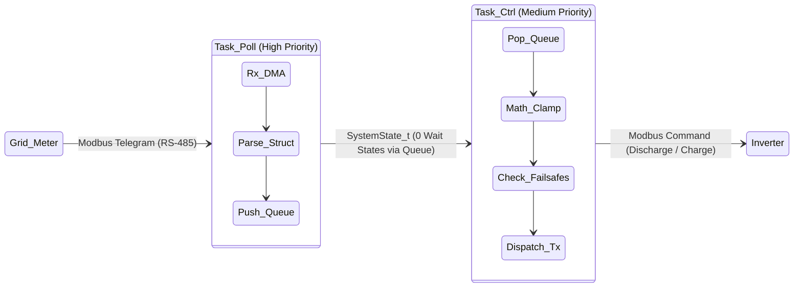

### Is there Time-Based Control in the RTOS setup?

Natively, out of the box, the FreeRTOS EMS project **lacks complex absolute time-of-day control (like Linux `cron`)** because microcontrollers do not have an inherently synced system clock upon boot. 

However, **it is entirely possible to add precise time-based control** to the RTOS project depending on the exact requirements. Here is how it can be implemented in detail:

#### 1. Internal Hardware RTC (Real-Time Clock) & Backup Registers
The STM32F407 silicon features a robust internal RTC peripheral that spans an isolated power domain. 
*   **Implementation:** 
    1.  Enable the RTC in STM32CubeIDE (`System Core > RTC`).
    2.  Supply a 32.768 kHz quartz crystal to the `LSE` (Low-Speed External) oscillator pins (`PC14` and `PC15`). This provides absolute timing accuracy.
    3.  Route a standard CR2032 coin-cell battery to the `VBAT` physical pin. Even if the main 3.3V system power fails, `VBAT` keeps the RTC ticking continuously.

*   **Controlling the RTC (Reading and Writing):**
    Unlike standard variables, the RTC time is stored in protected hardware registers to prevent accidental corruption. To safely interact with the HAL API, you must always read or write **both Time and Date** sequentially.

    **Example: Writing the Time (Setting the Clock)**
    ```c
    RTC_TimeTypeDef sTime = {0};
    RTC_DateTypeDef sDate = {0};

    // 1. Set Time (e.g. 14:30:00)
    sTime.Hours = 14;
    sTime.Minutes = 30;
    sTime.Seconds = 0;
    // Format is BIN explicitly (not BCD)
    HAL_RTC_SetTime(&hrtc, &sTime, RTC_FORMAT_BIN);

    // 2. Set Date (Must be set together!)
    sDate.Year = 24; // 2024
    sDate.Month = RTC_MONTH_OCTOBER;
    sDate.Date = 15;
    HAL_RTC_SetDate(&hrtc, &sDate, RTC_FORMAT_BIN);
    ```

    **Example: Reading the Time (Executing Logic)**
    *Critical Note:* You **must** read `GetTime` followed immediately by `GetDate`. Reading the Time locks the hardware shadow registers so you get a consistent snapshot; reading the Date unlocks them.
    ```c
    RTC_TimeTypeDef currTime = {0};
    RTC_DateTypeDef currDate = {0};

    // Read Time FIRST, then Date to unlock hardware registers
    HAL_RTC_GetTime(&hrtc, &currTime, RTC_FORMAT_BIN);
    HAL_RTC_GetDate(&hrtc, &currDate, RTC_FORMAT_BIN); 

    // Execute Time-Of-Use Load Balancing logic inside Task_Ctrl
    if (currTime.Hours >= 2 && currTime.Hours < 5) {
        set_inverter_mode(OP_MODE_FORCE_CHARGE); // Valley filling at 2AM
    }
    ```

*   **Hardware Alarms & Battery-Backed SRAM:** 
    Beyond timekeeping, the RTC peripheral block provides configuring `RTC Alarm A` hardware interrupts, allowing `Task_Ctrl` to sleep at 0% CPU and wake up *exactly* at a specific second. Additionally, this domain grants access to **20 Backup Registers** (80 bytes total). These 32-bit registers survive system reboots and power losses (powered by `VBAT`), making them the perfect place to safely store a "Crash Reason" before triggering a hardware watchdog reset.

#### 2. FreeRTOS Software Timers (For Relative Delays)
If the system does not care about the "Time of Day" (e.g., 2:00 PM) but only cares about "Duration" (e.g., "Charge for exactly 2 hours after a command is received"), we use the FreeRTOS Timer API.
*   **Implementation:** Call `xTimerCreate()` and `xTimerStart()`. 
*   **Logic:** The FreeRTOS Daemon Task (`tmrtask`) will run a callback exactly after the specified thousands of FreeRTOS ticks have elapsed. This is highly RAM efficient and requires no hardware RTC.

#### 3. Cloud Synchronization (NTP via W5500)
If the STM32 has an active internet connection through the W5500 ethernet chip, time schedules can be kept incredibly accurate without a coin-cell battery.
*   **Implementation:** Modify `Task_Net` to routinely execute a lightweight UDP socket request to an NTP pool (e.g., `pool.ntp.org`) via the W5500.
*   **Logic:** Upon parsing the UNIX timestamp from the NTP server, `Task_Net` updates the STM32's internal RTC. 
*   **Dynamic Schedules:** With NTP synced, the Cloud (via MQTT) can push a lightweight JSON array to the STM32 (e.g., `[{"start":1704067200,"mode":1}]`). `Task_Ctrl` stores this tiny array in SRAM and evaluates it continuously against the NTP-synced clock, effectively reproducing the `ems-app` timeslot behavior on a micro-scale.

#### 4. External I2C RTC (e.g., DS3231)
For the highest absolute safety in environments spanning extreme temperatures where the internal STM32 RTC might drift, an external temperature-compensated RTC (DS3231) is wired via I2C. `Task_Poll` reads this module every few seconds to guarantee hard compliance with utility grid Time-of-Use tariffs.

---
<div align="center">
<i>Designed and Engineered by the EMS Firmware Team. Strictly Confidential.</i>
</div>
