<div align="center">

# 🧠 Customer Energy Management System (CEMS): Advanced Developer Guide & Masterclass

**A comprehensive deep-dive into the C++ / Python Microservice Architecture, IPC Pipelines, and the Energy Load-Balancing algorithms running on our Embedded Linux i.MX93 Gateway.**

---

</div>

## 📑 Table of Contents
1. [The Architectural Philosophy: Microservices on the Edge](#sec-1)
2. [Peak Shaving & Energy Load Balancing Engine](#sec-2)
3. [Hardware Profile: The i.MX93 Application Processor](#sec-3)
4. [High-Level Application Topology](#sec-4)
5. [System Boot Flow: Power-On to First Userspace Process](#sec-5)
6. [eMMC Partition Layout & Storage Strategy](#sec-6)
7. [Embedded Build System & Yocto Integration](#sec-7)
8. [The Core Brain: `ems-app` (C++)](#sec-8)
9. [Inter-Process Communication (IPC) & Hardware Abstraction](#sec-9)
10. [Telemetry Broker: Redis Memory Streams](#sec-10)
11. [Hardware Interfaces Deep Dive](#sec-11)
12. [MQTT: Design, Logic & Security](#sec-12)
13. [The Python Middleware & Web Dashboard (`ems-monitor`)](#sec-13)
14. [Dashboard Architecture: ems-monitor Deep Dive](#sec-14)
15. [Over-The-Air (OTA) SWUpdate & Security Architecture](#sec-15)
16. [OTA Deep Dive: Package Update Pipeline](#sec-16)
17. [cem-app End-to-End Elaborated Workflow](#sec-17)
18. [Cybersecurity Architecture: iMX-93 Platform](#sec-18)
19. [Testing, Mocking, and CI/CD](#sec-19)
20. [Major Challenges & Software Solutions](#sec-20)
21. [Potential Questions & Answers](#sec-21)

---

<a id="sec-1"></a>
## 1. The Architectural Philosophy: Microservices on the Edge

### 1.1 Requirements Gathering & Product Definition
Before a single line of C++ or Python was written, the product owners outlined explicit constraints:
*   **Scale:** The platform had to juggle hundreds of distinct telemetry variables across heterogeneous industrial hardware (Solar Inverters, Battery Managers, Multi-Phase Meters).
*   **Reliability:** A hung TCP socket from a lagging inverter could not crash the critical peak-shaving algorithm. 
*   **UI & Networking:** The product required a rich Web Dashboard for local field engineers, over-the-air encrypted firmware updates, and massive local database caching for offline operation.
*   Given these deep requirements, a bare-metal RTOS on a standard STM32 microcontroller was physically incapable of holding the necessary memory tables and asynchronous networking stacks. An Application-class System-On-Module (SoM) running Embedded Linux (the i.MX93) became the baseline hardware requirement.

### 1.2 System Design Steps & Step-by-Step Execution
To realize these requirements securely, the team broke the architecture down into distinct design phases:

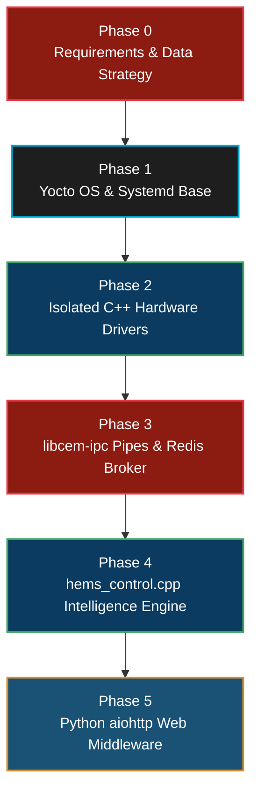

1.  **Phase 1 - The OS Base:** We configured Yocto Embedded Linux, utilizing `systemd` to orchestrate isolated service daemons.
2.  **Phase 2 - The Driver Layer:** We coded isolated C++ binaries (e.g., `rs485-modbus-driver`). These binaries do nothing except manage physical protocol handshakes on the copper lines.
3.  **Phase 3 - IPC and The Broker:** We designed `libcem-ipc` using UNIX Named Pipes to act as firewalls, moving data safely from the hardware drivers up to the algorithmic core. We simultaneously deployed local Redis Streams to cache that telemetry.
4.  **Phase 4 - The Intelligence Engine:** We developed `hems_control.cpp`, which strictly monitors the IPC data and Redis limits to safely execute algorithms (Peak Shaving / Valley Filling) without worrying about physical networking drops.
5.  **Phase 5 - The Web Middleware:** Finally, we wrote `ems-monitor` (Python `aiohttp` with WebSockets). This simply reads the Redis pipeline and pushes visualizations to the user's browser, completely decoupling user interaction from the deterministic C++ core.

### 1.3 The Microservice Rationale
Unlike a bare-metal RTOS which runs a single monolithic binary, the `cem-app` leverages the massive virtual memory space of Linux. Rather than building one giant C++ executable that manages Modbus, Web UIs, databases, and algorithms simultaneously (a monolithic approach), we designed the `cem-app` using an **Edge Microservice Architecture**. 

*   **Why Microservices?** If an industrial solar inverter physically hangs and the Modbus-TCP TCP socket refuses to close, a monolithic application would block on that socket, completely freezing the Peak-Shaving algorithm and potentially blowing a facility's main grid fuse. By separating the Modbus driver into its own isolated background process—speaking to the main algorithm exclusively over asynchronous Named Pipes—we guarantee that **hardware failures isolate perfectly**, never crashing the core logic engine!

---

<a id="sec-2"></a>
## 2. Peak Shaving & Energy Load Balancing Engine

The primary mathematical objective of the CEMS gateway is found inside `hems_control.cpp`. It balances dynamic system limits and evaluates strict **Timeslot Schedules** driven by the user.

### 2.1 Redis Timeslot Evaluation and Precedence
A fundamental mechanism of the i.MX93 CEMS is evaluating highly sophisticated predictive schedules set by the user (stored as `hems_timeslot_t` arrays) through Redis. A timeslot has specific constraints for Import, Export, and targeted Power Goals. Constraints strictly execute inside an order-of-operations clamp to protect hardware (`clamp_desired_goals_to_bounds`):
1.  **Limits Override Constraints:** Hardware `minPowerLimit` & `maxPowerLimit` (e.g., maximum fuse rating of the building) guarantee minimum baselines that can never be bypassed, regardless of what the user tries to schedule.
2.  **Constraints Override Goals:** Operational ranges (e.g., maximum limits of the solar inverter's physical capability) clamp user or cloud-directed performance Goals.
3.  **Ensure `minGoal <= maxGoal`:** Final pre-flight mathematical bounds checking prevents logic inversion faults from causing unexpected inverter behavior.

### 2.2 Algorithm: The Decision Mode Engine (`compute_mode_and_power`)
Once the target boundary goals are established by the Timeslot rules, the C++ engine distributes the strategy across the three physical electrical phases globally. The system analyzes the real-time `total_grid_active_power` reading against the computed boundaries and actively shifts physical hardware into one of four distinct `OpMode` states:

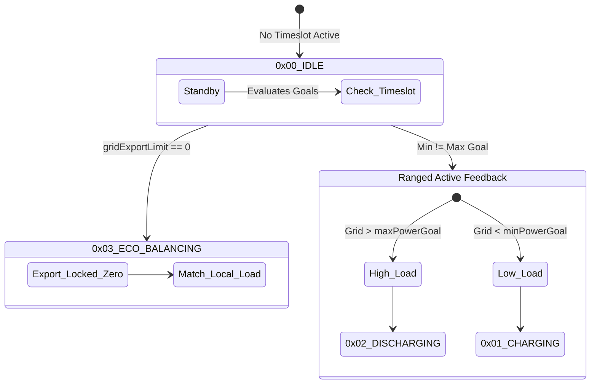

*   **`0x00` IDLE:** The default fallback state. If no active timeslots dictate boundaries, the system defaults to Idle, effectively bypassing power overrides and defaulting all inverter goals to zero Watts.
*   **`0x03` ECO_BALANCING:** Triggered explicitly when `minPowerGoal == 0` & `maxPowerGoal == 0`. The grid export limit is rigidly set to `0 Watts`. Outputs exactly zero watts to all phases, designed to perfectly match internal site loads by ramping inverters to precisely mirror internal power draw, ensuring absolutely zero wattage spills backwards onto the utility grid.
*   **`0x01` CHARGING:** Triggered when timeslot boundaries strictly demand grid import (e.g., force charging the batteries during cheap overnight energy tariffs). Specifically, if `(maxPowerGoal > 0) && (minPowerGoal == maxPowerGoal)`. The requested charge wattage is proportionally divided across generated phases: `maxPowerGoal / num_phases`.
*   **`0x02` DISCHARGING:** Triggered when timeslot boundaries strictly demand export (e.g., forcing stored battery energy back onto the grid during expensive peak hours to make money). Specifically, if `(minPowerGoal < 0) && (maxPowerGoal == minPowerGoal)`. The requested discharge wattage is equally sliced: `minPowerGoal / num_phases`.

### 2.3 Ranged Active Feedback (Peak Shaving / Valley Filling)
When the `minPowerGoal` and `maxPowerGoal` differ (forming an acceptable window rather than a rigid forced limit), the mode fluidly transitions dynamically between Charging and Discharging based on instantaneous real-word grid conditions:
*   **Peak Shaving (Excess Grid Load):** If the absolute summation of real grid meter active power violently exceeds the `maxPowerGoal` (a heavy facility load like a Chiller kicks on), the engine switches to `0x02 DISCHARGING`. Crucially, it traverses Phases A, B, and C independently. Only phases where the specific phase load explicitly exceeds the average threshold trigger discharging offsets, knocking the peak load down mathematically.
*   **Valley Filling (Missing Grid Load):** If `total_grid_active_power` drops entirely below `minPowerGoal`, the engine switches to `0x01 CHARGING`, siphoning excess cheap grid capacity quietly back into the batteries from the strictly low-load phases.

### 2.4 Hardware Protection Strategies (Smart Power Controls)
Built into the algorithm are deep C++ safety fallbacks polled continuously:
- **`BAT_RampingSOC`:** Overrides standard logic to enforce slow trickle limits when the battery is near 100% full, preventing degradation.
- **Thermal & Voltage Capping:** Minimum and Maximum Battery Voltage or Temperature differentials actively override generation limit parameters, bypassing normal Timeslot limits to protect the physical lithium cells.

---

<a id="sec-3"></a>
## 3. Hardware Profile: The i.MX93 Application Processor

Why use an application-class System-On-Module (SoM) Linux stack rather than a bare-metal STM32?

| Feature Matrix | Embedded Linux (i.MX93 Cortex-A55) | Bare-Metal RTOS (STM32 Cortex-M4) |
| :--- | :--- | :--- |
| **Clock Speed** | 1.7 GHz Dual-Core | 168 MHz Single-Core |
| **Volatile Memory (RAM)** | 2 Gigabytes (LPDDR4) | 192 Kilobytes (SRAM) |
| **Storage (Flash)** | 8 Gigabytes eMMC + 32 MB FlexSPI NOR | 1 Megabyte (Silicon Array) |
| **IPC Mechanics** | Named Pipes, Sockets, Shared Mem | RTOS Queues, Mailboxes, Semaphores |
| **Updating Scope** | Full TCP/IP stack UI, Kernel, RootFS | Single Binary block swap |
| **Primary Use-Case** | Data Aggregation, Web UIs, Complex Algorithms | Hard-realtime safety clamping (nanoseconds) |
| **Security Engine** | NXP EdgeLock ELE (HW Crypto Root-of-Trust) | None (SW Only) |
| **Co-Processor** | Cortex-M33 (FreeRTOS realtime offload) | N/A (single MCU) |
| **Neural Processing** | Ethos-U65 NPU (1 TOPS) | None |

### 3.1 i.MX93 Silicon Feature Set

The NXP i.MX93 (Arm Cortex-A55 application processor) is a purpose-built Industrial IoT SoC that directly addresses every one of our product's hard constraints:

```
┌───────────────────────────────────────────────────────────────────┐
│                  NXP i.MX93 System-on-Chip                        │
│  ┌─────────────────────────┐   ┌─────────────────────────────┐   │
│  │  Dual Cortex-A55 Cluster │   │    Cortex-M33 Subsystem      │   │
│  │  ● 1.7 GHz max clock    │   │  ● 250 MHz real-time core    │   │
│  │  ● ARMv8.2-A ISA        │   │  ● FreeRTOS / bare-metal     │   │
│  │  ● 64 KB L1 I+D per core│   │  ● 256 KB TCM SRAM           │   │
│  │  ● 512 KB shared L2     │   │  ● OpenAMP rpmsg to A55      │   │
│  └──────────┬──────────────┘   └──────────────────────────────┘   │
│             │                                                       │
│  ┌──────────▼──────────────────────────────────────────────────┐  │
│  │               System Bus (AIPS / AXI)                        │  │
│  └──┬──────┬──────┬──────┬──────┬──────┬──────┬───────────────┘  │
│     │      │      │      │      │      │      │                    │
│  ┌──▼──┐ ┌─▼──┐ ┌─▼──┐ ┌─▼──┐ ┌▼───┐ ┌▼───┐ ┌▼────────────────┐ │
│  │LPDDR│ │eMMC│ │ETH │ │CAN │ │USB │ │SAI │ │EdgeLock ELE     │ │
│  │4 2GB│ │8GB │ │1Gbps││FD  │ │OTG │ │I2S │ │Secure Enclave   │ │
│  └─────┘ └────┘ └────┘ └────┘ └────┘ └────┘ └─────────────────┘ │
└───────────────────────────────────────────────────────────────────┘
```

| Block | Specification | Usage in CEMS |
| :--- | :--- | :--- |
| **CPU** | Dual Cortex-A55 @ 1.7 GHz, ARMv8.2-A | Runs Linux 6.1 LTS, all ems-app C++ threads |
| **M33 Co-processor** | Cortex-M33 @ 250 MHz | FreeRTOS offload tasks, RPMsg mailbox IPC |
| **DDR** | 2 GB LPDDR4 @ 1866 MT/s | Redis in-memory store, kernel page tables |
| **eMMC** | 8 GB eMMC 5.1 (HS400) | Dual-partition A/B root filesystem |
| **EdgeLock ELE** | Hardware Root-of-Trust, AES-256, SHA-512, RSA-4096, TRNG | AHAB Image Authentication, SWUpdate payload verification |
| **GPC/OCOTP** | One-Time-Programmable eFuse array (2048 bits) | SRK fuse hash (hardware device binding), OTP silicon identity |
| **ENET1/ENET2** | 2× Gigabit Ethernet MAC + SGMII | Primary LAN (site network) + management port |
| **CAN-FD** | 2× FlexCAN (CAN 2.0B + CAN-FD @ 8 Mbit/s) | BCMU / Battery BMS CAN bus communication |
| **LPUART** | 8× Low-Power UART (up to 5 Mbit/s) | RS-485 adapters (Modbus RTU), debug console |
| **LPI2C** | 4× I2C (up to 3.4 Mbit/s HS mode) | Expansion board GPIO expanders (PCAL6524, ADP5585) |
| **LPSPI** | 4× SPI (up to 60 MHz) | Potential future NOR flash, display SPI peripherals |
| **USB** | 2× USB 2.0 OTG (480 Mbit/s) | UUU manufacturing flash, USB storage firmware update |
| **uSDHC** | 3× SDIO/SD/MMC controllers | eMMC (primary), SD card, IW612 Wi-Fi+BT SDIO |
| **ADC** | 2× 12-bit SAR ADC, 8 channels each | Voltage / temperature monitoring on expansion board |
| **Ethos-U65 NPU** | 1 TOPS, INT8 neural inference | Reserved for future predictive load analytics |
| **PWM** | 4× FlexPWM | LED dimming, expansion board control signals |

*   **Raw Compute & Memory:** The `i.MX93` runs in the gigahertz realm and holds 2 GB of LPDDR4 RAM — enough to run full `aiohttp` web servers, maintain deep Redis databases, and cache multi-phase energy telemetry across hundreds of concurrent streams without swapping.
*   **Networking Flexibility:** Two independent Gigabit Ethernet MACs, a SDIO-attached IW612 (Wi-Fi 6 + Bluetooth 5.3) combo chip, and USB 2.0 OTG all co-exist under a single Linux network manager — enabling Ethernet LAN + roaming Wi-Fi + OpenVPN tunnels simultaneously.
*   **Security Silicon:** The EdgeLock ELE (Secure Enclave) provides a hardware-level Root-of-Trust independent from the application CPU. It performs AHAB image signature validation during boot before the A55 cores even start, making software-level bypasses physically impossible.

---

<a id="sec-4"></a>
## 4. High-Level Application Topology

The software stack seamlessly bridges bare-metal hardware interactions built in C++ with cloud-facing WebSockets built in Python asynchronous code, all glued together via explicit OS-level Inter-Process Communication (IPC).

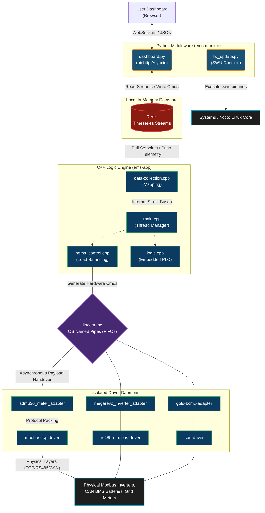

---

<a id="sec-5"></a>
## 5. System Boot Flow: Power-On to First Userspace Process

### 5.1 High-Level Boot Sequence

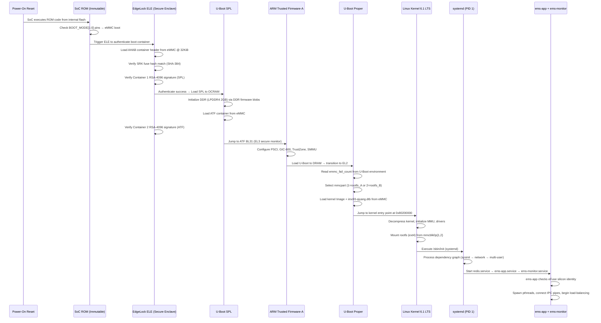

### 5.2 DDR Initialization (SPL Phase)

The LPDDR4 training is performed during SPL using NXP-supplied DDR firmware blobs:

| Blob | Role |
| :--- | :--- |
| `lpddr4_imem_1d_v202201.bin` | 1D training instruction memory |
| `lpddr4_dmem_1d_v202201.bin` | 1D training data memory |
| `lpddr4_imem_2d_v202201.bin` | 2D training instruction memory (eye margin) |
| `lpddr4_dmem_2d_v202201.bin` | 2D training data memory |

These blobs are embedded into the `imx-boot` concatenated binary alongside SPL and ATF. Without them, DDR training fails silently and the system hangs during SPL startup.

### 5.3 ARM Trusted Firmware-A (TF-A) — EL3 Secure Monitor

Atf BL31 runs permanently in EL3 (the highest privilege level on ARM), providing:
- **PSCI (Power State Coordination Interface):** CPU hotplug, suspend/resume, system reset/shutdown called by the Linux kernel via SMC (Secure Monitor Call) instructions.
- **GIC-600 configuration:** Interrupt routing between Cortex-A55 cluster and Cortex-M33 (inter-processor interrupts via `mu1` mailbox).
- **TrustZone partitioning:** Separates secure world (EdgeLock ELE, Trusted OS) from normal world (Linux).

### 5.4 U-Boot Boot Script Details

```bash
# U-Boot boot flow (summarized from imx93_qiyang_defconfig)
setenv bootargs "console=ttyLP0,115200 root=/dev/mmcblk0p${mmcpart} \
    rootfstype=ext4 ro quiet loglevel=3"

# Load kernel image and DTB into DRAM
ext4load mmc 0:${mmcpart} ${loadaddr} /boot/Image
ext4load mmc 0:${mmcpart} ${fdt_addr} /boot/imx93-qiyang.dtb

# Boot (booti for AArch64)
booti ${loadaddr} - ${fdt_addr}
```

- `console=ttyLP0,115200` maps to LPUART1 — the hardware debug serial port.
- `root=/dev/mmcblk0p${mmcpart}` dynamically selects the A or B partition.
- The kernel is loaded as a **flat Image** (uncompressed AArch64 kernel), not a `zImage`.

### 5.5 systemd Service Start Order

```
sysinit.target
    ├── systemd-journald.service
    ├── systemd-udev.service
    └── network-pre.target

network.target
    ├── NetworkManager.service
    ├── avahi-daemon.service
    └── dnsmasq.service

multi-user.target
    ├── redis.service              (Redis in-memory broker)
    ├── mosquitto.service          (Local MQTT broker)
    ├── can-driver.service         (SocketCAN initialization)
    ├── rs485-modbus-driver.service
    ├── modbus-tcp-driver.service
    ├── sdm630_meter_adapter.service
    ├── megarevo_inverter_adapter.service
    ├── gold-bcmu-adapter.service
    ├── ems-app.service            (Core C++ engine — After: all adapters)
    ├── ems-monitor.service        (Python web dashboard)
    └── emmc-fail-counter.service  (Resets U-Boot boot counter → confirms healthy boot)
```

The ordering guarantees that by the time `ems-app.service` starts, Redis is running and all hardware adapter pipes are initialized. `emmc-fail-counter.service` runs last — it acts as the "boot health confirmation" for the A/B rollback mechanism.

---

<a id="sec-6"></a>
## 6. eMMC Partition Layout & Storage Strategy

The 8 GB eMMC is laid out to support **A/B (dual-partition) atomic firmware updates** with deterministic rollback.

### 6.1 Physical eMMC Layout

```
 eMMC Physical Layout (8 GB, GPT/MSDOS)
 ┌──────────┬────────────┬────────────┬──────────┬──────────┬──────────────┐
 │  Offset  │   Region   │   Size     │  Label   │ FS Type  │  Contents    │
 ├──────────┼────────────┼────────────┼──────────┼──────────┼──────────────┤
 │  0 KiB   │ (raw)      │ 32 KiB     │ (none)   │ raw      │ MBR / GPT    │
 │  32 KiB  │ imx-boot   │ ~8 MiB     │ (no-tbl) │ raw      │ ELE+SPL+ATF+ │
 │          │            │            │          │          │ U-Boot binary│
 │  8 MiB   │ rootfs_A   │ ~3.5 GiB   │ root     │ ext4     │ Active RootFS│
 │  3.5 GiB │ rootfs_B   │ ~3.5 GiB   │ root2    │ ext4     │ Dormant/OTA  │
 │  7.0 GiB │ data       │ ~1.0 GiB   │ data     │ ext4     │ Persistent   │
 │          │            │            │          │          │ config, logs │
 └──────────┴────────────┴────────────┴──────────┴──────────┴──────────────┘
```

### 6.2 U-Boot Environment Variables (A/B Selection)

| Variable | Values | Purpose |
| :--- | :--- | :--- |
| `mmcpart` | `1` (rootfs_A) / `2` (rootfs_B) | Active root partition selector |
| `emmc_fail_count` | 0–3 | Boot failure counter |
| `bootlimit` | `3` (default) | Max consecutive boot failures before rollback |
| `altbootcmd` | `setenv mmcpart 1; saveenv; reset` | Automatic rollback command |

**A/B Rollback Logic (U-Boot):**
```
U-Boot checks emmc_fail_count:
  If emmc_fail_count >= bootlimit → execute altbootcmd → reboot to rootfs_A
  Else → increment emmc_fail_count → boot from mmcpart
```

**Successful Boot Confirmation (`emmc-fail-counter.service`):**
```ini
# emmc-fail-counter.service — runs after multi-user.target
ExecStart=/usr/bin/fw_setenv emmc_fail_count 0
```
Once Linux boots successfully to `multi-user.target`, systemd runs `emmc-fail-counter.service` which resets `emmc_fail_count` to `0` via `fw_setenv`. If the new firmware panics before reaching `multi-user.target`, the counter is never reset, and U-Boot automatically rolls back to the previous working partition on the next reboot.

### 6.3 SD Card Layout (Development / Recovery)

For development flashing, the WIC file (`hems-sd.wks.in`) produces a simpler single-partition SD image:
```
 SD Card Layout:
  offset 32 KiB → imx-boot (raw, no partition table entry)
  offset 8 MiB  → / (ext4, rootfs, label: root)
```
This is flashed via `dd` or Balena Etcher for bring-up and field recovery.

### 6.4 Persistent Data Partition

The `/data` partition is **never overwritten** during OTA updates (SWUpdate only targets `rootfs_B`). This partition stores:
- Site configuration files (`EMS.json`, `setting_data.json`, `discovery.json`)
- Redis append-only-file (AOF) dumps for power-loss recovery
- MQTT broker message queues
- OTA download staging area (`.swu` file cache)
- Logs and diagnostics

---

<a id="sec-7"></a>
## 7. Embedded Build System & Yocto Integration

The project is governed natively by a highly-structured **CMake build orchestration**.

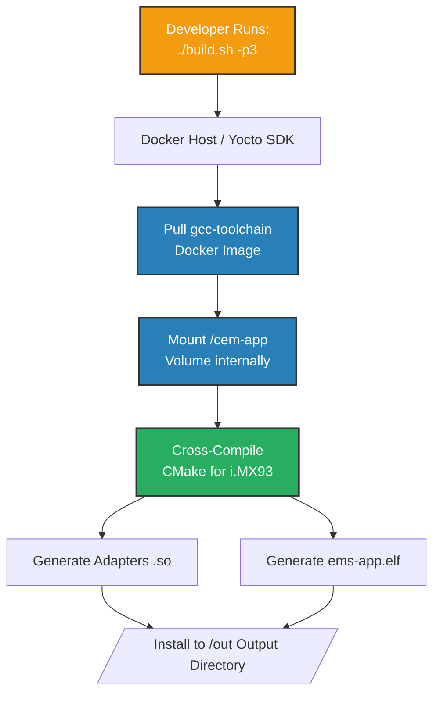

1.  **Modular Componentry:** `CMakeLists.txt` is sliced into individual `add_subdirectory` calls, allowing us to independently compile specific hardware adapters (`gen3-inverter-adapter`) only if the application target requires them.
2.  **`build.sh` Magic:** Developers rarely invoke CMake manually. We provide a massive `build.sh` script that automates compilation across architectures. `build.sh -p1` compiles explicitly for i.MX6, `-p3` for i.MX93, and `-t` compiles the ecosystem completely natively for a generic Linux VM to test logic logic off-board.
3.  **Headless Docker Compilations:** Under the hood, `build.sh` maps the source code volumetrically into an internal `gcc-toolchain` Docker container. This ensures that every developer on the team—and our GitHub Actions CI/CD server—produces an identically checksummed binary free of OS environment variations!

---

<a id="sec-8"></a>
## 8. The Core Brain: `ems-app` (C++)

The `ems-app` core binary is natively written in modern **C++17**, utilizing POSIX pthreads and mutexes to aggressively compute multi-phase grid limits concurrently.

### The Threading Model (`main.cpp`)

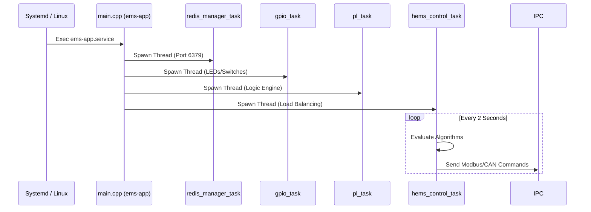

When Linux initiates `ems-app.service`, the `main.cpp` routine spawns independent, parallel execution threads:
1.  **`redis_manager_task`:** Subscribes to the local Redis server on `localhost:6379`. It pulls down cloud-set configurations (Time Slots) and maps them into safe internal C++ variables.
2.  **`gpio_task`:** Monitors the state of the expansion board I/Os, mapping limit switches and front-panel diagnostic LEDs.
3.  **`pl_task` (The PLC Evaluator):** An extraordinary feature of this firmware is its Embedded Programmable Logic Controller engine (`logic.cpp`). Administrators can dynamically inject logic gates (`AND`, `OR`, `NAND`) and equations (`GT`, `LT`, `Math`) via the config file without recompiling the C++ code! The `pl_task` parses these dynamic logic trees and evaluates them continuously, allowing field engineers to create dynamic alarms and failsafes on the fly.
4.  **`hems_control_task`:** The hyper-critical load-balancing loop. It executes deterministically every 2 seconds to make split-second decisions on whether to Charge or Discharge the battery strings.

---

<a id="sec-9"></a>
## 9. Inter-Process Communication (IPC) & Hardware Abstraction

To physically command an inverter via Modbus or read BMS data via CAN, `ems-app` utilizes our custom **`libcem-ipc.so`** Shared Library.

### Named Pipes (FIFOs) over File Descriptors

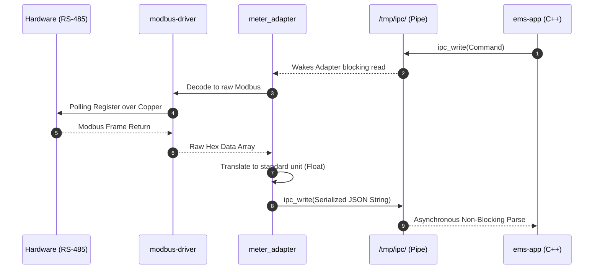

We purposely rejected complex networking IPC (like gRPC or ZeroMQ) in favor of UNIX **Named Pipes**. 
1.  An isolated driver (e.g., `rs485-modbus-driver`) boots as its own isolated Linux process. 
2.  It uses `ipc_create` to mount a physical file handler at `/tmp/ipc/...`.
3.  The main C++ `ems-app` writes a packed, serialized hardware command struct into that file wrapper asynchronously.
4.  The driver daemon wakes up, reads the pipe, executes the blocking protocol-level Modbus handshake over the copper RS-485 line, and pushes the resultant telemetry back up the pipe.

### The Adapter Ecosystem
Because every equipment manufacturer uses completely different memory registers, we build "Adapters" (e.g., `gem120-meter-adapter`, `yunt_pcs_inverter_adapter`). These are localized microservices that listen to the hardware driver and translate raw hexadecimal registers into a standardized unified JSON structure before piping it upwards back to the core. This allows us to hot-swap inverter brands seamlessly without touching the core `hems_control` mathematics.

---

<a id="sec-10"></a>
## 10. Telemetry Broker: Redis Memory Streams

Instead of building a rigid SQL database which burns out flash memory sectors with infinite writes, the system pushes data through a local **Redis Datastore**.

*   We use **Redis Streams** (`meters_stream`, `inverters_stream`, `battery_stream`).
*   **Extreme Bitmask Compression:** To ensure the system can run for years without consuming all physical RAM, C++ aggressively bit-compresses the telemetry dictionary. 

| Bit Range | Length (Bits) | Description | Example Values |
| :--- | :--- | :--- | :--- |
| `[63:32]` | 32 Bits | **Device ID** | `0x0001` (Inverter 1), `0xA002` (Meter 2) |
| `[31:24]` | 8 Bits | **Data Type** | `0x01` (Measurements), `0x02` (Status), `0x05` (Battery) |
| `[23:16]` | 8 Bits | **Phase Map** | `0x00` (Phase A), `0x01` (Phase B), `0x02` (Phase C) |
| `[15:0]` | 16 Bits | **Offset Array Index**| `0` (Voltage), `1` (Current), `2` (Active Power) |

    `device_trait_id = (device_id << 32) | trait_id`
    The data encoding itself packs phase maps, data types (Voltage vs Current), and offsets deep into boolean chunks. The Python Web Dashboard decodes it dynamically on the fly. 

---

<a id="sec-11"></a>
## 11. Hardware Interfaces Deep Dive

The CEM hardware exposes a rich set of physical communication interfaces. Below is a detailed breakdown of each bus, its role in the energy management stack, speed parameters, and how the Linux kernel + cem-app consume it.

### 11.1 RS-485 / UART (Modbus RTU)

| Parameter | Value |
| :--- | :--- |
| SoC Peripheral | LPUART1 (debug) / LPUART2–LPUART7 (RS-485) |
| Max Clock | 5 Mbit/s (LPUART hardware limit) |
| Operational Baud Rate | 9600 / 19200 / 38400 / **115200** bps (field configurable) |
| Line Standard | RS-485 half-duplex differential pair (±7 V, 1200 m max) |
| Protocol | Modbus RTU (binary framing, CRC-16) |
| Linux Driver | `imx-lpuart` (kernel 6.1) — `/dev/ttymxc0`…`/dev/ttymxc5` |
| Frame Timing | Inter-frame gap ≥ 3.5 character times at selected baud |
| Data Frequency | Configurable poll cycle; **default 1-second** register read loop |

**Application mapping:**
- `rs485-modbus-driver` runs a dedicated poll loop, sending Modbus FC03 (Read Holding Registers) frames. Responses are parsed into a structured C++ telemetry buffer and piped into `libcem-ipc`.
- RS-485 direction control (DE/RE pins) is handled via GPIO toggling through the kernel's `RS485_enabled` UART flag — no userspace GPIO banging required.
- Adapters like `sdm630_meter_adapter`, `yunt_pcs_inverter_adapter`, and `yunt_mppt_adapter` consume this RS-485 pipeline and translate raw register dumps into a unified JSON schema.

### 11.2 CAN Bus (Battery BMS / BCMU)

| Parameter | Value |
| :--- | :--- |
| SoC Peripheral | FlexCAN1 / FlexCAN2 |
| Standard | **CAN 2.0B** (Classical, 1 Mbit/s) & **CAN-FD** (8 Mbit/s data phase) |
| Nominal Bit Rate | 500 kbit/s (arbitration); 2 Mbit/s (CAN-FD data) |
| Linux Driver | `flexcan` — SocketCAN (`/dev/can0`, `/dev/can1`) |
| Frame Format | Standard 11-bit ID / Extended 29-bit ID |
| Data Frequency | Battery BMS heartbeats at **100 ms** intervals |
| Isolation | CAN transceivers with 2500 V galvanic isolation |

**Application mapping:**
- `can-driver` opens a raw SocketCAN socket with `socket(AF_CAN, SOCK_RAW, CAN_RAW)`. It configures CAN-FD mode and bitrate via `setsockopt(CANFD_MTU)` / `libsocketcan`.
- Adapter daemons (`gold-bcmu-adapter`, `kgooer-bcmu-adapter`) run separate CAN read loops and convert CAN frame payloads (State-of-Charge, cell voltages, temperatures) into the standard Redis battery stream keys.
- Hardware transceiver standby control is exposed via GPIO regulator (`reg_can2_stby`) defined in the Device Tree — toggled by the kernel during CAN interface bring-up.

### 11.3 Modbus TCP (Ethernet-attached Inverters)

| Parameter | Value |
| :--- | :--- |
| Transport | TCP/IP over Gigabit Ethernet (ENET1) |
| Port | TCP **502** (standard Modbus TCP) |
| Frame | Modbus Application Data Unit (6-byte header + PDU) |
| Function Codes | FC03 (Read Holding), FC06 (Write Single), FC10 (Write Multiple) |
| Max Connections | 8 simultaneous TCP client sockets (configurable) |
| Timeout | 5 s TCP connect timeout + 3 s response timeout |
| Data Frequency | Per-inverter poll at **1–2 s** cycle |

**Application mapping:**
- `modbus-tcp-driver` runs a non-blocking multi-connection poll loop using `libmodbus`. Each inverter is an independent `modbus_t*` context.
- The driver is intentionally isolated from `ems-app` by `libcem-ipc` Named Pipes. If an inverter's TCP socket stalls (Wi-Fi drop), it never blocks the core load-balancing thread.
- Adapter binaries (`megarevo_inverter_adapter`, `gen3-inverter-adapter`, `ac3-inverter-adapter`) sit between the driver and the IPC layer, applying per-manufacturer register maps loaded from `/etc/ems-app-support/EMS.json`.

### 11.4 Ethernet (Gigabit LAN)

| Parameter | Value |
| :--- | :--- |
| SoC Peripheral | ENET1 (primary) / ENET2 (management) |
| PHY Speed | 10 / 100 / **1000 Mbit/s** auto-negotiation |
| Linux Driver | `fec` (Freescale ENET) |
| Network Manager | NetworkManager + systemd-networkd |
| DHCP Client | `dhclient` or static IP via `/etc/ems-static-ip.leases` |
| Services on LAN | HTTP/WebSocket dashboard (port **8080**), MQTT (port **1883/8883**), OpenVPN (UDP **1194**) |

- Static IP lease files (`ems-static-ip.leases`) allow field engineers to pre-configure fixed LAN addresses without a DHCP server.
- Both MACs are controlled by a single `networkmanager.service` instance. Failover bonding between ENET1 and Wi-Fi is possible for high-availability deployments.

### 11.5 Wi-Fi & Bluetooth (IW612 / AIC8800D Combo)

| Parameter | Value |
| :--- | :--- |
| Module | NXP IW612 (Wi-Fi 6 802.11ax) + Bluetooth 5.3 |
| Interface to SoC | SDIO (uSDHC3, max 50 MHz, 4-bit) |
| Wi-Fi Bands | 2.4 GHz + 5 GHz dual-band |
| Wi-Fi Max Throughput | ~600 Mbit/s (MCS11, 80 MHz, 2×2 MIMO) |
| BT Range | 10 m (Class 2), BLE 5.3 |
| Yocto Support | `iw612-utils`, `nxpiw612-sdio` MACHINE_FEATURE |
| OpenThread | 802.15.4 Thread co-processor support via IW612 |

- Wi-Fi is used as a secondary network path for cloud MQTT broker connectivity (GivEnergy IoT cloud) when LAN is unavailable.
- Bluetooth LE is used for proximity-based commissioning (`ge_commissioning.service`) — field engineers pair a mobile app to the gateway to set Wi-Fi credentials and site configuration.

### 11.6 USB (Manufacturing Flash & Storage)

| Parameter | Value |
| :--- | :--- |
| SoC Peripheral | USB1 OTG (Device/Host) / USB2 OTG |
| Speed | USB 2.0 High-Speed (480 Mbit/s) |
| Manufacturing Mode | NXP UUU (Universal Update Utility) via USB Serial Download |
| OTG Cable | USB-C receptacle on gateway |

- During manufacturing, the gateway boots into the **initramfs** (cpio.zst) via the NXP UUU tool (`ems_flash.uuu`). The UUU script flashes `imx-boot`, `givenergy-cem-image-emmc.tar.zst` to the eMMC from the host PC over USB.
- In field devices, USB Host mode supports USB mass-storage drives containing firmware `.swu` packages for offline OTA updates.

### 11.7 I2C (Expansion Board Peripherals)

| Parameter | Value |
| :--- | :--- |
| SoC Peripheral | LPI2C1 / LPI2C2 / LPI2C3 |
| Speed Modes | Standard 100 kHz / Fast 400 kHz / **Fast+ 1 MHz** |
| Connected Devices | PCAL6524 (24-bit GPIO expander), ADP5585 (10ch keypad/GPIO), RTC |
| Linux Driver | `imx-lpi2c` |

- The **PCAL6524** expander provides 24 additional GPIOs for front-panel LEDs, relay control lines, and DIP-switch configuration inputs.
- The **ADP5585** expander drives the CAN transceiver standby signal and audio power regulator.
- `gpio_task` inside `ems-app` reads/writes these expanders via the Linux `sysfs` GPIO interface (`/sys/class/gpio/`) mapped by the Device Tree.

### 11.8 SPI (Potential NOR / Accessories)

| Parameter | Value |
| :--- | :--- |
| SoC Peripheral | LPSPI1 / LPSPI2 / LPSPI3 |
| Max Clock | 60 MHz (LPSPI engine limit) |
| Operational Clock | 25 MHz (typical NOR flash read) |
| Frame Format | CPOL/CPHA configurable (Mode 0/3 typical) |

- The i.MX93 also features a **FlexSPI** controller connected to an external 32 MB SPI NOR Flash for U-Boot environment storage and potential A/B revert metadata.

### 11.9 GPIO Summary

| Signal Group | Physical Source | Usage |
| :--- | :--- | :--- |
| Front-panel LEDs | PCAL6524 GPIO14, GPIO15, GPIO16 | System status (Green=OK, Amber=Warning, Red=Fault) |
| Relay outputs | PCAL6524 GPIO20-GPIO23 | External contactor activation |
| CAN-FD Standby | ADP5585 GPIO5 | CAN transceiver wake/sleep |
| Extension board enable | GPIO3_IO7 | 12 V rail to expansion board |
| USB VBUS enable | ADP5585 GPIO1 | USB host power control |
| Boot mode select | BOOT_MODE[1:0] SoC pads | Selects SD / eMMC / USB-Serial-Download |

---

<a id="sec-12"></a>
## 12. MQTT: Design, Logic & Security

### 12.1 Role of MQTT in the CEMS Architecture

MQTT (Message Queuing Telemetry Transport) acts as the **bidirectional cloud communication channel** between the i.MX93 gateway and the GivEnergy cloud back-end (AWS IoT Core). It is deliberately kept **separate** from the internal data bus (Redis + libcem-ipc) — operating as the external-world interface while the internal systems run independently.

There are two distinct MQTT planes in the system:

| Plane | Broker | Transport | Purpose |
| :--- | :--- | :--- | :--- |
| **Cloud MQTT** | AWS IoT Core (`a27e5x08knmp1g-ats.iot.eu-west-2.amazonaws.com`) | TLS 1.2/1.3, port **8883** | Telemetry upload (UP), command ingestion (DOWN) |
| **Local MQTT** | Mosquitto (`localhost:1883`) | Plaintext, loopback only | Internal pub/sub between `ems-app` C++ and `ems-monitor` Python |

### 12.2 MQTT Protocol Version & QoS

| Parameter | Value | Rationale |
| :--- | :--- | :--- |
| **Protocol version** | MQTT v5 (`MQTT_PROTOCOL_V5`) | Reason codes, flow control, shared subscriptions |
| **QoS level** | **1** (At-Least-Once) | Guarantees delivery; cloud ACK required before message is discarded |
| **Keep-alive** | 10 seconds | Detects stale broker connections quickly |
| **Clean session** | `true` | Avoids stale downstream command queues persisting across restarts |
| **Payload size limit** | 1 MB (validated in `validate_mqtt_message`) | Prevents memory exhaustion attacks |

### 12.3 MQTT Thread Architecture

`ems-app` manages MQTT as two independent **pthreads** — a subscriber and a publisher — completely decoupled from the load-balancing engine:

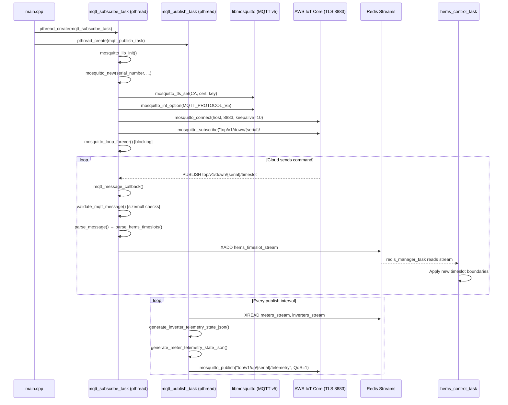

### 12.4 Topic Design

Topics follow a **directional prefix convention** that makes routing rules, ACL policies, and debugging immediately obvious:

| Direction | Prefix (Production) | Prefix (Debug/Dev) | Description |
| :--- | :--- | :--- | :--- |
| **UP** (Gateway → Cloud) | `top/v1/up/` | `on-premise-gateway/v1/up/ingest/` | Telemetry, status, error reports |
| **DOWN** (Cloud → Gateway) | `top/v1/down/` | `on-premise-gateway/v1/down/ingest/` | Timeslots, commands, ST file transfers |

Full topic structure:
```
top/v1/up/{serial_number}/telemetry          ← Periodic device state
top/v1/up/{serial_number}/datasheet          ← Device configuration (sent hourly)
top/v1/down/{serial_number}/timeslot         ← Schedule updates from cloud
top/v1/down/{serial_number}/command          ← Real-time action requests
top/v1/down/{serial_number}/ST_File/Header   ← PLC logic file transfer start
top/v1/down/{serial_number}/ST_File/Chunk    ← PLC logic file binary chunk
top/v1/down/{serial_number}/ST_File/End      ← MD5 checksum finalisation
```

- The **device serial number** (`serial_number` read from `/etc/ems-app-support/EMS.json`) is embedded in every topic. This ensures each physical gateway only publishes/subscribes to its own namespace — a rogue device cannot inject commands into another device's topic.
- The AWS IoT Core **policy document** (`cem_rex-Policy`) enforces this at the broker level with explicit ARN resource matching: `arn:aws:iot:eu-west-2:*:topic/top/v1/*/DEVICE_SERIAL_NUMBER/*`.

### 12.5 Upstream Telemetry: JSON Message Schema

The `mqtt_publish_task` assembles a structured JSON telemetry envelope every publish cycle. Each message carries a versioned outer packet and a trait-block array:

```json
{
  "messageId": 42,
  "version": 1,
  "timestamp": "2026-03-09T10:30:00Z",
  "telemetry": [
    {
      "type": "inverter",
      "deviceId": 1,
      "traitId": "0x00010001",
      "state": {
        "status": 1,
        "faultCode": 0,
        "outputPower": -5000
      }
    },
    {
      "type": "meter",
      "deviceId": 2,
      "traitId": "0x00030002",
      "state": {
        "phaseA": { "voltage": 234.5, "current": 12.3, "activePower": 2880 },
        "phaseB": { "voltage": 233.1, "current": 11.8, "activePower": 2750 },
        "phaseC": { "voltage": 235.0, "current": 12.0, "activePower": 2820 }
      }
    }
  ]
}
```

**Datasheet messages** (sent once per hour, or on reconnect) describe the physical device — vendor, model, max power rating, directionality — allowing the cloud to infer capabilities without a local config file:

```json
{
  "type": "inverter-datasheet",
  "deviceId": 1,
  "vendor": "MegaRevo",
  "model": "HV50K",
  "maxPowerRating": 50000,
  "directionality": "bidirectional"
}
```

**Binary telemetry packing** (`outer_packet_t` / `trait_block_t` / `device_block_t`) is used in the legacy packed-struct format (kept for backward compatibility with older cloud endpoints):

```cpp
// Packed binary outer envelope (little-endian, wire format)
typedef struct __attribute__((packed)) outer_packet {
    GE_UINT16 version;         // Protocol version = 1
    GE_UINT16 message_id;      // Monotonically incrementing
    GE_UINT8  trait_block_count;
    GE_UINT64 timestamp;       // Unix epoch ms
} outer_packet_t;
```

### 12.6 Downstream Command Handling: Timeslot Injection

The most critical downstream flow is **timeslot scheduling** — the cloud sends energy scheduling windows that `hems_control_task` executes:

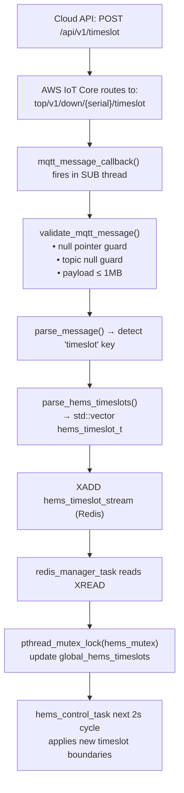

The use of **Redis Streams as a handover buffer** between the MQTT subscriber thread and the `hems_control_task` thread is a critical design decision:
- The MQTT callback returns immediately (non-blocking) — the subscriber thread never stalls waiting for the control loop.
- `hems_mutex` guards `global_hems_timeslots` shared between `redis_manager_task` and `hems_control_task`.
- If AWS IoT Core delivers a timeslot while the gateway is offline and reconnects, the MQTT v5 session-expiry + QoS-1 mechanism ensures the message is replayed by the broker.

### 12.7 Downstream Command Handling: Action Requests

The `parse_message()` function also handles real-time **action requests** from the cloud (force-charge, force-discharge overrides):

```json
{
  "message": {
    "messageID": 101,
    "timestamp": "2026-03-09T10:31:00Z",
    "updates": [{
      "id": "inverter-0",
      "action-requests": [{
        "id": 1,
        "action-id": "force-charge",
        "fields": {
          "until": { "soc": 90 }
        }
      }],
      "desired-state": {
        "outputPower": -10000,
        "timeSlots": {
          "start": "10:30",
          "duration": 3600,
          "overrides": { "chargePower": 10000 }
        }
      }
    }]
  }
}
```

### 12.8 ST File Transfer Over MQTT (PLC Logic Update)

One of the most elegant features of the MQTT implementation is the ability to **update the PLC logic engine remotely** without a full OTA firmware update. The cloud uploads a new Structured Text (`.st`) logic file in chunks over three sequential MQTT topics:

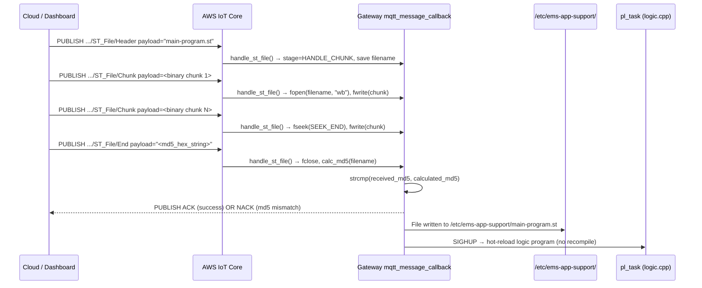

**MD5 Integrity Check:** The final `ST_File/End` message carries the MD5 hash (hex string) of the complete file. The gateway computes `calc_md5()` independently on the received file and compares results before accepting it. A mismatch causes the file to be discarded and a NACK published — the PLC engine is never contaminated with a corrupt file.

**State Machine Safety:** The file transfer uses a 3-state machine (`HANDLE_HEADER → HANDLE_CHUNK → verify on End`). Any out-of-order message (e.g., a `Chunk` arriving without a preceding `Header`) resets the state and discards partial data, preventing file corruption from dropped MQTT messages.

### 12.9 Reconnection & Resilience Strategy

| Scenario | Behaviour |
| :--- | :--- |
| **Broker disconnect (expected)** | `mqtt_disconnect_callback()` fires → 5 s sleep → `mosquitto_reconnect()` |
| **Initial connect failure** | `mqtt_subscribe_task` continues to `mosquitto_loop_forever()`, which retries internally |
| **Max retries exceeded** | `MAX_MQTT_RETRIES = 5`, `MQTT_ERROR_RETRY_DELAY_SEC = 20` per attempt |
| **Network outage** | `mosquitto_loop_forever()` handles TCP keepalive detection automatically |
| **`ems-app` restart** | Systemd `Restart=on-failure` respawns process; MQTT v5 clean-session ensures no stale subscriptions |
| **Partial message during crash** | Redis Streams buffer last received timeslots → `hems_control_task` continues on last valid state |

### 12.10 MQTT Security Hardening

| Security Control | Implementation Detail |
| :--- | :--- |
| **Mutual TLS Authentication** | Client sends `cem_rex.cert.pem` + `cem_rex.private.key`; broker validates against AWS IoT CA (`root-CA.crt`) |
| **Certificate files location** | `/etc/ems-app-support/` — owned by `root`, mode `0600`, inaccessible to unprivileged processes |
| **Per-device identity** | `mosquitto_new(serial_number, ...)` — client ID = device serial → traceable in AWS CloudWatch |
| **Payload validation** | `validate_mqtt_message()` enforces null-pointer guards + hard 1 MB size cap before any parsing |
| **JSON parsing safety** | `cJSON_Parse()` used throughout; all returned pointers null-checked before access |
| **Topic isolation** | Device serial embedded in every topic; AWS IoT policy prevents cross-device topic access |
| **No plain-text fallback** | `mosquitto_tls_set()` called before `mosquitto_connect()` — connection is aborted if TLS fails |
| **Local broker isolation** | Mosquitto `localhost:1883` binds only to loopback (`127.0.0.1`) — no external exposure |
| **Debug vs Production broker** | Compile-time `#ifdef AWS_DEV` / `AWS_STAGING` switches broker hostname — staging cert cannot reach production broker |

### 12.11 Local Mosquitto Broker (Inter-Process)

Besides the cloud MQTT path, a local Mosquitto broker on `localhost:1883` provides a lightweight pub/sub bus between `ems-app` (C++) and `ems-monitor` (Python):

```
ems-app (C++) ──── PUBLISH localhost:1883 ──── ems-monitor (Python aiohttp)
    Topic: ems/status/live                          SUBSCRIBE ems/status/live
    Topic: ems/alerts/fault                         SUBSCRIBE ems/alerts/fault
    Topic: ems/contactor/state                      SUBSCRIBE ems/contactor/state
```

- **No TLS** on the local broker — loopback-only (`127.0.0.1`) with no external firewall exposure.
- `ems-monitor` subscribes via `aiohttp-mqtt` (async Python MQTT client), forwarding received messages into the WebSocket broadcast pipeline for real-time dashboard updates.
- This decoupling means the dashboard can receive real-time fault alerts even if the Redis stream polling is temporarily behind.

---

<a id="sec-13"></a>
## 13. The Python Middleware & Web Dashboard (`ems-monitor`)

To drastically remove UI-blocking elements from the C++ process, the dashboard is served locally by an asynchronous Python service (`aiohttp`) known as `ems-monitor`.

*   **`dashboard.py`**: Executes an infinite `asyncio` loop. It connects to the Redis backend, decodes the C++ bitmasks, multiplies fractional metric arrays (e.g., pulling a `uint16` 3450 down to `34.5 Hz`), and emits the full structure as JSON packets over active **WebSockets** to connected browsers.
*   **Graceful Aging (Decayed Fields):** If an inverter adapter daemon crashes, its stream data stops updating. The Python module automatically detects the staling timestamp and gracefully transitions the UI gauges to a "Failed/Offline" state after 5 seconds of silence, without halting the application.

---

<a id="sec-14"></a>
## 14. Dashboard Architecture: ems-monitor Deep Dive

### 14.1 Service Architecture

```
 ems-monitor (Python aiohttp)
 ┌──────────────────────────────────────────────────────────────────┐
 │                                                                    │
 │  asyncio Event Loop                                               │
 │  ┌────────────────┐  ┌─────────────────┐  ┌──────────────────┐  │
 │  │  HTTP Server   │  │ WebSocket Hub   │  │  Redis Subscriber│  │
 │  │  aiohttp.web   │  │ broadcast()     │  │  aioredis XREAD  │  │
 │  │  Port 8080     │  │ 500ms interval  │  │  STREAMS polling │  │
 │  └───────┬────────┘  └────────┬────────┘  └────────┬─────────┘  │
 │          │                    │                     │             │
 │          ▼                    ▼                     ▼             │
 │  Jinja2 Templates      JSON Payload Builder    Redis Decoder     │
 │  (index.html, login)   (scale + decode bitmask)(bitmask → float) │
 │                                                                    │
 │  ┌────────────────────────────────────────────────────────────┐  │
 │  │  Static File Server: /static/ (Chart.js, CSS, JS)         │  │
 │  └────────────────────────────────────────────────────────────┘  │
 └──────────────────────────────────────────────────────────────────┘
```

### 14.2 dashboard.py Key Routines

| Routine | Purpose | Update Rate |
| :--- | :--- | :--- |
| `redis_reader_task()` | XREAD from `meters_stream`, `inverters_stream`, `battery_stream` | 500 ms |
| `decode_bitmask(trait_id)` | Extracts device_id, data_type, phase, offset from 64-bit key | Per-message |
| `scale_value(raw, factor)` | Applies per-metric scale factor (e.g., raw `3450` → `34.5 Hz`) | Per-message |
| `websocket_handler(request)` | Accepts browser WebSocket upgrade, adds to broadcast pool | On connect |
| `broadcast_task()` | Sends current telemetry snapshot to all connected WebSocket clients | 500 ms |
| `auth_handler(request)` | Digest authentication against `auth.json` hash | On login |
| `fw_upload_handler(request)` | Receives multipart `.swu` upload, acquires atomic lock, invokes SWUpdate | On demand |

### 14.3 Dashboard Features

| Feature | Implementation |
| :--- | :--- |
| **Live Power Flow Diagram** | SVG diagram with WebSocket-driven value overlays |
| **Historical Charts** | Chart.js time-series graphs reading Redis stream history |
| **Timeslot Scheduler** | Calendar drag-drop UI — writes to `hems:timeslot:*` Redis keys |
| **Device Status Panel** | Per-device online/offline status with 5 s stale-data detection |
| **Firmware Update** | Drag-and-drop `.swu` upload with progress bar (chunked streaming) |
| **System Diagnostics** | CPU temp, RAM usage, eMMC health read from `/sys/` and `sysfs` |
| **GPIO / Contactor Control** | Manual override panel for relay outputs (requires admin role) |
| **Log Viewer** | Live tail of `journalctl -f -u ems-app` via server-sent events |

### 14.4 Stale Data Handling (Graceful Degradation)

```python
TELEMETRY_STALE_SECONDS = 5.0

def is_stale(device_last_seen: float) -> bool:
    return (time.monotonic() - device_last_seen) > TELEMETRY_STALE_SECONDS

# In broadcast_task:
for device_id, data in telemetry_cache.items():
    data['online'] = not is_stale(device_timestamps[device_id])
    # If offline, dashboard renders grey gauges with "OFFLINE" overlay
    # hems_control.cpp operates on last known good values + safety clamp
```

This ensures the dashboard **never freezes or shows corrupt data** during a partial network outage — offline devices simply show a grey overlay, while the C++ core continues operating on the last valid cached values with thermal and voltage safety clamps active.

---

<a id="sec-15"></a>
## 15. Over-The-Air (OTA) SWUpdate & Security Architecture

Firmware updates on an Embedded Linux Gateway are significantly more complex than an RTOS. 

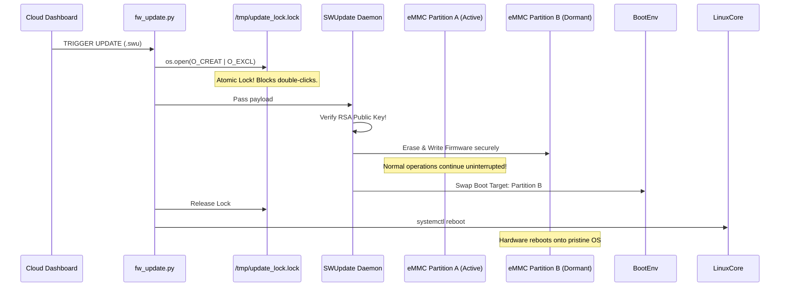

### Atomic Update Locking (`fw_update.py`)
To prevent the user from clicking the `Update Firmware` button twice simultaneously (which could violently fracture the OS installation), the Python `fw_update.py` script implements atomic UNIX locking. It uses `os.open` with `O_CREAT | O_EXCL` at `/tmp/update_lock.lock`. The physical Linux kernel mathematically guarantees that two threads cannot simultaneously hold this lock.

### The `SWUpdate` A/B Mechanism
1.  The Python layer downloads the `.swu` firmware payload using non-blocking native `aiohttp` streams.
2.  It utilizes the embedded `SWUpdate` framework. This tool verifies the payload's RSA public-key signatures ensuring malicious firmware cannot be flashed.
3.  `SWUpdate` seamlessly flashes the incoming firmware image into the dormant **Fallback B-Partition** of the Flash storage in the background. Note: The application never stops running during the burn cycle!
4.  Once verified, `SWUpdate` swaps the boot variables. When `fw_update.py` fires a Linux `reboot` command, the system boots into the new, pristine B-Partition OS image. If the kernel panics on boot, U-Boot natively detects the failure and automatically rolls back to the A-Partition, making the gateway essentially unbrickable!

### Silicon Hardware OTP Identification
To prevent theft of our IP, the Python stack reaches explicitly into `/sys/bus/nvmem/devices/...` to query the physical offset `1504` of the i.MX93's internal One-Time Programmable (OTP) eFuses. If the hardware string encoded directly into the silicon of the CPU does not explicitly match the configuration file constraints, the software halts. 

---

<a id="sec-16"></a>
## 16. OTA Deep Dive: Package Update Pipeline

### 16.1 Full OTA Build + Delivery + Flash Sequence

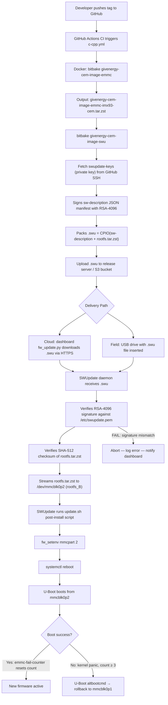

### 16.2 SWUpdate sw-description Example

```json
{
  "software": {
    "hardware-compatibility": ["1.0"],
    "version": "2.3.1",
    "images": [
      {
        "filename": "givenergy-cem-image-emmc-imx93-cem.tar.zst",
        "type": "archive",
        "device": "/dev/mmcblk0p2",
        "installed-directly": false,
        "sha256": "<hash>",
        "encrypted": false
      }
    ],
    "scripts": [
      {
        "filename": "update.sh",
        "type": "shellscript",
        "data": "post-install"
      }
    ]
  }
}
```

### 16.3 Package Dependency Management (RPM / Yum)

For incremental field updates (individual component bug fixes rather than full rootfs flips), the system supports **RPM package updates** via Yum (`hems-rpm-yum` recipe):

| Package | Contains |
| :--- | :--- |
| `ems-app-1.0.0-r0.cortexa55.rpm` | `ems-app` binary + adapters + service files |
| `ems-monitor-1.0.0-r0.noarch.rpm` | Python dashboard (platform-independent) |
| `mosquitto-2.0.x.cortexa55.rpm` | Mosquitto MQTT broker |
| `redis-7.x.cortexa55.rpm` | Redis datastore |

```bash
# On-device RPM package update (requires yum/rpm tooling from hems-rpm-yum)
yum update ems-app   # Downloads from hosted RPM repository
systemctl restart ems-app.service
```

This is lighter than a full SWUpdate OTA and preserves all configuration files in `/data` and `/etc/ems-app-support/`.

---

<a id="sec-17"></a>
## 17. cem-app End-to-End Elaborated Workflow

This section traces the complete lifecycle of a single energy management decision from raw hardware signal to cloud telemetry.

### 17.1 Full Data Path: Grid Meter Reading → Peak Shaving Action

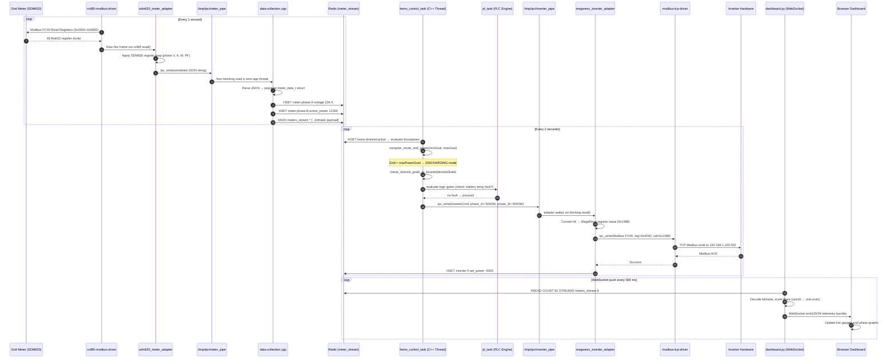

### 17.2 Thread Lifecycle & Mutex Strategy

| Thread | Schedule | Key Mutex | Critical Section |
| :--- | :--- | :--- | :--- |
| `redis_manager_task` | 500 ms poll | `hems_mutex` | Writing `global_hems_timeslots` vector |
| `gpio_task` | 200 ms poll | `gpio_mutex` | Reading GPIO expander state flags |
| `pl_task` | 10 ms (`LOGIC_TASK_INTERVAL_MS`) | `logic_data_mutex` | Reading/writing PLC gate evaluation results |
| `hems_control_task` | 2000 ms cycle | `hems_mutex`, `logic_data_mutex` | Reading timeslots + evaluating modes + writing IPC commands |

- PLC runs at **10 ms** (100 Hz) to catch fast transient conditions (thermal alerts, contact bounce).
- `hems_control_task` deliberately runs at **2 s** to give the physical inverter hardware time to ramp and settle between command updates — industrial inverters reject command rates faster than 1 Hz.

### 17.3 PLC (Programmable Logic Engine) — Dynamic Runtime Configuration

The PLC engine (`logic.cpp`) parses a JSON configuration structure from `/etc/ems-app-support/main-program.st` using the `st-parser`. Example:

```json
{
  "gates": [
    { "type": "AND", "inputs": ["BatteryOverTemp", "GridConnected"], "output": "EnableCharge" }
  ],
  "comparators": [
    { "type": "GT", "a": "battery_voltage", "b": 48.0, "output": "BatteryOverVoltage" }
  ],
  "maths": [
    { "type": "DIV", "inputs": ["total_grid_power", "num_phases"], "output": "per_phase_power" }
  ]
}
```

- Up to **1024 gates**, **1024 comparators**, **1024 math nodes**, and **1024 cast operations** are supported per program.
- The engine resolves the dependency graph topologically — gates whose inputs depend on other gate outputs are evaluated in the correct order automatically.
- Field engineers modify the JSON on the device (via SSH or dashboard file upload) and send a `SIGHUP` to `ems-app` to trigger a hot-reload — **zero recompilation, zero downtime**.

### 17.4 Adapter Ecosystem — Protocol Translation Map

| Adapter Service | Protocol | Connected Hardware | Data Out |
| :--- | :--- | :--- | :--- |
| `sdm630_meter_adapter` | Modbus RTU (RS-485) | Eastron SDM630 3-Phase Meter | Phase V, A, W, VAr, PF, kWh |
| `gem120-meter-adapter` | Modbus TCP | Chint GEM120 Meter | Phase V, A, W, PF |
| `megarevo_inverter_adapter` | Modbus TCP | MegaRevo HV Inverter | DC power, AC output, fault codes |
| `gen3-inverter-adapter` | Modbus TCP | GivEnergy Gen3 Inverter | AC/DC power, SOC passthrough, limits |
| `ac3-inverter-adapter` | Modbus TCP | GivEnergy AC3 3-Phase Inverter | Per-phase AC power, grid sync state |
| `yunt_pcs_inverter_adapter` | Modbus RTU (RS-485) | Yunt PCS Inverter | Active/reactive power setpoints |
| `yunt_mppt_adapter` | Modbus RTU (RS-485) | Yunt MPPT Solar Charger | PV voltage, current, MPPT tracking |
| `gold-bcmu-adapter` | CAN 2.0B | Gold Shell BMS (BCMU) | SOC%, cell voltages, temperatures, alarms |
| `kgooer-bcmu-adapter` | CAN 2.0B | KGooer BCMU | SOC%, pack current, BMS status |

---

<a id="sec-18"></a>
## 18. Cybersecurity Architecture: iMX-93 Platform

The CEM gateway is deployed in grid-connected commercial energy infrastructure. Every security layer has been deliberately designed to meet IEC 62443 (Industrial Cybersecurity) and NXP's own AHAB security requirements.

### 18.1 Security Threat Model

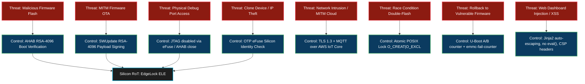

### 18.2 AHAB (Advanced High Assurance Boot)

The i.MX93's boot security is governed by the **Advanced High Assurance Boot (AHAB)** system, implemented inside the dedicated **EdgeLock Enclave (ELE)** — a physically separate security co-processor on the same die.

**AHAB Boot Chain:**

```
Power-On Reset
    │
    ▼
SoC ROM (Immutable)
    │  Reads imx-boot from eMMC at sector 0 (offset 32 KiB)
    ▼
EdgeLock ELE Firmware (mx93a0-ahab-container.img)
    │  Verifies SHA-512 hash of ELE container header
    ▼
AHAB Container 1: SPL (U-Boot Secondary Program Loader)
    │  ELE checks: RSA-4096 signature of SPL image
    │  References SRK Table (Super Root Key hash burned into eFuses)
    ▼
AHAB Container 2: ATF / TF-A (Trusted Firmware-A)
    │  ELE checks: RSA-4096 signature of ARM Trusted Firmware
    ▼
U-Boot Proper (authenticated chain established)
    │  Software chain continues under Linux verification
    ▼
Linux Kernel + Device Tree
```

**Key Technical Details:**

| AHAB Attribute | Value |
| :--- | :--- |
| Signing Algorithm | RSA-4096, SHA-512 |
| CST Version | NXP CST 4.0.1 |
| Key Chain | Direct SRK signing (USR/SGK chain disabled due to ELE FW 0.0.11 limitation) |
| Container Version | AHAB v1.0 (forced for fuse compatibility with 384-bit SRK hash) |
| SRK Fuse Location | OCOTP offset `1504` (4× SRK entries, SHA-256 of SHA-384 public keys) |
| Verification Status | `ahab_status` → `No Events Found!` |
| Permanent Lock | `ahab_close` burns the `SRK_LOCK` bit — irreversibly enables AHAB enforcement |

**Development Lessons:**
- The **SGK (Subordinate Group Key)** approach was initially attempted but rejected by ELE FW 0.0.11 on Revision 1.1 silicon (`BAD_SIGNATURE`).
- The fix was to sign **directly with the SRK (Super Root Key)** by removing the `[Install Certificate]` block from `mx9_template.csf`.
- ATF (ARM Trusted Firmware) must be signed as a **separate AHAB container** before being embedded into the final `imx-boot` flash binary.

### 18.3 eFuse / OTP Silicon Identity Binding

To prevent software cloning onto unauthorized hardware, `ems-app` performs a runtime silicon identity check:

```cpp
// Reads NXP OCOTP eFuse bank at physical offset 1504
// via Linux nvmem sysfs interface
std::string path = "/sys/bus/nvmem/devices/imx-ocotp0/nvmem";
// Reads 4 bytes at offset 1504 → unique per-device SRK hash fragment
// If silicon ID != config file constraint → application exits
```

- This binding check runs at `ems-app` startup, before any network socket opens.
- It makes cloning the OS image to a different hardware board silently fail — the app refuses to operate.
- The eFuse array is also used to store a unique device serial number used in MQTT client IDs and AWS IoT Thing certificates.

### 18.4 SWUpdate RSA Payload Signing Chain

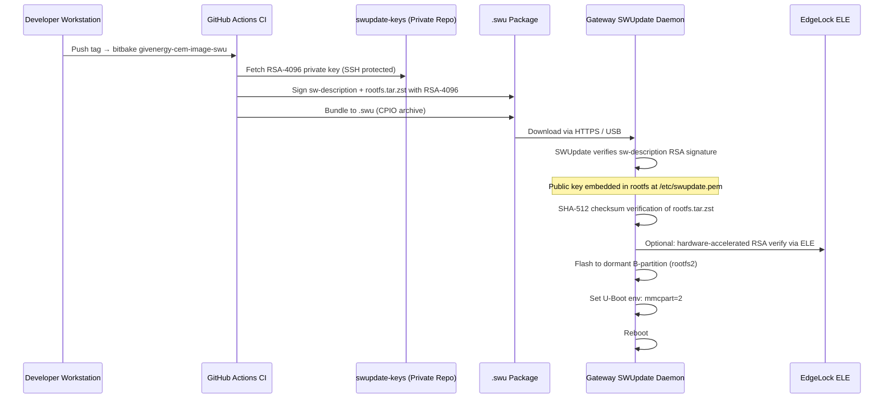

- The **private key** never leaves the CI build environment — it is fetched from a password-protected, access-controlled private GitHub repository at build time.
- The **public key** (`/etc/swupdate.pem`) is embedded into the read-only rootfs image at build time. A rogue update signed by a different key is refused silently at the SWUpdate layer before a single byte touches the eMMC.
- `sw-description` (the SWUpdate manifest) itself is RSA-signed and verified first — any tampering with install instructions is immediately detected.

### 18.5 MQTT / Cloud Communication Security

| Layer | Technology |
| :--- | :--- |
| Transport | TLS 1.3 (mutual authentication) |
| Certificate Authority | AWS IoT Core certificate authority |
| Client Certificate | Per-device X.509 certificate, provisioned at manufacturing |
| Broker | AWS IoT Core (MQTT 3.1.1) |
| Topics | ACL-controlled per `cem_rex-Policy` (device can only pub/sub its own Thing shadow) |
| Mosquitto Local Broker | Runs on `localhost:1883` (no external TLS — loopback only) |

- Each gateway has a **unique per-device X.509 certificate** and private key stored at `/etc/ems-app-support/`. The AWS IoT policy (`cem_rex-Policy`) restricts the device to only publish/subscribe to topics containing its own device ID — preventing cross-device data injection.
- The local Mosquitto broker binds only to `127.0.0.1`, making it unreachable from the LAN — all external-facing communication goes through the TLS-authenticated AWS IoT Core path.

### 18.6 OpenVPN Remote Access

- The gateway maintains an OpenVPN tunnel (UDP 1194) to the GivEnergy operations VPN server.
- This enables **secure remote SSH access** by GivEnergy engineers without exposing an SSH port to the public internet.
- The VPN certificate is device-specific and can be revoked centrally if a device is decommissioned.

### 18.7 Atomic OTA Locking (Race Condition Prevention)

```python
# fw_update.py — atomic POSIX lock preventing double-flash
lock_fd = os.open('/tmp/update_lock.lock', os.O_CREAT | os.O_EXCL | os.O_WRONLY)
# Linux kernel guarantees: exactly ONE process succeeds.
# Second concurrent attempt raises FileExistsError → safely rejected.
```

- `O_CREAT | O_EXCL` is a **kernel-atomic** operation: the kernel guarantees it cannot be split between two concurrent threads.
- The lock file is released (deleted) only when `SWUpdate` completes or fails — a power failure during update leaves the lock, preventing automatic re-trigger, requiring a manual unlock on next boot.

### 18.8 Web Dashboard Security (OWASP Compliance)

| OWASP Risk | Mitigation in ems-monitor |
| :--- | :--- |
| **Injection (XSS/HTML)** | Jinja2 auto-escape enabled on all template renders |
| **Broken Auth** | `auth.json` digest authentication, session tokens with expiry |
| **Sensitive Data Exposure** | Dashboard only served on LAN interface (not WAN) |
| **CSRF** | Firmware update endpoint requires unique session token |
| **Dependency Vulnerabilities** | Minimal dependency set; `aiohttp`, `redis-py`, `jinja2` only |
| **Security Misconfiguration** | `ems-monitor.service` runs as unprivileged `guest` user |

### 18.9 Security Gaps & Planned Improvements

This subsection documents residual security gaps identified through systematic code and configuration review of the current `cem-app` / `ems-monitor` platform. Each item lists the affected component, the gap, its threat impact, and a concrete remediation path aligned with **IEC 62443 SL 2** requirements.

---

#### Gap A — No Kernel Module Signing `[MEDIUM]`

**Current State:** The Yocto build (`meta-cem-imx9`) installs loadable kernel modules (e.g., `imx-gpio`, `can-dev`) without module signing. The Linux kernel runs with `CONFIG_MODULE_SIG=n`.

**Threat:** A locally exploited process with `CAP_SYS_MODULE` privilege (e.g., a compromised ems-app with a privilege escalation exploit) can load a malicious `.ko` module that implements a keylogger, network backdoor, or direct hardware register manipulation — bypassing all application-layer security controls.

**Remediation:**
```bash
# meta-cem/meta-cem-imx9/recipes-kernel/linux/linux-imx_%.bbappend
KERNEL_FEATURES += "features/modverify/module-signing.scc"

# Generate module signing key during Yocto build, embed public key in kernel
# All OOT modules must be signed with the same key at build time
# unsigned module load attempt → kernel rejects with -ENOKEY
```

Additionally, set `modules_disabled` sysctl to prevent any new `.ko` load after boot of trusted modules:
```bash
# /etc/sysctl.d/10-modules.conf
kernel.modules_disabled = 1   # set AFTER all required modules are loaded at boot
```

---

#### Gap B — No dm-verity or IMA/EVM for Runtime Rootfs Integrity `[HIGH]`

**Current State:** The active rootfs partition (ext4) is mounted read-write. There is no runtime file integrity measurement. An attacker who achieves persistent write access (e.g., exploiting a path traversal in `ems-monitor`'s firmware upload endpoint) can modify system binaries, init scripts, or `ems-app` itself without detection.

**Threat:** Silent binary replacement of `/usr/bin/ems-app` or `/etc/ems-app-support/` certificate files between reboots, undetected by any existing control.

**Remediation Option 1 — dm-verity (recommended for production):**

dm-verity checks a SHA-256 Merkle tree against every 4KB block of a read-only rootfs partition on read. Any modification to the rootfs is detected and denied at the block device layer before the data reaches any process.

```bitbake
# meta-cem/meta-cem-imx9/recipes-core/images/givenergy-cem-image.bbappend
IMAGE_FEATURES += "read-only-rootfs"
# The /data partition remains read-write for config, logs, certificates

# veritysetup is included in Yocto via
IMAGE_INSTALL += "cryptsetup-verity"
```

After Yocto build, the CI/CD pipeline generates the verity hash tree:
```bash
veritysetup format rootfs.img rootfs_hash.img \
    --data-block-size=4096 \
    --hash-block-size=4096 \
    --hash=sha256 > veritysetup.out

# Extract root hash and embed in signed U-Boot env or boot parameters
ROOT_HASH=$(grep "Root hash:" veritysetup.out | awk '{print $3}')
```

U-Boot passes the root hash to the kernel command line:
```bash
# u-boot-env: bootargs
setenv bootargs "root=/dev/dm-0 dm-verity.dev=/dev/mmcblk0p2 \
  dm-verity.roothash=${ROOT_HASH} rootfstype=ext4 ro"
```

**Remediation Option 2 — IMA/EVM (for selective file integrity):**

IMA (Integrity Measurement Architecture) maintains a hash of every executed binary and loaded file, extending measurements into a TPM PCR. EVM protects extended attributes. This is lighter than dm-verity and can be applied selectively to high-value paths:

```bash
# /etc/ima/ima-policy
# Measure all executed binaries and loaded kernel modules
measure func=BPRM_CHECK
measure func=MODULE_CHECK
# Appraise (enforce) only ems-app and its support files
appraise func=BPRM_CHECK fowner=root appraise_type=imasig \
    path=/usr/bin/ems-app
appraise func=FILE_CHECK fowner=root appraise_type=imasig \
    path=/etc/ems-app-support/
```

---

#### Gap C — No AppArmor / SELinux Profiles for `ems-app` `[MEDIUM]`

**Current State:** `ems-app.service` runs as root (inferred from `ems-app.bb` — no `User=` directive present). Although `ems-monitor.service` runs as `guest`, the main `ems-app` C++ binary has unrestricted access to all system resources.

**Threat:** A remote exploit (e.g., a buffer overflow in `mqtt_connection.cpp` via a crafted MQTT payload) gains a root shell with unrestricted access to the eMMC, certificates, and network stack. A MAC policy would confine the blast radius to only the resources `ems-app` legitimately needs.

**Remediation — AppArmor profile for ems-app:**

```bash
# /etc/apparmor.d/usr.bin.ems-app
/usr/bin/ems-app {
    # Allow reading certificates and config
    /etc/ems-app-support/** r,

    # Allow MQTT TLS socket
    network tcp,
    network udp,

    # Allow Redis Unix socket
    /var/run/redis/redis.sock rw,

    # Allow reading device tree / proc for hardware info
    /proc/device-tree/** r,
    /sys/bus/nvmem/devices/imx-ocotp0/nvmem r,

    # OpenVPN tun interface management
    /dev/net/tun rw,

    # Log file writing
    /var/log/ems-app.log rw,

    # DENY everything else implicitly (default AppArmor behavior)
}
```

This ensures that even a fully compromised `ems-app` process cannot read `/etc/shadow`, write to `/usr/bin/`, or open arbitrary network ports.

---

#### Gap D — Static MQTT Certificates with No Rotation Mechanism `[MEDIUM]`

**Current State:** Per-device X.509 certificates are provisioned at manufacturing into `/etc/ems-app-support/` and embedded in the read-only rootfs. There is no documented procedure or tooling for certificate rotation.

**Threat:** AWS IoT Core certificates have a finite validity period. If a device certificate is compromised (e.g., via a physical memory dump attack on the /data partition), there is no remote invalidation path without a full OTA update. X.509 certificates embedded in the immutable rootfs cannot be replaced without a new SWUpdate package.

**Remediation:**

1. **Move certificates to `/data` partition** (read-write, persistent across OTA):
   ```bash
   # ems-app startup script
   # Check if /data/certs exists; if not, copy from factory provisioned rootfs location
   if [ ! -f /data/certs/device.crt ]; then
       cp /etc/ems-app-support-factory/* /data/certs/
   fi
   export EMS_CERT_PATH=/data/certs/
   ```

2. **Certificate rotation via MQTT command:**
   ```cpp
   // In mqtt_connection.cpp — handle a "rotate_cert" MQTT message
   // New cert + key delivered as MQTT payload (encrypted with current session key)
   // Write to /data/certs/device_new.crt
   // Validate new cert against AWS IoT CA before replacing active cert
   // Restart MQTT connection with new cert
   ```

3. **AWS IoT Just-in-Time Registration (JITR):** For new device provisioning, use JITR to generate device certificates dynamically from a fleet CA, eliminating the need to embed static certificates in the factory image.

---

#### Gap E — No Rate Limiting on Firmware Upload Endpoint `[MEDIUM]`

**Current State:** The `ems-monitor` web dashboard firmware upload endpoint (accessible on the LAN interface) accepts multipart file uploads. There is no request rate limiting, file size cap enforcement beyond aiohttp defaults, or upload throttle.

**Threat:** A compromised device on the same LAN segment can flood the firmware upload endpoint with large binary payloads, causing:
- `/data` partition exhaustion (disk-fill DoS)
- CPU saturation on the iMX93 from repeated SWUpdate invocations
- Potential crash in the SWUpdate daemon if a malformed `.swu` archive triggers a parsing edge case

**Remediation:**

```python
# ems-monitor/routes.py — add rate limiting and size cap
import asyncio
from aiohttp import web

MAX_UPLOAD_SIZE_BYTES = 512 * 1024 * 1024  # 512 MB hard cap
UPLOAD_RATE_LIMIT_SECONDS = 300             # One upload per 5 minutes

_last_upload_time = 0.0

async def handle_firmware_upload(request):
    global _last_upload_time
    now = asyncio.get_event_loop().time()

    # Rate limit: reject if last upload was < 5 minutes ago
    if now - _last_upload_time < UPLOAD_RATE_LIMIT_SECONDS:
        raise web.HTTPTooManyRequests(text="Upload rate limit exceeded. Wait 5 minutes.")

    # Content-Length size guard
    content_length = request.content_length
    if content_length is None or content_length > MAX_UPLOAD_SIZE_BYTES:
        raise web.HTTPRequestEntityTooLarge(
            max_size=MAX_UPLOAD_SIZE_BYTES, actual_size=content_length or 0
        )

    _last_upload_time = now
    # ... existing upload handling ...
```

---

#### Gap F — Local Mosquitto Broker Has No Authentication Plugin `[LOW]`

**Current State:** The local Mosquitto broker at `localhost:1883` binds exclusively to `127.0.0.1` (loopback). This prevents external access. However, any process running on the iMX93 can publish or subscribe to any topic without authentication.

**Threat:** If a compromised service (e.g., a malicious web plugin loaded into `ems-monitor`, or a compromised third-party dependency) runs on the device, it has full read/write access to the internal MQTT bus — including all telemetry, timeslots, HEMS control commands, and OTA trigger topics — without any credential check.

**Remediation:**

```ini
# /etc/mosquitto/mosquitto.conf
listener 1883 127.0.0.1
allow_anonymous false
password_file /etc/mosquitto/passwd

# Generate per-service credentials at build time:
# mosquitto_passwd -b /etc/mosquitto/passwd ems-app <strong-random-password>
# mosquitto_passwd -b /etc/mosquitto/passwd ems-monitor <strong-random-password>
```

Each internal service authenticates with its own credential. A compromised `ems-monitor` process cannot publish to `top/v1/down/` (ems-app control topics) unless it has the `ems-app` credential — which it does not.

---

#### Gap G — No Security Event Logging / Audit Trail `[MEDIUM]`

**Current State:** `ems-app` logs operational events to the system journal (systemd) and to `/var/log/`. There is no dedicated security audit trail logging authentication failures, MQTT connection anomalies, OTA trigger events with source IP, or eFuse identity check failures.

**Threat:** Without an audit trail, a post-incident forensic investigation cannot determine whether an observed anomaly (e.g., unexpected inverter command sent to the grid) was caused by a bug, operator error, or an attacker who injected commands through a compromised MQTT session.

**Remediation — Structured security event logging:**

```python
# ems-app security_log.py — emit JSON audit events
import json
import time
import logging

security_logger = logging.getLogger("ems-app.security")

def log_security_event(event_type: str, detail: dict):
    entry = {
        "ts": time.time(),
        "event": event_type,
        **detail
    }
    security_logger.warning(json.dumps(entry))
    # systemd journal captures this; forward to remote syslog if configured

# Usage examples:
log_security_event("MQTT_CONNECT", {"broker": "a27e5x08knmp1g-ats...", "tls": True})
log_security_event("OTA_TRIGGER",  {"source_ip": request.remote, "file": filename, "size": size})
log_security_event("EFUSE_CHECK",  {"status": "PASS", "device_id": device_id})
log_security_event("MQTT_DISCONNECT", {"reason": "connection_lost", "reconnect_attempt": n})
```

Log events to a separate persistent file on the `/data` partition to survive OTA updates:
```ini
# /etc/systemd/journald.conf
[Journal]
ForwardToFile=/data/security-audit.log
MaxFileSec=30day
SystemMaxUse=50M
```

---

#### Security Gap Summary

| Gap | Component | Risk Level | Effort | Planned |
| :--- | :--- | :--- | :--- | :--- |
| **A** — Kernel module signing | Yocto / kernel config | Medium | Low | Sprint 2 |
| **B** — dm-verity rootfs integrity | Yocto / U-Boot / CI | High | Medium | Sprint 3 |
| **C** — AppArmor profile for ems-app | AppArmor policy | Medium | Low | Sprint 2 |
| **D** — Certificate rotation mechanism | ems-app / /data | Medium | Medium | Sprint 3 |
| **E** — Firmware upload rate limiting | ems-monitor | Medium | Low | Sprint 1 |
| **F** — Mosquitto authentication | /etc/mosquitto.conf | Low | Low | Sprint 1 |
| **G** — Security audit logging | ems-app Python | Medium | Low | Sprint 1 |

> **Sprint 1 (quickest wins):** Gaps E, F, G — all configuration or small code changes with zero architecture impact.
> **Sprint 2:** Gaps A, C — Yocto layer additions and AppArmor policy authoring.
> **Sprint 3:** Gaps B, D — require CI/CD pipeline changes (dm-verity integration) and cert lifecycle design.

---

<a id="sec-19"></a>
## 19. Testing, Mocking, and CI/CD

Enterprise stability demands CI/CD validation. 
*   We use the **CUnit** testing framework heavily.
*   By executing `./build.sh -t`, the entire core C++ logic engine is cross-compiled back onto a standard x86 generic Linux VM. It mocks Modbus TCP adapters to inject fake arrays of solar generation profiles. It proves dynamically that `hems_control.cpp` reacts precisely to the fake peaks via automated math checks, ensuring edge case limiters don't fail in production.

---

<a id="sec-20"></a>
## 20. Major Challenges & Software Solutions

*   **Challenge 1: The Monolithic Blocking Bug:** Early in development, the team attempted to integrate `libmodbus` natively inside the `ems-app` C++ core loop. If a remote inverter lost Wi-Fi, the internal thread would hang for 5 seconds waiting for a TCP timeout. This froze the entire Grid Peak Shaving calculation, risking blown facility fuses! **The Solution:** We utterly divorced hardware from logic. We wrapped every hardware protocol into independent Linux processes (`modbus-tcp-driver`), piping only the successful JSON extractions into the core via non-blocking asynchronous UNIX Named Pipes using `libcem-ipc`.
*   **Challenge 2: Multi-Process Race Conditions during OTA Update:** We encountered unpredictable corruptions when an automated cron-job and a user clicked the update dashboard button simultaneously. **The Solution:** The team engineered an atomic locking abstraction (the python `O_CREAT | O_EXCL` flags on `update_lock.lock`), forcing all competing processes to instantly reject simultaneous update commands at the deepest OS level.
*   **Challenge 3: Disparate Vendor Data Formats:** An SDM630 Meter formats its active power as an inverted `Float32`, while a MegaRevo Inverter uses a two's-complement `UInt16` offset. **The Solution:** We introduced localized "Adapters". The driver blindly grabs the raw hexadecimal array. The Adapter (a mini-microservice) applies the specific mathematical translations configured in `/etc/ems-app-support/EMS.json` and hands `ems-app` a universally clean integer.

---

<a id="sec-21"></a>
## 21. Potential Questions & Answers

If you discuss this project during a technical architecture review, expect the following:

**Q1: Why did you use Redis instead of a traditional SQL Database (e.g. SQLite) for local telemetry?**
> **Answer:** Embedded databases stored on eMMC or SD Cards have limited physical rewrite cycles. Constantly writing telemetry streams (multi-phase voltage polling at 1 Hz) to SQLite would burn out the physical Flash Storage transistors in months. Redis operates entirely **in-memory**, acting as an ultra-fast data broker without physically degrading the industrial gateway's eMMC flash.

**Q2: What happens to `ems-app` if an adapter process (like `gold-bcmu-adapter`) crashes?**
> **Answer:** Thanks to the microservice architecture and Named Pipes (`libcem-ipc`), a crashed adapter acts merely as a severed pipe. `ems-app` registers that the pipe is silent, marks variables as non-updated via timestamp verification, and drops gracefully to a safe state without crashing or interrupting other active adapters. Systemd detects the exited adapter and automatically respawns it in the background.

**Q3: Explain how the Embedded PLC `logic.cpp` achieves real-time logic modification without C++ recompilation.**
> **Answer:** It parses a JSON configuration payload containing symbolic equation trees (e.g., `"AND": ["InverterFault", "GridLoss"]`). These are recursed into C++ function-pointer maps that execute dynamically. The user modifies the JSON, sends a `SIGHUP` to `ems-app`, and the logic tree hot-reloads at runtime — zero recompilation, zero downtime.

**Q4: Why use two separate MQTT threads (publish + subscribe) instead of one?**
> **Answer:** The subscriber runs `mosquitto_loop_forever()` — a blocking loop that must never be interrupted. If publish logic were interleaved in the same thread, a slow telemetry serialisation (e.g., building a large JSON with 50 device readings) would delay incoming cloud command delivery. Separating them ensures the subscribe path always processes cloud commands within milliseconds of arrival.

**Q5: How does the A/B partition rollback mechanism know a new firmware is corrupt?**
> **Answer:** U-Boot reads `emmc_fail_count` from its environment. Each boot attempt increments the counter. Once Linux successfully reaches `multi-user.target`, the `emmc-fail-counter.service` systemd unit resets the counter to 0. If the kernel panics or systemd fails before that point, the counter is never reset. After `bootlimit` (default 3) consecutive failures, U-Boot executes `altbootcmd`, which reverts `mmcpart` to partition 1 (rootfs_A) and reboots.

**Q6: How do you prevent the MQTT-to-Redis-to-hems_control pipeline from having race conditions?**
> **Answer:** The `global_hems_timeslots` vector is protected by `hems_mutex` (a `PTHREAD_MUTEX_INITIALIZER`). The MQTT callback writes timeslot data into a Redis Stream (fire-and-forget, no mutex needed). The `redis_manager_task` reads the stream and locks `hems_mutex` before updating the vector. `hems_control_task` also locks `hems_mutex` before reading it. The Redis Stream acts as a decoupling buffer — the MQTT callback is never blocked by the control loop.

**Q7: Why does AHAB require direct SRK signing instead of the SGK chain on this hardware?**
> **Answer:** The i.MX93 Revision 1.1 with ELE firmware 0.0.11 has a known incompatibility with the Subordinate Group Key (SGK) certificate chain produced by newer CST versions. The symptom was `BAD_SIGNATURE` in `ahab_status` despite the host-side `spsdk ahab verify` passing 182/182 checks. The fix was to comment out the `[Install Certificate]` block in `mx9_template.csf` and sign directly with the Super Root Key (SRK), with AHAB container version forced to 1.0 to maintain compatibility with the 384-bit SRK fuse hash burned into the board.

**Q8: Why is `ems-monitor` written in Python `aiohttp` instead of C++?**
> **Answer:** The web dashboard requires concurrent WebSocket connections (multiple browsers), async file streaming for firmware upload, and Jinja2 HTML templating — tasks where Python's asyncio ecosystem provides mature, battle-tested libraries. Writing an equivalent HTTP/WebSocket server in C++ would require significantly more code with no performance benefit, since the dashboard is I/O-bound (Redis reads and WebSocket writes), not CPU-bound.

---

<div align="center">
<i>Designed and Engineered by the EMS Firmware Team. Strictly Confidential.</i>
</div>
