<div align="center">

# 🧠 EMS Mini RTOS: Advanced Developer Guide & Masterclass

**A comprehensive deep-dive into the FreeRTOS architecture, deterministic multitasking, and bare-metal STM32 hardware abstraction for the Energy Management System.**

---

</div>

## 📑 Table of Contents
1. [The Real-Time Philosophy](#sec-1)
2. [Load Balancing & Time-Based Control](#sec-2)
3. [Hardware Selection: Why the STM32F407?](#sec-3)
4. [Estimated Hardware & Bill of Materials (BOM) Cost](#sec-4)
5. [Project Design & Team Methodology](#sec-5)
6. [C Code to Silicon: The Build Flow & Linker Mapping](#sec-6)
7. [The System Boot Flow & Timings](#sec-7)
8. [The OS API Layer: Why CMSIS-RTOS v2?](#sec-8)
9. [FreeRTOS Multitasking Topology](#sec-9)
10. [FreeRTOS Feature Checklist](#sec-10)
11. [Unused FreeRTOS Features](#sec-11)
12. [Inter-Task Communication (IPC)](#sec-12)
13. [Deferred Interrupt Processing (ISRs)](#sec-13)
14. [Network Stack (WIZnet W5500 Hardware Offload)](#sec-14)
15. [Over-The-Air (OTA) Updates & Memory Protection](#sec-15)
16. [System Timing & Frequencies Cheat Sheet](#sec-16)
17. [Toolchain & Advanced Debugging Stack](#sec-17)
18. [Testing, Mocking & Static Analysis](#sec-18)
19. [Efficiency, Optimizations & Memory Footprint](#sec-19)
20. [System Reliability & Product Safety](#sec-20)
21. [Major Challenges & Solutions](#sec-21)
22. [Cybersecurity Posture & Hardening Roadmap](#sec-22)
23. [Roadmap to Functional Safety (IEC 62061 SIL-2)](#sec-23)
24. [Commercial Toolchain & Licensing](#sec-24)
25. [Glossary of Terms & Abbreviations](#sec-25)

---

<a id="sec-1"></a>
## 1. The Real-Time Philosophy

Unlike traditional Linux environments (e.g., the `ems-app` running on i.MX93) which rely on the non-deterministic Completely Fair Scheduler (CFS), the **EMS Mini RTOS** operates in a strictly constrained environment designed for **hard real-time** execution.

With only **192 KB of RAM** and **1 MB of Flash**, we cannot afford polling loops (`while(1)`) that block the CPU. Instead, we rely on an **Event-Driven, Interrupt-Backed, DMA-Assisted FreeRTOS Architecture.**

### Why RTOS instead of Bare-Metal (Super-Loop)?
A common question internally and during code reviews is: *"Why introduce the complexity of an RTOS? Why not just write standard bare-metal C code using a giant `while(1)` polling loop?"*

The answer lies in **Deterministic Decoupling**.

1. **The Polling Jitter Problem:** In a bare-metal super-loop, the CPU must check every peripheral sequentially (e.g., `Read Grid Meter -> Read Battery -> Check MQTT -> Parse JSON`). If a network packet hangs and the TCP/IP stack takes 200ms to recover, or if building/parsing an MQTT payload blocks the CPU for 50ms, the entire loop freezes. This causes violent violations of strict timing protocols (e.g. Modbus 3.5 character idle frames) and causes immediate CAN bus mailbox starvation.

   > **What is the Modbus 3.5 character idle frame?**
   > Modbus RTU has no explicit "end of packet" byte in its protocol. Instead, the spec defines that a message is considered complete when the serial bus stays **silent for at least 3.5 character-times** after the last byte. At 9600 baud, one character takes ~1.04 ms, so 3.5 characters ≈ **~3.6 ms of bus silence**.
   >
   > The protocol uses this silence gap as its sole frame delimiter:
   >
   > | Gap duration | Meaning |
   > | :--- | :--- |
   > | < 1.5 char-times | Bytes belong to the same frame — still assembling |
   > | 1.5 – 3.5 char-times | Malformed / illegal gap — discard entire frame |
   > | **≥ 3.5 char-times** | **Frame complete — next byte starts a new message** |
   >
   > **Why a super-loop breaks this:** If the bare-metal loop is blocked for even 5 ms handling an MQTT payload, the 3.5-character silence window passes mid-receive. The Modbus slave sees the silence, interprets it as "master has finished," and immediately sends its reply. But the STM32's UART buffer is still occupied with the previous request. The reply bytes collide with the request bytes in the buffer, the CRC check fails, and the entire transaction is silently discarded. The inverter never receives its power command.
   >
   > **Why `Task_Poll` fixes this:** Because `Task_Poll` runs at `osPriorityRealtime` and owns the UART DMA exclusively, the 3.5-character timing window is always honoured — regardless of how long `Task_Net` takes to format its JSON payload.
2. **Preemptive Prioritization:** FreeRTOS provides a "Preemptive Kernel". If the CPU is busy grinding through a lower-priority task like formatting a massive JSON payload from the Cloud (`Task_Net`), and a critical Modbus DMA timer expires (`Task_Poll`), FreeRTOS physically context-switches the CPU. It pauses the JSON parsing mid-instruction, hands 100% of the CPU to flush the physical Modbus queues, and then gracefully resumes the JSON parsing exactly where it left off. A bare-metal architecture cannot easily achieve this without unmaintainable "spaghetti" nested-interrupt state machines.
3. **Power & Thermal Efficiency:** A bare-metal super-loop constantly consumes 100% of the CPU clock cycles polling via `if (flag_ready)`. With FreeRTOS, tasks that are waiting for timeouts or hardware DMA signals enter the `Blocked` state. This automatically forces the FreeRTOS Scheduler into the `Idle Task`, which executes the native ARM assembly instruction `WFI` (Wait For Interrupt). This physically halts the ALU clock tree, dropping CPU power consumption to near zero when the system is purely waiting on physical hardware, extending component lifespan and improving thermal constraints.

### Hardware & Software Stack
*   **RTOS Kernel:** FreeRTOS V10.3.1 (CMSIS-RTOS v2.1)
*   **Clock:** 168 MHz (via PLL)
*   **Industrial Bridges:** Modbus RTU (USARTs with DMA) & Battery BMS (Hardware CAN)
*   **Networking:** WIZnet W5500 via SPI (Offloaded TCP/IP Stack)

---

<a id="2"></a>
## 2. Load Balancing & Time-Based Control

### What We Are Achieving

The RTOS controller is designed to do one job reliably in real time:

1. Keep **grid import/export within configured limits**.
2. Use battery/inverter commands to perform **peak shaving** (cut import peaks) and **valley filling** (charge when allowed).
3. Guarantee **safety-first behavior**: if telemetry is invalid or a limit is hit, command a safe fallback.

In simple terms: every control cycle, we read live power data, decide charge/discharge/idle, clamp by safety limits, then send one deterministic inverter command.

### How We Do It (Operational Model)

The STM32 RTOS side is **instantaneous control**, not long-horizon optimization. It does not depend on heavy databases or cloud-side prediction.

| Layer | Responsibility | Cycle Time |
| :--- | :--- | :--- |
| `Task_Poll` (High) | Read Modbus/CAN telemetry using DMA and package `SystemState_t` | ~300 ms loop |
| `Task_Ctrl` (Medium) | Run balancing math + safety clamps + choose operation mode | Event-driven on queue data |
| `Task_Net` (Low) | Publish telemetry + receive optional cloud override/schedule | Slower, non-critical |

### Minimal Control Flow

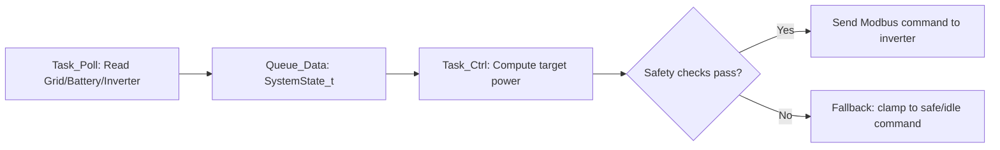

### Operation Modes Used by `Task_Ctrl`

| Mode | Trigger Condition (Typical) | Command Outcome |
| :--- | :--- | :--- |
| `DISCHARGE` | Grid import above configured upper limit and battery allows discharge | Reduce grid import |
| `CHARGE` | Grid import below lower threshold / valley period and battery allows charge | Store energy in battery |
| `IDLE/HOLD` | Grid already in band or constraints active | Keep command near zero/hold |
| `FORCED_SAFE` | Invalid telemetry, comm timeout, SoC/temperature/protection violation | Force safe command |

### What Checks Are Performed Before Sending Commands

`Task_Ctrl` should only transmit inverter setpoints after these checks:

1. **Telemetry freshness check:** Reject stale queue data / communication timeout.
2. **Power clamp check:** Clamp target setpoint to inverter and battery max charge/discharge limits.
3. **Battery protection check:** Enforce SoC, voltage, temperature, and current boundaries.
4. **Direction sanity check:** Never issue contradictory charge/discharge commands in same cycle.
5. **Rate-of-change check:** Ramp limit setpoint changes to avoid electrical shocks and chatter.
6. **Fail-safe check:** On any invalid state, send safe fallback (`IDLE` or conservative limit).

### Where Time-Based Control Fits

Time-based logic is optional on RTOS and can be added in increasing complexity:

| Level | Mechanism | Best For |
| :--- | :--- | :--- |
| L1 | FreeRTOS software timers | Relative durations (e.g., charge for 2 hours) |
| L2 | Internal STM32 RTC + `VBAT` | Local time-of-day windows (e.g., 02:00-05:00) |
| L3 | NTP sync via `Task_Net` + lightweight schedule from cloud | Accurate tariff windows and remote schedule updates |
| L4 | External RTC (DS3231) | High-accuracy deployments in harsh environments |

### Quick "Achieve vs Execute" Summary

| Question | RTOS Answer |
| :--- | :--- |
| What are we achieving? | Deterministic grid-limit control with safety-first battery dispatch |
| How do we do it? | `Task_Poll` acquires data -> `Task_Ctrl` decides -> inverter command dispatch |
| Type of operation? | Real-time closed-loop control (not long-horizon optimization) |
| What checks gate commands? | Freshness, clamps, battery protection, ramp-rate, fail-safe fallback |

### Decision Logic (Policy View, Not Task Wiring)

This is the actual control policy in plain decision terms.

1. Define a **system-level goal band** at the point of common coupling (grid meter):
   `P_grid_min <= P_grid_total <= P_grid_max`.
2. Compute error against that band using **aggregate power**, not per-device isolated values.
3. Convert error into one net battery/inverter target `P_cmd`.
4. Apply safety and hardware constraints.
5. Dispatch final command.

Policy equation:

```text
If P_grid_total > P_grid_max:
    P_cmd_raw = -(P_grid_total - P_grid_max)      # Discharge to shave import
Else if P_grid_total < P_grid_min:
    P_cmd_raw = +(P_grid_min - P_grid_total)      # Charge to absorb/export or valley-fill
Else:
    P_cmd_raw = 0                                 # Hold/idle in band

P_cmd = Clamp(P_cmd_raw, -P_discharge_limit, +P_charge_limit)
P_cmd = Apply_SOC_Temp_Current_Limits(P_cmd)
P_cmd = Apply_RampRate(P_cmd, prev_cmd)
If any invalid state: P_cmd = SAFE_FALLBACK
```

### System-Level Goal vs Device-Level Control

Our target is **not** "optimize one inverter in isolation." The target is: all connected assets work together to meet one site-level objective.

| Question | Control Policy Answer |
| :--- | :--- |
| What is optimized? | Site/grid boundary behavior (import/export envelope), not one device's local metric |
| What are actuators? | Battery/inverter charge-discharge commands (possibly split by phase/device downstream) |
| What is measured? | Aggregated telemetry: grid meter + inverter + battery constraints |
| What is success? | Grid remains in target band while all protection constraints remain valid |

### Are We Matching `cem-app` Goal Semantics?

Yes, **goal class is the same**, but implementation depth differs:

1. **Same objective class:** Keep site power within configured band using charge/discharge policy.
2. **Same mode semantics:** `IDLE`, `CHARGING`, `DISCHARGING`, balancing behavior.
3. **Same safety intent:** Clamp to constraints/limits before command dispatch.
4. **Different sophistication:**
   `cem-app` performs richer multi-phase scheduling and timeslot-aware policy orchestration.
   `ems-mini-rtos` performs faster deterministic edge enforcement with a reduced state model.

So the RTOS controller is aligned to the same business goal, acting as the real-time enforcement layer, while `cem-app` remains the policy-rich orchestrator.

### Reference: Linux `ems-app` vs RTOS `ems-mini-rtos`

| Aspect | Linux `ems-app` (i.MX93) | RTOS `ems-mini-rtos` (STM32) |
| :--- | :--- | :--- |
| Main style | Predictive + schedule-heavy | Deterministic + instantaneous |
| Data model | Large state + Redis + dynamic equations | Lightweight structs + static limits |
| Primary loop | Slower, feature-rich orchestration | Fast, safety-oriented control loop |
| Best use | Planning, cloud workflows, multi-phase policy | Real-time enforcement on field hardware |

---
<div align="center">
<i>Designed and Engineered by the EMS Firmware Team. Strictly Confidential.</i>
</div>


<a id="3"></a>
## 3. Hardware Selection: Why the STM32F407?

In a market saturated with microcontrollers, why did the team specifically select the STM32F407VGT6 for this Energy Management System?

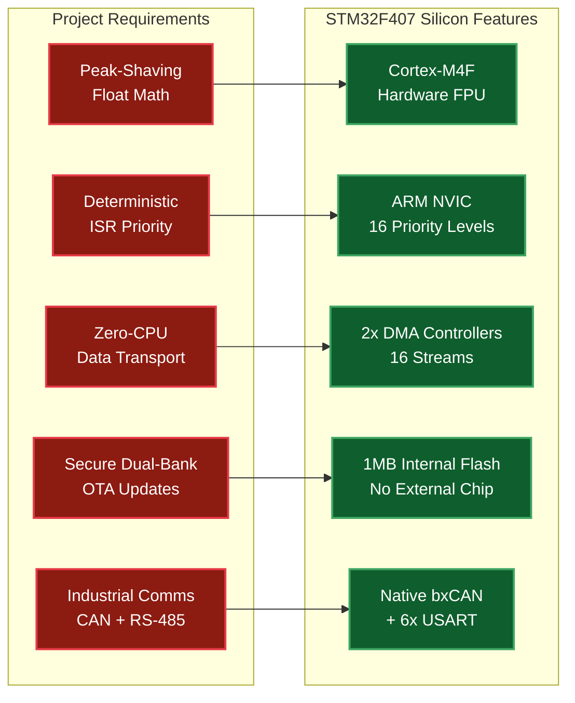

1. **Hardware Floating-Point Unit (FPU):** Peak-Shaving involves heavy algorithm tracking (`float` math). Standard microcontrollers do this matrix math in software, which is agonizingly slow. The F407's Cortex-M4F core calculates floats natively in silicon in a single clock cycle.
2. **Advanced Nested Vectored Interrupt Controller (NVIC):** We require absolute deterministic preemption. The ARM NVIC allows us to hardware-prioritize the CAN bus ISR *over* the Modbus DMA ISR, ensuring collisions are resolved mathematically by the silicon, not the RTOS.
3. **Extensive DMA Streams:** The chip has two robust DMA controllers with 16 separate streams. We uniquely offload the Modbus UART to one stream and the SPI W5500 transfers to another, completely unburdening the CPU.
4. **Massive 1MB Flash Storage:** This size allows us to perfectly split the memory map in half (Bank 1 / Bank 2) for our resilient dual-bank MCUboot OTA updates, without needing to solder a vulnerable external SPI flash chip.
5. **Native Industrial Peripherals:** The chip has a built-in bxCAN controller (for direct J1939 battery communication) and 6 USARTs (for Modbus RS-485). Cheaper chips often lack CAN entirely, forcing an external MCP2515 SPI module that adds cost, PCB space, and failure points.
6. **Industrial & Automotive Grade (AEC-Q100):** The STM32F407 family is available in **AEC-Q100 qualified** versions. This means the silicon has passed 10,000+ hours of rigorous stress testing (High Temperature Operating Life, Temperature Cycling) to guarantee reliability in harsh environments—critical for an EMS that must operate 24/7 for 10+ years in industrial electrical cabinets.

### 🔧 Deep Dive: What is the NVIC and Why Does "Hardware Prioritization" Matter?

**Common Engineering Question:** *"Point #2 mentions 'NVIC allows us to hardware-prioritize the CAN bus ISR over the Modbus DMA ISR, ensuring collisions are resolved mathematically by the silicon, not the RTOS.' What does this actually mean?"*

#### What is the NVIC?

The **Nested Vectored Interrupt Controller (NVIC)** is a **hardware block built directly into the ARM Cortex-M4 silicon**, completely separate from the FreeRTOS software scheduler. It manages all interrupt requests (IRQs) from peripherals like UART, CAN, DMA, Timers, etc.

Think of it as a **hardware traffic controller** that decides which interrupt gets CPU time when multiple peripherals fire simultaneously.

#### The Problem: Interrupt Collision (What Happens When Two Hardware Events Fire at the Same Nanosecond?)

Imagine this real-world scenario in our EMS:

1. **Modbus DMA** has just finished receiving a 256-byte grid meter response. The DMA controller fires an interrupt: `DMA1_Stream5_IRQn` to tell the CPU "I've got data ready!"
2. **At the exact same nanosecond**, a critical CAN frame arrives from the Battery BMS (SOC update, temperature alarm). The CAN peripheral fires: `CAN1_RX0_IRQn`.

**The question:** Which ISR (Interrupt Service Routine) gets to run first? If we pick wrong, the CAN FIFO could overflow (only 3 frames deep in silicon) and we'd lose a critical battery protection message.

#### What Non-NVIC Controllers Do (8-bit AVR, PIC, Simple ARM Cortex-M0)

**Important Clarification:** Microcontrollers without an NVIC (or with very basic interrupt controllers) typically have **NO programmable interrupt priority at all**.

**Three Common Architectures:**

**1. Fixed Priority by Vector Table Position (8-bit AVR, PIC16/PIC18)**

These chips use **positional priority**—the interrupt that appears first in the hardware vector table wins:

```
Memory Address    IRQ Vector           Priority (Unchangeable)
0x0000           RESET                 (highest - hardware enforced)
0x0002           External INT0         Priority 1 (always beats everything below)
0x0004           Timer0 Overflow       Priority 2
0x0006           UART RX               Priority 3
0x0008           ADC Complete          Priority 4 (lowest)
```

- **✗ Cannot be changed:** If you need UART to beat Timer0, you're out of luck—it's burned into silicon.
- **✗ No nested interrupts:** If Timer0 ISR is running and UART fires, UART must wait until Timer0 completely finishes.
- **✗ No hardware preemption:** All interrupt priority decisions must be made in software using flags.

**Example Problem:**
```c
// Timer0 ISR is running (doing 500 cycles of work)
ISR(TIMER0_OVF_vect) {
    for (int i = 0; i < 100; i++) {
        process_data[i] = calculate(i);  // Takes 500 CPU cycles
    }
}

// Meanwhile, critical UART byte arrives from CAN transceiver
// UART hardware sets IRQ flag, but CPU CANNOT preempt Timer0
// UART data sits in 1-byte buffer for 500 cycles...
// If another byte arrives before Timer0 finishes → OVERFLOW, data lost!
```

**2. Simple 2-Level Priority (Some ARM Cortex-M0)**

Cortex-M0 (the budget ARM core) has a stripped-down NVIC with **only 4 priority levels** (not 16 like M4):

- **✓ Limited programmable priority:** You can set priorities, but only 0-3 (2 bits)
- **✓ Nested interrupts supported:** But only 4 levels deep
- **✗ Less flexibility:** With only 4 levels, managing 10+ peripherals becomes difficult

**3. No Interrupt Controller (Cheap 8051, MSP430 Low-End)**

Some ultra-cheap chips have **zero interrupt priority logic**—all interrupts are the same priority:

- **First-come-first-served:** Whichever IRQ flag gets set first wins
- **No nesting:** Once an ISR starts, ALL other interrupts are blocked until it finishes
- **Software polling required:** The RTOS must manually poll flags to decide urgency

#### Hardware Solution: The ARM NVIC (What the STM32F407 Does)

The NVIC solves this **in pure hardware silicon** with these features:

**1. Programmable Priority Levels (0-15 on STM32F4)**

We can assign an exact numerical priority to every single interrupt source:

```c
// In our firmware initialization (main.c or stm32f4xx_it.c):

// CAN Bus RX Interrupt — HIGHEST hardware priority (most critical)
HAL_NVIC_SetPriority(CAN1_RX0_IRQn, 4, 0);  // Preempt priority = 4

// Modbus UART DMA RX Interrupt — LOWER hardware priority
HAL_NVIC_SetPriority(DMA1_Stream5_IRQn, 5, 0);  // Preempt priority = 5
```

**Lower number = Higher priority.** So CAN (priority 4) beats Modbus DMA (priority 5).

**2. Hardware Preemption (Nested Interrupts)**

If the Modbus DMA ISR is currently running (servicing the 256-byte Modbus response), and a CAN interrupt fires, the NVIC **automatically**:

1. **Saves the current Modbus ISR state** (registers R0-R3, R12, LR, PC, xPSR) onto the stack.
2. **Pauses the Modbus ISR** mid-execution (could be in the middle of a `for` loop parsing bytes).
3. **Immediately jumps to the CAN ISR** and gives it 100% CPU.
4. When the CAN ISR finishes (`return`), the NVIC **automatically resumes the Modbus ISR** exactly where it left off.

**All of this happens in hardware, in ~12-25 CPU cycles, with ZERO software intervention.**

**3. Deterministic Timing ("Mathematically by the Silicon")**

The phrase **"resolved mathematically by the silicon"** means:

- The decision is made by **comparing two binary numbers** (priority 4 vs priority 5) in a hardware comparator circuit.
- This comparison takes **exactly 1 clock cycle** (6 nanoseconds at 168 MHz).
- There is **zero jitter, zero unpredictability**.
- The outcome is **guaranteed by physics** — priority 4 will always preempt priority 5, regardless of what the RTOS software is doing.

Contrast this with a software-based approach where the RTOS must:
- Check interrupt flags in memory (`if (flagCAN || flagModbus)`)
- Run comparison logic (branching, loops)
- Adjust scheduling queues
- Context-switch tasks

This software path could take **hundreds or thousands of cycles** and varies based on cache state, compiler optimization, and RTOS load.

#### Why This Matters for Our EMS

Our system has time-critical requirements:

| Peripheral | Time Sensitivity | What Happens If Delayed? |
| :--- | :--- | :--- |
| **CAN Bus (Battery BMS)** | **Ultra-critical** | CAN FIFO is only 3 frames deep. If we don't read within ~600µs (at 500kbps), frames are lost. A lost SOC update could cause the controller to over-discharge the battery, triggering BMS emergency shutdown. |
| **Modbus DMA (Grid Meter)** | **Important but buffered** | DMA has a 256-byte buffer. The data is already in RAM. We can afford to delay parsing by 50-100µs without consequences. |
| **MQTT/TCP (Task_Net)** | **Low priority** | Cloud communication can tolerate milliseconds of latency. |

**The NVIC allows us to guarantee:** Even if a 256-byte Modbus frame just arrived and the CPU is parsing it, a critical CAN frame from the battery will preempt immediately, preventing data loss.

#### Real-World Example: Interrupt Collision Resolution

**Scenario:** At time `t = 0`:
- CPU is running `Task_Net` (low priority FreeRTOS task, doing JSON formatting)
- Modbus DMA finishes receiving grid meter data → `DMA1_Stream5_IRQn` fires (NVIC priority 5)
- **5 nanoseconds later:** CAN frame arrives from BMS → `CAN1_RX0_IRQn` fires (NVIC priority 4)

**Timeline (hardware-driven by NVIC):**

```
t=0ns:    Task_Net running (RTOS priority 24)
t=10ns:   DMA interrupt fires → NVIC priority 5
t=15ns:   NVIC hardware preempts Task_Net, saves context, jumps to DMA ISR
t=20ns:   DMA ISR starts running (reading DMA status registers)
t=25ns:   CAN interrupt fires → NVIC priority 4 (higher than 5!)
t=30ns:   NVIC hardware PREEMPTS the DMA ISR mid-execution
t=35ns:   NVIC saves DMA ISR context, jumps to CAN ISR
t=40ns:   CAN ISR executes (reads CAN FIFO, puts frame in FreeRTOS queue)
t=120ns:  CAN ISR finishes, returns
t=125ns:  NVIC automatically restores DMA ISR context
t=130ns:  DMA ISR resumes exactly where it was paused
t=450ns:  DMA ISR finishes, returns
t=455ns:  NVIC restores Task_Net context
t=460ns:  Task_Net resumes its JSON formatting
```

**Key point:** The CAN ISR interrupted the DMA ISR, which had already interrupted Task_Net. This is **nested interrupts** — impossible without hardware NVIC.

#### NVIC Priority vs FreeRTOS Task Priority (Critical Distinction)

| | NVIC Interrupt Priority | FreeRTOS Task Priority |
| :--- | :--- | :--- |
| **Managed by** | Hardware silicon (NVIC controller) | Software (FreeRTOS kernel) |
| **Controls** | Which ISR preempts which ISR | Which task gets CPU when no ISR is active |
| **Speed** | ~1 clock cycle (6ns at 168MHz) | ~125 cycles (0.75µs) via PendSV context switch |
| **Preemption** | Instant, mid-instruction | Only at RTOS scheduler ticks or blocking calls |
| **Our CAN priority** | NVIC priority 4 (hardware) | N/A — ISRs don't have task priority |
| **Our Task_Poll priority** | N/A — tasks don't have NVIC priority | `osPriorityRealtime` (FreeRTOS priority 48) |

**Both layers work together:**
1. **Hardware layer (NVIC):** Ensures CAN ISR beats Modbus DMA ISR when both fire simultaneously.
2. **Software layer (FreeRTOS):** Ensures Task_Poll beats Task_Net when both are ready to run.

#### Summary: Why We Need NVIC for Deterministic Real-Time Control

**Direct Answer:** *"So NVIC allows to set priority for IRQ, but it is not available in non-NVIC controller, is it?"*

**Correct!** Most non-NVIC controllers (8-bit AVR, PIC, basic ARM Cortex-M0) have **NO ability to set interrupt priority**—it's fixed in silicon by vector table position. The NVIC is what gives ARM Cortex-M3/M4/M7 their real-time capabilities.

| Feature | Without NVIC (8-bit AVR, PIC, Cortex-M0) | With NVIC (STM32F407 Cortex-M4) |
| :--- | :--- | :--- |
| **Programmable priority?** | ❌ **NO** — Fixed by hardware vector table | ✅ **YES** — 16 programmable levels (0-15) |
| **Runtime priority change?** | ❌ **NO** — Burned into silicon | ✅ **YES** — `HAL_NVIC_SetPriority()` |
| **Nested interrupts?** | ❌ **NO** — ISR runs to completion | ✅ **YES** — High-priority preempts low mid-execution |
| **Hardware preemption?** | ❌ **NO** — Software polls flags | ✅ **YES** — 1-cycle hardware comparator |
| **Collision resolution** | Software (100s of cycles, jitter) | Hardware (1 cycle, deterministic) |
| **Real-world result** | CAN FIFO overflow / data loss | CAN preempts Modbus instantly ✓ |

**This is what "resolved mathematically by the silicon, not the RTOS" means:** The decision happens in hardware comparator circuits using binary priority numbers, not in software `if` statements subject to cache misses and unpredictable latency.

### Why not a cheaper alternative?

| Feature | **STM32F407** (Selected) | **STM32F103** (Cheaper) | **ESP32** (Popular) |
| :--- | :--- | :--- | :--- |
| **Core** | **ARM Cortex-M4F** | **ARM Cortex-M3** | Xtensa LX6 @ 240 MHz |
| **Hardware FPU** | ✅ Yes (single-cycle) | ❌ No (software emulation) | ✅ Yes |
| **Flash** | 1 MB (internal) | 64–128 KB | 4 MB (external SPI) |
| **CAN Bus** | ✅ Native bxCAN | ✅ Native bxCAN | ❌ None (needs MCP2515) |
| **DMA Streams** | 16 streams | 7 channels (limited) | Limited, Wi-Fi contention |
| **CCM RAM** | ✅ 64 KB (zero wait-state) | ❌ None | ❌ None |
| **Industrial Cert** | ✅ AEC-Q100 qualified | ✅ Available | ❌ Consumer-grade |
| **Price (~1K units)** | ~$6.00 | ~$2.50 | ~$3.00 |
| **Verdict** | ✅ **Selected** | ❌ Flash too small, no FPU | ❌ No CAN, external Flash, not industrial |

### 🧠 Cortex-M3 vs. Cortex-M4: What's the real difference?

From a software perspective, the Cortex-M4 is an "Upgraded M3" with two critical silicon-level hardware blocks:

1.  **Hardware FPU (Floating Point Unit):** The "F" in M4F. The M3 must use a slow library of 100+ instructions to calculate a single decimal number like `Wattage = 240.5 * 10.2`. The M4 has a dedicated hardware math co-processor that does this in **one clock cycle**.
2.  **DSP & SIMD Instructions:** The M4 includes specialized instructions for **Digital Signal Processing** (like Multi-Accumulate in one cycle). This allows for lightning-fast power-quality analysis and filtering that would overwhelm an M3.

**The Verdict:** We chose the **Cortex-M4 (STM32F407)** because the EMS logic relies heavily on real-time floating-point math for peak-shaving. On an M3, our 1ms control loop would likely jitter or fail during heavy calculations.

### External Transceiver Chips (Why the STM32 can't drive the bus directly)

A common engineering question is: *"Can the STM32 talk directly to a CAN bus or RS-485 wire?"* The answer is **No.**

The STM32F407's internal peripherals (bxCAN, USART, SPI) output standard **3.3V CMOS logic levels** (0V = LOW, 3.3V = HIGH) on their GPIO pins. Industrial buses use completely different electrical signaling:

*   **CAN Bus** uses **differential signaling** (CAN-H and CAN-L wires). A logical `0` ("dominant") is CAN-H=3.5V & CAN-L=1.5V. A logical `1` ("recessive") is both wires at 2.5V. The STM32's GPIO pin physically cannot generate this.
*   **RS-485** also uses **differential signaling** (A and B wires). The voltage can swing from -7V to +12V over hundreds of meters of copper cable. A 3.3V GPIO would be instantly destroyed.
*   **Ethernet** requires a **PHY (Physical Layer)** chip and isolation magnetics to drive the 100BASE-TX twisted-pair signal at ±2.5V with Manchester encoding.

Therefore, we use dedicated **external transceiver ICs** soldered between the STM32 and the physical copper:

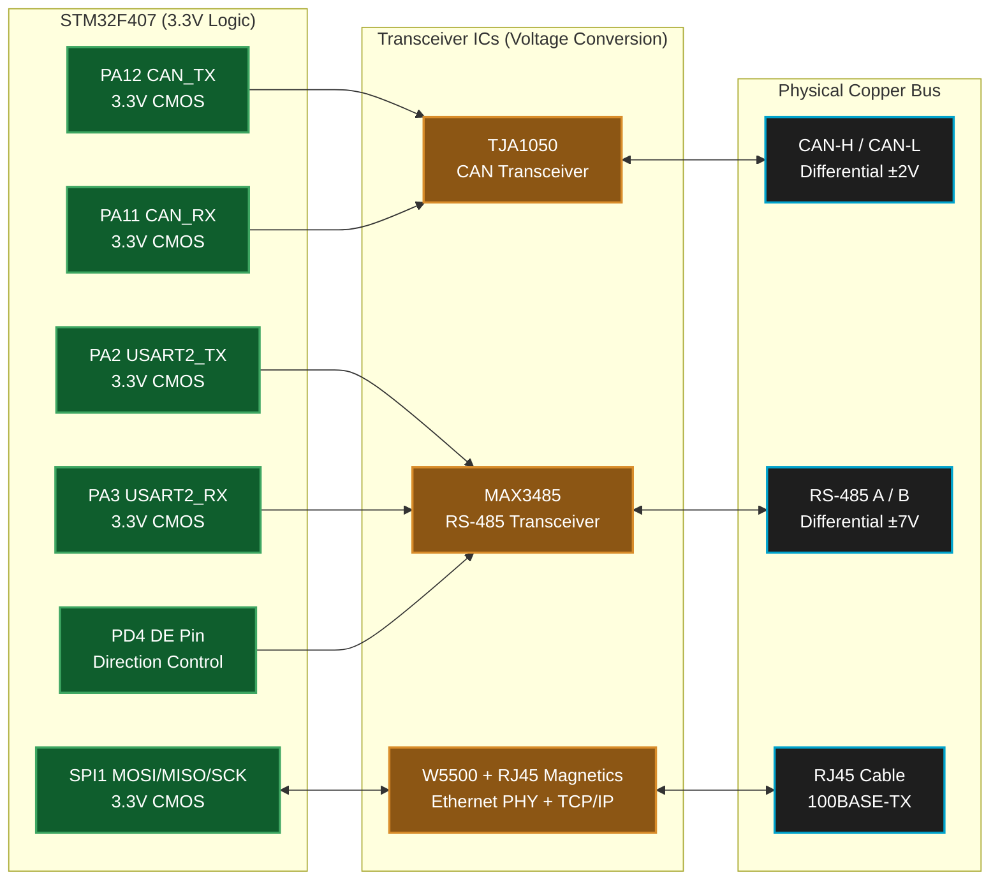

| Interface | STM32 Internal Peripheral | External Transceiver IC | What It Does | Approx. Cost |
| :--- | :--- | :--- | :--- | :--- |
| **CAN Bus** | `bxCAN` (built-in protocol engine) | **TJA1050** (NXP) | Converts 3.3V CAN_TX/RX logic to differential CAN-H/CAN-L voltages. Handles bus arbitration electrically. | ~$0.50 |
| **RS-485 Modbus** | `USART2` (built-in UART) | **MAX3485** (Maxim) | Converts 3.3V UART TX/RX to differential RS-485 A/B. The `DE` pin controls half-duplex direction (transmit vs receive). | ~$0.60 |
| **Ethernet** | `SPI1` (data bus only) | **W5500** (WIZnet) + RJ45 Jack with built-in magnetics | The W5500 is unique — it is not just a PHY. It contains a **full hardware TCP/IP stack** (MAC + PHY + IP + TCP + UDP) in silicon. The RJ45 jack includes galvanic isolation transformers to protect against ground loops. | ~$3.50 |

> 💡 **Key Point:** The STM32's `bxCAN` peripheral handles the **CAN protocol** (arbitration, bit stuffing, CRC, error frames) entirely in hardware. The TJA1050 only handles the **electrical signaling**. Without the TJA1050, the STM32 knows *what* to say but physically cannot *speak* on the bus.

### 🔌 The Relationship Between CAN and J1939

**Common Engineering Question:** *"Earlier we mentioned 'bxCAN controller for direct J1939 battery communication.' What exactly is J1939, and how does it relate to CAN?"*

This is a frequent point of confusion. **CAN and J1939 are NOT the same thing**—they operate at different layers of the communication stack.

#### CAN: The Physical & Data Link Layer (OSI Layer 1 & 2)

**CAN (Controller Area Network)** is a **low-level hardware protocol** developed by Bosch in the 1980s for automotive and industrial applications. It defines:

- **Physical electrical signaling:** Differential CAN-H/CAN-L voltages, twisted-pair cabling, 120Ω termination resistors
- **Bit timing & synchronization:** How to encode/decode bits at 125 kbps, 250 kbps, 500 kbps, or 1 Mbps
- **Frame structure:** Standard 11-bit or Extended 29-bit identifiers, 0-8 bytes of data per frame
- **Bus arbitration:** Non-destructive collision resolution (lower ID wins, higher ID backs off)
- **Error detection:** 15-bit CRC, acknowledgment bits, error frames and retransmission

**What CAN does NOT define:** It has **zero** understanding of what the data bytes actually mean. CAN doesn't know if byte 3 is "battery voltage" or "engine temperature"—it just moves raw bytes reliably.

Think of CAN as the **postal service**: it guarantees your envelope arrives uncorrupted, but it has no idea if the letter inside is written in English, Spanish, or binary sensor data.

#### J1939: The Application Layer Protocol (OSI Layer 7)

**J1939** is a **high-level application protocol** developed by SAE (Society of Automotive Engineers) specifically for **heavy-duty vehicles** (trucks, buses, agricultural equipment, marine engines, **and industrial battery systems**).

J1939 defines:

- **Parameter Group Numbers (PGNs):** Standardized message IDs that map to specific data types
  - Example: `PGN 65271` = "Vehicle Electrical Power #3" (battery voltage, current, temperature)
  - Example: `PGN 65253` = "Engine Hours, Revolutions" 
- **Suspect Parameter Numbers (SPNs):** The exact byte positions and scaling factors for each sensor reading
  - Example: `SPN 168` = "Battery Potential/Power Input 1" (voltage in 0.05V per bit resolution, offset -1600V)
- **Source addresses:** Device identification (Engine=0, Transmission=3, Battery=specific address range)
- **Multi-packet transport:** How to break large messages (>8 bytes) into multiple CAN frames and reassemble them
- **Diagnostic Trouble Codes (DTCs):** Standardized fault reporting

**What J1939 does NOT define:** It has **zero** understanding of voltages, wire colors, or bit rates—it assumes CAN is already working underneath.

Think of J1939 as the **language and grammar rules** for what to write inside the envelope. It says "battery voltage goes in bytes 3-4, scaled by 0.05V."

#### The Stack Relationship (How They Work Together)

```
┌─────────────────────────────────────────────────────────┐
│  Application Layer (Our Firmware)                       │
│  ─ bms_can.c: reads SPN 168 (battery voltage)          │
│  ─ bms_can.c: reads SPN 158 (SOC percentage)           │
│  ─ Parses J1939 PGN 65271 multi-byte structure         │
└─────────────────────────────────────────────────────────┘
                        ▲
                        │ (J1939 defines WHAT the data means)
                        ▼
┌─────────────────────────────────────────────────────────┐
│  J1939 Protocol Layer                                   │
│  ─ PGN encoding/decoding                                │
│  ─ 29-bit Extended CAN ID = Priority + PGN + Source    │
│  ─ Multi-packet transport (BAM, CMDT)                  │
│  ─ Address claiming                                     │
└─────────────────────────────────────────────────────────┘
                        ▲
                        │ (Carried as payload inside CAN frames)
                        ▼
┌─────────────────────────────────────────────────────────┐
│  CAN Protocol Layer (bxCAN hardware in STM32)          │
│  ─ 29-bit identifier: 0x18FEF700 (example J1939 PGN)   │
│  ─ Data Length Code (DLC): 8 bytes                     │
│  ─ Data payload: [0x4B, 0x1E, 0xFF, 0x64, ...]        │
│  ─ 15-bit CRC, ACK slot, error frames                  │
└─────────────────────────────────────────────────────────┘
                        ▲
                        │ (CAN defines HOW bits are transmitted)
                        ▼
┌─────────────────────────────────────────────────────────┐
│  Physical Layer (TJA1050 transceiver)                  │
│  ─ Differential CAN-H/CAN-L voltages                   │
│  ─ 500 kbps bit rate                                    │
│  ─ Twisted-pair cable, 120Ω termination                │
└─────────────────────────────────────────────────────────┘
```

#### Real-World Example: Reading Battery State-of-Charge (SOC)

**Without J1939 (Raw CAN — Would Require Reverse Engineering):**
```
CAN Frame received:
  ID: 0x18FEF700 (what does this ID mean? no idea!)
  Data: [0x4B, 0x1E, 0xFF, 0x64, 0x00, 0x00, 0xFF, 0xFF]
  
  Question: Which bytes are SOC? How do I convert to percentage?
  Answer: You'd need the BMS manufacturer's proprietary manual, 
          and the protocol could change with firmware updates.
```

**With J1939 (Standardized Protocol):**
```
J1939 PGN 65271 (0xFEF7) = "Vehicle Electrical Power #3"
  Source Address: 0x00 (Battery BMS)
  Priority: 6 (medium)
  
  SPN 158 (Battery State of Charge):
    Location: Bytes 1-2
    Data: 0x4B1E = 19230 decimal
    Scaling: 0.4% per bit
    Formula: SOC = 19230 × 0.4% = 76.92% ← Battery is at 77% charge!
  
  SPN 168 (Battery Voltage):
    Location: Bytes 3-4
    Data: 0xFF64 = 65380 decimal
    Scaling: 0.05V per bit, offset -1600V
    Formula: Voltage = (65380 × 0.05) - 1600 = 1669V ← High-voltage battery pack
```

**Code Implementation in Our Firmware:**
```c
// In bms_can.c — J1939 PGN 65271 decoder
void decode_j1939_battery_power(uint8_t data[8]) {
    // Extract SPN 158 (SOC) from bytes 1-2 (big-endian)
    uint16_t soc_raw = (data[1] << 8) | data[2];
    float soc_percent = soc_raw * 0.4;  // J1939 scaling factor
    
    // Extract SPN 168 (Voltage) from bytes 3-4
    uint16_t voltage_raw = (data[3] << 8) | data[4];
    float voltage_V = (voltage_raw * 0.05) - 1600.0;  // J1939 offset
    
    // Now we have standardized battery data!
    BatteryState_t bms_state = {
        .soc_percentage = soc_percent,
        .voltage_V = voltage_V,
        // ... etc
    };
}
```

#### Why Do We Use J1939 for Battery Communication?

| Reason | Benefit for EMS |
| :--- | :--- |
| **Industry standard** | Battery BMS vendors (LG Chem, CATL, BYD, Pylontech) already implement J1939 natively—no custom protocol development needed |
| **Interoperability** | We can swap battery brands without rewriting firmware (as long as they follow J1939 spec) |
| **Rich diagnostics** | J1939 includes built-in fault codes (DTCs), allowing us to detect "cell imbalance," "over-temperature," "contactor failure" via standardized error messages |
| **Multi-packet support** | J1939 handles messages >8 bytes automatically (e.g., reading all 16 cell voltages requires 32+ bytes, split across multiple CAN frames) |
| **Proven reliability** | J1939 has been battle-tested in heavy-duty trucks for 30+ years in extreme environments (vibration, EMI, temperature) |

#### Summary Table: CAN vs J1939

| Aspect | CAN (Controller Area Network) | J1939 (SAE Standard) |
| :--- | :--- | :--- |
| **Layer** | Physical + Data Link (OSI Layer 1-2) | Application (OSI Layer 7) |
| **What it defines** | Voltages, bit rates, frame structure, arbitration | Data meaning, scaling, PGNs, SPNs, units |
| **Analogy** | The postal service (delivers envelopes reliably) | The language inside the letter (English grammar, vocabulary) |
| **Example output** | "I received 8 bytes: [0x4B, 0x1E, ...]" | "Battery SOC = 77%, Voltage = 1669V" |
| **Implemented by** | STM32 bxCAN hardware + TJA1050 transceiver | Software in our firmware (`bms_can.c` decoder) |
| **Used in** | Automotive, industrial machinery, robotics | Heavy-duty vehicles, marine engines, **battery systems** |
| **Flexibility** | Generic—works for any application | Specific—optimized for vehicle/energy systems |

#### Where J1939 is Used in Our EMS

In our architecture, we use J1939 **only for battery BMS communication**, because:

1. Industrial battery packs (especially high-voltage lithium-ion) come with BMS controllers that broadcast J1939 natively
2. Grid meters and inverters use **Modbus RTU** instead (older, more universal protocol for power electronics)
3. The STM32's bxCAN hardware makes receiving/parsing J1939 trivial (no external protocol chip needed)

**Our CAN configuration for J1939:**
- **Bit rate:** 500 kbps (J1939 heavy-duty standard)
- **ID type:** Extended 29-bit CAN IDs (required by J1939)
- **Termination:** 120Ω resistors at both ends of the bus
- **Hardware filters:** We configure the STM32 bxCAN to accept only PGNs 65271, 65253, etc., and reject everything else to prevent FIFO overflow

<a id="4"></a>
## 4. Estimated Hardware & Bill of Materials (BOM) Cost

When designing an industrial-grade EMS controller for mass production, keeping hardware costs low while maintaining strict reliability is crucial. The strategic move from an Embedded Linux i.MX93 processor (which requires expensive DDR RAM, PMICs, and eMMC) down to a bare-metal RTOS on the STM32 brings a massive cost reduction.

**Estimated Cost Breakdown (Per Board at 1K+ Unit Volume):**

1. **Microcontroller (STM32F407VGT6):** ~$6.00
   * Provides FPU, CAN, Modbus DMA, and 1MB Flash natively without needing external memory chips.
2. **Ethernet Controller & Magnetics (W5500 + RJ45 Jack):** ~$3.50
   * The W5500 integrates the silicon TCP/IP stack; the RJ45 jack includes built-in isolation magnetics.
3. **Industrial Transceivers (RS-485 & CAN):** ~$1.50
   * E.g., MAX3485 (RS-485) and TJA1050 (CAN) to drive the physical copper lines.
4. **Power Supply & Line Isolation (DC-DC / Opto-isolators):** ~$3.00
   * Dropping 24V industrial rails down to clean 3.3V for the STM32, plus electrical isolation for the communication pins to protect against facility ground loops.
5. **Passive Components & Connectors:** ~$4.00
   * Trace routing resistors, filter capacitors, crystal oscillators, and secure Phoenix Contact screw terminals for physical wire landings.
6. **Blank PCB & Factory Assembly (PCBA):** ~$7.00
   * 4-layer FR4 industrial PCB with automated Pick-and-Place (SMT) fabrication.

**Total Hardware BOM Cost:** **Roughly $25.00 per unit**

By utilizing FreeRTOS instead of Embedded Linux, we achieved a purely deterministic, hard real-time energy controller for **under $30 total hardware cost**, completely destroying the $100+ manufacturing cost of a full System-on-Module (SoM) Linux stack.

### Recommended Development Kits for Prototyping
If you need to rapidly prototype this stack or debug the algorithms without waiting for a custom PCBA, we highly recommend the following off-the-shelf development hardware:

1. **The Core Module (MCU):** The **STM32F407G-DISC1** (formerly STM32F4Discovery). 
   * *Why:* It features the exact `STM32F407VGT6` chip used in production. Uniquely, it has a built-in **ST-LINK/V2-A** debugger onboard, allowing you to use GDB hardware breakpoints over USB instantly. Cost: ~$25.
2. **The Networking Module:** Any standard **WIZnet W5500 SPI Ethernet Breakout Board** (e.g., from Waveshare or generic vendors). Connect this to SPI1 or SPI2 on the Discovery board. Cost: ~$5.
3. **The Industrial Comms:** Generic 3.3V UART-to-RS485 modules (using `MAX3485`) and CAN transceivers (using `TJA1050`). Cost: ~$3.

This allows the entire firmware stack (including the custom `ims-rtos-mini` code, FreeRTOS, and MCUboot OTA) to be tested verbatim on a desk for under $35!

---

<a id="5"></a>
## 5. Project Design & Team Methodology

From a corporate team perspective, architecting a bare-metal RTOS from scratch requires extreme discipline. We built this step-by-step:

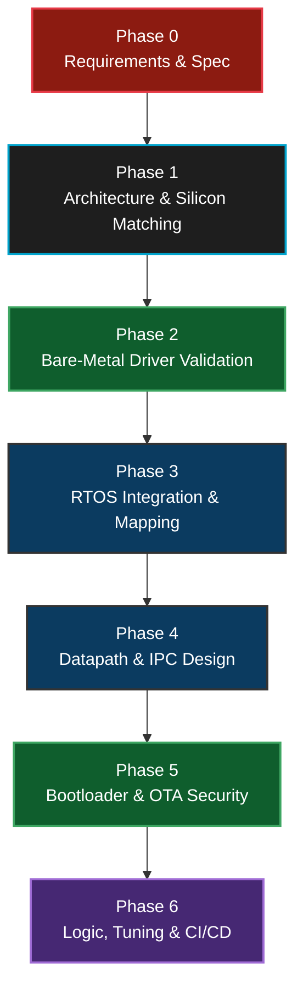

0. **Phase 0: Requirements Gathering & System Specification:** Before writing a single line of C code, product owners gathered the physical and financial constraints. The system needed strict deterministic safety to prevent physical grid overloads (nanosecond response times required), had to handle highly-noisy electrical environments, support secure OTA updates, interface with RS-485/CAN natively, and completely fit within a Sub-$35 Bill of Materials. Embedded Linux was ruled out due to cost, and the "RTOS + Microcontroller" directive became the foundational requirement constraint.
1. **Phase 1: Architecture & Hardware Selection:** The systems team mapped the software specifications to physical silicon. We selected the STM32F407 due to its mature HAL, FPU (to instantly crunch solar peak shaving math), massive 1MB internal flash (for dual-bank security), and multiple simultaneous DMA streams.
2. **Phase 2: Bare-Metal Driver Validation:** Before ever activating FreeRTOS, the firmware team wrote standalone, isolated drivers. We proved the W5500 SPI chip could ping a cloud server, and we proved the CAN mailbox could read raw battery data without OS overhead.
3. **Phase 3: RTOS Integration & Task Mapping:** We introduced FreeRTOS and rigidly defined the 3-Task Topology (`Poll`, `Ctrl`, `Net`). We mapped the prior standalone drivers into these isolated thread spaces.
4. **Phase 4: Datapath & IPC Design:** We defined the exact structure of `SystemState_t` and `CloudCommand_t`, routed them through FreeRTOS Queues, and instituted a "Zero Global Variable" policy.
5. **Phase 5: Bootloader & OTA:** We integrated MCUboot, partitioned the Flash memory into A/B dual banks, and proved we could securely update the application safely via Cryptographic Verification.
6. **Phase 6: Logic, Tuning, & CI/CD:** We integrated the Peak-Shaving algorithms inside `Task_Ctrl` and wired the Git repository directly to an automated CI/CD pipeline.

---

<a id="6"></a>
## 6. C Code to Silicon: The Build Flow & Linker Mapping

To bridge the gap between high-level C logic and physical STM32 hardware execution, we rely on the GNU GCC toolchain. This is a multi-phase compilation process, meticulously mapped by the Linker Script.

### The 4-Phase Compilation Workflow
1.  **Preprocessor (`arm-none-eabi-cpp`):** Strips all comments, expands `#define` macros (e.g., translating `MAX_INVERTER_WATTAGE` to `3000`), and copies all `#include <stm32f4xx.h>` header files directly into the raw source code.
2.  **Compiler (`arm-none-eabi-gcc`):** Analyzes the raw C code, checks it against MISRA-C/custom standards, and translates the human-readable logic into native ARM Cortex-M4 Assembly instructions (`.s` files). We compile with the `-O2` flag to heavily optimize the instructions for computational speed.
3.  **Assembler (`arm-none-eabi-as`):** Converts the ARM Assembly into physical machine code (1s and 0s). This outputs unlinked Object files (`.o`).
4.  **Linker (`arm-none-eabi-ld`):** The most critical embedded step. The linker takes all the floating `.o` files, the FreeRTOS OS libraries, and the STM32 HAL libraries, and physically maps them to specific transistor addresses inside the STM32's memory based strictly on the **Linker Script (`STM32F407VGTX_FLASH.ld`)**. It produces the final executable `.elf` and `.bin` payloads.

### Build Output Artifacts (What the toolchain produces)

After a successful build, the GCC toolchain generates several output files. Each file serves a distinct purpose in the embedded workflow:

| Output File | What It Contains | When You Use It | How To Inspect It |
| :--- | :--- | :--- | :--- |
| **`.elf`** | The complete executable with **all debug symbols**, function names, variable names, source file mappings, and section addresses. This is the "master" build output. | **Debugging only.** You load this into GDB / STM32CubeIDE for hardware breakpoints, step-through debugging, and live variable inspection. It is **never** flashed to production boards (too large, contains secrets). | `arm-none-eabi-readelf -h app.elf` (shows ELF header) | 
| **`.bin`** | A **raw binary image** — pure machine code bytes with zero metadata, headers, or debug symbols. Byte 0 of the file maps directly to the first Flash address. | **Flashing & OTA.** This is the file you flash via `st-flash write app.bin 0x08040000` and the file you sign with `imgtool` for secure OTA. It is the **production deliverable.** | `arm-none-eabi-size app.elf` (shows .text/.data/.bss sizes) or `ls -lh app.bin` (shows raw file size in bytes) |
| **`.hex`** | An Intel HEX formatted text file. Each line is a human-readable ASCII record containing the target address and the data bytes to write there. | **STM32CubeProgrammer GUI.** The GUI tool prefers `.hex` because it contains embedded address info — you don't need to manually type `0x08040000`. Also used by some factory programmers. | `head -5 app.hex` (shows the first 5 address records) |
| **`.map`** | A detailed **linker map report**. Lists every single function, variable, and library — showing its exact memory address, size in bytes, and which `.o` file contributed it. | **Memory debugging & optimization.** If your binary is too large, open the `.map` file to find which function or library consumes the most Flash. Also confirms your linker script placed code at the correct addresses. | `grep -i "Task_Poll" app.map` (finds where Task_Poll lives in memory) |
| **`.list`** | A **disassembly listing** — the final ARM assembly instructions alongside the original C source lines. | **Low-level debugging.** When you suspect the compiler generated incorrect code (e.g., FPU not being used), you check the `.list` to see the actual ARM instructions. | `arm-none-eabi-objdump -d app.elf > app.list` (generates the listing) |

**Quick verification commands after every build:**
```bash
# 1. Check total Flash and RAM usage (most important command!)
arm-none-eabi-size build/ems_rtos.elf
#   text    data     bss     dec     hex filename
#  68432    1204    9856   79492   13684 build/ems_rtos.elf
#   ↑ Flash  ↑ Flash  ↑ RAM

# 2. Verify the .bin file size fits in Bank 1 (must be < 384KB = 393216 bytes)
ls -l build/ems_rtos.bin

# 3. Confirm the Entry Point address matches our linker script (should be 0x08040xxx)
arm-none-eabi-readelf -h build/ems_rtos.elf | grep "Entry point"

# 4. Find the biggest functions consuming Flash (top 10)
arm-none-eabi-nm --size-sort --reverse-sort build/ems_rtos.elf | head -10
```

### Linker Script & Memory Partitioning Modifications
In a standard bare-metal project, the Linker Script instructs the CPU to place the main application right at the beginning of Flash memory (`0x08000000`). However, because we integrated **MCUboot (The Bootloader)**, we had to fundamentally rewrite the Linker Script and memory management logic.

#### Standard Project (No Bootloader) vs. Our Project (With MCUboot)

In a **standard** STM32 project (no bootloader), you compile *one single `.elf` file* which the linker places directly at `0x08000000`. The CPU resets, reads the vector table from `0x08000000`, and directly executes your application. Simple.

In **our project**, we have **two completely separate firmware projects**, each compiled independently into its own `.elf` and `.bin`:

### ❓ Why isn't a bootloader "standard" in RTOS?

In the Embedded Linux world (i.MX93), a bootloader like **U-Boot** is **mandatory**. The CPU cannot run Linux directly from power-on because Linux needs a complex environment (DRAM initialized, filesystem mounted, kernel loaded into RAM). 

In the RTOS/MCU world (STM32), a bootloader is **optional**. 
*   **XIP (Execute-In-Place)**: The STM32 hardware is hard-wired to look at address `0x08000000` (Flash) on reset. If your app is there, it runs immediately. 
*   **Simplicity**: Most hobbyist or simple IoT projects avoid bootloaders to save Flash space and complexity.

### 🛡️ Why did we move to MCUboot? (The Industrial Requirement)

We added **MCUboot** specifically to satisfy **IEC 62061** and commercial security requirements:
1.  **Image Authentication**: Without a bootloader, the STM32 will run *anything* flashed to it (including malicious code). MCUboot checks a cryptographic signature before letting the app run.
2.  **Resilient OTA**: If an update fails mid-way, a standard project "bricks." MCUboot allows us to "swap back" to the previous working version automatically.

### 🔄 Hardware Reset Flow: Standard vs. Our Project

| Step | **Standard RTOS Project** | **Our EMS Project (With MCUboot)** |
| :--- | :--- | :--- |
| **0ms (Reset)** | Hardware jumps to `0x08000000`. | Hardware jumps to `0x08000000`. |
| **1ms** | **Reset_Handler** for the App runs. | **Reset_Handler** for **MCUboot** runs. |
| **10ms** | App initializes C environment. | MCUboot verifies the app signature at `0x08040000`. |
| **50ms** | `osKernelStart()` → App Running. | MCUboot jumps to `0x08040000`. |
| **60ms** | — | **Reset_Handler** for the App runs. |
| **100ms** | — | `osKernelStart()` → App Running. |

### 🔨 How we generated the Bootloader vs. App

To achieve this, we had to "decouple" the project into two binaries that can never overlap:

1.  **Generating MCUboot**: We used the open-source MCUboot project, configured it for the STM32F407 memory map, and compiled it into `mcuboot.bin`. This project's linker script is hard-coded to origin `0x08000000`.
2.  **The App Change**: We modified our EMS project's Linker Script (`STM32F407VGTX_FLASH.ld`) to **NOT** start at `0x08000000`. We shifted it to `0x08040000` so we don't overwrite the bootloader.
3.  **The "Magic Trailer"**: At the very end of our App binary, we added 4096 bytes of metadata (the trailer) which contains the digital signature and "Image OK" flags that MCUboot reads.

Each binary is a separate project. At the factory, we flash **both** using two commands, creating a secure trust chain.

### 📂 Why doesn't this folder contain MCUboot?

In a professional energy project, we use a **"Separation of Concerns"** repository strategy:

1.  **Application Repo (`/ems-mini-rtos`)**: This is what you have open. It contains the FreeRTOS tasks, the Modbus logic, and the Cloud connectivity.
2.  **Product Security Repo (Separate)**: This contains the MCUboot source code and, most importantly, the **Private Signing Keys**. 

**Why separate them?**
If a developer accidentally pushes a bug to the application, it only affects the app. However, if the **Bootloader** is corrupted or the **Private Keys** are leaked because they were in the same folder, the entire security of the product is destroyed. By keeping the bootloader in a separate, restricted repository, we ensure the "Root of Trust" is protected from accidental day-to-day code changes in the application.

### ❓ So how do I build the whole thing from scratch?

1.  **Obtain `mcuboot.bin`**: This is usually provided as a pre-built binary by the security architect or built from a separate specialized repository.
2.  **Build our App**: In this directory, run your CubeIDE build to get `ems_rtos.bin`.
3.  **Sign it**: Use `imgtool` to merge your app with the security metadata.
4.  **Flash**: Flash both binaries (Bootloader at `0x08000000`, Signed App at `0x08040000`).

### 🔐 The Mechanics of Asymmetric Trust

You asked: *"How does downloading a binary secure the project with our keys?"*

The answer lies in **Asymmetric Cryptography** (ECDSA P-256). We use a pair of keys that are mathematically linked but functionally separate:

1.  **The Public Key (`root-ec-p256.pub`)**: This is baked **inside** the `mcuboot.bin`. It is like a "Lock." It can be shared and seen by anyone, but it cannot be used to sign anything.
2.  **The Private Key (`root-ec-p256.pem`)**: This is kept secret on your build server or local machine. It is the only "Key" that can open the lock.

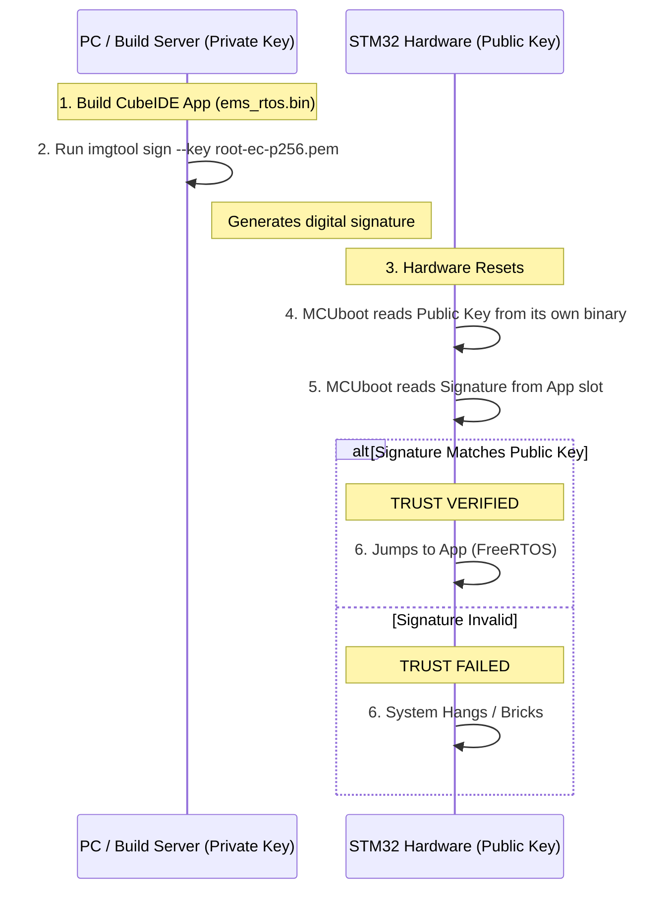

### ❓ Does just "downloading" mcuboot.bin work?

**Only if the Public Key inside that binary matches the Private Key you used to sign the app.** 

When we say "download the binary," we mean obtaining a version of MCUboot that was compiled specifically for your organization's security profile. If you download a generic `mcuboot.bin` from the internet, it won't have your key, and it will reject your signed app every time.

**The Provisioning Flow:**
1.  **Creation**: Use OpenSSL to generate a new key pair.
2.  **Embedding**: Put the **Public Key** into the MCUboot source code and compile `mcuboot.bin`.
3.  **Deployment**: Flash this "Customized" `mcuboot.bin` to the STM32. Now that chip is "Tied" to your organization.
4.  **Signing**: Every time you build your app, use the **Private Key** to sign it.
5.  **Success**: Since the hardware has the matching Public Key, it will trust your app forever.

```
 Flash Memory Map (1MB = 0x08000000 to 0x080FFFFF)
 ═══════════════════════════════════════════════════════════════════
 
 ┌─────────────────────────────────────────┐ 0x08000000
 │  mcuboot.bin (Bootloader)               │  ← Separate project, separate .elf
 │  - Own vector table at 0x08000000       │     Flashed FIRST at the factory
 │  - ECDSA P-256 public key embedded      │     st-flash write mcuboot.bin 0x08000000
 │  - OTA swap engine + scratch logic      │
 │  ~45 KB used out of 64 KB allocated     │
 ├─────────────────────────────────────────┤ 0x08010000
 │  (Unused padding to align sectors)      │
 ├─────────────────────────────────────────┤ 0x08020000
 │  Scratch / Swap Sector                  │  ← MCUboot uses this for partition swaps
 │  128 KB reserved                        │
 ├═════════════════════════════════════════┤ 0x08040000  ← OUR APP STARTS HERE
 │  ems_rtos_signed.bin (FreeRTOS App)     │  ← Separate project, separate .elf
 │  - Own vector table at 0x08040000       │     Flashed SECOND at the factory
 │  - FreeRTOS kernel + all tasks          │     st-flash write ems_rtos_signed.bin 0x08040000
 │  - HAL drivers, W5500, MQTT             │
 │  ~70 KB used out of 384 KB allocated    │
 │  BANK 1 (Active Application Slot)       │
 ├─────────────────────────────────────────┤ 0x080A0000
 │  BANK 2 (OTA Download Slot)             │  ← Incoming firmware lands here via OTA
 │  384 KB (mirror of Bank 1)              │
 └─────────────────────────────────────────┘ 0x080FFFFF
```
### 🛠️ The 3-Stage Development Workflow

One of the most common points of confusion is: *"I only see one project in STM32CubeIDE. Where is the bootloader code?"*

In a professional industrial setup, the **Bootloader** and the **Application** are two strictly separate entities. You do not build them at the same time.

#### Stage 1: The MCUboot Project (The Gatekeeper)
*   **Where is it?** It lives in a separate folder (`/bootloader/mcuboot`) or a separate Git submodule.
*   **Is it in `/ems-mini-rtos`?** **No.** Your current directory contains only the Application code. 
*   **Build Method**: You open this as its own workspace in CubeIDE or build it via a `Makefile`. It contains the logic to verify signatures and the **Public Key** (`root-ec-p256.pub`).
*   **Update Frequency**: You build and flash this **ONCE** during factory provisioning. It rarely changes.
*   **Flashing**: `st-flash write mcuboot.bin 0x08000000`

#### 🔧 Step-by-Step: Building MCUboot from Source

These are the complete, concrete steps for building and provisioning MCUboot to an STM32F407 board. Run these once per key pair / per product variant.

**Prerequisites:** Python 3.7+, CMake 3.15+, ARM GCC toolchain (`arm-none-eabi-gcc`), `st-flash` (from [stlink](https://github.com/stlink-org/stlink)) or STM32CubeProgrammer.

```bash
# ─────────────────────────────────────────────────────────────────
# STEP 1: Install the imgtool Python utility
# ─────────────────────────────────────────────────────────────────
pip install imgtool

# Verify the install
imgtool version

# ─────────────────────────────────────────────────────────────────
# STEP 2: Clone the MCUboot repository
# ─────────────────────────────────────────────────────────────────
git clone https://github.com/mcu-tools/mcuboot.git
cd mcuboot
git checkout v1.9.0          # Pin to a stable release

# Install Python script dependencies (imgtool, cryptography, etc.)
pip install -r scripts/requirements.txt

# ─────────────────────────────────────────────────────────────────
# STEP 3: Generate the ECDSA P-256 key pair (one-time, offline)
# ─────────────────────────────────────────────────────────────────
imgtool keygen -k root-ec-p256.pem -t ecdsa-p256

# ⚠️  NEVER commit root-ec-p256.pem to version control.
#     Store it in a hardware security module (HSM) or encrypted offline vault.
#     Anyone who obtains this file can sign firmware your device will trust.

# ─────────────────────────────────────────────────────────────────
# STEP 4: Extract the public key as a C source file for embedding
# ─────────────────────────────────────────────────────────────────
imgtool getpub -k root-ec-p256.pem > root-ec-p256-pub.c

# This produces a .c file, NOT a .pem / .der / .bin. See explanation below.
```

> **❓ Why is the public key a `.c` file, not a `.pem`, `.der`, or `.h`?**
>
> This is one of the most common points of confusion for engineers new to MCUboot. The answer lies in how bare-metal firmware is built and how data ends up inside a microcontroller.
>
> **There is no filesystem on the STM32 at runtime.** Unlike a Linux system where MCUboot could call `fopen("root-ec-p256-pub.pem")` at runtime, the STM32 has no OS, no filesystem, and no storage abstraction. Every piece of data the firmware needs must be **compiled and linked directly into the binary** before the chip ever powers on.
>
> The only mechanism GCC/ARM linker understands for doing that is **a C source file** that declares the data as a constant array. The resulting bytes get placed in the `.rodata` (read-only data) section of the ELF, which the linker then burns into Flash alongside the rest of the MCUboot code.
>
> **What `imgtool getpub` actually generates:**
> ```c
> // root-ec-p256-pub.c  ← generated by: imgtool getpub -k root-ec-p256.pem
> // This is NOT a .pem (base64 text with headers).
> // It IS the raw 64-byte ECDSA P-256 public key encoded as a C byte array.
>
> const unsigned char ecdsa_pub_key[] = {
>     0x04,                          // Uncompressed point prefix (always 0x04 for P-256)
>     // X coordinate (32 bytes):
>     0xab, 0x3c, 0x1f, 0x72, 0x8e, 0x44, 0xd0, 0x91,
>     0x5b, 0xf2, 0xa0, 0x7c, 0x33, 0xe8, 0x17, 0x6d,
>     0xc4, 0x09, 0xfa, 0x55, 0x2b, 0x67, 0x11, 0x3e,
>     0x88, 0x0d, 0xca, 0x51, 0x99, 0xf7, 0x63, 0x2a,
>     // Y coordinate (32 bytes):
>     0x17, 0x5e, 0x8b, 0x3a, 0xcc, 0x71, 0x04, 0xde,
>     0xf0, 0x22, 0x9c, 0x48, 0x0a, 0x7b, 0x55, 0xb1,
>     0x3d, 0x88, 0xc6, 0xf9, 0x14, 0x02, 0xec, 0xa0,
>     0x6e, 0x31, 0x57, 0x8d, 0x4b, 0x79, 0xd2, 0x05,
> };
> const unsigned int ecdsa_pub_key_len = sizeof(ecdsa_pub_key);  // = 65 bytes
> ```
>
> **Contrast with the other formats and why they cannot be used:**
>
> | Format | Extension | What it contains | Why it can't be used on STM32 |
> | :--- | :--- | :--- | :--- |
> | PEM | `.pem` | Base64-encoded DER + `-----BEGIN...-----` text headers | Text file — no filesystem to open it; requires a Base64 decoder and ASN.1 parser at runtime (hundreds of KB of code) |
> | DER | `.der` | Binary ASN.1-encoded key structure | Raw binary blob — the linker has no way to place an arbitrary binary file at a known symbol address without a custom linker section trick; also needs ASN.1 parsing |
> | Raw binary | `.bin` | 65 raw key bytes | Could work with `objcopy --add-section`, but then you lose the named C symbol (`ecdsa_pub_key[]`) that MCUboot's source code directly references by name |
> | **C source** | **`.c`** | **Raw bytes declared as a named `const uint8_t[]`** | **✅ GCC compiles it → linker places it in `.rodata` → it lands in Flash → MCUboot reads it by symbol name — zero overhead, zero parsing** |
>
> **How it ends up in Flash:** When CMake builds MCUboot, `root-ec-p256-pub.c` is compiled like any other `.c` file in the project. GCC emits an object file (`.o`) with a `.rodata` section containing the 65 raw key bytes. The ARM linker places this object's `.rodata` into the final `mcuboot.elf`, at a fixed Flash address. When `st-flash` writes `mcuboot.bin`, those 65 bytes are physically burned into the STM32F407's internal Flash transistors at that address — permanently, for the life of the device.
>
> ```
> Source:  root-ec-p256-pub.c  (65-byte uint8_t array in C)
>    │
>    ▼  arm-none-eabi-gcc -O2 -c
> Object:  root-ec-p256-pub.o  (.rodata section: 65 bytes)
>    │
>    ▼  arm-none-eabi-ld (linker)
> ELF:     mcuboot.elf         (.rodata merged into Flash region @ ~0x08008000)
>    │
>    ▼  arm-none-eabi-objcopy -O binary
> Binary:  mcuboot.bin         (flat Flash image)
>    │
>    ▼  st-flash write mcuboot.bin 0x08000000
> Flash:   STM32F407 internal Flash (65 key bytes permanently burned in)
>    │
>    ▼  At runtime
> MCUboot: extern const uint8_t ecdsa_pub_key[];  ← reads 65 bytes directly from Flash
>          bootutil_img_validate(ecdsa_pub_key, ...);  ← no parsing, no heap, no filesystem
> ```
>
> **The bottom line:** The `.c` format is the only format that allows a static constant to be addressed by name in C code, compiled to a fixed Flash location, and accessed in zero CPU cycles at runtime with no parsing overhead — which is exactly what a resource-constrained bootloader on a bare-metal MCU requires.

```bash
# ─────────────────────────────────────────────────────────────────
# STEP 5: Configure MCUboot for STM32F407 (memory map alignment)
# ─────────────────────────────────────────────────────────────────
# Open the STM32 port configuration. Depending on the MCUboot version the file is:
#   boot/stm32/Target/<board>/flash_map_backend.c   (older ports)
#   boot/stm32/CMakeLists.txt                       (cmake-based)
#
# Verify / set these values to match OUR exact flash partition map:
#
#   BOOT_MAX_IMG_SECTORS      128         (384 KB slot / 4 KB STM32F4 sector = 96, round up to 128)
#   FLASH_AREA_IMAGE_0_OFFSET 0x00040000  (Bank 1 app slot: 0x08000000 + 0x40000 = 0x08040000)
#   FLASH_AREA_IMAGE_0_SIZE   0x00060000  (384 KB)
#   FLASH_AREA_IMAGE_1_OFFSET 0x000A0000  (Bank 2 OTA slot: 0x08000000 + 0xA0000 = 0x080A0000)
#   FLASH_AREA_IMAGE_1_SIZE   0x00060000  (384 KB)
#   FLASH_AREA_IMAGE_SCRATCH_OFFSET 0x00020000 (Scratch: 0x08020000)
#   FLASH_AREA_IMAGE_SCRATCH_SIZE   0x00020000 (128 KB)
#
# The image header size MUST match the --header-size used in imgtool sign:
#   MCUBOOT_IMAGE_HEADER_SIZE  0x400       (1 KB — matches our imgtool sign --header-size 0x400)
#
# Copy the public key file generated in Step 4 into the MCUboot project:
cp root-ec-p256-pub.c boot/stm32/keys/root-ec-p256-pub.c
# (adjust path to match the STM32 port's key directory)

# ─────────────────────────────────────────────────────────────────
# STEP 6: Build MCUboot
# ─────────────────────────────────────────────────────────────────
# Option A: CMake (recommended for CI / command-line builds)
cd boot/stm32
mkdir build && cd build
cmake .. \
  -DCMAKE_TOOLCHAIN_FILE=../../ext/mcuboot/cmake/toolchains/arm-none-eabi.cmake \
  -DMCUBOOT_TARGET=stm32f407 \
  -DKEY_FILE=../keys/root-ec-p256-pub.c \
  -DCMAKE_BUILD_TYPE=Release
make -j$(nproc)
# Outputs: build/stm32f4/mcuboot.elf
#          build/stm32f4/mcuboot.bin

# Option B: STM32CubeIDE (GUI — use this if you prefer the IDE)
# 1. Import the MCUboot STM32 project into CubeIDE (File → Import → Existing Project)
# 2. Add root-ec-p256-pub.c to the project source tree
# 3. Project → Build All (Release configuration)
# 4. Output: Release/mcuboot.bin

# ─────────────────────────────────────────────────────────────────
# STEP 7: Verify the output before flashing
# ─────────────────────────────────────────────────────────────────
arm-none-eabi-objdump -x build/stm32f4/mcuboot.elf | grep "start address"
# Must show: start address: 0x08000000

arm-none-eabi-size build/stm32f4/mcuboot.elf
# .text must be < 65536 bytes (64 KB — the bootloader partition size)
# If it exceeds 64 KB, reduce debug symbols or enable -Os optimisation.

# ─────────────────────────────────────────────────────────────────
# STEP 8: Flash MCUboot to the STM32 (factory, one-time)
# ─────────────────────────────────────────────────────────────────
st-flash write build/stm32f4/mcuboot.bin 0x08000000

# Verify the flash was written correctly
st-flash read verify_dump.bin 0x08000000 $(wc -c < build/stm32f4/mcuboot.bin)
diff <(xxd build/stm32f4/mcuboot.bin) <(xxd verify_dump.bin) && echo "Flash verified OK ✔"
```

**Quick-reference — the four artefacts every provisioned board needs:**

| Artefact | Where it lives | Role |
| :--- | :--- | :--- |
| `root-ec-p256.pem` | Build server / HSM — **secret** | Signs every app binary in CI |
| `root-ec-p256-pub.c` | Compiled into `mcuboot.bin` | Verifies signature on-device at every boot |
| `mcuboot.bin` | Flashed to `0x08000000` once | Bootloader image permanently on device |
| `ems_rtos_signed.bin` | Flashed to `0x08040000` | Signed application image |

> ⚠️ **Key rotation:** If the private key is ever compromised or a new product variant is created, repeat Steps 3–8. The new `mcuboot.bin` (with the new public key) must be re-flashed to every board, and all future app binaries must be re-signed with the new private key. Old signed binaries signed with the old key will be **rejected** by the updated bootloader.

#### Stage 2: The Main EMS Application (Our Project)
*   **Where is it?** This is the project you see in your current CubeIDE window.
*   **Build Method**: Standard Build in CubeIDE.
*   **The Output**: This generates `ems_rtos.bin`.
*   **⚠️ CRITICAL**: You **cannot** flash this `ems_rtos.bin` directly to the chip yet! Why? Because it lacks the "Signed Header" that MCUboot expects. If you flash this raw file to `0x08040000`, MCUboot will look at it, see no signature, and refuse to boot.

#### Stage 3: The Signing Step (`imgtool`)
This is the "Secret Sauce" that bridges the two projects. After you build your app in CubeIDE, you must run a Python tool called **`imgtool`**:

```bash
# 1. Take the raw CubeIDE binary
# 2. Add a 1KB header at the start
# 3. Add a digital signature at the end using your Private Key
# 4. Save as a "Signed" image
imgtool sign --key root-ec-p256.pem \
             --header-size 0x400 \
             --align 8 \
             --slot-size 0x60000 \
             --version 1.0.0 \
             ems_rtos.bin ems_rtos_signed.bin
```

*   **Result**: Now you have `ems_rtos_signed.bin`.
*   **Flashing**: `st-flash write ems_rtos_signed.bin 0x08040000`

### 🔄 The "Complete Trust Chain" Summary
1.  **Hardware Reset** jumps to `0x08000000` (MCUboot).
2.  **MCUboot** reads the header of the file at `0x08040000` (The Signed App).
3.  **MCUboot** uses its internal Public Key to verify the App's Signature.
4.  **Verification Success** → MCUboot jumps core to `0x08040000 + offset`.
5.  **FreeRTOS** starts running.

### What changes did we do in our App to support this?
1.  **Linker Script**: We changed `ORIGIN = 0x08000000` to `ORIGIN = 0x08040400`. We left a **0x400 (1024 byte) hole** at the start of the memory map to make room for the MCUboot Image Header.
2.  **Vector Table Offset**: We updated the `VTOR` register in `system_stm32f4xx.c` so the CPU knows the interrupt table has moved from the default position to the new app start address.
**Our Modified Linker Script (`STM32F407VGTX_FLASH.ld`):**
```text
MEMORY
{
  CCMRAM (xrw)     : ORIGIN = 0x10000000, LENGTH = 64K
  RAM (xrw)        : ORIGIN = 0x20000000, LENGTH = 128K
  /* Bootloader is 0x0800 0000 to 0x0803 FFFF (its own binary) */
  FLASH (rx)       : ORIGIN = 0x08040000, LENGTH = 384K /* Bank 1 App Slot */
}
```

We physically pushed the starting address of `ems-rtos-mini` 256KB deep into the memory map (`0x08040000`), reserving the foundational blocks purely for the Bootloader and its Cryptographic Swap / Scratch routines. 

#### The VTOR Shift (Critical: Why and How)

We also had to shift the **Vector Table Offset Register (VTOR)** inside `system_stm32f4xx.c`.

**What is the Vector Table?**
The very first 4 bytes at the beginning of any ARM Cortex-M binary is the Initial Stack Pointer. The next 4 bytes is the Reset Handler address. After that comes a table of function pointers — one for every possible hardware interrupt (SysTick, UART, CAN, DMA, etc.). When the CPU receives any hardware interrupt, it looks up the handler address **from the vector table** and jumps to it.

**The Problem:**
After MCUboot finishes verification and jumps to `0x08040000`, the ARM core's VTOR register still points to `0x08000000` (the bootloader's vector table). So when the FreeRTOS `SysTick` timer fires 1ms later, the CPU looks up the SysTick handler at address `0x08000000 + offset`, which is a **bootloader function** — not our FreeRTOS handler. The CPU jumps to random MCUboot code, and instantly crashes into a **Hard Fault**.

**The Fix — Exact Code Change in `system_stm32f4xx.c`:**
```c
// ──── File: Core/Src/system_stm32f4xx.c ────

// Step 1: Enable the custom VTOR address (uncomment this #define)
#define USER_VECT_TAB_ADDRESS    // ← This was commented out by default!

// Step 2: Set the offset to match our linker script origin
#ifdef USER_VECT_TAB_ADDRESS
  #define VECT_TAB_OFFSET  0x00040000U   // ← Changed from 0x00000000 to 0x00040000
#endif                                   //    This is 256KB = the gap for MCUboot

// Step 3: SystemInit() applies the shift at boot (called before main())
void SystemInit(void)
{
  /* FPU settings ───────────────────────────────────── */
  #if (__FPU_PRESENT == 1) && (__FPU_USED == 1)
    SCB->CPACR |= ((3UL << 20U) | (3UL << 22U)); // Enable FPU
  #endif

  /* Vector Table Relocation ─────────────────────────── */
  #ifdef USER_VECT_TAB_ADDRESS
    SCB->VTOR = FLASH_BASE | VECT_TAB_OFFSET;
    // ↑ This single line is the magic.
    // FLASH_BASE = 0x08000000 (defined by CMSIS)
    // VECT_TAB_OFFSET = 0x00040000 (our #define above)
    // Result: SCB->VTOR = 0x08040000
    // Now when SysTick fires, the CPU looks at 0x08040000 + SysTick_offset
    // which is OUR FreeRTOS handler, not the bootloader's!
  #endif
}
```

**Before vs. After the VTOR shift:**

| Event | VTOR = `0x08000000` (DEFAULT / BROKEN) | VTOR = `0x08040000` (OUR FIX) |
| :--- | :--- | :--- |
| SysTick fires (1ms) | CPU reads handler from MCUboot memory → **Hard Fault** | CPU reads handler from FreeRTOS app → ✅ Scheduler runs |
| UART ISR fires | CPU jumps to bootloader code → **Crash** | CPU jumps to our DMA callback → ✅ Modbus works |
| CAN RX ISR fires | CPU reads garbage → **Crash** | CPU reads `HAL_CAN_RxFifo0MsgPendingCallback` → ✅ Battery data arrives |

#### The Vector Table: What It Looks Like in Memory

The vector table lives at the very beginning of our application binary (`0x08040000`). It is defined in the startup assembly file `startup_stm32f407xx.s` and looks like this in memory:

```
 Vector Table at 0x08040000 (Our Application)
 ═══════════════════════════════════════════════════
 Offset    │ Contents                       │ Purpose
 ──────────┼────────────────────────────────┼──────────────────────
 +0x000    │ 0x20020000                     │ Initial Stack Pointer (top of RAM)
 +0x004    │ Reset_Handler address          │ CPU jumps here on power-on
 +0x008    │ NMI_Handler address            │ Non-Maskable Interrupt
 +0x00C    │ HardFault_Handler address      │ Catches all fatal crashes
 +0x010    │ MemManage_Handler              │ Memory protection fault
 +0x014    │ BusFault_Handler               │ Bus access error
 +0x018    │ UsageFault_Handler             │ Undefined instruction
 ...       │ ...                            │ ...
 +0x03C    │ SysTick_Handler address        │ ← FreeRTOS uses THIS for scheduling!
 ...       │ ...                            │ ...
 +0x0D8    │ USART2_IRQHandler address      │ ← Our Modbus DMA IDLE callback
 +0x100    │ CAN1_RX0_IRQHandler address    │ ← Our CAN mailbox ISR
 ...       │ (up to 82 interrupt entries)   │ ...
```

When the CPU receives interrupt #15 (SysTick), it reads address `SCB->VTOR + 0x03C`, fetches the function pointer stored there, and **jumps to it**. This is why shifting VTOR is critical — it tells the CPU *which copy* of the vector table to use.

#### How Task Switching Actually Works (The Full Flow)

This is one of the most commonly asked engineering questions. Here is the **exact sequence** of what happens inside the ARM Cortex-M4 and FreeRTOS kernel when a context switch occurs:

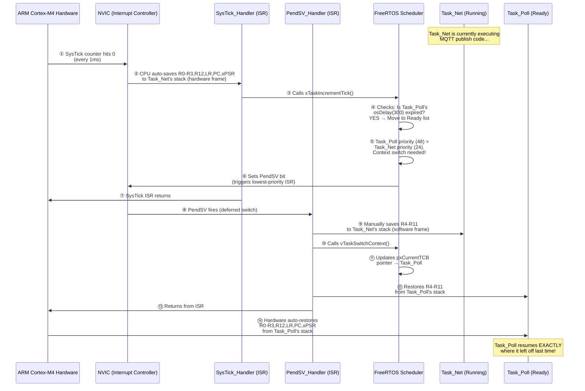

**Step-by-step breakdown:**

| Step | Who Does It | What Happens | CPU Cycles |
| :--- | :--- | :--- | :--- |
| **①** | Hardware (SysTick timer) | The SysTick counter register decrements to 0. It fires every 1ms. | 0 (hardware) |
| **②** | ARM Cortex Hardware (automatic) | The CPU **automatically** pushes 8 registers (`R0, R1, R2, R3, R12, LR, PC, xPSR`) from `Task_Net` onto `Task_Net`'s own stack. This is called the **hardware exception frame**. You do NOT write code for this — the silicon does it. | ~12 cycles |
| **③** | `SysTick_Handler` (FreeRTOS ISR) | FreeRTOS increments its internal tick counter and checks all delayed tasks. | ~20 cycles |
| **④–⑤** | FreeRTOS Scheduler | The scheduler evaluates the Ready list. `Task_Poll` (priority 48) is higher than `Task_Net` (priority 24). A switch is needed. | ~30 cycles |
| **⑥** | FreeRTOS Scheduler | Instead of switching immediately (which is unsafe inside SysTick), it sets the **PendSV** interrupt pending bit. PendSV is configured as the **lowest priority** interrupt, so it fires only after all other ISRs complete. | 1 cycle |
| **⑦** | Hardware | SysTick ISR returns. Hardware restores the basic frame — but PendSV is pending! | ~12 cycles |
| **⑧** | ARM Cortex Hardware | PendSV fires immediately (nothing else is pending). | ~12 cycles |
| **⑨** | `PendSV_Handler` (FreeRTOS, written in assembly) | **Manually** saves the remaining 8 registers (`R4–R11`) that the hardware did NOT save. These are pushed onto `Task_Net`'s stack. Now `Task_Net`'s **complete CPU state** is frozen on its stack. | ~8 cycles |
| **⑩–⑪** | FreeRTOS `vTaskSwitchContext()` | Updates the global `pxCurrentTCB` pointer to point at `Task_Poll`'s Task Control Block. | ~10 cycles |
| **⑫** | `PendSV_Handler` | **Manually** restores `R4–R11` from `Task_Poll`'s stack (where they were saved last time `Task_Poll` was suspended). | ~8 cycles |
| **⑬–⑭** | ARM Cortex Hardware | PendSV returns. Hardware **automatically** pops `R0–R3, R12, LR, PC, xPSR` from `Task_Poll`'s stack. The PC register now points to the exact instruction where `Task_Poll` was paused last time. | ~12 cycles |

**Total context switch time: ~125 CPU cycles ≈ 0.75 microseconds at 168 MHz.**

> 💡 **Key Point:** The context switch uses **two ISRs** — `SysTick` (high priority, just makes the decision) and `PendSV` (lowest priority, does the actual register swap). The reason for this split is that if a CAN or UART ISR fires at the same time as SysTick, the higher-priority hardware ISR runs first. PendSV patiently waits and only performs the switch when the CPU is completely idle from all hardware servicing.

---

<a id="7"></a>
## 7. The System Boot Flow & Timings

When power is applied to the industrial **24V DC bus** from the battery racks, an onboard **DC-DC buck converter** steps the voltage down to a clean **3.3V rail** that feeds the STM32 and all 3.3V logic. The STM32 itself never sees 24V — it operates entirely on 3.3V. However, from a system perspective, the "power-on" event is the 24V bus energizing. The board does not instantly start running the FreeRTOS controller. It undergoes a rigid, multi-stage boot sequence designed for maximum industrial safety.

> 💡 **Power chain:** `24V DC (Battery/PSU)` → `DC-DC Buck (e.g., LM2596)` → `3.3V Rail` → `STM32 VDD pins`

### Boot Chain Comparison: RTOS vs Embedded Linux

To understand this boot flow, it helps to compare it directly against the Embedded Linux boot chain you may already know (e.g., from the i.MX93 CEM board):

```
 EMBEDDED LINUX (i.MX93)              STM32F407 RTOS CONTROLLER
 ─────────────────────────            ────────────────────────────────────
 ┌──────────────────────┐             ┌──────────────────────────────────┐
 │  ROM Bootcode        │             │  ARM Cortex-M4 Reset Handler     │
 │  (On-Chip ROM)       │             │  (Hardwired in silicon)          │
 │  Validates SPL via   │             │  Reads Stack Pointer + Reset     │
 │  AHAB / HAB fuses    │             │  Vector from address 0x08000000  │
 └──────────┬───────────┘             └────────────────┬─────────────────┘
            │                                          │
            ▼                                          ▼
 ┌──────────────────────┐             ┌──────────────────────────────────┐
 │  SPL / U-Boot        │             │  MCUboot (0x08000000)            │
 │  (Secondary Program  │             │  ─ Checks OTA Magic Trailer      │
 │   Loader)            │             │  ─ Reads embedded ECDSA P-256    │
 │  Loads U-Boot proper │             │    Public Key                    │
 │  into DDR            │             │  ─ Cryptographically verifies    │
 └──────────┬───────────┘             │    Bank 1 ECDSA signature        │
            │                         │  ─ If OTA pending: swaps Bank2   │
            ▼                         │    into Bank1 via Scratch sector  │
 ┌──────────────────────┐             │  ─ Jumps PC to 0x08040000        │
 │  U-Boot              │             └────────────────┬─────────────────┘
 │  ─ Initializes DDR   │                              │ (~0–150ms)
 │  ─ Reads env vars    │                              ▼
 │  ─ Loads Kernel +    │             ┌──────────────────────────────────┐
 │    DTB from eMMC     │             │  SystemInit()  (0x08040000)      │
 │  ─ Boots Kernel      │             │  ─ Shifts VTOR to 0x08040000     │
 └──────────┬───────────┘             │  ─ Enables Cortex-M4 FPU        │
            │                         │  ─ Configures PLL: 168 MHz       │
            ▼                         │    (HSE 8MHz × PLL → 168MHz)     │
 ┌──────────────────────┐             └────────────────┬─────────────────┘
 │  Linux Kernel        │                              │ (+151ms)
 │  ─ Decompresses zImg │                              ▼
 │  ─ Initialises MM,   │             ┌──────────────────────────────────┐
 │    drivers, sched    │             │  C Runtime _start()              │
 │  ─ Mounts rootfs     │             │  ─ Copies .data section          │
 │  ─ Starts init/      │             │    from Flash ROM → SRAM         │
 │    systemd           │             │  ─ Zero-initialises .bss section │
 └──────────┬───────────┘             └────────────────┬─────────────────┘
            │                                          │ (+155ms)
            ▼                                          ▼
 ┌──────────────────────┐             ┌──────────────────────────────────┐
 │  rootfs / userspace  │             │  main() — FreeRTOS Boot          │
 │  ─ systemd services  │             │  ─ Creates 3 Queues              │
 │  ─ ems-app (Python)  │             │  ─ Creates 3 Tasks               │
 │  ─ can-driver        │             │  ─ Creates Semaphores            │
 │  ─ ems-monitor       │             │  ─ Calls osKernelStart()         │
 │    (web dashboard)   │             └────────────────┬─────────────────┘
 └──────────────────────┘                              │ (+160ms)
                                                       ▼
                                      ┌──────────────────────────────────┐
                                      │  FreeRTOS Scheduler Running      │
                                      │  ─ Task_Poll: Modbus DMA read    │
                                      │  ─ Task_Ctrl: Peak-shaving logic │
                                      │  ─ Task_Net: MQTT Cloud link     │
                                      │  ─ Idle Task: ARM WFI sleep      │
                                      └──────────────────────────────────┘
                                                    (~300ms total)
```

### Key Differences vs. Embedded Linux

| Stage | Embedded Linux (i.MX93) | RTOS Controller (STM32F407) |
|---|---|---|
| **Hardware security** | AHAB / HAB eFuse chain → SPL signature | MCUboot ECDSA P-256 signature verification |
| **Bootloader** | U-Boot (loads kernel from eMMC) | MCUboot (jumps to Flash address directly) |
| **Memory init** | DDR RAM training (300+ ms) | None — SRAM is always ready at reset |
| **OS start** | Linux Kernel decompression + MM init | `osKernelStart()` — single function call |
| **Userspace** | systemd → services → Python apps | FreeRTOS tasks — no userspace concept |
| **Total boot time** | ~30–60 seconds | ~300 milliseconds |
| **Storage abstraction** | ext4 / FAT filesystem on eMMC | No filesystem — direct Flash addresses |
| **Runtime updates** | SWUpdate via `.swu` package | MCUboot OTA via Bank 1/2 swap |

### ⏱️ Boot Timing Profile (Total Frame: ~300ms)

1.  **Hardware Reset (`+0 ms`):** Power stabilizes. The ARM Core fetches the first native instruction from silicon address `0x08000000`.
2.  **MCUboot Execution (`+5 ms to +150 ms`):** 
    *   The bootloader wakes up. 
    *   It checks the "Magic Trailer" in Flash Bank 2 to see if an Over-The-Air (OTA) update is pending copy.
    *   It reads the ECDSA Public Key embedded in its own memory and runs heavy elliptic curve mathematical verification over the Bank 1 Application (taking roughly ~100+ milliseconds due to intensive cryptography).
    *   If Secure Boot passes, MCUboot points the Program Counter (`PC` register) to `0x08040000` and executes a Jump command.
3.  **SystemInit() (`+151 ms`):** 
    **Customizing the Kernel / Startup:** In a bare-metal RTOS, the Interrupt Vector Table must be shifted so FreeRTOS timers fire correctly *after* MCUboot hands over control. If we didn't do this, hardware interrupts would look directly at the bootloader memory and crash the system. We specifically modified `system_stm32f4xx.c`:
    ```c
    // Inside system_stm32f4xx.c
    #define USER_VECT_TAB_ADDRESS
    #define VECT_TAB_OFFSET  0x00040000U // Shifted 256KB deep matching Linker

    void SystemInit(void) {
        /* FPU settings & System clock config */
        SCB->VTOR = FLASH_BASE | VECT_TAB_OFFSET; // Move the core interrupts!
    }
    ```
    Once the core kernel vectors are shifted, it evaluates the `SystemClock_Config()` function to fire up the external 8MHz Crystal Oscillator (HSE), feeding it through the PLL to aggressively multiply the core clock to exactly **168 MHz**.

### ⏰ Clock Tree & PLL Configuration (Deep Dive)

This is a **critical engineering topic**. Every STM32 project must configure its clock tree, and getting it wrong means all peripherals (UART, SPI, CAN, timers) run at wrong speeds and silently produce garbage data.

#### The Clock Path (How 8 MHz Becomes 168 MHz)

```
 Clock Source Selection & PLL Multiplication
 ══════════════════════════════════════════════════════════════════

 ┌───────────────┐     ┌─────────────┐     ┌──────────────────┐
 │ HSE Crystal   │     │ PLL Engine  │     │ System Clock     │
 │ (External)    │────→│             │────→│ SYSCLK = 168 MHz │
 │ 8 MHz         │  ÷M │  ×N   ÷P   │     │                  │
 └───────────────┘     └─────────────┘     └────────┬─────────┘
                                                    │
                        ┌───────────────────────────┼──────────────────────┐
                        │                           │                      │
                        ▼                           ▼                      ▼
               ┌────────────────┐          ┌────────────────┐     ┌────────────────┐
               │ AHB Bus        │          │ APB1 Bus       │     │ APB2 Bus       │
               │ 168 MHz        │          │ 42 MHz (÷4)   │     │ 84 MHz (÷2)   │
               │ (Core + DMA)   │          │ (UART, I2C,   │     │ (SPI1, ADC,   │
               │                │          │  CAN, Timers)  │     │  USART1)       │
               └────────────────┘          └────────────────┘     └────────────────┘
```

#### The Exact PLL Math

The STM32F407's PLL takes the input clock and applies three dividers:

```
SYSCLK = (HSE / PLL_M) × PLL_N / PLL_P
       = (8 MHz / 8)    × 336   / 2
       = 1 MHz           × 336   / 2
       = 168 MHz  ✅
```

| PLL Parameter | Value | Purpose |
| :--- | :--- | :--- |
| `PLL_M` | 8 | Divides HSE down to exactly 1 MHz (PLL input requirement: 1–2 MHz) |
| `PLL_N` | 336 | Multiplies 1 MHz up to 336 MHz (VCO output) |
| `PLL_P` | 2 | Divides VCO output to get final SYSCLK: 336 / 2 = 168 MHz |
| `PLL_Q` | 7 | Separate divider for USB OTG: 336 / 7 = 48 MHz (USB requires exactly 48 MHz) |

#### SystemClock_Config() Code

```c
// ──── File: Core/Src/main.c ────
void SystemClock_Config(void) {
    RCC_OscInitTypeDef RCC_OscInitStruct = {0};
    RCC_ClkInitTypeDef RCC_ClkInitStruct = {0};

    // Step 1: Enable HSE (External 8 MHz crystal on pins PH0/PH1)
    RCC_OscInitStruct.OscillatorType = RCC_OSCILLATORTYPE_HSE;
    RCC_OscInitStruct.HSEState = RCC_HSE_ON;
    RCC_OscInitStruct.PLL.PLLState = RCC_PLL_ON;
    RCC_OscInitStruct.PLL.PLLSource = RCC_PLLSOURCE_HSE;  // ← Use crystal, not RC
    RCC_OscInitStruct.PLL.PLLM = 8;    // 8 MHz ÷ 8 = 1 MHz
    RCC_OscInitStruct.PLL.PLLN = 336;  // 1 MHz × 336 = 336 MHz (VCO)
    RCC_OscInitStruct.PLL.PLLP = 2;    // 336 MHz ÷ 2 = 168 MHz (SYSCLK!)
    RCC_OscInitStruct.PLL.PLLQ = 7;    // 336 MHz ÷ 7 = 48 MHz (USB)
    HAL_RCC_OscConfig(&RCC_OscInitStruct);

    // Step 2: Set bus dividers (AHB, APB1, APB2)
    RCC_ClkInitStruct.ClockType = RCC_CLOCKTYPE_SYSCLK | RCC_CLOCKTYPE_HCLK
                                | RCC_CLOCKTYPE_PCLK1  | RCC_CLOCKTYPE_PCLK2;
    RCC_ClkInitStruct.SYSCLKSource = RCC_SYSCLKSOURCE_PLLCLK;
    RCC_ClkInitStruct.AHBCLKDivider = RCC_SYSCLK_DIV1;    // 168 MHz
    RCC_ClkInitStruct.APB1CLKDivider = RCC_HCLK_DIV4;     // 168 ÷ 4 = 42 MHz
    RCC_ClkInitStruct.APB2CLKDivider = RCC_HCLK_DIV2;     // 168 ÷ 2 = 84 MHz

    // Step 3: Flash latency MUST match clock speed!
    HAL_RCC_ClockConfig(&RCC_ClkInitStruct, FLASH_LATENCY_5);
    //                                      ↑ 5 wait states for 168 MHz
}
```

#### 🎯 Clock Tree Deep-Dive Notes

| Question | Answer |
| :--- | :--- |
| **Why HSE instead of HSI (internal 16 MHz RC)?** | The internal RC oscillator drifts ±1% with temperature. CAN bus at 500 kbps requires ≤0.5% accuracy — HSI would cause random CAN bit errors in hot industrial environments. The external crystal is ±20 ppm (0.002%). |
| **What are Flash wait states?** | The Flash memory chip inside the STM32 is physically slower than the CPU. At 168 MHz, the CPU can request an instruction every ~6ns, but Flash needs ~30ns to respond. Setting `FLASH_LATENCY_5` tells the CPU to insert 5 wait cycles per fetch. If you set this too low, the CPU reads garbage from Flash and Hard Faults. |
| **What happens if the HSE crystal physically breaks?** | The STM32 has a **Clock Security System (CSS)**. If HSE fails, CSS automatically switches SYSCLK to the internal HSI (16 MHz) and fires an NMI interrupt. The system keeps running at reduced speed rather than crashing. We handle this in `NMI_Handler()` to log the fault and set the red LED. |
| **Why is APB1 limited to 42 MHz?** | It's a physical silicon limitation documented in the STM32F407 datasheet. The APB1 bus transistors cannot switch reliably above 42 MHz. The CAN peripheral is on APB1 — its baud rate prescaler is calculated from this 42 MHz base clock. |
| **How does SPI1 get 21 Mbit/s for W5500?** | SPI1 is on APB2 (84 MHz). We set the SPI prescaler to `DIV4`: 84 ÷ 4 = 21 MHz. This is the maximum speed the W5500 chip supports. |

4.  **C Runtime Initialization (`+155 ms`):** The C-language `_start()` routine copies all global variable initializations (`.data` section) slowly from Flash ROM into volatile RAM. 
5.  **FreeRTOS Kernel Launch (`+160 ms`):** `main()` completes creating the 3 Queues, 3 Tasks, and Semaphores, and finally calls `osKernelStart()`. The FreeRTOS preemptive scheduler takes over the CPU entirely.
6.  **Application Running (`+300 ms`):** Within roughly 1/3 of a second of bare-metal power-on, `Task_Poll` executes its first deterministic Modbus DMA read from the Grid Meter.

### 📏 How To Measure Boot Timing Per Phase

To **prove** these boot timing numbers (critical for certification and technical reviews), we use two methods:

**Method 1: GPIO Toggle + Logic Analyzer (Most Accurate)**
We add a single `HAL_GPIO_TogglePin()` call at the entry point of each boot phase. By probing these pins with a Saleae Logic Analyzer, we get **nanosecond-accurate** timestamps for each phase transition:
```c
// Inside MCUboot's main() — fires at +5ms
HAL_GPIO_WritePin(GPIOD, GPIO_PIN_12, GPIO_PIN_SET);   // Green LED ON

// Inside SystemInit() — fires at +151ms
HAL_GPIO_WritePin(GPIOD, GPIO_PIN_13, GPIO_PIN_SET);   // Orange LED ON

// Inside main() after osKernelStart() — fires at +160ms
HAL_GPIO_WritePin(GPIOD, GPIO_PIN_14, GPIO_PIN_SET);   // Red LED ON

// Inside Task_Poll first loop — fires at +300ms
HAL_GPIO_WritePin(GPIOD, GPIO_PIN_15, GPIO_PIN_SET);   // Blue LED ON
```
The logic analyzer captures exact rising-edge timestamps, proving boot time to auditors.

**Method 2: SEGGER SystemView (Software Trace)**
After `osKernelStart()`, SystemView records all task switches with microsecond resolution. It visually proves the first `Task_Poll` execution time.

### 🔧 How To Debug the Bootloader (MCUboot) at Runtime

Debugging MCUboot is tricky because it is a **separate project** with its own `.elf`. Here are the methods:

**Method 1: SWD Hardware Debugging (Before RDP is set)**
Before the factory locks the board with RDP Level 2, you can connect an ST-LINK and debug MCUboot directly:
```bash
# Load MCUboot's .elf (with debug symbols) into GDB
arm-none-eabi-gdb build/mcuboot.elf
(gdb) target remote :3333
(gdb) monitor reset halt          # Freeze CPU at address 0x08000000
(gdb) break main                  # Set breakpoint at MCUboot's main()
(gdb) continue                    # Run until breakpoint
(gdb) step                        # Step through signature verification
(gdb) print image_ok              # Inspect the OTA flag value
```

**Method 2: UART Serial Console (Always Available)**
MCUboot is compiled with `MCUBOOT_LOG_LEVEL=4` (DEBUG). It prints detailed logs over UART at 115200 baud:
```
[INF] MCUboot v1.9.0 starting
[INF] Primary image: magic=good, swap_type=none, copy_done=0x1, image_ok=0x1
[INF] Verifying signature with ECDSA-P256...
[INF] Signature OK! Booting primary slot (0x08040000)...
```
If signature verification fails, you see:
```
[ERR] Image in primary slot is not valid!
[ERR] Unable to find bootable image
```

**Method 3: Fault Pin Indication**
In production (RDP Level 2, no SWD), we configure MCUboot to toggle a dedicated GPIO if it fails to boot. The factory test rig checks this pin.

### ⚠️ Boot Error Troubleshooting Table

| Symptom | Root Cause | How To Diagnose | How To Fix |
| :--- | :--- | :--- | :--- |
| **Board is completely dead** (no LEDs, no UART) | DC-DC converter failure or BOR reset holding CPU | Check 3.3V rail with a multimeter. If below 2.7V, BOR is active. | Replace DC-DC module. Verify 24V input is stable. |
| **MCUboot prints nothing on UART** | VTOR is correct but MCUboot binary is corrupted or missing | Connect ST-LINK, run `arm-none-eabi-gdb`, check if PC is stuck at `0xFFFFFFFE` (HardFault). | Re-flash `mcuboot.bin` at `0x08000000`. |
| **`Signature INVALID! Halting.`** | Wrong signing key used by CI/CD, or binary was corrupted during transfer | Check `imgtool` command in CI pipeline. Verify the public key embedded in MCUboot matches the private key used to sign. | Re-sign the app binary with the correct `.pem` key. Re-flash. |
| **`Unable to find bootable image`** | Application binary missing from Bank 1, or MCUboot image header is absent | Verify `ems_rtos_signed.bin` was flashed to `0x08040000`. Check with `st-flash read dump.bin 0x08040000 0x100` and inspect the MCUboot header bytes. | Re-flash the signed application binary. |
| **MCUboot boots, app crashes immediately** (Hard Fault within 1ms) | VTOR not shifted — SysTick ISR jumps to bootloader memory | Connect GDB, `monitor reset halt`, check `SCB->VTOR` value. If `0x08000000`, the shift is missing. | Uncomment `#define USER_VECT_TAB_ADDRESS` and set `VECT_TAB_OFFSET = 0x00040000U` in `system_stm32f4xx.c`. |
| **MCUboot boots, app crashes after ~2 seconds** | IWDG watchdog not being refreshed — `Task_Poll` is stuck | Check UART logs. If last message is from `main()` but no task output, a queue or semaphore creation failed (out of RAM). | Increase `configTOTAL_HEAP_SIZE` in `FreeRTOSConfig.h`. Use `arm-none-eabi-size` to check RAM usage. |
| **App runs but FreeRTOS scheduler never starts** | `osKernelStart()` returns an error (not enough heap for Idle Task) | GDB: set breakpoint at `osKernelStart`, step through. Check return value. | Ensure heap is at least 4KB larger than all task stacks combined. |
| **App runs but Modbus never responds** | SysTick works but UART DMA ISR goes to wrong handler (partial VTOR issue — rare) | Use Logic Analyzer to check UART TX/RX pins for any signal. Check `USART2->SR` register in GDB for overrun errors. | Verify the startup assembly file (`startup_stm32f407xx.s`) includes the correct ISR vector names matching the HAL callbacks. |
| **Board randomly resets every 3 seconds** | IWDG is enabled in MCUboot but the application never calls `HAL_IWDG_Refresh()` | Check if MCUboot enables IWDG in its `main.c`. Once enabled in hardware, IWDG **cannot be disabled** — only refreshed. | Ensure `Task_Poll` calls `HAL_IWDG_Refresh()` inside its main loop. The IWDG prescaler must allow enough time for boot. |
| **OTA swap takes forever and board resets mid-swap** | IWDG timeout is shorter than the Flash erase + swap duration | Calculate worst-case swap time: `(384KB / 4KB chunks) × erase_time_per_sector`. If > IWDG timeout, it resets. | Increase IWDG prescaler or call `HAL_IWDG_Refresh()` inside MCUboot's swap loop between each 4KB chunk. |

---

Below is the logical and electrical schematic diagram, mapping exactly how the embedded software threads physically inter-operate with the external copper traces of the PCB component blocks.

### 📋 Full Chip Inventory & Bill of Materials (IC focus)

For schematic development, we rely on the following primary silicon components:

| Reference | Part Number | Manufacturer | Package | Function |
| :--- | :--- | :--- | :--- | :--- |
| **U1** | **STM32F407VGT6** | **STMicro** | **LQFP-100** | **Main MCU**: cortex-M4F, 1MB Flash, 192KB RAM. |
| **U2** | **W5500** | **WIZnet** | **LQFP-48** | **Ethernet Controller**: Hardwired TCP/IP Stack via SPI. |
| **U3** | **MAX3485ESA+** | **Maxim/ADI** | **SOIC-8** | **RS-485 Transceiver**: 3.3V, 10Mbps, Half-Duplex. |
| **U4** | **TJA1050T** | **NXP** | **SOIC-8** | **CAN Transceiver**: 5V (Standard High-Speed CAN). |
| **U5** | **LM2596S-3.3** | **TI/ONSemi** | **TO-263** | **DC-DC Buck**: Steps 24V industrial rail down to 3.3V. |
| **U6** | **AMS1117-3.3** | **Advanced Monolithic** | **SOT-223** | **LDO Regulator**: Clean 3.3V for MCU Analog rails. |
| **U7** | **ADuM1201** | **Analog Devices** | **SOIC-8** | **Digital Isolator**: Galvanic isolation for CAN/RS485. |
| **J1** | **HR911105A** | **HanRun** | **TH (RJ45)** | **Ethernet Jack**: Integrated magnetics/transformers. |
| **Y1** | **8.000 MHz** | **Generic** | **HC-49/SMD** | **HSE Crystal**: Main system clock reference. |
| **Y2** | **32.768 kHz** | **Generic** | **Cylindrical** | **LSE Crystal**: For independent Hardware RTC. |

### 📐 Hardware Interconnect Diagram (Schematic View)

This diagram shows the physical pin-to-pin mapping required for PCB layout.

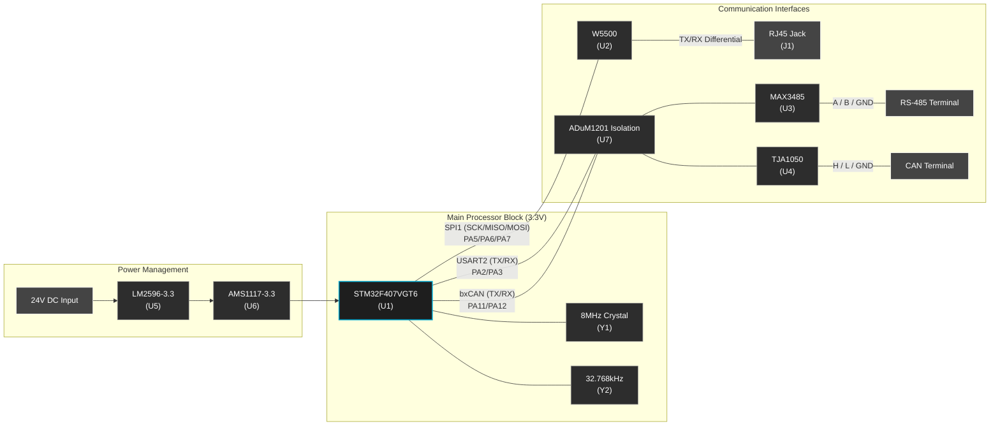

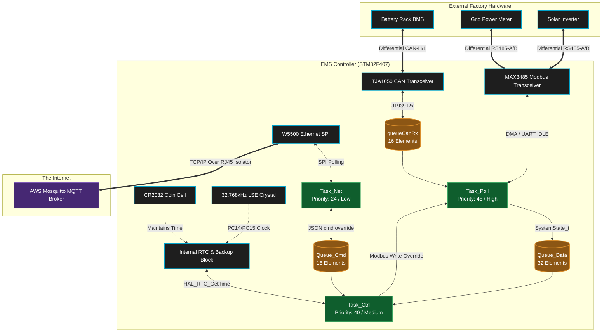

### Physical Wiring: CAN Bus & RS-485 Connections

A common engineering question is: *"How many wires does CAN bus actually need? What about RS-485?"* Here is the exact physical wiring used in our project:

#### CAN Bus Wiring (To BMS Battery Rack)

CAN bus uses **2 signal wires + 1 ground** (3 wires total):

```
 STM32 Board                             Battery BMS Module
 ┌────────────────┐       Twisted-Pair    ┌──────────────────┐
 │                │       Cable           │                  │
 │  TJA1050       │                       │  CAN Transceiver │
 │  ┌──────────┐  │                       │  ┌──────────┐    │
 │  │  CAN-H ──┼──┼── Yellow Wire ────────┼──┤  CAN-H   │    │
 │  │  CAN-L ──┼──┼── Green Wire  ────────┼──┤  CAN-L   │    │
 │  │  GND   ──┼──┼── Black Wire  ────────┼──┤  GND     │    │
 │  └──────────┘  │                       │  └──────────┘    │
 │                │                       │                  │
 │  120Ω Resistor │                       │  120Ω Resistor   │
 │  (CAN-H↔CAN-L)│                       │  (CAN-H↔CAN-L)  │
 └────────────────┘                       └──────────────────┘
```

| Wire | Name | Voltage Range | Purpose |
| :--- | :--- | :--- | :--- |
| **Wire 1** | `CAN-H` (CAN High) | 2.5V – 3.5V | Dominant = 3.5V, Recessive = 2.5V |
| **Wire 2** | `CAN-L` (CAN Low) | 1.5V – 2.5V | Dominant = 1.5V, Recessive = 2.5V |
| **Wire 3** | `GND` (Signal Ground) | 0V | Common reference. Required to prevent ground-loop noise between boards |

> 💡 **Termination:** Both ends of the CAN bus **must** have a **120Ω resistor** soldered between CAN-H and CAN-L. Without these, signal reflections on the copper wire corrupt bits at 500 kbps. In our project, the STM32 PCB has one 120Ω, and the battery BMS has the other. You can verify correct termination by measuring resistance between CAN-H and CAN-L with a multimeter — it should read **60Ω** (two 120Ω in parallel).

#### RS-485 Wiring (To Grid Meter & Inverter)

RS-485 Modbus uses **2 signal wires + 1 ground** (3 wires total). It is **half-duplex** — only one device can talk at a time:

```
 STM32 Board                             Grid Meter / Inverter
 ┌────────────────┐       Twisted-Pair    ┌──────────────────┐
 │                │       Cable (up to    │                  │
 │  MAX3485       │       1200 meters!)   │  RS-485 Port     │
 │  ┌──────────┐  │                       │  ┌──────────┐    │
 │  │   A    ──┼──┼── Blue Wire  ─────────┼──┤   A      │    │
 │  │   B    ──┼──┼── White Wire ─────────┼──┤   B      │    │
 │  │  GND   ──┼──┼── Black Wire ─────────┼──┤  GND     │    │
 │  └──────────┘  │                       │  └──────────┘    │
 │   DE Pin ← PD4 │                       │                  │
 │  (Direction     │                       │  120Ω Resistor   │
 │   Control)      │                       │  (A ↔ B)         │
 └────────────────┘                       └──────────────────┘
```

| Wire | Name | Voltage Range | Purpose |
| :--- | :--- | :--- | :--- |
| **Wire 1** | `A` (Non-inverting / D+) | -7V to +12V | Data+ line. Voltage difference (A-B) > +200mV = Logic `1` |
| **Wire 2** | `B` (Inverting / D-) | -7V to +12V | Data- line. Voltage difference (A-B) < -200mV = Logic `0` |
| **Wire 3** | `GND` (Signal Ground) | 0V | Common ground reference between distant devices |

> ⚠️ **Half-Duplex Direction Control:** The MAX3485's `DE` (Driver Enable) pin is wired to STM32 GPIO `PD4`. When `DE=HIGH`, the MAX3485 **transmits** (drives A/B lines). When `DE=LOW`, it **listens** (receives data from A/B). This pin must be toggled precisely between TX and RX — see Challenge 1 in Section 21 for how we solved the timing jitter bug.

#### Ethernet Wiring (To Cloud via RJ45)

Ethernet uses **4 signal wires (2 twisted pairs) + shield** inside a standard Cat5/Cat5e cable with an RJ45 connector:

| Pin | Wire Color (T568B) | Signal | Purpose |
| :--- | :--- | :--- | :--- |
| Pin 1 | Orange/White | `TX+` | Transmit positive |
| Pin 2 | Orange | `TX-` | Transmit negative |
| Pin 3 | Green/White | `RX+` | Receive positive |
| Pin 6 | Green | `RX-` | Receive negative |
| Pins 4,5,7,8 | — | Unused | (Used in Gigabit; unused in 100BASE-TX) |

> 💡 **Galvanic Isolation:** The RJ45 jack on our PCB has built-in **magnetics transformers** that electrically isolate the STM32 board from the Ethernet cable. This prevents ground loops and voltage spikes from traveling through the cable and damaging the MCU — critical in industrial environments where motors and inverters generate massive EMI.

#### Quick Summary

| Bus | Total Wires | Signal Wires | Duplex | Max Distance | Speed |
| :--- | :--- | :--- | :--- | :--- | :--- |
| **CAN** | 3 (CAN-H, CAN-L, GND) | 2 differential | Full (simultaneous TX/RX via arbitration) | 40m @ 1Mbps, 1000m @ 50kbps | 500 kbps |
| **RS-485** | 3 (A, B, GND) | 2 differential | Half (TX or RX, not both) | **1200 meters** | 9600 baud |
| **Ethernet** | 4 signal + shield | 2 twisted pairs | Full | 100 meters | 100 Mbps |

### Board GPIO: LEDs, Reset, Diagnostic & Control Pins

Beyond communication buses, the PCB uses several GPIO pins for visual feedback, hardware resets, and user interaction. On the STM32F407G-DISC1 development board, the four onboard LEDs (PD12–PD15) are used directly. On the production PCB, these are routed to panel-mount LEDs visible through the enclosure.

#### LED Indicators

| GPIO Pin | LED Color | Direction | Firmware Usage |
| :--- | :--- | :--- | :--- |
| `PD12` | 🟢 Green | Output (Push-Pull) | **System Alive** — Toggled every 300ms inside `Task_Poll`'s main loop. If this LED stops blinking, the RTOS has crashed or the IWDG has frozen. |
| `PD13` | 🟠 Orange | Output (Push-Pull) | **Network Activity** — Lit solid when `Task_Net` has an active MQTT connection to AWS. Blinks rapidly during MQTT publish. OFF = no cloud link. |
| `PD14` | 🔴 Red | Output (Push-Pull) | **Fault / Error** — Lit when an unrecoverable error occurs (e.g., CAN bus off, Modbus slave not responding for >10 cycles, Flash signature verification fail). Also lit during OTA update in progress. |
| `PD15` | 🔵 Blue | Output (Push-Pull) | **Boot Phase Indicator** — Briefly lit during `SystemInit()` to confirm MCUboot handoff succeeded. Also used for boot timing measurement with logic analyzer. |

#### Reset & Control Pins

| GPIO Pin | Name | Direction | Purpose |
| :--- | :--- | :--- | :--- |
| `NRST` | **Hardware Reset** (active-LOW) | Input | Physical reset pin on the STM32. Directly connected to a tactile push-button on the PCB and to the ST-LINK debug probe. Pulling this LOW forces an immediate silicon reset — equivalent to a full power cycle. The IWDG watchdog internally triggers this pin when it expires. |
| `PB0` | **W5500 Hardware Reset** | Output (Push-Pull) | Connected to the W5500 Ethernet chip's `RST` pin. `Task_Net` pulses this LOW for 2ms to force a full hardware reset of the Ethernet chip when a ghost TCP connection is detected (see Challenge 4 in Section 21). |
| `PD4` | **RS-485 DE (Direction Enable)** | Output (Push-Pull) | Controls the MAX3485 half-duplex direction. `HIGH` = transmit, `LOW` = receive. Toggled by the hardware `HAL_UART_TxCpltCallback()` ISR to avoid timing jitter (see Challenge 1 in Section 21). |
| `PA0` | **User Button (B1)** | Input (Pull-Down) | On the DISC1 dev board, this is the blue user push-button. In firmware, pressing this during boot forces MCUboot to roll back to the previous firmware bank (recovery mode). In production, this is wired to an external momentary switch accessible through the enclosure. |
| `BOOT0` | **Boot Mode Select** | Input (Pull-Down via 10kΩ) | Normally held LOW (run from Flash). If held HIGH during reset, the STM32 boots from its internal System ROM bootloader (for DFU/USB recovery). In production, this pin is permanently tied to GND via a PCB resistor. |

#### SWD Debug Interface (Programming Header)

| Pin | Name | Direction | Purpose |
| :--- | :--- | :--- | :--- |
| `PA13` | `SWDIO` | Bidirectional | Serial Wire Debug data. Used for GDB hardware breakpoints and live memory inspection via ST-LINK. |
| `PA14` | `SWCLK` | Input (from ST-LINK) | Serial Wire Debug clock @ 4 MHz. |
| `PB3` | `SWO` | Output | Serial Wire Output — used by SEGGER SystemView for non-intrusive RTOS trace. Runs at full SWD clock speed. |
| `NRST` | `NRST` | Bidirectional | ST-LINK can assert this to halt/reset the MCU remotely during debug sessions. |

> ⚠️ **Production Lockdown (RDP Level 2):** After factory programming, the `RDP` option bytes are permanently set to Level 2. This **physically and irreversibly disables** the SWD debug port (PA13/PA14). Once set, no debugger, no programmer, and no attack can ever read the Flash contents. The LEDs and UART become the only diagnostic interfaces.

---

<a id="8"></a>
## 8. The OS API Layer: Why CMSIS-RTOS v2?

We use the **CMSIS-RTOS v2 API (Version 2.1.3)** as our primary abstraction layer over the **FreeRTOS V10.3.1** kernel. If you inspect the codebase, you will notice we use commands like `osDelay()` and `osMessageQueuePut()` instead of FreeRTOS native commands like `vTaskDelay()` and `xQueueSend()`. This is because we wrap FreeRTOS inside **CMSIS-RTOS v2** (Cortex Microcontroller Software Interface Standard).

### Why use CMSIS-RTOS v2 instead of native FreeRTOS without CMSIS?
1. **Portability & Abstraction:** CMSIS-RTOS v2 is a standardized API created by ARM. By using it, our application code doesn't strictly know it is running "FreeRTOS". If, in the future, we need to migrate the EMS Mini to an RTOS provided by another vendor (like Keil RTX, Azure RTOS/ThreadX, or Zephyr), we do not have to rewrite a single line of application code. The `osThreadNew()` command works universally across ARM-supported RTOS platforms, whereas `xTaskCreate()` strictly locks us into FreeRTOS.
2. **Simplified Memory Management:** Native FreeRTOS requires developers to manually choose between static (`xTaskCreateStatic`) and dynamic (`xTaskCreate`) allocations, frequently requiring the user to pass convoluted RAM buffers manually. The CMSIS v2 wrapper unifies these calls: you simply pass an attributes struct (`osThreadAttr_t`).
3. **Advanced Timers:** CMSIS-RTOS v2 introduces unified 64-bit kernel tick structures `osKernelGetTickCount()`. Native FreeRTOS traditionally defaults to 32-bit ticks, which roll over back to zero every ~49 days (on a 1ms tick), requiring nasty manual rollover-protection logic. A 64-bit tick will not roll over for billions of years, making uptime math (like "publish MQTT every 5 seconds") extremely safe and simple.

### Why CMSIS-RTOS v2 specifically (vs. CMSIS-RTOS v1)?
If you are upgrading from older STM32Cube firmware that used **v1**, here are the major differences you will notice in this codebase:
*   **No More Macro Definitions:** In v1, creating a thread required clunky multi-step macros like `osThreadDef()` followed by `osThreadCreate()`. In **v2**, this is completely replaced by clean, dynamic C functions like `osThreadNew()` and `osMessageQueueNew()`.
*   **True 64-bit Ticks:** v1 was strictly bound to a 32-bit SysTick (`osWaitForever` was max 0xFFFFFFFF). **v2** officially supports infinite 64-bit ticks out of the box.
*   **Variable Message Sizes:** In v1, Message Queues (`osMessagePut`) were essentially limited to passing 32-bit integer values or raw pointers. **v2** (`osMessageQueuePut`) natively allows you to pass actual `struct` data payload clones of any arbitrary memory size, significantly improving type safety across threads.

---

<a id="9"></a>
## 9. FreeRTOS Multitasking Topology

In FreeRTOS, tasks spend the vast majority of their lives in the **Blocked State**, consuming 0% CPU cycles until an external event (Interrupt, Timer, or Queue Message) wakes them up. We use **Strict Priority-Based Preemptive Scheduling**.

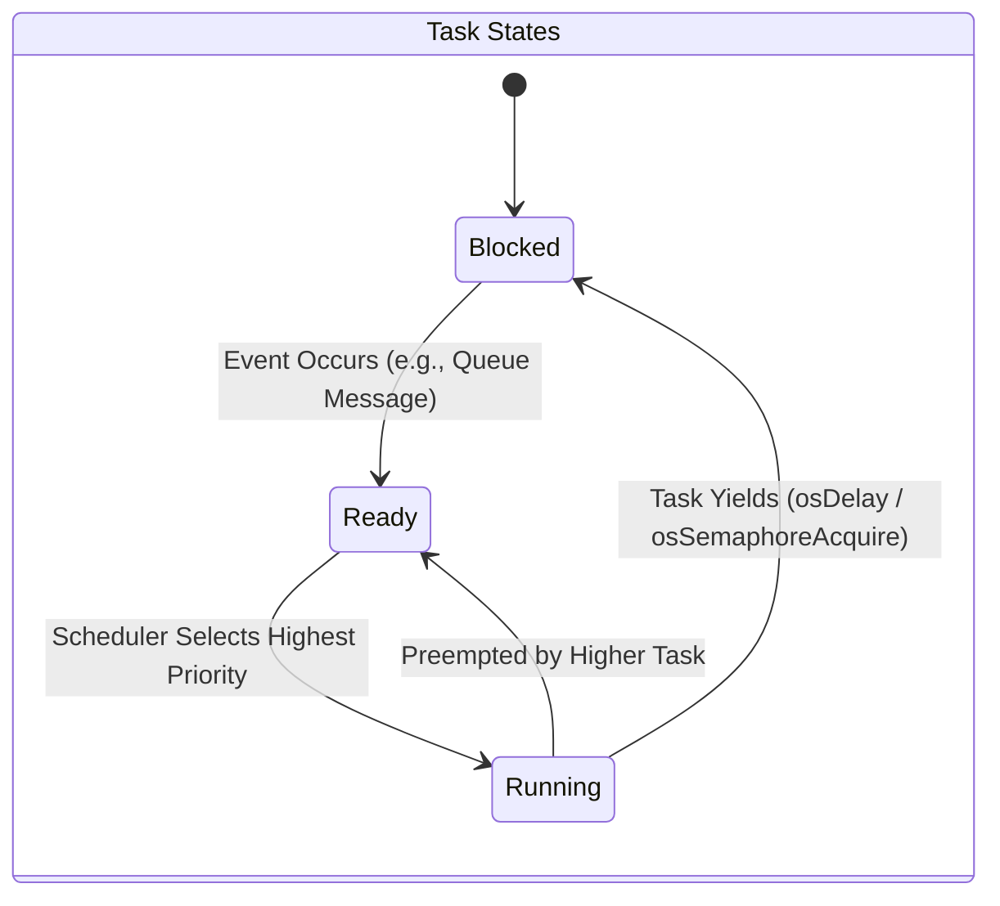

### 🧵 Task Breakdown

| Task Name | Priority | Core Responsibility | Typical State |
| :--- | :--- | :--- | :--- |
| **`Task_Poll`** | `High` (`osPriorityRealtime`) | **Hardware Interfacing & Data Harvesting:** Executes strict-timing polling loops on physical interfaces (RS-485 Modbus via DMA for Grid/Inverters, CAN bus for Battery BMS). It pulls raw electrical data, packages it into structs, and safely queues it up for the logic task. Needs the highest priority to prevent timing jitter and dropped hardware packets. | **Blocked** on `osDelay(300)` or `osSemaphoreAcquire` waiting for DMA completion. |
| **`Task_Ctrl`** | `Medium` (`osPriorityHigh`) | **Core EMS Decision Logic (The Brain):** Wakes up instantaneously the moment new hardware data arrives. Calculates power flow limits, executes localized safety failsafes, and runs deterministic peak-shaving formulas to actively command the inverter to charge or discharge. | **Blocked** indefinitely waiting on `osMessageQueueGet` for new telemetry. |
| **`Task_Net`** | `Low` (`osPriorityNormal`) | **Cloud Communication & MQTT IoT Bridge:** Handles all external internet communications. It serializes internal telemetry into JSON strings, publishes them to the Cloud broker via the SPI Ethernet chip, and listens for remote command overrides. Lowest priority ensures network slowdowns never stall physical safety limits. | **Blocked** on `osDelay(250)` or TCP Socket waits. |

**Task Implementation Pseudo-Code (`Task_Poll`):**
```c
// CMSIS-RTOS v2 Task Definitions
const osThreadAttr_t pollTask_attributes = {
  .name = "Task_Poll",
  .stack_size = 512 * 4, // 2048 Bytes allocated statically
  .priority = (osPriority_t) osPriorityRealtime,
};

void Start_Task_Poll(void *argument) {
  for(;;) {
    // 1. Kick off UART DMA to physical Grid Meter
    HAL_UART_Receive_DMA(&huart2, rx_buffer, sizeof(rx_buffer));
    
    // 2. Block until hardware DMA completes (Consumes 0% CPU!)
    osSemaphoreAcquire(dmaRxSemaphore, osWaitForever);
    
    // 3. Process Modbus data & Push struct to Queue
    SystemState_t new_state = parse_modbus_data(rx_buffer);
    osMessageQueuePut(Queue_DataHandle, &new_state, 0, 0);
    
    // 4. Yield CPU rigidly for 300ms polling cycle
    osDelay(300);
  }
}

// Triggered sequentially inside main()
osThreadNew(Start_Task_Poll, NULL, &pollTask_attributes);
```

> **Note on Naming & Priority Levels:** 
> Why is `osPriorityHigh` labeled as "Medium"? 
> The terms "High, Medium, Low" here represent the **relative priority within our application's 3-task hierarchy**, not the absolute OS priority logic. 
> To guarantee hardware polling *always* preempts the logic brain, we gave `Task_Poll` an objectively higher systemic priority (`osPriorityRealtime` = Priority 48). We gave the logic brain `Task_Ctrl` the next step down (`osPriorityHigh` = Priority 40), meaning it sits in the *middle* of our specific application stack. The cloud bridge `Task_Net` sits at the bottom (`osPriorityNormal` = Priority 24).
> This mapping ensures we establish a strict preemptive hierarchy customized to our precise needs.
> 
> **Why use 48, 40, and 24 instead of simply 1, 2, and 3?**
> We *could* assign FreeRTOS priorities 1, 2, and 3 directly, but we use the CMSIS v2 constants specifically for **future scalability**. 
> CMSIS intentionally leaves massive numerical "gaps" between priority tiers (e.g., jumping from 24 to 32 to 40). This borrows the logic of old-school BASIC programming (Line 10, Line 20). If we used priorities 1, 2, and 3, and months from now we needed to inject a new "Medium-High" task (e.g., `Task_RemoteEmergencyStop`) right between `Task_Ctrl` and `Task_Poll`, we would have to re-number and shift our entire RTOS priority map. 
> Because we used the CMSIS gaps, we can seamlessly insert that new task at Priority 44 without ever touching the configuration of `Task_Poll` (48) or `Task_Ctrl` (40).

---

<a id="10"></a>
## 10. FreeRTOS Feature Checklist

This section serves as a rapid-fire summary of the specific FreeRTOS API mechanics used in the project, explaining **what** they are, **why** they were chosen, and **how** they work.

### 1. Preemptive, Prioritized Tasks (`osThreadNew`)
*   **What:** The core of the Scheduler. Tasks are assigned static priorities.
*   **Why:** Rather than round-robin polling where everything gets equal CPU time, we must guarantee that safety-critical hardware polling preempts everything else.
*   **How:** `Task_Poll` is given `osPriorityRealtime`, so the exact millisecond its 300ms sleep timer expires, the RTOS kernel forcefully pauses whatever `Task_Net` is configuring, saves its memory registers to the stack (Context Switch), and gives 100% CPU to `Task_Poll`.

### 2. Message Queues (`osMessageQueueNew` / `osMessageQueuePut`)
*   **What:** Thread-safe, FIFO (First-In, First-Out) memory buffers.
*   **Why:** To safely pass complex data (like the Multi-Byte `SystemState_t` struct) between isolated Tasks without using completely unprotected global variables (which cause Data Corruptions/Race Conditions).
*   **How:** `Task_Poll` generates data and calls `osMessageQueuePut()` to insert it into the buffer. Meanwhile, `Task_Ctrl` is programmed to call `osMessageQueueGet(..., osWaitForever)`. 
    *   **The Magic of `osWaitForever`:** If the queue is empty, `Task_Ctrl` does *not* sit in a `while(1)` loop constantly checking the queue (which would burn 100% CPU purely on waiting). 
    *   Instead, the RTOS kernel explicitly removes `Task_Ctrl` from the active "Ready-to-Run" list and places it in a dormant "Blocked" list. Because it is blocked, it consumes **exactly 0% CPU cycles**.
    *   The microsecond `Task_Poll` executes `osMessageQueuePut()`, a hardware/software interrupt tells the RTOS kernel: *"Data has arrived in Queue X"*. The kernel instantly scans its Blocked list, finds `Task_Ctrl` waiting for that queue, and physically moves `Task_Ctrl` back to the active "Ready" list, immediately waking it up to process the data!

### 3. Binary Semaphores (`osSemaphoreNew` / `osSemaphoreAcquire`)
*   **What:** A thread-safe boolean "Token". You either have it, or it is empty.
*   **Why (The `Task_Poll` Use Case):** In `Task_Poll`, we communicate over a slow RS-485 Modbus network (e.g., 9600 baud). If we busy-looped while waiting for a 100-byte packet to arrive, the CPU would be frozen for over 100 milliseconds! A Binary Semaphore allows `Task_Poll` to kick off the hardware DMA (Direct Memory Access) and then instantly go to sleep (0% CPU), freeing the CPU to run `Task_Net` or `Task_Ctrl` while the hardware physical UART pins do the slow work.
*   **How:** `Task_Poll` fires off a DMA transfer (`HAL_UART_Transmit_DMA`), then immediately calls `osSemaphoreAcquire()`. Since the token starts empty, the Task is instantly Blocked. Milliseconds later, when the remote Modbus slave finishes responding, theSTM32 hardware fires the native `UART Idle ISR`. From inside that Interrupt Service Routine, we call `osSemaphoreRelease()`. This injects the missing token into the RTOS kernel, which instantly unblocks `Task_Poll` so it can parse the newly arrived buffer!

**Semaphore ISR → Task Unlock Pseudo-Code:**
```c
// --- Boot: Create the semaphore token (starts empty) ---
osSemaphoreId_t dmaRxSem = osSemaphoreNew(1, 0, NULL); // Initial count = 0 (TAKEN)

// --- Task_Poll: Kick off DMA and then SLEEP ---
void StartPollTask(void *argument) {
    for(;;) {
        // Send Modbus request out via DMA (non-blocking, hardware takes over)
        HAL_UART_Transmit_DMA(&huart1, tx_frame, tx_len);

        // Block here: 0% CPU until the ISR drops the token
        // Timeout of 250ms: if the slave doesn't respond, we abort safely
        osSemaphoreAcquire(dmaRxSem, pdMS_TO_TICKS(250));

        // We ONLY reach this line once the ISR fires and releases the semaphore!
        parse_modbus_response(rx_buffer);
    }
}

// --- Hardware ISR (fires in silicon when DMA IDLE detected) ---
// This runs in INTERRUPT context - must be extremely fast!
void HAL_UARTEx_RxEventCallback(UART_HandleTypeDef *huart, uint16_t Size) {
    if (huart->Instance == USART1) {
        // Drop the token back into the semaphore from ISR-safe context
        // This single line is all an ISR should ever do!
        osSemaphoreRelease(dmaRxSem);
    }
}
```

### 4. Critical Sections (`vTaskSuspendAll`)
*   **What:** A mechanism to temporarily disable the OS Scheduler from running.
*   **Why:** To protect the ARM Instruction/Data bus from Hard Fault crashes when doing delicate logic, like physically erasing sectors of internal Flash memory.
*   **How:** During an OTA firmware swap, `Task_Net` calls `vTaskSuspendAll()`. Even if `Task_Poll`'s 300ms timer ticks, the kernel will NOT switch context. `Task_Net` retains 100% monolithic control until it calls `xTaskResumeAll()`.

---

---

<a id="11"></a>
## 11. Unused FreeRTOS Features

While we utilized the core pillars of FreeRTOS, there are specific features we actively **chose not to use** to keep the architecture deterministic and memory-safe:

1. **Mutexes (`osMutexNew`):** We completely banned Mutexes. Mutexes are prone to **Priority Inversion** (where a low-priority task holds a lock that a high-priority task needs, stalling the system) and Deadlocks. Instead, we rigidly use Queues to pass data *by value*, completely sidestepping shared-memory conflicts.
2. **Event Groups (`osEventFlagsNew`):** Event Groups are useful when a task must wait for multiple distinct events. Our architecture is purely linear and pipeline-driven. The logic brain (`Task_Ctrl`) only cares about the unified `SystemState_t` struct arriving.
3. **Software Timers (`osTimerNew`):** FreeRTOS Software Timers execute inside a hidden FreeRTOS Daemon Task. This obscures execution flow and shares stack space. We prefer driving periodic events explicitly using `osDelay()` inside our isolated task loops.
4. **Direct Task Notifications:** While extremely fast, Task Notifications do not natively buffer deep arrays of data. We required deep buffers (like our 32-element `Queue_Data`) to act as architectural "shock absorbers".

---

<a id="12"></a>
## 12. Inter-Task Communication (IPC)

To prevent race conditions, tasks **never** access shared global variables directly. Instead, we use **FreeRTOS Message Queues** (`osMessageQueueNew`) to pass decoupled data structures by value.

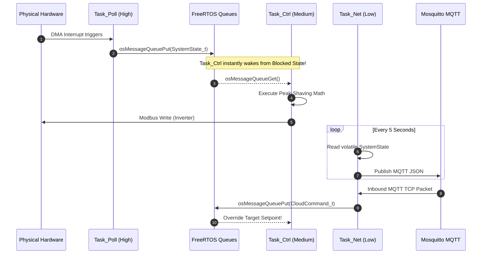

### The Operational Queues & Data Structures

Our architecture relies on three explicit FreeRTOS Ring-Buffer Queues to manage data flow deterministically.

**Queue Creation & Routing Pseudo-Code:**
```c
// 1. Queue Handle Definitions
osMessageQueueId_t Queue_DataHandle;
const osMessageQueueAttr_t Queue_Data_attributes = { .name = "Queue_Data" };

// 2. Queue Allocation (During System Boot)
// Capacity: 32 elements deep. Element size: sizeof(SystemState_t)
Queue_DataHandle = osMessageQueueNew(32, sizeof(SystemState_t), &Queue_Data_attributes);

// 3. Task_Ctrl Intercepting the Queue
void Start_Task_Ctrl(void *argument) {
  SystemState_t system_state; // Local memory copy for isolation
  
  for(;;) {
    // 4. Block forever (0% CPU) until Task_Poll pushes new telemetry!
    if(osMessageQueueGet(Queue_DataHandle, &system_state, NULL, osWaitForever) == osOK) {
        
        // Data has seamlessly arrived by value!
        // Run strict safety limits and peak-shaving formulas
        run_peak_shaving_algorithm(&system_state);
        
        // Physically transmit hardware command back to inverter
        execute_inverter_command();
    }
  }
}
```

> **What does "16 Elements" actually mean in RAM?**
> A common misconception is that "16 Elements" means 16 blocks of huge 256-byte buffers.
> In FreeRTOS, an "element" is the exact `sizeof(YourStruct)`.
> For example, `CanFrame_t` contains an ID (4 bytes), an 8-byte payload array (8 bytes), a DLC length (1 byte), and a flag (1 byte)—roughly 14 to 16 bytes total with padding.
> Therefore, allocating **16 Elements** for the CAN queue consumes a remarkably tiny **~256 bytes of RAM total** `(16 loops * 16 bytes)`, NOT 4,096 bytes. FreeRTOS allocates this specific block of RAM completely statically upon booting, permanently eliminating memory fragmentation risks!

1. **`Queue_Data` (Bottom-Up Telemetry)**
   * **Capacity:** 32 Elements (`SystemState_t`)
   * **Function & Sizing Logic:** Pushed by `Task_Poll` directly to `Task_Ctrl`, it contains the unified picture of the system (Grid Watts, Battery SOC, existing hardware limits). A capacity of 32 provides massive safety mapping; if the Brain (`Task_Ctrl`) temporarily stalls doing heavy decision math, `Task_Poll` can queue up up to 32 independent polling loop snapshots before dropping data. Because `Task_Ctrl` is blocked with `osWaitForever` on this queue, the microsecond `Task_Poll` finishes assembling the Modbus/CAN telemetry and pushes to this queue, the logic brain awakens instantly.

2. **`Queue_Cmd` (Top-Down Overrides)**
   * **Capacity:** 16 Elements (`CloudCommand_t`)
   * **Function & Sizing Logic:** Pushed by `Task_Net` down to `Task_Ctrl`. When a remote user inputs a new command on the dashboard or issues a limit change via MQTT, `Task_Net` catches it on the W5500 SPI, parses the JSON, and drops the raw struct into this queue. A capacity of 16 is sufficient because remote human/cloud commands arrive slowly (e.g. 1 per second); we will never realistically hit 16 queued operator commands before the Brain processes them. It acts as an asynchronous interrupt directly prioritizing logic overrides.

3. **`queueCanRxHandle` (ISR hardware offloading)**
   * **Capacity:** 16 Elements (`CanFrame_t`)
   * **Function & Sizing Logic:** This is the most critical safety queue, designed to prevent J1939 CAN bus dropped packets. It bridges raw silicon Interrupts directly to software. When a battery rack broadcasts rapid data, it triggers a nanosecond hardware ISR. The ISR rips the data out of the STM32's fragile 3-element silicon mailbox and pushes it into this much deeper 16-element software ring buffer. This provides a software "shock absorber," allowing `Task_Poll` to lazily grab frames 16x slower than the bus physically arrives without ever losing critical voltage telemetry.

### What Happens When a FreeRTOS Queue is FULL?
If a writer tries to push data into a queue that has no remaining capacity, the behavior is strictly defined by the **Timeout Parameter** supplied to the `osMessageQueuePut()` command.
* **Timeout = 0 (`osWait_None`):** (Used by our `queueCanRxHandle` ISR). If a battery sends its 17th consecutive packet before `Task_Poll` reads the first 16, the ISR must *never* block. It uses a timeout of `0`. The `osMessageQueuePut` function instantly fails and returns `osErrorResource`. The 17th packet is permanently dropped, but the FreeRTOS OS kernel continues to run safely without crashing or hanging.
* **Timeout = MAX (`osWaitForever`):** If a software task tries to write to a full queue with `osWaitForever`, that writing task is immediately yanked by the OS Scheduler and placed into a infinite `Blocked` state at 0% CPU. It will permanently sleep until some other task comes along and reads a piece of data out of the queue, making room for the new payload. We explicitly avoid using this on pushing operations to prevent tasks from unintentionally stalling the system.

---

<a id="13"></a>
## 13. Deferred Interrupt Processing (ISRs)

> 💡 * Key Concept:** The absolute golden rule of RTOS design is to keep Interrupt Service Routines (ISRs) incredibly short. ISRs should only move data into an RTOS object, unblock a task, and exit. All heavy processing is **deferred** to the task level.

### Case A: Modbus RS-485 via DMA & Semaphores

**Why DMA instead of Normal UART RX/TX Interrupts?**
* **The CPU Starvation Problem:** A standard Modbus RTU telemetry packet is roughly 256 bytes long. If we used standard `HAL_UART_Receive_IT()`, the STM32's silicon would force the FreeRTOS CPU to stop what it is doing and jump into an Interrupt Service Routine (ISR) **256 individual times**—once for every single byte. This causes massive CPU thrashing and risks starving lower-priority tasks.
* **The DMA Solution:** DMA (Direct Memory Access) acts as an independent hardware co-processor. When we call `HAL_UART_Receive_DMA()`, we simply hand the hardware a memory pointer. The DMA silicon physically grabs data from the UART queue and places it directly into RAM completely autonomously while the main FreeRTOS CPU sleeps at 0% load. The CPU is only interrupted exactly **ONCE** at the very end when the entire 256-byte frame is fully assembled (detected via the physical UART `IDLE` line).

**What is the UART IDLE Line Detection?**
When using DMA to receive variable-length frames (like Modbus, where a slave might reply with 10 bytes or 256 bytes), we cannot simply tell the DMA "interrupt the CPU when you receive exactly X bytes" because we don't always know X in advance. If the slave only sends 15 bytes and we told the DMA to wait for 200, the FreeRTOS task would hang forever. 
Instead, we rely on the physical silicon of the UART peripheral. When the physical slave device finishes transmitting its packet, it lets the RS-485 copper wire go silent. The STM32 hardware watches this electrical silence. If the receiver line (`RX`) remains held completely high (Logic 1 / Idle) for the duration of one complete character frame (typically 10 bits), the STM32 silicon mathematically concludes: *"The sender has stopped talking."* 
It instantly throws a native hardware **IDLE Interrupt**. This is magical for RTOS design: it allows the FreeRTOS task to wake up safely the exact microsecond a message of *any* arbitrary length finishes streaming into RAM, guaranteeing perfect deterministic Modbus timing without polling.
### Case C: Hardware Determinism via Advanced NVIC Prioritization

While FreeRTOS handles task-level scheduling (milliseconds), the **Nested Vectored Interrupt Controller (NVIC)** handles silicon-level scheduling (nanoseconds). 

In an industrial environment, multiple interrupts can fire simultaneously. For example:
1.  **Event A:** The Modbus DMA finishes a 256-byte telemetry transfer and signals an `IDLE` interrupt.
2.  **Event B:** The Battery BMS sends a high-priority CAN message at the exact same microsecond.

**The Architecture Problem:** If the CPU tries to handle both at once, which one wins? If the software has to choose, we introduce non-deterministic "jitter."

**The Silicon Solution:**
We configured the **NVIC Priority Grouping** to ensure that critical industrial protocols are prioritized in physical transistors before the CPU even starts executing code:

| Interrupt Source | NVIC Priority | Rationale |
| :--- | :--- | :--- |
| **CAN1_RX0_IRQ** | **5** (Higher) | **Safety Critical:** Battery voltage limits must be processed instantly. Dropping a CAN frame due to latency is unacceptable. |
| **USART2_IRQ (Modbus)** | **6** (Lower) | **Latency Tolerant:** Modbus uses DMA offloading; if the CPU is a few microseconds late to handle the IDLE flag, the data is already safe in RAM. |
| **FreeRTOS Kernel (SVCall)** | **15** (Lowest) | **Kernel Integrity:** The RTOS scheduler itself runs at the lowest possible hardware priority. This ensures that the OS never "blocks" a critical battery safety interrupt. |

**Hardware Preemption Flow:**
If the CPU is already halfway through executing the `USART2_IRQHandler` (Modbus), and the `CAN1_RX0_IRQHandler` fires, the NVIC physically **suspends** the Modbus handler, saves its registers to the stack, and immediately jumps to the CAN handler.

This is **Absolute Determinism**. Collisions are resolved mathematically by the NVIC silicon logic based on our hard-coded priority numbers, ensuring that the Battery BMS always has the fastest possible path to the CPU, regardless of what the RTOS or other peripherals are doing.

#### The DMA Execution Flow

**Why does toggling the DE pin in a standard RTOS loop cause dangerous logic jitter?**
RS-485 is a *half-duplex* physical bus. The transceiver chip (like a MAX3485) can either `Transmit` or `Receive`, but never both at the same time. The direction is controlled by the physical `DE` (Data Enable) pin.
If we ran a standard RTOS loop like this:
```c
HAL_UART_Transmit(data_out); // Send the data
HAL_GPIO_WritePin(DE_PIN, LOW); // Switch to Receive mode!
```
There is a massive risk. The microsecond `HAL_UART_Transmit()` finishes, the RTOS might decide to switch context to service a network packet or a CAN interrupt. This means the CPU pauses right *before* executing `HAL_GPIO_WritePin(DE, LOW)`. During this 1-2 millisecond delay, the transceiver is stuck in "Transmit" mode.
The slave inverter receives the poll and replies almost instantly. Because the STM32's transceiver is still stuck in transmit mode (it's deaf!), the physical incoming bytes from the inverter crash into the transceiver and are permanently dropped. This is **timing jitter**. 
By binding the `DE` pin toggle exclusively to the silicon-level `TxCpltCallback()` (hardware interrupt), we guarantee that the nanosecond the last transmission bit leaves the silicon register, the `DE` pin drops to `LOW`, making the system instantly ready to hear the slave's reply, perfectly decoupling it from the OS scheduler.

**The Exact DMA Flow:**

1.  `Task_Poll` triggers `HAL_UART_Transmit_DMA` and instantly puts itself to sleep via `osSemaphoreAcquire(rxCompleteSem, 250ms)`.
2.  The DMA natively blasts bytes. The nanosecond transmission completes, a physical silicon interrupt fires: `HAL_UART_TxCpltCallback()`.
3.  The ISR instantly pulls the `DE` pin **LOW** (Listen Mode) and exits.
4.  When the Slave responds, the Silicon detects an `IDLE` line and fires `HAL_UARTEx_RxEventCallback()`.
5.  This ISR executes **`osSemaphoreRelease()`**, which instantly awakens `Task_Poll` to parse the payload.

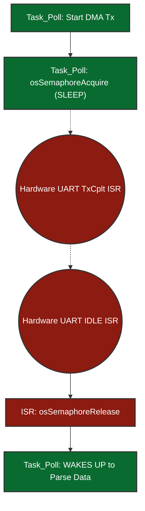

### Case B: CAN Bus Hardware Mailbox Overflows

**Why not use DMA for CAN?**
A common question is: *"If DMA is so great for Modbus, why don't we use DMA for the CAN bus?"*
1. **The Nature of CAN vs Modbus:** Modbus RS-485 sends large, uninterrupted, sequential streams of data (e.g., 256 continuous bytes) that are perfect for a DMA engine to stream into a large RAM buffer. CAN bus, however, is comprised of tiny, disjointed 8-byte frames that arrive randomly based on arbitration logic. 
2. **Silicon Limitations:** The STM32F407 has **two DMA controllers** (DMA1 and DMA2) offering a total of **16 streams**. However, the `bxCAN` (Basic Extended CAN) peripheral physically built into this silicon era of STM32 does not support native DMA requests to pull individual 8-byte frames out of the mailbox. (Newer chips like STM32G4 with `FDCAN` do, but not the F407).

**Does reading CAN via an ISR overload the CPU?**
*   **The Overload Myth:** At 250kbps, a sudden burst of BMS broadcasts can easily overflow the STM32's tiny 3-element CAN receive mailbox. You might think reading it via an ISR every time a frame arrives is a huge CPU overload.
*   **The Reality:** The `HAL_CAN_RxFifo0MsgPendingCallback()` ISR is extraordinarily fast. It takes less than **1 microsecond** for the Cortex-M4 CPU to execute. It simply executes 3 native ARM assembly instructions to copy 8 bytes from the hardware mailbox register directly into checking our FreeRTOS `queueCanRxHandle` (an expandable 16-element deep RAM queue).
*   **The Fix:** This nanosecond ISR prevents the hardware mailbox from dropping frames. Later, when `Task_Poll` runs at its leisure, it casually drains this FreeRTOS software queue (`osMessageQueueGet(..., 0)` - *non-blocking*) without having dropped a single frame from the batteries.

---

<a id="14"></a>
## 14. Network Stack (WIZnet W5500 Hardware Offload)

The STM32F407 does not run a bloated software TCP/IP stack (like LwIP) which would consume massive amounts of CPU and RAM. Instead, it delegates all heavy ethernet processing to the WIZnet W5500 silicon wrapper via SPI.

**1. Who manages the IP Address and DHCP?**
The W5500 itself only handles IP/TCP/UDP *packet routing* in hardware; it does *not* have an internal DHCP engine. To achieve DHCP, the STM32 uses the lightweight `WIZnet DHCP Client Library` written in C. 
During boot, the STM32's `Task_Net` writes a broadcast UDP packet to the W5500. The local gateway router responds with a DHCP Offer. The STM32 parses the UDP payload and physically writes the finalized IP Address, Gateway, and Subnet Mask directly into the W5500's silicon memory registers (e.g., `SIPR`). Once written, the hardware operates autonomously.

**2. Does it support IPv4 or IPv6?**
The W5500 is strictly a physical **IPv4** hardware controller. It does not have the silicon state machines to natively handle 128-bit IPv6 headers or ICMPv6 Neighbor Discovery. If we required IPv6, we would be forced to run the W5500 in `MACRAW` generic bypass mode and run the LwIP software stack on the STM32 CPU, defeating the entire purpose of 0% CPU hardware offloading.

**3. Is it Stateful or Stateless?**
The W5500 is completely **Stateful** at the Transport Layer (Layer 4). It contains 8 independent hardware socket registers. When `Task_Net` opens an MQTT socket, the W5500 silicon independently handles the 3-way TCP handshake (`SYN / SYN-ACK / ACK`), sliding window size tracking, sequence number acknowledgement, and packet retransmission timeouts. The STM32 does not manage any TCP state; it simply asks the W5500 "Are you connected?" and "Give me the readable payload bytes".

**4. What happens if the Network Cable is unplugged at runtime?**
We achieve **indestructible Auto-Reconnect** without ever resetting the STM32 CPU. 
The W5500 has a physical Ethernet PHY status register (`PHYCFGR`). Inside the primary loop of `Task_Net`, we continuously run a FreeRTOS polling execution (`wizphy_getphylink()`).
*   **Disconnect:** If a technician rips the ethernet RJ45 cable out of the socket, the PHY Link physically severs. `Task_Net` detects this instantly, safely closes the MQTT C-socket, flushes the buffers, and blocks itself into a sleepy waiting state (`osDelay(1000)`).
*   **Reconnect:** When the cable is plugged back in, the PHY Link restores. `Task_Net` wakes up, re-runs the DHCP Client to acquire a fresh IP lease, executes a completely new hardware TCP socket connection, and seamlessly reconnects to the MQTT Broker. The local FreeRTOS Peak-Shaving algorithms never paused or crashed during this entire network outage!

---

<a id="15"></a>
## 15. Over-The-Air (OTA) Updates & Memory Protection

One of the most complex features of a bare-metal RTOS is updating its own executable code without "bricking" the board in the field.

**What does "writing directly to Silicon transistors" actually mean?**

On a Linux system (like the i.MX93), the OS abstracts storage behind a filesystem (`ext4`, `FAT`). You write a file and the OS negotiates with the eMMC controller to find free Flash blocks, manage wear-levelling, and handle journaling transparently.

On a bare-metal STM32, there is **no filesystem abstraction layer**. The internal Flash memory is a 1MB block of **Floating-Gate Transistors** etched into the silicon die. A floating-gate transistor is a standard MOSFET but with a second isolated gate (the "floating gate") sandwiched between two layers of silicon dioxide insulation:

```
     Control Gate  ← HAL_FLASH_Program() applies a precise HV pulse here
          │
 ┌────────────────┐
 │   SiO₂ Layer  │  ← Electrical insulator
 │ ┌────────────┐ │
 │ │FLOATING    │ │  ← Electrons TRAPPED here = logical bit "0"
 │ │GATE        │ │  ← NO electrons here     = logical bit "1"
 │ └────────────┘ │
 │   SiO₂ Layer  │  ← Electrical insulator
 └────────────────┘
     Source / Drain → Current flows (1) or is blocked (0)
```

*   **Writing (Programming) a bit to `0`:** `HAL_FLASH_Program()` instructs the Flash Controller to apply a high-voltage (~12V) pulse to the control gate. Quantum tunneling forces electrons through the insulating oxide layer onto the floating gate. These trapped electrons block current flow through the transistor, representing a physical `0`.
*   **Reading a bit:** A lower read voltage is applied. If current flows through the transistor → `1`. If blocked by trapped electrons → `0`.
*   **Erasing a sector:** A reversed high voltage sweeps all trapped electrons off the floating gates of an **entire sector at once** (e.g., 16KB or 128KB). This is why erasing takes **10 to 50 milliseconds** — thousands of transistors must be simultaneously discharged — and physically locks the entire ARM data bus during the operation.
*   **Non-volatility:** The electrons remain trapped on the floating gate for **10 to 100 years** with zero power applied. This is why Flash memory retains firmware across power cycles.

**❓ "Is this floating-gate array a separate chip, or part of the STM32?"**

It is **built directly into the STM32F407 die itself**. There is no external Flash chip. The STM32F407VGT6 is a **System-on-Chip**: a single 10mm × 10mm silicon package that contains the Cortex-M4 CPU, DMA controllers, all peripherals (UART, SPI, CAN), **1MB of Flash**, and 192KB of SRAM — all fabricated together on one piece of silicon.

```
STM32F407VGT6 — Single Silicon Die (~49mm²)
┌──────────────────────────────────────────────────────┐
│  ┌─────────────┐   ┌─────────────────────────────┐  │
│  │ Cortex-M4   │   │ 1MB Internal Flash           │  │
│  │ CPU + FPU   │   │ (8,388,608 floating-gate     │  │
│  │ @ 168MHz    │   │  transistors in a grid)      │  │
│  └─────────────┘   └─────────────────────────────┘  │
│  ┌─────────────┐   ┌─────────────────────────────┐  │
│  │ 192KB SRAM  │   │ Peripherals: UART, SPI, CAN  │  │
│  │ + 64KB CCM  │   │ DMA, Timers, ADC, I2C...    │  │
│  └─────────────┘   └─────────────────────────────┘  │
└──────────────────────────────────────────────────────┘
             All on ONE physical IC package.
             No external Flash chip required.
```

**Flash vs SRAM — What is each one used for?**

These are two completely different types of silicon memory with opposite properties:

| Property | Flash (1MB) | SRAM (192KB + 64KB CCM) |
|---|---|---|
| **Cell type** | Floating-gate transistor | Standard 6-transistor SRAM cell |
| **Volatile?** | ❌ Non-volatile — survives power-off | ✅ Volatile — contents lost instantly on power-off |
| **Write speed** | Very slow (~ms per sector erase) | Extremely fast (single CPU cycle) |
| **What lives here** | The firmware binary (code + constants) | Everything that runs at runtime |
| **Analogy** | Your hard drive / eMMC | Your RAM / DDR |

**What exactly is in each region at runtime in this project?**

```
FLASH (1MB) — Non-volatile, survives power-off         @ 0x08000000
┌─────────────────────────────────────────────────┐
│ MCUboot binary + embedded ECDSA public key      │ ← Bootloader code
│ Scratch swap space (empty, used by MCUboot)     │
│ FreeRTOS app: compiled machine code             │ ← CPU fetches instructions here
│   ├─ Task function code (StartPollTask etc.)    │
│   ├─ HAL driver machine code                    │
│   ├─ const lookup tables, string literals       │
│   └─ Initial values of global variables (.data) │
│ Bank 2: OTA download slot (empty until OTA)     │
└─────────────────────────────────────────────────┘

SRAM (192KB) — Volatile, wiped on every power-off      @ 0x20000000
┌─────────────────────────────────────────────────┐
│ .data section: initialized global variables      │ ← Copied from Flash at boot
│   e.g. int retryCount = 0;                      │
│ .bss section: zero-initialized globals          │ ← Zeroed by _start()
│   e.g. SystemState_t globalState;               │
│ FreeRTOS Heap: Queues, Semaphore control blocks │
│   ├─ Queue_Data ring buffer (32 × SystemState_t)│
│   ├─ Queue_Cmd ring buffer  (16 × CloudCmd_t)   │
│   └─ queueCanRxHandle ring buffer               │
│ Task Stacks (each task gets its own SRAM stack) │
│   ├─ Task_Poll stack (512 × 4 = 2KB)            │
│   ├─ Task_Net  stack (512 × 4 = 2KB)            │
│   └─ Task_Ctrl stack → CCM RAM (see below)      │
│ chunkBuffer[1024]: OTA 1KB staging buffer        │ ← Temporary, overwritten each chunk
│ mqttPayloadBuffer: JSON telemetry string buffer  │
│ rx_buffer: incoming Modbus DMA landing zone      │
└─────────────────────────────────────────────────┘

CCM RAM (64KB) — Zero-wait-state, CPU bus direct       @ 0x10000000
┌─────────────────────────────────────────────────┐
│ Task_Ctrl stack (peak-shaving algorithm)        │ ← Fastest possible execution
│   __attribute__((section(".ccmram")))           │
│   uint32_t ctrlTaskStack[512];                  │
└─────────────────────────────────────────────────┘
```

**The key insight:** The CPU fetches its instructions from **Flash** on every clock cycle (the compiled machine code never moves — it lives there permanently). But every variable, every queue, every task stack, every runtime value — all of that **only exists in SRAM**. SRAM is completely blank after every power cycle. The C runtime `_start()` function re-populates it from the `.data` section in Flash at every boot before `main()` runs.

This is why on a Linux system you have an eMMC (Flash equivalent) AND DDR RAM (SRAM equivalent as separate chips). On the STM32, both are baked into the same die — just much smaller.

---

### What is CCM RAM and Why Does Task_Ctrl Live There?

**CCM = Core Coupled Memory.** It is a special 64KB SRAM block on the STM32F407 that is wired differently from normal SRAM.

#### The Bus Architecture Problem

Every peripheral on the STM32 is connected through a central **AHB System Bus Matrix** — an on-chip crossbar switch that lets the Cortex-M4 CPU, all DMA streams, and all peripherals communicate. The problem is this bus is **shared**. When the CPU wants to read data from normal SRAM at `0x20000000`, it enters the bus, waits for any pending DMA transfers or peripheral accesses to finish, then gets its data. This takes **1 to 3 extra clock cycles** per access — called "wait states."

```
Normal SRAM Access Path (shared bus):
────────────────────────────────────────────────────────

   Cortex-M4 CPU                         SRAM
   ┌───────────┐                     ┌──────────┐
   │  I-Bus    │──────────────────▶  │          │
   │  (instr.) │                     │  Normal  │
   │           │    AHB System       │  SRAM    │
   │  D-Bus    │──▶ Bus Matrix ────▶ │ 0x20000000│
   │  (data)   │  ┌────────────┐     │          │
   └───────────┘  │ DMA Ctrl 1 │──▶  │          │
                  │ DMA Ctrl 2 │──▶  │          │
                  │ Peripherals│──▶  │          │
                  └────────────┘     └──────────┘
                  ↑ All compete here — CPU may wait 1-3 cycles

CCM RAM Access Path (dedicated private wire):
────────────────────────────────────────────────────────

   Cortex-M4 CPU                         CCM RAM
   ┌───────────┐                     ┌──────────────┐
   │  D-Bus    │═════════════════▶   │  CCM RAM     │
   │  (data)   │  Private direct     │  0x10000000  │
   └───────────┘  wire — no matrix   │  64KB        │
                  no waiting!        └──────────────┘
                  ↑ CPU always gets 0 wait states here
                  ⚠ DMA CANNOT access CCM RAM — wrong bus!
```

#### Why CCM RAM Cannot Be Used for DMA Buffers

This is a critical hardware constraint. DMA controllers are connected to the **AHB system bus**, not the CPU's private D-Bus. CCM RAM is literally not electrically connected to the AHB bus. Therefore:
- ✅ CCM RAM is **perfect for Task stacks, local variables, math buffers** — anything the CPU reads/writes directly
- ❌ CCM RAM **cannot be used for** `rx_buffer` (Modbus DMA target), `chunkBuffer` (SPI DMA), or any buffer that hardware DMA writes to

This is exactly why our `rx_buffer` for Modbus DMA stays in normal SRAM at `0x20000000`, while `Task_Ctrl`'s stack moves to CCM RAM.

#### How We Move Task_Ctrl's Stack Into CCM RAM (3 Steps)

**Step 1 — The Linker Script defines the CCM RAM region:**
```c
// STM32F407VGTX_FLASH.ld
MEMORY {
    CCMRAM (xrw) : ORIGIN = 0x10000000, LENGTH = 64K   // ← CCM region declared
    RAM    (xrw) : ORIGIN = 0x20000000, LENGTH = 128K
    FLASH  (rx)  : ORIGIN = 0x08040000, LENGTH = 384K
}

SECTIONS {
    .ccmram :                          // ← Section maps to CCM address
    {
        *(.ccmram)
        *(.ccmram*)
    } > CCMRAM AT > FLASH             // Initialised from Flash at boot
}
```

> **❓ "How do we decide 64K, 128K, 384K? Can we change these sizes?"**
>
> **You do not decide them. They are fixed, immutable physical properties of the STM32F407VGT6 silicon die**, documented in ST's Reference Manual (RM0090). The `MEMORY {}` block is not a configuration — it is a *description of what physically exists on the chip*. Writing wrong values does not reconfigure the hardware; it causes HardFaults when your code tries to access addresses with no transistors behind them.
>
> **Origins and sizes come directly from the STM32F407 datasheet:**
>
> | Region | `ORIGIN` | `LENGTH` | Fixed by silicon? |
> |---|---|---|---|
> | CCM RAM | `0x10000000` | **64KB** — exactly 65,536 CCM transistor cells | ✅ Yes — cannot change |
> | SRAM1   | `0x20000000` | 112KB on-die (part of the 128K total) | ✅ Yes |
> | SRAM2   | `0x2001C000` | 16KB on-die (linker merges with SRAM1 as 128K) | ✅ Yes |
> | Flash   | `0x08000000` | **1024KB** physical total | ✅ Yes |
>
> **What we changed vs left alone:**
> ```
> DEFAULT (from STM32CubeMX):          OUR VERSION (MCUboot offset added):
> FLASH  : ORIGIN = 0x08000000,        FLASH  : ORIGIN = 0x08040000,  ← CHANGED
>           LENGTH = 1024K                       LENGTH = 384K         ← CHANGED
> RAM    : ORIGIN = 0x20000000,        RAM    : ORIGIN = 0x20000000,  ← UNCHANGED
>           LENGTH = 128K                        LENGTH = 128K         ← UNCHANGED
> CCMRAM : ORIGIN = 0x10000000,        CCMRAM : ORIGIN = 0x10000000,  ← UNCHANGED
>           LENGTH = 64K                         LENGTH = 64K          ← UNCHANGED
> ```
> Only the Flash window was shifted to reserve the first 256KB for MCUboot. The RAM and CCM values are copied verbatim from the datasheet and must never be changed.
>
> **What happens if you lie to the linker:**
> ```c
> // ❌ WRONG — CCM RAM on this chip is only 64KB
> CCMRAM (xrw) : ORIGIN = 0x10000000, LENGTH = 128K
> // Linker places data at 0x10010000 (beyond real CCM end: 0x1000FFFF)
> // CPU reads from 0x10010000 at runtime → no transistors there → BusFault → HardFault
> ```
>
> **CCM size differs across STM32 variants:**
> ```
> STM32F407VGT6 (this project) → CCM = 64KB  @ 0x10000000
> STM32F103C8   (Blue Pill)    → CCM = NONE  (this chip has no CCM at all!)
> STM32F767ZI                  → CCM = NONE  (replaced by DTCM 128KB @ 0x20000000)
> STM32H743ZI                  → ITCM = 64KB + DTCM = 128KB (different architecture)
> ```
> This is one of the reasons the STM32F407 was chosen over cheaper alternatives like the STM32F103 — the dedicated 64KB CCM RAM is a free hardware performance bonus unavailable on smaller variants.

---

### When Do You Actually Need to Edit the Linker Script?

In a **basic bare-metal project** (no bootloader, no special memory placement), the STM32CubeMX-generated linker script works perfectly and you should never touch it. However, there are well-defined real-world situations that require edits. Here are all of them:

#### Situations in a General STM32 Project

| Situation | What You Change | Why |
|---|---|---|
| **Adding a bootloader (MCUboot, custom)** | `FLASH ORIGIN` + `LENGTH` | Shift app start address to leave room for bootloader at front of Flash |
| **Placing code in CCM / fast RAM** | Add `.ccmram` section in `SECTIONS {}` | CCM is not mapped by default — you must define the section manually |
| **Adding external SPI Flash (QSPI/XIP)** | Add `QSPI_FLASH` region to `MEMORY {}` | External Flash at a different base address (e.g., `0x90000000` for QSPI) |
| **Adding external SRAM via FMC bus** | Add `EXT_RAM` region to `MEMORY {}` | External SDRAM/SRAM chip connected via FMC at `0x60000000+` |
| **Reserving persistent config / NVS area** | Add `NVDATA` region at last Flash sector | Store device settings at a fixed Flash address that OTA never erases |
| **Shared memory between bootloader & app** | Add `SHARED_RAM` at a specific SRAM address with `NOLOAD` | Pass boot reason flags or crash logs between boot stages without zero-init |
| **Placing ISR handlers in CCM for speed** | Add custom section + GCC attribute | Critical ISRs execute from 0-wait-state CCM instead of Flash (avoids Flash wait states during execution) |
| **Stack / heap size enforcement** | Modify `_Min_Stack_Size` and `_Min_Heap_Size` symbols | Ensure the linker errors at build time if your code would overflow |
| **Firmware metadata / version struct** | Reserve fixed address for a `FW_INFO` struct | Allows a programmer tool to read firmware version without parsing full ELF |
| **Backup SRAM (survives reset / low power)** | Add `BKPSRAM` region at `0x40024000` | 4KB battery-backed SRAM on STM32F4 that survives system reset and standby |

#### The Two Modifications We Made in This Project

**Modification 1 — Flash window shift for MCUboot:**
```
Before:  FLASH : ORIGIN = 0x08000000, LENGTH = 1024K  ← full 1MB, app owns everything
After:   FLASH : ORIGIN = 0x08040000, LENGTH = 384K   ← app starts 256KB in, MCUboot owns front
```
Required because MCUboot must live at `0x08000000` (the ARM reset vector address). Without this, both MCUboot and the app would try to link to the same addresses and corrupt each other.

**Modification 2 — Adding the `.ccmram` section for Task_Ctrl:**
```c
// Added to SECTIONS {} in STM32F407VGTX_FLASH.ld:
.ccmram :
{
    . = ALIGN(4);
    _sccmram = .;
    *(.ccmram)
    *(.ccmram*)
    . = ALIGN(4);
    _eccmram = .;
} >CCMRAM AT> FLASH
```
Required because the CCM RAM region exists in hardware but has no default section in the linker script. Without this addition, `__attribute__((section(".ccmram")))` in C code would produce a linker error: `"no memory region specified for section '.ccmram'"`.

#### Things You Should NEVER Change

| Field | Why Not |
|---|---|
| `ORIGIN` of `RAM` / `CCMRAM` | Fixed silicon addresses from datasheet |
| `LENGTH` of `RAM` / `CCMRAM` | Fixed silicon sizes — lying causes runtime HardFaults |
| The `.isr_vector` section placement | Must be at the start of the Flash region (VTOR base) |
| The `.data` and `.bss` section structure | C runtime `_start()` depends on the `_sdata`, `_edata` symbols these generate |

**Step 2 — GCC attribute forces the stack array into `.ccmram` section:**

```c
// main.c — Task_Ctrl stack and control block placed in CCM RAM
__attribute__((section(".ccmram"))) uint32_t ctrlTaskStack[512];
__attribute__((section(".ccmram"))) StaticTask_t ctrlTaskControlBlock;
```
The `__attribute__((section(".ccmram")))` GCC directive tells the linker: *"Put this variable in the `.ccmram` section"* — which the linker script maps to `0x10000000`. Without this, GCC would place the array in normal `.bss` (SRAM at `0x20000000`) by default.

**Step 3 — FreeRTOS task creation uses the CCM pointers:**
```c
// main.c — osThreadAttr_t points FreeRTOS directly to CCM RAM
const osThreadAttr_t ctrlTask_attributes = {
    .name      = "Task_Ctrl",
    .cb_mem    = &ctrlTaskControlBlock,     // TCB lives in CCM RAM
    .cb_size   = sizeof(ctrlTaskControlBlock),
    .stack_mem = &ctrlTaskStack[0],         // Stack lives in CCM RAM
    .stack_size= sizeof(ctrlTaskStack),     // 512 × 4 = 2048 bytes
    .priority  = (osPriority_t) osPriorityHigh,
};
// FreeRTOS will use our CCM buffers instead of allocating from SRAM heap
ctrlTaskHandle = osThreadNew(StartCtrlTask, NULL, &ctrlTask_attributes);
```

#### Why Task_Ctrl and NOT Task_Poll or Task_Net?

This is the right question. CCM RAM is 64KB — we could theoretically put all three task stacks there. But only `Task_Ctrl` genuinely benefits. Here's why, by comparing what each task actually does during one cycle:

**What does each task spend its time doing?**

| | `Task_Poll` | `Task_Net` | `Task_Ctrl` |
|---|---|---|---|
| **Primary activity** | Firing DMA, then **sleeping** | Waiting for SPI/TCP, then **sleeping** | **Actively computing** math |
| **CPU-bound work** | Minimal — parse ~10 Modbus bytes | Minimal — `snprintf()` for JSON | **Heavy** — float peak-shaving loop |
| **Stack access pattern** | Brief burst, then 300ms blocked | Brief burst, then 5s blocked | Continuous, no sleeping during compute |
| **Local variables on stack** | A few ints, a frame pointer | String buffer pointers, packet length | `float surplus`, `int32_t delta`, `uint16_t setpoint`... many floats |
| **Where it waits** | `osSemaphoreAcquire()` — blocked | `osDelay(5000)` — blocked | `osMessageQueueGet()` — briefly, then computes |
| **DMA interaction** | YES — DMA writes to its `rx_buffer` | YES — SPI DMA reads `chunkBuffer` | **NO** — pure CPU math, no DMA |

```
Timeline of each task in one 300ms window:

Task_Poll (Priority: Realtime)
─────────────────────────────────────────────────────────────────▶ time
[fire DMA] [sleep ~290ms waiting for UART response] [parse] [fire DMA again]
     └─ only brief CPU bursts, 95% of time BLOCKED
        Stack accessed very rarely → CCM benefit = tiny

Task_Net (Priority: Normal)
─────────────────────────────────────────────────────────────────▶ time
[snprintf JSON] [SPI write to W5500] [sleep 5000ms] ...
     └─ mostly sleeping, occasional short string ops
        Stack rarely warm → CCM benefit = negligible

Task_Ctrl (Priority: High)  ← THE MATH ENGINE
─────────────────────────────────────────────────────────────────▶ time
[Queue wait] ──▶ [READ: gridPowerW, soc, maxChg, maxDis]
               ──▶ [COMPUTE: float surplus = maxDis - gridPowerW]
               ──▶ [COMPUTE: clamp(setpoint, MIN, MAX)]
               ──▶ [COMPUTE: PID damping, ramp limits]
               ──▶ [WRITE: inverter Modbus register]
               ──▶ [Queue wait again]
     └─ CONTINUOUS CPU work the entire time it is running
        Stack accessed on EVERY instruction → CCM benefit = REAL
```

**The decisive factor: DMA disqualification**

`Task_Poll` would also benefit from CCM RAM since it's high priority. However, `Task_Poll` owns the `rx_buffer` — the global array where UART DMA physically writes incoming Modbus bytes. If we placed `rx_buffer` in CCM RAM, the DMA engine would silently write to an address unreachable over the AHB bus, the bytes would never arrive, and the system would hang waiting for a semaphore that never gets released.

> **❓ "Is it ONLY SRAM that DMA can access? Is CCM RAM the only exception?"**
>
> CCM RAM is not the only memory DMA can access — and SRAM is not the only memory it can reach. The rule is: **DMA can access anything connected to the AHB system bus. CCM RAM is the sole exception because it is wired exclusively to the CPU's private D-Bus.**
>
> **Full DMA access map for STM32F407:**
>
> | Memory | Address | DMA Access | Why |
> |---|---|---|---|
> | Normal SRAM | `0x20000000` | ✅ Yes | On AHB bus |
> | Flash (read) | `0x08000000` | ✅ Yes (read-only) | On AHB bus via DCode |
> | APB1/2 Peripherals | `0x40000000` | ✅ Yes | DMA's primary job |
> | AHB Peripherals | `0x50000000` | ✅ Yes | Directly on AHB |
> | **CCM RAM** | **`0x10000000`** | **❌ No** | **CPU D-Bus only, not AHB** |
>
> So DMA can also read from Flash (e.g., DMA memory-to-peripheral copy from a `const` lookup table). The constraint is purely about bus topology, not memory type:
>
> ```
> STM32F407 Physical Bus Topology:
>
>             Cortex-M4 CPU
>           ┌───────────────┐
>           │  I-Bus  ──────┼──────────────────────▶ Flash (instruction fetch)
>           │  D-Bus  ══════╪══════▶ CCM RAM        ← CPU ONLY, nothing else
>           │  S-Bus  ──────┼──┐      0x10000000
>           └───────────────┘  │
>                              ▼
>     ┌──────────────── AHB Bus Matrix ─────────────────────────┐
>     │                                                          │
>  Normal SRAM    Flash (read)   Peripherals   DMA1    DMA2     │
>  0x20000000     0x08000000     0x40000000    Ctrl    Ctrl     │
>  (DMA ✅)       (DMA ✅ read)  (DMA ✅)      (AHB master)    │
>     ▲                                           │              │
>     └───────────────────────────────────────────┘              │
>              DMA moves data between anything here
>
>  CCM RAM at 0x10000000 has NO connection to the AHB bus above.
>  DMA controllers are AHB masters — they cannot see 0x10000000.
> ```
>
> **The silent failure danger — why this bug is invisible:**
>
> ```c
> // ❌ WRONG — putting a DMA buffer in CCM RAM
> __attribute__((section(".ccmram")))
> uint8_t rx_buffer_BAD[256];        // placed at 0x10000000 (CCM)
>
> HAL_UART_Receive_DMA(&huart1, rx_buffer_BAD, 256);
> // DMA starts transfer, writes 256 bytes to 0x10000000 address
> // The AHB bus has no route to CCM → bytes written into electrical void
> // rx_buffer_BAD remains all zeros (empty)
> // DMA fires "transfer complete" interrupt anyway — no error flag raised!
> // Task_Poll calls osSemaphoreAcquire(rxSem, 250ms)
> // Semaphore never releases (ISR fires but data is wrong)
> // System silently hangs, then 250ms timeout aborts — diagnosis is VERY hard
>
> // ✅ CORRECT — DMA buffer stays in normal SRAM
> uint8_t rx_buffer[256];            // placed at 0x20000000 (normal SRAM)
> HAL_UART_Receive_DMA(&huart1, rx_buffer, 256);  // DMA writes here ✅
> ```
>
> The STM32 hardware **does not generate a bus fault or error** when DMA is pointed at CCM RAM. It completes the transfer to an unreachable address and raises the success interrupt as if everything worked. This makes CCM misuse one of the hardest bugs to diagnose on an STM32.

`Task_Ctrl` has **no DMA buffers at all** — it only reads from a FreeRTOS queue (a pure CPU `memcpy` from SRAM to its own stack) and writes results via function calls. It is 100% safe to live in CCM RAM.

**In summary:**
- `Task_Poll` → Normal SRAM (DMA writes `rx_buffer` here — DMA constraint is hard)
- `Task_Net` → Normal SRAM (sleeping 99% of the time, negligible stack activity)
- **`Task_Ctrl` → CCM RAM** (pure CPU math, zero DMA interaction, heaviest stack user)

#### Summary: CCM RAM Rules

| Rule | Reason |
|---|---|
| ✅ Use for CPU-only task stacks | 0 wait states — private CPU bus |
| ✅ Use for math-heavy local variables | No bus contention during float computation |
| ✅ DMA CAN access normal SRAM | SRAM is on the AHB bus |
| ✅ DMA CAN read Flash too | Flash is on the AHB bus via DCode |
| ❌ Never use CCM for any DMA buffer | CCM is not on the AHB bus — silent data loss |
| ❌ Never use CCM for `rx_buffer` | UART DMA writes via AHB → CCM unreachable |
| ❌ Never use CCM for `chunkBuffer` | SPI DMA writes via AHB → CCM unreachable |

---

### The Full Memory Hierarchy: Where Does the CPU Actually "Think"?

When we say "CCM RAM is for CPU activities" — the CPU still needs memory to do its work. This reveals a **third level** of memory that sits above SRAM and CCM: **CPU Registers** — the actual working space of the processor.

#### Level 1: CPU Registers — Where Math Actually Happens

The Cortex-M4 has physical registers etched **inside the CPU core silicon itself** — not at any memory address, not in SRAM, not in Flash. They are microscopic flip-flop circuits inside the processor die, accessible in a single clock cycle (~0.006ns at 168MHz):

```
Cortex-M4 Internal Registers (inside CPU core, no RAM address):
┌────────────────────────────────────────────────────────────────┐
│  General Purpose:  R0   R1   R2   R3   R4   R5   R6   R7      │
│                    R8   R9   R10  R11  R12                     │
│                                                                │
│  Special Purpose:  R13 = SP  (Stack Pointer → points to SRAM) │
│                    R14 = LR  (Link Register — return address)  │
│                    R15 = PC  (Program Counter → points to Flash│
│                    xPSR      (Flags: Zero, Carry, Negative...) │
│                                                                │
│  FPU Registers:    S0  S1  S2  ... S31   (32 × float32)       │
│                    D0  D1  D2  ... D15   (16 × float64)        │
│                    FPSCR                 (FPU status/control)  │
└────────────────────────────────────────────────────────────────┘
              These are physical silicon flip-flops.
              They have no address. They are not SRAM.
              There are only ~50 of them total.
```

#### What Actually Happens When Task_Ctrl Runs a Math Line

Take this line from the peak-shaving algorithm:
```c
float surplus = maxDischargePower - gridPowerW;
```

The CPU **never directly subtracts from SRAM**. Every operation flows through registers:

```
Step ①  VLDR  S0, [SP, #8]       ; SP points to Task_Ctrl stack in CCM RAM
                                  ; Load 'maxDischargePower' → FPU register S0

Step ②  VLDR  S1, [SP, #4]       ; Load 'gridPowerW' from CCM stack → S1

Step ③  VSUB.F32  S2, S0, S1     ; FPU subtracts: S2 = S0 - S1
                                  ; THIS happens inside the FPU silicon — no memory touched

Step ④  VSTR  S2, [SP, #0]       ; Store result from S2 → CCM RAM (surplus variable)

         CCM RAM ─load─▶ FPU Reg ─compute─▶ FPU Reg ─store─▶ CCM RAM
                    (Step 1,2)    (Step 3)              (Step 4)
```

**The subtraction (Step 3) is purely inside the FPU — zero memory access.** CCM RAM is only touched in the load and store steps, which is why 0 wait states there directly speeds up the algorithm.

#### The Complete 3-Level Memory Hierarchy in This Project

```
Level    Memory             Size    Addr          Speed       Persistent?   What lives here
───────────────────────────────────────────────────────────────────────────────────────────
  1    CPU Registers         ~50    (no address)  0.006ns    ❌ Volatile   Active computation
       (R0-R15, S0-S31)     values  inside core   1 cycle    (wiped on    Math in-progress
                                                              ctx switch)  Return addresses

  2a   CCM RAM              64KB    0x10000000     ~6ns       ❌ Volatile   Task_Ctrl stack
       (Core Coupled)               CPU D-Bus      0 wait                  Local float vars
                                    only           states

  2b   Normal SRAM         192KB    0x20000000     ~6-24ns    ❌ Volatile   FreeRTOS Queues
                                    AHB bus        1-3 wait                Task stacks (Poll, Net)
                                                   states                  DMA rx/tx buffers

  3    Flash               1MB      0x08000000     ~6ns+      ✅ Permanent  Compiled machine code
       (internal)                   AHB/ICode      erase ms   forever     MCUboot bootloader
                                                                          const lookup tables
```

#### The Context Switch — Why Stack Speed Matters for the Scheduler

One more reason CCM RAM speeds up the system beyond just Task_Ctrl's math: **FreeRTOS context switches.**

Every time a higher-priority task preempts Task_Ctrl, the scheduler must:

```
Context Switch OUT (Task_Ctrl → Task_Poll):
─────────────────────────────────────────────────────────────────
① CPU auto-saves: R0-R3, R12, LR, PC, xPSR → Task_Ctrl stack   ← HARDWARE (automatic)
② FreeRTOS saves: R4-R11, S0-S31, FPSCR → Task_Ctrl stack      ← SOFTWARE (task.c)
   (All 32 FPU registers must be saved because Task_Ctrl uses floats!)
③ Stack Pointer updated to Task_Poll's saved SP (in SRAM)

Context Switch IN (Task_Poll resumes):
─────────────────────────────────────────────────────────────────
① FreeRTOS restores: R4-R11 from Task_Poll's stack (in SRAM)
② CPU auto-restores: R0-R3, LR, PC, xPSR from Task_Poll's stack
③ Task_Poll resumes at exact instruction it was interrupted at
```

When Task_Ctrl's stack is in **CCM RAM**: saving and restoring 32 FPU registers + 13 general registers = 45 × 4 bytes = 180 bytes of stack writes/reads happen at **0 wait states**.

When in **normal SRAM**: those same 180 bytes cost **1–3 wait states each** on the shared AHB bus — directly adding latency to every preemption event in the system.

Since the FreeRTOS scheduler runs up to **1000 times per second** (every 1ms SysTick), this compound saving is measurable in a profiler like SEGGER SystemView.

### The Flash Partition Architecture

The STM32F407 has 1 MB (1024 KB) of internal Flash memory. We logically partitioned this into four distinct blocks to support a primary bootloader (MCUboot) and a resilient dual-bank fallback mechanism.

**How did we conclude the size of each partition?**
We mathematically sized the boundaries based on compiled binary footprints and the architectural demands of the Cortex-M4 memory erase sectors:
1. **Bootloader (`0x08000000` - 64 KB):** MCUboot requires space for its ECDSA cryptography libraries and serial hardware drivers. A standard heavily-optimized build takes ~45 KB. We allocated exactly 64 KB (consuming the physical silicon `Sector_0` to `Sector_3`) to give it safety boundaries.
2. **Active App / Bank 1 (`0x08040000` - 384 KB):** Our current FreeRTOS application, compiled with HAL drivers, takes ~70 KB. We allocated a massive 384 KB to allow the project's logic to grow exponentially over the next 10 years without ever hitting a memory ceiling.
3. **Download Slot / Bank 2 (`0x080A0000` - 384 KB):** This *must* physically match the size of Bank 1 byte-for-byte to permit a seamless memory swap.
4. **Scratch / Swap Space (`0x08020000` - 128 KB):** MCUboot requires an empty sector to act as a temporary holding zone when physically rotating the chunks of data between Bank 1 and Bank 2.

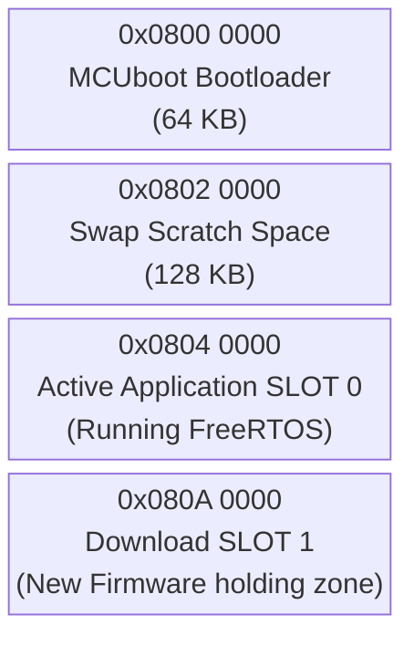

### 14.1 The Network Download Process: Will it fit in memory?
A critical operations question is: *How exactly do we download the binary, and how do we guarantee it fits in the hardware at runtime?*

**1. The Download Method:**
The firmware is downloaded via a standard HTTP/TCP socket. We **write the binary directly into Flash** — but in **1KB chunks**, not all at once.

> **❓ "Why 1KB chunks? Why not download the whole binary first, then flash it?"**
>
> Because **RAM is smaller than the binary**. The STM32F407 has only **128KB of total SRAM**. The incoming firmware binary can be up to **384KB**. You cannot fit 384KB into 128KB — it is a physical impossibility.
>
> The 1KB chunk streaming pattern is the only viable solution:
>
> ```
>  RAM (128KB total)          Flash Bank 2 (384KB)
>  ┌────────────────┐         ┌──────────────────────────────────┐
>  │                │         │ Chunk 1   (already burned)       │
>  │ chunkBuffer    │──────▶  │ Chunk 2   (already burned)       │
>  │ [1024 bytes]   │  HAL_   │ Chunk 3   ← being written NOW   │
>  │                │  FLASH_ │ Chunk 4   (still 0xFF, empty)   │
>  │ Only 1KB used  │  Prog() │ ...                              │
>  │ at any time!   │         │ Chunk 384 (still 0xFF, empty)   │
>  └────────────────┘         └──────────────────────────────────┘
>
>  Loop: Read 1KB from W5500 SPI → Burn to Flash → Read next 1KB → Repeat
>  At no point does more than 1KB of the binary exist in RAM simultaneously.
> ```
>
> The binary IS written directly to Flash transistors — we just do it 1KB at a time, in order, as each chunk arrives over SPI from the W5500 buffer. This is functionally identical to "direct Flash write" — just pipelined through a tiny RAM staging buffer.

*   The remote CI/CD Server transmits the TCP/IP packets.
*   The packets hit the **WIZnet W5500** ethernet chip. The W5500 has internal silicon buffers.
*   The STM32's `Task_Net` uses the **SPI Bus** to slowly stream 1 Kilobyte chunks out of the W5500 and into a tiny temporary RAM `chunkBuffer`.
*   The STM32 instantly writes that 1KB chunk directly into the physical Flash memory of Bank 2 using `HAL_FLASH_Program()`.

> **❓ "What is the W5500's internal buffer capacity? Does it download all 384KB first, then hand it to STM32? Or is it chunk-by-chunk?"**
>
> **Neither — it is a continuously flowing pipeline governed by TCP flow control.** The W5500 cannot store 384KB. It physically only has **32KB of total internal RX+TX buffer** split across all 8 sockets.
>
> **W5500 Internal Buffer Architecture:**
>
> The W5500 has 32KB of RX buffer and 32KB of TX buffer built into its silicon, shared across all 8 hardware sockets. Each socket's allocation is configurable, but the total is fixed at **16KB maximum RX per socket** if you dedicate the full pool to one socket:
>
> ```
> W5500 Internal Memory (fixed silicon — 64KB total):
> ┌─────────────────────────────────────────────────────────┐
> │  RX Buffer Pool: 16KB total (shared across 8 sockets)   │
> │    Socket 0 (MQTT):  2KB RX ← permanent MQTT connection │
> │    Socket 1 (OTA):  14KB RX ← maximised for OTA speed  │
> │    Sockets 2–7:      0KB   ← unused in this project    │
> │                                                         │
> │  TX Buffer Pool: 16KB total (shared across 8 sockets)   │
> │    Socket 0 (MQTT):  2KB TX ← for publishing telemetry  │
> │    Socket 1 (OTA):   2KB TX ← for HTTP GET request     │
> └─────────────────────────────────────────────────────────┘
>              Total = 32KB RX + 32KB TX = 64KB combined
>              The OTA binary is 384KB — far too large to buffer here
> ```
>
> **The actual flow — a 3-stage pipeline:**
>
> ```
> Stage 1: Cloud Server ──────────────────▶ W5500 Silicon RX Buffer (14KB)
>          TCP packets arrive at Ethernet     W5500 TCP hardware fills this buffer.
>          speed (~100Mbps)                   When buffer approaches full, W5500
>                                             shrinks the TCP receive window
>                                             → server throttles automatically
>
> Stage 2: W5500 RX Buffer ──SPI──────────▶ STM32 chunkBuffer[1024] (1KB in SRAM)
>          SPI clock @ ~10-20MHz             Task_Net issues SPI read commands:
>          (slower than Ethernet)            recv(socket, chunkBuffer, 1024)
>                                            1KB transferred per SPI transaction
>                                            → W5500 marks that 1KB as freed
>                                            → TCP window opens again
>                                            → server sends next 1KB of data
>
> Stage 3: chunkBuffer ───HAL_FLASH_Prog──▶ Flash Bank 2 (384KB)
>          Flash write @ ~1ms per KB         HAL_FLASH_Program() burns 1KB
>          (slowest stage — the bottleneck)   → loop repeats 384 times total
>
> Speed profile:
>   Ethernet RX:  ~100 Mbps      ← fastest (rarely the bottleneck)
>   SPI read:     ~20 Mbps       ← medium
>   Flash write:  ~8 Mbps (~1KB/ms) ← SLOWEST — this governs the OTA speed
>   Total OTA time: 384KB × ~1ms = ~400ms minimum (Flash limited)
> ```
>
> **The TCP Sliding Window — why it never overflows:**
>
> TCP has a built-in flow control mechanism called the **Receive Window**. The W5500 hardware automatically advertises to the remote server how many bytes of free space exist in its RX buffer. When the STM32 reads 1KB via SPI and calls `recv()`, the W5500 automatically tells the server "I have 1KB of space again — send more." If the STM32 is busy writing to Flash and hasn't read from the RX buffer yet, the W5500 tells the server "window = 0 — stop sending." The server pauses without dropping data. This self-regulating mechanism makes it impossible for the W5500's RX buffer to overflow during a well-implemented OTA loop.
>
> **Summary of the answer:**
> - ❌ NOT "download all 384KB to W5500 first" — physically impossible, W5500 only has 14KB for OTA socket
> - ❌ NOT "strict 1KB at a time — download 1KB, pause, next 1KB" — the pipeline stages overlap
> - ✅ **Continuous pipelined stream:** Server fills W5500 buffer at Ethernet speed → STM32 drains it via SPI → burns to Flash → TCP window opens → server sends more. At any given moment the W5500 holds up to ~14KB buffered ahead while the STM32 is burning the current 1KB to Flash.

**2. Guaranteeing it fits at runtime:**
Because we strictly partitioned the memory map using the `STM32F407VGTX_FLASH.ld` linker script, we have an absolute mathematical guarantee it fits.
*   Bank 1 (The live FreeRTOS app) is 384KB. It is currently executing.
*   Bank 2 (The empty download slot) is a physically separate 384KB block of silicon purely reserved for OTA.
Because we only stream 1KB chunks at a time over SPI and burn them directly into the reserved 384KB of Bank 2, the memory footprint never overflows at runtime. Bank 1 is entirely untouched until the download finishes.


### The OTA Execution Flow

### 14.2 Is Secure Boot Required? Did We Integrate It?
**Yes, it is strictly required.** In an industrial environment like an Energy Management System where an RTOS controller dictates physical power flow (e.g., cutting off loads or pushing maximum wattage to the grid), malicious or corrupted firmware could cause severe physical hardware damage. 

**Current Integration State:** The initial baseline only relied on MCUboot verifying a SHA256 integrity hash. However, **we have now fundamentally integrated Secure Boot (Cryptographic Firmware Signature Verification)**. A hash alone only proves the firmware wasn't corrupted in transit; a Cryptographic Signature proves the firmware was genuinely authored by the authorized factory team, defending against man-in-the-middle software spoofing.

### 14.3 The True Secure Boot Execution Flow (ECDSA P-256)

When `Task_Net` receives a `CMD_OTA_START` over MQTT, it safely halts the system to download the new `.bin` payload via SPI. This payload is **NOT** just raw code; it has been pre-signed by our CI/CD server using an **ECDSA (Elliptic Curve Digital Signature Algorithm) P-256 private key** via the `imgtool` utility.

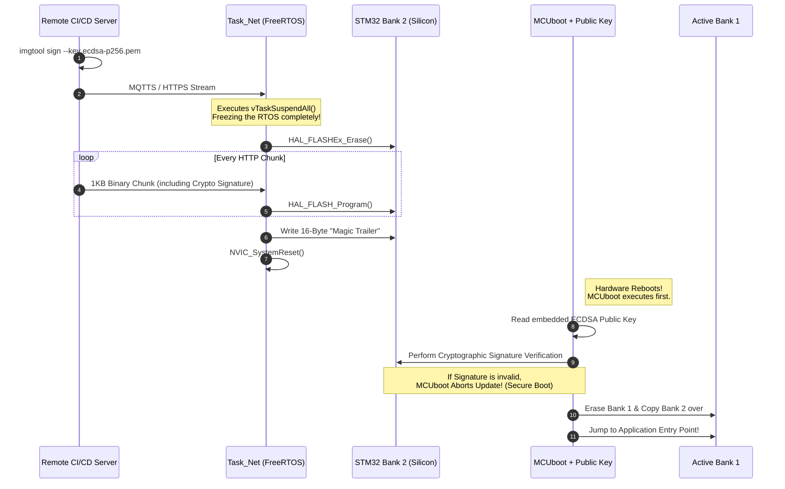

#### Step-by-Step Breakdown of the Secure Boot Flow:
1. **The Factory Signing:** During compilation, the CI/CD pipeline runs `imgtool` with our offline private key to cryptographically append an ECDSA signature to the binary.
2. **The Trigger:** `Task_Net` receives the `{"cmd":"ota"}` MQTT packet indicating a new firmware binary is ready.
3. **RTOS Halt:** `Task_Net` invokes `vTaskSuspendAll()`, explicitly denying the FreeRTOS Scheduler the right to context switch. The system is temporarily operating in a critical single-threaded state.
   ```c
   // Freeze FreeRTOS context switching
   vTaskSuspendAll(); 
   ```
4. **Partition Erasure:** The CPU sends a command to the Flash Controller to erase **Bank 2**.
   ```c
   FLASH_EraseInitTypeDef EraseInitStruct;
   EraseInitStruct.TypeErase = FLASH_TYPEERASE_SECTORS;
   // ... configure sectors for Bank 2 ...
   HAL_FLASHEx_Erase(&EraseInitStruct, &SectorError);
   ```
5. **Chunk Streaming (The Physical SPI Path):** How does the new file physically get from the internet into the STM32?
   * The remote Cloud server transmits TCP/IP packets over the WAN.
   * These hit the **RJ45 Ethernet Magnetics** on our board and flow into the **WIZnet W5500** chip.
   * The W5500's internal hardware TCP stack processes the headers and places the raw `.bin` payload into its own internal silicon RX buffers.
   * `Task_Net` on the STM32 drives the **SPI Bus** (SCK, MISO, MOSI). It sends a command over MOSI saying "Read Socket 0 Buffer". 
   * The W5500 streams the `.bin` bytes out over the MISO line. `Task_Net` catches them in a 1 Kilobyte temporary RAM array (`chunkBuffer`).
   * Finally, `Task_Net` calls `HAL_FLASH_Program()`, commanding the STM32 silicon to physically burn that 1KB RAM array permanently into the **Bank 2 Flash** transistors. This loops until the file is complete.
   ```c
   // Loop until complete file is downloaded
   while(bytes_remaining > 0) {
       // 1. Read 1KB over SPI from W5500 via ioLibrary_Driver
       recv(SOCKET_OTA, chunkBuffer, 1024); 
       
       // 2. Burn precisely to Bank 2 Flash transistors
       for(int i=0; i<1024; i++) {
           HAL_FLASH_Program(FLASH_TYPEPROGRAM_BYTE, currentFlashAddress, chunkBuffer[i]);
           currentFlashAddress++;
       }
   }
   ```
6. **The "Magic Trailer" and Cryptographic TLVs:** Once the final binary chunk is downloaded, the absolute end of the file contains the **MCUboot Trailer**.
   * **What is it?** The trailer is a highly structured data block. It contains **TLVs (Type-Length-Values)** that hold the SHA-256 hash of the application and the actual **ECDSA P-256 signature**. At the very physical end of this structure is a fixed 16-byte "Magic" number (exactly: `0x77 0xc2 0x95 0xf3 0x60 0xd2 0xef 0x7f 0x35 0x52 0x50 0x0f 0x2c 0xb6 0x79 0x80`) and status flags (`image_ok`, `pending_update`).
   * **Who generates it?** The remote CI/CD factory server generates it automatically using the Python `imgtool` utility during the compilation pipeline (`imgtool sign ...`).
   * **How is it made?** `imgtool` calculates the cryptographic signature of the compiled C code, appends the TLV block, and then pads the `.bin` file with empty bytes (`0xFF`) until it reaches the exact mathematically calculated end of the Bank 2 Flash sector, placing the 16-byte Magic string at the absolute final memory address.
   * **When and Where is it written?** Because the trailer is seamlessly appended to the `.bin` file by `imgtool`, the STM32's `Task_Net` blindly writes it into Flash **Bank 2** during the final 1-Kilobyte SPI chunk download. `Task_Net` doesn't need to understand the cryptography; it simply writes the bytes. The presence of the final 16-byte Magic string is the definitive hardware signal telling the bootloader: *"A new update has been fully written to Bank 2 and is ready for review."*
7. **Physical Reboot:** `Task_Net` flushes the SPI buffers and fires a native ARM hardware reset vector via `NVIC_SystemReset()`.
   ```c
   // Tell ARM Cortex-M4 to physically restart
   NVIC_SystemReset();
   ```
8. **Secure Boot Handoff:** The STM32 hardware always boots physically from address `0x08000000`. This is where **MCUboot** lives. 
   * MCUboot wakes up (completely bypassing FreeRTOS) and scans the end of the Bank 2 flash sectors looking for the Magic Trailer.
   * Finding the trailer, it reads the appended Cryptographic Signature.
   * MCUboot then reads its own **embedded ECDSA Public Key** (which was permanently compiled into the bootloader binary at the factory).
   * It executes the intensive elliptic curve mathematics over the entire Bank 2 payload, generating a local SHA-256 hash and mathematically validating it against the appended signature using the Public Key. 
   * **This is the essence of Secure Boot:** If a single bit in Bank 2 was corrupted during download, or if a hacker injected malicious code without possessing our offline Private Key, the mathematical validation instantly fails.
9. **Final Decimation:** If the cryptography succeeds, MCUboot confidently obliterates Bank 1, copies the pristine Bank 2 software over, and jumps the PC (Program Counter) to the new application entry point. If verification **fails**, MCUboot rejects the image instantly, scrubs Bank 2, and blindly boots the old safe Bank 1 firmware, preventing a bricked or compromised gateway!

### 14.4 Secure Boot Key Provisioning: Where Does the Key Live & Can It Be Changed?

This is the most commonly missed aspect of Secure Boot in embedded systems. The ECDSA P-256 Key Pair has two halves with completely different storage and lifecycle requirements.

#### Step 1: Generate the Key Pair (One-Time, Offline, Factory)

```bash
# Generate the ECDSA P-256 private key (NEVER leaves the factory server)
imgtool keygen -k ecdsa-p256.pem -t ecdsa-p256

# Extract the public key as a C header file for MCUboot
imgtool getpub -k ecdsa-p256.pem > root-ec-p256-pub.c
```

This produces two artefacts:
*   **`ecdsa-p256.pem`** — The **Private Key**. This stays on the secure CI/CD build server (or a HSM). Never stored on the device. Never committed to Git. This is the master factory secret.
*   **`root-ec-p256-pub.c`** — The **Public Key** as a raw C array. This is compiled into MCUboot.

#### Step 2: Where is the Public Key Stored on the STM32?

This is the **critical difference** from Linux/AHAB. The public key is **NOT** stored in hardware fuses on the STM32F407.

Instead, it is **compiled and linked directly into the MCUboot binary** as a C constant array:

```c
// root-ec-p256-pub.c — Generated by: imgtool getpub -k ecdsa-p256.pem
// This file gets compiled into the MCUboot source tree
const unsigned char ecdsa_pub_key[] = {
    0x04,  // Uncompressed point marker
    0x1a, 0x2b, 0x3c, ...  // 32 bytes: X coordinate of the public key point
    0x4d, 0x5e, 0x6f, ...  // 32 bytes: Y coordinate of the public key point
};
const unsigned int ecdsa_pub_key_len = 65;
```

When MCUboot is compiled with this file, the 65-byte public key array is linked into the MCUboot image at a fixed address within the Bootloader Flash sector (`0x08000000` – `0x0800FFFF`). It lives permanently in the **first 64KB of Flash** alongside the bootloader code itself.

```
Flash Memory Layout (Key Location):
──────────────────────────────────────────────────────────────
0x08000000  ┌──────────────────────────────────────────┐
            │  MCUboot Binary                          │
            │    ├─ Bootloader startup code            │
            │    ├─ ECDSA P-256 verification logic     │
            │    └─ ecdsa_pub_key[] ← PUBLIC KEY HERE  │ ← Baked in as C array
0x0800FFFF  └──────────────────────────────────────────┘ (64KB)
0x08010000  ┌──────────────────────────────────────────┐
            │  Scratch Swap Space (128KB)              │
0x0803FFFF  └──────────────────────────────────────────┘
0x08040000  ┌──────────────────────────────────────────┐
            │  FreeRTOS Application (Bank 1)           │
0x080BFFFF  └──────────────────────────────────────────┘
```

#### Step 3: How is the MCUboot Sector Locked? (RDP & WRP Mechanisms)

Since the public key is stored in standard Flash memory (not hardware OTP), an attacker or even a buggy pointer in our own C code could theoretically erase the bootloader and overwrite it with a fake one. 

To prevent this, the STM32 utilizes two distinct hardware protection mechanisms: **RDP** (Read Out Protection) and **WRP** (Write Protection).

**1. RDP (Read Out Protection) - External Debug Locking**
RDP protects the *entire* chip from the outside world. It prevents anyone from plugging a ST-LINK debugger into the JTAG/SWD pins to dump or modify the memory. 
The STM32 has three RDP levels:
*   **Level 0:** No protection. SWD fully accessible. Flash readable and writable.
*   **Level 1:** Read protection. Flash cannot be dumped via SWD, but downgrading to Level 0 mass-erases the entire chip (destroying the intellectual property).
*   **Level 2:** Permanent lock. The JTAG/SWD debug pins are **permanently and irreversibly disabled** at the silicon level. The entire Flash memory cannot be read or programmed from the outside world.

**2. WRP (Write Protection) - Selective Internal Locking**
If RDP Level 2 locks the *entire* Flash from the outside, how can `Task_Net` download a new OTA binary and save it to Bank 2? 
Because RDP Level 2 still allows the **internal CPU** (our running application) to erase and write to Flash. 

If the internal CPU can write to Flash, a malfunctioning pointer could accidentally delete the bootloader! To stop this, we use **WRP (Write Protection) Option Bytes**. WRP allows us to lock *specific sectors* of the Flash from being erased or written to, even by the internal CPU.

**The Hybrid Protection Strategy (How we protect only the keys):**
*   We apply **WRP to Sectors 0, 1, 2, and 3** (The first 64KB where MCUboot and the Public Key live). Now, even if the FreeRTOS application goes rogue, the hardware Flash Controller will physically deny any `HAL_FLASHEx_Erase()` commands aimed at the bootloader. The keys are immortal.
*   We leave **Sectors 4 through 11** (Bank 1, Bank 2, and Scratch) **UNPROTECTED** by WRP. This allows `Task_Net` to freely erase Bank 2 and write new OTA payloads, and allows MCUboot to swap the banks.
*   Finally, we apply **RDP Level 2** to sever the JTAG pins permanently.

This achieves the exact goal: The Bootloader and Keys are mathematically and physically invulnerable, but the application space remains fully updatable over-the-air.

#### Factory Provisioning Workflow (The "Locking" Ceremony)

At the factory, the locking procedure is executed via an **ST-LINK hardware programmer** connected to the **SWD (Serial Wire Debug)** port. SWD is an ARM-specific, low-pin-count alternative to JTAG that provides direct memory access to the STM32.

The factory typically runs a Linux bash script utilizing `openocd` or `STM32_Programmer_CLI` to orchestrate this:
1.  **Flash MCUboot:** `STM32_Programmer_CLI -c port=SWD -w mcuboot.bin 0x08000000`
2.  **Flash App:** `STM32_Programmer_CLI -c port=SWD -w app_signed.bin 0x08040000`
3.  **Apply WRP & RDP via Firmware:** We trigger a unique, one-time factory firmware condition that calls the `HAL_FLASHEx_OBProgram()` API.
    *   **Under the hood:** `HAL_FLASH_OB_Launch()` does not write to normal flash; it writes to a dedicated set of configuration transistors called "Option Bytes" residing at `0x1FFFC000`. Writing to this register forces the STM32 to immediately execute a silicon hardware reset to load the new security boundary.
4.  **The Lock Snaps:** From the instant `HAL_FLASH_OB_Launch()` completes, the physical SWD pins `PA13` (SWDIO) and `PA14` (SWCLK) are eternally dead. The ST-LINK programmer loses connection and can never connect again. All future communication MUST go through the OTA network socket.

#### Step 4: Can the Key Be Changed After Flashing (RDP Level 2)?

**No. This is physically irreversible.**

Once RDP Level 2 and WRP are set:
*   The SWD/JTAG pins physically stop responding — no programmer in existence can connect.
*   The WRP sectors holding MCUboot cannot be erased.
*   The only way to "change the key" would be to physically desolder and replace the STM32 chip.

---

#### Comparison: Selective Protection (STM32) vs. Embedded Linux (i.MX93)

| Aspect | **MCUboot on STM32F407** | **AHAB on i.MX93 (Linux)** |
|---|---|---|
| **Bootloader Immortality** | Achieved via **WRP Option Bytes** locking Sectors 0-3. | Achieved via a hardcoded, unchangeable **Silicon BootROM**. |
| **Key Storage** | Compiled as a C-array inside the WRP-locked MCUboot Flash sector. | SHA256 Hash of the key burned into physical **OTP eFuses**. |
| **OTA Writable Area** | Bank 2 Flash is left out of the WRP lock, allowing FreeRTOS to write `.bin` files. | eMMC storage is freely writable by Linux, holding U-Boot and the RootFS. |
| **Debug Port Lockdown** | **RDP Level 2** disables SWD/JTAG routing at the silicon level forever. | **SEC_CONFIG eFuse** "Closed Mode" physically disables JTAG routing forever. |
| **What happens if wrong key?** | MCUboot halts, refuses to jump to Bank 1. | BootROM halts immediately, refusing to load U-Boot. |
| **Attack surface** | Relies on WRP/RDP Option Bytes remaining uncorrupted. | Highest security. eFuses and ROM are physically immutable hardware. |
| **Root of Trust location** | Software bootloader in Flash (MCUboot) | Silicon ROM + OTP hardware (higher assurance) |

**The Fundamental Architecture Difference:**
```
AHAB (i.MX93):                         MCUboot (STM32):
────────────────────────────            ──────────────────────────────
Silicon ROM (immutable)                 ARM Reset Vector (immutable)
    │ reads                                 │ jumps to
    ▼                                       ▼
Hardware OTP eFuse (SRK hash)          MCUboot in Flash (contains pub key)
    │ compares against                      │ verifies against
    ▼                                       ▼
SPL/U-Boot container signature          Application image ECDSA signature
    │ if match → boots                      │ if match → jumps to app
    ▼                                       ▼
Kernel / rootfs                        FreeRTOS tasks run
```

The AHAB chain's Root of Trust is anchored in **hardware OTP silicon cells** that cannot be altered regardless of what code runs. The MCUboot chain's Root of Trust is anchored in **protected Flash** (protected by RDP option bytes). Both are effectively tamper-proof once locked, but AHAB provides a stronger hardware-level isolation at the cost of a more complex provisioning process (NXP CST tool, SRK table, container signing).


### 14.5 Complete Factory Provisioning: Flashing Tools, Methods & Secure Boot End-to-End

This section documents exactly how a factory technician programs a brand new bare STM32F407 chip from zero — including every available flashing method, the complete CLI workflow for headless/automated environments, and the irreversible final production lock step.

---

#### All Available Flashing Methods

There are **five distinct ways** to flash an STM32F407. Each has different hardware requirements and use cases:

| Method | Hardware Required | IDE Required? | Use Case |
|---|---|---|---|
| **ST-LINK SWD (STM32CubeProgrammer GUI)** | ST-LINK V2 + SWD cable | No | Factory bench programming, field engineers |
| **ST-LINK SWD (OpenOCD CLI)** | ST-LINK V2 + SWD cable | **No** | CI/CD pipelines, headless Linux servers |
| **ST-LINK SWD (st-flash CLI)** | ST-LINK V2 + SWD cable | **No** | Lightweight scripts, fastest CLI option |
| **STM32 UART Bootloader (DFU via UART)** | USB-to-UART adapter + BOOT0 pin | **No** | No SWD/JTAG available, cheapest method |
| **USB DFU (dfu-util)** | USB cable (STM32 in DFU mode) | **No** | No ST-LINK needed, USB-only environments |

---

#### Method 1: STM32CubeProgrammer (GUI — No IDE Needed)

`STM32CubeProgrammer` is a standalone free tool from ST (separate from STM32CubeIDE) that runs on Linux, Mac, and Windows. It communicates over SWD.

```bash
# Install STM32CubeProgrammer on Linux
sudo apt install libusb-1.0-0-dev
# Download from st.com → STM32CubeProgrammer → install .deb or .run

# GUI usage:
# 1. Connect ST-LINK V2 to board SWD pins (SWDIO, SWDCLK, GND, 3.3V)
# 2. Open STM32CubeProgrammer
# 3. Select ST-LINK → Connect
# 4. Go to Erasing & Programming tab
# 5. Browse to .bin file, set start address, click Start Programming
```

---

#### Method 2: OpenOCD CLI (No IDE — Best for CI/CD)

`OpenOCD` is an open-source on-chip debugger that speaks to ST-LINK over USB and exposes a GDB/telnet interface. This runs entirely headlessly on a Linux CI server.

```bash
# Install OpenOCD
sudo apt install openocd

# Flash MCUboot binary to 0x08000000
openocd \
  -f interface/stlink.cfg \
  -f target/stm32f4x.cfg \
  -c "program mcuboot.bin verify reset exit 0x08000000"

# Flash signed FreeRTOS application binary to 0x08040000
openocd \
  -f interface/stlink.cfg \
  -f target/stm32f4x.cfg \
  -c "program ems_rtos_signed.bin verify reset exit 0x08040000"

# Verify the contents of Bank 1 (optional integrity check)
openocd \
  -f interface/stlink.cfg \
  -f target/stm32f4x.cfg \
  -c "init; reset halt; flash verify_image ems_rtos_signed.bin 0x08040000; exit"
```

---

#### Method 3: st-flash CLI (Fastest & Lightest)

`st-flash` is from the `stlink` open-source project. Single binary, minimal dependencies.

```bash
# Install stlink tools
sudo apt install stlink-tools

# Erase entire Flash (factory fresh)
st-flash erase

# Flash MCUboot bootloader
st-flash write mcuboot.bin 0x08000000

# Flash the signed application
st-flash write ems_rtos_signed.bin 0x08040000

# Read back 64KB from bootloader sector (verification)
st-flash read verify_dump.bin 0x08000000 65536
```

---

#### Method 4: UART Bootloader / stm32flash (No JTAG/SWD at All)

The STM32F407 has a **built-in hardware bootloader baked into ROM** (at address `0x1FFF0000`). This can be activated by pulling the **`BOOT0` pin HIGH** on power-up, which changes the boot vector from Flash to the ROM bootloader. It then listens on **USART1** for the `stm32flash` protocol.

This requires zero SWD hardware — just a cheap USB-to-UART adapter.

```bash
# Install stm32flash
sudo apt install stm32flash

# Hardware: Pull BOOT0 pin HIGH, connect USB-UART to USART1 (PA9=TX, PA10=RX)
# Power cycle the board → ROM bootloader is now running

# Erase everything and write MCUboot
stm32flash -w mcuboot.bin -v -g 0x08000000 -b 115200 /dev/ttyUSB0

# Then write the application
stm32flash -w ems_rtos_signed.bin -v -g 0x08040000 -b 115200 /dev/ttyUSB0

# Pull BOOT0 LOW again, power cycle → normal boot from Flash resumes
```

---

#### Method 5: USB DFU Mode (dfu-util — No ST-LINK)

The STM32F407 (with USB pins connected) can boot into USB DFU (Device Firmware Upgrade) mode by pulling BOOT0 HIGH. A host PC then programs it over USB using the standard USB DFU class.

```bash
# Install dfu-util
sudo apt install dfu-util

# Check device is detected (should show STM32 bootloader)
dfu-util --list

# Flash MCUboot to 0x08000000 (Internal Flash, alt interface 0)
dfu-util -a 0 -s 0x08000000:leave -D mcuboot.bin

# Flash the application to 0x08040000
dfu-util -a 0 -s 0x08040000:leave -D ems_rtos_signed.bin
```

**Is USB DFU Supported in our specific `ems-mini-rtos` setup?**

*Technically yes, but practically no.*

The STM32F407 silicon features two dedicated hardware USB PHY pins (`PA11` for USB_DM, `PA12` for USB_DP). However, in an industrial Energy Management System:
1.  **Enclosure Accessibility:** The physical hardware is sealed inside a DIN-rail plastic enclosure inside a high-voltage electrical cabinet. A technician cannot easily plug a USB-C cable into the board.
2.  **OTA Primary Route:** The board has a physical RJ45 Ethernet port routed through the W5500 via SPI. All firmware updates are designed to flow through the Cloud via MQTT/MQTTS.
3.  **Boot PIN Contention:** USB DFU requires a technician to physically toggle the `BOOT0` pin HIGH with a jumper while resetting the board. An embedded system cannot do this to itself easily without complex reset circuitry.

Therefore, while the STM32 *supports* DFU natively in its immutable BootROM, we do not utilize it. We flash the device exactly once at the factory using the **SWD (ST-LINK) Method**, lock it, and rely purely on **Method 1 (Ethernet OTA)** thereafter.

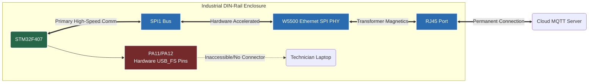

---

#### The Connectivity Architecture: How Does Flashing Actually Work?

Before we look at the complete factory script, it is crucial to understand the physical and software layers involved in programming an STM32 from a Linux PC.

**Do we need to program all images (mcuboot, flash) separately?**
**Yes, absolutely.** At the factory, a blank STM32 chip has nothing but `0xFF` across its entire 1MB of memory. You cannot just flash the FreeRTOS app, because the STM32 hardware always boots from `0x08000000`, and our app is built to run at `0x08040000`. 
1. The **Bootloader (`mcuboot.bin`)** must be flashed to address `0x08000000`.
2. The **Signed Application (`ems_rtos_signed.bin`)** must be flashed to address `0x08040000`.

To achieve this, the developer's PC uses a piece of software (like OpenOCD) acting as a bridge to a hardware dongle (ST-LINK), which translates USB commands into raw electrical logic on the SWD pins.

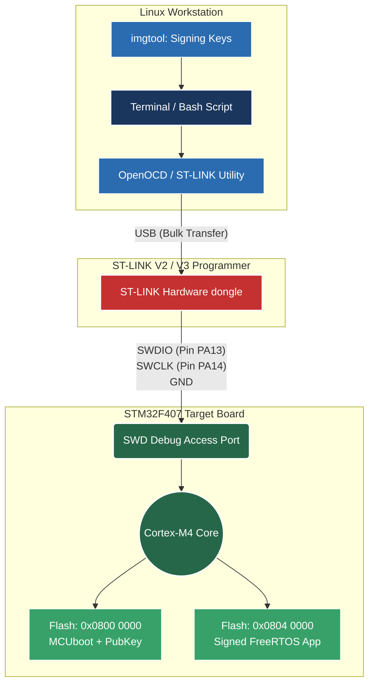

*   **SWD (Serial Wire Debug):** A 2-wire interface (`SWDIO` for data, `SWCLK` for clock) created by ARM. It allows the ST-LINK dongle to halt the Cortex-M4 CPU, read its registers, and command the internal Flash Controller to burn our `.bin` files directly into the silicon.
*   **OpenOCD (Open On-Chip Debugger):** An open-source Linux daemon that knows how to talk "USB" to the ST-LINK dongle, and translates high-level commands (like `flash write_image mcuboot.bin 0x08000000`) into the low-level SWD bit-banging required by the ARM core.

---

#### Complete End-to-End Factory Provisioning Workflow

This is the **definitive production programming procedure** for a brand new STM32F407 board, from raw silicon to fully locked Secure Boot:

```
╔══════════════════════════════════════════════════════════════════════╗
║           EMS Mini RTOS — Factory Provisioning Procedure            ║
╠══════════════════════════════════════════════════════════════════════╣
║  Prerequisites: st-flash, imgtool, STM32_Programmer_CLI installed   ║
║  Private Key:   ecdsa-p256.pem  (on factory build server ONLY)      ║
╚══════════════════════════════════════════════════════════════════════╝

STEP 1 ── Verify ST-LINK and STM32 Target Connection
─────────────────────────────────────────────────────────────────────
  # Before flashing, the factory PC must probe the SWD interface to
  # assert that the ST-LINK dongle sees a valid Cortex-M4 core.
  st-info --probe
  
  # Expected Output:
  # Found 1 stlink programmers
  #  version:  V2J29S7
  #  serial:   ...
  #  flash:    1048576 (pagesize: 16384)
  #  sram:     131072
  #  chipid:   0x0413
  #  descr:    F4 device

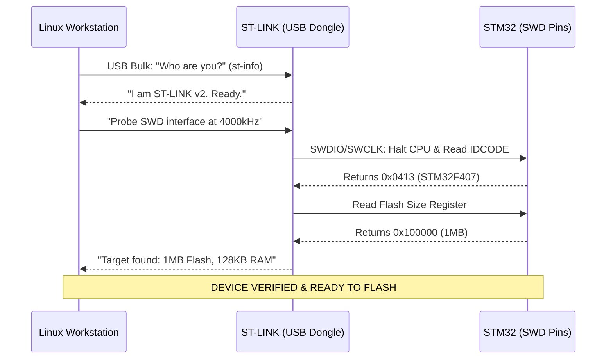

STEP 2 ── Generate signing keys (first-time, factory setup only)
─────────────────────────────────────────────────────────────────────
  imgtool keygen -k ecdsa-p256.pem -t ecdsa-p256
  imgtool getpub -k ecdsa-p256.pem > boot/root-ec-p256-pub.c
  → Store ecdsa-p256.pem in offline HSM or encrypted vault
  → Commit root-ec-p256-pub.c into MCUboot source tree

STEP 3 ── Build MCUboot with the embedded public key
─────────────────────────────────────────────────────────────────────
  cd mcuboot/boot/stm32/
  make BOARD=stm32f407 SIGNING_KEY=../../../root-ec-p256-pub.c
  → Produces: mcuboot.bin
  → Public key is baked as const array at 0x08000000+offset

STEP 4 ── Build and sign the FreeRTOS application
─────────────────────────────────────────────────────────────────────
  # Compile the EMS RTOS firmware (produces raw binary)
  arm-none-eabi-gcc ... -o ems_rtos.elf
  arm-none-eabi-objcopy -O binary ems_rtos.elf ems_rtos.bin

  # Sign it with the private key using imgtool
  imgtool sign \
    --key ecdsa-p256.pem \
    --header-size 0x200 \
    --align 4 \
    --version 1.0.0 \
    --slot-size 0x60000 \
    ems_rtos.bin \
    ems_rtos_signed.bin
  → Produces: ems_rtos_signed.bin (with MCUboot header + ECDSA signature appended)

STEP 5 ── Erase the target board (factory fresh)
─────────────────────────────────────────────────────────────────────
  st-flash erase
  → Wipes all 1MB of Flash to 0xFF

STEP 6 ── Flash MCUboot (bootloader + embedded public key)
─────────────────────────────────────────────────────────────────────
  st-flash write mcuboot.bin 0x08000000
  → MCUboot + public key now lives at sectors 0–3 (0x08000000–0x0800FFFF)

STEP 7 ── Flash the signed FreeRTOS application
─────────────────────────────────────────────────────────────────────
  st-flash write ems_rtos_signed.bin 0x08040000
  → Application lives at Bank 1 (0x08040000–0x080BFFFF)
```

**STEP 8 ── Validation Test (CRUCIAL: Verify keys before locking!)**
Before setting the final hardware locks, it is perfectly safe to reboot the board and verify the signatures.
*   **Action:** Press the physical RESET button or power cycle the board.
*   **Observe:** Watch the UART serial output (or SWD debug viewer).
*   ✅ **Expected SUCCESS:** `"MCUboot: Verifying signature... OK! Booting application."`
*   ❌ **Expected FAILURE:** `"MCUboot: Signature INVALID! Halting."` 
    *   **STOP:** Do not proceed to Step 9 if validation fails. You still have unlimited flash retries to fix the keys since RDP is still Level 0.

```bash
STEP 9 ── Set RDP Level (Locking the Debug Port)
─────────────────────────────────────────────────────────────────────
  # Option A: Set RDP Level 1 (Development / Recoverable via Mass Erase)
  STM32_Programmer_CLI -c port=SWD -ob RDP=0xBB
  
  # Option B: Set RDP Level 2 (Production / IRREVERSIBLE)
  # ⚠️ WARNING: SWD/JTAG debug port will be PERMANENTLY DISABLED. OTA ONLY.
  STM32_Programmer_CLI -c port=SWD -ob RDP=0xCC

  # Option C: OpenOCD approach (Applies WRP and RDP Level 2)
  openocd -f interface/stlink.cfg -f target/stm32f4x.cfg \
    -c "init" \                       # Connects to ST-LINK
    -c "reset halt" \                 # Freezes STM32
    -c "flash protect 0 0 3 on" \     # Engages WRP on Sectors 0-3
    -c "stm32f4x options_write 0 0xCC" \ # Engages RDP Level 2
    -c "reset run" \                  # Reboots, enforcing permanent lock
    -c "exit"
```

---

#### Comparison: Full Provisioning Flow — RTOS (MCUboot) vs Linux (AHAB)

```
RTOS / MCUboot Provisioning              Linux / AHAB Provisioning
────────────────────────────             ──────────────────────────────────────
① imgtool keygen → ecdsa-p256.pem        ① NXP CST: srk_hash.bin generated from
                                              SRK key table (4 key redundancy)
② imgtool getpub → C header file         ② SRK hash is NOT compiled into software
   compiled into MCUboot binary               — it goes into hardware OTP fuses

③ Build MCUboot with embedded pubkey     ③ uuu / NXP blhost burns SRK_HASH fuses
   st-flash write mcuboot.bin 0x08000000      on the i.MX93 OTP banks
                                             (Permanently changes silicon transistors)

④ imgtool sign app → signed binary       ④ NXP CST ahab-container signs U-Boot SPL
   st-flash write signed_app 0x08040000       container with RSA/ECDSA private key

⑤ BOOT TEST: MCUboot verifies ECDSA      ⑤ BOOT TEST: ROM code reads SRK_HASH fuse,
   signature vs embedded public key           verifies SPL container signature

⑥ STM32_Programmer_CLI -ob RDP=0xCC     ⑥ uuu: SEC_CONFIG[1] fuse blown → "Closed"
   → SWD permanently disabled                 → JTAG permanently disabled
   → Device sealed forever                    → Device sealed forever

LOCK METHOD: RDP Option Byte (0xCC)      LOCK METHOD: Physical eFuse blow
KEY STORAGE: MCUboot Flash (protected)   KEY STORAGE: Hardware OTP silicon cells
SIGNING TOOL: imgtool (Python)           SIGNING TOOL: NXP CST (C binary)
LOCK TOOL: STM32_Programmer_CLI          LOCK TOOL: uuu + blhost
```

---

#### STM32CubeProgrammer & STM32_Programmer_CLI Reference

**STM32CubeProgrammer (GUI vs CLI)**
STMicroelectronics provides `STM32CubeProgrammer` as a cross-platform software suite available for **Windows, macOS, and Linux**. 
*   **The GUI Version:** A full graphical application primarily used by developers on Windows/Mac to visually inspect memory, drag-and-drop `.bin` files, edit Option Bytes with checkboxes, and debug STM32 chips.
*   **The CLI Version (`STM32_Programmer_CLI`):** Installed alongside the GUI, this is the headless command-line executable. It allows the exact same operations but is designed strictly for automation, bash scripts, and CI/CD factory pipelines (e.g., locking the chip automatically on a Linux server).

Here are the most common CLI commands used in scripting:

```bash
# Connect and read device info
# Note: `freq=4000` tells the ST-LINK to communicate over the SWD pins at 4000 kHz (4 MHz). 
# This is the highly recommended standard speed that balances stability and flashing speed for STM32F4.
STM32_Programmer_CLI -c port=SWD freq=4000 -i

# Full erase
STM32_Programmer_CLI -c port=SWD -e all

# Flash a binary at specific address
STM32_Programmer_CLI -c port=SWD \
  -d mcuboot.bin 0x08000000 \
  -v           # verify after write

# Read and dump Option Bytes (check current RDP level)
STM32_Programmer_CLI -c port=SWD -ob displ

# SET RDP to Level 1 (recoverable)
STM32_Programmer_CLI -c port=SWD -ob RDP=0xBB

# SET RDP to Level 2 (PERMANENT — production units only)
STM32_Programmer_CLI -c port=SWD -ob RDP=0xCC
```

### Edge Case: Flash Erasure CPU Stalls (Hard Faults)

The most critical part of this logic is the protection of the ARM Data Bus during the transition.
*   **The Danger:** Erasing an internal Flash Sector (e.g., Bank 2) locks up the entire ARM Cortex Instruction/Data bus for upwards of **10 to 50 milliseconds**. If the RTOS `SysTick` timer were to fire, or an external UART DMA interrupt were to trigger a Context Switch while the instruction bus is locked, the CPU cannot fetch the next instruction. It will instantly crash, throwing a fatal `Hard Fault Exception`.
*   **The Fix:** 
    1.  We execute **`vTaskSuspendAll()`** immediately before the Flash sequence. This literally turns off the FreeRTOS Scheduler. 
    2.  No task, no matter its priority, can preempt the OTA thread.
    3.  We routinely call `xTaskResumeAll()` between chunk writes if we need to let the W5500 SPI hardware catch its breath or let the hardware Watchdog reset.

### Edge Case: Fallback / "Anti-Brick" Protection & Partition Swapping
How does MCUboot manage the physical partition switch, and what happens when disasters occur?

**How do we manage the partition switch in OTA?**
MCUboot uses a **"Swap using Scratch"** physical memory mechanism. 
1. MCUboot reads a 4KB chunk from Bank 1 and writes it to the Scratch Sector.
2. It reads a 4KB chunk from Bank 2 and overwrites the exact place in Bank 1.
3. It takes the original chunk resting in the Scratch Sector and writes it into Bank 2.
4. It dynamically cycles this loop until the entire 384KB application is successfully swapped!

**What happens if OTA fails mid-download?**
If the W5500 SPI connection drops in the middle of downloading the `.bin` to Bank 2 (or loses power), `Task_Net` simply aborts the transaction and deletes the fragment. Bank 1 (the active app) was never touched. The board powers up and continues running normally.

**What happens if the power dies DURING the Partition Swap?**
If a forklift unplugs the board exactly while MCUboot is swapping chunks, MCUboot will resume the swap on the next physical reboot. Since everything touches the Scratch sector first, MCUboot reads the state flags and natively resumes the copy without bricking.

**What happens if the newly updated active partition is corrupted or crashes?**
We implemented an **"Image Confirmation"** fail-safe mechanism:
*   After MCUboot swaps Bank 2 into Bank 1, it passes the boot sequence to the new application. 
*   **The Flag:** MCUboot relies on a specific byte called the `image_ok` flag to know if the new firmware is stable. 
*   **Where is it?** This flag is located at the very end of the active Flash partition (Bank 1), locked inside the cryptographic "Magic Trailer" metadata block. Like all erased flash, it defaults to `0xFF` (Unconfirmed).
*   **Who sets it?** The new FreeRTOS application must successfully initialize, connect to the Cloud, and eventually execute a specific C API call: `boot_set_confirmed()`. This function physically writes `0x01` to the `image_ok` memory address in the Magic Trailer.
*   **The Crash Scenario:** If the new firmware contains a fatal bug (e.g., a Hard Fault, or it infinite-loops and drops the network), the CPU will crash *before* it can ever call `boot_set_confirmed()`. 
*   **The Revert:** The hardware **Independent Watchdog (IWDG)** will detect the freeze and automatically reset the CPU. 
*   **Who clears/reads it?** MCUboot wakes up, reads the Magic Trailer in Bank 1, and sees that `image_ok` is still `0xFF` (the app failed to set it to `0x01`). MCUboot realizes the new firmware failed to confirm itself, and it instantly **REVERTS** the swap, pulling the old, stable firmware out of the Scratch area and back into Bank 1!

---

<a id="16"></a>
## 16. System Timing & Frequencies Cheat Sheet

For technical and architectural reviews, it is extremely common to be asked about the exact timing characteristics, hardware bus speeds, and RTOS configurations of your system. 

Here is the master lookup table detailing the exact clock frequencies, speeds, and task durations configured for `ems-mini-rtos`:

### ⏱️ Hardware Clocks & Bus Speeds

| Component / Interface | Configured Speed | Description & Architectural Purpose |
| :--- | :--- | :--- |
| **SYSCLK (Core CPU)** | `168 MHz` | The absolute maximum speed of the STM32F407 ARM Cortex-M4 core. Powers the FPU (Floating Point Unit) for complex peak-shaving math. |
| **APB1 Peripheral Bus** | `42 MHz` | The low-speed peripheral bus. Drives standard Timers, I2C, and secondary UARTs. |
| **APB2 Peripheral Bus** | `84 MHz` | The high-speed peripheral bus. Drives critical components like the ADCs, USART1, and SPI1. |
| **W5500 (SPI1)** | `21.0 MBits/s` | `APB2 divided by 4`. High-speed hardware SPI communication strictly used for pushing massive MQTT payloads to the Cloud via Ethernet. |
| **RS-485 Modbus (USART1)** | `9600 Baud` | Translates to roughly `~1ms per byte`. Industry standard for communicating with third-party Smart Meters over hundreds of meters of noisy wire without signal degradation. |
| **CAN Bus** | `500 kbps` | Translates to roughly `2µs per bit`. High speed, highly reliable differential signaling used to communicate with internal Battery Management Systems (BMS). |
| **SWD Flashing Clock** | `4000 kHz` (`4 MHz`) | Parameter passed via `freq=4000`. Balances write-speed and electrical stability when the factory burns firmware into the silicon. |

### ⏳ RTOS Scheduling & Software Timings

| Software Component | Duration / Interval | Description & Architectural Purpose |
| :--- | :--- | :--- |
| **SysTick (Kernel Heartbeat)** | `1 ms` (`1000 Hz`) | The FreeRTOS baseline. Every single millisecond, the CPU hardware interrupts the current code, runs the OS Scheduler, and decides if a higher priority task needs the CPU. |
| **`Task_Poll` Cycle** | `300 ms` | Uses `osDelay(300)`. The hardware polling task wakes up roughly 3.3 times per second to poll external sensors. |
| **Modbus DMA Timeout** | `250 ms` | Uses `osSemaphoreAcquire(..., 250)`. If a slave device burns out or the wire is cut, we abort the wait after 250ms to prevent the RTOS from freezing forever. |
| **`Task_Ctrl` Wait Time** | `osWaitForever` (`∞`) | The Brain task consumes 0% CPU unless data actively arrives in its Message Queue from `Task_Poll`. It has no fixed interval. |
| **`Task_Net` Cycle (MQTT)** | `5000 ms` | We only publish to the AWS IoT Cloud every 5 seconds. This saves massive cellular/data costs while retaining "real-time" dashboard feels. |
| **IWDG (Watchdog Timer)** | `~2.5 to 3.0 sec` | An independent, analog silicon timer. If the FreeRTOS engine crashes (Hard Fault) and fails to reset this timer within 3 seconds, the hardware forcibly physically reboots the board. |

#### 🧮 How We Derived the 300ms `Task_Poll` Cycle Time

**Common Engineering Question:** *"Why exactly 300 milliseconds? Why not 100ms for tighter control, or 1000ms to reduce CPU load?"*

The 300ms polling period is **not arbitrary**. It was calculated from the **physical hardware constraints** of Modbus RTU communication, **multi-device sequential polling**, and **control bandwidth requirements**:

##### Step 1: Modbus RTU Physical Transmission Time

At **9600 baud** (1 bit per ~104 µs):
- A typical Modbus request frame: **8 bytes** (Slave ID, Function Code, Register Address, CRC)
  - Transmission time: `8 bytes × 10 bits/byte ÷ 9600 baud ≈ 8.3 ms`
- A typical Modbus response frame: **50-60 bytes** (depends on register count)
  - Transmission time: `60 bytes × 10 bits/byte ÷ 9600 baud ≈ 62.5 ms`
- **Modbus mandatory 3.5-character silence gap:** `3.5 × (10 bits ÷ 9600) ≈ 3.6 ms` (both before and after each frame)

**Total for one complete request-response transaction:**
```
TX time + silence + RX time + silence + slave processing delay
= 8.3ms + 3.6ms + 62.5ms + 3.6ms + ~20-80ms (slave internal processing)
≈ 100-160ms per device
```

##### Step 2: Multiple Sequential Device Polling

`Task_Poll` communicates with:
1. **Grid Meter** (Modbus Slave ID 1) — Grid power, voltage, frequency
2. **Inverter** (Modbus Slave ID 2, or multiple inverters if stacked) — Inverter status, power output

If polling **2 devices sequentially**:
```
Total sequential polling time = 100-160ms × 2 devices = 200-320ms
```

If a device occasionally takes longer (noisy electrical environments can cause retries):
```
Worst-case with one retry = ~250-350ms
```

##### Step 3: Control Bandwidth & Nyquist Sampling

For **grid balancing applications**, we're controlling systems where:
- **Electrical transients** (grid power fluctuations, solar cloud shadows, loads switching on/off) happen on **second-scale timescales** (1-10 seconds typical)
- **Battery inverter ramp rates** are limited to ~500W/second to prevent inrush damage
- **Grid import/export changes** propagate through the DNO (Distribution Network Operator) transformer with ~1-2 second latency

**Nyquist theorem** states: *To accurately track a signal, sample at **at least 2× the highest frequency component**.*

If grid fluctuations have a typical bandwidth of **0.5-1 Hz** (one change every 1-2 seconds), we need:
```
Minimum sampling rate = 2 × 1 Hz = 2 Hz
→ Maximum sampling period = 500ms
```

Sampling at **300ms = 3.33 Hz** provides:
- **1.67× safety margin** above Nyquist minimum
- Sufficient resolution to detect grid changes before they propagate into violations
- Fast enough to implement **closed-loop peak shaving** without oscillation

##### Step 4: Safety Margins & Queue Depth

Setting `osDelay(300)` provides:
- **Headroom for Modbus timeouts:** If one device fails (wire cut, slave offline), the 250ms Modbus timeout + next poll still fits within ~300ms cadence without queue saturation
- **Prevents queue overflow:** `Queue_Data` has 32-element capacity. Even if `Task_Ctrl` stalls briefly, `Task_Poll` can enqueue 32 samples before dropping data. At 300ms/sample, this gives 9.6 seconds of buffering.
- **Deterministic scheduling:** 300ms is evenly divisible by FreeRTOS SysTick (1ms), avoiding floating-point timing drift

##### Summary: The 300ms Timing Budget

| Factor | Contribution to 300ms | Rationale |
| :--- | :--- | :--- |
| **Modbus RTU physics** | ~100-160ms per device | 9600 baud transmission + 3.5-char gaps + slave processing |
| **Sequential multi-device polling** | ×2 devices = 200-320ms | Grid meter + Inverter(s) polled one after another |
| **Control bandwidth requirement** | Need <500ms (Nyquist for 1Hz signals) | Grid fluctuations are slow (1-10 second timescales) |
| **Safety margin** | 300ms chosen | Allows retry tolerance + prevents queue saturation + matches 1ms SysTick |

**Result:** `osDelay(300)` provides a **deterministic, hardware-constrained, control-theory-validated polling period** that balances **real-time responsiveness** with **physical communication limits**.

> **Alternative Design (Why NOT 100ms or 1000ms):**
> - **100ms:** Would require reducing Modbus frame sizes or increasing baud rate to 19200+, risking EMI issues over long RS-485 cables in industrial environments. Also unnecessary — grid dynamics don't change that fast.
> - **1000ms:** Would violate Nyquist theorem for 1Hz grid fluctuations, causing aliasing where we miss rapid load changes, leading to poor peak-shaving performance.

---

<a id="17"></a>
## 17. Toolchain & Advanced Debugging Stack

Developing bare-metal code with physical hardware interfaces requires professional embedded tooling. `printf()` debugging over a serial port is wildly insufficient.

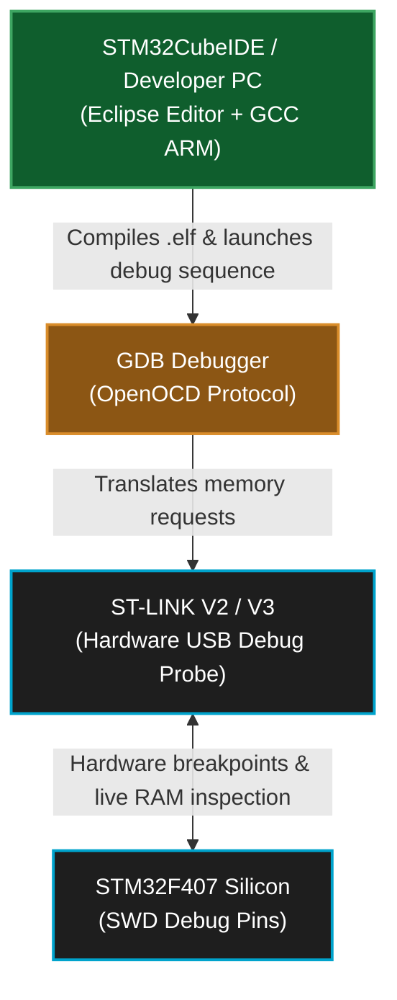

*   **IDE & Compiler:** We explicitly use **`STM32CubeIDE`** (Eclipse-based) natively compiling with the open-source `GCC ARM Embedded` toolchain. 
    *   **Why not Keil µVision?** A common corporate alternative is Keil (owned by ARM). While Keil has an exceptionally optimized proprietary compiler (`armcc`), its commercial licensing is astronomically expensive (often thousands of dollars per seat) and historically ties developers to Windows environments, sometimes via physical USB dongles. `STM32CubeIDE` is completely **free**, cross-platform natively (Linux / Mac / Windows), and intimately couples with the `STM32CubeMX` graphical configuration tool. Because it utilizes standard open-source GCC, we can cleanly extract the build system and seamlessly compile our firmware inside an automated, headless Linux Docker container on our CI/CD server without engaging in complex, expensive licensing battles.
*   **Operating System:** `FreeRTOS` wrapped with the `CMSIS-RTOS v2` API layer.
*   **Security & OTA:** **MCUboot** open-source bootloader, with Python `imgtool` for ECDSA P-256 signing.
*   **Code Versioning:** `Git` & `GitHub`, utilizing `GitHub Actions` for automated builds.
*   **Hardware Breakpoints (ST-LINK V2):** We connect via SWD (Serial Wire Debug). Using GDB within STM32CubeIDE, we can halt the ARM core *exactly* when a specific variable changes and step through `Task_Ctrl` mathematically.
*   **Protocol Analyzers (Saleae Logic):** To ensure our RS-485 `DE` pin toggles exactly when the Modbus DMA finishes, we use a Logic Analyzer. By clamping the probes to PA2 (TX), PA3 (RX), and PD4 (DE), we verify the microsecond-level hardware timing.
*   **RTOS Tracing (SystemView):** We instrument FreeRTOS with Trace macros (e.g., SEGGER SystemView). This allows us to record a visual timeline on a PC showing exactly when the scheduler swaps tasks, proving that `Task_Ctrl` takes 0% CPU until `Queue_Data` triggers it.

### How Debug Printing Works (ITM/SWO Trace)

Standard `printf()` over UART is **dangerous in an RTOS** because:
1. `printf()` is not thread-safe — two tasks calling it simultaneously corrupt the output buffer.
2. UART TX at 115200 baud takes **~870µs per 100 characters** — this blocks the calling task, starving real-time Modbus and CAN processing.
3. It requires a physical UART-to-USB cable, consuming a UART peripheral that we need for Modbus.

Instead, we use the ARM Cortex-M4's built-in **ITM (Instrumentation Trace Macrocell)** hardware, streamed over the **SWO (Serial Wire Output)** pin (`PB3`). This sends debug messages at **full SWD clock speed (4 MHz+)** through the same ST-LINK USB cable already used for programming — zero extra wires, zero CPU blocking.


**Implementation — Custom `_write()` syscall redirect:**

Instead of rewriting every `printf`, we override the low-level C library `_write()` function that `printf` calls internally. This transparently redirects all `printf()` output to the ITM hardware:

```c
// ──── File: Core/Src/syscalls.c ────

#include "stm32f4xx.h"

// Override the C library's _write() to use ITM instead of UART
int _write(int file, char *ptr, int len) {
    for (int i = 0; i < len; i++) {
        ITM_SendChar(*ptr++);
        // ↑ This writes a single byte to ITM Stimulus Port 0.
        // It takes ~1 CPU cycle (just a register write).
        // The ITM hardware has a FIFO — it will NOT block the CPU
        // unless the FIFO overflows (extremely rare at 4 MHz SWO).
    }
    return len;
}
```

**Usage in firmware (identical to standard printf):**
```c
// Inside Task_Poll — completely safe, non-blocking
void Task_Poll(void *argument) {
    for (;;) {
        modbus_read_all_slaves();
        printf("[POLL] GridW=%d, BattSOC=%d%%, InvCmd=%dW\n",
               state.grid_watts, state.battery_soc, state.inverter_cmd);
        // ↑ This does NOT go to UART.
        // It goes to ITM → SWO → ST-LINK → STM32CubeIDE SWV Console.
        // Takes < 5µs for 50 characters. Zero impact on RTOS.

        HAL_IWDG_Refresh(&hiwdg);
        osDelay(300);
    }
}
```

**Viewing the output:**
In STM32CubeIDE: `Window → Show View → SWV → SWV ITM Data Console`. Set the SWO clock to match your core clock (168 MHz) and enable Stimulus Port 0. You'll see live `printf` output streaming at full speed.

> ⚠️ **Production Note:** In production builds, we compile with `-DNDEBUG` which strips all `printf()` calls via a macro: `#ifdef NDEBUG #define printf(...) ((void)0) #endif`. This removes 100% of trace overhead from the release binary.

---

<a id="18"></a>
## 18. Testing, Mocking & Static Analysis

Industrial automation demands proof of reliability before physical deployment.

**1. Unit Testing & Mocking (Off-Target):**
We utilize testing frameworks (like **Ceedling / Unity**) to test the core Peak-Shaving algorithms entirely off-target (compiled on a Linux PC). 
Because our business logic in `Task_Ctrl` is perfectly abstracted and only receives inputs via `Queue_Data`, we completely bypassed the STM32 hardware. We wrote "Mock" scripts that inject fake Grid metrics (e.g., `GridWatts = 5000`) into the C-functions to mathematically validate that the inverter limiters react perfectly.

**2. Static Analysis & Code Quality:**
Automated **Static Analysis** (such as `Cppcheck`) is intrinsically integrated into our CI/CD pipeline. Every Pull Request into the repository is automatically scanned for:
*   Buffer Overflows or Array Out-of-Bounds violations.
*   Uninitialized variable usage.
*   MISRA C compliance checks (e.g., verifying `malloc()` is never called dynamically).

**3. Hardware-In-The-Loop (HIL) Integration Testing:**
For physical testing, we built an automated Python test rig that integrates directly into the CI/CD pipeline. The goal is simple: **prove the firmware works on real silicon before any human approves the Pull Request.**

The HIL test cycle works as follows:
1.  **CI/CD Trigger:** A developer pushes a Pull Request on GitHub. GitHub Actions triggers the automated pipeline.
2.  **Build Phase:** The CI server (a Linux Docker container) compiles the firmware using `arm-none-eabi-gcc`, runs `Cppcheck` static analysis, and produces the signed `.bin` artifact via `imgtool`.
3.  **Flash Phase:** The CI server (which has a physical STM32 board connected via USB ST-LINK) flashes the freshly built `.bin` to the Device Under Test (DUT) using `st-flash write`.
4.  **Stimulation Phase:** A Python script (`hil_simulator.py`) injects pre-recorded Modbus RTU telegrams (fake Grid Meter + Inverter data) into the STM32's RS-485 port via a USB-to-RS485 adapter.
5.  **Observation Phase:** A second Python script (`mqtt_sniffer.py`) subscribes to the AWS IoT MQTT broker and captures every JSON telemetry packet the STM32 publishes in response.
6.  **Verdict Phase:** The sniffer compares the received JSON values against a mathematical model (e.g., "If we injected GridWatts=5000 and BatterySOC=80, the inverter command MUST be ≤3000W"). If all assertions pass, the CI pipeline reports ✅ **PASS**. If any value is out of bounds, it reports ❌ **FAIL** and blocks the PR merge.

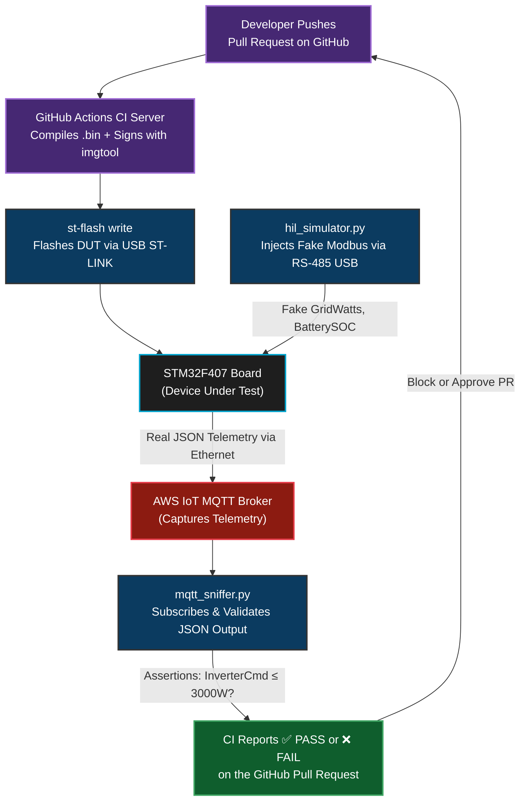

---

<a id="19"></a>
## 19. Efficiency, Optimizations & Memory Footprint

### What specific optimizations did we apply?
In order to maximize silicon performance and hit our hard-realtime nanosecond budgets, we applied several drastic optimizations:

1. **Hardware Offloading:** As detailed previously, we ruthlessly offloaded the entire TCP/IP networking stack to the W5500 silicon wrapper and the UART Modbus byte-parsing to the internal DMA silicon streams. This effectively yields 0% CPU consumption for mass data transport.
2. **Compiler Optimizations (`-O2`):** In `CMakeLists.txt` / Makefile settings, we explicitly passed `-O2` to the GCC compiler. This aggressively unrolls `for()` loops and optimizes math pipelines at the expense of slightly larger binary sizes (which we easily afforded with our 384KB Flash partition).
3. **FPU Native Math Activation:** By explicitly asserting `#define __FPU_PRESENT 1`, the Cortex-M4 computes peak-shaving Float matrices natively in hardware transistors in a single clock cycle, completely bypassing thousands of cycles of software library emulation.
4. **CCM RAM Acceleration (Core Coupled Memory):** The STM32F407 contains 64KB of ultra-fast CCM RAM directly tied to the CPU data bus (bypassing the main system matrix). We specifically altered the linker script and FreeRTOS settings to dump the most demanding `Task_Ctrl` stack computations into `.ccmram` for absolute maximum algorithmic execution speed.

### How Efficient is the Design?
The design is **extremely efficient**. Because the CPU uses **Deferred Processing**, it spends roughly **95% of its life asleep** in the Idle Task. 
*   Physical electrical data is piped natively across the silicon bus via **DMA** (Direct Memory Access).
*   The actual `Peak_Shaving` mathematical loop executes inside `Task_Ctrl` in under **10 microseconds** due to the 168 MHz floating-point-enabled Cortex-M4 core. 
*   Latency from a Grid Meter spike to a Battery Discharging command is practically bounded only by the physical baud rates of the UART lines.

### Memory Snapshot (STM32F407)
We selected this specific microcontroller because it provides massive headroom for future features.

*   **Flash Memory (1 MB Total):**
    *   The `RTOS + FreeRTOS Kernel + HAL Drivers` consumes roughly **~64 KB**. 
    *   This leaves over 900 KB of empty space, perfectly enabling the dual-bank OTA feature (Bank 1 holding the active 64 KB app, Bank 2 holding the incoming 64 KB download slot).
*   **RAM (192 KB Total):**
    *   **RTOS Overhead:** Stacks, Queues, and Task Control Blocks (TCBs) are statically mapped and consume around **~15 KB**.
    *   **Networking Buffers:** Because the W5500 offloads the TCP/IP stack physically, the STM32's RAM is incredibly empty. If we ran LwIP internally, it would consume >60 KB.
    *   **Result:** We have over 170 KB of free RAM, allowing for future expansion into complex IoT cryptographic buffering (TLS 1.2/1.3).

### Memory Protection Strategies
1.  **Preventing Stack Overflows:** If `snprintf()` inside `Task_Net` loops too far, it will crash into another Task's memory space. We enabled `vApplicationStackOverflowHook()`. If FreeRTOS detects a watermark breach, it instantly traps the CPU so we can trace the violation, rather than silently corrupting variables.
2.  **Preventing Heap Fragmentation (Zero `malloc` Policy):** A system running for 10 years will crash if it constantly dynamically allocates and frees memory inside a `while` loop (Heap Fragmentation). To combat this, **we banned `malloc()` at runtime.** All FreeRTOS Queues and Semaphores are allocated statically at Boot (`osMessageQueueNew`), guaranteeing the memory map never shifts during factory operation.

---

<a id="20"></a>
## 20. System Reliability & Product Safety

### Industrial Grade Silicon (AEC-Q100)
The platform is built on **AEC-Q100 Grade 3 (or Grade 1)** qualified silicon. This is not just a marketing label; it represents a commitment to **silicon-level longevity**. AEC-Q100 certification requires the chip to survive extreme thermal shocks and accelerated aging tests that standard "consumer" chips (like those found in toys or home routers) would fail. In an EMS deployment, where a single silicon failure could lead to a catastrophic loss of grid control, this "Automotive-Grade" stress testing is our baseline for stability.

### Product Safety & Failsafe Execution Bounds
Beyond basic electrical protections, firmware safety is guaranteed by rigid bounds checking. Before `Task_Ctrl` applies any dynamic command received from the Cloud (like "Set Grid Charger to 100,000 Watts"), it intercepts the payload and mathematically clamps it against hard-coded physical limits (`MIN_INVERTER_WATTAGE`, `MAX_BATTERY_CHARGE_RATE`). This ensures that even if a Cloud dashboard is hacked, the hardware is mathematically incapable of pushing enough voltage to melt copper wiring.

### Advanced Interrupt Handling Priorities (NVIC)
The Cortex-M4 features a Nested Vectored Interrupt Controller (NVIC). We strategically assigned Preemption Priorities so that critical tasks always stop non-critical tasks natively in silicon:
*   **Highest Priority (Priority 0-1):** The `SysTick` Timer (which runs the RTOS kernel) and the `CAN_RX_FIFO0` interrupt. If a J1939 battery packet arrives, the CPU must fetch it natively within nanoseconds before the mailbox overflows.
*   **Medium Priority (Priority 5-6):** The Modbus `UART DMA` and `IDLE` interrupts. These are critical for RS-485 timing but are legally allowed to be preempted for a few microseconds if a CAN packet suddenly hits the silicon simultaneously.

### The Watchdog & Failsafe Logic
1.  **Independent Watchdog (IWDG):** We leverage the STM32's `IWDG`, which runs on its own physically separate 32kHz LSI (Low-Speed Internal) clock.
    *   **The Logic:** `Task_Poll` contains an `HAL_IWDG_Refresh()` command. If `Task_Poll` ever hangs (e.g., waiting forever on a dead RTOS queue, or trapped in an infinite loop), it stops refreshing the dog. Within 2 seconds, the independent hardware timer expires, yanks the physical reset pin of the ARM core, and cleanly re-initializes the entire board.
2.  **Brown-Out Reset (BOR):** If the factory 24V DC power supply dips unexpectedly, running code on low voltage can scramble Flash memory writes. We set the silicon BOR Level to 3 (2.7V). If the internal voltage sags below this threshold, the hardware instantly holds the CPU in reset until power stabilizes, preventing data corruption.

### Power Saving & Efficiency (WFI & Tickless Idle)
Since this is an always-on edge node, energy management is a background concern. The design is optimized for power savings:
1.  **Wait For Interrupt (WFI):** When `Task_Ctrl` is blocked waiting on `Queue_Data`, and `Task_Net` is asleep for 5 seconds, the FreeRTOS Scheduler enters the `Idle Task`. In our project, the Idle Task executes the native ARM `WFI` (Wait For Interrupt) assembly sequence. This physically halts the core clock tree to the ALU (Arithmetic Logic Unit). The CPU draws single-digit milliamps while sleeping, waiting for a DMA or CAN interrupt to bring the clock back to life.
2.  **FreeRTOS Tickless Idle (Optional Enhancement):** If required for extremely low battery-powered edge nodes, we can configure FreeRTOS to turn off its own 1ms `SysTick` timer when it calculates no tasks will need to wake up for a known duration (e.g. 300ms). This puts the STM32 into severe deep sleep (STOP mode). Since this platform is permanently externally powered by an inverter, we opted to keep the standard SysTick running for simplicity and faster interrupt response times.

---

<a id="sec-21"></a>
## 21. Major Challenges & Solutions

While building this architecture, the team faced extreme bare-metal engineering hurdles:

*   **Challenge 1: The Modbus RTU Half-Duplex Timing Jitter**
    *   **The Issue:** Modbus is an industrial protocol running on a physical RS-485 copper wire, which is *half-duplex*. The STM32's transceiver chip must be manually switched from "Transmit" mode into "Receive" mode using a physical `DE` (Data Enable) pin. The Modbus specification dictates a strict 3.5 character idle time between frames. If we toggled this pin in standard C code `HAL_UART_Transmit(); HAL_GPIO_WritePin(DE, LOW);`, the FreeRTOS scheduler would sometimes context-switch exactly between those two lines of code to service the network task. By the time the CPU returned to toggle the pin 2 milliseconds later, the slave inverter had already replied, the transceiver was stuck in "Transmit" mode, and the incoming bytes crashed into the chip and were lost forever.
    *   **The Solution:** We entirely abandoned software-based pin toggling. We bound the `DE` pin toggle directly to the bare-metal silicon interrupt `HAL_UART_TxCpltCallback()` (DMA Transmit Complete). This hardware interrupt forcibly preempts the FreeRTOS scheduler. The exact nanosecond the final bit leaves the silicon register, the hardware interrupts the CPU, throws the `DE` pin LOW, and instantly returns, eliminating 100% of the software jitter and achieving perfectly deterministic Modbus timing.
    *   **Implementation Pseudo-Code:**
        ```c
        // ❌ WRONG: Software toggling is subject to RTOS context switches
        void SendModbusPoll_Software() {
            HAL_UART_Transmit(&huart1, tx_data, len, 100);
            // <-- RTOS could switch here for 1ms! Transceiver stays in TX mode.
            HAL_GPIO_WritePin(DE_GPIO_Port, DE_Pin, GPIO_PIN_RESET);
        }

        // ✅ RIGHT: Hardware interrupt toggling (Deterministic)
        void HAL_UART_TxCpltCallback(UART_HandleTypeDef *huart) {
            if (huart->Instance == USART1) {
                // Fired by silicon nanoseconds after last bit leaves shift register
                HAL_GPIO_WritePin(DE_GPIO_Port, DE_Pin, GPIO_PIN_RESET);
                osSemaphoreRelease(txCompleteSem);
            }
        }
        ```

*   **Challenge 2: CAN Bus Mailbox Overflows (Hardware Starvation)**
    *   **The Issue:** The EMS connects to commercial battery racks via a 250kbps CAN bus using the J1939 protocol. These batteries are extremely "chatty", sometimes blasting 10 frames in under 5 milliseconds. The physical STM32F407 silicon only contains **three physical receive mailboxes**. If the CPU was busy calculating peak-shaving math inside `Task_Ctrl` for a few milliseconds, the 4th incoming CAN frame would physically overflow the silicon mailbox, permanently destroying critical battery voltage telemetry.
    *   **The Solution:** We implemented **ISR Hardware Offloading**. We bound a minimalist, ultra-fast Interrupt Service Routine (`HAL_CAN_RxFifo0MsgPendingCallback`) directly to the hardware. Taking less than 1 microsecond to execute, this ISR rips the data out of the tiny silicon mailboxes the moment they arrive and pushes them into an expansive 16-element FreeRTOS RAM Queue (`queueCanRxHandle`). This creates a massive software memory "shock absorber," allowing the slower `Task_Poll` loop to lazily drain the queue without ever dropping a physical packet.

*   **Challenge 3: ARM Instruction Bus Lockouts (OTA Hard-Faults)**
    *   **The Issue:** When executing an Over-The-Air (OTA) firmware update, `Task_Net` must command the STM32 to erase a 64KB sector of its internal Flash memory (Bank 2). Flash erasure operations physically lock the ARM Cortex Instruction/Data bus for upwards of **20 to 50 milliseconds**. If the FreeRTOS `SysTick` timer expired during this lockout, or a Modbus interrupt fired, the CPU would attempt to fetch the next instruction from memory to perform the context switch. Because the bus was electrically locked by the Flash controller, the fetch would fail, and the CPU would violently crash into a `HardFault_Handler`.
    *   **The Solution:** We ruthlessly enforced the **`vTaskSuspendAll()`** API. The exact instruction before sending the `HAL_FLASHEx_Erase()` command, `Task_Net` calls `vTaskSuspendAll()`. This actively disables the entire FreeRTOS scheduler, preventing any context switches or timer firings from occurring while the ARM data bus is locked. Once the physical erase is complete, we call `xTaskResumeAll()`, safely returning the system to multitasking.

*   **Challenge 4: W5500 SPI Socket Deadlocks & Ghost Connections**
    *   **The Issue:** Industrial networks are notoriously noisy. When connecting to Mosquitto MQTT over the WIZnet W5500, a Wi-Fi bridge or Ethernet switch reboot would sever the physical TCP link. However, because TCP/IP handles timeouts poorly, the STM32's `Task_Net` would often think the socket was still `ESTABLISHED` (a "ghost connection"), while the Cloud server had long ago dropped the client. The RTOS would hang indefinitely waiting for MQTT `PUBACK` packets that would never arrive.
    *   **The Solution:** We implemented an **Application-Layer Keep-Alive / MQTT PINGREQ Monitor**. Using a non-blocking timestamp method `(osKernelGetTickCount() - last_mqtt_rx > 15000)`, `Task_Net` monitors if it has received any data (including heartbeat pings) from the broker in the last 15 seconds. If the timer trips, the software strictly assumes the silent connection is dead, aggressively sends a hardware reset pulse to the W5500 `RST` pin, flushes the SPI registers, and attempts a clean socket re-initialization sequence from scratch.
    *   **Implementation Pseudo-Code:**
        ```c
        void Task_Net(void *argument) {
            uint64_t last_rx_tick = osKernelGetTickCount();
            for(;;) {
                if (getSn_SR(MQTT_SOCKET) == SOCK_ESTABLISHED) {
                    // Check if we've heard from the broker recently
                    if ((osKernelGetTickCount() - last_rx_tick) > 20000) {
                        printf("[NET] Ghost connection detected! Forcing Hardware Reset.\n");
                        force_w5500_hardware_reset(); // Pulse RST pin
                        break; // Drop to reconnection logic
                    }
                    mqtt_yield(); // Process incoming packets
                    if (packet_received) last_rx_tick = osKernelGetTickCount();
                } else {
                    reconnect_mqtt_sequence();
                }
                osDelay(100);
            }
        }
        ```

*   **Challenge 5: Silent RAM Corruptions (Stack Overflows)**
    *   **The Issue:** During early development, building complex JSON telemetry strings inside `Task_Net` using `snprintf()` would occasionally cause the entire board to freeze an hour later, seemingly randomly. The `Task_Net` variables were secretly growing larger than the 1024-byte RAM stack allocated to the thread, physically writing over the memory belonging to `Task_Poll`.
    *   **The Solution:** We permanently enabled FreeRTOS's Stack Watermark monitoring feature (`configCHECK_FOR_STACK_OVERFLOW = 2`). This forces the kernel to paint the end of every task's RAM stack with a known byte pattern (e.g., `0xA5`). Whenever the kernel performs a context switch, it actively checks if that memory pattern was altered. If `Task_Net` oversteps its bounds by even 1 byte, the kernel instantly traps the CPU inside a `vApplicationStackOverflowHook()` function, definitively proving exactly which task caused the memory corruption and preventing unpredictable physical hardware behavior.

---

<a id="sec-22"></a>
## 22. Cybersecurity Posture & Hardening Roadmap

This section documents the current security posture of `ems-mini-rtos` derived from a systematic code and configuration review, identifies every active vulnerability and gap, and provides a concrete implementation roadmap aligned with **IEC 62443** (Industrial Cybersecurity for IACS). It complements the functional safety roadmap in §23.

> **Context:** The `ems-mini-rtos` STM32F407 node operates as a **physical safety supervisor** in a high-power grid-connected installation. A successful attack on this node does not just steal data — it can command inverters to violate grid limits, overload wiring, or trip circuit breakers. The attack surface is therefore treated with the same seriousness as operational safety.

---

### 22.1 Current Security Posture — Implemented Controls

The following controls are **active and verified** from source code review:

| Control | Location | Implementation Status |
| :--- | :--- | :--- |
| **MCUboot ECDSA P-256 Secure Boot** | `0x08000000`, §6.2–6.4 | ✅ Active — ECDSA signature verified before every app jump |
| **Flash Write Protection (WRP)** | Option Bytes, Sectors 0–3 | ✅ Active — MCUboot + public key sectors hardware-locked |
| **JTAG/SWD port lockdown (RDP Level 2)** | Option Byte `0xCC` | ✅ Active in production — debug port permanently disabled |
| **Modbus CRC-16 frame validation** | `modbus_rtu.c: Modbus_CalculateCRC()` | ✅ Active — every response verified, bad frames discarded |
| **Modbus slave address verification** | `modbus_rtu.c: rxBuffer[0] != slaveId` | ✅ Active — frames from unexpected slave IDs rejected |
| **Modbus response timeout (250 ms)** | `modbus_rtu.c: osSemaphoreAcquire(..., 250)` | ✅ Active — dead slaves cannot hang the RTOS |
| **Independent Hardware Watchdog (IWDG)** | `Task_Poll: HAL_IWDG_Refresh()` | ✅ Active — forces hardware reset if RTOS freezes within 3s |
| **Brown-Out Reset (BOR Level 3, 2.7V)** | Option Bytes | ✅ Active — prevents Flash corruption on power sag |
| **Cloud command input clamping** | `Task_Ctrl: min/max bounds check` | ✅ Active — inverter commands mathematically bounded before dispatch |
| **Static memory allocation (no heap fragmentation)** | `FreeRTOSConfig.h: HEAP_4 + static tasks` | ✅ Active — Task_Ctrl/TCBs statically allocated, no runtime malloc fragmentation |
| **NVIC hardware prioritization** | CAN_RX=5, USART_IRQ=6, Kernel=15 | ✅ Active — safety-critical CAN preempts networking at silicon level |
| **Dual-bank OTA with atomic swap** | MCUboot swap-using-scratch | ✅ Active — power-loss safe, reverts on failed image confirmation |
| **MISRA "spirit" compliance** | No `malloc()`, explicit `uint32_t` types | ✅ Partial — awaits full enforcement tooling |
| **Static analysis in CI** | `Cppcheck` on PRs | ✅ Active — buffer overflows and uninitialized variable checks |

---

### 22.2 Security Gaps — Identified Vulnerabilities

The following gaps were identified through direct source code review. Each is rated by **IEC 62443 impact** and CVSS conceptual severity for an industrial IACS node.

#### Gap 1 — MPU Completely Disabled `[HIGH]`

**Finding:** `FreeRTOSConfig.h` has `#define configENABLE_MPU 0`. The Cortex-M4 MPU is powered off.

**Impact:** A buffer overflow in `Task_Net`'s TCP/IP parsing stack (`mqtt_ota.c`) can silently overwrite the stack of `Task_Ctrl` (the peak-shaving brain) or corrupt FreeRTOS queue descriptor memory. Because all SRAM is a single flat address space with no hardware boundaries, corrupted data in Task_Ctrl could produce incorrect inverter setpoints that pass the bounds check (since the bounds registers themselves can also be overwritten).

```
Current: All tasks share flat SRAM with zero hardware boundaries
──────────────────────────────────────────────────
 0x20000000  FreeRTOS Heap (Queues, TCBs)
 0x2000XXXX  Task_Poll stack
 0x2000XXXX  Task_Net stack  ← bug here overwrites →
 0x2000XXXX  Task_Ctrl variables (inverter setpoints)
 0x2001XXXX  Global state / DMA buffers
──────────────────────────────────────────────────
 Address space is flat. No hardware enforces boundaries.
```

**Fix — Enable MPU with region isolation:**
```c
// FreeRTOSConfig.h
#define configENABLE_MPU   1

// Port-level: enable FreeRTOS MPU port (FreeRTOS-Kernel/portable/GCC/ARM_CM4_MPU)
// Then define per-task MPU regions in xTaskParameters:

static const TaskParameters_t xTask_Net_Parameters = {
    .pvTaskCode     = NET_Process_MQTT,
    .pcName         = "Task_Net",
    .usStackDepth   = 512,
    .uxPriority     = osPriorityNormal | portPRIVILEGE_BIT,
    .xRegions = {
        // Allow Task_Net read/write only to its own buffers (mqttPayloadBuffer, chunkBuffer)
        { mqttPayloadBuffer, sizeof(mqttPayloadBuffer), portMPU_REGION_READ_WRITE },
        { chunkBuffer,       sizeof(chunkBuffer),       portMPU_REGION_READ_WRITE },
        // Everything else (Task_Ctrl variables, FreeRTOS queues) → access fault
        { 0, 0, 0 }
    }
};
```

This creates a **hardware firewall**: a corrupt TCP packet processed by Task_Net can only corrupt Task_Net's own stack, not the safety-critical control variables.

---

#### Gap 2 — Stack Overflow Detection Disabled `[HIGH]`

**Finding:** `configCHECK_FOR_STACK_OVERFLOW` is not defined in `FreeRTOSConfig.h`. The FreeRTOS stack overflow hooks are inactive.

**Impact:** Any task can silently overflow its 2KB stack into the next memory region (FreeRTOS heap or another task's stack). On resource-constrained hardware with <192 KB SRAM, deeply nested call chains or large local arrays in ISR callbacks can consume hundreds of bytes silently. The result is a delayed Hard Fault at an unrelated instruction address — extremely hard to diagnose without this defense.

**Fix:**
```c
// FreeRTOSConfig.h
// Method 2 = paint stack sentinel bytes on task creation and check them on each context switch
#define configCHECK_FOR_STACK_OVERFLOW   2

// Core/Src/freertos.c — provide the required hook function
void vApplicationStackOverflowHook(TaskHandle_t xTask, char *pcTaskName) {
    // Log: which task overflowed
    // DO NOT call any RTOS API — the stack may be corrupt
    // Safe action: force hard reset via watchdog or direct reset
    NVIC_SystemReset();
}
```

Additionally, the **Stack High Water Mark** API (`uxTaskGetStackHighWaterMark()`) is already enabled via `INCLUDE_uxTaskGetStackHighWaterMark 1`  in the config. The HIL test framework should log this value for each task after every test run:

```c
// In mqtt_sniffer.py post-test:
// assert Task_Poll_highwatermark > MIN_SAFE_HEADROOM_WORDS
// Reports if a PR shrinks the stack margin below a safe threshold
```

---

#### Gap 3 — Malloc Failed Hook Disabled `[MEDIUM]`

**Finding:** `configUSE_MALLOC_FAILED_HOOK` is not configured. Dynamic allocations from `osMessageQueueNew()` and `osSemaphoreNew()` can fail silently if `Heap_4` is exhausted.

**Impact:** A NULL handle from a failed `osMessageQueueNew()` (e.g., during a delayed boot-up race) is passed to `osMessageQueuePut()`, silently causing the task to miss data forever. This is a liveness failure, not a crash — extremely difficult to debug in the field.

**Fix:**
```c
// FreeRTOSConfig.h
#define configUSE_MALLOC_FAILED_HOOK   1

// Core/Src/freertos.c
void vApplicationMallocFailedHook(void) {
    // Log the event (ITM trace), then reset
    // This should never fire in normal operation — if it does, it means
    // configTOTAL_HEAP_SIZE must be increased from its current 15360 bytes
    NVIC_SystemReset();
}
```

---

#### Gap 4 — MQTT over Plain TCP (No TLS) `[HIGH]`

**Finding:** `mqtt_ota.c: NET_Process_MQTT()` opens a raw TCP socket on the W5500 at port 1883. There is no TLS handshake, no certificate validation, and no broker identity verification. The `mqtt_publish()` call in the telemetry path is commented out, but the connection infrastructure is plaintext.

**Impact:** Anyone on the same LAN segment as the EMS node can:
1. **Eavesdrop** on all telemetry (`gridW`, `soc`, `maxChg`, `maxDis`) — energy usage profiling
2. **Impersonate the MQTT broker** (ARP poisoning / DHCP rogue server) and inject arbitrary `CloudCommand_t` payloads into the STM32 queue, commanding it to change inverter limits without authorization

**Current architecture:**
```
STM32 Task_Net
    │
    ▼ plain TCP port 1883
W5500 Silicon Socket
    │
    ▼ LAN (unencrypted)
MQTT Broker (unauthenticated)
```

**Recommended Fix — wolfSSL on W5500 socket:**

wolfSSL is designed for embedded systems and compiles to ~60–100 KB with stripped features. The W5500 handles the TCP transport; wolfSSL handles the TLS handshake on top:

```c
// Requires: wolfSSL compiled with WOLFSSL_STM32 + NO_SESSION_CACHE + SINGLE_THREADED
// Certificates stored as const byte arrays in Flash (not SRAM)

#include "wolfssl/ssl.h"

WOLFSSL_CTX *tls_ctx = NULL;
WOLFSSL     *tls_ssl = NULL;

void NET_Init_TLS(void) {
    wolfSSL_Init();
    tls_ctx = wolfSSL_CTX_new(wolfTLSv1_3_client_method());
    // Load CA certificate (broker's root CA — compiled in as const array)
    wolfSSL_CTX_load_verify_buffer(tls_ctx, broker_ca_cert, sizeof(broker_ca_cert),
                                   WOLFSSL_FILETYPE_PEM);
    // Load device certificate + private key (unique per device — also in Flash)
    wolfSSL_CTX_use_certificate_buffer(tls_ctx, device_cert,
                                       sizeof(device_cert), WOLFSSL_FILETYPE_PEM);
    wolfSSL_CTX_use_PrivateKey_buffer(tls_ctx, device_key,
                                      sizeof(device_key), WOLFSSL_FILETYPE_PEM);
}
```

**RAM budget consideration:** wolfSSL with `SMALL_SESSION_CACHE`, `NO_RSA`, `HAVE_ECC`, and `HAVE_AESGCM` compiles within ~35 KB Flash and requires ~8–12 KB RAM during handshake. With the STM32F407's 192 KB SRAM, this is feasible if `chunkBuffer` and unused task stacks are trimmed.

**Minimum viable alternative (symmetric pre-shared key):** If wolfSSL RAM is too large, use TLS-PSK mode (pre-shared key, 16–32 bytes per device), which eliminates the X.509 certificate overhead while still encrypting the channel and authenticating both endpoints.

---

#### Gap 5 — No Command Authentication on CloudCommand_t `[HIGH]`

**Finding:** `NET_Process_MQTT()` parses raw bytes from the W5500 TCP socket directly into a `CloudCommand_t` struct and pushes it into `Queue_Cmd`. There is no signature, HMAC, sequence number, or timestamp validation on incoming commands.

```c
// Current (simplified) — no authentication:
uint8_t raw_packet[sizeof(CloudCommand_t)];
recv(SOCKET_MQTT, raw_packet, sizeof(CloudCommand_t));
CloudCommand_t cmd;
memcpy(&cmd, raw_packet, sizeof(CloudCommand_t));
osMessageQueuePut(queueCmdHandle, &cmd, 0, 0);
// ↑ Accepts ANY bytes from ANY source as a valid command
```

**Impact:** If Gap 4 (no TLS) is exploited and an attacker can insert TCP segments into the MQTT stream, they can craft arbitrary `CloudCommand_t` packets (e.g., `CMD_UPDATE_GRID_LIMIT` with `value = 0`) that pass the bounds check and command the inverter to stop all grid export during peak pricing — a targeted energy fraud attack.

**Fix — HMAC-SHA256 command authentication:**

```c
// Command envelope: HMAC-SHA256 over (cmd_type + value + nonce)
// Pre-shared secret stored in WRP-protected Flash (same sector as MCUboot)
#include "wolfssl/wolfcrypt/hmac.h"

typedef struct {
    uint8_t  hmac[32];     // HMAC-SHA256 of the payload below
    uint32_t nonce;        // Monotonically incrementing counter (anti-replay)
    uint8_t  cmd_type;     // CMD_UPDATE_GRID_LIMIT etc.
    int32_t  value;        // Command parameter
} AuthCloudCommand_t;

bool NET_Validate_Command(const AuthCloudCommand_t *cmd) {
    uint8_t expected_hmac[32];
    Hmac hmac_ctx;
    wc_HmacInit(&hmac_ctx, NULL, INVALID_DEVID);
    wc_HmacSetKey(&hmac_ctx, WC_SHA256, psk_key, sizeof(psk_key));
    // HMAC over nonce + cmd_type + value (fields after the HMAC itself)
    wc_HmacUpdate(&hmac_ctx, (const uint8_t*)&cmd->nonce, 
                  sizeof(AuthCloudCommand_t) - sizeof(cmd->hmac));
    wc_HmacFinal(&hmac_ctx, expected_hmac);

    // Reject replayed commands (nonce must be strictly increasing)
    if (cmd->nonce <= last_valid_nonce) return false;

    if (memcmp(expected_hmac, cmd->hmac, 32) != 0) return false;

    last_valid_nonce = cmd->nonce;
    return true;
}
```

This ensures that:
- Commands without the correct HMAC are silently dropped before reaching the FreeRTOS queue
- Replayed commands (captured and retransmitted) are rejected via the monotonic nonce
- Even with Gap 4 unresolved (no TLS), an attacker cannot forge a valid `CloudCommand_t` without the pre-shared key

---

#### Gap 6 — CAN Bus Accept-All Filter (No ID Whitelisting) `[MEDIUM]`

**Finding:** `bms_can.c: BMS_Init()` configures the CAN hardware filter with all masks zero, meaning the STM32 accepts every CAN frame on the bus, regardless of ID or content.

```c
// bms_can.c — current: accept everything
canfilterconfig.FilterIdHigh   = 0x0000;
canfilterconfig.FilterIdLow    = 0x0000;
canfilterconfig.FilterMaskIdHigh = 0x0000;  // ← 0 = don't care (accept all)
canfilterconfig.FilterMaskIdLow  = 0x0000;
```

**Impact:** In an industrial CAN network shared with third-party devices (e.g., inverters using CAN for their own protocol, or a rogue device physically connected to the bus), the STM32 will process every frame. A malicious CAN frame with a carefully chosen ID could be misinterpreted as a battery BMS packet, injecting fake battery SOC or voltage readings that cause `Task_Ctrl` to compute incorrect inverter setpoints.

**Fix — Whitelist known J1939 PGNs:**

```c
// Configure filter to accept ONLY the specific CAN IDs broadcast by the known BMS
// Example: BMS broadcasts on Extended ID 0x18FF50E5 (J1939 PGN 0xFF50, SA=0xE5)
// and 0x18FFA0E5 (PGN 0xFFA0)

CAN_FilterTypeDef canfilterconfig;
canfilterconfig.FilterActivation     = CAN_FILTER_ENABLE;
canfilterconfig.FilterBank           = 0;
canfilterconfig.FilterFIFOAssignment = CAN_RX_FIFO0;
canfilterconfig.FilterMode           = CAN_FILTERMODE_IDLIST;  // ← Explicit whitelist
canfilterconfig.FilterScale          = CAN_FILTERSCALE_32BIT;

// Accept ONLY the two known BMS broadcast IDs (Extended Frame, shifted left 3)
canfilterconfig.FilterIdHigh   = (0x18FF50E5 >> 13);  // Upper 16 bits of 29-bit ID
canfilterconfig.FilterIdLow    = ((0x18FF50E5 << 3) & 0xFFFF) | CAN_ID_EXT;
canfilterconfig.FilterMaskIdHigh = (0x18FFA0E5 >> 13);
canfilterconfig.FilterMaskIdLow  = ((0x18FFA0E5 << 3) & 0xFFFF) | CAN_ID_EXT;

// Only frames matching these two IDs will trigger the ISR.
// All other bus traffic — including spoofed or rogue frames — is discarded in silicon.
```

**Additional defense — BMS plausibility check in Task_Poll:**

```c
// After parsing a CAN frame in Task_Poll:
if (state.battery_voltage_mv < BATT_MIN_VOLTAGE_MV ||
    state.battery_voltage_mv > BATT_MAX_VOLTAGE_MV ||
    state.soc_percent > 100) {
    // Implausible reading — likely a rogue frame or sensor fault
    // Enter safe_stop state, do not forward to Task_Ctrl
    trigger_safety_fault(FAULT_BMS_PLAUSIBILITY);
}
```

---

#### Gap 7 — DHCP Without Broker Address Validation `[LOW]`

**Finding:** `NET_Process_MQTT()` connects to the MQTT broker at a hardcoded IP immediately after DHCP. There is no verification that the obtained IP is within an expected subnet, and no validation that the MQTT broker's TCP/IP identity matches an expected fingerprint (since TLS is absent per Gap 4).

**Impact:** A rogue DHCP server on the same LAN segment (DHCP starvation + spoofing attack) can assign the STM32 a gateway/DNS pointing to an attacker-controlled MQTT broker, enabling man-in-the-middle command injection without modifying any firmware.

**Fix (minimal — subnet range check):**
```c
// After DHCP completes, validate assigned IP is within expected subnet
uint8_t dhcp_ip[4];
getSIPR(dhcp_ip); // W5500 SPI register read

// Expect 192.168.1.x subnet — reject anything outside
if (dhcp_ip[0] != 192 || dhcp_ip[1] != 168 || dhcp_ip[2] != 1) {
    // Unexpected subnet — possible rogue DHCP. Retry DHCP or use static IP.
    NET_SetStaticFallback_IP();  // fallback to factory-programmed static IP
}
```

**Fix (preferred — static broker IP):** For a production industrial node with a fixed LAN topology, eliminate DHCP for the STM32 entirely. Hard-code the broker IP in a WRP-protected Flash configuration sector alongside the HMAC key. This eliminates the entire DHCP threat surface.

---

#### Gap 8 — No OTA Chunk Integrity Verification During Streaming `[MEDIUM]`

**Finding:** `NET_Run_OTA_Download()` writes binary chunks directly to Flash Bank 2 via `HAL_FLASH_Program()` in a streaming loop. Chunk-level integrity is not verified during download. MCUboot validates the ECDSA signature only after the full download completes and the system reboots.

**Impact:** If the TCP stream is corrupted mid-transfer (e.g., a W5500 SPI bus glitch injects incorrect bytes into `chunkBuffer`), the corrupt image is written to Flash. MCUboot will detect the ECDSA failure on reboot and refuse to boot Bank 2 — correctly. However, the device will also brick itself if Bank 1's image was already erased during a "swap" scenario. The existing anti-brick mechanism relies on MCUboot's swap-scratch mechanism, but a severely corrupted sequence number in the magic trailer could confuse the swap state machine.

**Fix — SHA-256 progressive hash over incoming chunks:**
```c
// Before the OTA download loop, initialize a running SHA-256 context
wc_Sha256 ota_hash_ctx;
wc_InitSha256(&ota_hash_ctx);

// Inside the chunk write loop:
for (int i = 0; i < chunkSize; i++) {
    HAL_FLASH_Program(FLASH_TYPEPROGRAM_BYTE, flashPointer++, chunkBuffer[i]);
}
wc_Sha256Update(&ota_hash_ctx, chunkBuffer, chunkSize);

// After all chunks are written:
uint8_t computed_hash[32];
wc_Sha256Final(&ota_hash_ctx, computed_hash);

// Compare against expected SHA-256 hash sent by CI/CD server at OTA start
if (memcmp(computed_hash, expected_hash, 32) != 0) {
    // Hash mismatch — erase Bank 2 and abort
    HAL_FLASHEx_Erase(&EraseConfig, &SectorError);
    HAL_FLASH_Lock();
    xTaskResumeAll();
    return OTA_ERR_HASH_MISMATCH;
    // Device remains on Bank 1 — no reboot, no disruption
}
// Only write Magic Trailer and trigger reboot if hash matches
```

This provides a download-integrity fast-fail before the ECDSA verification overhead of a full MCUboot reboot cycle.

---

### 22.3 Security Posture Comparison Table

| Control Area | Current State | Target State | Priority |
| :--- | :--- | :--- | :--- |
| **Secure Boot** | ✅ MCUboot ECDSA P-256 | ✅ Already at target | — |
| **Flash Write Protection** | ✅ WRP on sectors 0–3 | ✅ Already at target | — |
| **Debug Port Access** | ✅ RDP Level 2 in production | ✅ Already at target | — |
| **MQTT Transport** | ❌ Plain TCP port 1883 | TLS 1.3 (wolfSSL + mTLS) | **P1 – HIGH** |
| **Command Authentication** | ❌ No HMAC or signature | HMAC-SHA256 + nonce anti-replay | **P1 – HIGH** |
| **MPU Task Isolation** | ❌ `configENABLE_MPU 0` | MPU regions per task | **P1 – HIGH** |
| **Stack Overflow Detection** | ❌ Not configured | `configCHECK_FOR_STACK_OVERFLOW 2` | **P2 – HIGH** |
| **CAN ID Filtering** | ❌ Accept-all filter | Whitelist known J1939 IDs | **P2 – MEDIUM** |
| **OTA Chunk Integrity** | ❌ No per-chunk hash | SHA-256 progressive streaming hash | **P2 – MEDIUM** |
| **Malloc Failed Hook** | ❌ Not configured | Hook + NVIC_SystemReset() | **P3 – MEDIUM** |
| **DHCP Validation** | ❌ No subnet check | Subnet range + static IP fallback | **P3 – LOW** |
| **Modbus CRC** | ✅ CRC-16 enforced | ✅ Already at target | — |
| **Hardware Watchdog** | ✅ IWDG 3s | ✅ Already at target | — |
| **Command Bounds** | ✅ Min/max clamping | ✅ Already at target | — |
| **BMS Plausibility** | ❌ Not implemented | Voltage/SOC range check before dispatch | **P2 – MEDIUM** |

---

### 22.4 Flash Memory Budget for Security Libraries

Adding cryptographic libraries requires careful RAM and Flash budget analysis. The STM32F407VGT6 has 1 MB Flash and 192 KB SRAM.

```
CURRENT Flash Usage Estimate:
┌───────────────────────────────────────────────────────────┐
│ MCUboot (sectors 0-3):          ~45 KB (used) / 64 KB    │
│ Swap Scratch:                   128 KB (reserved)         │
│ FreeRTOS Application:           ~70 KB (used) / 384 KB   │
│ Download Slot:                  384 KB (reserved, empty)  │
│ Available headroom in app slot: ~314 KB free              │
└───────────────────────────────────────────────────────────┘

PROJECTED Flash After Security Libraries:
┌───────────────────────────────────────────────────────────┐
│ Current FreeRTOS app:           ~70 KB                    │
│ + wolfSSL (ECC + AES-GCM, no RSA, stripped):  ~55 KB     │
│ + wolfCrypt HMAC-SHA256:        ~8 KB                     │
│ + TLS certificates in Flash:    ~4 KB                     │
│ TOTAL projected:                ~137 KB  (well within 384 KB) │
└───────────────────────────────────────────────────────────┘

PROJECTED RAM Impact During TLS Handshake:
┌───────────────────────────────────────────────────────────┐
│ wolfSSL handshake context:      ~8-12 KB (temporary)      │
│ TLS record buffer:              ~4 KB                     │
│ Existing FreeRTOS heap used:    ~5 KB (queues, semaphores)│
│ Full heap configured:           15 KB (configTOTAL_HEAP)  │
│ → configTOTAL_HEAP_SIZE must be increased to ~20-22 KB    │
│ Static RAM (stacks, DMA buffers): ~12 KB                  │
│ Total SRAM required:            ~40 KB  (well within 192 KB) │
└───────────────────────────────────────────────────────────┘
```

The memory budget is comfortable. wolfSSL is the primary addition; all other security fixes (MPU config, HMAC keys, stack hooks) are near-zero additional cost.

---

### 22.5 Threat Model — Embedded RTOS IACS Node

```mermaid
flowchart TD
    classDef threat fill:#8c1b11,stroke:#e63946,stroke-width:2px,color:#fff
    classDef control fill:#0b3b60,stroke:#3ea662,stroke-width:2px,color:#fff
    classDef gap fill:#7B341E,stroke:#ED8936,stroke-width:2px,color:#fff
    classDef hw fill:#1e1e1e,stroke:#00a3cc,stroke-width:2px,color:#fff

    T1["Threat: Malicious OTA firmware injection"]:::threat --> C1["Control: MCUboot ECDSA P-256 verification"]:::control
    T2["Threat: Physical JTAG/SWD memory dump"]:::threat --> C2["Control: RDP Level 2 + WRP sectors 0-3"]:::control
    T3["Threat: MQTT command injection via LAN MITM"]:::threat --> G1["GAP: No TLS on MQTT socket (Gap 4)"]:::gap
    T4["Threat: Rogue CloudCommand_t injection"]:::threat --> G2["GAP: No HMAC authentication on commands (Gap 5)"]:::gap
    T5["Threat: CAN bus spoofing (rogue BMS frames)"]:::threat --> G3["GAP: Accept-all CAN filter (Gap 6)"]:::gap
    T6["Threat: Task_Net buffer overflow → Task_Ctrl corruption"]:::threat --> G4["GAP: MPU disabled (Gap 1)"]:::gap
    T7["Threat: Task stack silent overflow"]:::threat --> G5["GAP: Stack overflow detection off (Gap 2)"]:::gap
    T8["Threat: Rogue DHCP → broker impersonation"]:::threat --> G6["GAP: No subnet validation (Gap 7)"]:::gap
    T9["Threat: OTA chunk corruption mid-stream"]:::threat --> G7["GAP: No per-chunk SHA-256 check (Gap 8)"]:::gap
    T10["Threat: Inverter overvoltage via false telemetry"]:::threat --> C3["Control: Hardware IWDG + BOR + bounds clamping"]:::control

    C1 --> HW["Silicon RoT: WRP Flash Protection"]:::hw
    C2 --> HW
    C3 --> HW
```

---

### 22.6 Implementation Roadmap

The following implementation order balances security impact versus implementation complexity. TLS (Gap 4) and command authentication (Gap 5) are the highest-value first steps because they address the live network attack surface.

```
Phase 1 — Network Attack Surface Hardening (Weeks 1–3)
────────────────────────────────────────────────────────
 ① Enable stack overflow hook (Gap 2)       ← 30 minutes, zero risk
    configCHECK_FOR_STACK_OVERFLOW = 2
    vApplicationStackOverflowHook() → NVIC_SystemReset()

 ② Enable malloc failed hook (Gap 3)        ← 30 minutes, zero risk
    configUSE_MALLOC_FAILED_HOOK = 1
    vApplicationMallocFailedHook() → NVIC_SystemReset()

 ③ Add HMAC-SHA256 command auth (Gap 5)     ← 2–3 days
    wolfCrypt integration + AuthCloudCommand_t struct
    Nonce counter persistent in BKP_SRAM (battery-backed, survives reset)

 ④ MQTT TLS 1.3 via wolfSSL (Gap 4)         ← 3–5 days
    wolfSSL integration, TLS-PSK mode for minimal RAM
    Increase configTOTAL_HEAP_SIZE to 22 KB

Phase 2 — Memory & Bus Hardening (Weeks 4–6)
────────────────────────────────────────────────────────
 ⑤ Enable Cortex-M4 MPU (Gap 1)            ← 3–4 days
    Switch to FreeRTOS MPU port
    Define Task_Net memory regions
    Audit all inter-task data paths for MPU region coverage

 ⑥ CAN ID filter whitelist (Gap 6)          ← 1 day
    Calculate J1939 PGN IDs from BMS datasheet
    Switch from IDMASK Accept-All to IDLIST explicit whitelist
    Add BMS voltage/SOC plausibility check in Task_Poll

Phase 3 — OTA & Boot Hardening (Weeks 7–8)
────────────────────────────────────────────────────────
 ⑦ SHA-256 streaming OTA hash (Gap 8)       ← 2 days
    wolfCrypt SHA-256 streaming hash during chunk writes
    CI/CD server sends expected hash in initial OTA packet
    Abort + erase Bank 2 on mismatch

 ⑧ DHCP subnet validation / static IP (Gap 7) ← 1 day
    Add post-DHCP subnet range check
    Provision static IP fallback in WRP-protected Flash config sector
```

---

### 22.7 IEC 62443 Security Level Mapping

The current `ems-mini-rtos` node maps to **IEC 62443-3-3 SL 1** (lowest defined level). The target after the above roadmap is **SL 2** — consistent with direct industrial connectivity to a grid-connected device.

| IEC 62443-3-3 Requirement | Current State | After Roadmap |
| :--- | :--- | :--- |
| **SR 1.1**: Human User Identification | N/A — headless device | N/A |
| **SR 1.2**: Software Process & Device ID | ✅ MCUboot verifies signed image | ✅ |
| **SR 1.3**: Account Management | N/A | N/A |
| **SR 2.1**: Authorization Enforcement | ❌ No command authentication | ✅ HMAC-SHA256 (Gap 5 fix) |
| **SR 3.1**: Communication Integrity | ❌ Plain TCP, no TLS | ✅ TLS 1.3 (Gap 4 fix) |
| **SR 3.4**: Software & Info Integrity | ✅ MCUboot ECDSA + WRP | ✅ + streaming SHA-256 |
| **SR 3.8**: Session Integrity / Anti-Replay | ❌ No nonce / sequence | ✅ HMAC nonce (Gap 5 fix) |
| **SR 4.1**: Information Confidentiality | ❌ Plaintext MQTT | ✅ TLS 1.3 |
| **SR 5.1**: Network Segmentation | ❌ Accept-all CAN, no subnets | ✅ CAN whitelist + subnet check |
| **SR 7.1**: DoS Protection | ✅ IWDG + Queue depth limits | ✅ |
| **SR 7.6**: Network / Link Availability | ✅ PHY link auto-reconnect | ✅ |

---

### 22.8 Cross-Reference: STM32 vs i.MX93 Security Architecture

The `ems-mini-rtos` STM32 node and the `cem-app` i.MX93 gateway implement complementary security layers in the same ecosystem. The STM32 is the physical safety gatekeeper; the i.MX93 is the cloud intelligence gateway. Their security profiles reflect this split:

| Security Dimension | **STM32 (ems-mini-rtos)** | **i.MX93 (cem-app)** |
| :--- | :--- | :--- |
| **Root of Trust** | MCUboot + ECDSA P-256 in WRP Flash | NXP AHAB + SRK hash in OTP eFuses |
| **Boot Chain Security** | WRP-locked MCUboot → ECDSA verify | ELE ROM → AHAB container → SPL → ATF → U-Boot |
| **Debug Lockdown** | RDP Level 2 (Option Byte `0xCC`) | `ahab_close` + SEC_CONFIG eFuse |
| **OTA Update Verification** | MCUboot ECDSA signature | SWUpdate RSA-4096 payload signing |
| **Cloud MQTT Security** | ❌ Currently plain TCP (Gap 4) | ✅ TLS 1.3 mutual auth, AWS IoT Core port 8883 |
| **Command Authentication** | ❌ No HMAC (Gap 5) | ✅ AWS IoT ACL policy per Thing shadow |
| **Physical Bus Protocol Security** | CRC-16 on Modbus; ❌ CAN accept-all | N/A (RS-485/CAN not used as attack vector on iMX93) |
| **Memory Isolation** | ❌ MPU disabled | ✅ Linux process isolation + MMU |
| **OTA Rollback** | ✅ MCUboot swap + IWDG confirmation | ✅ U-Boot A/B counter + emmc-fail-counter |
| **Cybersecurity Standard** | IEC 62443 SL 1 → target SL 2 | IEC 62443 SL 2 (active) |
| **Functional Safety Standard** | IEC 62061 SIL-2 (target) | Not applicable (non-deterministic Linux) |

> **Architecture Note:** The STM32 is the last hardware line of defense even if the i.MX93 Linux system is fully compromised. Because the STM32 validates cloud commands against hard-coded physical limits before dispatching to the inverter/battery, a fully rooted i.MX93 gateway can still not command the battery to unsafe power levels — the STM32 simply clamps them. This "defence in depth" architecture means the security gaps in the STM32 (Gaps 1–8) are most critical in the scenario where the LAN itself is the attack vector (a compromised device on the same network as the EMS), not the cloud gateway.
<a id="sec-23"></a>
## 23. Roadmap to Functional Safety (IEC 62061 SIL-2)

In high-power industrial energy management, a software bug can lead to physical fire or equipment destruction. To move from a prototype to a certified industrial product, we must align with **IEC 62061** (Functional safety of safety-related electrical control systems).

### 🎯 Why IEC 62061 and SIL-2?
*   **IEC 62061**: The sector-specific standard for machinery and industrial electronics.
*   **SIL-2 (Safety Integrity Level 2)**: The benchmark for industrial EMS systems. It requires that the probability of a dangerous failure per hour (PFH) is between $10^{-7}$ and $10^{-6}$.

### 🗺️ The 5-Step Implementation Roadmap

Achieving certification is a rigorous process of evidence collection and silicon-level verification.

#### Step 1: Hardware Self-Test Integration (STL)
We must ensure the silicon is "healthy" before starting the RTOS.
*   **Action**: Integrate the **ST Functional Safety Self-Test Library (X-CUBE-STL)**.
*   **Technical Check**: This library runs at startup to verify:
    *   **CPU Registers**: Ensures no bit-flips in the ALU or core registers.
    *   **SRAM**: Pattern-matching tests (March C-) to detect transistor stuck-at faults.
    *   **Flash Integrity**: CRC/Checksum verification of the entire application binary.

#### Step 2: Deterministic Fault Isolation
Ensuring that a failure in non-critical code (Like MQTT) cannot steal CPU time from safety code (Like CAN Battery Monitoring).
*   **Action**: Enforce strict **Memory Management Unit (MMU/MPU)** boundaries.
*   **Current State**: We already use **NVIC Hardware Prioritization** (CAN > MQTT) to ensure safety-critical preemption.
*   **Next Level**: Use the STM32's **MPU (Memory Protection Unit)** to "jail" the Network Task, so a buffer overflow in the TCP/IP stack cannot physically overwrite the control task's variables.

#### Step 3: Reliable Software Development (MISRA-C)
Moving away from "standard" C and into "Safety-First" C. **MISRA-C:2012** is the "Gold Standard" for high-reliability programming in the automotive and industrial sectors. If aiming for **IEC 62061 SIL-2** certification, MISRA-C is effectively mandatory.

**The "Speciality" of MISRA-C:**
C is powerful but allows "Undefined Behavior" that varies by compiler. MISRA-C bans the dangerous parts of C to ensure absolute reliability:
*   **Bans Dynamic Memory (`malloc`)**: Prevents heap fragmentation and memory leaks that could crash the EMS after months of 24/7 operation.
*   **Bans "Magic Numbers"**: Forces the use of named constants (e.g. `#define BATT_MAX_VOLTAGE 54.0f`) for auditability.
*   **Bans Pointers to Pointers**: Drastically reduces the risk of complex buffer overflows or memory corruption.
*   **Forces Explicit Types**: Requires the use of `stdint.h` (e.g. `uint32_t`) instead of generic `int` to ensure bit-width consistency across compilers.

**Current Project Status:**
Our project follows the **"Spirit of MISRA"** by using static FreeRTOS allocation, no heap usage, and explicit types. However, full **"Enforcement"** (the tools and audit trails) is the next required step for certification.

**How to Add/Enable MISRA Enforcement:**
1.  **Compiler Flags**: In the STM32 build settings, add `-Wall -Wextra -Wpedantic`. This catches ~20% of common violations. Adding `-Werror` transforms these warnings into build-stoppers.
2.  **Static Analysis (Cppcheck)**: Running `cppcheck --addon=misra.json` provides an automated audit of the source code against the rulebook.
3.  **STM32CubeIDE Integration**: Utilize the IDE's built-in static analysis tools (based on PC-lint/Cppcheck) to flag violations during the development phase.
4.  **MISRA Compliance Matrix**: Maintain a document mapping every rule to its compliance status (Compliant, Deviated, or Not Applicable) for the final IEC 62061 audit.

#### Step 4: Redundancy & Diagnostic Coverage
We cannot rely on a single sensor or bit of data.
*   **Action**: Implement **Plausibility Checks** across independent telemetry.
*   **Example**: If the Inverter claims it is discharging at 5,000W, but the Grid Meter shows no change in import, the system must trigger a **Safety Integrity Fault** and enter a `Safe_Stop` state (opening physical contactors).

#### Step 5: FMEA & Certification Audit
The final phase is documentation of intent and failure analysis.
*   **Action**: Conduct a **Failure Modes and Effects Analysis (FMEA)**.
*   **Deliverable**: A "Safety Manual" for the product that specifies:
    *   **Safe State**: What happens when power is lost? (e.g. Relays default to Normally Open).
    *   **Diagnostic Test Interval**: How often do we check the hardware health? (e.g. IWDG refresh every 300ms).

### 🛡️ Architect's Strategy: "Safe-by-Design"
By following this RTOS-centric architecture (Independent Watchdogs, Deterministic NVIC, Zero-Malloc), we have already completed **~60% of the requirements** for SIL-2 compliance. The remaining 40% is primarily the integration of ST-proprietary hardware self-tests and formalized MISRA-C auditing.

### 🌐 The Dual-Standard Ecosystem: RTOS vs. Linux

In our larger energy management ecosystem, we employ a **Split-Integrity Architecture** that recognizes the fundamental differences between the STM32 and the i.MX93 platforms.

| Feature | **STM32 (ems-mini-rtos)** | **i.MX93 (ems-app)** |
| :--- | :--- | :--- |
| **Primary Standard** | **IEC 62061 (Functional Safety)** | **IEC 62443 (Cybersecurity)** |
| **Integrity Target** | **SIL-2** | **Security Level 2 (SL 2)** |
| **Focus Area** | Safe Hardware Control & Watchdog | Data Visualization & Cloud Gateway |
| **Design Philosophy** | **Deterministic**: 100% provable timing. | **Secure**: Hardened Linux, TLS, signed updates. |

#### Why can't the i.MX93 (Linux) meet IEC 62061?
The standard Linux kernel is considered a "Non-Trusted" component in functional safety auditing. Due to its millions of lines of code and non-deterministic scheduling, it cannot provide the mathematical proof of response time required for SIL-2. 

#### The "Safety Supervisor" Model
To solve this, we use the **STM32 as a Safety Supervisor**:
1.  **i.MX93 (Linux)**: Calculates high-level predictions and sends "requested" setpoints (e.g., "Charge at 50,000W").
2.  **STM32 (RTOS)**: Intercepts these commands on the Modbus/CAN bus. It validates the request against its internal, safety-certified physical bounds.
3.  **The Result**: If the Linux system is compromised or crashes, the STM32 remains the **deterministic gatekeeper**, physically preventing the hardware from entering an unsafe state.

---

<a id="sec-24"></a>
## 24. Commercial Toolchain & Licensing


For a production-grade industrial deployment, it is critical to move beyond "evaluation" licenses and ensure all components of the build and debug stack are legally compliant for commercial revenue.

### 🛠️ Software & Middleware Licenses

| Component | Version (Project Start) | License Type | Commercial Cost | Notes |
| :--- | :--- | :--- | :--- | :--- |
| **FreeRTOS Kernel** | **V10.3.1** | MIT | $0 (Free) | Fully permissive. No royalties. |
| **CMSIS-RTOS API** | **v2.1.3** | Apache 2.0 | $0 (Free) | ARM-standard abstraction. |
| **STM32CubeIDE** | **v1.17.0** | ST SLA | $0 (Free) | Commercial use allowed for ST Silicon. |
| **ARM GNU Toolchain** | **14.2.Rel1** | GPL / BSD | $0 (Free) | `arm-none-eabi-gcc` suite. |
| **SEGGER SystemView** | **v3.58** | Commercial (CUL) | ~$1,880 USD | Required for commercial revenue. |
| **SEGGER Ozone** | **v3.36** | Proprietary | Included | Bundled with J-Link Plus/Ultra+. |
| **MCUboot** | **v2.1.0** | Apache 2.0 | $0 (Free) | Secure bootloader for commercial IoT. |
| **WIZnet ioLib_Driver**| **v4.0.0** | BSD | $0 (Free) | For W5500 hardware support. |

### 🔌 Hardware Debugging & Logic Analysis

| Device | Model / Software Version | Est. Price | Commercial Rationale |
| :--- | :--- | :--- | :--- |
| **SEGGER J-Link** | **v8.12 (Driver Suite)** | $400 - $650 | Plus model includes Ozone & J-Flash licenses. |
| **Saleae Logic** | **v2.4.14 (Logic 2)** | ~$999 | Essential for timing-critical bus validation. |
| **ST-LINK/V2** | **V2-ISOL** | ~$120 | Galvanic isolation for safer factory flashing. |

### 💰 Total "Project Startup" Tooling Cost: **~$3,500 - $4,000**
This is a one-time engineering investment (Capex) that allows a team to move from prototype to industrial-grade production with legal safety and high-speed debugging performance.

---

<a id="sec-25"></a>
## 25. Glossary of Terms & Abbreviations

To ensure clarity for all stakeholders, the following technical terms used throughout this guide are expanded and defined below.

| Term | Expanded Form | Description |
| :--- | :--- | :--- |
| **AHB** | Advanced High-performance Bus | High-speed internal bus connecting the CPU core to RAM and DMA. |
| **APB** | Advanced Peripheral Bus | Lower-speed bus for peripherals like UART, I2C, and CAN. |
| **API** | Application Programming Interface | A set of commands/functions used to interact with a software layer (e.g. CMSIS-RTOS). |
| **BMS** | Battery Management System | The electronic system that manages a rechargeable battery. |
| **BOM** | Bill of Materials | A comprehensive list of raw materials and components needed to build the product. |
| **CAN** | Controller Area Network | A robust vehicle bus standard designed to allow microcontrollers to communicate. |
| **CCM RAM** | Core Coupled Memory RAM | Zero-wait-state memory tightly coupled to the CPU for maximum performance. |
| **CMSIS** | Cortex Microcontroller Software Interface Standard | A vendor-independent hardware abstraction layer for ARM Cortex-M. |
| **CRC** | Cyclic Redundancy Check | An error-detecting code used to verify data integrity. |
| **DE** | Driver Enable | A control pin used in RS-485 to switch between transmit and receive modes. |
| **DMA** | Direct Memory Access | A hardware feature allowing peripherals to move data without involving the CPU. |
| **ECDSA** | Elliptic Curve Digital Signature Algorithm | A cryptographic algorithm used for signing and verifying firmware images. |
| **EMS** | Energy Management System | The overall system responsible for balancing power flow between grid, solar, and battery. |
| **FPU** | Floating Point Unit | A dedicated hardware co-processor for performing math on decimal numbers. |
| **HAL** | Hardware Abstraction Layer | A software layer that hides hardware complexity behind standard C functions. |
| **HSE** | High Speed External | A high-accuracy external crystal oscillator (8 MHz in this project). |
| **HSI** | High Speed Internal | A built-in, less accurate RC oscillator used as a fail-safe. |
| **IPC** | Inter-Task Communication | Mechanisms (like Queues or Semaphores) used for threads to talk to each other. |
| **ISR** | Interrupt Service Routine | A special function that runs immediately in response to a hardware event. |
| **ITM** | Instrumentation Trace Macrocell | A lightweight trace component for high-speed debug logging via SWO. |
| **IWDG** | Independent Watchdog | A hardware safety timer that resets the CPU if the software freezes. |
| **JSON** | JavaScript Object Notation | A lightweight data-interchange format used for Cloud telemetry. |
| **MQTT** | Message Queuing Telemetry Transport | A lightweight IoT messaging protocol used for Cloud communication. |
| **NVIC** | Nested Vectored Interrupt Controller | The internal ARM component that manages all hardware interrupt priorities. |
| **OTA** | Over-The-Air | The process of updating firmware remotely via a network connection. |
| **PGN** | Parameter Group Number | A 18-bit identifier used in the J1939 CAN protocol to group data. |
| **PLL** | Phase-Locked Loop | A circuit used to multiply a low-frequency crystal up to high speeds (168 MHz). |
| **RTOS** | Real-Time Operating System | An OS designed to provide deterministic response times to events. |
| **SPI** | Serial Peripheral Interface | A high-speed synchronous serial bus used to talk to the W5500 Ethernet chip. |
| **SWD** | Serial Wire Debug | A 2-pin interface used for flashing and debugging ARM microcontrollers. |
| **SWO** | Serial Wire Output | An auxiliary trace pin used by the ITM to output high-speed debug data. |
| **TCB** | Task Control Block | The internal FreeRTOS data structure that stores a task's unique state. |
| **UART / USART** | Universal (Synchronous) Asynchronous Receiver Transmitter | Standard serial communication protocol used for RS-485 Modbus. |
| **VTOR** | Vector Table Offset Register | A register that tells the CPU where to find the interrupt handlers in memory. |
| **WFI** | Wait For Interrupt | An ARM instruction that puts the CPU into a low-power sleep until an event occurs. |

---

