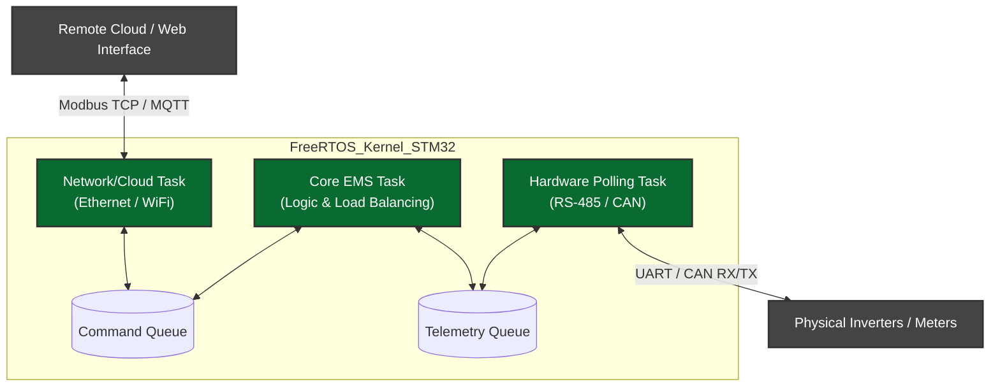
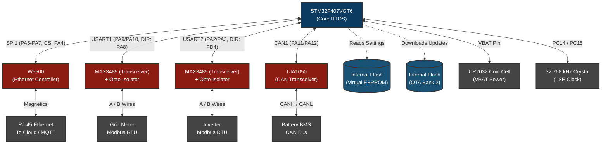

# System Design Document: EMS Mini RTOS (`ems-mini-rtos`)

## 1. Executive Summary
The **EMS Mini RTOS** project is a lightweight, microcontroller-focused implementation of the Energy Management System designed to run on STM32 hardware using **FreeRTOS**. 

Unlike the flagship `ems-app` (which runs on an i.MX93 application processor running Embedded Linux), the RTOS version is heavily constrained by memory, compute, and networking capabilities. Its primary goal is to act as a localized, deterministic bridge for immediate hardware protocol handling rather than a full-scale complex decision engine.

---

## 2. Platform Comparison: Embedded Linux (`ems-app`) vs. RTOS (`ems-mini-rtos`)

| Feature Set | `ems-app` (i.MX93 Embedded Linux) | `ems-mini-rtos` (STM32 FreeRTOS) |
| :--- | :--- | :--- |
| **Compute Constraints** | Multi-core Cortex-A55 (High clock, GBs RAM) | Cortex-M (MHz clock, KBs RAM/Flash) |
| **Multitasking** | Heavy POSIX Threads (`main.cpp`) | Lightweight RTOS Tasks (FreeRTOS core) |
| **IPC (Inter-Process)** | `libcem-ipc` Named Pipes & Redis Broker | FreeRTOS Message Queues & Semaphores |
| **Load Balancing Logic** | Complex (Peak Shaving, Valley Filling, Timeslots) | **Basic / Pass-through** (No complex goal parsing) |
| **Web Interface** | `ems-monitor` (aiohttp Python dashboard) | **None** (No web server or Python capabilities) |
| **Database/Caching** | Redis (Data, Timeslots, Events) | **None** (In-RAM volatile variables only) |
| **Programmable Logic (PLC)** | Fully executed `logic.cpp` equation evaluator | **None** (Requires strings/evaluators too heavy for RTOS) |

---

## 3. Core Operational Scope of EMS Mini RTOS

Because the environment lacks a full OS, the `ems-mini-rtos` focuses heavily on hardware interfacing.

### Achievable Features
#### 1. ✅ **Deterministic Protocol Bridging:** Real-time translation of messages between the main compute unit (via SPI or USB) and physical downstream devices. 
#### 2. ✅ **Hard Real-Time Polling:** Modbus/RS-485 and CAN polling loops can operate with microsecond jitter accuracy (unlike Linux user-space threading).
#### 3. ✅ **Hardware Watchdogs & Failsafes:** Immediate hardware power-cut or contactor control if thresholds are breached, without waiting for an OS scheduler.
#### 4. ✅ **Basic Power Limiting:** Simple cutoff loops (e.g., if Battery Voltage > X, stop charge command) rather than complex predictive timeslots.

### Dropped Features
#### 1. ❌ **Python `ems-monitor` Dashboard:** Cannot host `aiohttp` or WebSockets. Any UI must be hosted externally or replaced with simple LED/Display outputs.
#### 2. ❌ **Redis Timeslot & Streaming:** Cannot cache days of historical data or multi-hour timeslot predictions.
#### 3. ❌ **Dynamic PLC Scripting:** The `logic.cpp` engine which evaluates custom text equations at runtime is too computationally expensive and requires too much string-parsing memory for a microcontroller.
#### 4. ❌ **Sophisticated Multi-Phase Balancing:** Complex distribution matrices across unknown future topologies are replaced by strict, hardcoded single-target arrays.

---

## 4. Architectural Design (FreeRTOS)

As an independent, standalone device, the RTOS architecture pivots from a host/slave model to a fully autonomous manager using *RTOS Tasks*.

### 4.1 Internal Protocol State Machine 
Without a Linux host, the core RTOS handles transactions and telemetry completely autonomously:
1. `STATE_POLL`: Actively queries slave devices via DMA over UART (RS-485) or CAN.
2. `STATE_ANALYZE`: Parses the received payload, checking against safety limits (e.g. Battery Voltage).
3. `STATE_CONTROL`: Executes local smart logic (failsafes, peak-shaving, or simple limits).
4. `STATE_PUBLISH`: Pushes summarized telemetry to the Network Task for external monitoring.

---

## 5. Achievable Load Balancing Logic

Without a Linux application processor to parse complex JSON scheduling arrays, the RTOS load balancing must be deterministic, instantaneous, and strictly bounded. 

### 5.1 What we CAN achieve on RTOS:
*   **Instantaneous Peak Shaving:** If the Grid Meter reads import > `MaxLimit`, the STM32 instantly commands the battery inverter to Discharge the delta.
*   **Instantaneous Valley Filling:** If the Grid Meter reads export > `Abs(MinLimit)`, the STM32 instantly commands the battery to Charge.
*   **Time-of-Use (Basic):** If an external RTC (Real Time Clock) chip is equipped, the STM32 can hold a daily static array (e.g. 02:00-05:00 = Force Charge). **However, dynamic schedules must be pushed via the Cloud** rather than generated locally.
*   **Zero-Export Compliance:** Hardcoded limit loops guaranteeing grid import never drops below 0W, updating at the speed of the RS-485 poll rate (e.g., every 500ms).

### 5.2 What we CANNOT achieve (Dropped from Linux):
*   No multi-day predictive timeslots stored locally.
*   No dynamic equation parsing (e.g. `If PV > 500 AND SOC < 20`). Logic must be hardcoded in C.

---

## 6. Internet, Cloud, and Setting Architecture

To make `ems-mini-rtos` a fully independent bridging controller, it requires network integration and non-volatile memory management.

### 6.1 Internet Access Strategy
To achieve reliable internet without exhausting STM32 RAM:
1.  **Hardware Offload (Recommended):** Use a **WIZnet W5500** Ethernet chip via SPI. The W5500 hardware handles the entire TCP/IP stack, Socket buffers, and ARP/ICMP natively. The STM32 just sends/receives raw payload bytes over SPI.
2.  **Wireless Offload:** An **ESP32-C3** connected via UART acting as an AT-Command WiFi Modem.
3.  **Native Stack (Complex):** STM32 with internal Ethernet MAC + PHY (LAN8720) running the **LwIP (Lightweight IP)** stack inside FreeRTOS. *Note: LwIP is highly memory intensive.*

### 6.2 Cloud Level Control (IoT integration)
Instead of a localized web dashboard (`ems-monitor`), the device will act purely as an IoT edge node.
*   **Protocol:** **MQTT** (Message Queuing Telemetry Transport).
*   **Implementation:** Use `coreMQTT` (from FreeRTOS) or Eclipse Paho C. 
*   **Telemetry (Up):** The RTOS `Task_Net` publishes a summarized, lightweight JSON or binary struct to `device/{id}/telemetry` every 5 seconds.
*   **Control (Down):** The RTOS subscribes to `device/{id}/command`. The Cloud server sends setpoints (e.g., `{"mode": "charge", "power": 3000}`). The STM32 parses this and updates its internal `Command Queue`.

### 6.3 User Setting Approach (Persistence)
Without Linux filesystems or Redis, settings must survive power loss directly in ROM.
*   **EEPROM Emulation:** A specific sector of the STM32 internal Flash memory is reserved for settings.
*   **Data Structure:** Settings are defined as a packed C `struct` (e.g. `struct UserConfig { uint32_t max_import; uint32_t max_export; uint8_t default_mode; }`).
*   **Workflow:** On Boot, the STM32 copies this Flash sector into a RAM struct. If a Cloud Command changes a setting, the STM32 pauses interrupts, erases the Flash sector, and writes the updated struct back to Flash.

### 6.4 Secure Boot & OTA (Over-The-Air) Firmware Updates
OTA on a microcontroller requires a custom bootloader and partitioned Flash memory. Security is paramount; an unauthorized firmware image could cause catastrophic hardware damage.
*   **Flash Partitioning:** The STM32 Flash is split into three zones: `Bootloader` (0x08000000), `Bank 1 (Active App)`, and `Bank 2 (Download Slot)`.
*   **The Process & Secure Boot:** 
    1. The active RTOS downloads the cryptographically signed `.bin` file via HTTP/MQTT in small chunks to `Bank 2`.
    2. After the download, the RTOS sets an "Update Pending" signature trailer and triggers a CPU reset.
    3. The **Bootloader** wakes up and reads its embedded **Public Key**.
    4. **Secure Boot Verification:** The Bootloader verifies the **ECDSA P-256 cryptographic signature** of the `Bank 2` image. If the signature is invalid (meaning the payload is altered or spoofed), the update is aborted immediately, preventing execution of malicious code.
    5. If explicitly verified, it securely erases `Bank 1`, copies `Bank 2` into `Bank 1`, and boots the new firmware.
*   **Frameworks:** **MCUboot** is the industry standard open-source secure bootloader for 32-bit microcontrollers, natively supporting these cryptographic signatures and integrating flawlessly with FreeRTOS.

---

## 7. Schematic Integration Strategy

Since the STM32 acts as the sole brain, it requires physical layer (PHY) transceivers to bridge the microcontroller's logic-level signals to industrial voltages.

### 7.1 RS-485 (Modbus RTU)
*   **Microcontroller Output:** Standard UART (TX/RX) & a GPIO (Direction Control).
*   **Transceiver Chip:** **MAX3485** or **SN65HVD485E** (3.3V logic compatible).
*   **Integration:** The GPIO pin toggles the `RE`/`DE` pins on the transceiver to switch between transmitting and receiving. FreeRTOS handles the precise microsecond timing required to flip this pin after the DMA transmit completes.
*   **Isolation:** Add an optocoupler (e.g., **6N137**) or use an isolated transceiver (e.g., **ISO1410**) to protect the STM32 from grid voltage spikes on the RS-485 bus.
*   **Device Capacity:** RS-485 is a **multi-drop bus**. A single MAX3485 transceiver can theoretically support up to 32 standard devices (or up to 256 devices with 1/8th load transceivers) daisy-chained together on the same two wires (A/B), as long as each device has a unique Modbus Slave ID.

### 7.2 CAN Bus (Battery Comms)
*   **Microcontroller Output:** Dedicated CAN TX/RX pins (built into most STM32 models like STM32F1/F4/G4).
*   **Transceiver Chip:** **TJA1050** or **SN65HVD230** (3.3V compatible).
*   **Integration:** The STM32's internal bxCAN/FDCAN controller handles the protocol logic. The transceiver only handles the physical differential signaling (CANH / CANL). Requires a 120-ohm termination resistor.
*   **Device Capacity:** CAN is also a **multi-drop bus**. You can daisy-chain multiple physical battery racks onto this single CAN line, managed by packet arbitration.

### 7.3 Practical Device Limits for RTOS Load Balancing
While the *physical chips* allow up to 32 or 256 devices, the **real bottleneck for RTOS load balancing is the Polling Loop Time**.

To execute "Instantaneous Peak Shaving," the system must read the Grid Meter, read the Batteries, analyze, and dispatch a command to the Inverter in **under 1000 milliseconds (1 second)**. 

**Modbus RTU (RS-485) Time Cost:**
Modbus is a sequential *Request/Response* protocol. At standard industrial speeds (9600 bps), a typical telemetry packet request + response + inter-frame delay takes roughly **40ms to 60ms** per device. 
*   If you connect 5 inverters on `USART2`, polling them all takes `5 x 50ms = 250ms`. 
*   If you tried to connect 32 inverters on `USART2`, polling them all would take `32 x 50ms = 1,600ms`. By the time the loop finishes reading inverter #32, the data from inverter #1 is almost 2 seconds old. You cannot do instantaneous peak-shaving with 2-second-old data.

**CAN Bus Time Cost:**
CAN operates at much higher speeds (e.g., 250kbps or 500kbps) and handles collisions gracefully in hardware. Reading 15 batteries takes only **10ms to 20ms**.

**Deep Analysis Conclusion (Optimal Configuration):**
To maintain strict, lightning-fast RTOS efficiency (<500ms control loops) without choking the FreeRTOS `Task_Poll`, we must dedicate the buses logically:

*   **Bus 1 (`USART1` - High Speed Focus):** Strictly reserved for **1 Grid Meter**. The RTOS polls it insanely fast (e.g., every 50ms) to catch utility grid spikes instantly.
*   **Bus 2 (`USART2` - Bulk Focus):** Daisy-chain between **1 to 10 Solar Inverters maximum**. This creates a predictable ~500ms max poll loop.
*   **Bus 3 (`CAN1`):** Daisy-chain up to **15 Battery Racks**. CAN handles high traffic beautifully without burdening the CPU.
*   **Total Recommended System Size:** About **~25 physical devices** managed by one STM32 chunk calculating energy flow multiple times per second. If a site requires more than 10 inverters, they should be split across a higher-end STM32 with more USART hardware ports (e.g., using USART3, UART4, UART5 in parallel) to prevent sequential polling delays.

### 7.4 Recommended Microcontroller
The **STM32F407VGT6** is the highly recommended baseline for this architecture:
*   **Flash:** 1 MB (Crucial to fit the dual-bank OTA `MCUboot` architecture).
*   **RAM:** 192 KB (Plenty of headroom for FreeRTOS, MQTT packet buffers, and JSON telemetry parsing).
*   **Hardware Interfaces:** Includes 2x `bxCAN` controllers, 6x UARTs, and an internal Ethernet MAC.
*   **Supply Chain:** It is one of the most widely used, reliable, and easily sourced Cortex-M4 chips in industrial automation.

### 7.4 Explicit Peripheral & Pin Mapping (STM32F407VGT6)
To facilitate custom PCB design, the following specific peripherals and pins are assigned to the external interfaces:

| Interface Target | STM32 Peripheral | TX / MOSI Pin | RX / MISO Pin | Clock / SCL | Control Pins |
| :--- | :--- | :--- | :--- | :--- | :--- |
| **Grid Meter (RS-485)** | `USART1` | **PA9** | **PA10** | - | **PA8** (DE/RE Toggle) |
| **Inverter (RS-485)** | `USART2` | **PA2** | **PA3** | - | **PD4** (DE/RE Toggle) |
| **Battery BMS (CAN)** | `CAN1` | **PA12** | **PA11** | - | - |
| **Ethernet (W5500)** | `SPI1` | **PA7** | **PA6** | **PA5** | **PA4** (Chip Select), **PC4** (Reset) |
| **Debug Console** | `USART3` | **PB10** | **PB11** | - | - |
### 7.5 System Hardware Block Diagram

This illustrates the exact physical layer bridging strategy centering on the STM32F407VGT6.

---

## 8. Next Steps for Implementation
1. Scaffold STM32CubeIDE project with FreeRTOS and LwIP/SPI enabled targeting the `STM32F407`.
2. Integrate MCUboot for the secondary bootloader requirement.

---

## 9. STM32CubeIDE Initial Configuration

When creating the `ems-mini-rtos` project in STM32CubeIDE for the `STM32F407VGT6`, follow these device configuration `.ioc` steps to guarantee hardware compatibility with the architecture diagram.

### 9.0 Project Creation Settings
When initially creating the New STM32 Project:
* **Targeted Language**: **C** (Recommended over C++ for optimal FreeRTOS/HAL compatibility and deterministic memory management).
* **Targeted Binary Type**: **Executable** (We are building the final application that will run on the MCU, not a static library (`.a`) to be linked elsewhere).
* **Project Type**: **STM32Cube** (To use the rich graphical `.ioc` configurator).

### 9.1 System Core
* **SYS**: 
    * `Debug`: **Serial Wire** (for ST-LINK debugging).
    * `Timebase Source`: **TIM1** (FreeRTOS requires SysTick exclusively).
* **RCC**: 
    * `High Speed Clock (HSE)`: **Crystal/Ceramic Resonator** (assuming an external crystal, typically 8MHz or 25MHz, is present on the board).

### 9.2 Clock Tree Architecture (Interview / Deep Dive)
Understanding the STM32 Clock Tree is critical for hardware engineers and embedded firmware developers. The microcontrollers contain multiple internal buses that run at different maximum speeds.

#### Definitions:
* **HSI (High-Speed Internal):** The MCU's built-in RC oscillator (usually 16 MHz). It is physically internal to the silicon. While it works without external components, it drifts with temperature and is often not precise enough for high-speed deterministic communications like CAN or Ethernet.
* **HSE (High-Speed External):** An external quartz crystal oscillator connected to the MCU pins. It is highly precise and stable, making it the industry standard for production boards.
* **PLL (Phase-Locked Loop):** A hardware multiplier circuit. It takes a slower input clock (like the 8MHz HSE or 16MHz HSI), mathematically multiplies/divides it (via M, N, P, Q parameters), and generates a much higher frequency (e.g., 168 MHz) to drive the core processor.
* **AHB (Advanced High-performance Bus):** The main backbone bus of the ARM Cortex architecture. Memory (Flash/RAM), DMA, and networking peripherals sit here. On the STM32F407, its maximum speed is **168 MHz** (`HCLK`).
* **APB (Advanced Peripheral Bus):** Slower buses bridging to external I/O.
    * **APB1 (Low Speed):** Connects to slower peripherals like `USART2`, `USART3`, and `CAN1`. Max speed is **42 MHz** (`PCLK1`).
    * **APB2 (High Speed):** Connects to faster peripherals like `USART1` and `SPI1`. Max speed is **84 MHz** (`PCLK2`).

#### Configuration Steps:
1. In the **Clock Configuration** tab, ensure the **System Clock Mux** is set to **PLLCLK** (not HSI).
2. Type **168** into the `HCLK (MHz)` box and let CubeIDE auto-solve.
3. This pushes the APB1 Peripheral Clock (`PCLK1`) to **42 MHz**, which directly drives the CAN1 hardware node.

#### CAN Baud Rate Derivation (`250 kbps` example):
CAN timing is calculated based on the APB1 clock feeding it. The bit time is divided into small chunks called "Time Quanta" ($t_q$).
* **Equation:** `BaudRate = APB1_Clock / Prescaler / Total_Quanta_Per_Bit`
* **Target:** 250,000 bps
* **Given APB1 Clock:** 42,000,000 Hz
* **Selected Prescaler:** 8
* **Resulting Time Quantum Phase:** 42MHz / 8 = 5.25 MHz (or roughly 190ns per quantum).

To get 250,000 bps from 5.25 MHz, dividing them reveals we need exactly **21 Quanta per bit**.
The total quanta is always: `1 (Sync Segment) + Time Segment 1 + Time Segment 2 = Total`
Therefore, setting **Time Seg 1 = 16** and **Time Seg 2 = 4** yields: $1 + 16 + 4 = 21$.
Proof: `42,000,000 / 8 / 21 = 250,000 bps`.

### 9.3 Middleware & Software Packages
* **FREERTOS**:
    * Interface: **CMSIS_V2** (Preferred).
    * Task generation will be handled manually in code rather than via GUI.

### 9.4 Connectivity (Hardware Interfaces)
* **USART1 (Grid Meter)**
    * Mode: **Asynchronous**, Baud: `9600`.
    * Pins: `PA9` (TX), `PA10` (RX).
    * Interrupts: Enable `USART1 global interrupt`.
    * DMA: Add `USART1_RX` and `USART1_TX`.
* **USART2 (Inverters)**
    * Mode: **Asynchronous**, Baud: `9600`.
    * Pins: `PA2` (TX), `PA3` (RX).
    * Interrupts: Enable `USART2 global interrupt`.
    * DMA: Add `USART2_RX` and `USART2_TX`.
* **USART3 (Debug Console)**
    * Mode: **Asynchronous**, Baud: `115200`.
    * Pins: `PB10` (TX), `PB11` (RX).
* **CAN1 (Battery BMS)**
    * Mode: **Master** (or Activated).
    * Pins: `PA11` (RX), `PA12` (TX).
    * Interrupts: Enable `CAN1 RX0 interrupt`.
    * Parameter Settings - Bit Timings:
        * Prescaler: `8`
        * Time Quanta in Bit Segment 1: `16 Times`
        * Time Quanta in Bit Segment 2: `4 Times`
        * *(This mathematically derives a clean 250 kbps from the 42 MHz APB1 clock).*
    * Parameter Settings - Basic Parameters (Reliability Logic):
        * **Automatic Bus-Off Management**: `Enable`. 
          * *Logic:* In industrial environments, severe electrical noise can cause the STM32's internal CAN Error Counters to exceed 255, throwing the hardware into a protective "Bus-Off" state so it stops polluting the network. If this is disabled, the STM32 permanently stays off the bus until the CPU is hard-rebooted. By enabling this, the hardware automatically attempts recovery and safely rejoins the bus once the noise subsides, ensuring maximum uptime without RTOS intervention.
        * **Automatic Retransmission**: `Enable`.
          * *Logic:* CAN is a collision-domain protocol. If two nodes talk at exactly the same time, one loses arbitration. Or, if the battery fails to send an Acknowledge (ACK) bit due to transient interference, the packet is considered dropped. By enabling this, the STM32's silicon hardware will automatically resend the packet in the background without waking up the FreeRTOS software tasks, significantly saving CPU clock cycles and simplifying the FreeRTOS `Task_Poll` code.
* **SPI1 (W5500 Ethernet)**
    * Mode: **Full-Duplex Master**.
    * Pins: `PA5` (SCK), `PA6` (MISO), `PA7` (MOSI).

### 9.5 GPIO Pins (Control & Toggles)
In the *System Core > GPIO* section, assign the following pins as **GPIO_Output**:
* **PA8**: Name `RS485_1_DE` (Toggle Grid meter MAX3485 transmit mode).
* **PD4**: Name `RS485_2_DE` (Toggle Inverter MAX3485 transmit mode).
* **PA4**: Name `W5500_CS` (SPI Chip Select for Ethernet).
* **PC4**: Name `W5500_RST` (Hardware Reset for Ethernet).

### 9.6 Project Generation
In the **Project Manager** tab -> **Code Generator**:
* Enable **"Generate peripheral initialization as a pair of '.c/.h' files per peripheral"** to keep `main.c` clean.
